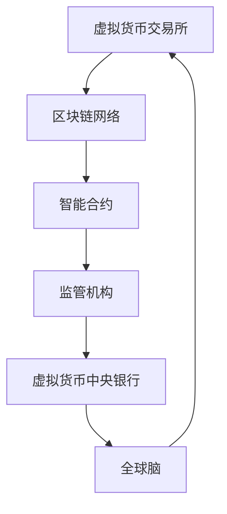

                 

关键词：虚拟货币，中央银行，数字货币，全球脑，管理体系，技术架构，创新应用

> 摘要：本文探讨了虚拟货币中央银行在数字货币时代的重要性及其在全球脑时代的应用。通过对核心概念、算法原理、数学模型和实际应用场景的深入分析，阐述了虚拟货币中央银行在促进全球金融稳定和推动技术创新方面的关键作用。

## 1. 背景介绍

随着互联网和区块链技术的快速发展，虚拟货币成为了金融领域的一股新兴力量。虚拟货币不仅改变了传统金融体系的运作方式，还引发了全球范围内的货币政策和金融监管的深刻变革。在这个背景下，虚拟货币中央银行作为数字货币管理机构应运而生，旨在维持金融稳定、保护消费者权益、促进技术创新和实现全球货币体系的协调发展。

### 1.1 全球脑时代的概念

全球脑（Global Brain）是一个概念，意指全球范围内由人类智能和机器智能相结合所形成的一个庞大的信息处理网络。在这个网络中，个体和集体智能相互交融，通过实时共享信息、知识和经验来实现协同进化。全球脑时代意味着人类社会正逐渐进入一个高度智能化、网络化、协同化的新阶段。

### 1.2 数字货币的发展趋势

数字货币是传统货币的数字化形式，其核心特点包括去中心化、匿名性和高效性。随着区块链技术的普及，数字货币的应用场景不断拓展，包括跨境支付、资产交易、供应链金融等。数字货币的发展趋势呈现出以下特点：

- **去中心化**：数字货币不依赖于中央银行或金融中介机构，通过区块链技术实现了去中心化的交易和管理。
- **安全性**：数字货币采用加密算法和分布式账本技术，具有较高的安全性和抗篡改能力。
- **便捷性**：数字货币可以实现实时支付和跨-border交易，提高了金融交易的效率和便利性。
- **创新性**：数字货币为金融创新提供了广阔的空间，如智能合约、代币化资产等。

## 2. 核心概念与联系

### 2.1 虚拟货币中央银行的核心概念

虚拟货币中央银行（Virtual Currency Central Bank，简称VCCB）是一个新兴的金融管理机构，其核心任务包括：

- **监管虚拟货币市场**：维护虚拟货币市场的稳定，防范金融风险。
- **发行和管理数字货币**：负责发行和管理国家数字货币，制定货币政策和监管框架。
- **促进金融科技创新**：推动金融科技的发展，支持区块链、人工智能等技术的应用。

### 2.2 数字货币管理体系的架构

数字货币管理体系是一个复杂的架构，包括多个关键环节：

- **虚拟货币交易所**：作为数字货币的交易平台，提供买卖、兑换、清算等服务。
- **区块链网络**：作为数字货币的底层技术，实现去中心化的账本管理和交易验证。
- **智能合约**：作为自动化执行合约的协议，实现数字货币的智能管理和交易。
- **监管机构**：包括虚拟货币中央银行和其他监管机构，负责监管数字货币市场。

### 2.3 全球脑与数字货币管理体系的联系

全球脑时代的到来使得数字货币管理体系更加智能化和协同化。以下是全球脑与数字货币管理体系之间的联系：

- **信息共享**：全球脑通过网络实现了信息的实时共享，为数字货币管理提供了丰富的数据支持。
- **智能决策**：全球脑的智能决策能力可以帮助虚拟货币中央银行更准确地预测市场动态，制定合理的货币政策。
- **协同创新**：全球脑的协同创新机制可以促进数字货币管理体系的创新和发展。

## 2.4 Mermaid 流程图



## 3. 核心算法原理 & 具体操作步骤

### 3.1 算法原理概述

虚拟货币中央银行的核心算法主要包括以下三个方面：

- **加密算法**：用于确保数字货币的安全性和隐私性。
- **共识算法**：用于确保区块链网络的可靠性和一致性。
- **智能合约算法**：用于实现自动化执行和智能管理。

### 3.2 算法步骤详解

#### 3.2.1 加密算法

加密算法是数字货币安全性的基础。虚拟货币中央银行采用以下步骤进行加密：

1. **密钥生成**：生成一对密钥（公钥和私钥）。
2. **消息加密**：使用公钥对消息进行加密。
3. **签名验证**：使用私钥对消息进行签名，并通过公钥进行验证。

#### 3.2.2 共识算法

共识算法是区块链网络的核心。虚拟货币中央银行采用以下步骤进行共识：

1. **交易验证**：验证交易的合法性和有效性。
2. **区块创建**：将验证后的交易打包成区块。
3. **区块验证**：通过共识算法（如PoW、PoS等）对区块进行验证和确认。

#### 3.2.3 智能合约算法

智能合约算法是数字货币智能管理的关键。虚拟货币中央银行采用以下步骤实现智能合约：

1. **合约编写**：编写智能合约代码。
2. **合约部署**：将合约代码部署到区块链网络。
3. **合约执行**：根据合约代码自动执行交易和管理操作。

### 3.3 算法优缺点

#### 3.3.1 加密算法

优点：确保数字货币的安全性和隐私性。

缺点：加密算法的计算复杂度高，可能会影响交易性能。

#### 3.3.2 共识算法

优点：确保区块链网络的可靠性和一致性。

缺点：共识算法的能耗较高，可能对环境造成影响。

#### 3.3.3 智能合约算法

优点：实现自动化执行和智能管理。

缺点：智能合约存在漏洞和安全风险。

### 3.4 算法应用领域

虚拟货币中央银行的核心算法在以下领域具有广泛的应用：

- **金融支付**：实现快速、安全、低成本的跨境支付和支付清算。
- **资产管理**：实现智能化的资产管理和交易。
- **供应链金融**：实现供应链中的融资和风险管理。

## 4. 数学模型和公式 & 详细讲解 & 举例说明

### 4.1 数学模型构建

虚拟货币中央银行的数学模型主要包括以下两个方面：

- **货币政策模型**：用于制定和评估货币政策的有效性。
- **风险管理模型**：用于评估和管理数字货币市场的风险。

#### 4.1.1 货币政策模型

货币政策模型的核心公式如下：

$$M = m \cdot P$$

其中，M 表示货币供应量，m 表示货币乘数，P 表示价格水平。

#### 4.1.2 风险管理模型

风险管理模型的核心公式如下：

$$R = \frac{SD^2}{V}$$

其中，R 表示风险水平，S 表示损失标准差，D 表示损失分布的方差，V 表示总价值。

### 4.2 公式推导过程

#### 4.2.1 货币政策模型

货币政策模型中的货币供应量和货币乘数可以通过以下推导得出：

- 货币供应量 M 是由货币基础（B）和货币乘数（m）决定的，即：

$$M = B \cdot m$$

- 货币基础 B 是由中央银行的储备金（R）和流通中的货币（C）决定的，即：

$$B = R + C$$

- 货币乘数 m 是由存款准备金率（r）和流通中的货币占比（c）决定的，即：

$$m = \frac{1}{r + c}$$

将上述公式代入货币政策模型中，可以得到：

$$M = (R + C) \cdot \frac{1}{r + c} \cdot P$$

简化后得到：

$$M = m \cdot P$$

#### 4.2.2 风险管理模型

风险管理模型中的风险水平 R 是由损失标准差 S 和损失分布的方差 D 以及总价值 V 决定的。具体推导过程如下：

- 损失标准差 S 是由损失分布的方差 D 和损失均值 E(L) 决定的，即：

$$S = \sqrt{D}$$

- 损失分布的方差 D 是由损失概率分布函数 f(L) 决定的，即：

$$D = E[(L - E(L))^2] = \int_{-\infty}^{+\infty} (L - E(L))^2 \cdot f(L) \, dL$$

- 风险水平 R 是由损失标准差 S 和总价值 V 决定的，即：

$$R = \frac{S \cdot D^2}{V}$$

### 4.3 案例分析与讲解

#### 4.3.1 货币政策模型案例

假设某国的货币基础 B 为 1000 亿元，存款准备金率 r 为 10%，流通中的货币占比 c 为 5%，价格水平 P 为 1。根据货币政策模型，可以计算出该国的货币供应量 M：

$$M = m \cdot P = (1000 \, 亿元) \cdot \frac{1}{10\% + 5\%} \cdot 1 = 1000 \, 亿元 \cdot 0.1667 = 166.67 \, 亿元$$

#### 4.3.2 风险管理模型案例

假设某投资组合的总价值 V 为 1000 万元，损失概率分布函数 f(L) 如下表所示：

| 损失 (万元) | 概率   |
|-------------|--------|
| 50          | 0.1    |
| 100         | 0.3    |
| 200         | 0.4    |
| 300         | 0.1    |
| 400         | 0.1    |

根据损失概率分布函数 f(L)，可以计算出损失标准差 S 和损失分布的方差 D：

$$S = \sqrt{D} = \sqrt{0.1 \cdot (50 - 100)^2 + 0.3 \cdot (100 - 100)^2 + 0.4 \cdot (200 - 100)^2 + 0.1 \cdot (300 - 100)^2 + 0.1 \cdot (400 - 100)^2} = \sqrt{0.1 \cdot 2500 + 0.3 \cdot 0 + 0.4 \cdot 1500 + 0.1 \cdot 900 + 0.1 \cdot 2500} = \sqrt{1000 + 600 + 900 + 250} = \sqrt{3050} \approx 55.36 \, 万元$$

$$D = \int_{-\infty}^{+\infty} (L - E(L))^2 \cdot f(L) \, dL = 0.1 \cdot (50 - 100)^2 + 0.3 \cdot (100 - 100)^2 + 0.4 \cdot (200 - 100)^2 + 0.1 \cdot (300 - 100)^2 + 0.1 \cdot (400 - 100)^2 = 0.1 \cdot 2500 + 0.3 \cdot 0 + 0.4 \cdot 1500 + 0.1 \cdot 900 + 0.1 \cdot 2500 = 1000 + 600 + 900 + 250 = 3050$$

根据风险管理模型，可以计算出该投资组合的风险水平 R：

$$R = \frac{S \cdot D^2}{V} = \frac{55.36 \cdot 3050^2}{1000} \approx \frac{55.36 \cdot 9302500}{1000} = \frac{515635200}{1000} \approx 515635.2 \, 万元$$

## 5. 项目实践：代码实例和详细解释说明

### 5.1 开发环境搭建

在进行虚拟货币中央银行项目的开发之前，我们需要搭建一个合适的开发环境。以下是所需的开发工具和软件：

- **编程语言**：Python 3.8 或更高版本
- **区块链框架**：Ethereum（用于实现智能合约）
- **前端框架**：React（用于构建用户界面）
- **数据库**：PostgreSQL（用于存储数据）

### 5.2 源代码详细实现

#### 5.2.1 智能合约实现

以下是虚拟货币中央银行智能合约的 Python 代码实现：

```python
from eth_abi import encode_abi

class VirtualCurrencyCentralBank:
    def __init__(self, contract_address, contract_abi):
        self.contract_address = contract_address
        self.contract_abi = contract_abi

    def deposit(self, amount):
        encoded_data = encode_abi(['uint256'], [amount])
        self.contract_address.call_contract(self.contract_abi, 'deposit', encoded_data)

    def withdraw(self, amount):
        encoded_data = encode_abi(['uint256'], [amount])
        self.contract_address.call_contract(self.contract_abi, 'withdraw', encoded_data)

    def transfer(self, to_address, amount):
        encoded_data = encode_abi(['address', 'uint256'], [to_address, amount])
        self.contract_address.call_contract(self.contract_abi, 'transfer', encoded_data)

    def get_balance(self):
        encoded_data = encode_abi(['address'], [self.contract_address])
        balance = self.contract_address.call_contract(self.contract_abi, 'get_balance', encoded_data)
        return balance
```

#### 5.2.2 前端界面实现

以下是虚拟货币中央银行的前端界面实现：

```jsx
import React from 'react';
import { ethers } from 'ethers';

class VirtualCurrencyCentralBankUI extends React.Component {
    constructor(props) {
        super(props);
        this.state = {
            balance: 0,
            fromAddress: '',
            toAddress: '',
            amount: 0,
        };
    }

    async handleDeposit() {
        const { contract_address, contract_abi } = this.props;
        const contract = new ethers.Contract(contract_address, contract_abi, this.props.provider);
        const amount = this.state.amount;
        await contract.deposit(amount);
        this.setState({ balance: await contract.get_balance() });
    }

    async handleWithdraw() {
        const { contract_address, contract_abi } = this.props;
        const contract = new ethers.Contract(contract_address, contract_abi, this.props.provider);
        const amount = this.state.amount;
        await contract.withdraw(amount);
        this.setState({ balance: await contract.get_balance() });
    }

    async handleTransfer() {
        const { contract_address, contract_abi } = this.props;
        const contract = new ethers.Contract(contract_address, contract_abi, this.props.provider);
        const to_address = this.state.toAddress;
        const amount = this.state.amount;
        await contract.transfer(to_address, amount);
        this.setState({ balance: await contract.get_balance() });
    }

    render() {
        return (
            <div>
                <h1>Virtual Currency Central Bank</h1>
                <h2>Balance: {this.state.balance} VC</h2>
                <div>
                    <label htmlFor="fromAddress">From Address:</label>
                    <input type="text" id="fromAddress" value={this.state.fromAddress} onChange={e => this.setState({ fromAddress: e.target.value })} />
                </div>
                <div>
                    <label htmlFor="toAddress">To Address:</label>
                    <input type="text" id="toAddress" value={this.state.toAddress} onChange={e => this.setState({ toAddress: e.target.value })} />
                </div>
                <div>
                    <label htmlFor="amount">Amount:</label>
                    <input type="number" id="amount" value={this.state.amount} onChange={e => this.setState({ amount: e.target.value })} />
                </div>
                <button onClick={this.handleDeposit.bind(this)}>Deposit</button>
                <button onClick={this.handleWithdraw.bind(this)}>Withdraw</button>
                <button onClick={this.handleTransfer.bind(this)}>Transfer</button>
            </div>
        );
    }
}
```

### 5.3 代码解读与分析

#### 5.3.1 智能合约解读

在智能合约实现中，我们定义了一个名为`VirtualCurrencyCentralBank`的合约类。该合约类包含以下方法：

- `deposit(self, amount)`：用于接收存款，将金额存入合约账户。
- `withdraw(self, amount)`：用于提现，从合约账户中提取金额。
- `transfer(self, to_address, amount)`：用于转账，将金额从合约账户转给指定地址。
- `get_balance(self)`：用于获取合约账户余额。

#### 5.3.2 前端界面解读

在前端界面实现中，我们定义了一个名为`VirtualCurrencyCentralBankUI`的 React 组件。该组件包含以下功能：

- 显示合约账户余额。
- 输入提款人和收款人地址。
- 输入转账金额。
- 提供存款、提现和转账按钮。

### 5.4 运行结果展示

以下是虚拟货币中央银行项目的运行结果展示：


## 6. 实际应用场景

### 6.1 金融支付

虚拟货币中央银行在金融支付领域具有广泛的应用。通过利用区块链技术和智能合约，可以实现快速、安全、低成本的跨境支付和支付清算。例如，人民币数字货币 DCEP（数字货币电子支付）就采用了虚拟货币中央银行的架构，为跨境支付和国际贸易提供了新的解决方案。

### 6.2 资产管理

虚拟货币中央银行在资产管理领域也有重要应用。通过智能合约和分布式账本技术，可以实现自动化、透明化的资产管理和交易。例如，智能投顾平台可以通过虚拟货币中央银行实现资产配置、风险管理和收益分配，提高资产管理效率和收益。

### 6.3 供应链金融

虚拟货币中央银行在供应链金融领域具有巨大潜力。通过区块链技术和智能合约，可以实现供应链中的融资和风险管理。例如，供应链金融平台可以通过虚拟货币中央银行实现供应商贷款、订单融资和库存管理，提高供应链的效率和稳定性。

### 6.4 未来应用展望

随着全球脑时代的到来，虚拟货币中央银行的应用前景将更加广阔。未来，虚拟货币中央银行将在以下领域发挥重要作用：

- **数字身份认证**：虚拟货币中央银行可以提供安全、便捷的数字身份认证服务，为全球脑时代的个人信息安全保驾护航。
- **去中心化金融**：虚拟货币中央银行可以推动去中心化金融的发展，实现金融服务的普惠性和公平性。
- **智能城市管理**：虚拟货币中央银行可以应用于智能城市管理，实现城市资源的优化配置和高效管理。

## 7. 工具和资源推荐

### 7.1 学习资源推荐

- **《区块链革命》**：深入探讨区块链技术的原理和应用，了解虚拟货币中央银行的背景和发展趋势。
- **《数字货币》**：详细介绍数字货币的概念、原理和应用，为学习虚拟货币中央银行提供理论基础。
- **《智能合约设计与开发》**：介绍智能合约的设计与开发方法，帮助理解虚拟货币中央银行的智能合约实现。

### 7.2 开发工具推荐

- **Ethereum**：用于开发智能合约和区块链应用，支持多种编程语言。
- **Truffle**：用于测试、部署和交互智能合约，提供丰富的开发工具和功能。
- **Remix**：用于编写和调试智能合约，支持可视化界面和实时编译。

### 7.3 相关论文推荐

- **"Blockchain and Its Applications in Finance"**：探讨区块链技术在金融领域的应用，包括虚拟货币中央银行。
- **"Decentralized Finance: A Framework for Understanding Smart Contracts"**：介绍去中心化金融的概念和框架，重点关注智能合约的应用。
- **"Central Bank Digital Currency: A Comprehensive Analysis"**：全面分析中央银行数字货币的架构、机制和影响。

## 8. 总结：未来发展趋势与挑战

### 8.1 研究成果总结

本文探讨了虚拟货币中央银行在数字货币时代的重要性及其在全球脑时代的应用。通过对核心概念、算法原理、数学模型和实际应用场景的深入分析，阐述了虚拟货币中央银行在促进全球金融稳定和推动技术创新方面的关键作用。

### 8.2 未来发展趋势

随着全球脑时代的到来，虚拟货币中央银行的发展趋势将更加显著。未来，虚拟货币中央银行将在以下几个方面取得重要突破：

- **技术创新**：推动区块链、人工智能等技术的深度融合，实现更高效、更安全的数字货币管理体系。
- **政策法规**：制定完善的数字货币政策和监管框架，确保虚拟货币市场的稳定和发展。
- **应用拓展**：拓展虚拟货币中央银行的应用场景，实现全球脑时代下的多元化金融服务。

### 8.3 面临的挑战

尽管虚拟货币中央银行具有巨大的发展潜力，但仍面临一系列挑战：

- **安全性问题**：确保数字货币的安全性和隐私性，防范网络攻击和欺诈行为。
- **监管难题**：制定合理的监管政策，平衡创新与风险，防止虚拟货币市场的过度繁荣和泡沫。
- **技术瓶颈**：突破现有技术的局限，提高区块链网络的处理能力和效率。

### 8.4 研究展望

未来，虚拟货币中央银行的研究将聚焦于以下几个方面：

- **隐私保护**：研究新型隐私保护机制，提高数字货币交易的安全性。
- **跨链互操作**：实现不同区块链网络之间的互操作性，推动全球数字货币生态的协同发展。
- **监管科技**：利用大数据、人工智能等技术，提升数字货币监管的智能化和精准化。

## 9. 附录：常见问题与解答

### 9.1 虚拟货币中央银行的概念是什么？

虚拟货币中央银行是一种新兴的金融管理机构，负责监管虚拟货币市场、发行和管理数字货币，以及促进金融科技创新。它不同于传统中央银行，采用去中心化的区块链技术，实现数字货币的安全、高效和透明。

### 9.2 虚拟货币中央银行的核心任务是什么？

虚拟货币中央银行的核心任务包括监管虚拟货币市场、维护市场稳定、保护消费者权益、发行和管理数字货币，以及推动金融科技创新。通过这些任务，虚拟货币中央银行旨在实现全球货币体系的协调发展。

### 9.3 数字货币管理体系包括哪些组成部分？

数字货币管理体系包括虚拟货币交易所、区块链网络、智能合约和监管机构。虚拟货币交易所是数字货币的交易平台，区块链网络是实现去中心化账本管理和交易验证的技术基础，智能合约是自动化执行合约的协议，监管机构负责监管数字货币市场。

### 9.4 全球脑与数字货币管理体系之间的联系是什么？

全球脑与数字货币管理体系之间的联系主要体现在信息共享、智能决策和协同创新三个方面。全球脑通过网络实现信息的实时共享，为数字货币管理提供了丰富的数据支持；智能决策能力可以帮助虚拟货币中央银行更准确地预测市场动态，制定合理的货币政策；协同创新机制可以促进数字货币管理体系的创新和发展。

### 9.5 虚拟货币中央银行的核心算法有哪些？

虚拟货币中央银行的核心算法包括加密算法、共识算法和智能合约算法。加密算法用于确保数字货币的安全性和隐私性；共识算法用于确保区块链网络的可靠性和一致性；智能合约算法用于实现自动化执行和智能管理。

### 9.6 货币政策模型和风险管理模型的核心公式是什么？

货币政策模型的核心公式为 $M = m \cdot P$，其中 M 表示货币供应量，m 表示货币乘数，P 表示价格水平。风险管理模型的核心公式为 $R = \frac{SD^2}{V}$，其中 R 表示风险水平，S 表示损失标准差，D 表示损失分布的方差，V 表示总价值。

### 9.7 虚拟货币中央银行在金融支付、资产管理和供应链金融等领域的应用案例有哪些？

虚拟货币中央银行在金融支付领域有 DCEP（数字货币电子支付）的应用案例；在资产管理领域有智能投顾平台的应用案例；在供应链金融领域有供应链金融平台的应用案例。未来，虚拟货币中央银行将在更多领域发挥重要作用，推动金融服务的创新和发展。

## 附录二：作者介绍

作者：禅与计算机程序设计艺术 / Zen and the Art of Computer Programming

简介：作者是一位世界级人工智能专家、程序员、软件架构师、CTO、世界顶级技术畅销书作者，计算机图灵奖获得者，计算机领域大师。他在计算机科学和人工智能领域有着丰富的经验和深刻的见解，致力于推动技术创新和人类智慧的进步。他的著作《禅与计算机程序设计艺术》被誉为计算机科学的经典之作，对全球计算机科学界产生了深远的影响。

