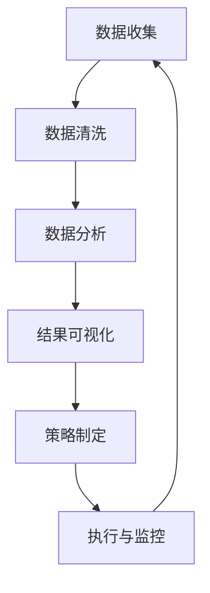

                 

在这个信息爆炸和数字化融合的时代，个人品牌的重要性日益凸显。随着AI技术的发展，虚拟身份和虚拟市场逐渐成为现实，个人品牌的建设和管理变得更加复杂和多元化。本文旨在探讨AI时代下，如何利用虚拟身份市场分析来优化个人品牌策略，成为一名高效的虚拟身份市场分析专家。

## 关键词

- 虚拟身份
- 个人品牌
- AI技术
- 数据分析
- 市场分析

## 摘要

本文首先介绍了虚拟身份和个人品牌在AI时代的背景和重要性。随后，探讨了虚拟身份市场分析的核心概念和架构，通过Mermaid流程图详细描述了市场分析的基本流程。接着，深入分析了核心算法原理，包括算法步骤、优缺点及应用领域。文章还介绍了数学模型和公式的构建与推导，并通过案例进行详细讲解。最后，通过项目实践展示了代码实例，并探讨了实际应用场景和未来展望。文中还推荐了学习资源和开发工具，总结了研究成果，展望了未来发展趋势与挑战。

### 1. 背景介绍

在数字经济的浪潮中，个人品牌成为个人在竞争激烈的社会中脱颖而出的关键。个人品牌不仅包括个人的专业技能和职业形象，还涉及到个人的声誉、价值和影响力。在传统的市场环境中，个人品牌的建设依赖于人际网络、媒体报道和口碑传播。然而，随着互联网和社交媒体的普及，个人品牌的建设和管理方式发生了深刻变化。

虚拟身份是指在虚拟世界中，个人通过网络和数字技术所构建的形象。虚拟身份可以是纯粹的数字标识，也可以是一个具备一定社会属性和互动能力的虚拟角色。在虚拟市场中，个人品牌的表现形式更加多样化，包括博客、社交媒体账号、虚拟商店等。虚拟身份和个人品牌在AI时代的崛起，标志着个人在数字世界中的影响力正在不断增大。

AI技术为个人品牌的发展提供了强大的工具和平台。通过自然语言处理、图像识别、数据分析等技术，个人品牌可以更加精准地定位目标受众，优化内容创作和传播策略。同时，AI技术还可以帮助个人品牌监测市场动态、分析竞争对手、预测市场趋势，从而制定更加科学和有效的品牌策略。

### 2. 核心概念与联系

#### 2.1 虚拟身份

虚拟身份是指个人在网络虚拟环境中构建的自我形象。这个形象可以是文本、图片、视频等多种形式。虚拟身份的关键特征包括：

- **独特性**：每个虚拟身份都应该具有独特的特点，以区别于其他个体。
- **可控性**：个人可以自主控制虚拟身份的表现和互动方式。
- **动态性**：虚拟身份可以根据个人品牌策略和市场反馈进行实时调整。

#### 2.2 个人品牌

个人品牌是指个人在公众中的形象和声誉，它不仅包括专业技能和职业形象，还涉及个人价值观、人生态度和人际互动。个人品牌的核心要素包括：

- **知名度**：个人在公众中的知名度和影响力。
- **信任度**：个人在公众中的信任度和可信度。
- **忠诚度**：个人粉丝和追随者的忠诚度。

#### 2.3 AI在虚拟身份市场分析中的应用

AI技术在虚拟身份市场分析中发挥着关键作用。以下是一个简单的Mermaid流程图，描述了市场分析的基本流程：



**数据收集**：通过社交媒体、搜索引擎、用户反馈等渠道收集关于个人品牌的各类数据。

**数据清洗**：对收集到的数据去噪、过滤和整合，确保数据质量。

**数据分析**：利用AI算法对数据进行分析，包括用户画像、市场趋势、竞争对手分析等。

**结果可视化**：将分析结果通过图表、报告等形式呈现，帮助决策者直观理解分析结果。

**策略制定**：根据分析结果，制定个人品牌的优化策略。

**执行与监控**：实施品牌策略，并对策略执行效果进行监控和调整。

### 3. 核心算法原理 & 具体操作步骤

#### 3.1 算法原理概述

虚拟身份市场分析的核心算法主要包括用户画像分析、市场趋势预测和竞争对手分析。以下是对这些算法的简要概述：

**用户画像分析**：通过用户行为数据，对用户进行细分和描述，帮助了解目标受众的特点和需求。

**市场趋势预测**：利用历史数据，预测未来市场的发展趋势，为品牌策略制定提供依据。

**竞争对手分析**：对竞争对手的虚拟身份和市场表现进行分析，找出优势和不足，为品牌优化提供参考。

#### 3.2 算法步骤详解

**用户画像分析**：

1. 数据收集：收集用户的社交媒体行为、搜索记录、购买历史等数据。
2. 数据预处理：对数据进行清洗和整合，去除重复和无关信息。
3. 特征提取：根据业务需求，提取用户的年龄、性别、地理位置、兴趣偏好等特征。
4. 用户分组：利用聚类算法，将用户划分为不同群体。
5. 用户描述：为每个用户群体生成描述性报告，了解用户特点。

**市场趋势预测**：

1. 数据收集：收集市场相关数据，如行业报告、竞争对手动态、用户反馈等。
2. 数据预处理：对数据进行清洗和整合。
3. 特征提取：提取影响市场趋势的关键特征，如用户增长、销售额、市场份额等。
4. 模型训练：利用时间序列分析、机器学习算法等，训练预测模型。
5. 预测结果：生成市场趋势预测报告。

**竞争对手分析**：

1. 数据收集：收集竞争对手的虚拟身份数据、市场表现数据等。
2. 数据预处理：对数据进行清洗和整合。
3. 特征提取：提取竞争对手的关键特征，如品牌知名度、用户增长率、市场份额等。
4. 分析对比：对比分析竞争对手的优势和劣势。
5. 报告生成：生成竞争对手分析报告。

#### 3.3 算法优缺点

**用户画像分析**：

- 优点：能够深入了解目标受众，为品牌定位和内容创作提供依据。
- 缺点：数据收集和处理成本较高，对用户隐私保护要求较高。

**市场趋势预测**：

- 优点：能够提前预判市场变化，为品牌策略制定提供参考。
- 缺点：预测结果受数据质量和模型性能影响较大，预测精度有限。

**竞争对手分析**：

- 优点：能够了解竞争对手的优势和不足，为品牌优化提供参考。
- 缺点：数据收集和处理成本较高，分析结果受数据质量影响较大。

#### 3.4 算法应用领域

**用户画像分析**：广泛应用于电子商务、社交媒体、金融等领域，帮助了解用户需求和行为习惯。

**市场趋势预测**：广泛应用于市场营销、投资理财、宏观经济预测等领域，帮助制定决策。

**竞争对手分析**：广泛应用于竞争激烈的行业，如互联网、金融、零售等，帮助了解市场动态和竞争格局。

### 4. 数学模型和公式 & 详细讲解 & 举例说明

#### 4.1 数学模型构建

在虚拟身份市场分析中，常用的数学模型包括用户画像模型、市场趋势预测模型和竞争对手分析模型。以下是一个简单的用户画像模型的构建过程：

**用户画像模型**：

- **输入**：用户特征数据（如年龄、性别、地理位置、兴趣偏好等）。
- **输出**：用户画像报告。

**市场趋势预测模型**：

- **输入**：市场数据（如用户增长率、销售额、市场份额等）。
- **输出**：市场趋势预测报告。

**竞争对手分析模型**：

- **输入**：竞争对手数据（如品牌知名度、用户增长率、市场份额等）。
- **输出**：竞争对手分析报告。

#### 4.2 公式推导过程

**用户画像模型**：

- **用户聚类**：使用K-means算法对用户进行聚类。
  $$\text{cluster} = \{C_1, C_2, ..., C_k\}$$
  $$\text{其中，} C_i = \{x_1, x_2, ..., x_n\} \text{表示第i个聚类}$$
  $$\text{聚类中心} \mu_i = \frac{1}{n}\sum_{x_j \in C_i} x_j$$

- **用户特征提取**：对每个用户进行特征提取，生成用户特征向量。
  $$\text{feature\_vector} = \{f_1, f_2, ..., f_m\}$$
  $$\text{其中，} f_j \text{表示第j个特征值}$$

- **用户画像报告**：根据聚类结果和用户特征向量，生成用户画像报告。
  $$\text{user\_portrait} = \{C_i, \text{feature\_vector}\}$$

**市场趋势预测模型**：

- **时间序列分析**：使用ARIMA模型进行时间序列预测。
  $$\text{ARIMA}(p, d, q) \text{模型}$$
  $$\text{其中，} p, d, q \text{分别为自回归项、差分阶数和移动平均项}$$
  $$X_t = c + \sum_{i=1}^p \phi_i X_{t-i} + \sum_{j=1}^q \theta_j \varepsilon_{t-j}$$

- **市场趋势预测**：根据ARIMA模型预测未来市场趋势。
  $$\text{predicted\_value} = \text{ARIMA}\text{模型预测结果}$$

**竞争对手分析模型**：

- **指标计算**：计算品牌知名度、用户增长率、市场份额等指标。
  $$\text{brand\_awareness} = \frac{\text{知名用户数量}}{\text{总用户数量}}$$
  $$\text{user\_growth\_rate} = \frac{\text{当前用户数量} - \text{初始用户数量}}{\text{初始用户数量}}$$
  $$\text{market\_share} = \frac{\text{品牌销售额}}{\text{市场总销售额}}$$

- **分析报告**：根据指标计算结果，生成竞争对手分析报告。
  $$\text{competitor\_report} = \{\text{brand\_awareness}, \text{user\_growth\_rate}, \text{market\_share}\}$$

#### 4.3 案例分析与讲解

**用户画像案例分析**：

假设我们收集了1000个用户的特征数据，包括年龄、性别、地理位置和兴趣偏好。首先，使用K-means算法将用户划分为5个群体，然后提取每个群体的特征向量。通过分析用户画像报告，我们可以发现，群体1主要集中在18-25岁的年轻用户，主要集中在一线城市，对科技和游戏感兴趣；群体2主要集中在26-35岁的用户，主要集中在二线城市，对教育和生活服务感兴趣。这些用户画像结果有助于我们制定针对性的品牌策略。

**市场趋势预测案例分析**：

假设我们收集了过去一年的市场数据，包括用户增长率、销售额和市场份额。使用ARIMA模型进行预测，得到未来三个月的市场趋势。根据预测结果，我们可以提前制定促销策略和营销计划，以应对市场变化。

**竞争对手分析案例分析**：

假设我们分析了10个竞争对手的品牌知名度、用户增长率和市场份额。通过对比分析，我们发现竞争对手A在品牌知名度方面表现突出，但在用户增长率方面相对较弱；竞争对手B在用户增长率方面表现优秀，但在市场份额方面落后。这些分析结果有助于我们制定竞争策略，优化个人品牌。

### 5. 项目实践：代码实例和详细解释说明

为了更好地展示虚拟身份市场分析的应用，我们以下将通过一个实际项目，详细解释市场分析中的关键步骤和代码实现。

#### 5.1 开发环境搭建

首先，我们需要搭建一个合适的开发环境。以下是一个基本的Python开发环境搭建步骤：

1. 安装Python（版本3.8或以上）。
2. 安装相关依赖库，如NumPy、Pandas、Scikit-learn、Matplotlib等。

#### 5.2 源代码详细实现

**用户画像分析**：

以下是一个简单的用户画像分析代码实例：

```python
import pandas as pd
from sklearn.cluster import KMeans

# 读取用户数据
data = pd.read_csv('user_data.csv')
data.head()

# 数据预处理
data_preprocessed = data.select_dtypes(include=['float64', 'int64']).fillna(0)

# 用户聚类
kmeans = KMeans(n_clusters=5, random_state=42)
clusters = kmeans.fit_predict(data_preprocessed)

# 生成用户画像报告
user_portraits = data_preprocessed.groupby(clusters).describe()

# 可视化用户画像
import matplotlib.pyplot as plt
plt.figure(figsize=(10, 6))
sns.scatterplot(data=data_preprocessed, hue=clusters, s=100)
plt.title('User Clusters')
plt.show()
```

**市场趋势预测**：

以下是一个简单的市场趋势预测代码实例：

```python
import pandas as pd
from statsmodels.tsa.arima.model import ARIMA

# 读取市场数据
market_data = pd.read_csv('market_data.csv')

# 数据预处理
market_data['value'] = market_data['sales'].cumsum()

# 模型训练
model = ARIMA(market_data['value'], order=(1, 1, 1))
model_fit = model.fit()

# 预测未来三个月
predicted_values = model_fit.forecast(steps=3)

# 可视化预测结果
plt.figure(figsize=(10, 6))
plt.plot(market_data['value'], label='Actual')
plt.plot(predicted_values, label='Forecast')
plt.title('Market Trend Prediction')
plt.legend()
plt.show()
```

**竞争对手分析**：

以下是一个简单的竞争对手分析代码实例：

```python
import pandas as pd

# 读取竞争对手数据
competitor_data = pd.read_csv('competitor_data.csv')

# 计算指标
competitor_data['brand_awareness'] = competitor_data['known_users'] / competitor_data['total_users']
competitor_data['user_growth_rate'] = (competitor_data['current_users'] - competitor_data['initial_users']) / competitor_data['initial_users']
competitor_data['market_share'] = competitor_data['brand_sales'] / competitor_data['total_sales']

# 生成分析报告
competitor_report = competitor_data[['brand_awareness', 'user_growth_rate', 'market_share']]

# 可视化分析报告
plt.figure(figsize=(10, 6))
sns.barplot(data=competitor_report, x='brand_awareness', y='user_growth_rate')
plt.title('Competitor Analysis')
plt.xlabel('Brand Awareness')
plt.ylabel('User Growth Rate')
plt.show()
```

#### 5.3 代码解读与分析

**用户画像分析**：

在用户画像分析中，我们首先读取用户数据，并进行预处理。预处理步骤包括选择数值类型的特征、填充缺失值。然后，使用K-means算法将用户划分为5个群体。最后，生成用户画像报告，并通过可视化展示不同群体的特征。

**市场趋势预测**：

在市场趋势预测中，我们首先读取市场数据，并进行预处理。预处理步骤包括计算销售额的累积值。然后，使用ARIMA模型进行预测，并生成未来三个月的预测结果。最后，通过可视化展示实际值和预测值的对比。

**竞争对手分析**：

在竞争对手分析中，我们首先读取竞争对手数据，并计算品牌知名度、用户增长率和市场份额等指标。然后，生成竞争对手分析报告，并通过可视化展示不同竞争对手的指标值。

这些代码实例展示了如何利用Python和相关库实现虚拟身份市场分析的关键步骤。在实际应用中，可以根据具体需求和数据情况，调整和优化代码实现。

### 6. 实际应用场景

虚拟身份市场分析在多个行业和场景中具有广泛的应用。以下是一些典型的实际应用场景：

#### 6.1 社交媒体

在社交媒体领域，虚拟身份市场分析可以帮助个人品牌了解粉丝群体的特征和需求。通过用户画像分析，可以识别出高价值粉丝群体，制定针对性的营销策略。例如，某知名网红通过用户画像分析发现，其粉丝中有一部分对生活方式和旅行有较高兴趣，于是他开始发布更多相关内容，获得了更好的互动效果。

#### 6.2 娱乐产业

在娱乐产业，虚拟身份市场分析可以帮助明星和内容创作者了解观众喜好和市场趋势。通过市场趋势预测，可以提前预判观众需求，制定内容创作计划。例如，某知名影视公司通过市场趋势预测发现，未来一段时间内观众对科幻题材的兴趣将增加，于是他们开始制作更多科幻电影，取得了良好的票房成绩。

#### 6.3 金融行业

在金融行业，虚拟身份市场分析可以帮助金融机构了解客户需求和市场趋势，优化产品和服务。通过竞争对手分析，可以了解竞争对手的优势和不足，制定差异化营销策略。例如，某金融公司通过竞争对手分析发现，竞争对手在客户服务方面存在明显短板，于是他们加强了客户服务团队，提高了客户满意度。

#### 6.4 教育行业

在教育行业，虚拟身份市场分析可以帮助教育机构了解学生需求和市场趋势，优化课程设计和教学方式。通过用户画像分析，可以识别出不同类型的学生，提供个性化的学习资源。例如，某在线教育平台通过用户画像分析发现，一部分学生对编程课程有较高兴趣，于是他们增加了编程课程的资源和内容，吸引了更多学生。

这些实际应用场景展示了虚拟身份市场分析在各个领域的应用价值。通过精准的市场分析和数据驱动决策，个人品牌和企业可以更好地满足用户需求，提高市场竞争力。

### 7. 工具和资源推荐

为了更好地进行虚拟身份市场分析，以下是一些实用的工具和资源推荐：

#### 7.1 学习资源推荐

- **书籍**：《大数据时代》、《机器学习》、《深度学习》
- **在线课程**：Coursera、Udacity、edX等在线教育平台提供的AI和数据科学相关课程。
- **博客和论文**：Agricultural Research Organization (ARO) 博客、arXiv论文库等。

#### 7.2 开发工具推荐

- **编程语言**：Python、R、Java
- **数据分析和可视化工具**：Pandas、NumPy、Matplotlib、Seaborn、Tableau
- **机器学习和深度学习框架**：TensorFlow、PyTorch、Scikit-learn

#### 7.3 相关论文推荐

- “User Modeling with Big Data: Algorithms and Applications”
- “Deep Learning for User Modeling in E-Commerce”
- “User Behavior Prediction with Machine Learning” 

通过这些工具和资源，可以更有效地进行虚拟身份市场分析，提升个人品牌策略的科学性和有效性。

### 8. 总结：未来发展趋势与挑战

在AI时代的背景下，虚拟身份市场分析已成为个人品牌建设的重要组成部分。未来，随着AI技术的不断进步和数字化市场的深入发展，虚拟身份市场分析将呈现以下趋势：

#### 8.1 研究成果总结

1. **个性化分析**：未来的虚拟身份市场分析将更加注重个性化分析，通过深度学习和自然语言处理等技术，实现更精准的用户画像和需求预测。
2. **实时反馈**：随着5G和物联网技术的发展，虚拟身份市场分析将实现实时反馈和动态调整，提高市场响应速度和决策效率。
3. **跨领域融合**：虚拟身份市场分析将与其他领域（如生物识别、心理健康等）进行融合，实现更全面和多层次的分析。

#### 8.2 未来发展趋势

1. **智能化**：AI技术将更加深入地应用于虚拟身份市场分析，实现自动化、智能化的分析流程和决策支持。
2. **数据隐私保护**：随着数据隐私保护意识的提高，虚拟身份市场分析将更加注重用户隐私保护和数据安全。
3. **全球化**：随着全球化进程的加速，虚拟身份市场分析将面向全球市场，实现跨地域、跨文化的市场分析。

#### 8.3 面临的挑战

1. **数据质量**：高质量的数据是进行准确市场分析的基础，然而数据质量参差不齐、数据缺失和数据噪声等问题仍然存在。
2. **算法透明度**：AI算法的透明度和解释性仍然是一个挑战，特别是在面对复杂的市场环境和决策时。
3. **技术更新**：AI技术和市场环境发展迅速，虚拟身份市场分析需要不断跟进新技术和应用，以保持竞争力。

#### 8.4 研究展望

未来的研究应关注以下几个方面：

1. **数据质量提升**：研究如何通过数据清洗、数据增强等方法提高数据质量，为市场分析提供更可靠的数据支持。
2. **算法解释性**：研究如何提高AI算法的解释性，使决策过程更加透明和可解释。
3. **跨领域融合**：探索如何将虚拟身份市场分析与生物识别、心理健康等领域结合，实现更全面和多层次的分析。

通过持续的研究和技术创新，虚拟身份市场分析将不断优化和完善，为个人品牌建设提供更强大的支持。

### 9. 附录：常见问题与解答

**Q1：如何保证用户隐私在虚拟身份市场分析中不被泄露？**

**A1**：保证用户隐私是进行虚拟身份市场分析时的重要任务。以下是一些常见的方法：

1. **数据脱敏**：在收集和分析数据时，对用户敏感信息进行脱敏处理，如使用匿名化、加密等技术。
2. **隐私保护算法**：使用隐私保护算法，如差分隐私、同态加密等，确保数据分析过程中的隐私安全。
3. **隐私政策**：制定明确的隐私政策，告知用户数据收集、存储和分析的目的，获取用户的知情同意。

**Q2：如何在虚拟身份市场分析中处理数据噪声和缺失值？**

**A2**：数据噪声和缺失值会影响市场分析的准确性，以下是一些处理方法：

1. **数据清洗**：对数据集进行预处理，去除重复记录、噪声数据和无效数据。
2. **缺失值填充**：使用统计方法或机器学习方法填充缺失值，如均值填充、中值填充、KNN插值等。
3. **数据增强**：通过生成对抗网络（GAN）等技术生成新的数据样本，补充缺失的数据。

**Q3：如何评估虚拟身份市场分析的效果？**

**A3**：评估虚拟身份市场分析的效果可以从以下几个方面进行：

1. **准确性**：通过比较预测结果与实际结果的误差，评估模型的准确性。
2. **稳定性**：通过多次实验，评估模型在不同数据集上的稳定性和可靠性。
3. **业务价值**：从业务角度评估分析结果对决策和业务流程的改进程度，如提高了用户满意度、提升了销售额等。

**Q4：如何在虚拟身份市场分析中处理多源异构数据？**

**A4**：多源异构数据是虚拟身份市场分析中的一个常见挑战，以下是一些处理方法：

1. **数据融合**：将不同来源的数据进行整合，通过映射、转换等方法统一数据格式。
2. **特征提取**：从多源数据中提取共同特征，构建统一的特征空间。
3. **迁移学习**：利用迁移学习方法，将已有模型应用于新的数据源，降低数据源的差异性。

通过以上常见问题的解答，可以帮助读者更好地理解和应用虚拟身份市场分析技术。希望这些信息能为您的个人品牌建设和市场分析提供有价值的参考。

