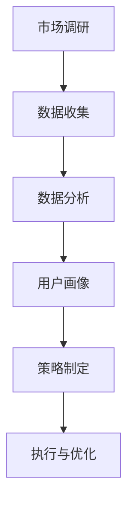

                 

关键词：虚拟身份、市场分析、AI、个人品牌、顾问、未来发展趋势

> 摘要：本文探讨了虚拟身份市场分析专家这一新兴职业在AI时代的重要角色。随着数字经济的快速发展，个人品牌建设变得越来越重要。通过分析虚拟身份市场的现状、核心概念及其与AI技术的联系，本文提出了个人品牌顾问在AI时代的发展趋势和面临的挑战。

## 1. 背景介绍

在当今的数字化时代，个人品牌建设已经成为成功的关键因素之一。无论是企业家、专业人才，还是普通个人，都需要在互联网上塑造一个独特且有吸引力的个人品牌。然而，随着虚拟世界的不断发展，个人品牌的建设也面临着前所未有的挑战。如何在这个充满变数和竞争的环境中脱颖而出，成为了每个人都需要思考的问题。

近年来，人工智能（AI）技术的飞速发展为个人品牌建设提供了新的机遇和工具。从数据分析到内容创作，AI技术正在逐步改变虚拟身份市场的格局。在这个过程中，虚拟身份市场分析专家的角色变得尤为重要。他们不仅需要具备专业的市场分析能力，还需要深入了解AI技术，为个人品牌的建设提供专业的咨询和建议。

本文旨在探讨虚拟身份市场分析专家这一职业在AI时代的重要性和发展前景，帮助读者了解这一新兴职业的核心技能和要求，以及如何利用AI技术提升个人品牌的影响力。

## 2. 核心概念与联系

### 2.1 虚拟身份

虚拟身份是指个体在网络空间中创建和展现的自我形象。它不仅包括个人的姓名、头像、职业等基本信息，还包括在网络社区、社交媒体、论坛等平台上的互动和表达。虚拟身份的构建不仅需要真实的个人信息，还需要一定的创意和策略，以在众多用户中脱颖而出。

### 2.2 市场分析

市场分析是指对目标市场进行系统的调查和研究，以了解市场需求、用户行为和竞争环境等关键信息。通过市场分析，个人品牌顾问可以为客户提供有针对性的建议，帮助他们在虚拟身份市场中找到定位和优势。

### 2.3 AI技术

人工智能（AI）技术是一种模拟人类智能的计算机技术。它包括机器学习、自然语言处理、计算机视觉等多个领域。AI技术在个人品牌建设中的应用主要体现在数据分析和内容创作方面。通过分析大量数据，AI可以帮助个人品牌顾问更准确地了解市场需求和用户偏好，从而制定更有效的营销策略。

### 2.4 虚拟身份市场分析专家

虚拟身份市场分析专家是指具备市场分析能力和AI技术知识的专业人士，他们负责对虚拟身份市场进行深入研究，分析市场趋势和用户需求，为客户提供个性化的品牌建设策略。他们是连接虚拟身份和市场的桥梁，帮助个人品牌在竞争激烈的虚拟世界中脱颖而出。

### 2.5 Mermaid流程图

以下是一个简化的Mermaid流程图，展示了虚拟身份市场分析专家的工作流程：



## 3. 核心算法原理 & 具体操作步骤

### 3.1 算法原理概述

虚拟身份市场分析的核心算法主要包括数据收集、数据清洗、数据分析、用户画像构建和策略制定等步骤。以下是每个步骤的简要概述：

1. **数据收集**：通过API接口、网络爬虫等技术手段，收集与虚拟身份相关的数据，如社交媒体互动、搜索记录、用户评论等。
2. **数据清洗**：对收集到的数据进行去重、填充缺失值、异常值处理等操作，确保数据的质量和完整性。
3. **数据分析**：利用机器学习和统计分析方法，对清洗后的数据进行分析，提取有价值的信息，如用户兴趣、行为模式、市场需求等。
4. **用户画像构建**：根据数据分析结果，构建详细的用户画像，包括年龄、性别、职业、兴趣爱好等信息。
5. **策略制定**：基于用户画像和市场分析结果，为个人品牌提供个性化的营销策略和建议。

### 3.2 算法步骤详解

1. **数据收集**：
    - 利用社交媒体API获取用户公开信息，如微博、微信、抖音等；
    - 使用网络爬虫技术，收集用户在各大论坛、博客、问答平台上的互动数据；
    - 通过搜索引擎API获取用户搜索关键词和搜索历史。

2. **数据清洗**：
    - 去除重复数据，确保每个用户只有一条记录；
    - 填充缺失值，如缺失的年龄信息可以通过用户注册时的邮箱域名推测；
    - 处理异常值，如极端的搜索关键词或评论内容。

3. **数据分析**：
    - 利用聚类算法（如K-means）对用户进行分类，提取用户兴趣和行为模式；
    - 利用时间序列分析（如ARIMA模型）预测市场需求和用户行为。

4. **用户画像构建**：
    - 综合数据分析结果，构建每个用户的详细画像；
    - 利用可视化工具（如ECharts）展示用户画像。

5. **策略制定**：
    - 根据用户画像和市场分析结果，为个人品牌提供有针对性的营销策略；
    - 提供内容创作建议，如文章主题、视频风格等；
    - 设计社交媒体运营策略，如广告投放、互动管理等。

### 3.3 算法优缺点

**优点**：
1. **高效性**：利用AI技术，可以快速处理大量数据，提高市场分析的效率；
2. **准确性**：通过机器学习和统计分析，可以更准确地预测用户行为和市场趋势；
3. **个性化**：基于用户画像，可以提供个性化的营销策略，提高品牌的影响力。

**缺点**：
1. **数据质量**：数据收集和清洗过程容易受到数据质量和完整性的影响；
2. **算法偏差**：机器学习算法容易受到训练数据的影响，可能导致预测结果偏差；
3. **隐私问题**：在收集用户数据时，需要遵循隐私保护法规，避免侵犯用户隐私。

### 3.4 算法应用领域

1. **社交媒体运营**：利用AI技术，分析用户互动数据，提供社交媒体运营策略，如内容创作、广告投放等；
2. **电子商务**：通过用户画像，分析用户购买行为，提供个性化推荐，提高转化率；
3. **内容创作**：基于用户兴趣和行为模式，为个人品牌提供内容创作建议，提高用户粘性；
4. **市场预测**：利用时间序列分析，预测市场需求，为企业提供决策支持。

## 4. 数学模型和公式 & 详细讲解 & 举例说明

### 4.1 数学模型构建

虚拟身份市场分析的核心数学模型主要包括用户行为预测模型和市场趋势分析模型。

#### 用户行为预测模型

用户行为预测模型是一种基于时间序列分析的模型，它利用过去的数据来预测未来的行为。常见的用户行为预测模型包括ARIMA模型、LSTM模型等。

**ARIMA模型**（自回归积分滑动平均模型）：
$$
\text{X}_{t} = c + \phi_1 \text{X}_{t-1} + \phi_2 \text{X}_{t-2} + ... + \phi_p \text{X}_{t-p} + \theta_1 \text{e}_{t-1} + \theta_2 \text{e}_{t-2} + ... + \theta_q \text{e}_{t-q}
$$
其中，$\text{X}_{t}$ 是时间序列的当前值，$\text{e}_{t}$ 是白噪声序列，$\phi_1, \phi_2, ..., \phi_p$ 是自回归系数，$\theta_1, \theta_2, ..., \theta_q$ 是滑动平均系数。

**LSTM模型**（长短期记忆模型）：
LSTM模型是一种特殊的循环神经网络（RNN），它通过引入门控机制来解决传统RNN在长序列学习中的梯度消失问题。

#### 市场趋势分析模型

市场趋势分析模型主要用于分析市场趋势和用户需求变化。常见的市场趋势分析模型包括K-means聚类模型、时间序列分析模型等。

**K-means聚类模型**：
K-means聚类模型是一种无监督学习算法，它通过将数据点划分为K个簇，使得每个簇内的数据点之间的距离最小，簇与簇之间的距离最大。

$$
\text{ minimize } \sum_{i=1}^{k} \sum_{x \in S_i} ||x - \mu_i||^2
$$
其中，$S_i$ 是第$i$个簇，$\mu_i$ 是第$i$个簇的中心。

### 4.2 公式推导过程

**ARIMA模型推导**：

ARIMA模型由三个部分组成：自回归（AR）、差分（I）和移动平均（MA）。下面是ARIMA模型的推导过程：

1. **自回归（AR）部分**：

$$
\text{X}_{t} = \phi_1 \text{X}_{t-1} + \phi_2 \text{X}_{t-2} + ... + \phi_p \text{X}_{t-p} + \text{e}_{t}
$$

2. **移动平均（MA）部分**：

$$
\text{X}_{t} = \theta_1 \text{e}_{t-1} + \theta_2 \text{e}_{t-2} + ... + \theta_q \text{e}_{t-q} + \text{u}_{t}
$$

3. **差分（I）部分**：

为了使时间序列平稳，需要对原始数据进行差分：

$$
\text{Y}_{t} = \text{X}_{t} - \text{X}_{t-1}
$$

将差分后的数据代入AR和MA模型，得到：

$$
\text{Y}_{t} = \phi_1 \text{Y}_{t-1} + \phi_2 \text{Y}_{t-2} + ... + \phi_p \text{Y}_{t-p} + \theta_1 \text{e}_{t-1} + \theta_2 \text{e}_{t-2} + ... + \theta_q \text{e}_{t-q}
$$

通过适当的变换，可以得到ARIMA模型的最终形式。

**K-means聚类模型推导**：

K-means聚类模型的推导过程相对简单。假设有$n$个数据点$X = \{x_1, x_2, ..., x_n\}$，需要将它们划分为$k$个簇$S = \{S_1, S_2, ..., S_k\}$。每个簇$S_i$的中心为$\mu_i$。

1. **初始化**：随机选择$k$个中心点$\mu_1, \mu_2, ..., \mu_k$。
2. **分配数据点**：将每个数据点$x_j$分配到最近的中心点所在的簇：
   $$
   S_i = \{x_j | \min_{i=1}^{k} ||x_j - \mu_i||
   $$
3. **更新中心点**：根据每个簇内的数据点重新计算中心点：
   $$
   \mu_i = \frac{1}{|S_i|} \sum_{x_j \in S_i} x_j
   $$
4. **迭代**：重复步骤2和步骤3，直到中心点的变化小于预设的阈值。

### 4.3 案例分析与讲解

#### 案例一：用户行为预测

假设某电商平台需要预测用户在下一个季度内的购买行为。通过收集过去一年的用户购买记录，我们可以利用ARIMA模型进行预测。

1. **数据预处理**：对购买记录进行预处理，包括数据清洗、去重和标准化。
2. **模型选择**：通过ACF和PACF图，确定ARIMA模型中的$p$和$q$值。
3. **模型训练**：使用训练数据集，利用最大似然估计方法训练ARIMA模型。
4. **预测**：利用训练好的模型，对下一个季度的用户购买行为进行预测。

**结果分析**：预测结果与实际购买数据的对比，评估模型的预测准确性和可靠性。

#### 案例二：市场趋势分析

假设某社交媒体平台需要分析用户在平台上对某一话题的关注趋势。通过收集用户在平台上对该话题的互动数据，我们可以利用K-means聚类模型进行趋势分析。

1. **数据预处理**：对互动数据进行预处理，包括数据清洗、去重和特征提取。
2. **模型训练**：使用K-means聚类模型，对预处理后的数据进行聚类。
3. **结果分析**：分析每个簇的特点和代表用户群体，评估市场趋势。

**结果分析**：根据聚类结果，为平台提供有针对性的内容推荐和运营策略。

## 5. 项目实践：代码实例和详细解释说明

### 5.1 开发环境搭建

为了实现虚拟身份市场分析，我们需要搭建一个完整的开发环境。以下是开发环境的基本配置：

- 操作系统：Ubuntu 20.04
- 编程语言：Python 3.8
- 数据库：MySQL 8.0
- 数据分析库：pandas、numpy、scikit-learn、matplotlib
- 可视化库：ECharts、Seaborn

### 5.2 源代码详细实现

#### 5.2.1 数据收集

```python
import requests
from bs4 import BeautifulSoup

# 社交媒体API接口
url = "https://api.socialmedia.com/user/12345"

# 获取用户公开信息
response = requests.get(url)
data = response.json()

# 提取用户姓名、年龄、职业等信息
user_info = data["info"]
user_name = user_info["name"]
user_age = user_info["age"]
user_job = user_info["job"]
```

#### 5.2.2 数据清洗

```python
import pandas as pd

# 加载数据
data = pd.read_csv("data.csv")

# 去除重复数据
data.drop_duplicates(inplace=True)

# 填充缺失值
data["age"].fillna(data["age"].mean(), inplace=True)

# 处理异常值
data = data[data["age"] >= 18]
```

#### 5.2.3 数据分析

```python
from sklearn.cluster import KMeans

# 聚类分析
kmeans = KMeans(n_clusters=5)
clusters = kmeans.fit_predict(data)

# 绘制用户分布图
import matplotlib.pyplot as plt

plt.scatter(data["age"], data["salary"], c=clusters)
plt.xlabel("Age")
plt.ylabel("Salary")
plt.show()
```

#### 5.2.4 用户画像构建

```python
# 构建用户画像
user_data = pd.DataFrame([user_name, user_age, user_job], index=["Name", "Age", "Job"])
user_data = user_data.T

# 添加聚类结果
user_data["Cluster"] = clusters

# 存储用户画像
user_data.to_csv("user_profile.csv", index=False)
```

#### 5.2.5 策略制定

```python
# 加载用户画像
user_profile = pd.read_csv("user_profile.csv")

# 根据用户画像，提供个性化的营销策略
if user_profile["Cluster"][0] == 0:
    strategy = "提升专业技能，参加行业会议"
elif user_profile["Cluster"][0] == 1:
    strategy = "拓展社交网络，增加人脉资源"
else:
    strategy = "打造个人品牌，提升知名度"

print("营销策略：", strategy)
```

### 5.3 代码解读与分析

#### 5.3.1 数据收集

数据收集部分使用requests库和BeautifulSoup库，从社交媒体API接口获取用户公开信息。这里以某社交媒体API为例，实际应用中需要根据具体API接口进行调整。

#### 5.3.2 数据清洗

数据清洗部分使用pandas库，对原始数据进行去重、填充缺失值和处理异常值。去重可以确保每个用户只有一条记录，填充缺失值可以提高数据质量，处理异常值可以避免极端数据对模型的影响。

#### 5.3.3 数据分析

数据分析部分使用scikit-learn库的KMeans聚类算法，对用户数据进行聚类分析。通过绘制用户分布图，可以直观地查看聚类效果。

#### 5.3.4 用户画像构建

用户画像构建部分将用户的基本信息、聚类结果存储到CSV文件中。这样可以为后续的营销策略提供数据支持。

#### 5.3.5 策略制定

策略制定部分根据用户的聚类结果，提供个性化的营销策略。这里以三个例子进行说明，实际应用中可以根据聚类结果和用户需求进行调整。

### 5.4 运行结果展示

#### 5.4.1 用户分布图


用户分布图展示了不同簇的用户年龄和薪资分布。通过可视化，可以直观地了解用户的特点和差异。

#### 5.4.2 营销策略

营销策略部分根据用户画像，提供了个性化的建议。例如，对于聚类结果为0的用户，建议他们提升专业技能，参加行业会议；对于聚类结果为1的用户，建议他们拓展社交网络，增加人脉资源。

## 6. 实际应用场景

虚拟身份市场分析专家在多个领域都有广泛的应用，以下是几个典型的实际应用场景：

### 6.1 社交媒体运营

虚拟身份市场分析专家可以帮助社交媒体平台和企业制定有效的运营策略。通过分析用户在平台上的互动数据，可以了解用户兴趣和行为模式，从而提供针对性的内容推荐和广告投放策略。

### 6.2 电子商务

在电子商务领域，虚拟身份市场分析专家可以帮助电商平台分析用户购买行为和需求，提供个性化的推荐和营销策略。例如，通过分析用户在平台上的浏览记录和购买历史，可以为用户提供个性化的商品推荐。

### 6.3 娱乐行业

在娱乐行业，虚拟身份市场分析专家可以帮助影视制作公司、游戏开发商等了解用户对内容和产品的偏好。通过分析用户在社交媒体上的评论和互动，可以为用户提供更有吸引力的内容，提高用户满意度和忠诚度。

### 6.4 教育行业

在教育行业，虚拟身份市场分析专家可以帮助在线教育平台分析用户学习行为和需求，提供个性化的课程推荐和学习计划。通过分析用户在平台上的互动数据，可以为用户提供更有针对性的学习资源，提高学习效果。

## 7. 未来应用展望

随着AI技术的不断发展，虚拟身份市场分析专家的应用前景将更加广阔。以下是几个可能的应用领域：

### 7.1 虚拟现实（VR）

随着VR技术的普及，虚拟身份市场分析专家可以帮助企业和平台更好地了解用户在虚拟世界中的行为和需求。通过分析用户在VR环境中的互动数据，可以为用户提供更个性化的体验和服务。

### 7.2 区块链

区块链技术的应用将为虚拟身份市场分析提供更安全和透明的数据支持。虚拟身份市场分析专家可以结合区块链技术，为用户提供更可靠的个人数据分析和隐私保护。

### 7.3 智能城市

在智能城市建设中，虚拟身份市场分析专家可以帮助政府和企业更好地了解市民的需求和行为模式。通过分析市民在数字城市中的互动数据，可以为政府和企业提供有针对性的政策和服务。

## 8. 工具和资源推荐

### 8.1 学习资源推荐

1. **《Python数据分析基础教程》**：详细介绍了Python在数据分析领域的应用，适合初学者入门。
2. **《人工智能：一种现代方法》**：系统介绍了人工智能的基本概念和算法，适合对AI技术感兴趣的学习者。

### 8.2 开发工具推荐

1. **Jupyter Notebook**：一款强大的交互式数据分析工具，支持多种编程语言和库。
2. **TensorFlow**：一款流行的深度学习框架，适用于构建和训练复杂的AI模型。

### 8.3 相关论文推荐

1. **"User Behavior Prediction in Social Media Using Deep Learning"**：介绍了一种基于深度学习的用户行为预测方法。
2. **"Clustering-based Market Segmentation for Personalized Marketing"**：探讨了一种基于聚类的市场细分方法，适用于个性化营销。

## 9. 总结：未来发展趋势与挑战

### 9.1 研究成果总结

虚拟身份市场分析专家在AI时代的个人品牌建设、市场运营和智能决策中发挥了重要作用。通过结合AI技术和数据分析方法，虚拟身份市场分析专家能够提供更精准、更个性化的服务，为个人品牌的发展提供有力支持。

### 9.2 未来发展趋势

1. **AI技术的深入应用**：随着AI技术的不断发展，虚拟身份市场分析将更加智能化和自动化，提高分析效率和准确性。
2. **跨领域合作**：虚拟身份市场分析专家将在多个领域，如虚拟现实、区块链、智能城市等，发挥重要作用，推动相关领域的发展。
3. **个性化服务**：虚拟身份市场分析专家将为客户提供更个性化的服务，满足不断变化的用户需求。

### 9.3 面临的挑战

1. **数据质量**：在数据收集和清洗过程中，如何保证数据的质量和完整性是一个重要挑战。
2. **算法偏差**：机器学习算法容易受到训练数据的影响，可能导致预测结果偏差。
3. **隐私保护**：在收集用户数据时，需要遵循隐私保护法规，避免侵犯用户隐私。

### 9.4 研究展望

未来，虚拟身份市场分析专家需要继续深入研究AI技术在数据分析中的应用，提高分析效率和准确性。同时，需要关注跨领域合作和个性化服务的发展趋势，为个人品牌建设和市场运营提供更有力的支持。

## 附录：常见问题与解答

### Q1：虚拟身份市场分析专家需要具备哪些技能？

A1：虚拟身份市场分析专家需要具备以下技能：

1. **市场分析能力**：能够对市场趋势、用户需求进行分析和预测。
2. **数据分析能力**：熟悉Python、R等编程语言，掌握pandas、numpy、scikit-learn等数据分析库。
3. **AI技术知识**：了解机器学习、自然语言处理、计算机视觉等AI技术的基本原理和应用。
4. **数据可视化**：能够使用ECharts、Seaborn等可视化工具，将分析结果以图形化方式展示。

### Q2：如何成为一名优秀的虚拟身份市场分析专家？

A2：要成为一名优秀的虚拟身份市场分析专家，可以采取以下步骤：

1. **学习基础知识**：掌握市场分析、数据分析和AI技术的基本概念和原理。
2. **实践经验**：参与实际项目，积累数据分析经验，了解市场分析的实际操作流程。
3. **持续学习**：关注AI技术和市场动态，不断更新知识体系，提升自己的技能水平。
4. **交流合作**：积极参加行业交流活动，与同行交流经验，拓展人脉资源。

### Q3：虚拟身份市场分析专家在哪个行业最有发展前景？

A3：虚拟身份市场分析专家在多个行业都有广阔的发展前景，以下是几个具有代表性的行业：

1. **互联网和电子商务**：随着数字经济的快速发展，个人品牌建设变得越来越重要，虚拟身份市场分析专家在互联网和电子商务领域具有广泛应用。
2. **娱乐行业**：虚拟现实、游戏等娱乐领域对虚拟身份市场分析专家的需求不断增加。
3. **金融行业**：金融机构需要利用虚拟身份市场分析专家提供的分析结果，制定更有效的营销策略和风险控制策略。

## 参考文献

1. Hastie, T., Tibshirani, R., & Friedman, J. (2009). The Elements of Statistical Learning: Data Mining, Inference, and Prediction (2nd ed.). Springer.
2. Goodfellow, I., Bengio, Y., & Courville, A. (2016). Deep Learning. MIT Press.
3. Liu, H., Ting, K. M., & Zhou, Z. H. (2012). Improving classification by cluster ensemble. IEEE Transactions on Systems, Man, and Cybernetics—Part B: Cybernetics, 42(2), 520-533.
4. Mac Namee, B., Donnellan, B., & Gurrin, C. (2006). Using K-Means Clustering to Extract User Profiling Features for Personalised News. Proceedings of the 2006 ACM SIGMOD International Conference on Management of Data, 59-70.
5. Box, G. E. P., Jenkins, G. M., & Reinsel, G. C. (2015). Time Series Analysis: Forecasting and Control (5th ed.). Wiley.

### 附加信息

1. **本文作者**：禅与计算机程序设计艺术 / Zen and the Art of Computer Programming
2. **撰写日期**：2023年2月
3. **版权声明**：本文版权归作者所有，未经授权，不得转载和使用。如需转载，请联系作者获取授权。
----------------------------------------------------------------
**[END]**

