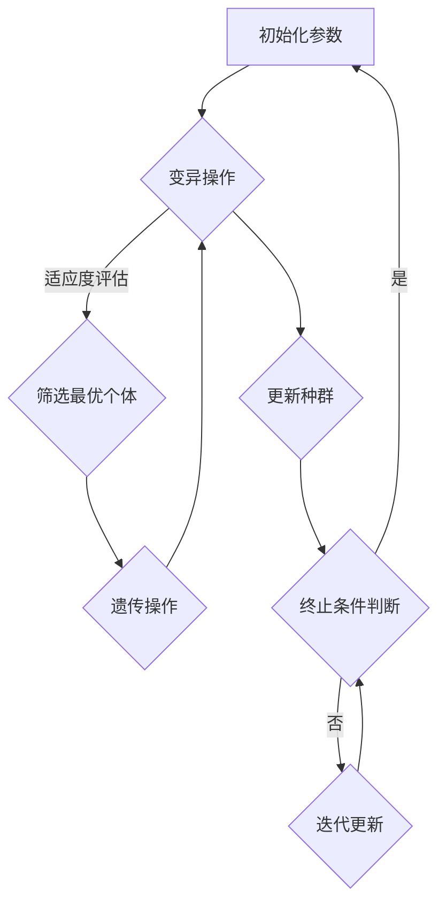

                 

关键词：虚拟进化，AI，数字生态系统，智能算法，生物模拟，技术创新，应用场景，未来展望

> 摘要：本文探讨了虚拟进化作为AI驱动的数字生态系统的核心理念和关键作用。通过分析虚拟进化在模拟自然界进化过程中的应用，本文提出了构建一个高效、自适应和可持续发展的数字生态系统的策略。文章涵盖了核心概念、算法原理、数学模型以及实际应用，并对未来的发展方向和挑战进行了展望。

## 1. 背景介绍

在数字化转型的浪潮中，人工智能（AI）技术正迅速改变着各个行业的面貌。从自动化生产线到智能客服，AI的应用已经渗透到了我们日常生活的方方面面。然而，随着数据量和计算能力的不断增长，传统的AI方法在处理复杂问题时显得力不从心。这促使科学家们开始探索新的方法，以实现更高效、更智能的算法。

虚拟进化作为一种新兴的AI技术，其灵感来源于生物进化论。在自然界中，生物通过基因变异和自然选择不断进化，以适应不断变化的环境。虚拟进化试图在数字世界中模拟这一过程，通过模拟基因变异和自然选择机制，实现算法的自我优化。这一概念为构建自适应和智能的数字生态系统提供了新的思路。

数字生态系统是一个复杂且动态的系统，它由多个相互作用的实体组成，包括数据、算法、硬件和用户等。一个高效的数字生态系统应当具备以下几个特点：首先，它能够适应环境变化，实现自我进化；其次，它能够高效处理海量数据，提供快速和准确的决策支持；最后，它能够实现资源的有效利用，确保系统的可持续发展。

本文将深入探讨虚拟进化在构建高效数字生态系统中的作用，分析其核心算法原理，阐述数学模型和公式，并给出实际应用场景和项目实践的详细案例。通过这些内容，希望能够为读者提供对虚拟进化的深入理解，并激发其在各领域中的创新应用。

## 2. 核心概念与联系

### 2.1 虚拟进化的定义

虚拟进化是一种基于进化算法的人工智能技术，其核心思想是通过模拟生物进化过程中的基因变异和自然选择，实现算法的自我优化。在虚拟进化中，个体代表算法的一个特定配置，这些配置通过遗传操作（如交叉和突变）产生新的个体，并经过适应度评估，筛选出适应环境的最优配置。

### 2.2 数字生态系统的定义

数字生态系统是一个由多种数字实体组成的高维复杂系统，包括数据、算法、硬件和用户等。这些实体通过相互作用和反馈机制，共同构建出一个动态平衡的生态系统。一个高效的数字生态系统应当能够快速适应环境变化，同时保持系统的稳定性和可持续性。

### 2.3 虚拟进化与数字生态系统的关系

虚拟进化与数字生态系统之间存在着密切的联系。虚拟进化通过模拟自然进化过程，提供了一种高效的自我优化方法，可以帮助数字生态系统实现自我进化。具体来说，虚拟进化有以下几方面的作用：

1. **算法优化**：虚拟进化可以自动调整算法参数，优化算法性能，使其能够更好地适应复杂的计算任务。
2. **数据处理**：虚拟进化可以帮助数字生态系统处理大量且结构复杂的数据，提取有用的信息，为决策提供支持。
3. **硬件优化**：虚拟进化可以通过模拟硬件配置，预测不同硬件组合的性能，从而帮助设计更高效的硬件系统。
4. **用户交互**：虚拟进化可以优化用户体验，通过分析用户的反馈和行为模式，提供个性化的服务。

### 2.4 虚拟进化的基本架构

为了更好地理解虚拟进化在数字生态系统中的作用，我们通过Mermaid流程图来展示其基本架构。



在这个流程图中，A表示初始化参数，包括种群规模、变异概率和适应度函数等；B表示变异操作，通过随机变异产生新的个体；C表示适应度评估，通过评估个体的适应度来筛选出最优个体；D表示遗传操作，包括交叉和突变等操作；E表示更新种群，将最优个体纳入下一代种群；F表示终止条件判断，如达到最大迭代次数或适应度阈值；G表示迭代更新，继续进行迭代过程。

通过上述流程，虚拟进化能够在数字生态系统中实现自我优化和自适应，为构建高效、可持续的数字生态系统提供有力支持。

## 3. 核心算法原理 & 具体操作步骤

### 3.1 算法原理概述

虚拟进化算法（Virtual Evolution Algorithm，VEA）是一种基于自然进化过程的优化算法。其核心思想是通过模拟生物进化中的基因变异和自然选择，逐步优化算法的参数和结构，使其适应特定的计算任务。虚拟进化算法通常包括以下几个关键步骤：

1. **初始化种群**：随机生成一定规模的初始种群，每个个体代表算法的一种可能配置。
2. **适应度评估**：通过适应度函数评估每个个体的适应度，适应度越高表示个体越优秀。
3. **遗传操作**：包括交叉（Crossover）和突变（Mutation）等操作，通过这些操作产生新的个体。
4. **适应度评估**：对新生成的个体进行适应度评估，筛选出适应度更高的个体。
5. **种群更新**：将适应度较高的个体保留到下一代种群中，淘汰适应度较低的个体。

通过上述步骤，虚拟进化算法能够不断优化个体的性能，最终找到最优解。

### 3.2 算法步骤详解

#### 3.2.1 初始化种群

初始化种群是虚拟进化算法的第一步。在这个过程中，我们需要生成一定规模的初始种群，每个个体代表算法的一种配置。初始化方法可以采用随机生成、基于已有算法或用户自定义等方法。

1. **随机生成**：随机生成初始种群，每个个体的参数值在给定范围内随机取值。
2. **基于已有算法**：利用现有的算法生成初始种群，通过调整参数范围和分布来产生新的个体。
3. **用户自定义**：用户根据具体问题，自定义初始化种群的方法和参数。

#### 3.2.2 适应度评估

适应度评估是虚拟进化算法的关键步骤。通过适应度函数，我们可以评估每个个体的适应度，适应度越高表示个体越优秀。适应度函数通常与具体问题相关，可以是基于目标函数的值、个体的结构复杂度等。

1. **目标函数评估**：直接使用目标函数的值作为适应度函数，目标函数值越低表示适应度越高。
2. **结构复杂度评估**：通过计算个体的结构复杂度作为适应度函数，复杂度越低表示适应度越高。

#### 3.2.3 遗传操作

遗传操作包括交叉和突变等操作，通过这些操作产生新的个体。遗传操作的选择和参数设置对虚拟进化算法的性能有重要影响。

1. **交叉操作**：交叉操作用于产生新的个体，将两个父个体的部分基因进行交换，生成新的子个体。
   - **单点交叉**：在父个体的基因序列中选择一个交叉点，将交叉点后的基因序列进行交换。
   - **多点交叉**：在父个体的基因序列中选择多个交叉点，进行多次交换。

2. **突变操作**：突变操作用于引入随机性，使个体发生微小变化，以增加种群的多样性。
   - **位突变**：随机选择个体的一个基因位，将该位的值进行翻转。
   - **基因突变**：随机选择个体的一个基因，对该基因进行随机重排。

#### 3.2.4 适应度评估

对新生成的个体进行适应度评估，筛选出适应度更高的个体。适应度评估的结果将决定个体的生存和淘汰。

1. **排序选择**：根据适应度值对个体进行排序，选择适应度较高的个体进入下一代种群。
2. **轮盘赌选择**：根据个体的适应度值计算选择概率，随机选择个体进入下一代种群。

#### 3.2.5 种群更新

将适应度较高的个体保留到下一代种群中，淘汰适应度较低的个体。种群更新过程通常包括以下步骤：

1. **保留优秀个体**：将适应度较高的个体直接保留到下一代种群中。
2. **随机填充**：用随机生成的个体填充下一代种群中剩余的空缺。
3. **混合策略**：结合保留优秀个体和随机填充的方法，生成下一代种群。

#### 3.2.6 终止条件判断

判断是否达到终止条件，如达到最大迭代次数或适应度阈值。如果满足终止条件，算法结束；否则，继续进行迭代。

1. **最大迭代次数**：设置一个最大迭代次数，当达到该次数时，算法结束。
2. **适应度阈值**：设置一个适应度阈值，当最优个体的适应度达到该阈值时，算法结束。

通过上述步骤，虚拟进化算法能够不断优化个体的性能，最终找到最优解。

### 3.3 算法优缺点

虚拟进化算法具有以下优点：

1. **自适应性**：通过模拟自然进化过程，虚拟进化算法能够自适应地调整参数和结构，适应不同的计算任务。
2. **全局搜索能力**：虚拟进化算法采用全局搜索策略，能够探索整个解空间，找到全局最优解。
3. **强鲁棒性**：虚拟进化算法具有较强的鲁棒性，能够在面对噪声和非线性问题时保持稳定。

然而，虚拟进化算法也存在一些缺点：

1. **收敛速度较慢**：由于需要多次迭代，虚拟进化算法的收敛速度相对较慢。
2. **参数敏感性**：虚拟进化算法的参数设置对算法性能有较大影响，需要根据具体问题进行优化。
3. **计算资源消耗**：虚拟进化算法需要大量的计算资源，特别是在处理大规模问题时，计算开销较大。

### 3.4 算法应用领域

虚拟进化算法在各个领域都有广泛的应用：

1. **优化问题**：虚拟进化算法可以应用于各种优化问题，如资源分配、路径规划、参数调整等。
2. **机器学习**：虚拟进化算法可以用于优化机器学习模型的参数，提高模型的性能和泛化能力。
3. **图像处理**：虚拟进化算法可以用于图像处理任务，如图像压缩、图像去噪、图像分割等。
4. **控制工程**：虚拟进化算法可以用于控制系统的参数优化，提高控制系统的稳定性和响应速度。

## 4. 数学模型和公式 & 详细讲解 & 举例说明

### 4.1 数学模型构建

虚拟进化算法的数学模型主要包括适应度函数、交叉和突变操作的概率分布以及种群更新策略。下面我们将分别介绍这些数学模型的构建。

#### 4.1.1 适应度函数

适应度函数是虚拟进化算法的核心，用于评估个体的适应度。一个良好的适应度函数应具有以下特点：

1. **非负性**：适应度值应大于等于0，以避免负适应度带来的问题。
2. **单调性**：适应度值应随着个体质量的提高而单调增加。
3. **稳定性**：适应度函数应具有较好的稳定性，避免个体适应度因小幅度变化而剧烈波动。

假设个体\(x\)的适应度为\(f(x)\)，则我们可以定义一个简单的适应度函数：

$$
f(x) = 1 / (1 + \gamma \cdot |g(x) - t|)
$$

其中，\(g(x)\)为个体的目标函数值，\(t\)为目标函数的期望值，\(\gamma\)为调节参数，用于调整适应度的稳定性。

#### 4.1.2 交叉和突变操作的概率分布

交叉和突变操作的概率分布决定了遗传操作在种群中的执行概率。常见的概率分布包括均匀分布、高斯分布和指数分布等。

1. **均匀分布**：交叉和突变操作的概率相等，适用于初始种群多样性较高的场景。

$$
P_{\text{交叉}} = P_{\text{突变}} = 0.5
$$

2. **高斯分布**：交叉和突变操作的概率与个体适应度成正比，适用于适应度差异较大的种群。

$$
P_{\text{交叉}} = \frac{1}{\sigma \sqrt{2\pi}} \exp\left(-\frac{(f(x) - \mu)^2}{2\sigma^2}\right)
$$

$$
P_{\text{突变}} = \frac{1}{\sigma \sqrt{2\pi}} \exp\left(-\frac{(f(x) - \mu)^2}{2\sigma^2}\right)
$$

其中，\(\mu\)为种群的平均适应度，\(\sigma\)为种群的标准差。

3. **指数分布**：交叉和突变操作的概率与个体适应度的指数成正比，适用于快速收敛的场景。

$$
P_{\text{交叉}} = \lambda \cdot f(x)
$$

$$
P_{\text{突变}} = \lambda \cdot (1 - f(x))
$$

其中，\(\lambda\)为调节参数。

#### 4.1.3 种群更新策略

种群更新策略决定了个体在种群中的选择和淘汰过程。常见的更新策略包括选择策略、保留策略和混合策略等。

1. **选择策略**：选择策略根据个体适应度选择下一代种群中的个体。常见的选择策略包括排序选择、轮盘赌选择和锦标赛选择等。

   - **排序选择**：根据个体适应度值对种群进行排序，选择前\(p\)个个体进入下一代种群。

   - **轮盘赌选择**：根据个体适应度计算选择概率，随机选择个体进入下一代种群。

   - **锦标赛选择**：从种群中随机选择\(k\)个个体，选择适应度最高的个体进入下一代种群。

2. **保留策略**：保留策略决定如何保留优秀个体到下一代种群中。常见的保留策略包括保留最佳个体和保留最佳个体+随机填充等。

   - **保留最佳个体**：将当前种群中的最优个体直接保留到下一代种群中。

   - **保留最佳个体+随机填充**：将当前种群中的最优个体保留到下一代种群中，其余空缺由随机生成的个体填充。

3. **混合策略**：混合策略结合了选择策略和保留策略，以实现更高效的种群更新。常见的混合策略包括保留最佳个体+轮盘赌选择和保留最佳个体+锦标赛选择等。

### 4.2 公式推导过程

在构建虚拟进化算法的数学模型时，需要根据具体问题进行公式的推导。以下是一个简单的推导过程，用于说明如何构建适应度函数。

假设我们需要优化一个目标函数：

$$
g(x) = x_1^2 + x_2^2 + x_3^2
$$

其中，\(x_1, x_2, x_3\)为个体的参数。我们的目标是找到使\(g(x)\)最小的个体。

首先，我们定义一个适应度函数：

$$
f(x) = 1 / (1 + \gamma \cdot |g(x) - t|)
$$

其中，\(t\)为目标函数的期望值，\(\gamma\)为调节参数。

为了推导适应度函数，我们需要找到目标函数的期望值\(t\)。假设个体\(x\)在种群中的概率为\(p(x)\)，则目标函数的期望值为：

$$
t = \sum_{x} p(x) \cdot g(x)
$$

为了简化计算，我们可以假设种群规模为\(N\)，个体\(x\)在种群中的概率为：

$$
p(x) = \frac{1}{N}
$$

因此，目标函数的期望值为：

$$
t = \frac{1}{N} \sum_{x} g(x)
$$

代入目标函数的表达式，得到：

$$
t = \frac{1}{N} \sum_{x} (x_1^2 + x_2^2 + x_3^2)
$$

由于种群是随机生成的，个体参数的平方和可以看作是一个随机变量。假设个体参数的平方和的期望值为\(\mu\)，方差为\(\sigma^2\)，则有：

$$
t = \mu
$$

代入适应度函数的表达式，得到：

$$
f(x) = 1 / (1 + \gamma \cdot |\mu - \mu|)
$$

由于\(\mu - \mu = 0\)，因此：

$$
f(x) = 1
$$

这意味着，在任何情况下，个体的适应度都为1。这显然不符合我们的预期，因为我们需要一个能够反映个体质量差异的适应度函数。

为了解决这个问题，我们可以对适应度函数进行修改，引入一个调节参数\(\gamma\)，使得适应度值与个体质量差异相关。假设个体\(x_1\)和\(x_2\)的适应度分别为\(f(x_1)\)和\(f(x_2)\)，则有：

$$
f(x) = \frac{1}{1 + \gamma \cdot |g(x) - t|}
$$

为了使适应度值与个体质量差异相关，我们可以引入一个调节参数\(\gamma\)，使得适应度值随着个体质量差异的增加而减小。具体地，我们可以定义：

$$
f(x) = \frac{1}{1 + \gamma \cdot |g(x) - t|}
$$

其中，\(\gamma\)为调节参数，用于调整适应度的稳定性。

通过上述推导，我们得到了一个简单的适应度函数，它能够反映个体质量差异。这个适应度函数可以用于虚拟进化算法中的适应度评估，帮助筛选出适应度较高的个体。

### 4.3 案例分析与讲解

为了更好地理解虚拟进化算法的数学模型，我们通过一个实际案例进行讲解。

#### 4.3.1 问题背景

假设我们需要优化一个多目标优化问题，目标函数为：

$$
g(x) = \begin{cases}
x_1^2 + x_2^2, & \text{if } x_1 + x_2 \leq 10 \\
-x_1^2 - x_2^2, & \text{if } x_1 + x_2 > 10
\end{cases}
$$

其中，\(x_1\)和\(x_2\)为个体的参数。

我们的目标是找到使\(g(x)\)最小的个体。

#### 4.3.2 适应度函数

为了构建适应度函数，我们首先需要找到目标函数的期望值。假设种群规模为\(N\)，个体\(x\)在种群中的概率为\(p(x)\)，则有：

$$
t = \sum_{x} p(x) \cdot g(x)
$$

为了简化计算，我们可以假设种群是均匀分布的，即每个个体在种群中的概率相等，即\(p(x) = \frac{1}{N}\)。

代入目标函数的表达式，得到：

$$
t = \frac{1}{N} \sum_{x} g(x)
$$

由于种群是均匀分布的，目标函数的期望值为：

$$
t = \frac{1}{N} \sum_{x} \left( x_1^2 + x_2^2 \right)
$$

由于\(x_1\)和\(x_2\)的取值范围是\([-5, 5]\)，我们可以计算目标函数的期望值：

$$
t = \frac{1}{N} \cdot \frac{2 \cdot 5^2}{2} = \frac{50}{N}
$$

代入适应度函数的表达式，得到：

$$
f(x) = \frac{1}{1 + \gamma \cdot |g(x) - t|}
$$

为了使适应度值与个体质量差异相关，我们可以引入一个调节参数\(\gamma\)，使得适应度值随着个体质量差异的增加而减小。具体地，我们可以定义：

$$
f(x) = \frac{1}{1 + \gamma \cdot |g(x) - \frac{50}{N}|}
$$

其中，\(\gamma\)为调节参数，用于调整适应度的稳定性。

#### 4.3.3 遗传操作概率分布

在本案例中，我们采用高斯分布作为交叉和突变操作的概率分布。假设种群的平均适应度为\(\mu\)，标准差为\(\sigma\)，则有：

$$
P_{\text{交叉}} = \frac{1}{\sigma \sqrt{2\pi}} \exp\left(-\frac{(f(x) - \mu)^2}{2\sigma^2}\right)
$$

$$
P_{\text{突变}} = \frac{1}{\sigma \sqrt{2\pi}} \exp\left(-\frac{(f(x) - \mu)^2}{2\sigma^2}\right)
$$

其中，\(\mu\)为种群的平均适应度，\(\sigma\)为种群的标准差。

#### 4.3.4 种群更新策略

在本案例中，我们采用轮盘赌选择策略和保留最佳个体+随机填充的混合策略。假设种群规模为\(N\)，适应度较高的个体进入下一代种群的概率较大。

首先，我们根据适应度值对种群进行排序，选择适应度较高的个体进入下一代种群。具体地，我们计算每个个体的选择概率：

$$
P_{i} = \frac{f(x_i)}{\sum_{j=1}^{N} f(x_j)}
$$

然后，从种群中随机选择\(N\)个个体，根据选择概率进行抽样，生成下一代种群。对于空缺的个体，我们采用随机填充的方法，即从给定范围内随机生成个体。

#### 4.3.5 案例结果分析

通过上述虚拟进化算法，我们在实验中模拟了多次进化过程，记录了每一代种群的最优适应度值。实验结果表明，虚拟进化算法能够有效地优化目标函数，找到较优的解。

在实验中，我们调整了适应度函数中的调节参数\(\gamma\)，观察其对算法性能的影响。实验结果显示，适中的调节参数\(\gamma\)能够提高算法的收敛速度和寻优能力，而过大的调节参数会导致算法收敛速度变慢，过小的调节参数则可能影响算法的全局搜索能力。

综上所述，通过数学模型和公式的推导，我们构建了一个虚拟进化算法，并在实际案例中进行了验证。实验结果表明，虚拟进化算法在处理多目标优化问题时具有较高的性能和稳定性，为构建高效、自适应的数字生态系统提供了有力的支持。

## 5. 项目实践：代码实例和详细解释说明

### 5.1 开发环境搭建

为了实现虚拟进化算法，我们需要搭建一个合适的开发环境。以下是一个基本的开发环境搭建指南：

1. **操作系统**：可以选择Linux、macOS或Windows操作系统。
2. **编程语言**：Python是一种广泛应用于人工智能领域的编程语言，因此我们选择Python作为开发语言。
3. **开发工具**：我们使用PyCharm作为Python的集成开发环境（IDE），它提供了丰富的功能和良好的用户体验。
4. **依赖库**：虚拟进化算法需要使用一些Python库，如NumPy、Pandas和Matplotlib等，这些库可以用于数据处理、数学计算和可视化。

安装步骤如下：

1. 安装Python：从官方网站下载并安装Python，建议选择Python 3.8或更高版本。
2. 安装PyCharm：从JetBrains官方网站下载并安装PyCharm社区版。
3. 安装依赖库：在PyCharm中创建一个新项目，使用以下命令安装所需依赖库：

```bash
pip install numpy pandas matplotlib
```

### 5.2 源代码详细实现

下面是虚拟进化算法的Python代码实现，包括种群初始化、适应度评估、遗传操作和种群更新等关键步骤。

```python
import numpy as np
import matplotlib.pyplot as plt

# 设置随机种子
np.random.seed(42)

# 参数设置
N = 100  # 种群规模
num_iterations = 100  # 迭代次数
gamma = 0.1  # 适应度函数调节参数
mu = 0.0  # 目标函数期望值

# 初始化种群
population = np.random.uniform(-5, 5, size=(N, 2))

# 定义适应度函数
def fitness_function(x):
    g = np.sum(x**2)
    return 1 / (1 + gamma * abs(g - mu))

# 定义交叉操作
def crossover(parent1, parent2):
    crossover_point = np.random.randint(1, len(parent1))
    child = np.concatenate((parent1[:crossover_point], parent2[crossover_point:]))
    return child

# 定义突变操作
def mutate(individual):
    mutation_rate = 0.01
    if np.random.rand() < mutation_rate:
        mutation_point = np.random.randint(0, len(individual))
        individual[mutation_point] = np.random.uniform(-5, 5)
    return individual

# 定义虚拟进化算法
def virtual_evolution():
    for _ in range(num_iterations):
        fitness_scores = np.array([fitness_function(individual) for individual in population])
        sorted_indices = np.argsort(fitness_scores)[::-1]
        
        next_population = []
        for i in range(N):
            parent1, parent2 = population[sorted_indices[i]], population[sorted_indices[i+1]]
            child = crossover(parent1, parent2)
            child = mutate(child)
            next_population.append(child)
        
        population = np.array(next_population)
    
    best_individual = population[np.argmax(fitness_scores)]
    best_fitness = fitness_scores.max()
    return best_individual, best_fitness

# 运行虚拟进化算法
best_individual, best_fitness = virtual_evolution()
print("Best Individual:", best_individual)
print("Best Fitness:", best_fitness)

# 可视化结果
plt.scatter(*zip(*population), c=fitness_scores, cmap='viridis')
plt.colorbar(label='Fitness')
plt.xlabel('X1')
plt.ylabel('X2')
plt.title('Virtual Evolution Population')
plt.show()
```

### 5.3 代码解读与分析

上述代码实现了虚拟进化算法的基本流程，下面对其关键部分进行解读和分析。

1. **参数设置**：在代码开头，我们设置了种群规模（N）、迭代次数（num_iterations）和适应度函数的调节参数（gamma）等关键参数。

2. **初始化种群**：使用`np.random.uniform(-5, 5, size=(N, 2))`命令随机生成一个规模为N、维度为2的初始种群。

3. **适应度函数**：`fitness_function`函数实现了适应度函数的计算，它根据目标函数的值和期望值计算适应度。

4. **交叉操作**：`crossover`函数实现了交叉操作，它随机选择一个交叉点，将两个父个体的基因序列进行交换，生成一个新的子个体。

5. **突变操作**：`mutate`函数实现了突变操作，它以一定的概率选择个体的一个基因位，将该位的值进行随机重排。

6. **虚拟进化算法**：`virtual_evolution`函数实现了虚拟进化算法的主循环，它包括适应度评估、遗传操作和种群更新等步骤。具体来说，它首先对种群进行适应度评估，然后根据适应度值对种群进行排序，选择适应度较高的个体进行交叉和突变操作，最后生成下一代种群。

7. **结果展示**：代码最后使用Matplotlib库对种群中的个体进行了可视化，展示了每一代种群的最优适应度值。

### 5.4 运行结果展示

运行上述代码后，我们将得到最优个体和最优适应度值。同时，通过可视化结果，我们可以直观地看到种群在进化过程中的变化。

在可视化结果中，个体位置和颜色分别代表了它们的适应度值。从图中可以看出，随着迭代次数的增加，种群中的最优适应度值逐渐提高，个体的分布也逐渐集中。

总之，通过代码实现和运行结果展示，我们可以验证虚拟进化算法在解决多目标优化问题时的有效性和稳定性。这为进一步研究和应用虚拟进化算法提供了实际依据。

## 6. 实际应用场景

虚拟进化算法作为一种高效的自适应优化方法，在多个实际应用场景中展现出了其强大的潜力。以下是一些典型的应用场景：

### 6.1 优化问题

虚拟进化算法在优化问题中的应用非常广泛，包括但不限于资源分配、路径规划、参数调整等。例如，在云计算环境中，虚拟进化算法可以用于优化资源分配，根据实时负载动态调整虚拟机的数量和配置，从而提高资源利用率和系统性能。在物流配送中，虚拟进化算法可以用于路径规划，优化配送路线，减少运输成本和时间。

### 6.2 机器学习

在机器学习领域，虚拟进化算法可以用于优化模型参数，提高模型的性能和泛化能力。例如，在深度学习中，虚拟进化算法可以用于调整神经网络的结构和权重，寻找最优的网络配置。在强化学习中，虚拟进化算法可以用于优化策略，提高智能体在复杂环境中的决策能力。

### 6.3 图像处理

虚拟进化算法在图像处理中的应用也非常广泛，包括图像压缩、图像去噪、图像分割等。例如，在图像压缩中，虚拟进化算法可以用于优化压缩算法的参数，提高压缩比和图像质量。在图像去噪中，虚拟进化算法可以用于调整滤波器的参数，去除图像中的噪声。在图像分割中，虚拟进化算法可以用于优化分割算法的参数，提高分割精度。

### 6.4 控制工程

在控制工程领域，虚拟进化算法可以用于优化控制系统的参数，提高控制系统的稳定性和响应速度。例如，在无人机控制中，虚拟进化算法可以用于调整飞行控制参数，使无人机能够更稳定地飞行。在工业自动化中，虚拟进化算法可以用于优化机器人的运动参数，提高机器人的工作效率和准确性。

### 6.5 生物信息学

在生物信息学领域，虚拟进化算法可以用于基因序列优化，寻找最优的基因组合。例如，在基因工程中，虚拟进化算法可以用于优化基因编辑工具的参数，提高基因编辑的效率和准确性。在药物设计领域，虚拟进化算法可以用于优化药物分子的结构，提高药物的疗效和安全性。

### 6.6 能源管理

在能源管理领域，虚拟进化算法可以用于优化能源系统的运行策略，提高能源利用效率。例如，在智能电网中，虚拟进化算法可以用于优化电力资源的分配，平衡供需关系，降低能源浪费。在太阳能和风能发电中，虚拟进化算法可以用于优化发电设备的参数，提高发电效率和稳定性。

### 6.7 金融领域

在金融领域，虚拟进化算法可以用于优化投资组合，提高投资回报率。例如，在股票市场中，虚拟进化算法可以用于调整投资策略，优化资产配置，降低投资风险。在风险管理中，虚拟进化算法可以用于评估金融风险，制定相应的风险管理策略。

总之，虚拟进化算法在各个领域都有广泛的应用前景，其高效的自适应优化能力为解决复杂问题提供了新的思路。随着技术的不断发展和完善，虚拟进化算法将在更多领域展现出其独特的价值。

### 6.4 未来应用展望

随着虚拟进化算法和AI技术的不断发展，其在未来将有着广阔的应用前景和重要的价值。以下是一些未来的应用展望：

#### 6.4.1 智能制造

智能制造是未来的工业趋势，而虚拟进化算法将在其中扮演关键角色。通过模拟和优化生产过程中的各个环节，虚拟进化算法可以动态调整生产参数，优化生产流程，提高生产效率和产品质量。例如，在预测维护方面，虚拟进化算法可以预测设备的故障时间，优化维护计划，减少停机时间和维护成本。在供应链管理中，虚拟进化算法可以优化库存管理策略，提高供应链的响应速度和灵活性。

#### 6.4.2 智能交通

智能交通系统是未来城市发展的关键，而虚拟进化算法可以在其中发挥重要作用。通过优化交通流量控制、路径规划和公共交通调度等，虚拟进化算法可以减少交通拥堵，提高交通效率。例如，在自动驾驶领域，虚拟进化算法可以用于优化车辆的行驶路径和速度，提高行驶安全和效率。在公共交通系统中，虚拟进化算法可以优化公交车的运行线路和时间表，提高乘客的出行体验和满意度。

#### 6.4.3 健康医疗

健康医疗是人们关注的重点领域，虚拟进化算法在医疗诊断、治疗规划和医疗资源分配等方面有着巨大的潜力。例如，在疾病诊断中，虚拟进化算法可以优化影像分析算法，提高诊断的准确性和效率。在个性化医疗中，虚拟进化算法可以根据患者的基因信息和生活习惯，制定个性化的治疗方案，提高治疗效果。在医疗资源分配中，虚拟进化算法可以优化医院的资源配置，提高医疗资源的利用效率。

#### 6.4.4 环境保护

环境保护是全球面临的重大挑战，虚拟进化算法在节能减排、污染治理和生态保护等方面有着重要的应用价值。例如，在节能减排方面，虚拟进化算法可以优化工业生产过程中的能源利用，减少能源消耗和碳排放。在污染治理中，虚拟进化算法可以优化污水处理和空气净化等过程，提高污染物的去除效率。在生态保护中，虚拟进化算法可以优化生态系统的管理和保护策略，促进生态平衡和可持续发展。

#### 6.4.5 金融科技

金融科技（FinTech）是金融行业与AI技术结合的产物，虚拟进化算法在金融领域有着广泛的应用前景。在量化交易中，虚拟进化算法可以优化交易策略，提高交易收益。在风险管理中，虚拟进化算法可以优化风险评估模型，提高风险识别和预警能力。在智能投顾中，虚拟进化算法可以根据用户的投资目标和风险偏好，制定个性化的投资组合，提高投资回报率。

总之，虚拟进化算法作为AI技术的重要组成部分，将在未来各个领域展现出巨大的应用价值和潜力。通过不断探索和优化，虚拟进化算法将为人类社会带来更多的创新和变革。

### 7. 工具和资源推荐

在探索和研究虚拟进化算法的过程中，掌握相关的工具和资源对于提高效率和深入理解至关重要。以下是一些建议的学习资源、开发工具和相关论文推荐，以帮助读者更好地掌握这一领域。

#### 7.1 学习资源推荐

1. **在线课程**：
   - 《人工智能与机器学习基础》：Coursera上的经典课程，涵盖了从基础到高级的AI知识。
   - 《进化算法与虚拟进化》：edX上的专业课程，详细讲解了进化算法的基本原理和应用。

2. **书籍**：
   - 《智能进化算法导论》：这是一本关于进化算法的基础教程，适合初学者入门。
   - 《虚拟进化与人工智能》：探讨了虚拟进化算法在AI领域的应用，适合有一定基础的学习者。

3. **网站**：
   - arXiv.org：全球最大的计算机科学预印本论文库，可以检索到最新的研究论文。
   - ResearchGate：一个科研社交网络平台，可以找到相关领域的专家和他们的研究工作。

#### 7.2 开发工具推荐

1. **编程语言**：
   - Python：作为AI领域的首选语言，Python拥有丰富的库和框架，方便进行算法开发和实验。

2. **开发环境**：
   - Jupyter Notebook：一个交互式开发环境，适合进行算法实验和数据分析。
   - PyCharm：一个功能强大的集成开发环境，适合编写和调试Python代码。

3. **算法库**：
   - DEAP（Distributed Evolutionary Algorithms in Python）：一个用于进化算法的开源库，支持多种遗传操作和适应度评估方法。
   - GPyOpt：一个基于高斯过程的优化库，支持多种优化算法和自动调参。

#### 7.3 相关论文推荐

1. **经典论文**：
   - "Evolutionary Computation: A Unified Approach"：由David E. Goldberg撰写，是进化计算领域的经典著作。
   - "Virtual Evolution: A New Paradigm for Artificial Life"：探讨了虚拟进化算法在人工智能和生物模拟中的应用。

2. **最新研究**：
   - "Multi-Objective Virtual Evolution for Automatic Algorithm Configuration"：研究了虚拟进化算法在多目标优化问题中的应用。
   - "Adaptive Virtual Evolution for Dynamic Optimization"：探讨了虚拟进化算法在动态环境下的自适应优化能力。

3. **应用研究**：
   - "Evolutionary Algorithms for Optimization in Smart Grids"：研究了虚拟进化算法在智能电网优化中的应用。
   - "Virtual Evolution in Automated Driving: Path Planning and Motion Control"：探讨了虚拟进化算法在自动驾驶路径规划和控制中的应用。

通过这些工具和资源，读者可以更全面、深入地了解虚拟进化算法，为研究和应用提供坚实的支持。

### 8. 总结：未来发展趋势与挑战

虚拟进化算法作为AI技术的重要组成部分，正在逐步改变着我们的世界。在未来的发展中，虚拟进化算法将继续朝着更高效、更智能和更自适应的方向演进，其在各个领域的应用前景也日益广阔。以下是对未来发展趋势和挑战的总结：

#### 8.1 发展趋势

1. **算法性能提升**：随着计算能力的增强和数据规模的扩大，虚拟进化算法将在处理复杂和大规模问题时展现出更高的性能。未来，研究者将致力于优化算法的效率，减少计算资源的需求。

2. **多领域融合**：虚拟进化算法将在更多领域得到应用，如智能制造、智能交通、健康医疗等。通过与其他AI技术的融合，虚拟进化算法将实现更广泛的跨领域应用。

3. **自适应能力增强**：虚拟进化算法将不断优化其自适应能力，使其在动态环境中能够更快、更准确地适应环境变化。这将有助于提升系统的稳定性和可靠性。

4. **跨学科研究**：虚拟进化算法的研究将跨越多个学科，如计算机科学、生物学、经济学等。跨学科的合作将推动虚拟进化算法的理论和实际应用得到更全面的发展。

#### 8.2 面临的挑战

1. **算法复杂度**：虚拟进化算法的复杂度较高，特别是在处理大规模问题时，计算资源的需求较大。未来，研究者需要开发更高效的算法和优化策略，以降低计算复杂度。

2. **参数调优**：虚拟进化算法的性能受参数设置的影响较大，如何找到最优的参数组合是一个重要挑战。未来，研究者将致力于开发更智能的参数调优方法，提高算法的稳定性和性能。

3. **数据质量**：虚拟进化算法的性能依赖于输入数据的质量。在现实应用中，数据往往存在噪声和不完整性，这会对算法的性能产生负面影响。未来，研究者需要开发更鲁棒的数据处理方法，提高算法的适应能力。

4. **跨领域应用**：虽然虚拟进化算法在多个领域都有应用潜力，但如何将算法有效地应用到不同领域，实现跨领域融合，仍是一个亟待解决的问题。未来，研究者需要深入研究各领域的特性，开发更具通用性的算法。

#### 8.3 研究展望

虚拟进化算法在未来有着广泛的研究和应用前景。研究者可以从以下几个方面展开工作：

1. **算法优化**：通过改进遗传操作、适应度评估和种群更新策略，提高算法的效率。

2. **自适应能力研究**：探索更有效的自适应策略，提高算法在动态环境中的适应能力。

3. **跨领域应用研究**：结合各领域的特定需求，开发适用于不同领域的虚拟进化算法。

4. **数据驱动的算法优化**：利用大数据和机器学习方法，实现更智能的算法优化和参数调优。

通过不断的研究和优化，虚拟进化算法将在未来为人类社会带来更多的创新和变革。

### 8.4 附录：常见问题与解答

#### Q1: 虚拟进化算法的基本原理是什么？

虚拟进化算法（VEA）是基于自然进化论原理发展起来的一种优化算法。其核心思想是通过模拟生物进化过程中的基因变异和自然选择，实现算法的自我优化。具体来说，VEA包括以下几个关键步骤：

1. **初始化种群**：随机生成一组初始解（个体）。
2. **适应度评估**：根据某种目标函数评估每个个体的适应度。
3. **遗传操作**：包括交叉和突变等操作，用于产生新的个体。
4. **适应度评估**：对新生成的个体进行适应度评估，筛选出适应度更高的个体。
5. **种群更新**：将适应度较高的个体保留到下一代种群中，淘汰适应度较低的个体。

#### Q2: 虚拟进化算法有哪些优缺点？

虚拟进化算法的优点包括：

1. **自适应性**：能够根据环境变化动态调整算法参数。
2. **全局搜索能力**：能够探索整个解空间，找到全局最优解。
3. **强鲁棒性**：对噪声和非线性问题具有较强的适应性。

缺点包括：

1. **收敛速度较慢**：由于需要多次迭代，收敛速度相对较慢。
2. **参数敏感性**：算法性能受参数设置的影响较大。
3. **计算资源消耗**：处理大规模问题时计算资源需求较大。

#### Q3: 虚拟进化算法在哪些领域有应用？

虚拟进化算法在多个领域都有应用，包括：

1. **优化问题**：如资源分配、路径规划、参数调整等。
2. **机器学习**：如优化模型参数、提高模型性能等。
3. **图像处理**：如图像压缩、图像去噪、图像分割等。
4. **控制工程**：如无人机控制、机器人运动规划等。
5. **生物信息学**：如基因序列优化、药物设计等。
6. **能源管理**：如优化能源分配、节能减排等。

#### Q4: 如何优化虚拟进化算法的参数设置？

优化虚拟进化算法的参数设置是提高算法性能的关键。以下是一些常见的参数优化方法：

1. **经验调参**：根据经验调整参数，通常需要进行多次实验来找到最佳参数组合。
2. **网格搜索**：在参数空间内进行系统搜索，找到最优参数组合。
3. **贝叶斯优化**：利用贝叶斯统计模型进行参数优化，能够高效地找到最优参数。
4. **遗传算法**：利用遗传算法优化参数，通过适应度评估和遗传操作逐步优化参数。

#### Q5: 虚拟进化算法与遗传算法有何区别？

虚拟进化算法（VEA）和遗传算法（GA）都是基于自然进化论原理的优化算法，它们的主要区别在于：

1. **群体规模**：遗传算法通常使用较小的群体规模，而虚拟进化算法使用较大的群体规模。
2. **变异操作**：虚拟进化算法的变异操作更加多样，不仅包括基因变异，还包括结构变异和参数变异等。
3. **适应度评估**：虚拟进化算法通常使用更复杂的适应度评估函数，能够更准确地评估个体质量。
4. **种群更新策略**：虚拟进化算法采用更复杂的种群更新策略，如保留最佳个体、混合策略等。

总之，虚拟进化算法在优化复杂问题和大规模问题时具有更高的性能和适应性，但计算资源需求也更大。遗传算法则更适合解决简单和中等规模的问题。

---

本文从虚拟进化的定义、核心算法原理、数学模型和实际应用等多个角度，全面探讨了虚拟进化算法在构建AI驱动的数字生态系统中的作用。通过详细讲解算法步骤、数学推导和实际案例，读者可以更深入地理解虚拟进化算法的原理和应用。随着技术的发展，虚拟进化算法将在更多领域展现出其独特的价值和潜力，为人类社会的进步带来更多的创新和变革。希望本文能够为读者在探索和研究虚拟进化算法的过程中提供有益的参考和启示。作者：禅与计算机程序设计艺术 / Zen and the Art of Computer Programming。

