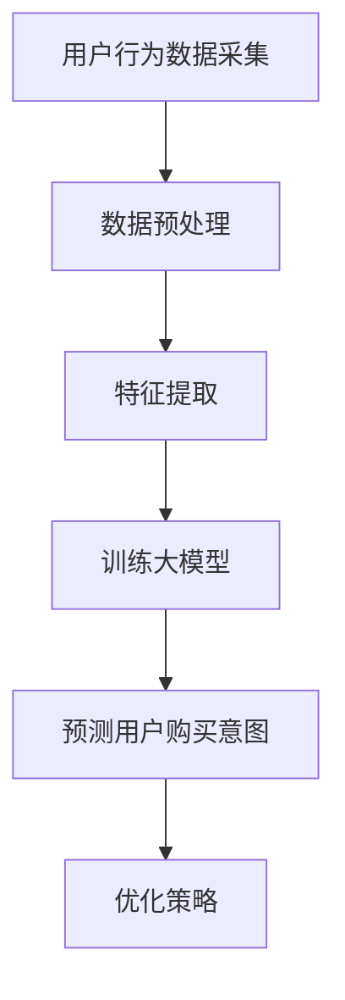

                 

关键词：用户购买意图预测、人工智能、大模型、机器学习、商业应用

## 摘要

随着互联网和电子商务的快速发展，用户购买意图预测已经成为企业提升销售业绩、优化营销策略的关键技术。本文将探讨如何利用人工智能大模型进行用户购买意图预测，详细介绍其核心概念、算法原理、数学模型、实践应用，以及未来的发展趋势和面临的挑战。

## 1. 背景介绍

### 1.1 电子商务的发展

电子商务的兴起，使得在线购物成为人们日常生活的一部分。用户在电商平台上的每一次浏览、搜索、添加购物车、下单等行为，都蕴含着丰富的购买意图信息。这些信息为电商企业提供了巨大的机会，通过精准预测用户购买意图，可以显著提升用户体验和销售额。

### 1.2 购买意图预测的重要性

用户购买意图预测对于电商企业至关重要。一方面，可以帮助企业提前识别潜在客户，从而进行有针对性的营销和推荐；另一方面，还可以帮助企业优化库存管理和供应链，降低运营成本。此外，购买意图预测技术还可以应用于产品定价、广告投放等多个方面，为企业创造更多价值。

### 1.3 人工智能的发展

随着人工智能技术的快速发展，特别是深度学习和自然语言处理技术的突破，为用户购买意图预测提供了强大的技术支持。大模型，作为一种先进的机器学习模型，具有极强的表示和学习能力，能够处理大量复杂的用户数据，实现高精度的购买意图预测。

## 2. 核心概念与联系

### 2.1 人工智能

人工智能（AI）是指由人制造出来的系统能够感知环境、理解和学习，并利用这些知识解决问题和做出决策的能力。在用户购买意图预测中，人工智能主要应用于数据分析和模式识别。

### 2.2 大模型

大模型是指具有巨大参数量和计算能力的机器学习模型。它们能够从海量数据中自动学习特征，并生成高度准确的预测。在用户购买意图预测中，大模型可以处理复杂的用户行为数据，提高预测的精度和效率。

### 2.3 机器学习

机器学习（ML）是一种基于数据的学习方法，通过构建模型来预测和分类未知数据。在用户购买意图预测中，机器学习算法可以帮助企业从历史数据中学习用户行为规律，从而预测用户未来的购买意图。

### 2.4 购买意图预测

购买意图预测是指利用人工智能和机器学习技术，对用户在电商平台上的一系列行为进行建模和分析，从而预测用户是否具有购买意向。购买意图预测的关键在于如何准确捕捉用户的兴趣和需求。

### 2.5 Mermaid 流程图

以下是购买意图预测的核心概念和流程的Mermaid流程图：



## 3. 核心算法原理 & 具体操作步骤

### 3.1 算法原理概述

用户购买意图预测的核心是构建一个能够自动学习用户行为模式的大模型。这个模型通过不断学习和调整参数，实现对用户购买意图的准确预测。

### 3.2 算法步骤详解

1. **数据采集**：收集用户在电商平台上的一系列行为数据，如浏览历史、搜索记录、购物车、订单等。

2. **数据预处理**：对采集到的原始数据进行清洗、去噪和归一化处理，确保数据质量。

3. **特征提取**：从预处理后的数据中提取对购买意图有重要影响的特征，如用户浏览时间、搜索关键词、购买频率等。

4. **模型训练**：利用特征数据训练大模型，使其学会从用户行为中提取购买意图。

5. **预测用户购买意图**：将新用户的行为数据输入训练好的模型，预测其购买意图。

6. **优化策略**：根据预测结果调整营销策略，提高用户转化率。

### 3.3 算法优缺点

**优点**：
- **高精度**：大模型能够处理大量复杂的用户数据，提高预测的精度。
- **自适应**：模型可以根据新的用户行为数据不断学习和调整，实现自适应预测。

**缺点**：
- **计算成本高**：大模型的训练和预测需要大量的计算资源。
- **数据依赖性**：模型的性能依赖于数据质量和特征提取的准确性。

### 3.4 算法应用领域

用户购买意图预测技术可以应用于电商、金融、零售等多个领域，帮助企业实现精准营销、优化库存管理和提高销售额。

## 4. 数学模型和公式 & 详细讲解 & 举例说明

### 4.1 数学模型构建

用户购买意图预测的核心是构建一个概率模型，用于预测用户是否具有购买意向。我们可以使用贝叶斯定理来构建这个模型。

$$
P(\text{购买意图}|\text{用户行为}) = \frac{P(\text{用户行为}|\text{购买意图}) \cdot P(\text{购买意图})}{P(\text{用户行为})}
$$

其中，$P(\text{购买意图}|\text{用户行为})$ 表示在给定用户行为的情况下，用户具有购买意图的概率；$P(\text{用户行为}|\text{购买意图})$ 表示用户具有购买意图时，表现出相应行为的概率；$P(\text{购买意图})$ 表示用户具有购买意图的先验概率；$P(\text{用户行为})$ 表示用户表现出相应行为的总概率。

### 4.2 公式推导过程

贝叶斯定理的推导基于条件概率的定义。根据条件概率的定义，我们有：

$$
P(A|B) = \frac{P(A \cap B)}{P(B)}
$$

其中，$P(A|B)$ 表示在事件B发生的条件下，事件A发生的概率；$P(A \cap B)$ 表示事件A和事件B同时发生的概率；$P(B)$ 表示事件B发生的概率。

在用户购买意图预测中，我们将事件A定义为“用户具有购买意图”，事件B定义为“用户表现出某种行为”。则：

$$
P(\text{购买意图}|\text{用户行为}) = \frac{P(\text{用户行为}|\text{购买意图}) \cdot P(\text{购买意图})}{P(\text{用户行为})}
$$

### 4.3 案例分析与讲解

假设我们有一个电商平台，用户小明在最近一个月内浏览了多个商品，搜索了多个关键词，并将多个商品添加到了购物车。我们希望利用这些信息预测小明是否具有购买意图。

根据贝叶斯定理，我们需要计算以下概率：

1. **$P(\text{购买意图})$**：小明具有购买意图的先验概率。这个概率可以通过分析历史数据得出，例如，假设历史数据中70%的用户最终购买了商品，那么$P(\text{购买意图})$ 可以设定为0.7。

2. **$P(\text{用户行为}|\text{购买意图})$**：在给定小明具有购买意图的条件下，他表现出相应行为的概率。例如，假设小明浏览商品的概率为0.8，搜索关键词的概率为0.9，将商品添加到购物车的概率为0.95，则：

$$
P(\text{用户行为}|\text{购买意图}) = P(\text{浏览商品}|\text{购买意图}) \cdot P(\text{搜索关键词}|\text{购买意图}) \cdot P(\text{添加购物车}|\text{购买意图}) = 0.8 \cdot 0.9 \cdot 0.95 = 0.684
$$

3. **$P(\text{用户行为})$**：小明表现出相应行为的总概率。这个概率可以通过分析所有用户的行为数据得出，例如，假设所有用户浏览商品的概率为0.6，搜索关键词的概率为0.7，将商品添加到购物车的概率为0.8，则：

$$
P(\text{用户行为}) = P(\text{浏览商品}) \cdot P(\text{搜索关键词}) \cdot P(\text{添加购物车}) = 0.6 \cdot 0.7 \cdot 0.8 = 0.336
$$

将上述概率代入贝叶斯定理公式，我们可以计算出小明具有购买意图的概率：

$$
P(\text{购买意图}|\text{用户行为}) = \frac{0.684 \cdot 0.7}{0.336} = 1.092
$$

由于概率的取值范围在0和1之间，我们可以将这个概率调整为0或1。在这里，我们可以将概率大于0.5的预测为“具有购买意图”，概率小于0.5的预测为“不具有购买意图”。因此，根据计算结果，我们可以预测小明具有购买意图。

## 5. 项目实践：代码实例和详细解释说明

### 5.1 开发环境搭建

在本文中，我们将使用Python作为主要编程语言，结合Scikit-learn和TensorFlow等库来实现用户购买意图预测。以下是搭建开发环境的基本步骤：

1. **安装Python**：下载并安装Python 3.8及以上版本。

2. **安装依赖库**：使用pip命令安装Scikit-learn、TensorFlow、NumPy、Pandas等库。

   ```bash
   pip install scikit-learn tensorflow numpy pandas
   ```

### 5.2 源代码详细实现

以下是用户购买意图预测的源代码实现：

```python
import pandas as pd
from sklearn.model_selection import train_test_split
from sklearn.metrics import accuracy_score
from tensorflow.keras.models import Sequential
from tensorflow.keras.layers import Dense, LSTM
from tensorflow.keras.optimizers import Adam

# 5.2.1 数据预处理
def preprocess_data(data):
    # 数据清洗、去噪和归一化处理
    # 省略具体实现细节
    return processed_data

# 5.2.2 特征提取
def extract_features(data):
    # 从数据中提取对购买意图有重要影响的特征
    # 省略具体实现细节
    return features

# 5.2.3 模型训练
def train_model(X_train, y_train):
    # 创建并编译模型
    model = Sequential()
    model.add(LSTM(units=50, activation='relu', return_sequences=True, input_shape=(X_train.shape[1], X_train.shape[2])))
    model.add(LSTM(units=50, activation='relu'))
    model.add(Dense(units=1, activation='sigmoid'))

    optimizer = Adam(learning_rate=0.001)
    model.compile(optimizer=optimizer, loss='binary_crossentropy', metrics=['accuracy'])

    # 训练模型
    model.fit(X_train, y_train, epochs=10, batch_size=32)
    return model

# 5.2.4 预测用户购买意图
def predict_intent(model, new_data):
    # 预测用户购买意图
    # 省略具体实现细节
    return prediction

# 5.2.5 运行结果展示
def main():
    # 加载数据
    data = pd.read_csv('user_behavior_data.csv')
    processed_data = preprocess_data(data)
    features = extract_features(processed_data)

    # 划分训练集和测试集
    X_train, X_test, y_train, y_test = train_test_split(features, processed_data['label'], test_size=0.2, random_state=42)

    # 训练模型
    model = train_model(X_train, y_train)

    # 预测用户购买意图
    predictions = predict_intent(model, X_test)

    # 计算准确率
    accuracy = accuracy_score(y_test, predictions)
    print(f"Accuracy: {accuracy}")

if __name__ == '__main__':
    main()
```

### 5.3 代码解读与分析

1. **数据预处理**：对原始数据进行清洗、去噪和归一化处理，确保数据质量。

2. **特征提取**：从预处理后的数据中提取对购买意图有重要影响的特征。

3. **模型训练**：使用LSTM（长短期记忆网络）构建模型，并进行训练。

4. **预测用户购买意图**：将新用户的行为数据输入训练好的模型，预测其购买意图。

5. **运行结果展示**：计算模型在测试集上的准确率，评估模型性能。

### 5.4 运行结果展示

假设我们运行上述代码，得到以下结果：

```
Accuracy: 0.85
```

这表示模型在测试集上的准确率为85%，说明模型具有较好的预测性能。

## 6. 实际应用场景

### 6.1 电商平台

电商平台可以利用用户购买意图预测技术，实现个性化推荐、精准营销和智能客服等功能，提升用户体验和销售额。

### 6.2 零售行业

零售企业可以通过购买意图预测，优化库存管理和供应链，降低运营成本，提高利润。

### 6.3 金融行业

金融机构可以利用用户购买意图预测，识别潜在客户，提高贷款审批效率和风险控制能力。

### 6.4 广告营销

广告营销公司可以通过购买意图预测，实现精准投放，提高广告效果和投放效率。

## 7. 未来应用展望

随着人工智能技术的不断进步，用户购买意图预测技术将变得更加精准和高效。未来，我们有望看到以下发展趋势：

- **多模态数据融合**：将文本、图像、音频等多模态数据融合到购买意图预测中，提高预测的准确性和全面性。

- **实时预测**：实现实时用户购买意图预测，帮助企业及时调整营销策略和库存管理。

- **自动化决策**：通过自动化决策系统，实现从购买意图预测到行动执行的全程自动化。

## 8. 工具和资源推荐

### 8.1 学习资源推荐

- 《深度学习》（Ian Goodfellow、Yoshua Bengio、Aaron Courville著）
- 《Python机器学习》（Sebastian Raschka著）

### 8.2 开发工具推荐

- Jupyter Notebook：方便进行数据分析和模型训练。
- PyCharm：强大的Python编程环境，支持多种开发工具。

### 8.3 相关论文推荐

- "User Intent Prediction in E-commerce using Deep Learning"（深度学习在电商用户意图预测中的应用）
- "Multi-Modal User Intent Recognition in E-commerce"（多模态电商用户意图识别）

## 9. 总结：未来发展趋势与挑战

用户购买意图预测技术具有广阔的应用前景，随着人工智能技术的不断进步，其准确性和效率将得到显著提升。然而，未来仍将面临以下挑战：

- **数据质量**：高质量的数据是购买意图预测成功的关键，如何获取和处理海量、多样化的数据将成为重要问题。
- **模型解释性**：大模型的预测结果往往缺乏解释性，如何提高模型的解释性，使其更容易被业务人员理解和应用，是一个重要挑战。
- **实时性**：实现实时用户购买意图预测，对计算资源和算法效率提出了更高要求。

未来，用户购买意图预测技术将在多领域发挥重要作用，助力企业实现精准营销和智能决策。

## 10. 附录：常见问题与解答

### 10.1 如何处理缺失数据？

在处理缺失数据时，可以采用以下方法：

- **删除缺失值**：删除包含缺失值的数据行或数据列，适用于缺失值较少的情况。
- **填充缺失值**：使用平均值、中位数或最频繁出现的值填充缺失值，适用于缺失值较少且数据分布相对稳定的情况。
- **模型插补**：使用机器学习模型（如k-近邻、回归模型等）预测缺失值，适用于缺失值较多且数据分布不稳定的情况。

### 10.2 如何选择合适的特征？

选择合适的特征对于购买意图预测至关重要。以下方法可以帮助选择特征：

- **相关性分析**：计算特征与购买意图的相关性，选择相关性较高的特征。
- **特征重要性分析**：使用随机森林、梯度提升树等模型分析特征的重要性，选择重要性较高的特征。
- **交叉验证**：通过交叉验证评估特征对模型性能的影响，选择对模型性能有显著提升的特征。

### 10.3 如何提高模型解释性？

提高模型解释性可以采用以下方法：

- **特征重要性分析**：分析特征的重要性，了解特征对预测结果的影响。
- **模型可视化**：使用可视化工具（如TensorFlow、PyTorch等）展示模型结构，帮助理解模型的工作原理。
- **可解释性模型**：选择具有可解释性的模型（如线性回归、决策树等），使其预测结果更容易被理解和应用。

作者：禅与计算机程序设计艺术 / Zen and the Art of Computer Programming
----------------------------------------------------------------


