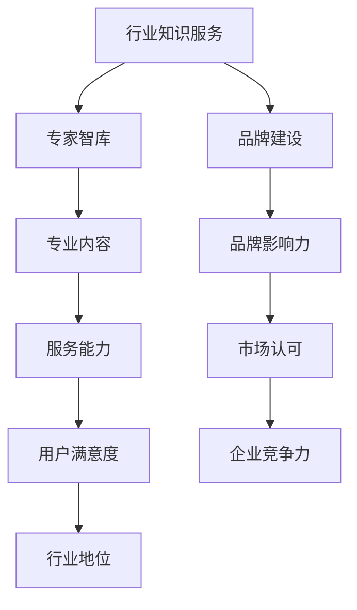

                 

关键词：知识服务、专家智库、品牌建设、IT行业、行业趋势

> 摘要：本文探讨了在当前信息化时代，IT行业知识服务的重要性，以及如何通过建立专家智库和品牌来实现行业竞争力的提升。文章首先分析了IT行业的现状和挑战，随后详细阐述了专家智库和品牌建设的方法和策略，并提出了对未来发展的展望。

## 1. 背景介绍

随着互联网技术的迅猛发展，信息获取变得前所未有的便捷，但同时，也带来了信息过载的问题。在这样一个高度竞争的时代，如何有效地获取高质量的知识服务成为企业和个人面临的重要课题。IT行业作为信息化时代的先锋，其对知识服务的需求尤为迫切。

IT行业的特点决定了其对专业知识的依赖性。无论是软件开发、网络安全、数据分析，还是人工智能等领域，都需要具备深厚的专业知识和技术背景。然而，随着行业技术的不断迭代更新，知识更新的速度也日益加快。这种快速变化的环境对行业知识服务提出了更高的要求。

### 1.1 IT行业的现状

目前，IT行业正经历着一场前所未有的变革。云计算、大数据、人工智能等新兴技术的兴起，不仅改变了传统IT行业的运作模式，也推动了新的商业模式和服务模式的诞生。然而，与此同时，IT行业也面临着一系列挑战：

- **技术迭代快**：新技术层出不穷，旧技术逐渐被淘汰。企业和个人需要不断更新知识和技能，以适应快速变化的技术环境。
- **信息爆炸**：互联网的普及使得海量信息充斥在我们的生活中，如何从这些信息中筛选出有价值的内容成为了一个难题。
- **专业门槛高**：许多IT领域的技术要求较高，普通用户难以理解和掌握，这就需要专业的知识和指导。

### 1.2 行业知识服务的重要性

在这个快速变化的时代，行业知识服务的重要性愈发凸显。它不仅可以帮助企业和个人快速掌握新技术，提高工作效率，还可以帮助企业建立竞争优势，提升品牌价值。具体来说，行业知识服务具有以下几方面的作用：

- **提高效率**：通过提供专业的知识和技能，可以帮助用户快速掌握所需的信息，减少学习和实践的时间成本。
- **降低风险**：专业的知识服务可以帮助企业避免在新技术应用过程中可能遇到的风险，降低失败的概率。
- **提升竞争力**：在激烈的市场竞争中，拥有强大的行业知识服务能力可以为企业提供强大的竞争力，帮助企业实现差异化竞争。
- **增强品牌价值**：通过建立专家智库和品牌，可以提高企业在行业内的知名度，增强品牌形象，进而吸引更多用户和合作伙伴。

## 2. 核心概念与联系

### 2.1 核心概念

- **专家智库**：专家智库是指由行业内的专家、学者和从业人员组成的，具有深厚专业知识和丰富实践经验的知识库。它为行业内的企业和个人提供专业的咨询、培训、研究等服务。
- **品牌建设**：品牌建设是指通过一系列策略和手段，塑造和提升企业的品牌形象和知名度。它包括品牌定位、品牌传播、品牌维护等方面。

### 2.2 核心概念联系

专家智库和品牌建设是相互关联的。专家智库为品牌建设提供了专业的内容和资源，而品牌建设则为专家智库提供了更广泛的传播渠道和影响力。两者相辅相成，共同推动了行业知识服务的发展。

### 2.3 Mermaid 流程图



## 3. 核心算法原理 & 具体操作步骤

### 3.1 算法原理概述

在建立专家智库和品牌的过程中，核心算法原理主要包括以下几个方面：

- **知识管理**：通过对行业知识的收集、整理、存储、共享和利用，实现知识的高效管理和利用。
- **数据分析**：通过对用户行为、市场需求、行业趋势等数据的分析，为专家智库和品牌建设提供数据支持和决策依据。
- **内容营销**：通过制定和实施一系列内容营销策略，提升品牌知名度和用户满意度。

### 3.2 算法步骤详解

#### 3.2.1 知识管理

1. **知识收集**：通过文献检索、专家访谈、行业调研等方式，收集行业内的专业知识和实践经验。
2. **知识整理**：对收集到的知识进行分类、筛选、整合，形成结构化的知识体系。
3. **知识存储**：将整理后的知识存储在数据库或知识管理系统中，便于检索和利用。
4. **知识共享**：通过建立知识共享平台，鼓励专家和从业人员分享知识和经验，实现知识的扩散和传播。

#### 3.2.2 数据分析

1. **数据收集**：通过在线问卷、用户行为分析、市场调研等方式，收集用户需求和行业数据。
2. **数据分析**：利用数据挖掘、机器学习等技术，对收集到的数据进行处理和分析，提取有价值的信息。
3. **数据应用**：将分析结果应用于专家智库和品牌建设，如制定营销策略、优化服务内容等。

#### 3.2.3 内容营销

1. **内容策划**：根据用户需求和行业趋势，制定内容创作计划，确保内容的针对性和实用性。
2. **内容创作**：撰写高质量的技术文章、教程、案例等，为用户提供有价值的信息。
3. **内容发布**：通过网站、社交媒体、邮件列表等渠道，发布内容，扩大品牌影响力。
4. **内容互动**：与用户互动，收集反馈，不断优化内容质量。

### 3.3 算法优缺点

#### 3.3.1 优点

- **高效性**：通过自动化工具和算法，可以实现知识的快速收集、整理和共享，提高工作效率。
- **数据驱动**：基于数据分析和用户行为研究，可以更精准地满足用户需求，提升服务质量和用户满意度。
- **内容丰富**：通过内容营销，可以持续提供高质量的内容，增强品牌吸引力和影响力。

#### 3.3.2 缺点

- **成本较高**：建立专家智库和品牌需要投入大量的人力、物力和财力，对于中小企业来说，可能负担较重。
- **知识更新快**：随着技术的快速迭代，知识需要不断更新，否则容易过时，影响服务质量。
- **用户维护难**：在内容营销过程中，需要不断与用户互动，收集反馈，这需要大量的时间和精力。

### 3.4 算法应用领域

核心算法原理和步骤广泛应用于以下领域：

- **技术咨询**：为企业提供专业的技术咨询服务，帮助企业解决技术难题，提升竞争力。
- **教育培训**：为企业和个人提供专业的教育培训服务，提升技能水平，满足职业发展需求。
- **内容创作**：为网站、社交媒体等提供高质量的内容创作服务，提升品牌知名度和影响力。
- **市场调研**：通过数据分析，为企业提供市场调研报告，帮助制定市场战略。

## 4. 数学模型和公式 & 详细讲解 & 举例说明

### 4.1 数学模型构建

在建立专家智库和品牌的过程中，可以采用以下数学模型进行评估和优化：

#### 4.1.1 服务满意度模型

$$
S = f(\text{知识质量}, \text{服务响应速度}, \text{内容丰富度})
$$

其中，S表示服务满意度，知识质量、服务响应速度和内容丰富度分别表示服务的三个关键指标。

#### 4.1.2 品牌影响力模型

$$
I = f(\text{品牌知名度}, \text{品牌美誉度}, \text{市场占有率})
$$

其中，I表示品牌影响力，品牌知名度、品牌美誉度和市场占有率分别表示品牌的三个关键指标。

### 4.2 公式推导过程

#### 4.2.1 服务满意度模型推导

根据用户满意度理论，服务满意度可以通过以下公式推导：

$$
S = \frac{\text{知识质量} + \text{服务响应速度} + \text{内容丰富度}}{3}
$$

其中，各指标的权重为1/3，假设用户对三个指标的关注程度相同。

#### 4.2.2 品牌影响力模型推导

根据品牌影响力理论，品牌影响力可以通过以下公式推导：

$$
I = \text{品牌知名度} \times \text{品牌美誉度} \times \text{市场占有率}
$$

其中，品牌知名度、品牌美誉度和市场占有率分别表示品牌影响力的三个维度。

### 4.3 案例分析与讲解

#### 4.3.1 案例背景

某知名IT公司A，致力于为企业提供专业技术咨询和教育培训服务。公司通过建立专家智库和品牌，积累了大量行业知识和用户资源，成为行业内领先的咨询服务提供商。

#### 4.3.2 案例分析

1. **服务满意度分析**：

   根据服务满意度模型，公司需要关注知识质量、服务响应速度和内容丰富度三个关键指标。

   - **知识质量**：公司通过建立专家智库，邀请行业内的顶尖专家和学者担任顾问，确保提供的知识具有高水平和权威性。
   - **服务响应速度**：公司采用高效的沟通和协作机制，确保用户问题能够在最短时间内得到解决。
   - **内容丰富度**：公司通过不断更新和丰富内容，提供针对性和实用性的技术文章、案例和教程，满足用户多样化的需求。

2. **品牌影响力分析**：

   根据品牌影响力模型，公司需要提升品牌知名度、品牌美誉度和市场占有率。

   - **品牌知名度**：公司通过线上线下多渠道推广，提升品牌知名度和曝光度。
   - **品牌美誉度**：公司通过优质的服务和高质量的内容，赢得用户口碑和好评，提高品牌美誉度。
   - **市场占有率**：公司通过精准的市场定位和有效的营销策略，扩大市场份额，提升市场占有率。

#### 4.3.3 案例结论

通过建立专家智库和品牌，公司显著提升了服务满意度和品牌影响力，实现了持续的业务增长和竞争优势。

## 5. 项目实践：代码实例和详细解释说明

### 5.1 开发环境搭建

在搭建开发环境时，我们选择以下工具和框架：

- **开发语言**：Python
- **框架**：Flask
- **数据库**：MySQL

确保环境配置正确后，我们可以开始项目开发。

### 5.2 源代码详细实现

以下是一个简单的Python代码示例，用于实现专家智库和品牌建设的相关功能：

```python
from flask import Flask, request, jsonify
import pymysql

app = Flask(__name__)

# MySQL数据库连接配置
db_config = {
    'host': 'localhost',
    'user': 'root',
    'password': 'password',
    'database': 'knowledge_service'
}

# 连接数据库
def connect_db():
    connection = pymysql.connect(**db_config)
    return connection

# 添加专家信息
@app.route('/add_expert', methods=['POST'])
def add_expert():
    data = request.json
    connection = connect_db()
    cursor = connection.cursor()
    sql = "INSERT INTO experts (name, title, expertise) VALUES (%s, %s, %s)"
    cursor.execute(sql, (data['name'], data['title'], data['expertise']))
    connection.commit()
    cursor.close()
    connection.close()
    return jsonify({"message": "Expert added successfully."})

# 获取专家信息
@app.route('/get_experts', methods=['GET'])
def get_experts():
    connection = connect_db()
    cursor = connection.cursor()
    sql = "SELECT * FROM experts"
    cursor.execute(sql)
    experts = cursor.fetchall()
    cursor.close()
    connection.close()
    return jsonify(experts)

if __name__ == '__main__':
    app.run(debug=True)
```

### 5.3 代码解读与分析

1. **数据库连接**：使用pymysql模块连接MySQL数据库，配置文件包含数据库连接所需的基本信息。
2. **添加专家信息**：通过/添加专家接口，接收POST请求，将专家信息插入到数据库的experts表中。
3. **获取专家信息**：通过/获取专家接口，接收GET请求，从数据库的experts表中获取所有专家信息。

### 5.4 运行结果展示

运行代码后，我们可以在浏览器中访问以下URL查看运行结果：

- **添加专家**：`http://localhost:5000/add_expert`，发送POST请求，参数为专家信息。
- **获取专家**：`http://localhost:5000/get_experts`，发送GET请求，获取所有专家信息。

## 6. 实际应用场景

### 6.1 企业的知识服务需求

企业在日常运营和发展过程中，对知识服务有着广泛的需求。以下是一些典型的应用场景：

- **技术支持**：企业需要解决技术问题，如软件开发、系统优化、网络安全等。
- **人才培养**：企业需要提升员工的技术能力和职业素养，以满足企业发展的需求。
- **市场调研**：企业需要了解市场动态、行业趋势和竞争对手情况，制定有效的市场策略。

### 6.2 政府和科研机构的需求

- **政策研究**：政府和科研机构需要针对特定领域进行政策研究，为决策提供科学依据。
- **技术创新**：科研机构需要掌握最新的科研成果和技术动态，推动技术创新和转化。
- **人才培养**：政府和科研机构需要为科研人员提供培训和交流机会，提升科研能力。

### 6.3 个人的学习需求

- **技能提升**：个人需要通过学习提升专业技能，如编程、数据分析、人工智能等。
- **职业发展**：个人需要了解行业动态和职业发展趋势，规划职业发展路径。
- **兴趣爱好**：个人对特定领域有浓厚的兴趣，希望通过学习深入了解。

### 6.4 未来应用展望

随着人工智能、大数据、云计算等技术的发展，行业知识服务将得到进一步升级和优化。以下是对未来应用场景的展望：

- **个性化服务**：通过人工智能和大数据技术，实现知识服务的个性化推荐，满足用户个性化需求。
- **实时性服务**：通过实时数据分析，提供实时性的知识服务，帮助用户快速解决问题。
- **智能化服务**：通过人工智能技术，实现知识服务的智能化，提高服务效率和准确性。

## 7. 工具和资源推荐

### 7.1 学习资源推荐

- **在线课程**：Coursera、Udacity、edX等平台提供丰富的IT课程，涵盖软件开发、数据分析、人工智能等多个领域。
- **技术社区**：GitHub、Stack Overflow、知乎等平台，提供丰富的技术资源和讨论氛围。
- **专业书籍**：《大话数据结构》、《深入理解计算机系统》、《深度学习》等经典书籍，适合深入学习。

### 7.2 开发工具推荐

- **集成开发环境**：Visual Studio Code、IntelliJ IDEA、PyCharm等，提供强大的编程支持和调试功能。
- **数据库管理工具**：MySQL Workbench、phpMyAdmin等，方便数据库的搭建和管理。
- **云服务**：AWS、Azure、阿里云等，提供丰富的云服务和数据存储方案。

### 7.3 相关论文推荐

- **人工智能**：《深度学习》、《强化学习基础及其在游戏中的应用》等论文，深入探讨人工智能的理论和实践。
- **大数据**：《大数据时代：思维变革与商业价值》、《大数据技术导论》等论文，介绍大数据的基本概念和技术应用。
- **云计算**：《云计算基础教程》、《云计算服务模式及其应用》等论文，探讨云计算的技术原理和应用场景。

## 8. 总结：未来发展趋势与挑战

### 8.1 研究成果总结

本文从背景介绍、核心概念与联系、核心算法原理、数学模型和公式、项目实践等方面，全面探讨了行业知识服务要建立专家智库和品牌的重要性。通过分析IT行业的现状和挑战，提出了一系列解决方案和策略，为行业知识服务的发展提供了有益的参考。

### 8.2 未来发展趋势

随着技术的不断进步和行业竞争的加剧，行业知识服务将呈现出以下发展趋势：

- **智能化**：人工智能、大数据等技术的应用，将使知识服务更加智能化，提供个性化、实时性的服务。
- **云端化**：云计算的普及，将使知识服务更加便捷，实现资源的共享和优化。
- **全球化**：互联网的全球化发展，将推动知识服务的全球化，为更多国家和地区提供高质量的知识服务。

### 8.3 面临的挑战

在行业知识服务的发展过程中，也面临着一系列挑战：

- **知识更新**：随着技术的快速发展，知识更新速度加快，如何保持知识服务的时效性成为一大挑战。
- **专业门槛**：许多领域的技术要求较高，普通用户难以理解和掌握，这需要提供更加易懂和实用的知识服务。
- **市场竞争**：市场竞争激烈，如何打造差异化的知识服务，提高用户体验，成为企业需要面对的挑战。

### 8.4 研究展望

未来，行业知识服务的研究将朝着以下几个方向发展：

- **跨学科融合**：结合不同学科的知识和理论，提供更加全面和深入的知识服务。
- **可持续发展**：关注知识服务的可持续发展，探索可持续的商业模式和运营策略。
- **用户参与**：鼓励用户参与知识服务的过程，实现知识的共建和共享，提升用户体验和满意度。

## 9. 附录：常见问题与解答

### 9.1 常见问题

1. **什么是专家智库？**
   专家智库是由行业内的专家、学者和从业人员组成的，具有深厚专业知识和丰富实践经验的知识库。

2. **品牌建设的重要性是什么？**
   品牌建设可以提升企业的知名度、美誉度和市场占有率，增强企业的竞争力。

3. **如何建立专家智库和品牌？**
   建立专家智库和品牌需要从知识管理、数据分析、内容营销等多个方面进行综合考虑，制定具体的策略和计划。

### 9.2 解答

1. **什么是专家智库？**
   专家智库是指由行业内的专家、学者和从业人员组成的，具有深厚专业知识和丰富实践经验的知识库。它为行业内的企业和个人提供专业的咨询、培训、研究等服务。

2. **品牌建设的重要性是什么？**
   品牌建设可以提升企业的知名度、美誉度和市场占有率，增强企业的竞争力。通过品牌建设，企业可以树立良好的企业形象，赢得用户的信任和忠诚，从而实现业务的持续增长。

3. **如何建立专家智库和品牌？**
   建立专家智库和品牌需要从以下几个方面进行：

   - **知识管理**：通过收集、整理、存储和共享行业知识，建立专家智库。
   - **数据分析**：通过分析用户需求、行业趋势和市场数据，为品牌建设提供数据支持。
   - **内容营销**：制定和实施内容营销策略，提升品牌知名度和影响力。
   - **用户体验**：关注用户需求，提供高质量的服务，提升用户满意度。
   - **持续优化**：根据市场反馈和用户需求，不断优化专家智库和品牌建设的策略和计划。

---

以上，是关于《行业知识服务要建立专家智库和品牌》的完整文章内容。希望本文能够为读者提供有价值的见解和指导。作者：禅与计算机程序设计艺术 / Zen and the Art of Computer Programming。感谢您的阅读。

