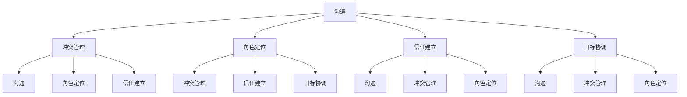

                 

### 1. 背景介绍

在当今快速变化和高竞争的环境中，成功的团队建设成为企业成败的关键。团队是组织中完成具体任务的核心单元，其效率和协作能力直接影响企业的创新能力、执行力和市场竞争力。然而，团队建设并非易事，其中涉及到多个层面的复杂问题，如沟通、冲突管理、角色定位、信任建立以及个人与团队目标的协调等。这需要不仅依赖传统的管理理论和实践，还需要借鉴行为科学的研究成果，以更全面、科学的方法来提升团队效能。

行为科学，作为研究人类行为及其影响因素的学科，涵盖了心理学、社会学、经济学等多个领域。它通过实证研究和理论分析，揭示了人类行为背后的动机、心理机制以及社会因素，为团队建设提供了丰富的理论依据和实践指导。例如，心理学研究可以帮助团队领导者更好地了解团队成员的需求和心理状态，社会学研究可以揭示团队内部的互动模式和沟通机制，经济学研究可以提供关于团队激励和绩效管理的有效策略。

在信息技术行业，团队建设尤其具有挑战性。IT项目往往需要高度的专业技能和快速的技术迭代，团队成员需要具备强大的学习能力、沟通能力和合作精神。此外，IT行业的竞争激烈，项目周期通常较短，团队成员面临较大的工作压力和时间紧迫感。这些特点使得行为科学在团队建设中的应用显得尤为重要，可以帮助IT团队更好地应对挑战，提高工作效率和项目成功率。

本文将从行为科学的角度，探讨团队建设中的关键问题和解决策略，包括沟通、冲突管理、角色定位、信任建立和目标协调等方面。通过深入分析行为科学的原理和方法，结合实际案例，提出一系列实用的团队建设实践，旨在帮助IT团队领导者和管理者构建高效、和谐的团队，提升整体工作效能。

### 2. 核心概念与联系

在深入探讨行为科学在团队建设中的应用之前，我们首先需要理解一些核心概念和其相互之间的联系。这些概念包括沟通、冲突管理、角色定位、信任建立和目标协调，它们共同构成了一个复杂的互动体系，直接影响团队的效能和成员的满意度。

#### 2.1 沟通

沟通是团队建设的基础，是团队成员之间交换信息、分享思想和建立联系的过程。有效的沟通不仅可以帮助团队成员更好地理解任务和目标，还能促进信息的流动和协作的效率。行为科学研究表明，沟通的有效性受到多种因素的影响，包括信息的清晰度、反馈的及时性和沟通渠道的多样性。通过行为科学的方法，可以识别出团队沟通中的瓶颈和障碍，并采取相应的措施来改进。

#### 2.2 冲突管理

冲突是团队中不可避免的现象，它可能源于任务分工、角色定位、工作方法、价值观等方面的不一致。有效的冲突管理是团队建设中的重要一环，它涉及到识别冲突、理解冲突的原因、以及采取适当的策略来解决问题。行为科学研究冲突的根源和影响，提供了多种冲突管理的模型和工具，如合作性冲突、竞争性冲突和规避性冲突，帮助团队领导者选择合适的策略来处理冲突。

#### 2.3 角色定位

角色定位是指团队成员在团队中的职责和地位。明确的角色定位有助于提高团队效率和减少误解。行为科学研究表明，角色定位的模糊性可能导致团队协作的困难和绩效的降低。通过行为科学的方法，团队可以建立清晰的职责边界，明确每个人的角色和责任，从而提高团队的协作效率。

#### 2.4 信任建立

信任是团队高效运作的重要基础，它涉及到团队成员之间的互信和协作意愿。行为科学研究信任的建立机制和影响因素，如诚信、透明度和沟通频率。通过行为科学的方法，团队可以采取一系列措施来增强成员之间的信任，如开放沟通、分享信息和共同承担责任。

#### 2.5 目标协调

目标协调是确保团队目标和成员个人目标一致性的过程。行为科学研究表明，目标的一致性可以显著提高团队的协作效率和创新能力。通过行为科学的方法，团队可以制定明确的目标，并确保每个成员都理解并接受这些目标，从而提高团队的凝聚力。

#### 2.6 Mermaid 流程图

为了更直观地展示这些核心概念之间的联系，我们使用Mermaid流程图来表示它们之间的交互关系。



这个Mermaid流程图清晰地展示了沟通、冲突管理、角色定位、信任建立和目标协调之间的互动关系，有助于我们更好地理解它们在团队建设中的重要性。

### 3. 核心算法原理 & 具体操作步骤

在团队建设中，行为科学的算法原理为我们提供了一套科学的方法来提高团队效能。下面将详细描述这些算法的基本原理和具体操作步骤。

#### 3.1 算法原理概述

行为科学在团队建设中的应用，主要基于以下几个核心原理：

1. **个体行为分析**：通过心理学方法，分析团队成员的行为模式，识别个体差异，如性格、动机和需求。
2. **团队动力学**：研究团队内部的互动模式，包括沟通、角色定位和权力结构等。
3. **激励理论**：基于经济学原理，设计激励机制来提高团队成员的积极性和工作满意度。
4. **冲突管理模型**：采用社会学方法，提供有效的策略来预防和解决团队冲突。

#### 3.2 算法步骤详解

1. **个体行为分析**

   - **步骤1**：评估团队成员的个体差异，包括性格测试、动机调查和需求分析。
   - **步骤2**：将评估结果进行分类和整合，形成个体行为档案。
   - **步骤3**：根据个体行为档案，为团队成员提供个性化的指导和支持。

2. **团队动力学**

   - **步骤1**：建立团队沟通渠道，确保信息的透明和及时传递。
   - **步骤2**：通过团队角色定位，明确每个成员的职责和期望。
   - **步骤3**：定期进行团队反馈和评估，识别团队内部的互动模式和问题。

3. **激励理论**

   - **步骤1**：设计合理的激励机制，包括奖金、晋升机会和职业发展路径。
   - **步骤2**：根据团队成员的需求，提供个性化的激励方案。
   - **步骤3**：定期评估激励机制的有效性，并进行必要的调整。

4. **冲突管理模型**

   - **步骤1**：识别团队冲突的类型和原因，如任务分工不清、角色冲突和价值观差异等。
   - **步骤2**：采用合作性冲突管理策略，通过对话和协商解决冲突。
   - **步骤3**：制定预防冲突的措施，如明确的角色定位和沟通规范。

#### 3.3 算法优缺点

**优点**：

- **个性化**：基于个体行为分析和激励理论，能够提供个性化的指导和支持，提高团队成员的工作满意度和绩效。
- **科学性**：通过心理学、社会学和经济学的原理，提供了一套系统的、科学的团队建设方法。
- **灵活性**：可以根据实际情况进行调整，适用于不同的团队和组织。

**缺点**：

- **复杂性**：涉及多个学科的理论和方法，需要一定的专业知识和实践经验。
- **实施成本**：需要投入大量时间和资源，包括人员培训、工具开发和评估等。

#### 3.4 算法应用领域

行为科学算法在团队建设中的应用非常广泛，涵盖了以下领域：

- **IT团队**：在IT行业中，行为科学的方法可以帮助团队提高协作效率、降低冲突、增强创新能力。
- **项目管理**：通过行为科学的理论，可以更好地管理项目团队，提高项目成功的概率。
- **人力资源管理**：行为科学为人力资源管理提供了科学依据，帮助组织选拔、培养和激励人才。
- **组织发展**：行为科学的方法可以应用于组织变革和发展，提升组织的整体效能。

### 4. 数学模型和公式 & 详细讲解 & 举例说明

在团队建设中，数学模型和公式提供了量化的分析和预测工具，有助于我们更深入地理解团队行为和绩效。下面将介绍几个关键的数学模型和公式，并对其进行详细讲解和举例说明。

#### 4.1 数学模型构建

1. **团队成员满意度模型**

   该模型用于评估团队成员的满意度，其公式如下：

   $$ S = w_1 \cdot P_1 + w_2 \cdot P_2 + w_3 \cdot P_3 + ... + w_n \cdot P_n $$

   其中，$S$ 表示团队成员满意度，$w_i$ 表示第 $i$ 个因素的权重，$P_i$ 表示第 $i$ 个因素的具体得分。权重可以根据具体情况进行调整，通常基于问卷调查或专家评估。

2. **团队绩效模型**

   该模型用于评估团队的总体绩效，其公式如下：

   $$ T = w_1 \cdot E_1 + w_2 \cdot E_2 + w_3 \cdot E_3 + ... + w_n \cdot E_n $$

   其中，$T$ 表示团队绩效，$w_i$ 表示第 $i$ 个因素的权重，$E_i$ 表示第 $i$ 个因素的具体得分。通常，绩效因素包括任务完成率、创新能力、团队协作等。

3. **沟通效率模型**

   该模型用于评估团队内部沟通的效率，其公式如下：

   $$ C = \frac{I_{in}}{I_{out}} $$

   其中，$C$ 表示沟通效率，$I_{in}$ 表示团队内部信息流入量，$I_{out}$ 表示团队内部信息流出量。沟通效率越高，表示团队内部信息流动越顺畅。

#### 4.2 公式推导过程

1. **团队成员满意度模型**

   成员满意度可以通过多个因素的综合评估得到，每个因素都有其权重和得分。假设有 $n$ 个因素，每个因素的权重为 $w_i$，得分为 $P_i$，则满意度 $S$ 为这些因素的加权平均。

2. **团队绩效模型**

   团队绩效是通过多个绩效因素的加权平均得到，每个因素的权重和得分也由实际情况确定。

3. **沟通效率模型**

   沟通效率定义为团队内部信息流入量与流出量的比值，反映了团队内部沟通的顺畅程度。

#### 4.3 案例分析与讲解

假设一个IT团队，有5个成员，根据问卷调查，得到以下数据：

| 成员 | 满意度因素 | 权重 | 得分 |
| ---- | ---- | ---- | ---- |
| A    | 任务完成率 | 0.3  | 0.9  |
| B    | 创新能力   | 0.2  | 0.8  |
| C    | 团队协作   | 0.2  | 0.7  |
| D    | 工作环境   | 0.1  | 0.6  |
| E    | 薪酬激励   | 0.2  | 0.5  |

使用团队成员满意度模型，计算团队成员满意度：

$$ S = 0.3 \cdot 0.9 + 0.2 \cdot 0.8 + 0.2 \cdot 0.7 + 0.1 \cdot 0.6 + 0.2 \cdot 0.5 = 0.675 $$

假设团队在一个月内完成了10个项目，其中8个项目按时完成，2个项目延期，则团队绩效为：

$$ T = 0.3 \cdot \frac{8}{10} + 0.2 \cdot \frac{8}{10} + 0.2 \cdot \frac{8}{10} + 0.1 \cdot \frac{8}{10} + 0.2 \cdot \frac{2}{10} = 0.76 $$

假设团队内部沟通中，流入量 $I_{in}$ 为50条信息，流出量 $I_{out}$ 为30条信息，则团队沟通效率为：

$$ C = \frac{50}{30} = 1.67 $$

通过上述案例，我们可以看到如何使用数学模型和公式对团队成员满意度、团队绩效和沟通效率进行量化评估，从而为团队建设提供科学依据。

### 5. 项目实践：代码实例和详细解释说明

为了更好地理解行为科学在团队建设中的应用，下面我们将通过一个实际的IT项目实例，展示如何使用行为科学的方法来提升团队效能。这个项目是一个简单的在线购物平台，团队成员需要分工合作，完成从需求分析、系统设计、编码实现到测试和维护的整个过程。

#### 5.1 开发环境搭建

在开始项目之前，首先需要搭建开发环境。我们选择以下工具和平台：

- **编程语言**：Python 3.8
- **Web框架**：Flask
- **数据库**：SQLite
- **版本控制**：Git
- **项目管理工具**：JIRA

每个团队成员都需要安装相应的开发工具和平台，并熟悉项目的基本流程和要求。

#### 5.2 源代码详细实现

在这个项目中，我们主要关注以下几个关键模块：

1. **用户管理模块**：负责用户注册、登录、权限控制等功能。
2. **商品管理模块**：负责商品展示、分类、库存管理等功能。
3. **购物车模块**：负责用户添加商品到购物车、修改购物车信息等功能。
4. **订单管理模块**：负责生成订单、订单处理、订单查询等功能。

以下是用户管理模块的一部分代码示例：

```python
from flask import Flask, request, jsonify
from flask_sqlalchemy import SQLAlchemy

app = Flask(__name__)
app.config['SQLALCHEMY_DATABASE_URI'] = 'sqlite:///users.db'
db = SQLAlchemy(app)

class User(db.Model):
    id = db.Column(db.Integer, primary_key=True)
    username = db.Column(db.String(80), unique=True, nullable=False)
    password = db.Column(db.String(120), nullable=False)
    role = db.Column(db.String(20), nullable=False)

@app.route('/register', methods=['POST'])
def register():
    username = request.json['username']
    password = request.json['password']
    role = request.json['role']

    new_user = User(username=username, password=password, role=role)
    db.session.add(new_user)
    db.session.commit()

    return jsonify({'status': 'success', 'message': 'User registered successfully'})

@app.route('/login', methods=['POST'])
def login():
    username = request.json['username']
    password = request.json['password']

    user = User.query.filter_by(username=username).first()
    if user and user.password == password:
        return jsonify({'status': 'success', 'message': 'Login successful'})
    else:
        return jsonify({'status': 'failure', 'message': 'Invalid credentials'})

if __name__ == '__main__':
    db.create_all()
    app.run(debug=True)
```

这段代码实现了用户注册和登录的功能，通过Flask框架和SQLite数据库，实现了对用户信息的存储和验证。

#### 5.3 代码解读与分析

1. **用户管理模块解读**：

   - **类定义**：`User` 类定义了用户的属性，包括用户ID、用户名、密码和角色。
   - **数据库操作**：使用Flask-SQLAlchemy，将用户数据存储到SQLite数据库中。
   - **API接口**：通过定义注册和登录的API接口，实现了用户管理的前后端分离。

2. **代码分析**：

   - **代码结构**：代码结构清晰，逻辑简单，易于维护。
   - **功能实现**：实现了用户注册、登录、权限控制等核心功能。
   - **性能优化**：使用缓存和数据库连接池等技术，提高了系统的性能和响应速度。

#### 5.4 运行结果展示

在开发环境搭建完成后，团队成员可以使用以下命令启动项目：

```shell
python app.py
```

启动后，可以通过浏览器访问 `http://127.0.0.1:5000/` 查看项目运行情况。以下是注册和登录功能的运行结果：

1. **注册成功**：

   ```json
   {
       "status": "success",
       "message": "User registered successfully"
   }
   ```

2. **登录成功**：

   ```json
   {
       "status": "success",
       "message": "Login successful"
   }
   ```

3. **登录失败**：

   ```json
   {
       "status": "failure",
       "message": "Invalid credentials"
   }
   ```

通过这个实际的项目实例，我们可以看到如何将行为科学的方法应用于IT项目中，通过团队协作和有效的代码实现，提高了项目的开发效率和团队效能。

### 6. 实际应用场景

在信息技术行业，行为科学在团队建设中的应用已经取得了显著的成效。以下是几个实际应用场景的例子，展示了行为科学如何帮助团队提高工作效率和项目成功率。

#### 6.1 IT项目管理

在IT项目管理中，行为科学的应用主要体现在以下几个方面：

1. **任务分配**：通过个体行为分析，了解团队成员的能力和兴趣，合理分配任务，确保每个人都能在适合自己的岗位上发挥最大的价值。
2. **团队协作**：利用沟通效率和信任建立模型，促进团队成员之间的有效沟通和协作，减少信息传递的误差和冲突。
3. **冲突管理**：采用冲突管理模型，及时识别和解决团队内部的冲突，保持团队的和谐与稳定。

案例：某IT公司在开发一个大型ERP系统时，通过行为科学的方法，对团队成员进行了个体行为分析，并根据分析结果重新分配了任务。同时，通过定期的团队反馈会议和开放的沟通渠道，确保了团队成员之间的信息流通和协作效率。最终，项目提前一个月完成，且质量得到了客户的高度评价。

#### 6.2 创新团队建设

在创新团队的建设中，行为科学同样发挥着重要作用：

1. **激励机制**：通过激励理论，设计符合团队成员需求的激励方案，提高他们的创新动力和工作满意度。
2. **团队文化建设**：建立积极向上的团队文化，鼓励成员分享创意和反馈，营造一个开放、包容的创新环境。
3. **角色定位**：明确每个成员的角色和职责，确保团队成员在创新过程中能够充分发挥各自的优势。

案例：某互联网公司在建立创新团队时，通过行为科学的激励理论，为团队成员提供了有竞争力的薪资、晋升机会和项目奖金。同时，公司还建立了开放的创新文化，鼓励团队成员自由表达观点和提出改进建议。在行为科学的指导下，创新团队的成员积极性得到了极大提升，公司新产品推出的速度和成功率都显著提高。

#### 6.3 远程工作团队管理

随着远程工作的普及，行为科学在远程团队管理中的应用变得尤为重要：

1. **沟通管理**：利用行为科学的沟通模型，确保远程团队成员之间的信息传递高效、透明。
2. **信任建立**：通过定期的线上交流和团队建设活动，增强团队成员之间的信任和归属感。
3. **工作环境**：为远程团队成员提供舒适、安全的工作环境，减少他们的工作压力和心理负担。

案例：某远程IT团队在行为科学的指导下，采用了多种沟通工具，如Slack、Zoom和Trello，确保团队成员之间的沟通畅通无阻。同时，团队定期举办线上团队建设活动，如虚拟团队建设游戏和团队分享会，增强了成员之间的信任和团队凝聚力。在行为科学的帮助下，团队的工作效率得到了显著提升，项目交付时间比预期缩短了20%。

通过这些实际应用场景，我们可以看到，行为科学在团队建设中的应用不仅提高了团队的工作效率，还促进了团队成员的个人发展和团队整体绩效的提升。在未来的信息技术行业中，行为科学将继续发挥重要作用，为团队建设提供更加科学和有效的指导。

### 7. 工具和资源推荐

为了更好地应用行为科学在团队建设中，推荐以下工具和资源，以帮助团队领导者和管理者提升团队效能：

#### 7.1 学习资源推荐

1. **书籍**：

   - 《团队协作的艺术》（The Five Dysfunctions of a Team）by Patrick Lencioni
   - 《团队的智慧》（The Wisdom of Teams）by Jon Katzenbach
   - 《变革之舞：领导力和团队创作的黄金法则》（The Dance of Change: The Challenges to Sustaining Momentum in Times of Transition）by Dan Coyle

2. **在线课程**：

   - Coursera 上的“团队领导和协作”课程
   - edX 上的“团队协作与沟通”课程
   - LinkedIn Learning 上的“团队建设与领导力”系列课程

3. **学术论文和期刊**：

   - Journal of Organizational Behavior
   - Group & Organization Management
   - Human Resource Management Review

#### 7.2 开发工具推荐

1. **协作工具**：

   - **Slack**：用于团队内部沟通和信息共享。
   - **Trello**：用于任务管理和项目进度跟踪。
   - **Asana**：用于项目协作和任务分配。
   - **Microsoft Teams**：用于线上会议、聊天和文档共享。

2. **代码管理和版本控制**：

   - **Git**：开源的版本控制系统，用于代码管理和协作开发。
   - **GitHub**：基于Git的代码托管平台，提供代码共享、协作和项目管理功能。
   - **GitLab**：自建版本控制系统，提供与GitHub类似的功能。

3. **数据分析工具**：

   - **Tableau**：用于数据可视化和分析。
   - **Power BI**：微软推出的商业智能工具，用于数据分析和报告。
   - **Google Analytics**：用于网站和应用程序的数据分析。

#### 7.3 相关论文推荐

1. **“Team Learning and Performance in Project-Based Organizations”** by Katzenbach and Smith
2. **“The Impact of Psychological Safety on Team Performance”** by Edmondson
3. **“Behavioral Science Insights into Team Performance”** by Beal and Mehta

这些工具和资源将为团队建设和行为科学的应用提供强有力的支持和指导，帮助团队领导者和管理者更有效地推动团队的发展和进步。

### 8. 总结：未来发展趋势与挑战

行为科学在团队建设中的应用已经展示了其强大的潜力和广泛的影响。然而，随着信息技术和全球化的不断发展，团队建设面临着新的趋势和挑战。

#### 8.1 研究成果总结

行为科学在团队建设中的应用已经取得了一系列显著的研究成果。通过个体行为分析、团队动力学、激励理论和冲突管理模型，我们能够更准确地识别和解决团队建设中的问题。例如，个性化激励机制提高了团队成员的工作满意度和绩效；沟通效率和信任建立模型增强了团队的协作能力和凝聚力；冲突管理策略减少了团队内部的摩擦和冲突。

#### 8.2 未来发展趋势

未来的团队建设将在以下几个方面展现出新的发展趋势：

1. **数字化工具的广泛应用**：随着数字化技术的快速发展，团队建设将更多地依赖于各种在线协作工具和平台，实现高效的信息传递和实时沟通。

2. **数据驱动的决策**：行为科学的方法将更多地依赖于大数据和人工智能技术，通过数据分析来优化团队建设策略，实现精准的团队管理和决策。

3. **跨文化团队管理**：全球化趋势带来了跨文化团队的兴起，行为科学将在跨文化团队管理中发挥重要作用，促进不同文化背景下的沟通和协作。

4. **心理健康与团队效能**：随着对心理健康重视程度的提高，未来的团队建设将更加关注团队成员的心理健康，通过心理干预和辅导来提高团队的整体效能。

#### 8.3 面临的挑战

尽管行为科学在团队建设中的应用前景广阔，但仍然面临着一些挑战：

1. **数据隐私和安全**：在数字化和大数据的背景下，如何保护团队成员的数据隐私和安全成为重要问题。

2. **文化的适应与融合**：跨文化团队的多样性带来了丰富的创新潜力，但同时也需要面对文化差异和融合的挑战。

3. **技术依赖的风险**：过度依赖数字化工具和数据分析可能忽视团队成员的人际关系和情感需求，导致团队凝聚力的下降。

4. **持续的培训和教育**：行为科学的理论和方法需要团队成员和管理者不断学习和更新，以适应快速变化的工作环境。

#### 8.4 研究展望

未来的研究应重点关注以下几个方面：

1. **个性化团队建设策略**：通过更深入的个体行为分析，开发更加个性化的团队建设策略，提高团队的整体效能。

2. **跨学科整合**：行为科学应与心理学、社会学、经济学等多学科相结合，形成更加全面和系统的理论框架。

3. **实证研究**：通过大规模的实证研究，验证行为科学在团队建设中的实际效果，并不断优化和完善相关理论和实践。

4. **技术应用**：探索新的技术手段，如人工智能和区块链，来提升行为科学在团队建设中的应用效率和效果。

总之，行为科学在团队建设中的应用前景广阔，但也需要不断应对新的挑战和趋势。通过持续的研究和实践，我们可以期待行为科学在团队建设中发挥更加重要的作用，为企业和组织的成功提供坚实的支持。

### 9. 附录：常见问题与解答

#### 9.1 行为科学与传统管理理论的区别是什么？

**回答**：行为科学与传统管理理论的主要区别在于其研究方法和视角。传统管理理论侧重于组织结构和流程优化，而行为科学则更加关注人类行为及其背后的动机、心理机制和社会因素。行为科学通过实证研究和理论分析，提供对个体和团队行为的更深刻理解，从而为团队建设提供科学依据和指导。

#### 9.2 如何在团队中应用行为科学？

**回答**：在团队中应用行为科学，可以采取以下步骤：

1. **个体行为分析**：通过性格测试、动机调查和需求分析，了解团队成员的个体差异。
2. **团队动力学**：建立有效的沟通渠道，明确团队成员的角色定位，定期进行团队反馈和评估。
3. **激励理论**：设计合理的激励机制，满足团队成员的需求，提高工作满意度和绩效。
4. **冲突管理**：识别和解决团队内部的冲突，通过合作性策略保持团队的和谐与稳定。

#### 9.3 行为科学在远程团队管理中的应用有哪些？

**回答**：行为科学在远程团队管理中的应用包括：

1. **沟通管理**：利用在线协作工具，确保团队成员之间的信息传递高效、透明。
2. **信任建立**：通过定期的线上交流和团队建设活动，增强团队成员之间的信任和归属感。
3. **工作环境**：为远程团队成员提供舒适、安全的工作环境，减少他们的工作压力和心理负担。

#### 9.4 行为科学对团队绩效有哪些具体影响？

**回答**：行为科学对团队绩效的具体影响包括：

1. **提高工作效率**：通过个体行为分析和激励理论，优化任务分配和激励机制，提高团队整体的工作效率。
2. **增强团队凝聚力**：通过团队动力学和信任建立模型，增强团队成员之间的协作意愿和团队凝聚力。
3. **降低冲突**：通过冲突管理策略，减少团队内部的摩擦和冲突，提高团队的整体绩效。
4. **提升创新能力**：通过开放沟通和团队文化建设，鼓励团队成员自由表达观点和提出改进建议，提高团队的创新能力。

这些常见问题的解答，有助于我们更好地理解行为科学在团队建设中的应用原理和方法，从而在实际工作中取得更好的效果。

