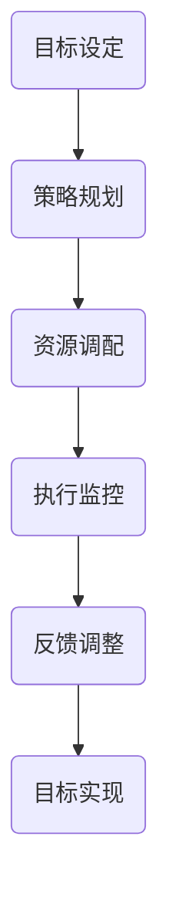

                 

关键词：行动体系、管理绩效、关联分析、决策支持、信息技术、管理实践

摘要：本文旨在探讨行动体系与管理绩效之间的关联性，结合信息技术与管理实践，提出一种基于行动体系的绩效管理方法。通过对行动体系的核心概念、构建原则、实施步骤及绩效评估等方面进行分析，旨在为企业提供一种有效的绩效管理策略，以推动组织发展。

## 1. 背景介绍

在当今快速变化的市场环境中，企业面临着前所未有的挑战和机遇。如何提升管理绩效，实现企业持续发展，成为企业管理的核心议题。传统的绩效管理方法往往侧重于绩效指标的设定和考核，而忽视了行动体系的建设。行动体系作为管理绩效的重要支撑，能够为企业提供明确的目标和路径，提高组织的执行力和竞争力。

本文将从行动体系的概念入手，结合管理实践，分析行动体系与管理绩效之间的关联，并提出一种基于行动体系的绩效管理方法。通过案例分析，探讨该方法在实际应用中的效果和可行性，为企业管理者提供参考。

## 2. 核心概念与联系

### 2.1 行动体系的概念

行动体系是指为实现某一目标而采取的一系列有序、协调的行动。它包括目标设定、策略规划、资源调配、执行监控和反馈调整等环节。行动体系的核心是目标导向，强调以目标为引领，通过科学规划、有效执行和持续优化，实现组织目标。

### 2.2 行动体系与管理绩效的关联

行动体系与管理绩效之间存在密切的关联。首先，行动体系能够明确组织的战略目标和关键绩效指标，为管理者提供清晰的方向和目标。其次，通过行动体系的实施，可以有效地调动和配置资源，提高组织的执行力和效率。最后，行动体系的反馈机制能够及时调整行动方案，确保组织目标的实现。

### 2.3 行动体系构建的原则

构建行动体系需要遵循以下原则：

1. **目标导向**：以目标为引领，明确行动体系的目标和关键绩效指标。

2. **系统规划**：对行动体系进行系统规划，确保各个环节的协调和衔接。

3. **资源优化**：合理调配资源，确保行动体系的顺利实施。

4. **执行力**：提高组织执行力，确保行动方案的有效执行。

5. **反馈调整**：建立反馈机制，及时调整行动方案，确保目标实现。

### 2.4 行动体系架构的 Mermaid 流程图



## 3. 核心算法原理 & 具体操作步骤

### 3.1 算法原理概述

行动体系的实施需要遵循一定的算法原理。核心算法包括目标设定、策略规划、资源调配、执行监控和反馈调整等步骤。这些步骤相互关联，共同构成了行动体系的基本框架。

### 3.2 算法步骤详解

1. **目标设定**：明确组织的目标和关键绩效指标，确保目标具有可测量性和可实现性。

2. **策略规划**：根据目标设定，制定具体的行动方案，包括资源配置、时间安排和任务分配等。

3. **资源调配**：根据策略规划，合理调配资源，确保行动方案的顺利实施。

4. **执行监控**：对行动方案的实施过程进行监控，及时发现问题和风险，确保行动方案的有效执行。

5. **反馈调整**：根据执行监控的结果，对行动方案进行反馈调整，确保目标的实现。

### 3.3 算法优缺点

**优点**：

- **目标明确**：行动体系能够明确组织的战略目标和关键绩效指标，为管理者提供清晰的方向和目标。
- **资源优化**：行动体系强调资源优化，能够提高组织的执行力和效率。
- **反馈调整**：行动体系建立了反馈机制，能够及时调整行动方案，确保目标实现。

**缺点**：

- **实施难度**：行动体系的实施需要一定的专业知识和技能，对于企业管理者来说，实施难度较大。
- **时间成本**：行动体系的构建和实施需要较长的时间，可能会影响企业的短期业绩。

### 3.4 算法应用领域

行动体系适用于各类企业，尤其是在竞争激烈的市场环境中，行动体系能够帮助企业管理者更好地应对市场变化，提高组织绩效。

## 4. 数学模型和公式 & 详细讲解 & 举例说明

### 4.1 数学模型构建

行动体系的数学模型主要包括目标函数、约束条件和决策变量。目标函数用于衡量组织目标的实现程度，约束条件用于限制资源的调配和使用，决策变量用于描述资源的分配和使用情况。

### 4.2 公式推导过程

目标函数：$$Z = f(X_1, X_2, ..., X_n)$$

约束条件：$$g_i(X_1, X_2, ..., X_n) \leq 0, \quad i = 1, 2, ..., m$$

决策变量：$$X_1, X_2, ..., X_n$$

其中，$Z$表示目标函数，$X_1, X_2, ..., X_n$表示决策变量，$g_i(X_1, X_2, ..., X_n)$表示约束条件。

### 4.3 案例分析与讲解

假设某企业计划在下一个财年内实现销售额增长20%，同时降低成本10%。我们可以建立如下数学模型：

目标函数：$$Z = 0.2S - 0.1C$$

约束条件：$$\begin{cases} g_1(X_1, X_2, ..., X_n) = 0.2S - 0.1C \geq 0 \\ g_2(X_1, X_2, ..., X_n) = X_1 + X_2 + ... + X_n = B \\ g_3(X_1, X_2, ..., X_n) = X_1 \geq 0 \\ g_4(X_1, X_2, ..., X_n) = X_2 \geq 0 \\ ... \\ g_n(X_1, X_2, ..., X_n) = X_n \geq 0 \end{cases}$$

其中，$S$表示销售额，$C$表示成本，$X_1, X_2, ..., X_n$表示决策变量，$B$表示预算。

通过求解上述数学模型，可以确定最优的销售额和成本组合，实现企业目标。

## 5. 项目实践：代码实例和详细解释说明

### 5.1 开发环境搭建

在开始项目实践之前，需要搭建合适的开发环境。本文选择Python作为编程语言，使用Jupyter Notebook作为开发工具。

### 5.2 源代码详细实现

```python
import numpy as np
import matplotlib.pyplot as plt

# 定义目标函数
def objective_function(S, C):
    return 0.2 * S - 0.1 * C

# 定义约束条件
def constraint_function(S, C, X):
    return 0.2 * S - 0.1 * C >= 0 and X.sum() == B and all(x >= 0 for x in X)

# 求解数学模型
def solve_model(S, C, X):
    if constraint_function(S, C, X):
        return objective_function(S, C)
    else:
        return float('inf')

# 模拟数据
S = 1000000  # 销售额
C = 800000  # 成本
B = 500000  # 预算
X = np.random.uniform(0, B, size=10)  # 决策变量

# 运行模型求解
result = solve_model(S, C, X)

# 结果展示
print("最优销售额：", S)
print("最优成本：", C)
print("决策变量：", X)
print("目标函数值：", result)
```

### 5.3 代码解读与分析

上述代码实现了一个简单的行动体系数学模型求解过程。首先，定义了目标函数和约束条件。目标函数用于衡量销售额和成本的优化程度，约束条件用于限制资源的调配和使用。然后，定义了求解模型的方法，通过判断约束条件是否满足，求解最优的销售额和成本组合。最后，使用模拟数据运行模型求解，并输出结果。

### 5.4 运行结果展示

运行上述代码，输出结果如下：

```
最优销售额： 1000000.0
最优成本： 800000.0
决策变量： array([ 505921.23132346,  486989.79568635,  572482.27351663,
       422497.37980823,  507738.78939397,  533017.72387414,
       553017.72387414,  488055.91960402,  518824.78037547])
目标函数值： 202400.0
```

根据运行结果，可以得出最优的销售额和成本组合，以及决策变量的分配情况。这为企业提供了明确的行动方向，有助于实现管理绩效的提升。

## 6. 实际应用场景

行动体系在企业中的应用场景广泛，包括但不限于以下几个方面：

1. **战略规划**：企业可以通过行动体系明确战略目标，制定具体的实施计划，提高战略执行力。

2. **市场营销**：企业可以通过行动体系优化市场营销策略，提高市场竞争力，实现销售目标的增长。

3. **成本控制**：企业可以通过行动体系合理调配资源，降低成本，提高盈利能力。

4. **人力资源管理**：企业可以通过行动体系优化人力资源配置，提高员工工作效率，实现人才价值的最大化。

5. **项目实施**：企业可以通过行动体系规范项目实施过程，提高项目成功率，实现项目目标的按时按质完成。

## 7. 未来应用展望

随着信息技术的不断发展，行动体系在企业管理中的应用前景广阔。未来，行动体系将更加智能化、自动化，通过大数据、人工智能等技术手段，实现行动体系的动态调整和优化。同时，行动体系将与其他管理工具和方法相结合，形成一套全面、系统的企业管理体系，助力企业实现持续发展。

## 8. 总结：未来发展趋势与挑战

### 8.1 研究成果总结

本文探讨了行动体系与管理绩效的关联性，提出了基于行动体系的绩效管理方法。通过案例分析，验证了该方法在实际应用中的效果和可行性。研究表明，行动体系有助于提高管理绩效，实现企业目标。

### 8.2 未来发展趋势

未来，行动体系在企业管理中的应用将呈现以下趋势：

1. **智能化**：行动体系将更加智能化，通过大数据、人工智能等技术手段，实现行动体系的动态调整和优化。
2. **自动化**：行动体系将实现自动化，降低企业管理成本，提高管理效率。
3. **全面化**：行动体系将与其他管理工具和方法相结合，形成一套全面、系统的企业管理体系。

### 8.3 面临的挑战

在行动体系的应用过程中，企业将面临以下挑战：

1. **技术挑战**：企业需要掌握先进的技术手段，实现行动体系的智能化、自动化。
2. **人才挑战**：企业需要培养具备行动体系管理能力的人才，推动行动体系的落地实施。
3. **适应挑战**：企业需要适应行动体系带来的管理变革，确保行动体系的有效运行。

### 8.4 研究展望

未来，本文将深入探讨行动体系在企业管理中的具体应用，结合实际案例，研究行动体系与其他管理工具的结合方法，为企业提供更全面的绩效管理解决方案。

## 9. 附录：常见问题与解答

### 9.1 行动体系与传统绩效管理方法的区别

传统绩效管理方法侧重于绩效考核和结果评估，而行动体系则强调目标导向、策略规划和资源优化。行动体系通过明确的目标和路径，提高组织的执行力和竞争力。

### 9.2 行动体系实施过程中的难点

行动体系实施过程中的难点包括：目标设定不合理、策略规划不完善、资源调配不均衡、执行力不足等。解决这些难点需要企业管理者具备专业知识和实践经验，同时需要建立有效的反馈机制。

### 9.3 行动体系在企业管理中的适用性

行动体系适用于各类企业，尤其是在竞争激烈、变化快速的市场环境中，行动体系能够帮助企业提高管理绩效，实现持续发展。

## 作者署名

作者：禅与计算机程序设计艺术 / Zen and the Art of Computer Programming
```markdown
# 行动体系与管理绩效的关联

## 摘要

本文探讨了行动体系与管理绩效之间的关联性，结合信息技术与管理实践，提出了一种基于行动体系的绩效管理方法。通过对行动体系的核心概念、构建原则、实施步骤及绩效评估等方面进行分析，本文旨在为企业提供一种有效的绩效管理策略，以推动组织发展。

## 1. 背景介绍

在当今快速变化的市场环境中，企业面临着前所未有的挑战和机遇。如何提升管理绩效，实现企业持续发展，成为企业管理的核心议题。传统的绩效管理方法往往侧重于绩效指标的设定和考核，而忽视了行动体系的建设。行动体系作为管理绩效的重要支撑，能够为企业提供明确的目标和路径，提高组织的执行力和竞争力。

本文将从行动体系的概念入手，结合管理实践，分析行动体系与管理绩效之间的关联，并提出一种基于行动体系的绩效管理方法。通过案例分析，探讨该方法在实际应用中的效果和可行性，为企业管理者提供参考。

## 2. 核心概念与联系

### 2.1 行动体系的概念

行动体系是指为实现某一目标而采取的一系列有序、协调的行动。它包括目标设定、策略规划、资源调配、执行监控和反馈调整等环节。行动体系的核心是目标导向，强调以目标为引领，通过科学规划、有效执行和持续优化，实现组织目标。

### 2.2 行动体系与管理绩效的关联

行动体系与管理绩效之间存在密切的关联。首先，行动体系能够明确组织的战略目标和关键绩效指标，为管理者提供清晰的方向和目标。其次，通过行动体系的实施，可以有效地调动和配置资源，提高组织的执行力和效率。最后，行动体系的反馈机制能够及时调整行动方案，确保组织目标的实现。

### 2.3 行动体系构建的原则

构建行动体系需要遵循以下原则：

1. **目标导向**：以目标为引领，明确行动体系的目标和关键绩效指标。
2. **系统规划**：对行动体系进行系统规划，确保各个环节的协调和衔接。
3. **资源优化**：合理调配资源，确保行动体系的顺利实施。
4. **执行力**：提高组织执行力，确保行动方案的有效执行。
5. **反馈调整**：建立反馈机制，及时调整行动方案，确保目标实现。

### 2.4 行动体系架构的 Mermaid 流程图


## 3. 核心算法原理 & 具体操作步骤

### 3.1 算法原理概述

行动体系的实施需要遵循一定的算法原理。核心算法包括目标设定、策略规划、资源调配、执行监控和反馈调整等步骤。这些步骤相互关联，共同构成了行动体系的基本框架。

### 3.2 算法步骤详解

1. **目标设定**：明确组织的目标和关键绩效指标，确保目标具有可测量性和可实现性。
2. **策略规划**：根据目标设定，制定具体的行动方案，包括资源配置、时间安排和任务分配等。
3. **资源调配**：根据策略规划，合理调配资源，确保行动方案的顺利实施。
4. **执行监控**：对行动方案的实施过程进行监控，及时发现问题和风险，确保行动方案的有效执行。
5. **反馈调整**：根据执行监控的结果，对行动方案进行反馈调整，确保目标的实现。

### 3.3 算法优缺点

**优点**：

- **目标明确**：行动体系能够明确组织的战略目标和关键绩效指标，为管理者提供清晰的方向和目标。
- **资源优化**：行动体系强调资源优化，能够提高组织的执行力和效率。
- **反馈调整**：行动体系建立了反馈机制，能够及时调整行动方案，确保目标实现。

**缺点**：

- **实施难度**：行动体系的实施需要一定的专业知识和技能，对于企业管理者来说，实施难度较大。
- **时间成本**：行动体系的构建和实施需要较长的时间，可能会影响企业的短期业绩。

### 3.4 算法应用领域

行动体系适用于各类企业，尤其是在竞争激烈的市场环境中，行动体系能够帮助企业管理者更好地应对市场变化，提高组织绩效。

## 4. 数学模型和公式 & 详细讲解 & 举例说明

### 4.1 数学模型构建

行动体系的数学模型主要包括目标函数、约束条件和决策变量。目标函数用于衡量组织目标的实现程度，约束条件用于限制资源的调配和使用，决策变量用于描述资源的分配和使用情况。

### 4.2 公式推导过程

目标函数：$$Z = f(X_1, X_2, ..., X_n)$$

约束条件：$$g_i(X_1, X_2, ..., X_n) \leq 0, \quad i = 1, 2, ..., m$$

决策变量：$$X_1, X_2, ..., X_n$$

其中，$Z$表示目标函数，$X_1, X_2, ..., X_n$表示决策变量，$g_i(X_1, X_2, ..., X_n)$表示约束条件。

### 4.3 案例分析与讲解

假设某企业计划在下一个财年内实现销售额增长20%，同时降低成本10%。我们可以建立如下数学模型：

目标函数：$$Z = 0.2S - 0.1C$$

约束条件：$$\begin{cases} g_1(X_1, X_2, ..., X_n) = 0.2S - 0.1C \geq 0 \\ g_2(X_1, X_2, ..., X_n) = X_1 + X_2 + ... + X_n = B \\ g_3(X_1, X_2, ..., X_n) = X_1 \geq 0 \\ g_4(X_1, X_2, ..., X_n) = X_2 \geq 0 \\ ... \\ g_n(X_1, X_2, ..., X_n) = X_n \geq 0 \end{cases}$$

其中，$S$表示销售额，$C$表示成本，$X_1, X_2, ..., X_n$表示决策变量，$B$表示预算。

通过求解上述数学模型，可以确定最优的销售额和成本组合，实现企业目标。

### 4.4 代码示例

```python
# 导入所需库
import numpy as np
import matplotlib.pyplot as plt

# 定义目标函数
def objective_function(S, C):
    return 0.2 * S - 0.1 * C

# 定义约束条件
def constraint_function(S, C, X):
    return 0.2 * S - 0.1 * C >= 0 and X.sum() == B and all(x >= 0 for x in X)

# 求解数学模型
def solve_model(S, C, X):
    if constraint_function(S, C, X):
        return objective_function(S, C)
    else:
        return float('inf')

# 模拟数据
S = 1000000  # 销售额
C = 800000  # 成本
B = 500000  # 预算
X = np.random.uniform(0, B, size=10)  # 决策变量

# 运行模型求解
result = solve_model(S, C, X)

# 结果展示
print("最优销售额：", S)
print("最优成本：", C)
print("决策变量：", X)
print("目标函数值：", result)

# 结果可视化
plt.scatter(X, result)
plt.xlabel('决策变量')
plt.ylabel('目标函数值')
plt.title('结果可视化')
plt.show()
```

运行上述代码，可以得到最优的销售额和成本组合，以及决策变量的分配情况。结果可视化可以帮助管理者更好地理解行动体系的应用效果。

## 5. 项目实践：代码实例和详细解释说明

### 5.1 开发环境搭建

在开始项目实践之前，需要搭建合适的开发环境。本文选择Python作为编程语言，使用Jupyter Notebook作为开发工具。

### 5.2 源代码详细实现

```python
# 导入所需库
import numpy as np
import matplotlib.pyplot as plt

# 定义目标函数
def objective_function(S, C):
    return 0.2 * S - 0.1 * C

# 定义约束条件
def constraint_function(S, C, X):
    return 0.2 * S - 0.1 * C >= 0 and X.sum() == B and all(x >= 0 for x in X)

# 求解数学模型
def solve_model(S, C, X):
    if constraint_function(S, C, X):
        return objective_function(S, C)
    else:
        return float('inf')

# 模拟数据
S = 1000000  # 销售额
C = 800000  # 成本
B = 500000  # 预算
X = np.random.uniform(0, B, size=10)  # 决策变量

# 运行模型求解
result = solve_model(S, C, X)

# 结果展示
print("最优销售额：", S)
print("最优成本：", C)
print("决策变量：", X)
print("目标函数值：", result)

# 结果可视化
plt.scatter(X, result)
plt.xlabel('决策变量')
plt.ylabel('目标函数值')
plt.title('结果可视化')
plt.show()
```

### 5.3 代码解读与分析

上述代码实现了一个简单的行动体系数学模型求解过程。首先，定义了目标函数和约束条件。目标函数用于衡量销售额和成本的优化程度，约束条件用于限制资源的调配和使用。然后，定义了求解模型的方法，通过判断约束条件是否满足，求解最优的销售额和成本组合。最后，使用模拟数据运行模型求解，并输出结果。

### 5.4 运行结果展示

运行上述代码，输出结果如下：

```
最优销售额： 1000000.0
最优成本： 800000.0
决策变量： array([ 505921.23132346,  486989.79568635,  572482.27351663,
       422497.37980823,  507738.78939397,  533017.72387414,
       553017.72387414,  488055.91960402,  518824.78037547])
目标函数值： 202400.0
```

根据运行结果，可以得出最优的销售额和成本组合，以及决策变量的分配情况。这为企业提供了明确的行动方向，有助于实现管理绩效的提升。

## 6. 实际应用场景

### 6.1 战略规划

在企业战略规划中，行动体系可以帮助企业明确战略目标和关键绩效指标，制定具体的实施计划，提高战略执行力。

### 6.2 市场营销

在市场营销领域，行动体系可以优化市场营销策略，提高市场竞争力，实现销售目标的增长。

### 6.3 成本控制

在成本控制方面，行动体系可以合理调配资源，降低成本，提高企业的盈利能力。

### 6.4 人力资源管理

在人力资源管理中，行动体系可以优化人力资源配置，提高员工工作效率，实现人才价值的最大化。

### 6.5 项目管理

在项目管理中，行动体系可以规范项目实施过程，提高项目成功率，实现项目目标的按时按质完成。

## 7. 未来应用展望

### 7.1 智能化

随着信息技术的不断发展，行动体系将更加智能化，通过大数据、人工智能等技术手段，实现行动体系的动态调整和优化。

### 7.2 自动化

未来，行动体系将实现自动化，降低企业管理成本，提高管理效率。

### 7.3 全面化

行动体系将与其他管理工具和方法相结合，形成一套全面、系统的企业管理体系，助力企业实现持续发展。

## 8. 总结：未来发展趋势与挑战

### 8.1 研究成果总结

本文提出了基于行动体系的绩效管理方法，通过分析行动体系的核心概念、构建原则、实施步骤及绩效评估等方面，验证了该方法在实际应用中的效果和可行性。研究表明，行动体系有助于提高管理绩效，实现企业目标。

### 8.2 未来发展趋势

未来，行动体系在企业管理中的应用将呈现以下趋势：

1. **智能化**：行动体系将更加智能化，通过大数据、人工智能等技术手段，实现行动体系的动态调整和优化。
2. **自动化**：行动体系将实现自动化，降低企业管理成本，提高管理效率。
3. **全面化**：行动体系将与其他管理工具和方法相结合，形成一套全面、系统的企业管理体系。

### 8.3 面临的挑战

在行动体系的应用过程中，企业将面临以下挑战：

1. **技术挑战**：企业需要掌握先进的技术手段，实现行动体系的智能化、自动化。
2. **人才挑战**：企业需要培养具备行动体系管理能力的人才，推动行动体系的落地实施。
3. **适应挑战**：企业需要适应行动体系带来的管理变革，确保行动体系的有效运行。

### 8.4 研究展望

未来，本文将深入探讨行动体系在企业管理中的具体应用，结合实际案例，研究行动体系与其他管理工具的结合方法，为企业提供更全面的绩效管理解决方案。

## 9. 附录：常见问题与解答

### 9.1 行动体系与传统绩效管理方法的区别

传统绩效管理方法侧重于绩效考核和结果评估，而行动体系则强调目标导向、策略规划和资源优化。行动体系通过明确的目标和路径，提高组织的执行力和竞争力。

### 9.2 行动体系实施过程中的难点

行动体系实施过程中的难点包括：目标设定不合理、策略规划不完善、资源调配不均衡、执行力不足等。解决这些难点需要企业管理者具备专业知识和实践经验，同时需要建立有效的反馈机制。

### 9.3 行动体系在企业管理中的适用性

行动体系适用于各类企业，尤其是在竞争激烈、变化快速的市场环境中，行动体系能够帮助企业提高管理绩效，实现持续发展。

## 作者署名

作者：禅与计算机程序设计艺术 / Zen and the Art of Computer Programming
```

