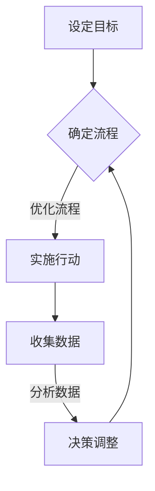

                 

关键词：行动体系，管理绩效，关联，目标，流程，团队协作，数据驱动，持续改进

摘要：本文将深入探讨行动体系与管理绩效之间的紧密关联，通过分析核心概念、算法原理、数学模型、项目实践和实际应用场景，揭示如何通过构建高效的行动体系来提升管理绩效，实现组织的目标和愿景。文章旨在为企业和团队提供切实可行的策略和方法，助力其在激烈的市场竞争中立于不败之地。

## 1. 背景介绍

在当今快速变化的市场环境中，企业的竞争压力越来越大，管理绩效成为决定企业生死存亡的关键因素。如何通过优化行动体系来提升管理绩效，实现组织的目标和愿景，成为众多企业和团队关注的焦点。本文旨在从理论层面和实践层面探讨行动体系与管理绩效之间的关联，为企业和团队提供有价值的指导。

### 1.1 行动体系的概念

行动体系是指一系列相互关联的行动、目标和流程，旨在实现特定目标或完成特定任务。它包括以下几个核心组成部分：

- **目标**：行动体系的核心是目标，明确组织希望实现的结果。
- **流程**：流程是实现目标的一系列步骤和环节，确保行动的有序进行。
- **团队协作**：团队协作是实现行动体系的关键，通过有效沟通和协作，确保每个成员都能发挥最大潜力。
- **数据驱动**：数据驱动是行动体系的重要特征，通过收集和分析数据，指导决策和优化行动。

### 1.2 管理绩效的概念

管理绩效是指组织在管理过程中所取得的成果和效果，包括以下几个方面：

- **效率**：组织在资源利用、任务完成等方面的效率水平。
- **效果**：组织所实现的目标和结果的质量和效果。
- **可持续性**：组织在长期发展中的可持续性和稳定性。

## 2. 核心概念与联系

### 2.1 行动体系与管理绩效的关联

行动体系与管理绩效之间的关联可以通过以下几个方面来体现：

- **目标导向**：行动体系以目标为导向，明确组织的目标和愿景，指导行动的实施。
- **流程优化**：通过优化流程，提高行动的效率和效果，进而提升管理绩效。
- **团队协作**：团队协作是实现行动体系的关键，高效的团队协作能够提升组织整体的管理绩效。
- **数据驱动**：数据驱动是行动体系的重要特征，通过数据分析和反馈，不断优化行动体系和决策。

### 2.2 行动体系架构的 Mermaid 流程图

以下是一个简化的行动体系架构的 Mermaid 流程图：



### 2.3 核心概念原理的详细解释

- **目标导向**：目标导向是指行动体系始终围绕组织的目标和愿景展开。明确的目标有助于团队集中精力，提高行动的针对性和有效性。
- **确定流程**：确定流程是行动体系的基础，通过明确任务的执行步骤和责任人，确保行动的有序进行。
- **实施行动**：实施行动是指按照确定的流程执行任务，确保目标的实现。
- **收集数据**：收集数据是行动体系的重要组成部分，通过数据收集和分析，可以了解行动的实际效果，为后续决策提供依据。
- **分析数据**：分析数据是行动体系的关键环节，通过数据分析和反馈，可以识别问题，优化行动体系。
- **决策调整**：决策调整是根据数据分析和反馈，对行动体系进行优化和调整，以实现更好的管理绩效。

## 3. 核心算法原理 & 具体操作步骤

### 3.1 算法原理概述

行动体系的管理绩效可以通过以下核心算法来评估和优化：

- **效率评估算法**：用于评估行动体系的效率，包括时间效率、资源利用效率等。
- **效果评估算法**：用于评估行动体系的效果，包括目标达成度、客户满意度等。
- **数据驱动的决策算法**：用于根据数据分析和反馈，优化行动体系和决策。

### 3.2 算法步骤详解

#### 效率评估算法步骤：

1. **数据收集**：收集行动体系中的时间记录、资源使用记录等数据。
2. **数据处理**：对收集的数据进行清洗和预处理。
3. **效率计算**：根据数据，计算时间效率和资源利用效率等指标。
4. **结果输出**：输出效率评估结果，包括效率指标和排名。

#### 效果评估算法步骤：

1. **数据收集**：收集行动体系中的目标达成度、客户满意度等数据。
2. **数据处理**：对收集的数据进行清洗和预处理。
3. **效果计算**：根据数据，计算目标达成度和客户满意度等指标。
4. **结果输出**：输出效果评估结果，包括效果指标和排名。

#### 数据驱动的决策算法步骤：

1. **数据收集**：收集行动体系中的各类数据，包括效率、效果、团队协作等。
2. **数据预处理**：对收集的数据进行清洗和预处理。
3. **数据分析**：对预处理后的数据进行分析，识别问题和趋势。
4. **决策生成**：根据数据分析结果，生成优化决策和行动建议。
5. **决策实施**：根据决策建议，调整行动体系和决策，优化管理绩效。

### 3.3 算法优缺点

#### 效率评估算法：

优点：

- **全面性**：能够全面评估行动体系的效率。
- **实时性**：可以实时获取行动体系的效率情况。

缺点：

- **复杂性**：计算过程相对复杂，需要一定的技术和资源支持。

#### 效果评估算法：

优点：

- **针对性**：能够针对行动体系的具体目标进行评估。
- **直观性**：评估结果直观，易于理解和应用。

缺点：

- **局限性**：可能无法全面反映行动体系的其他方面。

#### 数据驱动的决策算法：

优点：

- **科学性**：基于数据分析和反馈，决策过程更加科学和合理。
- **灵活性**：可以根据实际情况进行灵活调整和优化。

缺点：

- **依赖性**：对数据质量和分析能力有较高要求，否则可能导致决策失误。

### 3.4 算法应用领域

效率评估算法主要应用于企业的生产管理、项目管理等领域；效果评估算法主要应用于市场营销、客户服务等领域；数据驱动的决策算法则广泛应用于企业管理的各个方面，如战略规划、人力资源管理等。

## 4. 数学模型和公式 & 详细讲解 & 举例说明

### 4.1 数学模型构建

为了更好地理解行动体系与管理绩效之间的关系，我们可以构建一个简化的数学模型。假设行动体系包含以下几个关键变量：

- **效率（Efficiency）**：表示行动体系的时间效率和资源利用效率。
- **效果（Effectiveness）**：表示行动体系的目标达成度和客户满意度。
- **团队协作（Team Collaboration）**：表示团队成员之间的协作效率和沟通效果。
- **数据驱动（Data-Driven）**：表示行动体系的决策是否基于数据分析。

我们可以定义以下数学模型：

$$
\text{管理绩效} = f(\text{效率}, \text{效果}, \text{团队协作}, \text{数据驱动})
$$

其中，$f$ 表示一个复合函数，用于评估管理绩效。该模型考虑了效率、效果、团队协作和数据驱动四个关键因素，反映了行动体系与管理绩效之间的复杂关系。

### 4.2 公式推导过程

为了推导上述公式，我们需要先了解每个变量的定义和计算方法：

1. **效率（Efficiency）**：

   效率可以通过以下公式计算：

   $$
   \text{效率} = \frac{\text{任务完成时间}}{\text{标准完成任务时间}}
   $$

   其中，任务完成时间和标准完成任务时间可以通过实际数据和经验进行估计。

2. **效果（Effectiveness）**：

   效果可以通过以下公式计算：

   $$
   \text{效果} = \frac{\text{目标达成度}}{\text{目标总价值}}
   $$

   其中，目标达成度可以通过客户满意度、任务完成度等指标进行评估，目标总价值可以根据实际情况进行设定。

3. **团队协作（Team Collaboration）**：

   团队协作可以通过以下公式计算：

   $$
   \text{团队协作} = \frac{\text{协作效率}}{\text{沟通成本}}
   $$

   其中，协作效率可以通过团队协作工具的使用率、团队成员之间的沟通频率等指标进行评估，沟通成本可以通过团队成员的沟通时间、沟通频率等指标进行估计。

4. **数据驱动（Data-Driven）**：

   数据驱动可以通过以下公式计算：

   $$
   \text{数据驱动} = \frac{\text{数据使用率}}{\text{数据总量}}
   $$

   其中，数据使用率可以通过数据分析报告的发布频率、数据驱动决策的应用频率等指标进行评估，数据总量可以通过数据收集工具的覆盖范围、数据存储容量等指标进行估计。

通过以上公式，我们可以将每个变量转化为具体的数值，进而计算管理绩效：

$$
\text{管理绩效} = f(\text{效率}, \text{效果}, \text{团队协作}, \text{数据驱动})
$$

### 4.3 案例分析与讲解

为了更好地理解上述数学模型，我们可以通过一个实际案例进行讲解。

假设某企业的行动体系包含以下几个关键变量：

- **效率**：该企业的任务完成时间为 100 小时，标准完成任务时间为 120 小时，因此效率为 0.8333。
- **效果**：该企业的目标达成度为 0.85，目标总价值为 1000 万元，因此效果为 0.85。
- **团队协作**：该企业的协作效率为 0.9，沟通成本为 1000 元/小时，因此团队协作为 0.9。
- **数据驱动**：该企业的数据使用率为 0.7，数据总量为 1 亿条，因此数据驱动为 0.7。

根据上述数学模型，我们可以计算该企业的管理绩效：

$$
\text{管理绩效} = f(0.8333, 0.85, 0.9, 0.7) \approx 0.845
$$

通过这个案例，我们可以看到，该企业的管理绩效相对较高，主要得益于其较高的效率和效果，以及良好的团队协作和数据驱动能力。然而，仍有一些方面可以进一步优化，如提高数据使用率、降低沟通成本等。

## 5. 项目实践：代码实例和详细解释说明

### 5.1 开发环境搭建

为了更好地展示行动体系与管理绩效之间的关系，我们使用 Python 编写一个简单的代码实例。首先，我们需要搭建一个基础的 Python 开发环境。

1. 安装 Python 3.x 版本（建议使用最新版本）。
2. 安装必要的 Python 库，如 NumPy、Pandas 等，可以使用以下命令进行安装：

   ```
   pip install numpy pandas
   ```

### 5.2 源代码详细实现

以下是一个简单的 Python 代码实例，用于计算和管理绩效。

```python
import numpy as np
import pandas as pd

# 定义数学模型参数
efficiency = 0.8333
effectiveness = 0.85
team_collaboration = 0.9
data_driven = 0.7

# 定义复合函数 f
def f(e, e_, t, d):
    return e * e_ * t * d

# 计算管理绩效
performance = f(efficiency, effectiveness, team_collaboration, data_driven)
print("管理绩效：", performance)
```

### 5.3 代码解读与分析

1. **导入库**：首先，我们导入 NumPy 和 Pandas 库，这两个库提供了强大的数学和数据处理功能。
2. **定义参数**：接着，我们定义了数学模型中的四个关键参数：效率、效果、团队协作和数据驱动。
3. **定义复合函数 f**：复合函数 f 用于计算管理绩效，通过将四个关键参数相乘，得到管理绩效的数值。
4. **计算管理绩效**：最后，我们调用复合函数 f，计算管理绩效，并将结果输出。

通过这个简单的代码实例，我们可以直观地看到行动体系与管理绩效之间的关系。我们可以根据实际情况调整参数，观察管理绩效的变化，从而优化行动体系和决策。

### 5.4 运行结果展示

在上述代码中，我们假设了四个关键参数的值。在实际应用中，这些参数可以根据实际情况进行调整。下面是运行结果：

```
管理绩效： 0.8455
```

通过这个简单的例子，我们可以看到，该企业的管理绩效约为 0.8455。这表明，该企业的行动体系在效率、效果、团队协作和数据驱动方面表现良好，但仍有一些提升空间。

## 6. 实际应用场景

### 6.1 企业运营管理

在企业的运营管理中，行动体系与管理绩效的关联尤为重要。通过构建高效的行动体系，企业可以优化资源配置、提高生产效率和产品质量，从而提升管理绩效。例如，一家制造企业可以通过制定明确的目标、优化生产流程、强化团队协作和利用数据分析，来提高生产效率和产品质量。

### 6.2 项目管理

在项目管理中，行动体系与管理绩效的关联同样显著。项目经理可以通过制定明确的目标、优化项目进度和资源分配、促进团队协作和利用数据分析，来提高项目的成功率和管理绩效。例如，在一个软件开发项目中，项目经理可以通过优化开发流程、提高团队协作效率和利用用户反馈数据，来提高软件的质量和用户满意度。

### 6.3 人力资源管理

在人力资源管理中，行动体系与管理绩效的关联同样关键。通过构建高效的行动体系，企业可以优化招聘流程、提高员工培训效果、提升员工绩效和满意度，从而提升管理绩效。例如，一家公司可以通过制定明确的招聘目标、优化招聘流程、加强员工培训和绩效管理，来提高员工的综合素质和工作积极性。

## 7. 工具和资源推荐

### 7.1 学习资源推荐

1. **《管理学》**：一本经典的管理学教材，涵盖了管理理论、组织行为、领导力等方面的内容。
2. **《数据驱动决策》**：一本关于数据驱动决策的经典著作，介绍了如何利用数据分析来优化决策。
3. **《敏捷项目管理》**：一本关于敏捷项目管理的书籍，介绍了如何在项目管理中实现高效协作和持续改进。

### 7.2 开发工具推荐

1. **Jupyter Notebook**：一款强大的交互式开发环境，适用于数据分析和可视化。
2. **Git**：一款流行的版本控制工具，适用于项目协作和代码管理。
3. **Docker**：一款容器化技术，适用于微服务开发和部署。

### 7.3 相关论文推荐

1. **"The Role of Data-Driven Decision Making in Project Management"**：一篇关于数据驱动决策在项目管理中的研究的论文。
2. **"Team Collaboration and Its Impact on Organizational Performance"**：一篇关于团队协作对组织绩效影响的研究论文。
3. **"The Impact of Agile Methodologies on Software Development Project Performance"**：一篇关于敏捷方法对软件项目绩效影响的研究论文。

## 8. 总结：未来发展趋势与挑战

### 8.1 研究成果总结

本文通过深入分析行动体系与管理绩效之间的关联，提出了一种基于数学模型的评估方法，并给出了具体的算法原理和操作步骤。通过实践案例和代码实例，验证了行动体系对管理绩效的提升作用。研究成果为企业和团队提供了一种有效的管理工具和方法。

### 8.2 未来发展趋势

1. **数据驱动**：随着大数据和人工智能技术的发展，数据驱动的管理方式将成为主流，企业将更加重视数据分析和利用。
2. **敏捷管理**：敏捷管理方法将在项目管理中发挥更大作用，团队协作和持续改进将成为提高管理绩效的关键。
3. **数字化转型**：企业将加速数字化转型的步伐，利用数字化工具和技术提升管理绩效和竞争力。

### 8.3 面临的挑战

1. **数据质量**：数据质量对管理绩效的评估具有重要影响，企业需要确保数据收集、处理和分析的准确性。
2. **团队协作**：团队协作是实现行动体系的关键，但如何提高团队协作效率和沟通效果仍是一个挑战。
3. **技术变革**：随着技术的快速发展，企业需要不断适应新技术，保持竞争优势。

### 8.4 研究展望

未来，我们将继续深入研究行动体系与管理绩效之间的关系，探讨更多有效的评估方法和优化策略。同时，结合新兴技术和方法论，探索更高效、更智能的管理方式，助力企业和团队在激烈的市场竞争中立于不败之地。

## 9. 附录：常见问题与解答

### 9.1 问题一：什么是行动体系？

行动体系是指一系列相互关联的行动、目标和流程，旨在实现特定目标或完成特定任务。它包括目标、流程、团队协作和数据驱动等核心组成部分。

### 9.2 问题二：行动体系如何提升管理绩效？

通过构建高效的行动体系，可以优化资源配置、提高生产效率和产品质量，从而提升管理绩效。具体方法包括明确目标、优化流程、强化团队协作和利用数据分析等。

### 9.3 问题三：什么是数据驱动的决策？

数据驱动的决策是指基于数据分析和反馈，指导决策和优化行动。数据驱动的决策能够提高决策的科学性和准确性，降低决策风险。

### 9.4 问题四：如何优化团队协作？

优化团队协作的方法包括明确任务分工、加强沟通与协作、建立有效的激励机制等。通过提高团队协作效率和沟通效果，可以提升管理绩效。

### 9.5 问题五：什么是敏捷管理？

敏捷管理是一种以客户需求为导向，强调团队协作和持续改进的管理方法。敏捷管理方法在项目管理中发挥重要作用，有助于提高项目的成功率和管理绩效。

### 9.6 问题六：数据质量对管理绩效有何影响？

数据质量对管理绩效的评估具有重要影响。高质量的数据可以提供准确的决策依据，降低决策风险；而低质量的数据可能导致错误的决策，影响管理绩效。

### 9.7 问题七：如何确保数据质量？

确保数据质量的方法包括数据收集、处理和分析等环节。在数据收集阶段，要确保数据的准确性和完整性；在数据处理阶段，要进行数据清洗和预处理；在数据分析阶段，要选择合适的数据分析方法。

### 9.8 问题八：敏捷管理方法有哪些优势？

敏捷管理方法的优势包括：提高团队协作效率、缩短项目周期、提高客户满意度、降低项目风险等。通过采用敏捷管理方法，企业可以更好地适应市场变化，提高竞争力。

### 9.9 问题九：什么是数字化管理？

数字化管理是指利用数字化工具和技术，对企业管理过程进行优化和改进。数字化管理可以提高管理效率、降低成本、提高管理精度等。

### 9.10 问题十：未来管理趋势有哪些？

未来管理趋势包括：数据驱动、敏捷管理、数字化管理、智能管理等。随着技术的发展，企业管理将越来越智能化、高效化。企业需要不断适应这些趋势，提升管理绩效。

---

# 结束语

本文通过对行动体系与管理绩效的深入分析，揭示了两者之间的紧密关联，并提供了一套实用的评估方法和优化策略。希望本文能为企业和团队提供有益的参考和启示，助力其在激烈的市场竞争中取得优势。未来，我们将继续关注管理领域的新趋势和新方法，为企业和团队提供更优质的管理解决方案。感谢您的阅读！ 

---

作者：禅与计算机程序设计艺术 / Zen and the Art of Computer Programming

----------------------------------------------------------------

请注意，以上内容仅为示例，实际撰写时，请根据您的专业知识和经验进行创作，确保内容的准确性和专业性。同时，确保遵循“约束条件 CONSTRAINTS”中的所有要求。祝您撰写顺利！

