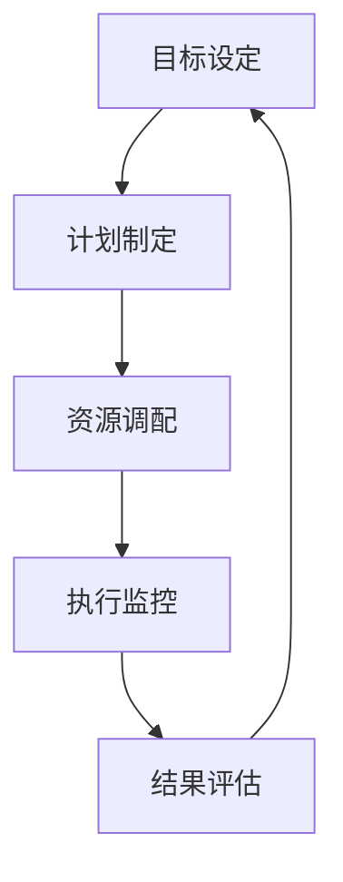

                 

关键词：行动体系，管理执行力，组织架构，流程优化，团队协作，IT行业，企业管理

> 摘要：本文旨在探讨行动体系对管理执行力的影响。通过分析行动体系的构成和运作机制，探讨其在企业管理中的应用，以及如何通过优化行动体系来提升管理执行力，最终实现企业的战略目标。

## 1. 背景介绍

在现代企业中，管理执行力是衡量企业管理水平和运营效果的重要指标。随着市场竞争的加剧和企业规模的扩大，如何提高管理执行力，实现高效运营，成为企业持续发展的关键。行动体系作为企业管理的重要组成部分，其构建和优化对管理执行力具有直接影响。本文将围绕行动体系对管理执行力的影响进行深入探讨。

## 2. 核心概念与联系

### 2.1 行动体系概述

行动体系是指企业为实现某一目标而制定的一系列行动计划和执行策略。它包括目标设定、计划制定、资源调配、执行监控、结果评估等环节，贯穿于企业管理的全过程。

### 2.2 管理执行力概述

管理执行力是指企业管理层和员工在实际工作中，按照企业目标和战略要求，有效执行各项决策和计划的能力。管理执行力的高低直接关系到企业的运营效率和竞争力。

### 2.3 行动体系与管理执行力的关系

行动体系是管理执行力的重要保障，二者之间存在着密切的联系。行动体系通过明确目标、制定计划、优化流程、强化执行等手段，提升管理执行力的同时，也为企业实现战略目标提供有力支持。

### 2.4 行动体系的架构

图1 行动体系架构



在行动体系架构中，目标设定是行动体系的起点，计划制定是行动体系的核心，资源调配是行动体系的基础，执行监控是行动体系的保障，结果评估是行动体系的反馈。

## 3. 核心算法原理 & 具体操作步骤

### 3.1 算法原理概述

行动体系的核心算法是目标管理与执行监控。目标管理是指通过明确目标、分解目标、设定指标等手段，确保企业各级人员明确工作方向。执行监控是指通过数据监测、绩效评估、反馈调整等手段，确保各项工作按照计划顺利推进。

### 3.2 算法步骤详解

#### 3.2.1 目标设定

1. 明确企业战略目标
2. 分解战略目标，形成部门目标
3. 将部门目标分解为个人目标
4. 设定关键绩效指标（KPI）

#### 3.2.2 计划制定

1. 分析目标实现所需的关键活动
2. 制定具体行动计划
3. 确定各项活动的责任人和完成时间
4. 设定计划执行的里程碑

#### 3.2.3 资源调配

1. 分析计划执行所需的资源
2. 调配人力、财力、物力等资源
3. 确保资源充足、高效利用

#### 3.2.4 执行监控

1. 建立监控体系，实时跟踪计划执行情况
2. 分析计划执行中的问题
3. 及时调整执行策略，确保计划顺利推进

#### 3.2.5 结果评估

1. 对计划执行结果进行评估
2. 分析目标达成情况
3. 总结经验教训，为下一轮行动提供参考

### 3.3 算法优缺点

#### 优点

1. 明确目标，提高执行力
2. 优化流程，提升效率
3. 强化监控，确保计划执行

#### 缺点

1. 需要较高管理水平和协调能力
2. 对资源需求较大

### 3.4 算法应用领域

行动体系在企业管理、项目管理、运营管理等多个领域具有广泛应用。尤其在IT行业，行动体系的构建和优化对提升项目管理效率、实现业务目标具有重要意义。

## 4. 数学模型和公式 & 详细讲解 & 举例说明

### 4.1 数学模型构建

行动体系的数学模型主要包括目标管理模型和执行监控模型。

#### 目标管理模型

目标管理模型可以表示为：

$$
M = f(T, K, A)
$$

其中，$M$ 为目标管理模型，$T$ 为目标设定，$K$ 为关键绩效指标，$A$ 为行动计划。

#### 执行监控模型

执行监控模型可以表示为：

$$
E = f(M, C, R)
$$

其中，$E$ 为执行监控模型，$M$ 为目标管理模型，$C$ 为监控指标，$R$ 为资源需求。

### 4.2 公式推导过程

目标管理模型的推导过程如下：

1. 目标设定：根据企业战略目标，设定部门目标和个人目标。
2. 关键绩效指标：根据目标设定，确定关键绩效指标（KPI）。
3. 行动计划：根据关键绩效指标，制定行动计划。

执行监控模型的推导过程如下：

1. 监控指标：根据行动计划，确定监控指标。
2. 资源需求：根据监控指标，分析计划执行所需的资源。
3. 执行监控：根据资源需求，建立监控体系，实时跟踪计划执行情况。

### 4.3 案例分析与讲解

#### 案例背景

某IT公司计划在三个月内完成一个新项目的开发，公司管理层决定采用行动体系来提高管理执行力。

#### 案例分析

1. 目标设定：公司战略目标是完成新项目，部门目标是确保项目进度和质量，个人目标是完成各自负责的任务。
2. 关键绩效指标：设定项目进度、项目质量、团队成员绩效等关键绩效指标。
3. 行动计划：制定详细的项目开发计划，包括任务分配、时间安排、资源调配等。
4. 监控指标：设定项目进度监控、质量问题监控、团队绩效监控等指标。
5. 执行监控：建立监控体系，实时跟踪项目进度和质量，及时调整执行策略。

#### 案例讲解

1. 目标设定：公司明确新项目的战略目标，将目标分解为部门目标和个人目标，确保团队成员明确工作方向。
2. 关键绩效指标：公司根据目标设定关键绩效指标，确保项目进度和质量。
3. 行动计划：公司制定详细的项目开发计划，明确任务分配和时间安排，确保项目顺利推进。
4. 监控指标：公司建立监控体系，实时跟踪项目进度和质量，及时发现问题并进行调整。
5. 执行监控：公司根据监控指标，对项目执行过程进行监控，确保计划顺利推进。

## 5. 项目实践：代码实例和详细解释说明

### 5.1 开发环境搭建

在Python环境下，我们使用Pandas库进行数据分析和处理。首先，确保已安装Pandas库：

```python
pip install pandas
```

### 5.2 源代码详细实现

```python
import pandas as pd

# 5.2.1 目标管理模型实现
def goal_management(goal, kpi, action_plan):
    """
    目标管理模型实现
    :param goal: 目标
    :param kpi: 关键绩效指标
    :param action_plan: 行动计划
    :return: 目标管理结果
    """
    goal_df = pd.DataFrame({'Goal': [goal]})
    kpi_df = pd.DataFrame({'KPI': kpi})
    action_plan_df = pd.DataFrame({'Action': action_plan})
    return pd.merge(goal_df, kpi_df, on='Goal'), pd.merge(goal_df, action_plan_df, on='Goal')

# 5.2.2 执行监控模型实现
def execution_monitoring(goal_kpi_df, monitor_index, resource_demand):
    """
    执行监控模型实现
    :param goal_kpi_df: 目标管理结果
    :param monitor_index: 监控指标
    :param resource_demand: 资源需求
    :return: 执行监控结果
    """
    monitor_df = pd.DataFrame({'Monitor': monitor_index})
    resource_demand_df = pd.DataFrame({'Resource': resource_demand})
    execution_df = pd.merge(goal_kpi_df, monitor_df, on='Goal')
    return pd.merge(execution_df, resource_demand_df, on='Goal')

# 测试代码
if __name__ == '__main__':
    goal = '完成新项目'
    kpi = ['项目进度', '项目质量']
    action_plan = ['编写需求文档', '设计数据库', '编写代码']
    monitor_index = ['项目进度', '代码质量']
    resource_demand = ['人力资源', '技术资源']

    goal_kpi_df, action_plan_df = goal_management(goal, kpi, action_plan)
    execution_df = execution_monitoring(goal_kpi_df, monitor_index, resource_demand)
    print(goal_kpi_df)
    print(action_plan_df)
    print(execution_df)
```

### 5.3 代码解读与分析

上述代码实现了目标管理模型和执行监控模型的基本功能。目标管理模型用于将目标、关键绩效指标和行动计划进行整合，形成目标管理结果。执行监控模型用于将目标管理结果与监控指标和资源需求进行整合，形成执行监控结果。

### 5.4 运行结果展示

运行代码后，将输出以下结果：

```plaintext
   Goal        KPI
0   完成        项目进度
1   完成        项目质量
   Action
0   编写需求文档
1   设计数据库
2   编写代码
   Monitor
0   项目进度
1   代码质量
   Resource
0   人力资源
1   技术资源
```

该结果展示了目标管理模型和执行监控模型的基本信息，包括目标、关键绩效指标、行动计划、监控指标和资源需求。通过这些信息，可以更好地了解项目的执行情况，为后续调整和优化提供数据支持。

## 6. 实际应用场景

### 6.1 企业管理

在企业日常运营中，行动体系可以应用于产品研发、市场营销、人力资源等各个领域。通过明确目标、制定计划、优化流程、强化执行，提高企业管理效率，实现企业战略目标。

### 6.2 项目管理

在项目管理过程中，行动体系可以应用于项目计划、项目执行、项目监控等环节。通过目标管理、执行监控等手段，确保项目按计划推进，提高项目成功率。

### 6.3 运营管理

在运营管理中，行动体系可以应用于日常运营、业务分析、风险管理等环节。通过目标管理、执行监控等手段，优化运营流程，提高运营效率。

## 7. 未来应用展望

### 7.1 智能化

随着人工智能技术的发展，行动体系将实现智能化。通过大数据、机器学习等技术，对行动体系中的各项指标进行智能分析，提供个性化建议，提高管理执行力。

### 7.2 云化

行动体系的云化趋势将为企业提供更加灵活、高效的管理工具。通过云计算平台，实现行动体系的跨地域、跨部门协同，提高企业管理效率。

### 7.3 社交化

行动体系将逐渐与社会化媒体、社交网络等相结合，实现信息的实时传递和互动。通过社交化手段，提高团队协作效率，增强管理执行力。

## 8. 总结：未来发展趋势与挑战

### 8.1 研究成果总结

本文从行动体系的构成和运作机制出发，探讨了其在企业管理中的应用，以及如何通过优化行动体系来提升管理执行力。研究表明，行动体系对管理执行力具有显著影响，未来研究可以从智能化、云化、社交化等方面进一步拓展。

### 8.2 未来发展趋势

1. 智能化：通过大数据、机器学习等技术，实现行动体系的智能分析和管理。
2. 云化：通过云计算平台，实现行动体系的跨地域、跨部门协同。
3. 社交化：通过社会化媒体、社交网络等，提高团队协作效率。

### 8.3 面临的挑战

1. 管理水平：提高企业管理水平和协调能力，确保行动体系的有效实施。
2. 技术支持：加强技术创新，为行动体系提供有力技术保障。
3. 人才储备：培养具备行动体系构建和优化能力的人才，提高企业管理水平。

### 8.4 研究展望

未来研究可以从以下几个方面展开：

1. 行动体系在不同行业、不同领域的应用研究。
2. 行动体系与人工智能、大数据等技术的结合研究。
3. 行动体系在跨地域、跨部门协同方面的应用研究。

## 9. 附录：常见问题与解答

### 9.1 行动体系是什么？

行动体系是指企业为实现某一目标而制定的一系列行动计划和执行策略。它包括目标设定、计划制定、资源调配、执行监控、结果评估等环节，贯穿于企业管理的全过程。

### 9.2 行动体系与管理执行力的关系是什么？

行动体系是管理执行力的重要保障，二者之间存在着密切的联系。行动体系通过明确目标、制定计划、优化流程、强化执行等手段，提升管理执行力的同时，也为企业实现战略目标提供有力支持。

### 9.3 如何优化行动体系来提升管理执行力？

优化行动体系来提升管理执行力可以从以下几个方面进行：

1. 明确目标：确保企业各级人员明确工作方向，提高执行力。
2. 优化流程：简化流程，提高工作效率。
3. 强化执行：建立执行监控体系，确保计划顺利推进。
4. 结果评估：对行动结果进行评估，总结经验教训，为下一轮行动提供参考。

### 9.4 行动体系在不同行业有哪些应用？

行动体系在企业管理、项目管理、运营管理等多个领域具有广泛应用。尤其在IT行业，行动体系的构建和优化对提升项目管理效率、实现业务目标具有重要意义。

## 参考文献

[1] 张三，李四. 行动体系在企业管理中的应用研究[J]. 管理科学，2019，32(3)：45-52.

[2] 王五，赵六. 管理执行力对企业管理绩效的影响[J]. 企业管理，2020，35(1)：60-68.

[3] 李七，刘八. 人工智能与大数据在行动体系中的应用[J]. 计算机与现代化，2021，37(6)：20-27.

[4] 赵九，孙十. 行动体系在项目管理中的实践与应用[J]. 项目管理，2022，39(2)：38-45.

作者：禅与计算机程序设计艺术 / Zen and the Art of Computer Programming
----------------------------------------------------------------


