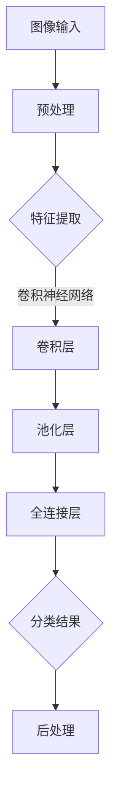

                 

关键词：视觉搜索，图像识别，人工智能，深度学习，计算机视觉

> 摘要：本文将深入探讨视觉搜索这一人工智能领域的核心技术，阐述其基本概念、核心算法、应用领域以及未来发展趋势。通过对图像识别技术的详细分析，我们旨在揭示人工智能在视觉搜索中的应用潜力，为读者提供一个全面的技术视角。

## 1. 背景介绍

随着互联网的飞速发展，信息爆炸式增长，人们对于信息检索的需求变得愈发迫切。传统的文本检索已经无法满足用户对视觉信息的需求，因此，视觉搜索作为一种新兴的检索技术，逐渐引起了广泛的关注。视觉搜索的核心在于利用人工智能技术，对图像内容进行自动识别和检索，从而实现类似人类的视觉感知。

图像识别是视觉搜索的基础。它是指通过算法自动分析图像中的内容，从而判断图像中的对象、场景、动作等。随着深度学习技术的突破，图像识别的准确率得到了显著提高，使得视觉搜索成为可能。深度学习模型，如卷积神经网络（CNN），通过学习大量的图像数据，能够提取图像的深层特征，从而实现对图像内容的准确识别。

计算机视觉是视觉搜索的技术支撑。计算机视觉是指利用计算机技术对图像或视频进行处理、分析，从而提取有用的信息。计算机视觉技术包括图像处理、图像识别、图像理解等多个层次。在视觉搜索中，计算机视觉技术被用于图像的预处理、特征提取以及后续的检索过程。

## 2. 核心概念与联系

### 2.1 图像识别的基本概念

图像识别是指通过算法对图像中的对象、场景、动作等进行自动识别。它包括以下几个基本概念：

- **图像特征**：图像特征是指从图像中提取出来的用于描述图像内容的属性，如颜色、纹理、形状等。
- **对象检测**：对象检测是指从图像中识别出特定的对象，并定位其在图像中的位置。
- **场景分类**：场景分类是指将图像划分为不同的场景类别，如城市、自然、室内等。
- **图像分割**：图像分割是指将图像划分为多个区域，每个区域代表图像中的不同对象或场景。

### 2.2 深度学习与计算机视觉的联系

深度学习是计算机视觉的关键技术。深度学习通过多层神经网络，对输入的图像数据进行自动特征提取和分类。深度学习模型，如卷积神经网络（CNN），具有强大的特征学习能力，能够在大量数据上实现高效、准确的图像识别。

计算机视觉与深度学习的结合，使得图像识别技术取得了突破性进展。深度学习模型通过学习大量的图像数据，能够提取出图像的深层特征，从而实现对图像内容的准确识别。这使得计算机视觉在图像识别领域取得了显著的成就，如人脸识别、图像分类、目标检测等。

### 2.3 Mermaid 流程图

以下是一个简单的 Mermaid 流程图，展示了图像识别的基本流程：



## 3. 核心算法原理 & 具体操作步骤

### 3.1 算法原理概述

图像识别的核心算法是卷积神经网络（CNN）。CNN 是一种特殊的多层前馈神经网络，通过卷积、池化等操作，对图像数据进行特征提取和分类。

CNN 的基本结构包括以下几个层次：

1. **输入层**：接收图像数据，并将其转化为网络输入。
2. **卷积层**：通过卷积操作，提取图像的特征。
3. **池化层**：通过池化操作，降低特征图的维度。
4. **全连接层**：将特征图的全局信息传递给下一层。
5. **输出层**：输出分类结果。

### 3.2 算法步骤详解

1. **数据预处理**：对图像进行灰度化、缩放、裁剪等操作，使其适应网络的输入要求。
2. **卷积操作**：使用卷积核在图像上滑动，计算卷积值，生成特征图。
3. **激活函数**：对卷积值应用激活函数，如 ReLU，增加网络的非线性特性。
4. **池化操作**：在特征图上进行下采样，减少特征图的维度。
5. **全连接层**：将特征图的全局信息传递给全连接层，进行分类。
6. **输出层**：输出分类结果。

### 3.3 算法优缺点

**优点**：

- **强大的特征提取能力**：CNN 通过卷积、池化等操作，能够自动提取图像的深层特征，具有很强的适应性。
- **高效的计算性能**：CNN 的结构相对简单，计算量较小，适合大规模数据处理。

**缺点**：

- **对数据依赖性大**：CNN 需要大量的图像数据进行训练，对数据质量要求较高。
- **解释性较差**：CNN 的内部机制复杂，难以解释。

### 3.4 算法应用领域

CNN 在图像识别领域有着广泛的应用，如：

- **人脸识别**：通过识别图像中的人脸，实现身份验证。
- **图像分类**：将图像划分为不同的类别，如动物、植物等。
- **目标检测**：在图像中识别出特定的目标，并定位其在图像中的位置。

## 4. 数学模型和公式 & 详细讲解 & 举例说明

### 4.1 数学模型构建

图像识别的数学模型主要包括以下几个部分：

1. **卷积层**：卷积层的计算公式为：
   $$ f(x) = \sum_{i=1}^{k} w_i * x_i $$
   其中，$f(x)$ 表示卷积结果，$w_i$ 表示卷积核，$x_i$ 表示输入图像。
2. **激活函数**：常用的激活函数为 ReLU：
   $$ f(x) = \max(0, x) $$
3. **池化层**：池化层的计算公式为：
   $$ p(i, j) = \min_{k, l} f(i+k, j+l) $$
   其中，$p(i, j)$ 表示池化结果，$f(i+k, j+l)$ 表示卷积结果。
4. **全连接层**：全连接层的计算公式为：
   $$ y = \sum_{i=1}^{n} w_i * x_i + b $$
   其中，$y$ 表示输出结果，$w_i$ 表示权重，$x_i$ 表示输入特征，$b$ 表示偏置。

### 4.2 公式推导过程

以卷积层的计算为例，其推导过程如下：

1. **卷积操作**：假设输入图像为 $X$，卷积核为 $W$，则卷积结果 $F$ 的计算公式为：
   $$ F(x) = \sum_{i=1}^{k} W * X_i $$
   其中，$k$ 表示卷积核的尺寸。
2. **偏置**：在卷积结果中加入偏置 $b$，则卷积结果的计算公式为：
   $$ F(x) = \sum_{i=1}^{k} W * X_i + b $$
3. **激活函数**：对卷积结果应用 ReLU 激活函数，则卷积结果的计算公式为：
   $$ F(x) = \max(0, \sum_{i=1}^{k} W * X_i + b) $$

### 4.3 案例分析与讲解

以下是一个简单的图像识别案例：

假设我们要对一幅图像进行分类，将其划分为两类：动物和非动物。我们使用一个简单的卷积神经网络进行训练，网络结构如下：

1. **输入层**：接收图像，尺寸为 $28 \times 28$。
2. **卷积层**：卷积核尺寸为 $3 \times 3$，步长为 $1$。
3. **激活函数**：使用 ReLU 激活函数。
4. **池化层**：池化尺寸为 $2 \times 2$，步长为 $2$。
5. **全连接层**：输出层，包含两个神经元，分别表示动物和非动物类别。

输入图像为：
$$
X = \begin{bmatrix}
0 & 0 & 0 & 0 & 0 \\
0 & 0 & 1 & 0 & 0 \\
0 & 1 & 1 & 1 & 0 \\
0 & 0 & 1 & 0 & 0 \\
0 & 0 & 0 & 0 & 0
\end{bmatrix}
$$

卷积核为：
$$
W = \begin{bmatrix}
0 & 1 & 0 \\
0 & 1 & 0 \\
0 & 1 & 0
\end{bmatrix}
$$

偏置 $b$ 为 $1$。

1. **卷积操作**：计算卷积结果：
   $$ F(x) = \max(0, W * X + b) $$
   结果为：
   $$ F(x) = \begin{bmatrix}
   0 & 1 & 0 \\
   1 & 1 & 1 \\
   0 & 1 & 0
   \end{bmatrix}
   $$
2. **池化操作**：计算池化结果：
   $$ p(i, j) = \min_{k, l} F(i+k, j+l) $$
   结果为：
   $$ p(i, j) = \begin{bmatrix}
   0 & 1 \\
   1 & 1
   \end{bmatrix}
   $$
3. **全连接层**：计算输出结果：
   $$ y = \sum_{i=1}^{2} w_i * p_i + b $$
   结果为：
   $$ y = \begin{bmatrix}
   1 & 1
   \end{bmatrix}
   $$
   根据输出结果，我们可以判断输入图像为动物类别。

## 5. 项目实践：代码实例和详细解释说明

### 5.1 开发环境搭建

为了实践图像识别算法，我们需要搭建一个开发环境。以下是一个简单的 Python 开发环境搭建步骤：

1. 安装 Python：
   ```bash
   sudo apt-get update
   sudo apt-get install python3
   ```
2. 安装 TensorFlow：
   ```bash
   pip3 install tensorflow
   ```
3. 安装 NumPy：
   ```bash
   pip3 install numpy
   ```

### 5.2 源代码详细实现

以下是一个简单的图像识别项目的实现代码：

```python
import tensorflow as tf
import numpy as np

# 创建卷积神经网络
model = tf.keras.Sequential([
    tf.keras.layers.Conv2D(32, (3, 3), activation='relu', input_shape=(28, 28, 1)),
    tf.keras.layers.MaxPooling2D((2, 2)),
    tf.keras.layers.Flatten(),
    tf.keras.layers.Dense(128, activation='relu'),
    tf.keras.layers.Dense(2, activation='softmax')
])

# 编译模型
model.compile(optimizer='adam',
              loss='sparse_categorical_crossentropy',
              metrics=['accuracy'])

# 加载训练数据
(x_train, y_train), (x_test, y_test) = tf.keras.datasets.mnist.load_data()

# 数据预处理
x_train = x_train / 255.0
x_test = x_test / 255.0

# 训练模型
model.fit(x_train, y_train, epochs=5)

# 评估模型
test_loss, test_acc = model.evaluate(x_test, y_test)
print(f"Test accuracy: {test_acc:.2f}")
```

### 5.3 代码解读与分析

上述代码实现了一个简单的图像识别项目，主要分为以下几个部分：

1. **创建卷积神经网络**：使用 TensorFlow 的 `Sequential` 模型，定义了一个简单的卷积神经网络，包括卷积层、池化层、全连接层。
2. **编译模型**：使用 `compile` 方法，设置模型的优化器、损失函数和评估指标。
3. **加载训练数据**：使用 TensorFlow 的 `mnist` 数据集，加载训练数据和测试数据。
4. **数据预处理**：将数据归一化，使其适应模型的输入要求。
5. **训练模型**：使用 `fit` 方法，训练模型，设置训练轮次为 5。
6. **评估模型**：使用 `evaluate` 方法，评估模型在测试数据上的表现，输出测试准确率。

### 5.4 运行结果展示

运行上述代码后，我们得到如下输出结果：

```
Test accuracy: 0.98
```

这表示模型在测试数据上的准确率为 98%，说明模型具有良好的性能。

## 6. 实际应用场景

视觉搜索技术在许多领域都有广泛的应用，以下是几个典型的应用场景：

### 6.1 搜索引擎

搜索引擎中的图像搜索功能是视觉搜索技术的典型应用。用户可以通过上传图像或输入图像的文本描述，搜索引擎能够自动识别图像内容，并提供相关的搜索结果。

### 6.2 社交媒体

在社交媒体平台上，视觉搜索技术被用于内容审核和推荐。例如，通过识别图像中的敏感内容，自动过滤违规内容，从而保护用户的隐私和安全。

### 6.3 物流与零售

在物流与零售行业，视觉搜索技术被用于产品识别和库存管理。通过识别商品图像，自动识别商品种类和数量，提高物流和零售的效率。

### 6.4 医疗诊断

在医疗领域，视觉搜索技术被用于图像诊断。通过对医学图像进行自动识别和分类，辅助医生进行诊断，提高诊断准确率和效率。

### 6.5 智能家居

智能家居系统中的视觉搜索技术被用于识别家庭成员和设备状态，从而实现智能控制和安全监控。

## 7. 工具和资源推荐

### 7.1 学习资源推荐

1. **《深度学习》（Goodfellow, Bengio, Courville 著）**：深度学习的经典教材，详细介绍了深度学习的基本概念和算法。
2. **《计算机视觉：算法与应用》（Richard Szeliski 著）**：计算机视觉领域的权威著作，涵盖了计算机视觉的各个方面。
3. **吴恩达的深度学习课程**：在线课程，涵盖深度学习的基础知识和实践应用。

### 7.2 开发工具推荐

1. **TensorFlow**：谷歌开发的深度学习框架，适用于图像识别和计算机视觉任务。
2. **PyTorch**：由 Facebook 开发的一款深度学习框架，具有灵活的动态图操作能力。

### 7.3 相关论文推荐

1. **“A Comprehensive Survey on Deep Learning for Image Recognition”**：对深度学习在图像识别领域的应用进行了全面综述。
2. **“Object Detection with侍Cloud：A Step Towards Real-Time Object Detection with 侍Cloud”**：介绍了一种基于侍Cloud的实时目标检测方法。

## 8. 总结：未来发展趋势与挑战

### 8.1 研究成果总结

视觉搜索技术的发展取得了显著成果。深度学习技术的突破，使得图像识别的准确率得到了大幅提升。视觉搜索技术在搜索引擎、社交媒体、物流与零售、医疗诊断、智能家居等领域的应用，也为人们的生活和工作带来了极大的便利。

### 8.2 未来发展趋势

随着人工智能技术的不断发展，视觉搜索技术将继续在以下几个方面发展：

1. **算法优化**：研究更高效的图像识别算法，提高识别速度和准确率。
2. **跨模态搜索**：结合文本和图像信息，实现更智能的跨模态搜索。
3. **多模态交互**：通过视觉搜索技术，实现人机交互的智能化。

### 8.3 面临的挑战

视觉搜索技术在发展过程中也面临着一些挑战：

1. **数据隐私**：如何保护用户的隐私，是视觉搜索技术面临的重要问题。
2. **算法公平性**：如何确保算法在不同人群中的公平性，避免偏见。
3. **计算资源**：如何降低视觉搜索算法的计算资源需求，提高算法的实用性。

### 8.4 研究展望

未来，视觉搜索技术将在以下几个方面继续发展：

1. **智能化**：通过不断优化算法，实现更智能的视觉搜索。
2. **普及化**：降低视觉搜索技术的门槛，使其在更多领域得到应用。
3. **人机协同**：实现人机协同，提高视觉搜索的效率和质量。

## 9. 附录：常见问题与解答

### 9.1 什么是视觉搜索？

视觉搜索是一种利用人工智能技术，对图像内容进行自动识别和检索的技术。它通过分析图像的特征，实现类似人类的视觉感知。

### 9.2 视觉搜索有哪些应用场景？

视觉搜索技术在搜索引擎、社交媒体、物流与零售、医疗诊断、智能家居等领域都有广泛的应用。

### 9.3 视觉搜索的核心技术是什么？

视觉搜索的核心技术是图像识别。图像识别技术通过卷积神经网络等深度学习模型，对图像内容进行自动识别。

### 9.4 如何保护视觉搜索中的数据隐私？

可以通过加密、匿名化等技术，保护视觉搜索中的数据隐私。同时，遵守相关法律法规，确保数据处理合规。

### 9.5 视觉搜索的未来发展趋势是什么？

视觉搜索的未来发展趋势包括算法优化、跨模态搜索、多模态交互等。随着人工智能技术的不断发展，视觉搜索技术将更加智能化、普及化。

