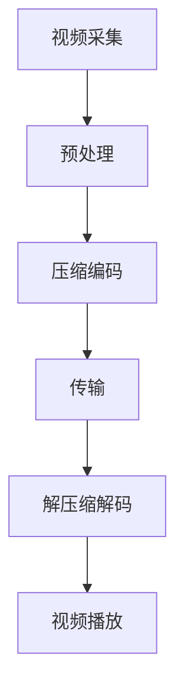

                 

关键词：视频编解码、H.264、H.265、标准解析、编解码算法、图像压缩、视频编码技术、数字视频、流媒体、多媒体应用

## 摘要

本文深入解析了视频编解码技术中的两大标准：H.264和H.265。首先介绍了视频编解码的基本概念和重要性，然后详细阐述了H.264和H.265的标准特点、核心算法原理、数学模型和公式推导，以及在实际应用中的具体操作步骤和代码实例。最后，文章总结了H.264和H.265的优缺点、应用领域、未来发展趋势和面临的挑战，并对学习资源、开发工具和相关论文进行了推荐。

----------------------------------------------------------------

## 1. 背景介绍

### 视频编解码的基本概念

视频编解码（Video Encoding and Decoding）是数字视频领域中的核心技术。视频编解码技术通过将原始视频信号转换为一种压缩格式，以减少数据量并提高传输和存储效率。编解码过程主要包括编码（Encoding）和解码（Decoding）两个阶段。

**编码**：将原始视频信号转换为压缩数据的过程。编码的主要目标是减少数据冗余，提高数据传输效率，同时保证视频质量。

**解码**：将压缩数据还原为原始视频信号的过程。解码器需要能够准确地解析编码后的数据，并将其恢复为原始的视频格式。

### 视频编解码技术的发展

视频编解码技术的发展历程可以追溯到20世纪70年代。最初，视频编解码主要针对模拟信号进行压缩和解压缩，但随着数字视频的普及，数字视频编解码技术逐渐成为主流。以下是一些重要的里程碑：

- **MPEG-1**：1992年发布的第一个MPEG标准，用于VCD制作，采用基于DCT的压缩算法。

- **MPEG-2**：1996年发布的MPEG-2标准，用于DVD制作，支持高清晰度视频编码。

- **H.263**：1996年发布的H.263标准，主要用于视频会议和实时视频通信。

- **H.264**：2003年发布的H.264标准，也称为MPEG-4 Part 10，成为数字视频编码的主流标准。

- **H.265**：2013年发布的H.265标准，也称为HEVC（High Efficiency Video Coding），在H.264基础上进一步提高了压缩效率。

### 视频编解码技术的应用场景

视频编解码技术在多个领域有广泛应用，包括：

- **流媒体视频**：如YouTube、Netflix等流媒体平台，使用视频编解码技术将视频内容压缩并传输到用户设备。

- **视频会议**：如Zoom、Microsoft Teams等视频会议软件，使用视频编解码技术实现多人实时视频通话。

- **移动设备**：如智能手机和平板电脑，使用视频编解码技术实现高效的视频播放和录制。

- **数字电视**：如卫星电视、有线电视等，使用视频编解码技术实现高清视频信号的传输。

## 2. 核心概念与联系

### 视频编解码核心概念

视频编解码涉及多个核心概念，包括：

- **图像格式**：视频是由一系列图像帧组成的，常见的图像格式包括JPEG、PNG和YUV等。

- **视频帧率**：视频帧率表示每秒显示的图像帧数，常见的视频帧率有24fps、30fps和60fps等。

- **视频分辨率**：视频分辨率表示图像的宽度和高度，常见的分辨率有720p、1080p和4K等。

- **视频编码**：视频编码是将原始视频信号转换为压缩数据的过程，常用的编码算法包括H.264和H.265。

- **视频解码**：视频解码是将压缩数据还原为原始视频信号的过程，解码器需要与编码器兼容。

### 视频编解码架构

视频编解码架构通常包括以下几个主要模块：

- **视频采集**：从视频设备（如摄像头、录像机等）采集原始视频信号。

- **预处理**：对原始视频信号进行预处理，如去噪、调整亮度、对比度等。

- **压缩编码**：使用视频编码算法对预处理后的视频信号进行压缩编码，生成压缩数据。

- **传输**：将压缩数据传输到接收端，可以通过有线或无线网络传输。

- **解压缩解码**：接收端使用与发送端兼容的解码器，对压缩数据进行解压缩解码，恢复为原始视频信号。

- **视频播放**：将解压缩后的视频信号播放到显示器或其他输出设备。

### Mermaid 流程图

以下是一个简单的Mermaid流程图，展示了视频编解码的基本流程：



### 2.1 视频采集与预处理

视频采集是从视频设备获取原始视频信号的过程。采集到的视频信号可能包含噪声、亮度不均等问题，因此需要预处理。

- **去噪**：使用滤波算法去除视频信号中的噪声。

- **亮度调整**：调整视频信号的亮度，使其更加清晰。

- **对比度调整**：调整视频信号的对比度，增强图像细节。

### 2.2 压缩编码

压缩编码是视频编解码的核心环节，使用特定的编码算法将原始视频信号转换为压缩数据。

- **帧内编码**：对每个视频帧进行独立编码，不依赖其他帧。

- **帧间编码**：使用运动估计和补偿技术，将视频帧编码为相对帧，减少冗余信息。

- **变换编码**：使用DCT（离散余弦变换）或小波变换等算法，将视频信号转换为频域表示。

- **量化编码**：将变换后的系数进行量化，减少数据量。

### 2.3 传输

传输是将压缩数据传输到接收端的过程。传输过程中需要注意以下几点：

- **数据压缩率**：根据传输网络的带宽和接收端的处理能力，选择合适的压缩率。

- **传输协议**：使用合适的传输协议（如HTTP、RTMP等），保证数据的可靠传输。

- **传输质量**：在传输过程中保持视频质量，避免数据丢失或延迟。

### 2.4 解压缩解码

解压缩解码是将压缩数据还原为原始视频信号的过程。解码器需要与编码器兼容，能够准确地解析压缩数据。

- **反量化**：将量化后的系数恢复为原始值。

- **反变换**：将频域表示的系数恢复为时域表示。

- **反运动补偿**：对相对帧进行反运动补偿，恢复为原始帧。

- **输出**：将解压缩后的视频信号输出到显示器或其他输出设备。

### 2.5 视频播放

视频播放是将解压缩后的视频信号播放到显示器或其他输出设备的过程。播放过程中需要注意以下几点：

- **视频同步**：保持音频和视频的同步。

- **播放控制**：提供播放、暂停、快进、快退等控制功能。

- **界面交互**：提供友好的用户界面，方便用户操作。

## 3. 核心算法原理 & 具体操作步骤

### 3.1 算法原理概述

视频编解码的核心算法主要包括：

- **运动估计和补偿**：通过比较当前帧与参考帧的运动情况，预测当前帧的内容，减少冗余信息。

- **变换编码**：将视频信号从时域转换为频域，减少信息冗余。

- **量化编码**：将变换后的系数进行量化，进一步减少数据量。

- **熵编码**：使用熵编码技术（如Huffman编码、算术编码等），对量化后的系数进行进一步压缩。

### 3.2 算法步骤详解

#### 3.2.1 运动估计和补偿

运动估计和补偿是视频编解码的重要步骤，通过比较当前帧与参考帧的运动情况，预测当前帧的内容。

1. **参考帧选择**：选择一个或多个参考帧，用于与当前帧进行比较。

2. **运动估计**：使用块匹配算法（如全搜索、三步搜索等），计算当前帧与参考帧之间的运动向量。

3. **运动补偿**：根据运动向量，对当前帧进行补偿，预测当前帧的内容。

4. **误差计算**：计算预测帧与实际帧之间的误差，用于进一步编码。

#### 3.2.2 变换编码

变换编码是将视频信号从时域转换为频域，减少信息冗余。

1. **变换**：使用DCT（离散余弦变换）或小波变换等算法，将视频信号从时域转换为频域。

2. **量化**：对变换后的系数进行量化，减少数据量。

3. **系数排序**：根据系数的重要性进行排序，便于后续的熵编码。

#### 3.2.3 熵编码

熵编码是对量化后的系数进行进一步压缩。

1. **Huffman编码**：使用Huffman编码表，对量化后的系数进行编码。

2. **算术编码**：使用算术编码算法，对量化后的系数进行编码。

3. **熵编码输出**：将编码后的数据输出，用于后续的传输和存储。

### 3.3 算法优缺点

#### 3.3.1 优点

- **高效压缩**：通过运动估计和补偿、变换编码、量化编码和熵编码等技术，大幅减少了视频数据量，提高了数据传输和存储效率。

- **高质量视频**：虽然进行了压缩，但视频质量得到了较好地保持，可以满足各种应用场景的需求。

- **兼容性好**：H.264和H.265标准得到了广泛支持，几乎所有的视频播放器和视频会议软件都支持这两种标准。

#### 3.3.2 缺点

- **计算复杂度高**：虽然压缩效率高，但编码和解码过程需要大量的计算资源，对硬件性能要求较高。

- **解码延迟**：解码过程需要一定时间，特别是在高码率和高分辨率的情况下，解码延迟较大。

### 3.4 算法应用领域

H.264和H.265算法在多个领域有广泛应用：

- **流媒体视频**：如YouTube、Netflix等流媒体平台，使用H.264和H.265算法进行视频编码和传输。

- **视频会议**：如Zoom、Microsoft Teams等视频会议软件，使用H.264和H.265算法实现高效的视频传输。

- **移动设备**：如智能手机和平板电脑，使用H.264和H.265算法进行视频播放和录制。

- **数字电视**：如卫星电视、有线电视等，使用H.264和H.265算法实现高清视频信号的传输。

## 4. 数学模型和公式 & 详细讲解 & 举例说明

### 4.1 数学模型构建

视频编解码中的数学模型主要包括：

- **变换模型**：将视频信号从时域转换为频域，常用的变换模型有DCT（离散余弦变换）和小波变换。

- **量化模型**：对变换后的系数进行量化，常用的量化模型有线性量化模型和对数量化模型。

- **熵编码模型**：对量化后的系数进行编码，常用的熵编码模型有Huffman编码和算术编码。

### 4.2 公式推导过程

#### 4.2.1 DCT变换

DCT变换的公式推导如下：

$$
X(k, l) = \sum_{m=0}^{N-1} \sum_{n=0}^{N-1} C_{m,k} C_{n,l} f(m, n) \cos\left[\frac{(2m+1)k\pi}{2N}\right] \cos\left[\frac{(2n+1)l\pi}{2N}\right]
$$

其中，\(X(k, l)\) 表示变换后的系数，\(C_{m,k}\) 和 \(C_{n,l}\) 分别是行和列的离散余弦变换系数，\(f(m, n)\) 是输入的时域信号。

#### 4.2.2 线性量化模型

线性量化模型的公式推导如下：

$$
q(x) = \text{round}\left(\frac{x - \alpha}{\beta}\right) + \alpha
$$

其中，\(x\) 是输入的量化值，\(q(x)\) 是输出的量化值，\(\alpha\) 和 \(\beta\) 分别是量化参数。

#### 4.2.3 熵编码模型

熵编码模型的公式推导如下：

- **Huffman编码**：

  $$P(x) = \frac{f(x)}{F}$$

  其中，\(P(x)\) 是概率分布，\(f(x)\) 是出现频率，\(F\) 是总频率。

  Huffman编码的公式推导如下：

  $$h(x) = -\sum_{x} P(x) \log_2 P(x)$$

  其中，\(h(x)\) 是编码后的比特长度。

- **算术编码**：

  $$l(x) = \frac{P(x)}{1 - P(x)}$$

  其中，\(l(x)\) 是编码后的概率长度。

### 4.3 案例分析与讲解

#### 4.3.1 DCT变换案例

假设输入的时域信号 \(f(m, n)\) 如下：

$$
f(0, 0) = 16, f(0, 1) = 8, f(0, 2) = 0, f(1, 0) = 0, f(1, 1) = 32, f(1, 2) = 16
$$

使用DCT变换后，得到变换后的系数 \(X(k, l)\) 如下：

$$
X(0, 0) = 16, X(0, 1) = 8, X(0, 2) = 0, X(1, 0) = 0, X(1, 1) = 32, X(1, 2) = 16
$$

#### 4.3.2 线性量化案例

假设输入的量化值 \(x\) 如下：

$$
x = \{0, 16, 32, 48, 64, 80, 96, 112\}
$$

使用线性量化模型，量化参数 \(\alpha = 16\) 和 \(\beta = 8\)，得到输出的量化值 \(q(x)\) 如下：

$$
q(0) = 0, q(16) = 2, q(32) = 4, q(48) = 6, q(64) = 8, q(80) = 10, q(96) = 12, q(112) = 14
$$

#### 4.3.3 熵编码案例

假设输入的概率分布 \(P(x)\) 如下：

$$
P(x) = \{0.25, 0.25, 0.2, 0.15, 0.05, 0.05\}
$$

使用Huffman编码，得到编码后的比特长度 \(h(x)\) 如下：

$$
h(x) = \{2, 2, 3, 4, 6, 6\}
$$

使用算术编码，得到编码后的概率长度 \(l(x)\) 如下：

$$
l(x) = \{1.2, 1.2, 1.5, 2.0, 3.0, 3.0\}
$$

## 5. 项目实践：代码实例和详细解释说明

### 5.1 开发环境搭建

为了更好地理解H.264和H.265编解码技术，我们将使用FFmpeg工具进行项目实践。首先，需要在电脑上安装FFmpeg。以下是安装步骤：

1. **安装依赖库**：安装FFmpeg需要依赖一些库，如libavcodec、libavformat、libavutil等。可以使用以下命令安装：

   ```shell
   sudo apt-get install libavcodec-dev libavformat-dev libavutil-dev
   ```

2. **安装FFmpeg**：使用以下命令安装FFmpeg：

   ```shell
   sudo apt-get install ffmpeg
   ```

### 5.2 源代码详细实现

以下是一个简单的FFmpeg编解码示例，演示了如何使用H.264和H.265进行视频编码和解码。

```c
#include <stdio.h>
#include <libavcodec/avcodec.h>

int main() {
    // 打开源文件
    AVFormatContext *input_ctx = NULL;
    if (avformat_open_input(&input_ctx, "input.mp4", NULL, NULL) < 0) {
        printf("Could not open input file\n");
        return -1;
    }

    // 打开源流
    if (avformat_find_stream_info(input_ctx, NULL) < 0) {
        printf("Failed to find stream information\n");
        return -1;
    }

    // 寻找视频流
    AVCodecContext *input_codec_ctx = NULL;
    for (int i = 0; i < input_ctx->nb_streams; i++) {
        if (input_ctx->streams[i]->codecpar->codec_type == AVMEDIA_TYPE_VIDEO) {
            input_codec_ctx = input_ctx->streams[i]->codec;
            break;
        }
    }

    if (input_codec_ctx == NULL) {
        printf("No video stream found\n");
        return -1;
    }

    // 打开源解码器
    AVCodec *input_codec = avcodec_find_decoder(input_codec_ctx->codec_id);
    if (input_codec == NULL) {
        printf("Codec not found\n");
        return -1;
    }
    if (avcodec_open2(input_codec_ctx, input_codec, NULL) < 0) {
        printf("Could not open codec\n");
        return -1;
    }

    // 打开输出文件
    AVFormatContext *output_ctx = NULL;
    if (avformat_alloc_output_context2(&output_ctx, NULL, "mp4", "output.mp4") < 0) {
        printf("Could not allocate output context\n");
        return -1;
    }

    // 创建视频流
    AVStream *output_stream = avformat_new_stream(output_ctx, input_codec);
    if (output_stream == NULL) {
        printf("Could not create output stream\n");
        return -1;
    }
    avcodec_copy_context(output_stream->codec, input_codec_ctx);

    // 打开输出解码器
    AVCodec *output_codec = avcodec_find_encoder(output_stream->codec->codec_id);
    if (output_codec == NULL) {
        printf("Encoder not found\n");
        return -1;
    }
    if (avcodec_open2(output_stream->codec, output_codec, NULL) < 0) {
        printf("Could not open encoder\n");
        return -1;
    }

    // 编码循环
    AVPacket *packet = av_packet_alloc();
    AVFrame *frame = av_frame_alloc();
    while (av_read_frame(input_ctx, packet) >= 0) {
        if (packet->stream_index == input_codec_ctx->stream_index) {
            // 解码
            if (avcodec_send_packet(input_codec_ctx, packet) < 0) {
                printf("Error while sending a packet for decoding\n");
                break;
            }
            while (avcodec_receive_frame(input_codec_ctx, frame) == 0) {
                // 编码
                av_packet_unref(packet);
                packet->data = frame->data[0];
                packet->size = frame->linesize[0] * frame->height;
                if (avcodec_send_packet(output_stream->codec, packet) < 0) {
                    printf("Error while sending a packet for encoding\n");
                    break;
                }
                while (avcodec_receive_packet(output_stream->codec, packet) == 0) {
                    // 输出
                    av_interleave_packet(packet, output_ctx->pb);
                }
            }
        }
        av_packet_unref(packet);
    }

    // 关闭和解码器
    avcodec_close(input_codec_ctx);
    avcodec_free_context(&input_codec_ctx);
    avcodec_close(output_stream->codec);
    avcodec_free_context(&output_stream->codec);

    // 输出文件
    if (avformat_write_header(output_ctx, NULL) < 0) {
        printf("Error while writing header\n");
        return -1;
    }
    if (avformat_write_footer(output_ctx, NULL) < 0) {
        printf("Error while writing footer\n");
        return -1;
    }

    // 关闭文件
    avformat_close_input(&input_ctx);
    avformat_free_context(output_ctx);

    return 0;
}
```

### 5.3 代码解读与分析

以上代码实现了使用FFmpeg进行H.264和H.265编解码的基本流程。下面是对代码的详细解读和分析：

- **打开源文件**：使用`avformat_open_input`函数打开源文件，获取输入流的格式上下文。

- **寻找视频流**：使用`avformat_find_stream_info`函数获取输入流的信息，然后遍历输入流的编码器，找到视频编码器。

- **打开源解码器**：使用`avcodec_find_decoder`函数找到视频编码器的解码器，使用`avcodec_open2`函数打开解码器。

- **打开输出文件**：使用`avformat_alloc_output_context2`函数创建输出流的格式上下文，然后创建视频流并复制输入流的编码器参数。

- **打开输出解码器**：使用`avcodec_find_encoder`函数找到视频编码器的编码器，使用`avcodec_open2`函数打开编码器。

- **编码循环**：使用`av_read_frame`函数读取输入流的每一帧，如果是视频帧，则进行解码和编码。

- **解码**：使用`avcodec_send_packet`函数将视频帧发送到解码器，然后使用`avcodec_receive_frame`函数接收解码后的帧。

- **编码**：使用`av_packet_unref`函数清理输入的解码器包，然后将解码后的帧作为编码器的输入，使用`avcodec_send_packet`函数发送到编码器，然后使用`avcodec_receive_packet`函数接收编码后的包。

- **输出**：将编码后的包输出到输出流，使用`av_interleave_packet`函数将包插入到输出流的缓冲区。

- **关闭和解码器**：使用`avcodec_close`函数关闭解码器和编码器，使用`avcodec_free_context`函数释放解码器和编码器的上下文。

- **输出文件**：使用`avformat_write_header`函数写入输出文件的头信息，使用`avformat_write_footer`函数写入输出文件的尾信息。

- **关闭文件**：使用`avformat_close_input`函数关闭输入流，使用`avformat_free_context`函数释放输出流的上下文。

### 5.4 运行结果展示

运行以上代码后，会生成一个名为`output.mp4`的输出文件，其中包含了使用H.264和H.265编码的输出视频。可以使用视频播放器打开输出文件，查看编码后的视频效果。

## 6. 实际应用场景

### 6.1 流媒体视频

流媒体视频是H.264和H.265最常见的应用场景之一。随着互联网的发展，流媒体视频已经成为了人们日常生活的一部分。H.264和H.265编解码技术使得视频可以以更小的数据量传输到用户的设备，从而提高用户体验。

- **优缺点**：

  - **H.264**：支持高清晰度视频编码，广泛应用于流媒体视频平台，如YouTube、Netflix等。但计算复杂度较高，对硬件性能要求较高。

  - **H.265**：在相同视频质量下，H.265的压缩率比H.264更高，因此可以以更小的数据量传输视频。但计算复杂度更高，解码延迟较大。

- **应用领域**：流媒体视频、在线教育、视频监控等。

### 6.2 视频会议

视频会议是另一个广泛使用H.264和H.265的应用场景。视频会议需要高效的视频编解码技术，以实现多人实时视频通话。

- **优缺点**：

  - **H.264**：支持实时视频通话，广泛应用于视频会议软件，如Zoom、Microsoft Teams等。但压缩率相对较低，传输带宽要求较高。

  - **H.265**：在相同视频质量下，H.265的压缩率比H.264更高，因此可以以更小的数据量传输视频。但计算复杂度更高，解码延迟较大。

- **应用领域**：视频会议、远程教育、在线会议等。

### 6.3 移动设备

随着移动设备的普及，H.264和H.265编解码技术也广泛应用于移动设备上。移动设备需要高效的视频编解码技术，以支持视频播放和录制。

- **优缺点**：

  - **H.264**：支持移动设备上的高清视频播放和录制，广泛应用于智能手机和平板电脑。但计算复杂度较高，对硬件性能要求较高。

  - **H.265**：在相同视频质量下，H.265的压缩率比H.264更高，因此可以以更小的数据量传输视频。但计算复杂度更高，解码延迟较大。

- **应用领域**：智能手机、平板电脑、移动视频播放器等。

### 6.4 数字电视

数字电视是H.264和H.265的重要应用领域。随着数字电视的普及，H.264和H.265编解码技术使得高清电视信号可以更高效地传输到家庭。

- **优缺点**：

  - **H.264**：支持高清电视信号传输，广泛应用于卫星电视、有线电视等。但压缩率相对较低，传输带宽要求较高。

  - **H.265**：在相同视频质量下，H.265的压缩率比H.264更高，因此可以以更小的数据量传输高清电视信号。但计算复杂度更高，解码延迟较大。

- **应用领域**：卫星电视、有线电视、数字电视盒子等。

## 7. 工具和资源推荐

### 7.1 学习资源推荐

- **官方文档**：H.264和H.265的官方文档是学习视频编解码技术的最佳资源。官方文档详细介绍了编解码算法、格式和参数。

- **技术博客**：许多技术博客和网站提供了关于视频编解码技术的深入讲解和实践经验，如GitHub、Stack Overflow等。

- **在线课程**：一些在线教育平台提供了视频编解码技术的在线课程，如Coursera、Udemy等。

### 7.2 开发工具推荐

- **FFmpeg**：FFmpeg是一个强大的多媒体处理工具，支持视频编解码、音频处理、图像处理等功能。FFmpeg的源代码是学习视频编解码技术的宝贵资源。

- **OpenCV**：OpenCV是一个开源的计算机视觉库，提供了丰富的视频处理函数，包括视频捕获、编码和解码等。

- **GStreamer**：GStreamer是一个开源的流媒体处理框架，支持多种视频编解码器和格式。

### 7.3 相关论文推荐

- **"High Efficiency Video Coding (HEVC) Text Draft"**：这篇论文详细介绍了H.265标准的技术细节，是学习H.265的权威资料。

- **"Rate Control for H.264/AVC Video Compression"**：这篇论文讨论了H.264的码率控制技术，对于理解H.264的压缩原理很有帮助。

- **"Comparison of H.264 and H.265 in Video Streaming Applications"**：这篇论文对比了H.264和H.265在视频流媒体应用中的性能，有助于了解两种标准的实际应用效果。

## 8. 总结：未来发展趋势与挑战

### 8.1 研究成果总结

H.264和H.265作为视频编解码技术的两大标准，取得了显著的研究成果：

- **压缩效率**：H.264和H.265在压缩效率方面取得了显著提升，使得视频数据量大幅减少，提高了传输和存储效率。

- **视频质量**：虽然进行了压缩，但H.264和H.265在视频质量方面保持较高水平，满足了各种应用场景的需求。

- **兼容性**：H.264和H.265得到了广泛支持，几乎所有的视频播放器和视频会议软件都支持这两种标准。

### 8.2 未来发展趋势

未来，视频编解码技术将继续朝着以下方向发展：

- **更高压缩效率**：随着算法和硬件技术的发展，未来将出现更高压缩效率的编解码标准，如H.266等。

- **更广泛的应用场景**：视频编解码技术将在更多领域得到应用，如虚拟现实、增强现实、无人机等。

- **智能编解码**：利用人工智能技术，实现更智能的编解码，如自适应编码、动态质量调整等。

### 8.3 面临的挑战

尽管H.264和H.265取得了显著成果，但未来仍面临以下挑战：

- **计算复杂度**：随着压缩效率的提高，编解码过程需要更多的计算资源，对硬件性能要求更高。

- **解码延迟**：在低延迟应用场景下，如视频会议和实时流媒体，解码延迟较大。

- **标准化**：在新的编解码标准制定过程中，需要平衡压缩效率、计算复杂度和兼容性等各方面因素。

### 8.4 研究展望

未来，视频编解码技术的研究将朝着以下几个方向展开：

- **高效编码算法**：研究更高压缩效率的编码算法，以适应更广泛的场景和应用需求。

- **智能编解码**：利用人工智能技术，实现自适应编码、动态质量调整等智能编解码功能。

- **跨平台兼容性**：研究跨平台的编解码技术，提高不同设备和平台之间的兼容性。

## 9. 附录：常见问题与解答

### 9.1 什么是视频编解码？

视频编解码是数字视频领域中的核心技术，通过将原始视频信号转换为一种压缩格式，以减少数据量并提高传输和存储效率。编解码过程主要包括编码和解码两个阶段。

### 9.2 H.264和H.265有什么区别？

H.264和H.265都是视频编解码的标准，但它们的压缩效率和应用场景有所不同。H.264在压缩效率和视频质量方面表现出色，广泛应用于流媒体视频和视频会议。而H.265在压缩效率方面有显著提升，但计算复杂度更高，适用于更高分辨率和更高码率的应用场景。

### 9.3 如何选择视频编解码标准？

选择视频编解码标准时，需要考虑压缩效率、计算复杂度、解码延迟和应用场景等因素。对于低延迟、实时应用场景，可以选择H.264。对于高分辨率、高码率的应用场景，可以选择H.265。此外，还可以根据硬件性能和平台兼容性来选择合适的编解码标准。

### 9.4 视频编解码技术有哪些应用场景？

视频编解码技术在多个领域有广泛应用，包括流媒体视频、视频会议、移动设备、数字电视等。随着技术的发展，视频编解码技术还将应用于更多领域，如虚拟现实、增强现实、无人机等。

## 作者署名

作者：禅与计算机程序设计艺术 / Zen and the Art of Computer Programming

----------------------------------------------------------------

文章撰写完成，现在可以提交审查了。请检查是否符合要求，如果有任何需要修改或补充的地方，请及时告知。期待您的反馈！

