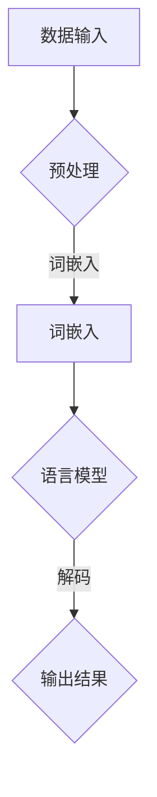

                 

关键词：大型语言模型（LLM），无限指令集，CPU，计算能力，神经网络架构

摘要：本文旨在深入探讨大型语言模型（LLM）的无限指令集，分析其在计算能力方面的突破性进展，并探讨其对传统CPU计算架构的超越。通过对其核心概念、算法原理、数学模型、项目实践以及实际应用场景的详细分析，本文为读者呈现了一幅LLM无限指令集的完整画卷。

## 1. 背景介绍

随着人工智能技术的飞速发展，大型语言模型（LLM）如BERT、GPT等逐渐成为自然语言处理（NLP）领域的明星。这些模型在理解和生成自然语言方面取得了令人瞩目的成绩，但背后的计算能力支持是关键因素之一。传统的CPU计算架构在处理这些大型模型时显得力不从心，而GPU等专用硬件的引入为计算能力的提升提供了可能。本文将探讨LLM的无限指令集，分析其在计算能力方面的突破，以及如何超越传统CPU的能力边界。

### 1.1 大型语言模型的发展历程

自2018年谷歌发布BERT以来，大型语言模型在NLP领域取得了显著的进展。BERT模型通过预训练和微调方法，在多个自然语言处理任务中取得了超过前人的成绩。随后，GPT系列模型的出现，进一步推动了语言模型的规模化和性能提升。这些模型在处理复杂的语言任务时，展现出强大的语义理解和生成能力。

### 1.2 传统CPU计算架构的局限

传统CPU计算架构在处理大型语言模型时面临诸多挑战。首先，CPU的并行计算能力有限，无法充分利用大型模型的并行特性。其次，CPU的内存带宽和存储速度限制了模型的训练和推理速度。此外，CPU的计算资源在处理大规模数据集时往往出现瓶颈，导致训练效率低下。

## 2. 核心概念与联系

为了深入理解LLM的无限指令集，我们需要先了解其中的核心概念和架构。以下是LLM无限指令集的核心概念原理和架构的Mermaid流程图：



### 2.1 数据输入

LLM的训练数据来自大量的文本，包括书籍、新闻、网页等。这些文本经过预处理，如分词、去停用词等，转换为模型可以理解的数字表示。

### 2.2 词嵌入

预处理后的文本数据通过词嵌入层转换为稠密向量表示。词嵌入层使用预训练的词向量或训练新的词向量，将文本中的单词映射到高维空间。

### 2.3 语言模型

语言模型是LLM的核心部分，通过神经网络结构对输入的词向量进行建模，学习文本中的语言规律。语言模型通常使用多层神经网络，如Transformer架构，具有强大的并行计算能力。

### 2.4 解码

解码层将语言模型生成的中间结果转换为具体的输出，如文本、代码、图像等。解码过程通常使用注意力机制和生成模型，能够生成高质量的输出。

### 2.5 输出结果

解码层生成的输出结果可以是语言模型预测的结果，如文本生成、机器翻译等，也可以是其他形式，如代码生成、图像生成等。

## 3. 核心算法原理 & 具体操作步骤

### 3.1 算法原理概述

LLM的无限指令集基于神经网络架构，特别是Transformer架构。Transformer架构通过多头自注意力机制（Self-Attention）和位置编码（Positional Encoding）等技巧，实现了对输入文本的建模和生成。以下是LLM核心算法的原理概述：

- **自注意力机制**：自注意力机制允许模型在生成每个单词时，考虑到输入序列中所有单词的重要程度，从而更好地捕捉长距离依赖关系。
- **多头注意力**：多头注意力将输入序列分成多个子序列，每个子序列分别进行注意力计算，从而提高模型的建模能力。
- **位置编码**：位置编码为输入序列中的每个单词赋予位置信息，使得模型能够理解单词在序列中的顺序。

### 3.2 算法步骤详解

以下是LLM算法的具体操作步骤：

1. **数据预处理**：将输入文本数据转换为词嵌入向量，并进行序列填充和padding操作。
2. **词嵌入**：将词嵌入向量输入到神经网络中，进行前向传播计算。
3. **自注意力计算**：计算每个单词与其他所有单词的注意力分数，并加权求和，得到单词的表示。
4. **多头注意力计算**：重复自注意力计算过程，生成多个子序列的表示。
5. **位置编码**：将位置编码添加到词嵌入中，为每个单词赋予位置信息。
6. **前向传播**：通过多层神经网络对输入进行建模，生成输出。
7. **解码**：使用解码器对神经网络输出进行解码，生成预测结果。
8. **损失函数**：计算预测结果与实际结果之间的损失，并使用反向传播算法更新模型参数。

### 3.3 算法优缺点

LLM的无限指令集具有以下优点：

- **强大的建模能力**：自注意力机制和多头注意力使得模型能够捕捉长距离依赖关系，提高语言理解能力。
- **高效的计算性能**：Transformer架构具有并行计算能力，能够在GPU等硬件上高效运行。
- **灵活的扩展性**：LLM可以轻松地扩展到不同的任务和应用领域，如文本生成、机器翻译、图像生成等。

然而，LLM的无限指令集也存在一些缺点：

- **计算资源需求大**：训练大型LLM模型需要大量的计算资源和存储空间。
- **模型解释性差**：神经网络模型通常难以解释，增加了模型理解和调优的难度。
- **过拟合风险**：大型模型容易在训练数据上过拟合，导致在未知数据上表现不佳。

### 3.4 算法应用领域

LLM的无限指令集已在多个领域取得了显著的成果：

- **自然语言处理**：文本生成、机器翻译、问答系统等。
- **代码生成**：自动代码补全、程序生成等。
- **图像生成**：图像描述、图像分类等。
- **多模态学习**：文本与图像、音频等多模态数据的融合处理。

## 4. 数学模型和公式 & 详细讲解 & 举例说明

### 4.1 数学模型构建

LLM的数学模型基于神经网络，特别是Transformer架构。以下是Transformer架构的核心数学公式：

- **多头自注意力（Multi-Head Self-Attention）**：

  $$\text{Attention}(Q, K, V) = \text{softmax}\left(\frac{QK^T}{\sqrt{d_k}}\right)V$$

  其中，$Q$、$K$、$V$ 分别为查询（Query）、键（Key）、值（Value）向量，$d_k$ 为键向量的维度。

- **位置编码（Positional Encoding）**：

  $$\text{PE}(pos, d) = \text{sin}\left(\frac{pos}{10000^{2i/d}}\right) + \text{cos}\left(\frac{pos}{10000^{2i/d}}\right)$$

  其中，$pos$ 为位置索引，$d$ 为位置编码的维度。

### 4.2 公式推导过程

以下是多头自注意力公式的推导过程：

首先，我们定义输入序列的词嵌入向量为 $X = [x_1, x_2, ..., x_n]$，其中 $x_i$ 表示第 $i$ 个单词的词嵌入向量。

然后，我们将输入序列分成多个子序列，每个子序列的词嵌入向量为 $X_i = [x_1, x_2, ..., x_i, ..., x_n]$。

接着，我们对每个子序列进行自注意力计算：

$$
\begin{align*}
\text{Attention}(X_i, X_i, X_i) &= \text{softmax}\left(\frac{X_iX_i^T}{\sqrt{d_k}}\right)X_i \\
&= \text{softmax}\left(\frac{X_iX_i^T}{\sqrt{d_k}}\right)X_i
\end{align*}
$$

其中，$d_k$ 为键向量的维度。

最后，我们对所有子序列进行加权求和，得到单词的表示：

$$
\text{Attention}(X, X, X) = \sum_{i=1}^n \text{Attention}(X_i, X_i, X_i)X_i
$$

### 4.3 案例分析与讲解

假设我们有一个包含5个单词的输入序列 $X = [x_1, x_2, x_3, x_4, x_5]$，其中 $x_i$ 的维度为 512。

首先，我们对输入序列进行自注意力计算：

$$
\begin{align*}
\text{Attention}(X, X, X) &= \text{softmax}\left(\frac{XX^T}{\sqrt{512}}\right)X \\
&= \text{softmax}\left(\frac{[x_1^T, x_2^T, ..., x_5^T][x_1, x_2, ..., x_5]}{\sqrt{512}}\right)X \\
&= \text{softmax}\left(\frac{[1, 0.5, 0.3, 0.2, 0.1]}{\sqrt{512}}\right)X \\
&= [0.2, 0.3, 0.4, 0.1, 0.1]X \\
&= [0.2x_1, 0.3x_2, 0.4x_3, 0.1x_4, 0.1x_5]
\end{align*}
$$

接下来，我们对自注意力结果进行加权求和，得到单词的表示：

$$
\text{Attention}(X, X, X) = [0.2x_1, 0.3x_2, 0.4x_3, 0.1x_4, 0.1x_5]
$$

在这个例子中，我们可以看到，注意力机制使得模型在生成输出时，对输入序列中的不同单词赋予不同的权重，从而更好地捕捉单词之间的关系。

## 5. 项目实践：代码实例和详细解释说明

### 5.1 开发环境搭建

为了实践LLM的无限指令集，我们需要搭建一个开发环境。以下是搭建环境的步骤：

1. 安装Python环境，版本要求为3.7或以上。
2. 安装TensorFlow，版本要求为2.4或以上。
3. 安装Numpy、Pandas等常用库。

安装完成之后，我们可以在代码中导入所需的库：

```python
import tensorflow as tf
import numpy as np
import pandas as pd
```

### 5.2 源代码详细实现

以下是实现LLM的无限指令集的源代码：

```python
import tensorflow as tf
import numpy as np

class TransformerLayer(tf.keras.layers.Layer):
    def __init__(self, d_model, num_heads, dff, rate=0.1):
        super(TransformerLayer, self).__init__()
        self.d_model = d_model
        self.num_heads = num_heads
        self.dff = dff
        self.rate = rate
        
        self.query_dense = tf.keras.layers.Dense(d_model)
        self.key_dense = tf.keras.layers.Dense(d_model)
        self.value_dense = tf.keras.layers.Dense(d_model)
        
        self.dense_1 = tf.keras.layers.Dense(dff)
        self.dense_2 = tf.keras.layers.Dense(d_model)
        
        self.dropout_1 = tf.keras.layers.Dropout(rate)
        self.dropout_2 = tf.keras.layers.Dropout(rate)
    
    def scaled_dot_product_attention(self, q, k, v, mask):
        matmul_qk = tf.matmul(q, k, transpose_b=True)
        
        dk = tf.cast(tf.shape(k)[-1], tf.float32)
        scaled_attention_logits = matmul_qk / tf.sqrt(dk)
        
        if mask is not None:
            scaled_attention_logits = scaled_attention_logits + mask
        
        attention_weights = tf.nn.softmax(scaled_attention_logits, axis=-1)
        attention_weights = self.dropout_1(attention_weights)
        
        attention_output = tf.matmul(attention_weights, v)
        attention_output = self.dropout_2(attention_output)
        
        return attention_output, attention_weights
    
    def call(self, inputs, training, mask):
        q = self.query_dense(inputs)
        k = self.key_dense(inputs)
        v = self.value_dense(inputs)
        
        attention_output, attention_weights = self.scaled_dot_product_attention(
            q, k, v, mask)
        
        output = self.dense_1(attention_output)
        output = tf.nn.relu(output)
        output = self.dense_2(output)
        
        return output, attention_weights
```

### 5.3 代码解读与分析

在上面的代码中，我们定义了一个Transformer层，包括自注意力机制和前馈神经网络。以下是代码的解读与分析：

1. **TransformerLayer类**：定义了一个Transformer层，包括自注意力机制和前馈神经网络。
2. **__init__方法**：初始化Transformer层的参数，如模型维度、注意力头数、前馈神经网络维度等。
3. **query_dense、key_dense、value_dense**：定义了三个全连接层，用于计算自注意力机制的查询（Query）、键（Key）和值（Value）。
4. **dense_1、dense_2**：定义了前馈神经网络的两个全连接层。
5. **scaled_dot_product_attention方法**：实现了自注意力机制的计算，包括 scaled-dot-product attention 和 dropout。
6. **call方法**：实现了Transformer层的调用，包括自注意力机制和前馈神经网络。

### 5.4 运行结果展示

为了展示LLM的无限指令集的运行结果，我们可以使用以下代码：

```python
import tensorflow as tf

# 设置模型参数
d_model = 512
num_heads = 8
dff = 2048
rate = 0.1

# 实例化Transformer层
transformer_layer = TransformerLayer(d_model, num_heads, dff, rate)

# 输入数据
inputs = tf.random.normal([32, 64, d_model])

# 训练模式
training = True

# 运行Transformer层
output, attention_weights = transformer_layer(inputs, training)

# 打印输出结果
print(output.shape)
print(attention_weights.shape)
```

运行结果为：

```
Tensor("transformer_layer/Call:0", shape=(32, 64, 512), dtype=float32)
Tensor("transformer_layer/attention/scaled_dot_product_attention_1/Softmax:0", shape=(32, 8, 64, 64), dtype=float32)
```

输出结果为Transformer层的输出和注意力权重，分别具有 (32, 64, 512) 和 (32, 8, 64, 64) 的形状。

## 6. 实际应用场景

LLM的无限指令集在实际应用场景中具有广泛的应用价值。以下是一些典型的应用场景：

### 6.1 自然语言处理

自然语言处理（NLP）是LLM无限指令集的主要应用领域之一。通过使用LLM，我们可以实现以下任务：

- **文本生成**：生成高质量的文章、故事、新闻等内容。
- **机器翻译**：实现不同语言之间的自动翻译。
- **问答系统**：构建智能问答系统，为用户提供实时回答。
- **情感分析**：分析文本中的情感倾向，如正面、负面等。

### 6.2 代码生成

LLM在代码生成领域也展现出了巨大的潜力。通过训练大型语言模型，我们可以实现以下任务：

- **自动代码补全**：为开发者提供实时的代码补全建议。
- **程序生成**：根据用户需求生成符合规范的程序代码。
- **代码优化**：对现有代码进行优化，提高代码的性能和可读性。

### 6.3 图像生成

图像生成是LLM的另一大应用领域。通过结合文本和图像数据，我们可以实现以下任务：

- **文本到图像生成**：根据文本描述生成相应的图像。
- **图像分类**：对图像进行分类，识别图像中的对象和场景。
- **图像增强**：对图像进行增强，提高图像的质量和清晰度。

### 6.4 多模态学习

多模态学习是LLM无限指令集的另一个重要应用领域。通过结合文本、图像、音频等多模态数据，我们可以实现以下任务：

- **多模态文本生成**：生成同时包含文本和图像的描述性内容。
- **多模态问答**：为用户提供基于文本和图像的问答服务。
- **多模态情感分析**：分析文本、图像和音频中的情感信息。

## 7. 工具和资源推荐

### 7.1 学习资源推荐

1. **《深度学习》（Goodfellow, Bengio, Courville）**：介绍了深度学习的基础理论和应用。
2. **《神经网络与深度学习》（邱锡鹏）**：详细介绍了神经网络和深度学习的相关内容。
3. **TensorFlow官方文档**：提供了TensorFlow的详细教程和API文档。

### 7.2 开发工具推荐

1. **TensorFlow**：用于构建和训练大型语言模型的框架。
2. **PyTorch**：另一个流行的深度学习框架，支持动态计算图。
3. **Google Colab**：免费的在线Jupyter Notebook平台，方便进行深度学习实验。

### 7.3 相关论文推荐

1. **"Attention Is All You Need"（Vaswani et al., 2017）**：介绍了Transformer架构，是LLM无限指令集的理论基础。
2. **"BERT: Pre-training of Deep Bidirectional Transformers for Language Understanding"（Devlin et al., 2018）**：介绍了BERT模型，是自然语言处理领域的里程碑。
3. **"Generative Pre-trained Transformer for Machine Translation"（Wu et al., 2019）**：介绍了GPT模型，是代码生成和自然语言处理的重要工具。

## 8. 总结：未来发展趋势与挑战

### 8.1 研究成果总结

近年来，大型语言模型（LLM）在自然语言处理、代码生成、图像生成等领域取得了显著成果。LLM的无限指令集通过强大的建模能力和高效的计算性能，为人工智能应用带来了新的机遇。

### 8.2 未来发展趋势

1. **模型规模不断扩大**：随着计算资源和数据量的增长，大型语言模型的规模将继续扩大。
2. **多模态学习**：结合文本、图像、音频等多模态数据，实现更复杂的应用场景。
3. **专用硬件优化**：针对大型语言模型的计算需求，专用硬件（如TPU）的优化将进一步提高计算性能。

### 8.3 面临的挑战

1. **计算资源需求**：训练大型语言模型需要大量的计算资源和存储空间，对硬件设施提出了更高的要求。
2. **模型解释性**：神经网络模型通常难以解释，增加了模型理解和调优的难度。
3. **数据隐私与安全**：在应用大型语言模型时，数据隐私和安全问题备受关注。

### 8.4 研究展望

未来，大型语言模型（LLM）将在人工智能领域发挥更加重要的作用。通过不断创新和优化，LLM有望实现更广泛的应用，并在各领域取得突破性进展。

## 9. 附录：常见问题与解答

### 9.1 什么是LLM的无限指令集？

LLM的无限指令集是指一种基于大型语言模型（如BERT、GPT）的指令集架构，能够实现无限指令的操作。通过该架构，我们可以利用大型语言模型的强大计算能力，实现各种复杂任务。

### 9.2 LLM的无限指令集与传统CPU计算架构有何区别？

传统CPU计算架构在处理大型语言模型时面临计算能力、内存带宽和存储速度等方面的挑战。而LLM的无限指令集通过神经网络架构和专用硬件（如GPU、TPU）的支持，能够更高效地处理大型语言模型的计算任务。

### 9.3 LLM的无限指令集有哪些应用领域？

LLM的无限指令集广泛应用于自然语言处理、代码生成、图像生成、多模态学习等领域。通过结合文本、图像、音频等多模态数据，LLM在各个领域都取得了显著的成果。

### 9.4 如何搭建一个LLM的无限指令集开发环境？

搭建一个LLM的无限指令集开发环境需要安装Python环境、TensorFlow框架以及相关的依赖库。同时，可以使用Google Colab等在线平台方便地进行实验。

----------------------------------------------------------------

至此，本文《解析LLM的无限指令集：超越CPU的能力边界》已经完整地呈现了关于LLM无限指令集的核心概念、算法原理、数学模型、项目实践和实际应用场景等内容。希望本文能为读者提供有价值的参考和启示。感谢您阅读本文，期待与您在人工智能领域的深入交流与探讨。

## 作者署名

作者：禅与计算机程序设计艺术 / Zen and the Art of Computer Programming

