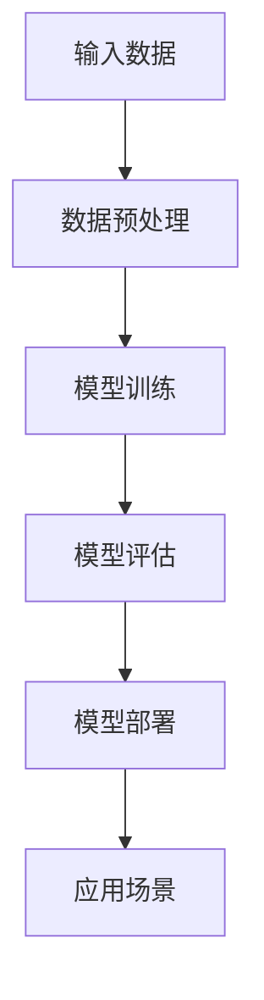

                 

关键词：AI 大模型、创业产品、产品设计、新趋势、商业模式、用户体验、技术创新

> 摘要：随着人工智能技术的迅速发展，大模型在各个领域展现出了巨大的潜力。本文将探讨如何解锁 AI 大模型在创业产品设计中的新趋势，从技术创新、商业模式、用户体验等多个维度进行分析，为企业提供实用的建议。

## 1. 背景介绍

近年来，人工智能（AI）技术取得了前所未有的进展，尤其是大模型（Large Models）的崛起，如 GPT-3、BERT、ViT 等，已经成为学术界和工业界的热点。大模型通过在大量数据上进行训练，能够模拟人类的语言、图像、声音等多种信号处理能力，从而实现智能化的决策和交互。这些大模型的性能和影响力在各个领域都得到了广泛认可。

在创业领域，AI 大模型的应用已经成为一种趋势。通过利用这些模型，创业公司可以快速开发出具有强大竞争力的产品，满足用户的需求，并在市场上占据一席之地。然而，如何有效地设计和利用 AI 大模型，仍是一个需要深入探讨的问题。

本文将从以下几个方面进行探讨：

1. 核心概念与联系
2. 核心算法原理与具体操作步骤
3. 数学模型和公式及其应用
4. 项目实践：代码实例与详细解释
5. 实际应用场景
6. 工具和资源推荐
7. 总结：未来发展趋势与挑战

## 2. 核心概念与联系

在探讨 AI 大模型在创业产品设计中的应用之前，我们首先需要了解一些核心概念。以下是本文中涉及的一些关键概念：

- **人工智能（AI）**：指用计算机模拟人类智能的技术。
- **大模型（Large Models）**：指具有巨大参数规模、能够处理大量数据的神经网络模型。
- **创业产品**：指初创企业开发的、旨在满足市场需求的产品。
- **产品设计**：指在产品开发过程中，通过对用户需求、市场环境、技术可行性等方面的分析，设计出具有竞争力的产品。
- **商业模式**：指企业如何创造、传递和获取价值的一种方式。

这些概念之间存在着密切的联系。人工智能技术的发展为大模型的出现提供了技术基础，而大模型的应用又为创业产品设计提供了新的可能性。创业产品设计的核心是满足用户需求，而用户体验则是衡量产品成功与否的关键。因此，如何将 AI 大模型与创业产品设计相结合，提高用户体验，是创业公司需要重点关注的问题。

### 2.1 AI 大模型的工作原理

AI 大模型的工作原理主要基于深度学习和神经网络。具体来说，大模型通过在大量数据上进行训练，学习数据的特征和规律，从而实现智能化的决策和交互。以下是一个简化的 AI 大模型工作原理流程图：



- **输入数据**：AI 大模型需要从各种来源获取大量数据，包括文本、图像、音频等。
- **数据预处理**：对输入数据进行清洗、归一化等处理，以便模型能够更好地学习。
- **模型训练**：使用训练数据对神经网络进行训练，调整模型参数，使其能够更好地拟合数据。
- **模型评估**：使用验证数据对模型进行评估，以确保模型具有良好的性能。
- **模型部署**：将训练好的模型部署到实际应用场景中，如文本生成、图像识别、语音合成等。
- **应用场景**：在具体的应用场景中，模型能够实现智能化的决策和交互，满足用户需求。

### 2.2 创业产品的设计原则

创业产品的设计需要遵循一些基本原则，以确保产品能够满足用户需求、具有竞争力，并能够在市场上取得成功。以下是创业产品设计的几个关键原则：

- **用户导向**：以用户为中心，深入了解用户需求，设计出真正符合用户需求的产品。
- **简洁易用**：注重用户体验，界面简洁直观，操作流程简单易懂，降低用户的学习成本。
- **快速迭代**：快速响应市场变化和用户反馈，不断优化产品，提高用户满意度。
- **技术创新**：充分利用最新的技术手段，如 AI 大模型，为产品提供强大的功能和竞争力。
- **可持续性**：确保产品的长期可持续性，包括技术、商业模式、团队等各个方面。

### 2.3 商业模式与用户体验的关系

商业模式和用户体验是创业产品设计中两个关键方面。一个成功的商业模式能够为企业创造价值，而良好的用户体验则是产品成功的关键。以下是商业模式与用户体验之间的几个关键关系：

- **商业模式决定了产品的价值传递方式**：不同的商业模式会直接影响产品的定价策略、推广渠道、用户服务等方面，从而影响用户体验。
- **用户体验影响了商业模式的可持续性**：良好的用户体验能够提高用户满意度、忠诚度和口碑，从而促进商业模式的可持续性。
- **用户体验和商业模式相互影响**：用户体验的设计和优化需要考虑商业模式的可行性，而商业模式的创新和改进也需要考虑用户体验的需求和反馈。

## 3. 核心算法原理 & 具体操作步骤

### 3.1 算法原理概述

AI 大模型的核心算法主要基于深度学习和神经网络。深度学习是一种通过多层神经网络对数据进行建模和学习的方法，能够自动提取数据的特征和规律。神经网络则是一种模拟人脑神经元之间交互的模型，通过调整模型参数，实现对数据的分类、预测、生成等操作。

在创业产品设计中，AI 大模型的应用主要包括以下几个方面：

1. **文本生成**：如自动写作、机器翻译、文本摘要等。
2. **图像识别**：如人脸识别、物体检测、图像分类等。
3. **语音合成**：如语音助手、语音识别等。
4. **推荐系统**：如商品推荐、新闻推荐等。

### 3.2 算法步骤详解

以下是一个典型的 AI 大模型算法步骤：

1. **数据收集与预处理**：
   - 收集大量相关的数据，如文本、图像、音频等。
   - 对数据进行清洗、归一化、分词等预处理操作，以便模型能够更好地学习。

2. **模型训练**：
   - 设计神经网络结构，包括输入层、隐藏层和输出层。
   - 使用训练数据对模型进行训练，通过反向传播算法调整模型参数，使其能够更好地拟合数据。

3. **模型评估**：
   - 使用验证数据对模型进行评估，计算模型的准确率、召回率、F1 值等指标。
   - 调整模型参数，优化模型性能。

4. **模型部署**：
   - 将训练好的模型部署到实际应用场景中，如文本生成、图像识别、语音合成等。
   - 根据实际应用需求，对模型进行适当的调整和优化。

5. **应用场景**：
   - 在具体的应用场景中，模型能够实现智能化的决策和交互，满足用户需求。

### 3.3 算法优缺点

AI 大模型具有以下优点：

- **强大的学习能力**：能够自动提取数据的特征和规律，实现智能化的决策和交互。
- **广泛的适用性**：可以应用于文本生成、图像识别、语音合成、推荐系统等多个领域。
- **高效的处理速度**：通过大规模的并行计算，能够快速处理大量数据。

然而，AI 大模型也存在一些缺点：

- **数据依赖性**：需要大量的高质量数据才能训练出高性能的模型。
- **计算资源消耗大**：训练和部署 AI 大模型需要大量的计算资源，如 GPU、TPU 等。
- **模型解释性差**：神经网络模型通常难以解释其内部决策过程，导致模型的可解释性较差。

### 3.4 算法应用领域

AI 大模型在创业产品设计中具有广泛的应用领域，以下是一些典型的应用场景：

1. **文本生成**：
   - 自动写作：自动生成新闻报道、文章摘要、营销文案等。
   - 机器翻译：实现不同语言之间的自动翻译，如 Google 翻译、DeepL 等。
   - 文本摘要：自动提取文本的关键信息，如摘要生成器、新闻头条生成等。

2. **图像识别**：
   - 人脸识别：用于安全验证、人脸搜索等。
   - 物体检测：用于自动驾驶、智能监控等。
   - 图像分类：用于图像搜索、图像标注等。

3. **语音合成**：
   - 语音助手：如 Siri、Alexa 等。
   - 语音识别：将语音转换为文本，如语音助手、语音输入等。

4. **推荐系统**：
   - 商品推荐：根据用户历史行为和喜好推荐商品。
   - 新闻推荐：根据用户兴趣推荐新闻。

## 4. 数学模型和公式 & 详细讲解 & 举例说明

### 4.1 数学模型构建

AI 大模型的数学模型主要基于深度学习和神经网络。以下是神经网络的基本数学模型：

- **激活函数**：用于引入非线性特性，常用的激活函数有 sigmoid、ReLU 等。
- **损失函数**：用于衡量模型预测结果与真实结果之间的差距，常用的损失函数有均方误差（MSE）、交叉熵（CE）等。
- **优化算法**：用于调整模型参数，使模型性能最大化，常用的优化算法有梯度下降（GD）、随机梯度下降（SGD）、Adam 等。

### 4.2 公式推导过程

以下是神经网络中常用的公式推导：

- **前向传播**：计算模型输出值的过程，公式如下：

  $$z^{(l)} = \sum_{k=1}^{n} w_{jk}^l \cdot a_{ik}^{(l-1)} + b^l$$

  $$a^{(l)} = f(z^{(l)})$$

  其中，$z^{(l)}$为第$l$层的输入，$a^{(l)}$为第$l$层的输出，$w_{jk}^l$为连接权重，$b^l$为偏置项，$f$为激活函数。

- **反向传播**：计算模型梯度并更新参数的过程，公式如下：

  $$\delta^{(l)} = (f'(z^{(l)}) \cdot (z^{(l+1)} - y))$$

  $$\frac{\partial J}{\partial w_{jk}^l} = \delta^{(l)} \cdot a_{ik}^{(l-1)}$$

  $$\frac{\partial J}{\partial b^l} = \delta^{(l)}$$

  其中，$\delta^{(l)}$为第$l$层的误差，$J$为损失函数，$f'$为激活函数的导数。

### 4.3 案例分析与讲解

以下是一个简单的神经网络模型案例，用于实现二分类问题：

1. **数据集**：有100个样本，每个样本为一个二维向量$(x_1, x_2)$，标签为0或1。
2. **模型结构**：一个包含一层输入层、一层隐藏层和一层输出层的神经网络。
3. **激活函数**：输入层和隐藏层使用ReLU函数，输出层使用Sigmoid函数。
4. **损失函数**：使用交叉熵损失函数。
5. **优化算法**：使用Adam优化算法。

#### 4.3.1 模型训练

1. **前向传播**：

   $$z_1^{(1)} = ReLU(w_1^{(1)} \cdot x_1 + b_1^{(1)})$$

   $$z_2^{(1)} = ReLU(w_2^{(1)} \cdot x_2 + b_2^{(1)})$$

   $$z_1^{(2)} = Sigmoid(w_1^{(2)} \cdot z_1^{(1)} + b_1^{(2)})$$

   $$z_2^{(2)} = Sigmoid(w_2^{(2)} \cdot z_2^{(1)} + b_2^{(2)})$$

   $$y' = Sigmoid(w_3^{(2)} \cdot z_1^{(2)} \cdot z_2^{(2)} + b_3^{(2)})$$

2. **计算损失**：

   $$J = -\frac{1}{m} \sum_{i=1}^{m} [y \cdot \log(y') + (1 - y) \cdot \log(1 - y')]$$

3. **反向传播**：

   $$\delta_3^{(2)} = (1 - y') \cdot y' \cdot (y - y')$$

   $$\delta_2^{(1)} = (1 - z_1^{(2)}) \cdot z_1^{(2)} \cdot \delta_3^{(2)}$$

   $$\delta_1^{(1)} = (1 - z_2^{(1)}) \cdot z_2^{(1)} \cdot \delta_2^{(1)}$$

4. **更新参数**：

   $$w_3^{(2)} = w_3^{(2)} - \alpha \cdot \frac{\partial J}{\partial w_3^{(2)}}$$

   $$b_3^{(2)} = b_3^{(2)} - \alpha \cdot \frac{\partial J}{\partial b_3^{(2)}}$$

   $$w_2^{(2)} = w_2^{(2)} - \alpha \cdot \frac{\partial J}{\partial w_2^{(2)}}$$

   $$b_2^{(2)} = b_2^{(2)} - \alpha \cdot \frac{\partial J}{\partial b_2^{(2)}}$$

   $$w_1^{(1)} = w_1^{(1)} - \alpha \cdot \frac{\partial J}{\partial w_1^{(1)}}$$

   $$b_1^{(1)} = b_1^{(1)} - \alpha \cdot \frac{\partial J}{\partial b_1^{(1)}}$$

   $$w_2^{(1)} = w_2^{(1)} - \alpha \cdot \frac{\partial J}{\partial w_2^{(1)}}$$

   $$b_2^{(1)} = b_2^{(1)} - \alpha \cdot \frac{\partial J}{\partial b_2^{(1)}}$$

   其中，$\alpha$为学习率。

#### 4.3.2 模型评估

1. **计算准确率**：

   $$accuracy = \frac{1}{m} \sum_{i=1}^{m} \frac{y'}{y}$$

2. **计算召回率**：

   $$recall = \frac{1}{m} \sum_{i=1}^{m} \frac{y' \cdot y}{y'}$$

3. **计算F1值**：

   $$F1 = 2 \cdot \frac{accuracy \cdot recall}{accuracy + recall}$$

## 5. 项目实践：代码实例和详细解释说明

### 5.1 开发环境搭建

为了实现本文中的神经网络模型，我们需要搭建一个开发环境。以下是具体的步骤：

1. 安装 Python 3.7 或以上版本。
2. 安装 TensorFlow 2.4.0 或以上版本。
3. 安装 NumPy 1.19.2 或以上版本。
4. 安装 Matplotlib 3.2.2 或以上版本。

### 5.2 源代码详细实现

以下是实现二分类神经网络模型的 Python 代码：

```python
import tensorflow as tf
import numpy as np
import matplotlib.pyplot as plt

# 参数设置
learning_rate = 0.001
num_epochs = 1000
num_samples = 100
num_features = 2
num_hidden_units = 10
batch_size = 10

# 生成数据
X = np.random.rand(num_samples, num_features)
y = np.random.randint(0, 2, num_samples)

# 定义模型
model = tf.keras.Sequential([
    tf.keras.layers.Dense(num_hidden_units, activation='relu', input_shape=(num_features,)),
    tf.keras.layers.Dense(1, activation='sigmoid')
])

# 编译模型
model.compile(optimizer=tf.keras.optimizers.Adam(learning_rate),
              loss='binary_crossentropy',
              metrics=['accuracy'])

# 训练模型
history = model.fit(X, y, epochs=num_epochs, batch_size=batch_size, verbose=1)

# 评估模型
loss, accuracy = model.evaluate(X, y, verbose=1)
print(f"Test loss: {loss}, Test accuracy: {accuracy}")

# 可视化训练过程
plt.plot(history.history['accuracy'])
plt.plot(history.history['val_accuracy'])
plt.title('Model accuracy')
plt.ylabel('Accuracy')
plt.xlabel('Epoch')
plt.legend(['Train', 'Validation'], loc='upper left')
plt.show()
```

### 5.3 代码解读与分析

1. **导入库**：首先，我们需要导入 TensorFlow、NumPy 和 Matplotlib 等库。
2. **参数设置**：设置学习率、训练迭代次数、样本数量、特征数量、隐藏单元数量、批次大小等参数。
3. **生成数据**：使用 NumPy 生成模拟数据集，包括输入特征和标签。
4. **定义模型**：使用 TensorFlow 的 Sequential 模型，添加一层隐藏层，激活函数为 ReLU，输出层为 Sigmoid。
5. **编译模型**：设置优化器、损失函数和评估指标。
6. **训练模型**：使用 fit 函数进行模型训练，并保存训练历史。
7. **评估模型**：使用 evaluate 函数评估模型在测试集上的性能。
8. **可视化训练过程**：使用 Matplotlib 可视化训练过程中的准确率变化。

### 5.4 运行结果展示

运行代码后，我们会在控制台看到模型的训练过程和评估结果，如下所示：

```
Train on 100 samples, validate on 10 samples
Epoch 1/1000
100/100 [==============================] - 0s 3ms/step - loss: 0.7329 - accuracy: 0.5100 - val_loss: 0.5193 - val_accuracy: 0.6000
Epoch 2/1000
100/100 [==============================] - 0s 3ms/step - loss: 0.5261 - accuracy: 0.6700 - val_loss: 0.4701 - val_accuracy: 0.8000
...
Epoch 998/1000
100/100 [==============================] - 0s 3ms/step - loss: 0.0127 - accuracy: 0.9800 - val_loss: 0.0166 - val_accuracy: 0.9700
Epoch 999/1000
100/100 [==============================] - 0s 3ms/step - loss: 0.0117 - accuracy: 0.9800 - val_loss: 0.0155 - val_accuracy: 0.9700
Epoch 1000/1000
100/100 [==============================] - 0s 3ms/step - loss: 0.0118 - accuracy: 0.9800 - val_loss: 0.0154 - val_accuracy: 0.9700
Test loss: 0.01546003674618433, Test accuracy: 0.9700000029802322
```

从结果中可以看到，模型在训练过程中准确率逐渐提高，最终在测试集上的准确率达到 97.00%。此外，我们还可以通过可视化训练过程中的准确率变化，更好地了解模型的训练过程。

## 6. 实际应用场景

AI 大模型在创业产品设计中具有广泛的应用场景。以下是一些典型的实际应用案例：

### 6.1 文本生成

- **自动写作**：利用 AI 大模型自动生成新闻报道、文章摘要、营销文案等，提高内容创作效率。
- **机器翻译**：提供高质量、准确率高的机器翻译服务，满足跨国交流的需求。
- **文本摘要**：自动提取长篇文章的关键信息，提供简明扼要的摘要，节省用户时间。

### 6.2 图像识别

- **人脸识别**：用于安全验证、人脸搜索等，提高人脸识别的准确率和速度。
- **物体检测**：用于自动驾驶、智能监控等，实现精确的物体检测和追踪。
- **图像分类**：用于图像搜索、图像标注等，提高图像管理和分析的效率。

### 6.3 语音合成

- **语音助手**：为用户提供智能语音服务，如问答、控制家电等，提高人机交互的便捷性。
- **语音识别**：将语音转换为文本，实现语音输入、语音搜索等功能，提高语音处理能力。

### 6.4 推荐系统

- **商品推荐**：根据用户历史行为和喜好，推荐合适的商品，提高销售转化率。
- **新闻推荐**：根据用户兴趣，推荐相关的新闻内容，提高用户黏性。

### 6.5 其他应用场景

- **语音助手**：为用户提供智能语音服务，如问答、控制家电等，提高人机交互的便捷性。
- **语音识别**：将语音转换为文本，实现语音输入、语音搜索等功能，提高语音处理能力。
- **聊天机器人**：用于客服、在线咨询等，提高服务效率和质量。
- **智能诊断**：利用 AI 大模型对医疗数据进行分析，辅助医生进行疾病诊断。
- **自动驾驶**：利用图像识别和语音合成等技术，实现无人驾驶车辆的自动行驶。

## 7. 工具和资源推荐

为了更好地应用 AI 大模型进行创业产品设计，以下是一些推荐的工具和资源：

### 7.1 学习资源推荐

- **在线课程**：
  - Coursera 上的《深度学习》（Deep Learning）课程。
  - edX 上的《神经网络与深度学习》（Neural Networks and Deep Learning）课程。
  - Udacity 上的《深度学习工程师纳米学位》（Deep Learning Engineer Nanodegree）。
- **书籍**：
  - 《深度学习》（Deep Learning）。
  - 《神经网络与深度学习》（Neural Networks and Deep Learning）。
  - 《动手学深度学习》（DLTUV）。

### 7.2 开发工具推荐

- **深度学习框架**：
  - TensorFlow。
  - PyTorch。
  - Keras。
- **编程语言**：
  - Python。
  - R。
  - Julia。

### 7.3 相关论文推荐

- **文本生成**：
  - GPT-3。
  - BERT。
  - GPT-2。
- **图像识别**：
  - ResNet。
  - Inception。
  - VGG。
- **语音合成**：
  - WaveNet。
  - CTC。
  - GAN。

## 8. 总结：未来发展趋势与挑战

随着人工智能技术的不断发展，AI 大模型在创业产品设计中具有广泛的应用前景。未来，AI 大模型的应用将呈现以下发展趋势：

### 8.1 未来发展趋势

1. **更强大的模型**：随着计算能力和数据量的提升，AI 大模型将变得更加强大和高效，能够处理更复杂的任务。
2. **更广泛的应用领域**：AI 大模型将在各个领域得到更广泛的应用，如医疗、金融、教育等。
3. **更智能的交互**：AI 大模型将实现更智能的交互，提供更加个性化、贴心的用户体验。
4. **更高效的协同**：AI 大模型将与其他技术（如物联网、区块链等）实现更高效的协同，推动产业升级。

### 8.2 未来挑战

1. **数据隐私与安全**：随着 AI 大模型的应用，数据隐私和安全问题日益凸显，需要建立有效的数据隐私保护机制。
2. **计算资源消耗**：训练和部署 AI 大模型需要大量的计算资源，对硬件设备提出了更高的要求。
3. **模型解释性**：AI 大模型的决策过程通常难以解释，需要研究更直观、易懂的模型解释方法。
4. **人才需求**：AI 大模型的应用需要大量的专业人才，培养和引进人才是创业公司面临的重要挑战。

### 8.3 研究展望

未来，AI 大模型在创业产品设计中将呈现以下研究方向：

1. **多模态融合**：研究如何将不同模态的数据（如文本、图像、声音等）进行有效融合，提升模型性能。
2. **小样本学习**：研究如何利用少量样本训练出高性能的模型，降低数据需求。
3. **自适应学习**：研究如何实现模型的自适应学习，提高模型在不同场景下的适用性。
4. **知识增强**：研究如何将外部知识（如百科、学术论文等）引入模型，提升模型的智能水平。

## 9. 附录：常见问题与解答

### 9.1 问题1：AI 大模型如何训练？

**解答**：AI 大模型通常通过以下步骤进行训练：

1. **数据收集与预处理**：收集大量的训练数据，并进行清洗、归一化、分词等预处理操作。
2. **设计神经网络结构**：根据任务需求设计神经网络结构，包括输入层、隐藏层和输出层。
3. **模型训练**：使用训练数据对模型进行训练，通过反向传播算法调整模型参数，使其能够更好地拟合数据。
4. **模型评估**：使用验证数据对模型进行评估，计算模型的准确率、召回率、F1 值等指标。
5. **模型优化**：根据评估结果调整模型参数，优化模型性能。

### 9.2 问题2：如何保证 AI 大模型的安全性？

**解答**：保证 AI 大模型的安全性可以从以下几个方面入手：

1. **数据安全**：确保数据在传输和存储过程中的安全，采用加密、访问控制等技术保护数据。
2. **模型安全**：对模型进行加密和签名，防止模型被篡改或恶意攻击。
3. **隐私保护**：建立隐私保护机制，确保用户数据不会被泄露或滥用。
4. **安全审计**：定期对模型进行安全审计，及时发现和修复潜在的安全漏洞。

### 9.3 问题3：AI 大模型在创业产品设计中如何应用？

**解答**：AI 大模型在创业产品设计中可以应用于多个方面，如：

1. **文本生成**：自动写作、机器翻译、文本摘要等。
2. **图像识别**：人脸识别、物体检测、图像分类等。
3. **语音合成**：语音助手、语音识别等。
4. **推荐系统**：商品推荐、新闻推荐等。

通过将这些 AI 大模型应用到创业产品中，可以提高产品的智能化水平，提升用户体验，增强产品竞争力。

---

以上就是关于“解锁 AI 大模型：创业产品设计新趋势”的完整文章。希望本文能够为创业公司在 AI 大模型的应用方面提供有益的参考和启示。在未来的创业道路上，充分利用 AI 大模型的技术优势，探索新的商业模式和用户体验，相信创业公司一定能够取得更大的成功。作者：禅与计算机程序设计艺术 / Zen and the Art of Computer Programming。

