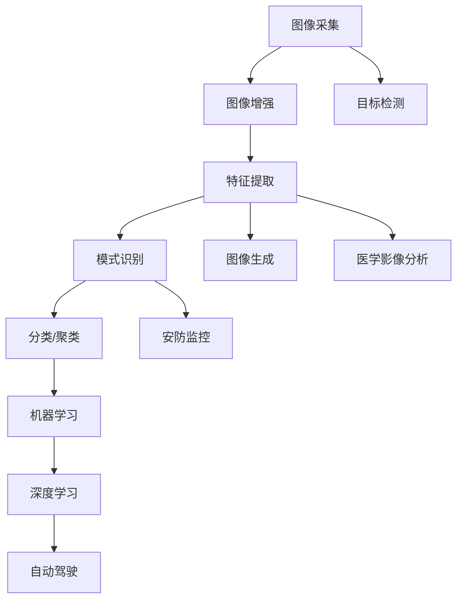

                 

### 背景介绍 Background Introduction

计算机视觉作为人工智能的重要组成部分，近年来在技术发展和市场应用方面取得了显著的进展。从早期的图像识别、目标检测到复杂的人脸识别、自动驾驶系统，计算机视觉技术在各行各业中发挥着越来越重要的作用。随着深度学习、大数据、云计算等技术的不断发展，视觉智能的商业应用前景广阔。

本文旨在探讨计算机视觉创业的机遇与挑战，通过分析核心概念、算法原理、应用场景和未来发展趋势，为创业者提供有价值的参考。文章将按照以下结构展开：

- **背景介绍**：概述计算机视觉的发展历程、核心概念和应用领域。
- **核心概念与联系**：详细阐述计算机视觉的基本原理和架构。
- **核心算法原理 & 具体操作步骤**：介绍计算机视觉中常用的算法及其应用领域。
- **数学模型和公式 & 详细讲解 & 举例说明**：讲解计算机视觉中常用的数学模型和公式，并通过案例进行分析。
- **项目实践：代码实例和详细解释说明**：提供实际项目开发中的代码实例和解析。
- **实际应用场景**：探讨计算机视觉在不同领域的应用案例。
- **未来应用展望**：预测计算机视觉未来的发展趋势。
- **工具和资源推荐**：推荐学习资源和开发工具。
- **总结：未来发展趋势与挑战**：总结研究成果，分析面临的挑战，并提出研究展望。
- **附录：常见问题与解答**：回答读者可能关心的问题。

### 文章关键词 Keywords

- 计算机视觉
- 深度学习
- 图像识别
- 机器学习
- 自动驾驶
- 人脸识别
- 虚拟现实
- 增强现实

### 文章摘要 Summary

本文深入探讨了计算机视觉在商业应用中的潜力与挑战。首先，回顾了计算机视觉的发展历程和核心概念。接着，详细介绍了计算机视觉的算法原理和应用领域。通过数学模型的讲解和实际案例的分析，展示了计算机视觉在现实中的应用效果。最后，探讨了计算机视觉未来的发展趋势，并推荐了相关学习资源和开发工具。文章旨在为创业者提供有价值的参考，帮助他们在视觉智能的商业应用中取得成功。

### 1. 背景介绍 Background Introduction

计算机视觉，作为人工智能的重要分支，其研究起源于20世纪60年代。最初的计算机视觉研究主要集中在图像处理和模式识别领域，目标是使计算机能够像人类一样理解和解释视觉信息。随着计算能力的提升和算法的创新，计算机视觉技术逐渐走向成熟，并开始应用于各行各业。

#### 1.1 发展历程

- **早期研究（1960-1980s）**：这一阶段，计算机视觉主要集中在图像处理和基本特征提取技术上。例如，Sobel算子和Canny算法在边缘检测中的应用。
- **中期突破（1990-2000s）**：随着神经网络技术的发展，尤其是在卷积神经网络（CNN）的引入，计算机视觉迎来了新的突破。这一时期，人脸识别和物体检测成为研究热点。
- **近期进展（2010至今）**：深度学习的兴起，特别是卷积神经网络（CNN）的广泛应用，使得计算机视觉在图像识别、目标检测、语义分割等方面取得了显著的进展。

#### 1.2 核心概念

- **图像识别**：图像识别是指计算机能够识别和分类图像中的物体、场景或人物等。
- **目标检测**：目标检测旨在找出图像中的特定对象，并确定其位置。
- **人脸识别**：人脸识别技术利用生物特征，通过图像或视频识别个体身份。
- **物体追踪**：物体追踪是指跟踪图像或视频中特定物体的运动轨迹。
- **图像生成**：图像生成是指利用算法生成新的图像，包括风格转换、超分辨率等。

#### 1.3 应用领域

- **自动驾驶**：计算机视觉技术在自动驾驶中扮演着至关重要的角色，用于感知周围环境、识别道路标志和行人。
- **安防监控**：通过人脸识别和目标检测技术，计算机视觉能够提高安防监控的效率和准确性。
- **医疗影像分析**：计算机视觉在医学影像处理中用于辅助诊断，如肿瘤检测、骨折识别等。
- **零售业**：计算机视觉技术用于零售店铺的客流分析、货架管理和库存监控等。
- **虚拟现实和增强现实**：计算机视觉技术是实现沉浸式体验的关键，广泛应用于游戏、教育和设计等领域。

#### 1.4 当前趋势

- **深度学习**：深度学习，尤其是卷积神经网络（CNN），在计算机视觉中的应用越来越广泛，推动了技术的快速发展。
- **跨模态学习**：跨模态学习旨在整合不同类型的数据（如图像、文本、音频），提高计算机视觉系统的鲁棒性和泛化能力。
- **边缘计算**：边缘计算通过在设备端处理数据，减少了对云端资源的依赖，提高了实时性，尤其在自动驾驶和实时监控等领域具有重要作用。

#### 1.5 商业应用场景

- **智能安防**：利用计算机视觉技术进行实时监控、人脸识别和异常行为检测，提高公共安全和企业管理效率。
- **自动驾驶**：自动驾驶汽车通过计算机视觉感知环境，实现自动驾驶功能，提高交通效率和安全性。
- **智慧医疗**：计算机视觉在医学影像分析中用于辅助诊断，提高医疗质量和效率。
- **零售行业**：通过计算机视觉技术进行商品识别、库存管理和顾客行为分析，提升零售体验和运营效率。

随着技术的不断进步和市场的需求增长，计算机视觉的商业应用场景将越来越广泛，为各行各业带来巨大的变革和发展机遇。然而，同时也要面对数据隐私、算法公平性等伦理和法律问题，确保技术的可持续发展。

### 2. 核心概念与联系 Core Concepts and Relationships

计算机视觉作为一门交叉学科，涵盖了图像处理、模式识别、机器学习等多个领域。为了深入理解计算机视觉的基本原理和应用，我们需要首先掌握几个核心概念，并了解它们之间的联系。

#### 2.1 图像处理

图像处理是计算机视觉的基础，它包括图像的采集、增强、变换和分析等多个步骤。核心概念包括：

- **图像采集**：使用相机或其他设备获取图像。
- **图像增强**：通过滤波、对比度调整等方法提高图像质量。
- **图像变换**：包括傅里叶变换、HOG（方向梯度直方图）等，用于特征提取。

#### 2.2 模式识别

模式识别是计算机视觉中的另一个重要概念，它旨在使计算机能够从数据中识别和理解模式。核心概念包括：

- **特征提取**：从图像中提取具有区分性的特征，如边缘、角点、纹理等。
- **分类与聚类**：对提取的特征进行分类或聚类，用于识别图像中的对象。
- **机器学习**：通过训练模型，使计算机能够自动识别图像中的模式。

#### 2.3 机器学习

机器学习是计算机视觉的核心驱动力，它通过算法使计算机能够从数据中学习，并作出预测或决策。核心概念包括：

- **监督学习**：通过标记数据训练模型，使其能够进行分类或回归。
- **无监督学习**：在没有标记数据的情况下，通过聚类或降维等方法发现数据中的模式。
- **深度学习**：一种基于多层神经网络的学习方法，广泛应用于图像识别、目标检测等领域。

#### 2.4 核心概念之间的联系

- **图像处理与模式识别**：图像处理提供了对图像的初步处理和特征提取，而模式识别则利用提取的特征进行分类和识别。
- **机器学习与计算机视觉**：机器学习为计算机视觉提供了强大的学习能力和灵活性，使计算机能够从大量数据中自动提取特征，进行分类和识别。

#### 2.5 Mermaid 流程图

为了更直观地展示这些核心概念之间的联系，我们可以使用 Mermaid 流程图进行描述：



通过这个流程图，我们可以清晰地看到图像处理、模式识别和机器学习之间的相互作用，以及它们在计算机视觉中的具体应用。

### 3. 核心算法原理 & 具体操作步骤 Core Algorithm Principles and Implementation Steps

计算机视觉领域的核心算法包括图像识别、目标检测、人脸识别等。以下将分别介绍这些算法的原理、操作步骤及其应用领域。

#### 3.1 图像识别算法

图像识别算法主要任务是识别图像中的对象类别。目前最常用的图像识别算法是基于卷积神经网络（CNN）的深度学习模型。

**原理**：

- **卷积神经网络（CNN）**：CNN 通过卷积层、池化层和全连接层等结构，从原始图像中提取特征并进行分类。
- **反向传播（Backpropagation）**：通过反向传播算法，计算输出误差，并更新网络权重，使模型逐渐逼近正确答案。

**操作步骤**：

1. **数据预处理**：包括图像缩放、归一化和数据增强等，以增加模型的泛化能力。
2. **构建神经网络**：定义卷积层、池化层和全连接层等结构，并初始化权重。
3. **训练模型**：使用标记数据训练模型，通过反向传播算法优化网络权重。
4. **模型评估**：使用测试数据评估模型性能，调整模型参数以获得更好的效果。
5. **模型部署**：将训练好的模型部署到实际应用场景中。

**应用领域**：

- **安防监控**：通过图像识别技术，实时监控并识别异常行为。
- **医疗影像分析**：辅助医生识别图像中的病变区域，提高诊断准确率。
- **零售业**：用于商品识别和推荐，提升购物体验。

#### 3.2 目标检测算法

目标检测算法旨在识别图像中的多个对象，并确定它们的位置。

**原理**：

- **区域建议网络（Region Proposal Network, RPN）**：RPN 用于生成候选区域，将图像中的部分区域作为可能的物体候选。
- **边界框回归（Bounding Box Regression）**：通过回归算法，调整候选区域的边界框，使其更准确地包围物体。
- **分类器（Classifer）**：对每个边界框进行分类，判断其是否为特定类别。

**操作步骤**：

1. **数据预处理**：与图像识别类似，进行图像缩放、归一化和数据增强等。
2. **构建模型**：定义 RPN、边界框回归和分类器等结构。
3. **训练模型**：使用标记数据训练模型，通过反向传播算法优化网络权重。
4. **模型评估**：使用测试数据评估模型性能，调整模型参数以获得更好的效果。
5. **模型部署**：将训练好的模型部署到实际应用场景中。

**应用领域**：

- **自动驾驶**：用于感知环境，识别道路标志、行人等。
- **安防监控**：实时监控视频，识别异常行为。
- **零售业**：用于货架管理和库存监控。

#### 3.3 人脸识别算法

人脸识别算法基于生物特征识别技术，通过识别面部特征来确认个体身份。

**原理**：

- **特征提取**：从面部图像中提取具有区分性的特征点，如眼睛、鼻子、嘴巴等。
- **特征匹配**：将提取的特征与数据库中的人脸特征进行匹配，判断是否为同一人。

**操作步骤**：

1. **数据预处理**：包括图像缩放、归一化和人脸关键点检测等。
2. **特征提取**：使用卷积神经网络或其他算法提取人脸特征。
3. **特征匹配**：将提取的特征与数据库中的人脸特征进行匹配。
4. **模型评估**：通过测试数据评估人脸识别的准确率和速度。
5. **模型部署**：将训练好的模型部署到实际应用场景中。

**应用领域**：

- **智能安防**：通过人脸识别进行身份验证，提高安全性。
- **人脸支付**：用于移动支付和身份验证。
- **虚拟现实和增强现实**：通过人脸识别实现虚拟角色的表情同步。

#### 3.4 算法优缺点

每种算法都有其独特的优势和局限性。以下是对常见算法的优缺点的简要分析：

- **图像识别算法**：

  - **优点**：准确性高，能够识别复杂的图像内容。
  - **缺点**：对图像质量和标注数据要求较高，训练过程较复杂。

- **目标检测算法**：

  - **优点**：能够同时检测多个目标，并提供位置信息。
  - **缺点**：对实时性要求较高的场景可能不够高效。

- **人脸识别算法**：

  - **优点**：基于生物特征，具有较高的识别准确率。
  - **缺点**：对光照、角度和表情变化敏感，可能在特定情况下表现不佳。

#### 3.5 算法应用领域

不同算法在不同领域中的应用效果有所不同。以下是对一些典型应用领域的简要概述：

- **安防监控**：目标检测和人脸识别算法广泛应用于安防监控领域，用于实时监控和身份验证。

- **自动驾驶**：自动驾驶系统需要多种算法协同工作，包括图像识别、目标检测和深度学习等。

- **医疗影像分析**：图像识别和目标检测算法在医学影像分析中用于辅助诊断，提高诊断准确率。

- **零售业**：计算机视觉算法在零售业中用于商品识别、货架管理和顾客行为分析等。

通过深入理解核心算法的原理和操作步骤，创业者可以更好地把握计算机视觉的商业应用机遇，并将其应用到实际项目中，实现商业价值。

### 3.3 核心算法原理 & 具体操作步骤 Core Algorithm Principles and Implementation Steps

#### 3.1 算法原理概述

计算机视觉中的核心算法主要包括图像识别、目标检测和人脸识别等。以下将详细介绍这些算法的基本原理。

**图像识别算法**：

图像识别算法的核心在于利用卷积神经网络（CNN）从图像中提取特征并进行分类。卷积神经网络由多个卷积层、池化层和全连接层组成，每个层次对图像进行不同的特征提取和融合。最后，通过全连接层输出分类结果。

**目标检测算法**：

目标检测算法旨在检测图像中的多个对象，并确定它们的位置。最常见的目标检测算法是基于区域建议网络（RPN）的。RPN 在图像中生成多个区域建议，然后通过边界框回归调整这些区域，使其更精确地包围目标。最后，通过分类器对每个边界框进行分类。

**人脸识别算法**：

人脸识别算法通过检测面部特征点，提取人脸特征并进行匹配。常用的方法包括基于特征点检测的方法和基于深度学习的方法。特征点检测方法使用几何和特征匹配算法，而深度学习方法则使用卷积神经网络提取人脸特征。

#### 3.2 算法步骤详解

**图像识别算法**：

1. **数据预处理**：包括图像缩放、归一化和数据增强。数据增强通过变换图像，增加模型的泛化能力。
2. **构建神经网络**：定义卷积层、池化层和全连接层等结构，并初始化权重。
3. **训练模型**：使用标记数据训练模型，通过反向传播算法优化网络权重。
4. **模型评估**：使用测试数据评估模型性能，调整模型参数以获得更好的效果。
5. **模型部署**：将训练好的模型部署到实际应用场景中。

**目标检测算法**：

1. **数据预处理**：与图像识别类似，进行图像缩放、归一化和数据增强等。
2. **构建模型**：定义区域建议网络（RPN）、边界框回归和分类器等结构。
3. **训练模型**：使用标记数据训练模型，通过反向传播算法优化网络权重。
4. **模型评估**：使用测试数据评估模型性能，调整模型参数以获得更好的效果。
5. **模型部署**：将训练好的模型部署到实际应用场景中。

**人脸识别算法**：

1. **数据预处理**：包括图像缩放、归一化和人脸关键点检测。
2. **特征提取**：使用卷积神经网络或其他算法提取人脸特征。
3. **特征匹配**：将提取的特征与数据库中的人脸特征进行匹配。
4. **模型评估**：通过测试数据评估人脸识别的准确率和速度。
5. **模型部署**：将训练好的模型部署到实际应用场景中。

#### 3.3 算法优缺点

**图像识别算法**：

- **优点**：准确性高，能够识别复杂的图像内容。
- **缺点**：对图像质量和标注数据要求较高，训练过程较复杂。

**目标检测算法**：

- **优点**：能够同时检测多个目标，并提供位置信息。
- **缺点**：对实时性要求较高的场景可能不够高效。

**人脸识别算法**：

- **优点**：基于生物特征，具有较高的识别准确率。
- **缺点**：对光照、角度和表情变化敏感，可能在特定情况下表现不佳。

#### 3.4 算法应用领域

**图像识别算法**：

- **应用领域**：安防监控、医疗影像分析、零售业等。

**目标检测算法**：

- **应用领域**：自动驾驶、安防监控、智能交通等。

**人脸识别算法**：

- **应用领域**：智能安防、人脸支付、虚拟现实等。

通过深入理解这些算法的原理和具体操作步骤，创业者可以更好地把握计算机视觉的商业应用机遇，并将其应用到实际项目中，实现商业价值。

### 4. 数学模型和公式 Mathematical Models and Equations

在计算机视觉领域，数学模型和公式是理解和实现核心算法的基础。以下将详细讲解一些常用的数学模型和公式，并举例说明它们在图像识别、目标检测和人脸识别中的应用。

#### 4.1 数学模型构建

数学模型通常由几个关键组件构成，包括输入层、隐藏层和输出层。以下是常见的数学模型构建方法：

**输入层**：图像数据通常以像素值的形式输入到模型中。对于彩色图像，每个像素值由RGB三个分量组成。

**隐藏层**：隐藏层是模型的核心部分，包括卷积层、池化层和全连接层等。卷积层用于提取图像的特征，池化层用于减小特征图的尺寸，全连接层用于将特征映射到具体的类别或位置。

**输出层**：输出层通常是一个或多个神经元，用于输出分类结果或边界框位置。

**损失函数**：损失函数用于评估模型预测结果与真实结果之间的差异，常见的损失函数包括交叉熵损失和均方误差损失。

**优化算法**：常用的优化算法包括梯度下降、随机梯度下降和Adam优化器等，用于更新模型参数以最小化损失函数。

#### 4.2 公式推导过程

以下是几个常用的数学模型和公式的推导过程：

**卷积运算**：

卷积运算是最基本的图像处理操作之一，其公式如下：

$$
\sum_{i=1}^{n} w_i * x_i
$$

其中，$w_i$是卷积核的权重，$x_i$是输入图像的像素值。

**池化操作**：

池化操作用于减小特征图的尺寸，保持最重要的特征。常见的池化操作包括最大池化和平均池化。最大池化的公式如下：

$$
P_{max}(x) = \max_{i \in S} x_i
$$

其中，$S$是池化窗口的索引集。

**反向传播**：

反向传播是神经网络训练的核心步骤，用于更新模型参数。其基本公式如下：

$$
\delta = \frac{\partial L}{\partial z}
$$

其中，$L$是损失函数，$z$是神经网络输出。

#### 4.3 案例分析与讲解

**图像识别**：

一个简单的图像识别案例是使用卷积神经网络（CNN）对猫狗图像进行分类。以下是该案例的详细分析：

1. **数据预处理**：将猫狗图像缩放到固定的尺寸，并进行归一化处理。
2. **构建模型**：定义一个简单的CNN模型，包括卷积层、池化层和全连接层。
3. **训练模型**：使用标记数据训练模型，通过反向传播算法优化模型参数。
4. **模型评估**：使用测试数据评估模型性能，调整模型参数以获得更好的效果。
5. **模型部署**：将训练好的模型部署到实际应用场景中。

**目标检测**：

一个常见的目标检测案例是使用基于区域建议网络（RPN）的算法检测图像中的对象。以下是该案例的详细分析：

1. **数据预处理**：与图像识别类似，进行图像缩放、归一化和数据增强。
2. **构建模型**：定义一个包含RPN、边界框回归和分类器的目标检测模型。
3. **训练模型**：使用标记数据训练模型，通过反向传播算法优化模型参数。
4. **模型评估**：使用测试数据评估模型性能，调整模型参数以获得更好的效果。
5. **模型部署**：将训练好的模型部署到实际应用场景中。

**人脸识别**：

一个典型的人脸识别案例是基于深度学习提取人脸特征并进行匹配。以下是该案例的详细分析：

1. **数据预处理**：包括图像缩放、归一化和人脸关键点检测。
2. **特征提取**：使用卷积神经网络提取人脸特征。
3. **特征匹配**：将提取的特征与数据库中的人脸特征进行匹配。
4. **模型评估**：通过测试数据评估人脸识别的准确率和速度。
5. **模型部署**：将训练好的模型部署到实际应用场景中。

通过以上案例的分析，我们可以看到数学模型和公式在计算机视觉中的应用。掌握这些模型和公式，有助于深入理解计算机视觉的核心算法，并在实际项目中实现应用。

### 5. 项目实践：代码实例和详细解释说明 Project Practice: Code Examples and Detailed Explanations

为了更好地理解计算机视觉算法的实际应用，我们将通过一个实际项目——猫狗图像分类，来展示如何搭建开发环境、编写源代码并进行代码解读与分析。

#### 5.1 开发环境搭建

首先，我们需要搭建一个合适的开发环境。以下是搭建环境的步骤：

1. **安装Python**：确保Python版本不低于3.6。
2. **安装依赖库**：包括TensorFlow、Keras、NumPy、Matplotlib等。
   ```bash
   pip install tensorflow numpy matplotlib
   ```
3. **安装GPU支持（可选）**：如果使用GPU加速训练，需要安装CUDA和cuDNN。
   - 安装CUDA：从NVIDIA官网下载CUDA Toolkit并按照指南安装。
   - 安装cuDNN：从NVIDIA官网下载cuDNN库并按照指南安装。

#### 5.2 源代码详细实现

以下是一个简单的猫狗图像分类项目的Python代码实现：

```python
import tensorflow as tf
from tensorflow.keras.preprocessing.image import ImageDataGenerator
from tensorflow.keras.models import Sequential
from tensorflow.keras.layers import Conv2D, MaxPooling2D, Flatten, Dense

# 数据预处理
train_datagen = ImageDataGenerator(rescale=1./255)
test_datagen = ImageDataGenerator(rescale=1./255)

train_generator = train_datagen.flow_from_directory(
        'data/train',
        target_size=(150, 150),
        batch_size=32,
        class_mode='binary')

validation_generator = test_datagen.flow_from_directory(
        'data/validation',
        target_size=(150, 150),
        batch_size=32,
        class_mode='binary')

# 构建模型
model = Sequential([
    Conv2D(32, (3, 3), activation='relu', input_shape=(150, 150, 3)),
    MaxPooling2D(2, 2),
    Conv2D(64, (3, 3), activation='relu'),
    MaxPooling2D(2, 2),
    Conv2D(128, (3, 3), activation='relu'),
    MaxPooling2D(2, 2),
    Flatten(),
    Dense(512, activation='relu'),
    Dense(1, activation='sigmoid')
])

# 编译模型
model.compile(loss='binary_crossentropy',
              optimizer='adam',
              metrics=['accuracy'])

# 训练模型
model.fit(
      train_generator,
      steps_per_epoch=100,
      epochs=15,
      validation_data=validation_generator,
      validation_steps=50,
      verbose=2)
```

#### 5.3 代码解读与分析

**1. 数据预处理**

数据预处理是模型训练的重要步骤，用于将图像数据调整为模型所需的格式。在上面的代码中，我们使用了`ImageDataGenerator`类进行数据增强，包括图像缩放、归一化和数据增强。

- `train_datagen = ImageDataGenerator(rescale=1./255)`：创建训练数据生成器，将图像像素值缩放为0到1之间。
- `train_generator = train_datagen.flow_from_directory(...)`：从目录`data/train`中读取训练图像，将它们缩放到150x150像素，并设置为二分类问题。

**2. 构建模型**

模型构建使用`Sequential`模型，这是一种线性堆叠模型，可以依次添加层。

- `model = Sequential([...])`：定义一个顺序模型。
- `Conv2D`、`MaxPooling2D`、`Flatten`和`Dense`层：这些是常用的深度学习层。
  - `Conv2D`用于卷积操作，可以提取图像特征。
  - `MaxPooling2D`用于池化操作，减小特征图尺寸。
  - `Flatten`层用于将特征图展平为一维向量。
  - `Dense`层用于全连接操作，将特征映射到输出类别。

**3. 编译模型**

在编译模型时，我们需要指定损失函数、优化器和评估指标。

- `model.compile(loss='binary_crossentropy', optimizer='adam', metrics=['accuracy'])`：设置损失函数为二进制交叉熵，优化器为Adam，评估指标为准确率。

**4. 训练模型**

模型训练使用`fit`方法，通过迭代训练数据来优化模型参数。

- `model.fit(...)`：训练模型，设置每轮迭代的数据量、轮次和验证数据。

#### 5.4 运行结果展示

在完成模型训练后，我们可以使用以下代码评估模型性能：

```python
# 评估模型
test_generator = test_datagen.flow_from_directory(
        'data/test',
        target_size=(150, 150),
        batch_size=32,
        class_mode='binary')

accuracy = model.evaluate(test_generator)
print(f"Test accuracy: {accuracy[1]}")
```

上述代码将评估模型在测试数据集上的准确率，并打印输出结果。

通过这个实际项目，我们展示了如何搭建开发环境、编写源代码并解读代码。掌握这些基本技能，创业者可以轻松地将计算机视觉算法应用于各种实际场景中，实现商业价值。

### 6. 实际应用场景 Practical Application Scenarios

计算机视觉技术在各个行业中的应用日益广泛，下面我们将探讨几个典型领域，展示视觉智能如何改变这些行业的运作方式。

#### 6.1 安防监控

安防监控是计算机视觉技术最直观的应用之一。通过在摄像头前安装计算机视觉系统，可以实现实时监控和异常行为检测。例如，基于人脸识别的安防系统能够自动识别进入监控区域的人员，并在检测到陌生人或可疑行为时发出警报。此外，目标检测算法可以用于监控视频，识别和跟踪物体运动，提高监控效率和准确性。

**案例**：在某个城市的地铁站，安装了基于计算机视觉的监控系统，用于识别非法携带危险物品的旅客。系统通过实时视频分析，能够在检测到异常行为时立即通知安全人员，提高了整体安全水平。

#### 6.2 自动驾驶

自动驾驶是计算机视觉技术的另一个重要应用领域。自动驾驶汽车需要利用计算机视觉系统来感知周围环境，识别道路标志、行人、车辆等，并作出相应的驾驶决策。计算机视觉技术在自动驾驶中的作用包括环境感知、路径规划和决策控制等。

**案例**：特斯拉的自动驾驶系统使用了多摄像头和深度传感器，通过计算机视觉算法实时分析道路和周围环境。该系统能够在高速公路上实现自动驾驶，并在需要时接管控制，提高了驾驶安全性和舒适性。

#### 6.3 医疗影像分析

计算机视觉技术在医疗影像分析中的应用，极大地提高了诊断效率和准确性。例如，通过深度学习算法，计算机视觉系统可以辅助医生分析X光片、CT扫描和MRI图像，识别肿瘤、骨折等病变区域。

**案例**：某医院引入了基于计算机视觉的肿瘤检测系统。该系统能够自动分析患者的医学影像，标注潜在的肿瘤区域，并给出风险评分，帮助医生做出更准确的诊断。

#### 6.4 零售业

计算机视觉技术在零售业中的应用，从商品识别到顾客行为分析，都极大地提升了零售效率和顾客体验。例如，通过计算机视觉技术，零售商可以实时监控货架上的商品库存，确保库存充足，避免缺货。

**案例**：某大型零售连锁店使用了计算机视觉系统进行顾客行为分析。系统通过摄像头捕捉顾客在店内的行为，分析顾客的购物偏好和流量分布，帮助零售商优化商品布局和促销策略。

#### 6.5 智能家居

智能家居是计算机视觉技术的新兴应用领域，通过计算机视觉，智能家居系统能够更好地理解用户需求，提供个性化服务。例如，智能门铃可以通过人脸识别技术识别访客，并在用户回家时自动开门。

**案例**：某智能家居公司推出了智能门铃，用户可以通过手机应用远程查看访客信息。门铃使用计算机视觉技术识别访客，并通过手机通知用户，提高了家庭安全性和便利性。

通过这些实际应用案例，我们可以看到计算机视觉技术如何在不同行业中发挥重要作用，提高效率、降低成本并提升用户体验。随着技术的不断进步，计算机视觉的商业应用场景将继续扩大，为各行各业带来更多的创新和发展机遇。

### 7. 未来应用展望 Future Applications Prospects

随着计算机视觉技术的不断进步，视觉智能的商业应用前景将更加广阔。以下是几个未来应用领域的展望：

#### 7.1 智慧城市建设

智慧城市建设是计算机视觉技术的重要应用领域。通过部署计算机视觉系统，城市管理者可以实时监控城市运行状态，优化交通流量，提高公共安全。例如，基于计算机视觉的智能交通系统可以分析道路流量，智能调整红绿灯时间，减少拥堵，提高交通效率。此外，智慧城市建设还可以通过监控和数据分析，优化城市管理决策，提高公共服务质量。

#### 7.2 互动娱乐

计算机视觉技术在互动娱乐领域的应用前景广阔。虚拟现实（VR）和增强现实（AR）技术结合计算机视觉，可以创造更加沉浸式的互动体验。例如，通过计算机视觉技术，玩家可以在虚拟环境中与虚拟角色进行互动，增强游戏体验。此外，计算机视觉技术还可以用于实时动画制作和虚拟演员，提高影视制作的效率和质量。

#### 7.3 医疗健康

在医疗健康领域，计算机视觉技术的应用潜力巨大。未来的医疗设备可能会配备高精度的计算机视觉系统，用于实时监控患者的生命体征，并快速识别异常情况。例如，智能监护系统可以实时分析患者的图像数据，预警潜在的健康问题。此外，计算机视觉技术还可以辅助医生进行复杂的手术操作，提高手术精度和安全性。

#### 7.4 智能制造

计算机视觉技术在智能制造中的应用将进一步提高生产效率和产品质量。通过计算机视觉系统，工厂可以实现自动化检测和分类，减少人工干预，降低生产成本。例如，计算机视觉系统可以实时监控生产线上的每个环节，确保产品质量符合标准，并自动识别和修复潜在问题。此外，计算机视觉技术还可以用于智能物流，优化仓库管理和货物配送。

#### 7.5 增强人机交互

随着人工智能技术的不断发展，计算机视觉技术将在人机交互中发挥更加重要的作用。未来的智能家居设备、可穿戴设备和机器人可能会更加智能地理解用户需求，提供个性化服务。例如，智能家居系统可以通过计算机视觉识别用户的行为模式，自动调整环境设置，提供个性化的生活体验。此外，计算机视觉技术还可以用于辅助残疾人士，提高他们的生活自理能力。

#### 7.6 隐私保护和伦理问题

尽管计算机视觉技术在商业应用中具有巨大的潜力，但也面临着隐私保护和伦理问题。如何在确保技术高效运行的同时，保护用户隐私，是一个亟待解决的问题。未来，需要制定更加完善的法律法规和行业标准，确保计算机视觉技术的合法合规使用。此外，还需要加强对算法偏见和歧视的研究，确保技术的公平性和透明性。

综上所述，计算机视觉技术的未来应用前景广阔，将在多个领域推动创新和发展。然而，同时也需要关注隐私保护和伦理问题，确保技术的可持续发展。

### 8. 工具和资源推荐 Tools and Resources Recommendations

在计算机视觉领域，有众多优秀的工具和资源可以帮助开发者提升技能、优化项目。以下是一些推荐的工具、学习资源和相关论文，以帮助读者深入了解和掌握这一技术。

#### 8.1 学习资源推荐

**1. Coursera（课程）**：Coursera提供了许多与计算机视觉相关的课程，例如斯坦福大学的“计算机视觉基础”和麻省理工学院的“深度学习专项课程”，适合不同层次的学习者。

**2. Udacity（课程）**：Udacity的“自动驾驶工程师纳米学位”包含了计算机视觉的相关课程，通过项目实践学习计算机视觉技术。

**3. 机器之心（博客）**：机器之心是一个中文AI技术博客，提供了大量计算机视觉领域的最新研究和技术文章。

**4. Medium（博客）**：Medium上有许多技术专家和团队分享的计算机视觉相关文章和案例研究，适合了解行业动态。

**5. arXiv（论文库）**：arXiv是计算机视觉领域的顶级论文库，可以免费下载和阅读最新研究成果。

#### 8.2 开发工具推荐

**1. TensorFlow**：Google开发的开源机器学习框架，广泛应用于计算机视觉项目。

**2. PyTorch**：Facebook开发的开源机器学习库，具有高度的灵活性和易用性。

**3. OpenCV**：开源计算机视觉库，提供了丰富的图像处理和计算机视觉功能。

**4. Keras**：基于Theano和TensorFlow的高层神经网络API，简化了深度学习模型的构建和训练。

**5. PyTorch Vision**：PyTorch的计算机视觉扩展库，提供了丰富的预训练模型和数据集。

#### 8.3 相关论文推荐

**1. "Deep Learning for Computer Vision"（深度学习在计算机视觉中的应用）**：这是一篇综述性文章，详细介绍了深度学习在计算机视觉领域的应用。

**2. "Convolutional Neural Networks for Visual Recognition"（卷积神经网络在视觉识别中的应用）**：这篇文章介绍了卷积神经网络在图像识别中的成功应用。

**3. "Object Detection with Fully Convolutional Networks"（基于完全卷积网络的物体检测）**：这篇文章提出了基于完全卷积网络的物体检测方法，取得了显著的性能提升。

**4. "FaceNet: A Unified Embedding for Face Recognition and Verification"（FaceNet：一种用于人脸识别和验证的统一嵌入方法）**：这篇文章提出了人脸识别的端到端解决方案，大大提高了识别准确率。

**5. "Generative Adversarial Networks"（生成对抗网络）**：这篇文章介绍了生成对抗网络（GAN），一种通过对抗训练生成高质量图像的技术。

通过利用这些工具、资源和论文，读者可以更深入地了解计算机视觉技术，提升自己的专业能力，为创业项目提供强有力的支持。

### 9. 总结：未来发展趋势与挑战 Summary: Future Trends and Challenges

计算机视觉作为人工智能的重要分支，其在商业应用中的潜力已经得到了广泛认可。未来，计算机视觉将继续在多个领域取得突破性进展，为各行各业带来深远影响。

#### 9.1 研究成果总结

近年来，计算机视觉领域取得了以下几项重要研究成果：

- **深度学习**：深度学习技术，特别是卷积神经网络（CNN），在图像识别、目标检测和语义分割等任务中取得了显著进展，推动了计算机视觉的快速发展。
- **跨模态学习**：跨模态学习通过整合不同类型的数据（如图像、文本、音频），提高了计算机视觉系统的鲁棒性和泛化能力。
- **边缘计算**：边缘计算通过在设备端处理数据，提高了计算机视觉系统的实时性和响应速度，特别适用于自动驾驶和实时监控等应用场景。

#### 9.2 未来发展趋势

随着技术的不断进步，计算机视觉未来将在以下方面取得进一步发展：

- **更高精度和实时性**：未来的计算机视觉系统将更加注重提高识别精度和实时性，以满足高要求的应用场景。
- **跨模态融合**：跨模态学习将继续发展，计算机视觉系统将能够更好地整合不同类型的数据，实现更全面的信息理解和处理。
- **自适应性和泛化能力**：未来的计算机视觉系统将具备更强的自适应性和泛化能力，能够在各种复杂和动态环境中稳定运行。

#### 9.3 面临的挑战

尽管计算机视觉技术取得了显著进展，但在实际应用中仍面临以下挑战：

- **数据隐私和伦理问题**：随着计算机视觉系统的广泛应用，数据隐私和伦理问题日益凸显。如何在保障用户隐私的同时，有效利用数据，是一个亟待解决的问题。
- **算法公平性和透明性**：算法偏见和歧视问题仍然存在，如何确保算法的公平性和透明性，是一个重要的研究课题。
- **计算资源和能源消耗**：深度学习模型通常需要大量计算资源和能源支持，如何在保证性能的同时，降低计算资源和能源消耗，是一个关键挑战。

#### 9.4 研究展望

未来，计算机视觉研究将继续在以下方向展开：

- **高效算法和架构**：研究更加高效和轻量级的算法和架构，以降低计算资源和能源消耗。
- **跨领域融合**：结合不同领域的知识和技术，开发跨领域的计算机视觉应用，如医疗影像分析、智能交通和智能制造等。
- **伦理和法律研究**：加强对计算机视觉伦理和法律问题的研究，制定相关的法律法规和行业标准，确保技术的可持续发展。

通过持续的研究和创新，计算机视觉技术将在未来实现更广泛的应用，为各行各业带来更多机遇和变革。

### 附录：常见问题与解答 Appendices: Frequently Asked Questions and Answers

#### 1. 什么是计算机视觉？

计算机视觉是人工智能的一个分支，旨在使计算机能够从图像或视频中提取和理解视觉信息，类似于人类的视觉感知。

#### 2. 计算机视觉有哪些核心算法？

计算机视觉的核心算法包括卷积神经网络（CNN）、目标检测算法（如YOLO和SSD）、人脸识别算法（如FaceNet）和深度学习算法（如GAN）。

#### 3. 计算机视觉在哪些领域有应用？

计算机视觉在安防监控、自动驾驶、医疗影像分析、零售业和智能家居等领域有广泛应用。

#### 4. 什么是深度学习？

深度学习是一种机器学习方法，通过多层神经网络模型，从大量数据中自动提取特征并进行分类或回归。

#### 5. 如何提高计算机视觉算法的实时性？

提高计算机视觉算法的实时性可以通过优化算法、使用轻量级模型、采用边缘计算技术和提高硬件性能来实现。

#### 6. 计算机视觉算法是否容易受到偏见？

是的，计算机视觉算法可能会受到数据集偏见的影响，导致在特定人群或场景下出现不公平的表现。因此，确保数据集的多样性和算法的公平性是重要的研究课题。

#### 7. 计算机视觉系统如何保障用户隐私？

为了保障用户隐私，可以采取数据加密、匿名化处理和用户授权等措施，确保用户数据的安全和隐私。

#### 8. 如何入门计算机视觉？

入门计算机视觉可以从学习基础知识（如图像处理、机器学习和深度学习）开始，然后通过在线课程、编程实践和参与项目来提高技能。推荐资源包括Coursera、Udacity、Kaggle等。

通过以上问题的解答，希望读者能更好地理解计算机视觉技术及其应用，为未来在相关领域的探索和实践提供帮助。作者：禅与计算机程序设计艺术 / Zen and the Art of Computer Programming

