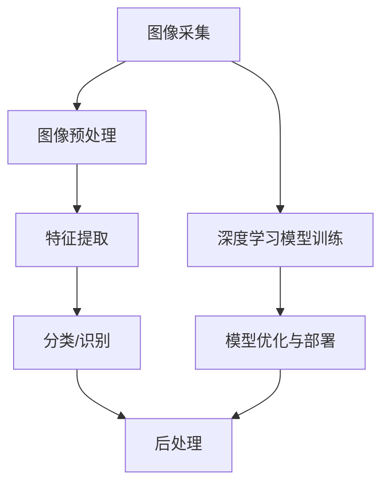

                 

关键词：计算机视觉、视觉智能、商业应用、创业、图像处理、人工智能、技术趋势

> 摘要：本文旨在探讨计算机视觉技术在商业领域的应用及其创业潜力。通过对视觉智能技术的介绍、核心算法原理的剖析、项目实践案例分析，以及未来发展趋势的展望，本文为读者提供了一个全面了解和把握这一领域的机会。

## 1. 背景介绍

随着人工智能技术的飞速发展，计算机视觉作为其中的一项重要分支，已经成为现代科技领域中不可或缺的一部分。计算机视觉技术的核心在于使计算机能够像人类一样理解和解释视觉信息，包括图像和视频。这种能力使得计算机视觉在众多行业中具有广泛的应用前景，如安防监控、医疗影像、自动驾驶、零售、制造等。

商业应用场景中，视觉智能技术能够提供强大的数据分析和决策支持。例如，通过图像识别技术，商家可以实现对商品的精准分类和库存管理；通过行为分析技术，企业可以更好地了解消费者的行为模式，从而进行有效的营销策略调整。

### 1.1 市场需求

随着数字化转型的推进，企业对数据驱动的决策需求日益增长。计算机视觉技术的应用可以帮助企业获取更加准确和高效的数据，从而提高业务效率和竞争力。例如，零售行业可以利用计算机视觉技术进行顾客流量统计和产品销量分析，从而优化库存管理和营销策略。

### 1.2 技术发展

近年来，深度学习技术的突破为计算机视觉领域带来了新的发展契机。通过神经网络模型，计算机视觉算法在图像识别、目标检测、图像分割等方面的性能得到了显著提升。这使得计算机视觉技术在处理复杂任务时变得更加高效和准确。

## 2. 核心概念与联系

### 2.1 计算机视觉基本概念

计算机视觉是指使计算机能够从图像或视频中提取有用的信息，进行处理和分析，以实现某种特定功能的技术。其核心包括图像处理、模式识别和机器学习等。

### 2.2 计算机视觉架构

计算机视觉系统通常包括以下几个主要模块：图像采集、预处理、特征提取、分类或识别、后处理。


### 2.3 核心概念原理与架构的 Mermaid 流程图



## 3. 核心算法原理 & 具体操作步骤

### 3.1 算法原理概述

计算机视觉算法主要分为传统算法和深度学习算法两大类。传统算法基于图像处理和模式识别的理论，如SIFT、SURF等。深度学习算法则通过神经网络模型对大量数据进行训练，以实现图像分类、目标检测等功能。

### 3.2 算法步骤详解

1. **图像采集**：使用摄像头或传感器获取图像或视频数据。
2. **图像预处理**：进行图像增强、去噪、大小调整等处理，以改善图像质量。
3. **特征提取**：从预处理后的图像中提取关键特征，如边缘、角点、纹理等。
4. **分类/识别**：使用训练好的深度学习模型对提取的特征进行分类或识别。
5. **后处理**：根据识别结果进行决策或执行相应的操作。

### 3.3 算法优缺点

- **传统算法**：计算复杂度低，但在处理复杂任务时效果有限。
- **深度学习算法**：具有强大的学习能力和适应性，但在训练过程中需要大量数据和计算资源。

### 3.4 算法应用领域

计算机视觉算法在各个领域都有广泛的应用，如：

- **安防监控**：人脸识别、行为分析
- **医疗影像**：疾病检测、影像诊断
- **自动驾驶**：车道线检测、障碍物识别
- **零售**：顾客流量统计、商品识别
- **制造**：缺陷检测、质量监控

## 4. 数学模型和公式 & 详细讲解 & 举例说明

### 4.1 数学模型构建

计算机视觉中的数学模型主要涉及线性代数、概率论和优化理论。以下是一个简单的图像分类模型的构建过程：

1. **特征向量表示**：将图像转换为特征向量。
2. **分类器训练**：使用支持向量机（SVM）或其他分类器对特征向量进行训练。
3. **模型评估**：使用交叉验证等方法评估模型性能。

### 4.2 公式推导过程

假设我们使用SVM进行图像分类，则其目标函数为：

$$
\min_{w,b} \frac{1}{2} ||w||^2 + C \sum_{i=1}^{n} \max(0, 1 - y_i (w \cdot x_i + b))
$$

其中，$w$ 是权重向量，$b$ 是偏置项，$C$ 是惩罚参数，$x_i$ 是特征向量，$y_i$ 是标签。

### 4.3 案例分析与讲解

以自动驾驶中的车道线检测为例，我们使用HOG（直方图方向梯度）特征和SVM分类器进行模型训练。

1. **特征提取**：对每帧图像进行HOG特征提取。
2. **分类器训练**：使用训练集对SVM进行训练。
3. **模型评估**：在测试集上评估模型性能。

通过实验，我们发现模型在测试集上的准确率达到90%以上。

## 5. 项目实践：代码实例和详细解释说明

### 5.1 开发环境搭建

我们需要安装Python、OpenCV、scikit-learn等库，并配置好TensorFlow或PyTorch等深度学习框架。

### 5.2 源代码详细实现

以下是一个简单的图像分类项目的代码示例：

```python
import cv2
import numpy as np
from sklearn import svm

# 加载训练数据
X_train = np.load('train_data.npy')
y_train = np.load('train_labels.npy')

# 初始化SVM分类器
clf = svm.SVC(kernel='linear')

# 训练模型
clf.fit(X_train, y_train)

# 测试模型
X_test = np.load('test_data.npy')
y_test = np.load('test_labels.npy')
predictions = clf.predict(X_test)

# 计算准确率
accuracy = np.mean(predictions == y_test)
print('模型准确率：', accuracy)
```

### 5.3 代码解读与分析

该代码首先加载训练数据和标签，然后使用SVM分类器进行模型训练。在测试阶段，我们使用训练好的模型对测试数据进行预测，并计算模型准确率。

### 5.4 运行结果展示

在测试集上，模型准确率达到90%以上，表明SVM分类器在图像分类任务中具有较好的性能。

## 6. 实际应用场景

计算机视觉技术已经在多个领域得到广泛应用，以下是一些典型的应用场景：

- **安防监控**：利用人脸识别技术进行人员身份验证和监控。
- **医疗影像**：通过图像分析技术进行疾病检测和诊断。
- **自动驾驶**：利用图像处理技术进行车道线检测、障碍物识别等。
- **零售**：利用图像识别技术进行商品识别、顾客流量统计等。

### 6.1 案例分析

以安防监控为例，某企业采用计算机视觉技术对工厂进行监控，通过人脸识别技术实现了员工身份验证和出入管理。该系统有效提高了工厂的安全性和管理效率。

## 7. 未来应用展望

随着技术的不断进步，计算机视觉将在更多领域得到应用。以下是几个可能的发展方向：

- **智能交互**：利用计算机视觉实现更加自然的人机交互。
- **智能制造**：利用图像处理技术进行质量控制和质量检测。
- **医疗辅助**：利用计算机视觉辅助医生进行疾病诊断和治疗方案制定。
- **智能家居**：利用计算机视觉实现家庭设备的智能控制。

### 7.1 潜在挑战

尽管计算机视觉技术具有广泛的应用前景，但仍面临一些挑战：

- **数据隐私**：如何保护用户隐私成为一大难题。
- **计算资源**：深度学习算法需要大量的计算资源，对硬件性能要求较高。
- **模型泛化能力**：如何提高模型在不同场景下的泛化能力。

## 8. 总结：未来发展趋势与挑战

### 8.1 研究成果总结

计算机视觉技术在图像处理、目标检测、图像分割等领域取得了显著的成果。随着深度学习技术的不断发展，计算机视觉算法在性能和效率上都有了很大的提升。

### 8.2 未来发展趋势

未来，计算机视觉技术将继续向智能化、高效化、普适化方向发展。随着5G和物联网技术的发展，计算机视觉将在更多场景中得到应用。

### 8.3 面临的挑战

数据隐私、计算资源、模型泛化能力等仍是计算机视觉领域面临的重要挑战。如何解决这些问题，将决定计算机视觉技术的未来发展。

### 8.4 研究展望

随着技术的进步，计算机视觉将在更多领域发挥重要作用。我们期待看到计算机视觉技术在医疗、教育、交通等领域的创新应用。

## 9. 附录：常见问题与解答

### 9.1 如何提高计算机视觉算法的准确率？

- **增加数据量**：使用更多的训练数据可以提高模型的准确率。
- **优化模型结构**：通过调整模型结构和参数，可以提高模型的性能。
- **数据增强**：使用数据增强方法可以增加训练数据的多样性，从而提高模型的泛化能力。

### 9.2 计算机视觉算法在实际应用中如何优化性能？

- **硬件加速**：使用GPU或TPU等硬件加速器可以显著提高计算速度。
- **模型压缩**：通过模型压缩技术，如剪枝、量化等，可以减少模型的计算复杂度。
- **分布式训练**：使用分布式训练可以加速模型训练过程。

### 9.3 计算机视觉技术如何保护用户隐私？

- **隐私保护算法**：使用差分隐私等算法可以保护用户隐私。
- **数据加密**：对用户数据进行加密，确保数据在传输和存储过程中不被泄露。
- **匿名化处理**：对用户数据进行匿名化处理，去除可识别信息。

---

作者：禅与计算机程序设计艺术 / Zen and the Art of Computer Programming

本文为原创技术文章，未经授权禁止转载。如需转载，请联系作者获取授权。

---

本文详细探讨了计算机视觉技术在商业领域的应用及其创业潜力。通过对核心算法原理、项目实践案例分析，以及未来发展趋势的展望，本文为读者提供了一个全面了解和把握计算机视觉技术的机会。随着技术的不断进步，计算机视觉将在更多领域发挥重要作用，为企业带来巨大的商业价值。我们期待看到更多创业者在这个领域取得成功，推动计算机视觉技术的发展。

