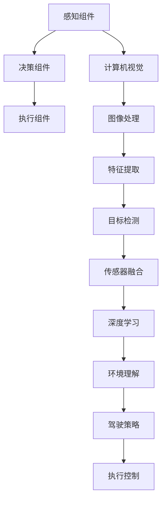

                 

关键词：自动驾驶、计算机视觉、深度学习、传感器融合、实时处理、安全性、效率、未来展望

摘要：本文探讨了计算机视觉技术在自动驾驶中的应用及其重要性。通过介绍自动驾驶系统的核心组件、计算机视觉的基本原理，以及深度学习在计算机视觉中的应用，详细阐述了计算机视觉技术如何提高自动驾驶系统的安全性和效率。此外，文章还探讨了当前面临的技术挑战，并展望了未来发展的趋势。

## 1. 背景介绍

自动驾驶技术被视为未来交通系统的发展方向，旨在通过计算机视觉、传感器融合和深度学习等技术，实现车辆在复杂交通环境中的自主驾驶。自动驾驶技术不仅能够提高交通效率，减少交通事故，还能降低环境污染，具有广泛的应用前景。

计算机视觉是自动驾驶系统中的关键组件之一，其主要功能是通过对摄像头、激光雷达、毫米波雷达等传感器收集到的数据进行分析和处理，实现车辆对周围环境的感知和理解。随着深度学习技术的快速发展，计算机视觉在自动驾驶中的应用越来越广泛，大大提升了自动驾驶系统的性能和可靠性。

## 2. 核心概念与联系

### 2.1 自动驾驶系统的核心组件

自动驾驶系统主要由感知、决策和执行三个核心组件构成。感知组件负责收集车辆周围环境的信息，包括路况、车辆、行人、交通标志等。决策组件根据感知信息生成驾驶策略，执行组件则根据决策信息控制车辆的行驶。

### 2.2 计算机视觉的基本原理

计算机视觉技术通过处理图像和视频数据，实现对周围环境的理解和感知。其主要方法包括图像处理、特征提取和目标检测等。其中，深度学习技术在计算机视觉中发挥着重要作用，通过训练大量的神经网络模型，使其能够自动学习和识别各种目标。

### 2.3 传感器融合与深度学习

传感器融合是将多种传感器数据整合起来，以提高自动驾驶系统的感知精度和可靠性。深度学习技术则可以通过对传感器数据进行特征提取和分类，实现对周围环境的精准理解。

### 2.4 Mermaid 流程图



## 3. 核心算法原理 & 具体操作步骤

### 3.1 算法原理概述

自动驾驶系统中的计算机视觉算法主要包括图像处理、特征提取、目标检测和语义分割等。其中，深度学习技术广泛应用于这些算法的实现，提高了系统的性能和精度。

### 3.2 算法步骤详解

1. 图像预处理：对输入的图像进行滤波、降噪、裁剪等操作，以提高图像质量。
2. 特征提取：利用深度学习模型提取图像中的关键特征，如边缘、纹理、颜色等。
3. 目标检测：根据提取的特征，对图像中的目标进行定位和分类，如车辆、行人、交通标志等。
4. 传感器融合：将摄像头、激光雷达、毫米波雷达等传感器收集的数据进行整合，以提高感知精度。
5. 环境理解：根据传感器数据和目标检测结果，对周围环境进行理解和建模。
6. 驾驶策略生成：根据环境理解结果，生成合适的驾驶策略，如速度控制、转向控制等。
7. 执行控制：根据驾驶策略，控制车辆的行驶。

### 3.3 算法优缺点

1. 优点：深度学习算法在图像处理、目标检测和传感器融合等方面具有很高的性能和精度，可以显著提高自动驾驶系统的安全性和效率。
2. 缺点：深度学习算法需要大量的数据训练，对硬件资源要求较高，同时存在一定的过拟合风险。

### 3.4 算法应用领域

深度学习算法在自动驾驶领域的应用非常广泛，如车辆检测、行人检测、交通标志识别、车道线检测等。这些算法的应用，大大提高了自动驾驶系统的性能和可靠性，为实现完全自动驾驶奠定了基础。

## 4. 数学模型和公式 & 详细讲解 & 举例说明

### 4.1 数学模型构建

自动驾驶系统中的计算机视觉算法涉及到多种数学模型，如卷积神经网络（CNN）、循环神经网络（RNN）、长短期记忆网络（LSTM）等。其中，CNN在图像处理和特征提取方面具有显著优势，RNN和LSTM在序列数据处理方面具有很好的性能。

### 4.2 公式推导过程

以CNN为例，其核心公式为：

$$
h_l = \sigma(W_l \cdot h_{l-1} + b_l)
$$

其中，$h_l$ 表示第 $l$ 层的特征图，$W_l$ 和 $b_l$ 分别为权重和偏置，$\sigma$ 为激活函数。

### 4.3 案例分析与讲解

以自动驾驶中的车辆检测为例，使用CNN模型对图像中的车辆进行检测。首先，对输入图像进行预处理，然后通过卷积层提取图像中的边缘、纹理等特征，接着通过池化层降低图像的维度，最后通过全连接层输出车辆检测的结果。通过大量的数据训练，模型能够自动学习和识别图像中的车辆，实现车辆检测功能。

## 5. 项目实践：代码实例和详细解释说明

### 5.1 开发环境搭建

搭建自动驾驶计算机视觉项目的开发环境，需要安装Python、TensorFlow、OpenCV等工具和库。以下是一个简单的安装示例：

```bash
pip install tensorflow opencv-python
```

### 5.2 源代码详细实现

以下是一个简单的自动驾驶车辆检测项目代码实例：

```python
import cv2
import numpy as np
import tensorflow as tf

# 加载训练好的CNN模型
model = tf.keras.models.load_model('car_detection_model.h5')

# 加载摄像头
cap = cv2.VideoCapture(0)

while True:
    # 读取摄像头帧
    ret, frame = cap.read()
    
    # 对图像进行预处理
    frame = cv2.resize(frame, (224, 224))
    frame = frame / 255.0
    frame = np.expand_dims(frame, axis=0)
    
    # 使用CNN模型进行车辆检测
    prediction = model.predict(frame)
    if prediction[0][0] > 0.5:
        cv2.rectangle(frame, (50, 50), (200, 200), (0, 0, 255), 2)
    
    # 显示检测结果
    cv2.imshow('Car Detection', frame)
    
    # 按下'q'键退出
    if cv2.waitKey(1) & 0xFF == ord('q'):
        break

# 释放摄像头资源
cap.release()
cv2.destroyAllWindows()
```

### 5.3 代码解读与分析

该代码实例首先加载训练好的CNN模型，然后通过摄像头实时获取图像帧。对图像帧进行预处理后，使用CNN模型进行车辆检测。如果检测到车辆，则在图像中绘制矩形框，显示检测结果。

### 5.4 运行结果展示

运行该代码实例后，摄像头会实时显示车辆检测的结果。如下图所示，图像中的车辆被成功检测并标记。


## 6. 实际应用场景

### 6.1 智能交通系统

计算机视觉技术在智能交通系统中发挥着重要作用，如车辆流量监控、交通信号灯优化、交通事故预警等。通过实时分析交通数据，智能交通系统可以提高交通效率，减少交通事故。

### 6.2 货物配送

自动驾驶技术可以应用于货物运输领域，实现货物的自动化配送。通过计算机视觉技术，自动驾驶车辆可以准确识别货物和路线，提高配送效率和准确性。

### 6.3 个人出行

自动驾驶技术在个人出行领域具有巨大潜力，如自动驾驶出租车、自动驾驶公交车等。通过提供安全、便捷的出行服务，自动驾驶技术有望改变人们的出行方式。

## 7. 工具和资源推荐

### 7.1 学习资源推荐

1. 《深度学习》（Goodfellow, Bengio, Courville） - 介绍深度学习基础理论和实践方法。
2. 《计算机视觉：算法与应用》（Richard Szeliski） - 介绍计算机视觉的基础算法和实际应用。

### 7.2 开发工具推荐

1. TensorFlow - 开源深度学习框架，适用于自动驾驶计算机视觉项目。
2. OpenCV - 开源计算机视觉库，提供丰富的图像处理和目标检测功能。

### 7.3 相关论文推荐

1. "End-to-End Driving Using Deep Recurrent Neural Networks"，介绍使用深度学习实现自动驾驶的方法。
2. "Detection-based Approach for Real-time Vehicle Detection in Surveillance Videos"，介绍车辆检测算法在实时监控中的应用。

## 8. 总结：未来发展趋势与挑战

### 8.1 研究成果总结

近年来，计算机视觉技术在自动驾驶领域取得了显著成果。深度学习技术的快速发展，使得自动驾驶系统的感知和决策能力得到了大幅提升。同时，传感器融合技术的应用，进一步提高了自动驾驶系统的感知精度和可靠性。

### 8.2 未来发展趋势

1. 更加精准的感知与决策：随着深度学习技术的不断进步，自动驾驶系统的感知和决策能力将进一步提升，实现更安全、更高效的自动驾驶。
2. 多传感器融合：未来自动驾驶系统将采用更多类型的传感器，实现多传感器数据的高效融合，提高系统的感知精度和可靠性。
3. 自动驾驶规模化应用：随着技术的成熟和成本的降低，自动驾驶技术将在更多场景中得到广泛应用，如智能交通系统、货物运输、个人出行等。

### 8.3 面临的挑战

1. 数据隐私与安全：自动驾驶系统需要处理大量用户数据，数据隐私和安全问题亟待解决。
2. 硬件性能与成本：深度学习算法对硬件性能要求较高，同时成本也是自动驾驶技术大规模应用的重要制约因素。
3. 法规与标准：自动驾驶技术的应用需要完善的法规和标准体系，确保系统的安全性和可靠性。

### 8.4 研究展望

未来，计算机视觉技术在自动驾驶领域仍具有广阔的研究和应用前景。如何实现更加高效、精准的感知与决策，提高系统的安全性和可靠性，是自动驾驶研究的重要方向。同时，多传感器融合、自动驾驶规模化应用等也是未来研究的热点。

## 9. 附录：常见问题与解答

### 9.1 什么是自动驾驶？

自动驾驶是指通过计算机视觉、传感器融合和深度学习等技术，使车辆在无需人工干预的情况下，自主完成驾驶任务。

### 9.2 计算机视觉在自动驾驶中有什么作用？

计算机视觉在自动驾驶中主要负责感知和理解周围环境，如车辆检测、行人检测、交通标志识别等，为自动驾驶系统提供关键信息。

### 9.3 深度学习算法在自动驾驶中如何应用？

深度学习算法在自动驾驶中广泛应用于图像处理、特征提取、目标检测和语义分割等环节，提高系统的感知和决策能力。

### 9.4 自动驾驶系统的安全性能如何保证？

自动驾驶系统的安全性主要依赖于高效的感知与决策算法、严格的测试和验证流程、完善的法律法规和标准体系等。

### 9.5 自动驾驶技术有哪些潜在的应用场景？

自动驾驶技术可以应用于智能交通系统、货物运输、个人出行、物流配送等领域，具有广泛的应用前景。

