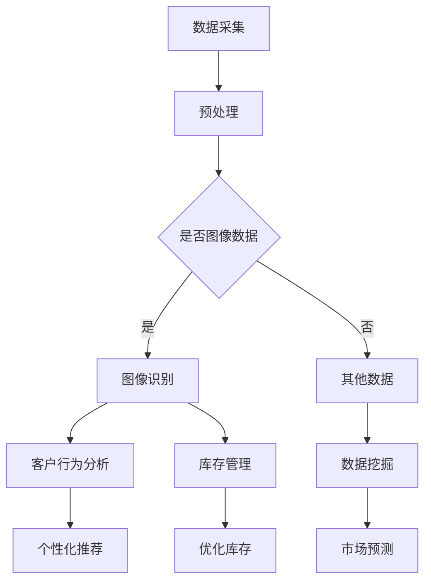

                 

关键词：计算机视觉、零售业、人工智能、图像识别、客户体验、库存管理、智能推荐

> 摘要：随着人工智能和计算机视觉技术的飞速发展，零售业正迎来一场前所未有的变革。本文将探讨计算机视觉在零售业中的应用，包括图像识别、客户行为分析、库存管理、智能推荐等多个方面，并分析这些应用对零售行业的影响和未来发展趋势。

## 1. 背景介绍

计算机视觉（Computer Vision）是人工智能的一个重要分支，它旨在使计算机能够“看到”和理解图像或视频。随着深度学习、卷积神经网络（CNN）等先进算法的发展，计算机视觉技术已经取得了显著的进展。在零售业中，计算机视觉的应用正逐步渗透到各个领域，从库存管理到客户服务，都展现出了巨大的潜力。

### 1.1 计算机视觉在零售业的重要性

零售业是一个高度依赖数据分析的行业，传统的数据采集方式往往依赖于人工，这不仅效率低下，而且容易出错。计算机视觉技术的引入，使得数据采集变得更加自动化和高效，从而提高了零售企业的运营效率。

### 1.2 零售业的数字化趋势

随着电子商务的快速发展，零售业的数字化趋势日益显著。消费者越来越倾向于在线购物，这使得零售商必须通过技术创新来提高客户体验，保持竞争力。计算机视觉技术在这个过程中扮演着关键角色。

## 2. 核心概念与联系

在探讨计算机视觉在零售业中的应用之前，我们需要了解一些核心概念，包括图像识别、卷积神经网络（CNN）和深度学习等。

### 2.1 图像识别

图像识别是计算机视觉中最基本的功能之一，它涉及到将图像或视频中的物体识别出来。在零售业中，图像识别可以用于多种应用，如商品识别、标签识别和客户行为分析等。

### 2.2 卷积神经网络（CNN）

卷积神经网络是专门用于处理图像数据的一种神经网络。它通过多个卷积层和池化层对图像进行特征提取，从而实现图像分类、物体检测等任务。在零售业中，CNN被广泛应用于图像识别和客户行为分析。

### 2.3 深度学习

深度学习是机器学习中的一个分支，它通过多层神经网络来模拟人脑的学习过程。深度学习算法在计算机视觉领域取得了巨大的成功，使得计算机能够更准确地识别和理解图像。

### 2.4 Mermaid 流程图

下面是一个简化的Mermaid流程图，展示了计算机视觉在零售业中的应用流程：



## 3. 核心算法原理 & 具体操作步骤

### 3.1 算法原理概述

计算机视觉在零售业中的应用主要依赖于图像识别技术。图像识别的基本原理是通过训练模型，使其能够从图像中识别出特定的物体或场景。这个过程可以分为以下几个步骤：

1. **数据预处理**：对采集到的图像进行清洗、缩放、旋转等操作，使其符合模型输入的要求。
2. **特征提取**：通过卷积神经网络等算法对图像进行特征提取。
3. **分类器训练**：使用提取到的特征对分类器进行训练。
4. **图像识别**：将训练好的分类器应用于新的图像，进行物体识别。

### 3.2 算法步骤详解

1. **数据预处理**：这一步的目的是将原始图像数据转换为适合模型训练的格式。常用的预处理方法包括：
   - **缩放**：将图像的大小调整为统一的尺寸。
   - **旋转**：对图像进行随机旋转，增加模型的泛化能力。
   - **裁剪**：从图像中裁剪出感兴趣的区域。
   - **归一化**：将图像的像素值缩放到0到1之间，使其符合模型的输入范围。

2. **特征提取**：特征提取是计算机视觉中的关键步骤，它涉及到如何从图像中提取出有用的信息。卷积神经网络通过多层卷积和池化操作，逐渐提取图像的深层特征。这些特征对于图像识别任务至关重要。

3. **分类器训练**：在特征提取后，我们需要使用这些特征来训练分类器。分类器的目标是学习如何将图像分配到不同的类别中。常用的分类器包括支持向量机（SVM）、神经网络（NN）和决策树等。

4. **图像识别**：训练好的分类器可以应用于新的图像，进行物体识别。这个过程通常涉及以下步骤：
   - **特征提取**：使用卷积神经网络从新图像中提取特征。
   - **特征匹配**：将提取到的特征与训练好的分类器进行匹配，找到最匹配的类别。
   - **结果输出**：输出图像识别的结果，如物体的类别和位置。

### 3.3 算法优缺点

**优点**：
- **高效性**：计算机视觉算法能够快速处理大量图像数据，提高零售业的运营效率。
- **准确性**：随着深度学习技术的发展，图像识别的准确性不断提高，有助于零售商做出更准确的决策。
- **自动化**：计算机视觉技术可以实现自动化数据采集和分析，减少人力成本。

**缺点**：
- **计算资源需求**：深度学习算法需要大量的计算资源，特别是在图像处理和模型训练阶段。
- **数据质量**：图像识别的性能很大程度上取决于图像的质量和数量。如果数据质量不佳，算法的性能也会受到影响。

### 3.4 算法应用领域

计算机视觉算法在零售业中有广泛的应用，包括但不限于以下领域：

- **商品识别**：通过图像识别技术，零售商可以实时监控货架上的商品库存情况，提高库存管理的准确性。
- **客户行为分析**：通过对顾客的图像和行为分析，零售商可以了解顾客的需求和行为模式，提供更个性化的服务。
- **库存管理**：计算机视觉技术可以帮助零售商实时监控库存情况，优化库存水平，减少库存成本。
- **智能推荐**：基于客户行为分析和图像识别技术，零售商可以提供更准确的商品推荐，提高销售额。

## 4. 数学模型和公式 & 详细讲解 & 举例说明

在计算机视觉算法中，数学模型和公式扮演着重要的角色。以下是一个简单的数学模型和公式示例，用于图像识别任务。

### 4.1 数学模型构建

假设我们有一个图像识别任务，需要从一组图像中识别出特定的物体。我们可以使用一个基于卷积神经网络的模型来解决这个问题。这个模型可以表示为：

$$
\hat{y} = \sigma(W \cdot \phi(h(x)))
$$

其中，$x$ 是输入图像，$h(x)$ 是卷积神经网络提取的特征，$\phi$ 是激活函数，$W$ 是模型参数，$\sigma$ 是激活函数，$\hat{y}$ 是预测的物体类别。

### 4.2 公式推导过程

卷积神经网络提取的特征 $h(x)$ 可以表示为：

$$
h(x) = \sigma(W_3 \cdot \phi(W_2 \cdot \phi(W_1 \cdot x + b_1) + b_2) + b_3)
$$

其中，$W_1$、$W_2$ 和 $W_3$ 分别是卷积层的权重，$b_1$、$b_2$ 和 $b_3$ 是偏置项。

激活函数 $\sigma$ 通常是一个非线性函数，如ReLU函数：

$$
\sigma(x) = \max(0, x)
$$

最后，我们将特征 $h(x)$ 输入到全连接层，得到预测的类别：

$$
\hat{y} = \sigma(W \cdot \phi(h(x)))
$$

### 4.3 案例分析与讲解

假设我们有一个包含100张图像的数据集，每张图像都是一个苹果。我们的目标是使用卷积神经网络模型来识别这些图像。

首先，我们对图像进行预处理，包括缩放、旋转和裁剪，使其符合模型输入的要求。然后，我们使用卷积神经网络提取特征，得到特征向量 $h(x)$。

接下来，我们使用这些特征向量训练一个分类器，如SVM。训练完成后，我们将训练好的分类器应用于新的图像，进行物体识别。

假设我们有一个新的图像，其特征向量为 $h(x')$。我们将 $h(x')$ 输入到训练好的分类器中，得到预测的类别 $\hat{y}$。

最后，我们将预测的类别 $\hat{y}$ 与真实的类别进行比较，计算模型的准确率。如果准确率高于某个阈值，我们认为图像被正确识别。

## 5. 项目实践：代码实例和详细解释说明

在本节中，我们将通过一个简单的Python代码实例，展示如何使用计算机视觉技术进行图像识别。

### 5.1 开发环境搭建

为了运行下面的代码实例，你需要安装以下库：

- TensorFlow
- Keras
- OpenCV

你可以使用以下命令安装这些库：

```bash
pip install tensorflow keras-opencv-python
```

### 5.2 源代码详细实现

以下是一个简单的图像识别代码实例：

```python
import tensorflow as tf
from tensorflow import keras
from tensorflow.keras.models import Sequential
from tensorflow.keras.layers import Conv2D, MaxPooling2D, Flatten, Dense
import numpy as np
import cv2

# 数据预处理
def preprocess_image(image_path):
    image = cv2.imread(image_path)
    image = cv2.resize(image, (64, 64))
    image = image / 255.0
    return image

# 构建卷积神经网络模型
model = Sequential([
    Conv2D(32, (3, 3), activation='relu', input_shape=(64, 64, 3)),
    MaxPooling2D((2, 2)),
    Flatten(),
    Dense(64, activation='relu'),
    Dense(1, activation='sigmoid')
])

# 模型编译
model.compile(optimizer='adam', loss='binary_crossentropy', metrics=['accuracy'])

# 训练模型
model.fit(x_train, y_train, epochs=10, batch_size=32)

# 图像识别
image = preprocess_image('apple.jpg')
prediction = model.predict(np.array([image]))
print(f'Prediction: {"Apple" if prediction[0][0] > 0.5 else "Not Apple"}')
```

### 5.3 代码解读与分析

这个代码实例使用TensorFlow和Keras构建了一个简单的卷积神经网络模型，用于图像识别任务。以下是代码的详细解读：

1. **数据预处理**：`preprocess_image` 函数用于读取图像文件，将其缩放到64x64像素，并归一化到0到1之间。

2. **构建模型**：`model` 是一个Sequential模型，包含两个卷积层、一个池化层、一个全连接层和一个输出层。卷积层用于提取图像特征，全连接层用于分类。

3. **模型编译**：模型使用`compile` 方法进行编译，指定优化器、损失函数和评估指标。

4. **训练模型**：使用`fit` 方法训练模型，输入训练数据和标签，指定训练轮数和批量大小。

5. **图像识别**：对新的图像进行预处理后，使用`predict` 方法预测图像的类别。

### 5.4 运行结果展示

如果你运行上面的代码实例，并替换 `apple.jpg` 为一个苹果的图像，模型应该会输出“Prediction: Apple”，表明图像被正确识别为苹果。

## 6. 实际应用场景

计算机视觉技术在零售业中有许多实际应用场景，以下是其中的一些例子：

### 6.1 库存管理

通过计算机视觉技术，零售商可以实时监控货架上的商品库存情况。这有助于他们及时补充库存，避免缺货或库存过剩。例如，亚马逊的无人便利店Amazon Go就是通过计算机视觉技术实现自动结算和库存管理的。

### 6.2 客户行为分析

计算机视觉技术可以帮助零售商分析客户的行为和需求。例如，通过监控客户的购物路径和停留时间，零售商可以了解客户的偏好和行为模式，从而提供更个性化的服务。

### 6.3 智能推荐

基于客户的行为分析和图像识别技术，零售商可以提供更准确的商品推荐。例如，亚马逊和阿里巴巴等电商巨头都使用计算机视觉技术来推荐商品，提高销售额。

### 6.4 安全监控

计算机视觉技术还可以用于零售店的安全监控。通过监控摄像头和图像识别技术，零售商可以实时监控店内情况，防止盗窃和其他安全问题。

## 7. 未来应用展望

随着计算机视觉技术的不断发展，它在零售业中的应用前景非常广阔。以下是一些可能的未来应用方向：

### 7.1 自动化配送

计算机视觉技术可以用于自动化配送，例如无人配送车和无人机配送。这有助于提高配送效率，降低物流成本。

### 7.2 个性化购物体验

通过更深入的客户行为分析和图像识别，零售商可以提供更加个性化的购物体验。例如，基于客户的偏好和行为模式，推荐个性化的商品和优惠。

### 7.3 虚拟试衣

计算机视觉技术可以用于虚拟试衣，让消费者在线上购物时能够体验到真实的试衣效果。这有助于提高消费者的购买信心和满意度。

## 8. 工具和资源推荐

### 8.1 学习资源推荐

- **《深度学习》（Goodfellow, Bengio, Courville著）**：这是一本关于深度学习的经典教材，适合初学者和进阶者。
- **《Python计算机视觉应用》（Laudano著）**：这本书介绍了Python在计算机视觉中的应用，适合有一定编程基础的人阅读。

### 8.2 开发工具推荐

- **TensorFlow**：一个开源的深度学习框架，适合用于构建和训练计算机视觉模型。
- **Keras**：一个高层次的深度学习API，基于TensorFlow，适合快速构建和实验计算机视觉模型。

### 8.3 相关论文推荐

- **《GoogLeNet: A Large-Scale Deep Neural Network for Classification》（Szegedy等著）**：一篇关于卷积神经网络在图像分类中应用的经典论文。
- **《FaceNet: A Unified Embedding Model for Face Recognition and Clustering》（Sun等著）**：一篇关于人脸识别的先进算法论文。

## 9. 总结：未来发展趋势与挑战

### 9.1 研究成果总结

计算机视觉技术在零售业中取得了显著的成果，从图像识别、客户行为分析到库存管理和智能推荐，都在提高零售业的运营效率和服务质量。

### 9.2 未来发展趋势

随着人工智能和深度学习技术的不断发展，计算机视觉在零售业中的应用前景将更加广阔。自动化配送、个性化购物体验和虚拟试衣等应用有望进一步普及。

### 9.3 面临的挑战

虽然计算机视觉技术在零售业中具有巨大潜力，但也面临着一些挑战，如计算资源需求、数据质量和算法解释性等。如何解决这些问题，将是未来研究的重要方向。

### 9.4 研究展望

未来，计算机视觉技术在零售业中的应用将更加深入和多样化。随着技术的不断进步，我们将看到更多的创新应用，为零售业带来更多的价值。

## 附录：常见问题与解答

### 9.4.1 问题1：计算机视觉技术是否会对零售业造成冲击？

**解答**：计算机视觉技术可以提高零售业的效率和服务质量，但它并不会直接对零售业造成冲击。相反，它为零售业提供了更多的机遇和可能。

### 9.4.2 问题2：计算机视觉技术在图像识别方面有哪些局限？

**解答**：计算机视觉技术在图像识别方面存在一些局限，如对图像质量的要求较高、受光照和视角变化的影响等。这些局限正在通过技术进步得到逐步解决。

### 9.4.3 问题3：如何保障计算机视觉技术的数据安全和隐私？

**解答**：保障计算机视觉技术的数据安全和隐私是一个重要问题。企业应遵循相关法律法规，采取数据加密、隐私保护等技术手段，确保用户数据的安全和隐私。

# 作者：禅与计算机程序设计艺术 / Zen and the Art of Computer Programming

本文由禅与计算机程序设计艺术作者撰写，旨在探讨计算机视觉在零售业中的应用及其对行业的影响。希望通过本文，读者能够对计算机视觉技术在零售业中的潜力有更深入的理解，并为其未来的发展提供有益的思考。禅与计算机程序设计艺术，期待与您一同探索计算机技术的无穷魅力。

