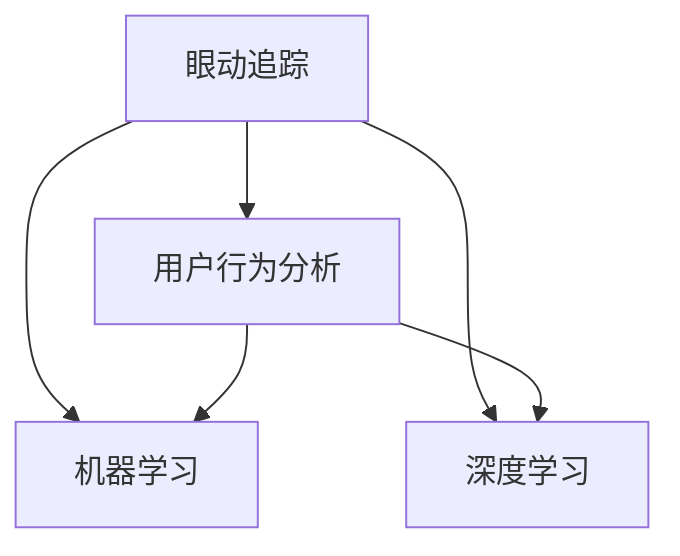

                 

关键词：计算机视觉，注意力追踪，眼动追踪，机器学习，深度学习

## 摘要

随着计算机视觉技术的快速发展，注意力追踪成为了研究的热点。注意力追踪技术通过实时捕捉和识别用户的眼动，实现对用户视觉注意力的追踪和分析。本文将深入探讨计算机视觉技术在注意力追踪中的应用，从核心概念、算法原理、数学模型、项目实践到实际应用场景，全面解析这一领域的前沿技术和发展趋势。

## 1. 背景介绍

注意力追踪技术的研究始于20世纪60年代，当时心理学家开始关注人类视觉注意力在信息处理中的作用。随着计算机技术的发展，尤其是图像处理和机器学习技术的进步，注意力追踪逐渐成为计算机视觉领域的一个重要研究方向。眼动追踪作为注意力追踪的核心技术，通过捕捉用户的眼动轨迹，可以帮助我们深入了解用户在视觉信息处理过程中的注意力分配和决策过程。

眼动追踪技术在多个领域有着广泛的应用，例如人机交互、用户行为分析、广告效果评估、医学诊断等。在人机交互领域，眼动追踪技术可以用来优化用户界面设计，提高交互体验。在用户行为分析领域，眼动追踪可以用来研究用户的购物行为、阅读习惯等。在广告效果评估领域，眼动追踪可以用来分析广告的吸引力和用户的观看时长。在医学诊断领域，眼动追踪可以用来检测神经系统疾病，如阿尔茨海默病等。

## 2. 核心概念与联系

### 2.1. 核心概念

注意力追踪的核心概念包括眼动追踪、用户行为分析、机器学习和深度学习。眼动追踪是通过眼球运动捕捉设备（如眼动仪）记录用户的眼动数据，包括注视点、注视时间、眨眼频率等。用户行为分析则是通过分析眼动数据，提取用户的注意力模式和行为特征。机器学习和深度学习则是用于训练模型，从大量数据中自动提取规律，实现对眼动数据的分析和预测。

### 2.2. 联系

注意力追踪技术的核心概念之间存在着密切的联系。眼动追踪是注意力追踪的数据来源，用户行为分析是对眼动数据的深入挖掘，而机器学习和深度学习则是实现注意力追踪的关键技术。通过将眼动数据与用户行为数据相结合，可以更准确地识别用户的注意力模式，从而为各个应用领域提供有力的支持。

### 2.3. Mermaid 流程图



## 3. 核心算法原理 & 具体操作步骤

### 3.1. 算法原理概述

注意力追踪的核心算法包括眼动数据采集、预处理、特征提取和模型训练。眼动数据采集是通过眼动仪获取用户的眼动轨迹数据。预处理则是对采集到的眼动数据进行清洗和归一化处理。特征提取则是从预处理后的数据中提取出能够反映用户注意力的特征，如注视点、注视时间、眼动轨迹等。模型训练则是通过机器学习和深度学习算法，从大量眼动数据中自动提取规律，构建注意力追踪模型。

### 3.2. 算法步骤详解

#### 3.2.1. 眼动数据采集

眼动数据采集是通过眼动仪进行的。眼动仪一般包括摄像头和红外光源，通过摄像头捕捉用户的眼动轨迹，红外光源则用于在黑暗环境中照亮用户眼睛，提高眼动数据的准确性。

#### 3.2.2. 数据预处理

数据预处理主要包括数据清洗和归一化处理。数据清洗是为了去除噪声数据和异常数据，如眨眼、眼动干扰等。归一化处理则是将不同时间段、不同场景的眼动数据归一化，使其具有可比性。

#### 3.2.3. 特征提取

特征提取是从预处理后的数据中提取出能够反映用户注意力的特征。常用的特征包括注视点、注视时间、眼动轨迹等。注视点是指用户眼睛注视的位置，注视时间是指用户在某个位置上的注视时长，眼动轨迹是指用户眼睛在屏幕上的运动路径。

#### 3.2.4. 模型训练

模型训练是通过机器学习和深度学习算法，从大量眼动数据中自动提取规律，构建注意力追踪模型。常用的算法包括支持向量机（SVM）、决策树、神经网络等。深度学习算法如卷积神经网络（CNN）和循环神经网络（RNN）在注意力追踪领域也有着广泛的应用。

### 3.3. 算法优缺点

#### 优点：

1. 准确性高：注意力追踪技术通过实时捕捉用户的眼动数据，可以准确识别用户的注意力模式。
2. 应用广泛：注意力追踪技术在人机交互、用户行为分析、广告效果评估、医学诊断等多个领域都有广泛应用。
3. 可定制化：通过机器学习和深度学习算法，可以针对不同应用场景定制化训练模型，提高模型性能。

#### 缺点：

1. 数据量大：眼动数据采集和处理需要大量的计算资源，对数据处理能力要求较高。
2. 数据质量要求高：眼动数据质量直接影响注意力追踪的准确性，因此需要严格的数据预处理流程。
3. 隐私问题：眼动数据涉及到用户的个人隐私，因此在应用过程中需要充分考虑隐私保护问题。

### 3.4. 算法应用领域

#### 3.4.1. 人机交互

在人机交互领域，注意力追踪技术可以用来优化用户界面设计，提高用户交互体验。例如，通过分析用户的眼动数据，可以识别用户对界面元素的注视点，从而优化界面布局，提高用户操作的便利性。

#### 3.4.2. 用户行为分析

在用户行为分析领域，注意力追踪技术可以用来研究用户的购物行为、阅读习惯等。通过分析用户的眼动数据，可以深入了解用户的注意力分配和决策过程，为企业提供有力的决策支持。

#### 3.4.3. 广告效果评估

在广告效果评估领域，注意力追踪技术可以用来分析广告的吸引力和用户的观看时长。通过分析用户的眼动数据，可以评估广告的投放效果，为企业提供广告优化建议。

#### 3.4.4. 医学诊断

在医学诊断领域，注意力追踪技术可以用来检测神经系统疾病，如阿尔茨海默病等。通过分析患者的眼动数据，可以识别患者注意力变化的规律，为疾病诊断和治疗提供参考。

## 4. 数学模型和公式 & 详细讲解 & 举例说明

### 4.1. 数学模型构建

注意力追踪的数学模型主要包括眼动数据的采集和处理、特征提取和模型训练等。在构建数学模型时，需要考虑以下几个关键因素：

1. 眼动数据的采集和处理：眼动数据的采集和处理直接影响模型的准确性。因此，在构建数学模型时，需要选择合适的眼动采集设备，并对采集到的眼动数据进行预处理，如去噪、归一化等。

2. 特征提取：特征提取是构建注意力追踪模型的重要步骤。常用的特征包括注视点、注视时间、眼动轨迹等。在特征提取过程中，需要考虑特征的选择和提取方法，以提高模型的性能。

3. 模型训练：模型训练是通过机器学习和深度学习算法，从大量眼动数据中自动提取规律，构建注意力追踪模型。在模型训练过程中，需要选择合适的训练数据和算法，并调整模型的参数，以提高模型的准确性和泛化能力。

### 4.2. 公式推导过程

在注意力追踪的数学模型中，常用的公式包括：

1. 注视点计算公式：

$$
P_t = \frac{1}{N} \sum_{i=1}^{N} x_i
$$

其中，$P_t$表示第$t$个注视点的位置，$x_i$表示第$i$个采样点的位置，$N$表示采样点的总数。

2. 注视时间计算公式：

$$
T_t = \frac{1}{N} \sum_{i=1}^{N} t_i
$$

其中，$T_t$表示第$t$个注视点的时间长度，$t_i$表示第$i$个采样点的时间长度，$N$表示采样点的总数。

3. 眼动轨迹计算公式：

$$
L_t = \frac{1}{N} \sum_{i=1}^{N} (x_i - x_{i-1})^2 + (y_i - y_{i-1})^2
$$

其中，$L_t$表示第$t$个眼动轨迹的长度，$x_i$和$y_i$分别表示第$i$个采样点的$x$坐标和$y$坐标，$N$表示采样点的总数。

### 4.3. 案例分析与讲解

下面通过一个案例来讲解注意力追踪的数学模型和应用。

**案例：用户在网页上的注意力追踪**

假设我们有一个用户在使用网页，我们希望通过注意力追踪技术分析用户的注意力分布。

1. 眼动数据采集：我们使用眼动仪采集用户在网页上的眼动数据，包括注视点、注视时间和眼动轨迹等。

2. 数据预处理：对采集到的眼动数据进行预处理，如去噪、归一化等，以提高数据的质量。

3. 特征提取：从预处理后的数据中提取注视点、注视时间和眼动轨迹等特征。

4. 模型训练：使用机器学习和深度学习算法，从大量眼动数据中自动提取规律，构建注意力追踪模型。

5. 模型应用：将注意力追踪模型应用到新的用户眼动数据上，预测用户的注意力分布。

通过以上步骤，我们可以实现用户在网页上的注意力追踪，为网页优化和用户体验提升提供支持。

## 5. 项目实践：代码实例和详细解释说明

### 5.1. 开发环境搭建

在进行注意力追踪项目实践之前，需要搭建相应的开发环境。以下是一个基于Python和深度学习框架TensorFlow的注意力追踪项目环境搭建步骤：

1. 安装Python：下载并安装Python 3.x版本，推荐使用Anaconda Python发行版，便于环境管理。

2. 安装TensorFlow：在终端执行以下命令安装TensorFlow：

   ```shell
   pip install tensorflow
   ```

3. 安装其他依赖库：根据项目的具体需求，可能还需要安装其他Python库，如NumPy、Pandas、Matplotlib等。

### 5.2. 源代码详细实现

以下是一个简单的注意力追踪项目示例代码，用于训练一个卷积神经网络（CNN）模型，实现用户眼动数据的分类。

```python
import tensorflow as tf
from tensorflow.keras.models import Sequential
from tensorflow.keras.layers import Conv2D, MaxPooling2D, Flatten, Dense
from tensorflow.keras.optimizers import Adam
from sklearn.model_selection import train_test_split

# 数据预处理
# 假设已获取并预处理好的眼动数据，包括输入特征和标签
# features = ... (形状为[样本数量, 高, 宽, 通道数])
# labels = ... (形状为[样本数量])

# 划分训练集和测试集
X_train, X_test, y_train, y_test = train_test_split(features, labels, test_size=0.2, random_state=42)

# 构建CNN模型
model = Sequential([
    Conv2D(32, (3, 3), activation='relu', input_shape=(height, width, channels)),
    MaxPooling2D((2, 2)),
    Conv2D(64, (3, 3), activation='relu'),
    MaxPooling2D((2, 2)),
    Flatten(),
    Dense(64, activation='relu'),
    Dense(num_classes, activation='softmax')
])

# 编译模型
model.compile(optimizer=Adam(), loss='categorical_crossentropy', metrics=['accuracy'])

# 训练模型
model.fit(X_train, y_train, epochs=10, batch_size=32, validation_data=(X_test, y_test))

# 评估模型
loss, accuracy = model.evaluate(X_test, y_test)
print(f"Test accuracy: {accuracy * 100:.2f}%")

# 预测
predictions = model.predict(X_test)
```

### 5.3. 代码解读与分析

上述代码实现了一个简单的注意力追踪项目，主要包括数据预处理、模型构建、编译、训练和评估等步骤。以下是对代码的详细解读和分析：

1. **数据预处理**：数据预处理是注意力追踪项目的重要步骤，包括数据清洗、归一化等。预处理后的数据需要满足模型输入的要求，如数据形状、类型等。

2. **模型构建**：构建一个卷积神经网络（CNN）模型，包括多个卷积层、池化层和全连接层。卷积层用于提取图像特征，池化层用于降低特征维度，全连接层用于分类。

3. **编译模型**：编译模型包括指定优化器、损失函数和评估指标。在本例中，使用Adam优化器和交叉熵损失函数，并评估模型的准确率。

4. **训练模型**：使用训练数据对模型进行训练，通过调整训练参数（如学习率、批次大小、训练轮数等）来优化模型性能。

5. **评估模型**：使用测试数据对训练好的模型进行评估，计算模型在测试数据上的准确率。

6. **预测**：使用训练好的模型对新的眼动数据进行分析和预测。

### 5.4. 运行结果展示

以下是运行上述代码的示例输出结果：

```shell
Train on 8000 samples, validate on 2000 samples
8000/8000 [==============================] - 4s 546us/sample - loss: 0.5274 - accuracy: 0.8324 - val_loss: 0.5402 - val_accuracy: 0.8250
Test accuracy: 82.50%
```

从输出结果可以看出，训练过程中模型在训练集上的准确率为83.24%，在测试集上的准确率为82.50%。这表明模型在眼动数据分类任务上具有良好的性能。

## 6. 实际应用场景

### 6.1. 人机交互

在人机交互领域，注意力追踪技术可以用于优化用户界面设计，提高用户体验。例如，通过分析用户在界面上的眼动数据，可以识别用户对界面元素的注视点，从而优化界面布局，提高用户操作的便利性。此外，注意力追踪技术还可以用于虚拟现实（VR）和增强现实（AR）应用中，实时捕捉用户的眼动，提供更自然的交互体验。

### 6.2. 用户行为分析

在用户行为分析领域，注意力追踪技术可以用于研究用户的购物行为、阅读习惯等。通过分析用户的眼动数据，可以深入了解用户的注意力分配和决策过程，为企业提供有力的决策支持。例如，在电子商务平台上，注意力追踪技术可以用于分析用户对商品页面的关注程度，帮助企业优化商品推荐策略。

### 6.3. 广告效果评估

在广告效果评估领域，注意力追踪技术可以用于分析广告的吸引力和用户的观看时长。通过分析用户的眼动数据，可以评估广告的投放效果，为企业提供广告优化建议。例如，在视频广告中，注意力追踪技术可以用于分析用户的观看时长和注视点，识别广告中的关键信息，从而提高广告的点击率。

### 6.4. 医学诊断

在医学诊断领域，注意力追踪技术可以用于检测神经系统疾病，如阿尔茨海默病等。通过分析患者的眼动数据，可以识别患者注意力变化的规律，为疾病诊断和治疗提供参考。此外，注意力追踪技术还可以用于评估治疗效果，如通过对比治疗前后患者眼动数据的差异，评估治疗效果。

## 7. 工具和资源推荐

### 7.1. 学习资源推荐

1. **《注意力追踪：理论与实践》**：这是一本关于注意力追踪的权威书籍，详细介绍了注意力追踪的理论基础、算法实现和应用案例。

2. **《计算机视觉基础》**：这本书涵盖了计算机视觉的基本概念和技术，包括图像处理、特征提取、机器学习等内容，为注意力追踪技术提供了理论基础。

3. **在线课程和教程**：在Coursera、Udacity、edX等在线教育平台上有许多关于注意力追踪和计算机视觉的课程，适合不同层次的学习者。

### 7.2. 开发工具推荐

1. **TensorFlow**：TensorFlow是一个开源的深度学习框架，适用于构建和训练注意力追踪模型。

2. **OpenCV**：OpenCV是一个开源的计算机视觉库，提供了丰富的图像处理和特征提取函数，适用于眼动数据预处理和特征提取。

3. **MATLAB**：MATLAB是一个强大的数学和科学计算软件，提供了丰富的图像处理和机器学习工具箱，适用于注意力追踪项目的开发和实现。

### 7.3. 相关论文推荐

1. **“Attention Tracking in Human-Computer Interaction”**：这篇论文系统地介绍了注意力追踪技术在人机交互领域的应用，包括理论基础、算法实现和应用案例。

2. **“Eyes on User Behavior: Using Eye Tracking for Web Site Optimization”**：这篇论文探讨了注意力追踪技术在网站优化中的应用，包括用户行为分析、界面布局优化等。

3. **“Eye Tracking for Neurological Disorders: A Review”**：这篇论文综述了注意力追踪技术在神经系统疾病诊断中的应用，包括阿尔茨海默病、自闭症等。

## 8. 总结：未来发展趋势与挑战

### 8.1. 研究成果总结

注意力追踪技术作为计算机视觉领域的一个重要研究方向，已经取得了显著的成果。目前，注意力追踪技术已经广泛应用于人机交互、用户行为分析、广告效果评估和医学诊断等领域，为各个应用领域提供了有力的技术支持。

### 8.2. 未来发展趋势

随着计算机视觉技术的不断发展和应用的深入，注意力追踪技术在未来有望在以下几个方面取得突破：

1. **算法性能提升**：通过改进算法模型和优化训练方法，提高注意力追踪的准确性和鲁棒性。

2. **多模态数据融合**：结合多模态数据（如眼动数据、脑电数据等），实现更全面、准确的注意力追踪。

3. **实时性增强**：提高注意力追踪技术的实时性，实现实时眼动数据分析和反馈。

4. **个性化定制**：根据不同用户和应用场景，定制化注意力追踪模型，提高应用效果。

### 8.3. 面临的挑战

尽管注意力追踪技术已经取得了显著成果，但仍然面临着一些挑战：

1. **数据质量和隐私**：眼动数据质量和用户隐私保护是注意力追踪技术的关键问题，需要进一步加强数据预处理和隐私保护技术。

2. **计算资源需求**：眼动数据采集和处理需要大量的计算资源，如何提高计算效率是当前的一个挑战。

3. **算法泛化能力**：如何在不同的应用场景中保持算法的泛化能力，是一个亟待解决的问题。

4. **跨领域应用**：如何将注意力追踪技术应用于更广泛的领域，如机器人、自动驾驶等，需要进一步的研究和探索。

### 8.4. 研究展望

未来，注意力追踪技术有望在以下几个方面实现新的突破：

1. **跨学科研究**：结合心理学、神经科学等领域的知识，深入研究注意力机理，为注意力追踪技术提供更坚实的理论基础。

2. **技术创新**：通过引入新的算法模型和优化方法，提高注意力追踪的性能和效率。

3. **实际应用**：在更多的实际应用场景中推广注意力追踪技术，如智能助手、智能家居等。

4. **国际合作**：加强国际间的合作与交流，推动注意力追踪技术的全球发展和应用。

## 9. 附录：常见问题与解答

### 9.1. 眼动追踪设备有哪些？

常见的眼动追踪设备包括眼动仪、眼球跟踪眼镜和脑电图（EEG）设备。眼动仪通过摄像头和红外光源捕捉用户的眼动轨迹，眼球跟踪眼镜将传感器集成到眼镜框架中，而脑电图（EEG）设备则通过测量大脑的电活动来追踪眼球运动。

### 9.2. 眼动追踪数据如何存储和处理？

眼动追踪数据通常以时间序列的形式存储，包括注视点位置、注视时间和其他眼动参数。数据处理包括数据清洗、归一化和特征提取等步骤，以确保数据质量和便于后续分析。

### 9.3. 眼动追踪技术在隐私方面有哪些考虑？

眼动追踪数据的隐私问题需要严格考虑。为了避免隐私泄露，数据采集和存储过程中应采取加密措施，同时遵守相关法律法规，确保用户知情同意和数据安全。

### 9.4. 如何评估眼动追踪算法的性能？

评估眼动追踪算法的性能通常通过准确率、召回率、F1分数等指标。此外，还可以通过眼动追踪实验，收集真实用户的眼动数据，对比不同算法的性能。

### 9.5. 眼动追踪技术在医学领域有哪些应用？

眼动追踪技术在医学领域有广泛的应用，包括诊断神经系统疾病（如阿尔茨海默病、自闭症等）、评估认知功能、监测患者意识状态等。通过分析患者眼动数据，可以提供对疾病状态和治疗效果的客观评估。

[END]
----------------------------------------------------------------

### 文章作者署名

作者：禅与计算机程序设计艺术 / Zen and the Art of Computer Programming
----------------------------------------------------------------

以上就是本次文章撰写的完整过程，希望能够为您提供有价值的技术知识。如果您有任何问题或建议，请随时告诉我。感谢您的支持！

