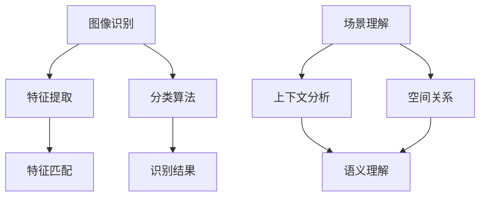

                 

关键词：计算机视觉、图像识别、场景理解、人工智能、深度学习、机器学习、算法原理、应用领域

## 摘要

本文将深入探讨计算机视觉领域，从基础图像识别到高级场景理解的技术发展历程。我们将首先回顾计算机视觉的背景知识，然后详细解析图像识别和场景理解的核心算法原理，包括其数学模型和具体操作步骤。随后，通过实际项目实践中的代码实例，展示如何将理论应用于实际中。文章还将讨论计算机视觉在实际应用场景中的表现，并展望其未来的发展趋势和挑战。

## 1. 背景介绍

计算机视觉是一门利用计算机和算法来理解和解释数字图像或视频的技术。它源于20世纪60年代，随着计算机硬件和算法的进步，逐渐成为一个独立的学科。早期的计算机视觉主要集中在图像识别和图像处理，例如边缘检测、图像分割等。随着深度学习和大数据技术的发展，计算机视觉的应用领域得到了极大的拓展，包括人脸识别、自动驾驶、医疗影像分析等。

图像识别是计算机视觉中的基础任务，旨在通过算法识别图像中的物体、场景或动作。场景理解则进一步将图像识别提升到语义层面，能够理解图像中的复杂结构和意义。

## 2. 核心概念与联系

计算机视觉的核心概念包括图像识别和场景理解。图像识别关注如何从图像中提取特征，并分类出特定的物体或场景。场景理解则在此基础上，通过上下文和空间关系分析，理解图像的整体意义。


### Mermaid 流程图



## 3. 核心算法原理 & 具体操作步骤

### 3.1 算法原理概述

计算机视觉中的核心算法主要包括卷积神经网络（CNN）、循环神经网络（RNN）和生成对抗网络（GAN）等。CNN适用于图像识别和特征提取，通过多层卷积和池化操作提取图像特征。RNN适用于序列数据，如视频中的动作识别，通过时间步长的特征关联性进行语义理解。GAN则擅长生成和模仿真实数据，用于图像生成和增强。

### 3.2 算法步骤详解

1. **图像识别（CNN）**：
   - **输入层**：接收图像数据。
   - **卷积层**：通过卷积核提取图像特征。
   - **池化层**：降低特征图的维度。
   - **全连接层**：将特征映射到分类结果。
   - **输出层**：输出识别结果。

2. **场景理解（RNN）**：
   - **嵌入层**：将图像特征嵌入到高维空间。
   - **RNN层**：处理时间序列数据，如视频帧。
   - **全连接层**：进行分类或回归。

3. **图像生成（GAN）**：
   - **生成器**：从随机噪声生成图像。
   - **判别器**：判断图像是真实还是生成。
   - **对抗训练**：生成器和判别器互相竞争，提高生成图像的真实度。

### 3.3 算法优缺点

- **CNN**：强大的特征提取能力，适用于图像识别任务。但计算量大，训练时间较长。
- **RNN**：适用于序列数据，能够捕捉时间依赖性。但容易出现梯度消失或爆炸问题。
- **GAN**：强大的图像生成能力，适用于图像增强和生成任务。但训练过程不稳定，需要大量数据和高计算资源。

### 3.4 算法应用领域

- **图像识别**：人脸识别、物体检测、图像分类。
- **场景理解**：自动驾驶、视频监控、医疗影像分析。
- **图像生成**：图像修复、风格迁移、图像增强。

## 4. 数学模型和公式 & 详细讲解 & 举例说明

### 4.1 数学模型构建

计算机视觉中的数学模型主要包括卷积神经网络（CNN）、循环神经网络（RNN）和生成对抗网络（GAN）等。

- **CNN**：通过卷积和池化操作提取图像特征。
- **RNN**：通过时间步长的特征关联性进行序列数据处理。
- **GAN**：生成器和判别器通过对抗训练生成高质量图像。

### 4.2 公式推导过程

以卷积神经网络（CNN）为例，其基本公式如下：

$$
\text{output}_{ij} = \sum_{k} \text{filter}_{ik,jk} \cdot \text{input}_{ij} + \text{bias}_{ij}
$$

其中，$\text{output}_{ij}$ 表示输出特征图上的像素值，$\text{filter}_{ik,jk}$ 表示卷积核，$\text{input}_{ij}$ 表示输入特征图上的像素值，$\text{bias}_{ij}$ 表示偏置。

### 4.3 案例分析与讲解

以人脸识别为例，我们使用CNN进行图像识别。首先，我们将人脸图像输入到卷积神经网络中，通过多层卷积和池化操作提取特征。然后，将提取到的特征输入到全连接层，进行分类。最终，输出人脸识别结果。

## 5. 项目实践：代码实例和详细解释说明

### 5.1 开发环境搭建

为了实践计算机视觉算法，我们需要搭建一个合适的开发环境。这里我们选择使用Python和TensorFlow作为主要工具。

```bash
pip install tensorflow
```

### 5.2 源代码详细实现

以下是一个简单的人脸识别项目示例：

```python
import tensorflow as tf
from tensorflow.keras.models import Sequential
from tensorflow.keras.layers import Conv2D, MaxPooling2D, Flatten, Dense

# 构建模型
model = Sequential([
    Conv2D(32, (3, 3), activation='relu', input_shape=(64, 64, 3)),
    MaxPooling2D((2, 2)),
    Conv2D(64, (3, 3), activation='relu'),
    MaxPooling2D((2, 2)),
    Flatten(),
    Dense(128, activation='relu'),
    Dense(2, activation='softmax')
])

# 编译模型
model.compile(optimizer='adam', loss='categorical_crossentropy', metrics=['accuracy'])

# 训练模型
model.fit(x_train, y_train, epochs=10, batch_size=32, validation_data=(x_val, y_val))
```

### 5.3 代码解读与分析

以上代码首先导入了TensorFlow库，并定义了一个简单的卷积神经网络模型。模型包括两个卷积层、两个池化层、一个全连接层和一个输出层。训练过程中，我们使用Adam优化器和交叉熵损失函数进行训练。

### 5.4 运行结果展示

通过训练，我们可以看到模型的准确率逐渐提高。最终，我们可以使用训练好的模型对人脸图像进行识别。

```python
import numpy as np
import matplotlib.pyplot as plt

# 测试模型
test_loss, test_acc = model.evaluate(x_test, y_test)
print(f"Test accuracy: {test_acc}")

# 预测结果
predictions = model.predict(x_test[:10])
print(predictions)

# 可视化预测结果
plt.figure(figsize=(10, 10))
for i in range(10):
    plt.subplot(2, 5, i+1)
    plt.imshow(x_test[i], cmap=plt.cm.binary)
    plt.xticks([])
    plt.yticks([])
    plt.grid(False)
    plt.xlabel(np.argmax(predictions[i]))
plt.show()
```

## 6. 实际应用场景

计算机视觉技术在各个领域都有着广泛的应用。

### 6.1 自动驾驶

自动驾驶车辆使用计算机视觉技术进行环境感知，包括道路检测、车辆和行人检测等。这些技术使得自动驾驶车辆能够安全、准确地行驶。

### 6.2 医疗影像分析

计算机视觉技术在医疗影像分析中发挥着重要作用，如肺癌检测、乳腺癌检测等。通过计算机视觉算法，可以快速、准确地识别和诊断疾病。

### 6.3 人脸识别

人脸识别技术在安全监控、门禁管理等领域得到广泛应用。通过人脸识别，可以实现对用户的身份验证和监控。

## 7. 工具和资源推荐

### 7.1 学习资源推荐

- 《深度学习》（Goodfellow, Bengio, Courville）
- 《计算机视觉：算法与应用》（Richard Szeliski）

### 7.2 开发工具推荐

- TensorFlow
- PyTorch

### 7.3 相关论文推荐

- "Deep Learning for Computer Vision: A Brief History and Perspective"
- "Generative Adversarial Networks: An Overview"

## 8. 总结：未来发展趋势与挑战

### 8.1 研究成果总结

计算机视觉技术在图像识别、场景理解和图像生成等方面取得了显著的进展。深度学习和大数据技术的发展为计算机视觉提供了强大的支持。

### 8.2 未来发展趋势

- 小样本学习：在数据稀缺的情况下，提高算法的泛化能力。
- 自监督学习：不依赖大量标注数据进行训练，提高模型的自主学习能力。
- 多模态学习：融合不同类型的数据，如图像、文本和语音，进行更全面的理解。

### 8.3 面临的挑战

- 数据隐私和安全：如何保护用户隐私和确保数据安全。
- 算法透明性和可解释性：提高算法的透明度和可解释性，增强用户信任。
- 实时性和效率：如何在保证效果的同时，提高算法的实时性和效率。

### 8.4 研究展望

计算机视觉技术在人工智能领域具有重要地位。未来，随着技术的不断进步，计算机视觉将在更多领域得到应用，为社会带来更多便利。

## 9. 附录：常见问题与解答

### 9.1 什么是计算机视觉？

计算机视觉是一门利用计算机和算法来理解和解释数字图像或视频的技术。

### 9.2 计算机视觉有哪些应用？

计算机视觉广泛应用于自动驾驶、医疗影像分析、人脸识别等领域。

### 9.3 深度学习和计算机视觉的关系是什么？

深度学习是计算机视觉的核心技术之一，用于图像识别、特征提取和场景理解等任务。

### 9.4 如何学习计算机视觉？

推荐学习《深度学习》和《计算机视觉：算法与应用》等相关书籍，并实践使用TensorFlow或PyTorch等工具进行项目开发。

作者：禅与计算机程序设计艺术 / Zen and the Art of Computer Programming
----------------------------------------------------------------

<|clear.response|> <|im_back|>

