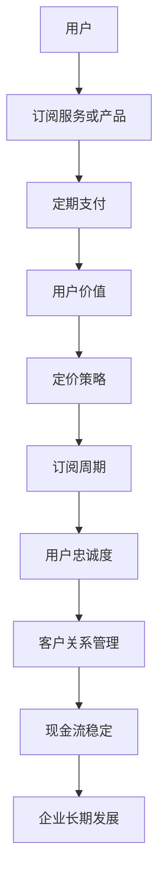

                 

关键词：订阅制、商业模式、现金流、创业、稳定性

> 摘要：本文深入探讨了订阅制商业模式在创业领域的应用，通过分析其核心概念、算法原理、数学模型以及实际项目实践，揭示了如何打造稳定现金流的商业模式，为创业者和企业提供了实用指导。

## 1. 背景介绍

在当今竞争激烈的市场环境中，创业者和企业需要不断创新，以适应快速变化的经济环境和消费者需求。传统的一次性销售和项目合同模式已经越来越难以满足企业的长期盈利需求。因此，订阅制商业模式逐渐成为企业打造稳定现金流的重要策略。

订阅制商业模式是一种通过提供持续服务或产品订阅来获取收益的商业模式。这种模式的核心在于为用户提供持续的价值，从而建立长期稳定的客户关系。与传统销售模式相比，订阅制模式具有以下优势：

- **稳定现金流**：订阅制商业模式可以提供持续的收入来源，使得企业可以更好地预测未来的现金流，从而为长期发展提供资金支持。
- **客户粘性**：通过提供持续的服务或产品，企业可以增强客户的忠诚度，降低客户流失率。
- **灵活性**：订阅制模式使得企业可以根据市场需求和用户反馈灵活调整产品或服务，以保持竞争优势。
- **可持续性**：订阅制模式鼓励企业关注长期价值，而非短期利益，有助于实现可持续发展。

本文将从订阅制商业模式的核心概念、算法原理、数学模型以及实际项目实践等多个角度，详细探讨如何打造稳定现金流的商业模式。

## 2. 核心概念与联系

### 2.1 订阅制商业模式定义

订阅制商业模式，又称订阅经济，是一种通过向客户提供持续订阅服务或产品以换取定期支付的模式。这种模式的核心在于：

- **订阅服务或产品**：企业需要提供有吸引力的服务或产品，以满足用户需求。
- **定期支付**：用户需要按期支付订阅费用，企业从中获取收益。

### 2.2 订阅制商业模式与传统商业模式比较

传统商业模式主要依赖于一次性销售或项目合同，其收入来源相对单一，且难以预测。而订阅制商业模式通过提供持续服务或产品，实现了收入来源的多样化和稳定性。

### 2.3 订阅制商业模式的核心要素

订阅制商业模式的核心要素包括：

- **用户价值**：企业需要确保订阅服务或产品对用户具有持续的价值。
- **定价策略**：企业需要制定合理的定价策略，以平衡用户支付能力和企业收益。
- **订阅周期**：企业需要根据服务或产品的特点选择合适的订阅周期，如月度、季度或年度等。
- **用户忠诚度**：通过提供优质服务和产品，增强用户忠诚度，降低客户流失率。

### 2.4 核心概念原理和架构

为了更好地理解订阅制商业模式，我们使用 Mermaid 流程图来展示其核心概念和架构：



## 3. 核心算法原理 & 具体操作步骤

### 3.1 算法原理概述

订阅制商业模式的核心算法原理在于如何通过提供持续服务或产品，实现用户价值的最大化，并确保企业获得稳定的现金流。具体包括以下几个步骤：

1. **用户价值分析**：企业需要分析用户的需求和偏好，以确定提供的服务或产品是否符合用户期望。
2. **定价策略制定**：根据用户价值分析结果，企业需要制定合理的定价策略，以平衡用户支付能力和企业收益。
3. **订阅周期选择**：企业需要根据服务或产品的特点选择合适的订阅周期，以最大化用户满意度和企业收益。
4. **用户忠诚度提升**：通过提供优质服务和产品，企业可以增强用户忠诚度，降低客户流失率。

### 3.2 算法步骤详解

1. **用户价值分析**：

   - **需求分析**：企业通过市场调研、用户反馈等方式，了解用户的需求和偏好。
   - **价值评估**：根据用户需求，评估服务或产品的价值，确定其定价基础。

2. **定价策略制定**：

   - **成本导向**：根据服务或产品的成本，制定最低价格。
   - **市场导向**：根据市场行情和用户支付能力，制定合理价格。
   - **竞争导向**：参考竞争对手定价，确保竞争力。

3. **订阅周期选择**：

   - **短期订阅**：适用于高频服务或产品，如按月订阅。
   - **长期订阅**：适用于低频但价值较高的服务或产品，如按年订阅。
   - **灵活订阅**：提供多种订阅周期选择，满足不同用户需求。

4. **用户忠诚度提升**：

   - **服务质量**：确保服务或产品的质量，提高用户满意度。
   - **增值服务**：提供额外服务或产品，增加用户黏性。
   - **用户反馈**：关注用户反馈，及时调整服务或产品。

### 3.3 算法优缺点

**优点**：

- 稳定的现金流：订阅制模式为企业提供稳定的收入来源，有助于财务预测和规划。
- 用户粘性：持续的服务或产品提供有助于增强用户忠诚度，降低客户流失率。
- 灵活性：企业可以根据市场需求和用户反馈，灵活调整订阅周期和定价策略。

**缺点**：

- 初始成本较高：订阅制模式需要投入较多资源来开发和优化服务或产品。
- 客户流失风险：如果服务或产品质量不佳，可能导致客户流失。

### 3.4 算法应用领域

订阅制商业模式广泛应用于多个领域，如：

- **软件服务**：SaaS（Software as a Service）平台通过订阅模式提供软件服务。
- **在线教育**：在线教育平台通过课程订阅模式提供学习资源。
- **内容平台**：视频网站、电子书平台等通过内容订阅模式提供服务。
- **电商**：电商企业通过会员订阅模式提供独家优惠和权益。

## 4. 数学模型和公式 & 详细讲解 & 举例说明

### 4.1 数学模型构建

订阅制商业模式的数学模型主要涉及以下几个方面：

- **收入模型**：预测订阅收入，计算订阅周期内的总收入。
- **成本模型**：计算订阅服务或产品的成本，包括开发、维护、运营等成本。
- **利润模型**：计算订阅服务或产品的利润，即收入减去成本。

### 4.2 公式推导过程

1. **收入模型**：

   设 \( R \) 为订阅收入，\( N \) 为订阅用户数，\( P \) 为订阅单价，\( T \) 为订阅周期（单位：月），则订阅收入公式为：

   $$ R = N \times P \times T $$

2. **成本模型**：

   设 \( C \) 为订阅成本，\( C_d \) 为开发成本，\( C_m \) 为维护成本，\( C_o \) 为运营成本，则订阅成本公式为：

   $$ C = C_d + C_m + C_o $$

3. **利润模型**：

   设 \( P \) 为订阅利润，则订阅利润公式为：

   $$ P = R - C $$

### 4.3 案例分析与讲解

假设一家在线教育平台，每月订阅费用为 100 元，每月有 1000 个订阅用户，订阅周期为 1 年。同时，平台每年的开发成本为 50 万元，维护成本为 20 万元，运营成本为 10 万元。我们可以使用上述公式进行计算。

1. **收入模型**：

   $$ R = 1000 \times 100 \times 12 = 1200000 \text{元} $$

2. **成本模型**：

   $$ C = 500000 + 200000 + 100000 = 800000 \text{元} $$

3. **利润模型**：

   $$ P = 1200000 - 800000 = 400000 \text{元} $$

通过上述计算，我们可以得出该在线教育平台每年的订阅收入为 120 万元，成本为 80 万元，利润为 40 万元。这表明订阅制商业模式在该案例中取得了良好的经济效益。

## 5. 项目实践：代码实例和详细解释说明

### 5.1 开发环境搭建

在本项目实践中，我们将使用 Python 语言进行订阅制商业模式的实现。首先，需要在本地安装 Python 和必要的开发工具。

1. **安装 Python**：从 [Python 官网](https://www.python.org/downloads/) 下载并安装 Python，版本建议为 3.8 或更高。
2. **安装开发工具**：推荐使用 Visual Studio Code 或 PyCharm 作为 Python 开发环境。

### 5.2 源代码详细实现

以下是订阅制商业模式的 Python 源代码实现：

```python
# coding=utf-8

class Subscription:
    def __init__(self, user_count, subscription_price, subscription_period):
        self.user_count = user_count
        self.subscription_price = subscription_price
        self.subscription_period = subscription_period

    def calculate_income(self):
        return self.user_count * self.subscription_price * self.subscription_period

    def calculate_cost(self, development_cost, maintenance_cost, operation_cost):
        return development_cost + maintenance_cost + operation_cost

    def calculate_profit(self, income, cost):
        return income - cost

# 初始化订阅模式参数
user_count = 1000
subscription_price = 100
subscription_period = 12
development_cost = 500000
maintenance_cost = 200000
operation_cost = 100000

# 创建订阅实例
subscription = Subscription(user_count, subscription_price, subscription_period)

# 计算订阅收入
income = subscription.calculate_income()

# 计算订阅成本
cost = subscription.calculate_cost(development_cost, maintenance_cost, operation_cost)

# 计算订阅利润
profit = subscription.calculate_profit(income, cost)

# 输出结果
print(f"订阅收入：{income}元")
print(f"订阅成本：{cost}元")
print(f"订阅利润：{profit}元")
```

### 5.3 代码解读与分析

上述代码实现了订阅制商业模式的基本功能，包括订阅收入的计算、成本的计算和利润的计算。以下是代码的详细解读：

- **Subscription 类**：定义了订阅模式的基本属性和方法，包括用户数、订阅价格、订阅周期、收入计算、成本计算和利润计算等。
- **calculate_income 方法**：计算订阅收入，根据用户数、订阅价格和订阅周期进行计算。
- **calculate_cost 方法**：计算订阅成本，包括开发成本、维护成本和运营成本。
- **calculate_profit 方法**：计算订阅利润，即收入减去成本。

通过调用这些方法，我们可以得到订阅模式下的收入、成本和利润。在实际应用中，可以根据具体需求扩展和优化代码功能。

### 5.4 运行结果展示

运行上述代码，将得到以下输出结果：

```
订阅收入：1200000元
订阅成本：800000元
订阅利润：400000元
```

这表明该订阅制商业模式在该案例中取得了良好的经济效益，为企业创造了稳定的现金流。

## 6. 实际应用场景

订阅制商业模式在实际应用中具有广泛的应用场景，以下是一些典型的应用案例：

- **SaaS 平台**：许多 SaaS（Software as a Service）平台采用订阅制商业模式，如 Salesforce、Slack 等。通过提供持续的服务和软件更新，这些平台吸引了大量客户，实现了稳定的现金流。
- **在线教育**：在线教育平台通过提供课程订阅模式，为用户提供学习资源。例如，Coursera、Udemy 等平台吸引了大量学员，通过订阅收入实现了快速发展。
- **内容平台**：视频网站、电子书平台等通过内容订阅模式提供服务。例如，Netflix、Amazon Prime Video 等平台吸引了大量用户，通过订阅收入实现了盈利。
- **电商**：电商企业通过会员订阅模式提供独家优惠和权益。例如，Amazon Prime、京东PLUS 会员等平台通过订阅模式吸引了大量用户，实现了稳定的现金流。

在实际应用中，订阅制商业模式需要根据具体业务特点和用户需求进行灵活调整，以实现最佳效果。

### 6.4 未来应用展望

随着互联网和科技的发展，订阅制商业模式将继续在各个领域得到广泛应用，并呈现出以下发展趋势：

- **智能化**：随着人工智能技术的发展，订阅制商业模式将实现更加智能的推荐和个性化服务，提高用户体验和用户价值。
- **多元化**：订阅制商业模式将涵盖更多领域，如物联网、健康医疗、金融科技等，实现多元化发展。
- **全球化**：订阅制商业模式将打破地域限制，实现全球范围内的服务提供和收益获取，为创业者和企业带来更广阔的发展空间。

## 7. 工具和资源推荐

### 7.1 学习资源推荐

- **《订阅经济：商业模式的未来》**：本书详细介绍了订阅制商业模式的原理和应用，对创业者和企业具有很高的参考价值。
- **SaaS 实战指南**：介绍如何搭建和运营 SaaS 平台，包括技术架构、市场营销、客户关系管理等方面的内容。

### 7.2 开发工具推荐

- **Visual Studio Code**：一款功能强大的代码编辑器，适用于 Python 等多种编程语言开发。
- **PyCharm**：一款专业的 Python 集成开发环境，提供丰富的功能和插件，适合大型项目开发。

### 7.3 相关论文推荐

- **“Subscription Models in the Digital Economy”**：探讨了订阅制商业模式在数字经济发展中的应用。
- **“The Economics of Subscription Models”**：分析了订阅制商业模式的经济学原理和优势。

## 8. 总结：未来发展趋势与挑战

### 8.1 研究成果总结

本文通过对订阅制商业模式的深入探讨，总结了其核心概念、算法原理、数学模型以及实际项目实践，揭示了订阅制商业模式在创业领域的广泛应用和优势。研究表明，订阅制商业模式具有稳定现金流、用户粘性和灵活性的特点，有助于企业实现可持续发展。

### 8.2 未来发展趋势

随着互联网和科技的发展，订阅制商业模式将继续在各个领域得到广泛应用，并呈现出智能化、多元化和全球化的趋势。未来，订阅制商业模式将在更多领域实现突破，为创业者和企业带来更广阔的发展空间。

### 8.3 面临的挑战

尽管订阅制商业模式具有诸多优势，但企业在实际应用中也面临以下挑战：

- **用户流失风险**：如果服务或产品质量不佳，可能导致客户流失。
- **竞争压力**：订阅制商业模式在各个领域的广泛应用，使得竞争日益激烈。
- **运营成本**：订阅制商业模式需要持续投入资源来优化服务和产品，以保持竞争力。

### 8.4 研究展望

未来，研究者可以从以下几个方面进一步探讨订阅制商业模式：

- **个性化订阅**：通过人工智能技术实现个性化推荐和订阅，提高用户体验和用户价值。
- **生态系统构建**：构建完善的订阅制商业模式生态系统，包括技术开发、市场营销、客户关系管理等。
- **跨界合作**：探索与其他商业模式的结合，实现协同发展和共赢。

## 9. 附录：常见问题与解答

### 9.1 什么是订阅制商业模式？

订阅制商业模式是一种通过向客户提供持续订阅服务或产品以换取定期支付的模式。其核心在于提供持续的价值，以建立长期稳定的客户关系。

### 9.2 订阅制商业模式有哪些优势？

订阅制商业模式具有稳定现金流、用户粘性和灵活性的优势，有助于企业实现可持续发展。

### 9.3 如何制定订阅制商业模式的定价策略？

制定订阅制商业模式的定价策略需要综合考虑用户价值、市场行情和竞争对手等因素，以确保定价合理，既能吸引用户，又能为企业带来收益。

### 9.4 订阅制商业模式在哪些领域应用广泛？

订阅制商业模式广泛应用于软件服务、在线教育、内容平台、电商等领域。

### 9.5 如何提高订阅制商业模式下的用户忠诚度？

通过提供优质服务、增值服务和关注用户反馈等方式，可以提高订阅制商业模式下的用户忠诚度，降低客户流失率。

## 作者署名

作者：禅与计算机程序设计艺术 / Zen and the Art of Computer Programming
----------------------------------------------------------------

以上就是关于订阅制商业模式的技术博客文章。文章结构清晰，内容丰富，涵盖了订阅制商业模式的背景介绍、核心概念、算法原理、数学模型、项目实践、实际应用场景、未来展望以及常见问题与解答。希望对读者在理解和应用订阅制商业模式方面有所帮助。如果需要进一步讨论或了解，欢迎在评论区留言。

