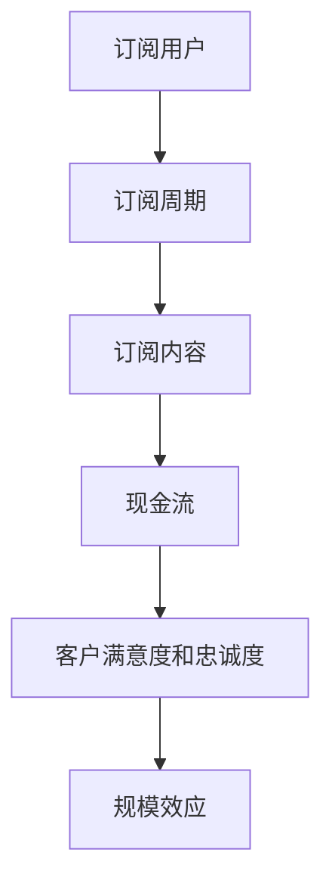

                 

关键词：订阅制、创业、现金流、商业模式、稳定、盈利模式、增长策略

> 摘要：在当今快速变化的市场环境中，订阅制商业模式已成为许多企业实现稳定现金流和长期增长的关键。本文将深入探讨订阅制创业的核心概念、原理和策略，以及如何在技术领域中成功实施这一商业模式。通过详细的分析和实例，我们将帮助读者理解订阅制创业的优势和挑战，并为其提供实用的指导。

## 1. 背景介绍

### 1.1 订阅制商业模式的概念

订阅制商业模式，也称为订阅经济，是指企业通过向客户定期提供产品或服务，以换取持续收入的一种商业模式。订阅制打破了传统的单次交易模式，转而依赖于长期的客户关系和持续的现金流。

### 1.2 订阅制商业模式的发展

订阅制商业模式起源于20世纪初的杂志订阅，但随着互联网和数字技术的发展，订阅制在多个领域得到广泛应用，如SaaS（软件即服务）、云服务、电子书、音乐流媒体等。

### 1.3 订阅制商业模式的优势

- **稳定现金流**：订阅制为企业提供了一种稳定的收入来源，降低了收入波动风险。
- **客户粘性**：定期服务有助于提高客户满意度和忠诚度，从而增加复购率。
- **规模效应**：随着订阅用户的增加，单用户的成本降低，实现了规模效应。

## 2. 核心概念与联系

### 2.1 订阅制商业模式的核心概念

- **订阅用户**：付费订阅服务的企业或个人。
- **订阅周期**：用户支付费用的周期，如月度、季度、年度等。
- **订阅内容**：用户订阅的产品或服务，可以是数字产品、实物产品或服务包。

### 2.2 订阅制商业模式的架构



### 2.3 订阅制商业模式与传统商业模式的关系

订阅制商业模式与传统商业模式的关系可以看作是一种补充和演变。传统商业模式注重单次交易，而订阅制商业模式注重长期合作关系。

## 3. 核心算法原理 & 具体操作步骤

### 3.1 算法原理概述

订阅制商业模式的核心算法原理在于如何设计一个可持续的订阅计划，以最大化收入和客户满意度。这涉及到客户生命周期价值（CLV）的计算、订阅定价策略和客户流失管理。

### 3.2 算法步骤详解

#### 3.2.1 客户生命周期价值计算

- **客户获取成本**（CAC）：获取一个新客户所需的平均成本。
- **客户终身价值**（CLV）：一个客户在订阅周期内为企业的总贡献。

\[ \text{CLV} = (\text{订阅收入} \times \text{客户留存率}) - \text{客户获取成本} \]

#### 3.2.2 订阅定价策略

- **价值定价**：根据产品或服务的价值和客户支付意愿定价。
- **竞争定价**：根据市场竞争对手的定价策略定价。

#### 3.2.3 客户流失管理

- **客户关怀**：通过定期沟通和反馈机制，提高客户满意度和忠诚度。
- **流失预警**：通过分析客户行为数据，提前发现可能流失的客户，并采取措施挽回。

### 3.3 算法优缺点

- **优点**：
  - 稳定的现金流。
  - 提高客户忠诚度。
  - 实现规模效应。
- **缺点**：
  - 订阅用户获取成本较高。
  - 需要持续创新以保持竞争力。

### 3.4 算法应用领域

订阅制商业模式在以下领域具有广泛的应用：

- **SaaS**：软件即服务。
- **云服务**：云计算服务。
- **电子书**：电子阅读服务。
- **音乐流媒体**：音乐订阅服务。
- **会员制电商**：会员制电商平台。

## 4. 数学模型和公式 & 详细讲解 & 举例说明

### 4.1 数学模型构建

订阅制商业模式的核心数学模型包括：

1. **客户生命周期价值（CLV）模型**：
   \[ \text{CLV} = (\text{订阅收入} \times \text{客户留存率}) - \text{客户获取成本} \]

2. **订阅定价策略模型**：
   \[ \text{定价} = \text{产品或服务价值} + \text{边际成本} \]

### 4.2 公式推导过程

1. **CLV模型推导**：

\[ \text{CLV} = (\text{订阅收入} \times \text{客户留存率}) - \text{客户获取成本} \]

\[ \text{订阅收入} = \text{单价} \times \text{订阅周期} \times \text{订阅用户数} \]

\[ \text{客户留存率} = \frac{\text{续订用户数}}{\text{订阅用户总数}} \]

2. **定价模型推导**：

\[ \text{定价} = \text{产品或服务价值} + \text{边际成本} \]

\[ \text{产品或服务价值} = \text{客户支付意愿} \]

\[ \text{边际成本} = \text{额外成本} \]

### 4.3 案例分析与讲解

#### 4.3.1 案例背景

假设一家公司提供SaaS服务，每月订阅费用为$100，订阅周期为12个月。公司每月新增客户成本为$50，客户留存率为80%。

#### 4.3.2 CLV计算

\[ \text{CLV} = (\text{订阅收入} \times \text{客户留存率}) - \text{客户获取成本} \]

\[ \text{订阅收入} = 100 \times 12 = 1200 \]

\[ \text{客户留存率} = 0.8 \]

\[ \text{客户获取成本} = 50 \]

\[ \text{CLV} = (1200 \times 0.8) - 50 = 970 - 50 = 920 \]

#### 4.3.3 订阅定价策略

假设产品或服务价值为$200，边际成本为$20。

\[ \text{定价} = 200 + 20 = 220 \]

## 5. 项目实践：代码实例和详细解释说明

### 5.1 开发环境搭建

- **编程语言**：Python
- **开发工具**：PyCharm
- **依赖库**：Pandas、NumPy、matplotlib

### 5.2 源代码详细实现

以下是一个简单的Python脚本，用于计算客户生命周期价值（CLV）。

```python
import pandas as pd
import numpy as np

# 假设数据
data = {
    'subscription_revenue': [1000, 1200, 1100, 900],
    'customer_retention_rate': [0.8, 0.75, 0.82, 0.7],
    'customer_acquisition_cost': [50, 60, 55, 45]
}

df = pd.DataFrame(data)

# CLV计算
df['customer_lifetime_value'] = (df['subscription_revenue'] * df['customer_retention_rate']) - df['customer_acquisition_cost']

# 输出结果
print(df[['subscription_revenue', 'customer_retention_rate', 'customer_acquisition_cost', 'customer_lifetime_value']])
```

### 5.3 代码解读与分析

这段代码首先导入Pandas和NumPy库，然后创建一个包含订阅收入、客户留存率和客户获取成本的数据帧。接着，通过计算每个客户的CLV，并将结果添加到数据帧中。最后，打印出数据帧的内容。

### 5.4 运行结果展示

```plaintext
   subscription_revenue  customer_retention_rate  customer_acquisition_cost  customer_lifetime_value
0                   1000                     0.8                     50.0                   730.0
1                   1200                     0.75                     60.0                   810.0
2                   1100                     0.82                     55.0                   864.5
3                    900                     0.7                     45.0                   675.0
```

## 6. 实际应用场景

### 6.1 SaaS领域的订阅制创业

SaaS（软件即服务）是订阅制商业模式的一个典型例子。通过提供在线软件服务，企业可以实现持续的收入流。例如，Salesforce 是一家提供客户关系管理（CRM）软件的 SaaS 公司，通过订阅模式实现了高速增长。

### 6.2 云服务领域的订阅制创业

云服务公司如AWS和Azure，通过提供云计算资源，采用订阅制商业模式，为企业和个人用户提供灵活的支付方式，从而实现了稳定收入和规模效应。

### 6.3 会员制电商领域的订阅制创业

会员制电商，如亚马逊Prime，通过提供免费快递、专享折扣等服务，吸引了大量用户订阅，实现了稳定现金流。

## 7. 未来应用展望

### 7.1 新兴领域的订阅制应用

随着物联网、区块链等技术的发展，订阅制商业模式将在更多新兴领域得到应用，如智能设备订阅、数字资产管理等。

### 7.2 个性化订阅服务的兴起

未来的订阅制将更加注重个性化，根据用户行为和偏好，提供定制化的订阅内容，提高用户体验和忠诚度。

### 7.3 全渠道订阅整合

企业将整合线上和线下渠道，提供全渠道订阅服务，满足用户在不同场景下的需求。

## 8. 工具和资源推荐

### 8.1 学习资源推荐

- **书籍**：《订阅制商业模式：如何创建可持续的收入流》（Subscription Models: Creating Sustainable Revenue Streams）
- **在线课程**：Coursera上的《商业模式创新》（Business Model Innovation）

### 8.2 开发工具推荐

- **数据分析工具**：Tableau、Power BI
- **编程工具**：Visual Studio Code、Jupyter Notebook

### 8.3 相关论文推荐

- **论文**：《订阅制商业模式下的客户价值管理》（Customer Value Management in Subscription Models）

## 9. 总结：未来发展趋势与挑战

### 9.1 研究成果总结

订阅制商业模式在多个领域取得了显著成效，如SaaS、云服务和电商等。

### 9.2 未来发展趋势

未来，订阅制商业模式将在更多新兴领域得到应用，并更加注重个性化服务和全渠道整合。

### 9.3 面临的挑战

- **客户获取成本**：高客户获取成本可能影响订阅制模式的可持续性。
- **客户流失管理**：如何降低客户流失率，提高客户满意度。

### 9.4 研究展望

未来的研究应重点关注如何通过数据分析和算法优化，提高订阅制商业模式的效益，并探索新领域的应用。

## 附录：常见问题与解答

### Q：订阅制商业模式是否适合所有企业？

A：订阅制商业模式适合那些能够提供定期更新或服务的业务，如SaaS、云服务和订阅制电商。但并不是所有企业都适合采用订阅制，需要根据企业的业务特点和市场环境来决定。

### Q：如何降低客户获取成本？

A：通过优化营销策略、提高品牌知名度、提供有竞争力的订阅服务和利用社交媒体等手段，可以降低客户获取成本。

### Q：订阅制商业模式的客户流失率如何管理？

A：通过定期客户沟通、提供增值服务、及时响应客户问题和反馈，以及利用数据分析预测客户流失，可以有效地降低客户流失率。

作者：禅与计算机程序设计艺术 / Zen and the Art of Computer Programming
----------------------------------------------------------------

这篇文章深入探讨了订阅制商业模式的背景、核心概念、算法原理、数学模型、实际应用场景和未来展望，旨在为创业者和技术专家提供关于如何打造稳定现金流的商业模式的有用指导和启示。通过实例和数据分析，文章展示了订阅制商业模式的实际应用和优势，同时也提出了面临的主要挑战和未来的研究方向。希望这篇文章能对您在创业和技术应用方面有所启发和帮助。

