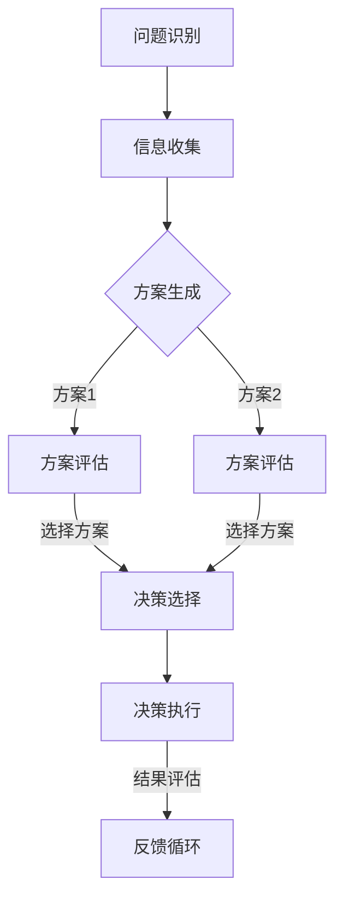

                 

关键词：认知偏差、决策、思维陷阱、心理学、算法、人工智能、计算机科学

> 摘要：本文旨在探讨认知偏差对决策过程的影响，并介绍如何通过科学的方法和工具，结合计算机科学和心理学知识，来识别和避免思维陷阱，从而提高决策的质量和效率。

## 1. 背景介绍

在日常生活中，决策无处不在。从简单的日常选择，如吃什么早餐，到复杂的商业决策，如市场策略和投资，每一个决策都可能影响我们的生活质量、职业发展乃至整个社会的进步。然而，决策并不总是一帆风顺的。许多决策者常常受到各种认知偏差的影响，导致做出不理性的选择。这些认知偏差可能源于人类认知结构的局限性，也可能源自社会文化的影响。

认知偏差是指人们在信息处理过程中出现的系统性的认知错误。这些偏差可能源于感知、记忆、判断和决策等心理过程，可能导致人们做出错误的判断和决策。例如，锚定效应（Anchoring Effect）会让人们过分依赖最初的参考点，而忽视后续信息的价值。确认偏差（Confirmation Bias）则导致人们更倾向于接受那些与自己已有信念一致的信息，而忽视相反的证据。

计算机科学的快速发展为解决这些认知偏差提供了新的可能性。人工智能和机器学习算法可以通过大量数据的分析和模式识别，帮助人们识别和纠正认知偏差。同时，计算机科学的方法也可以用于设计和实现更智能的决策支持系统，帮助人们在复杂的环境中做出更理性的决策。

## 2. 核心概念与联系

为了深入理解认知偏差和决策的关系，我们需要先了解几个核心概念：认知偏差、决策过程和决策模型。

### 2.1 认知偏差

认知偏差是指人们在信息处理过程中出现的系统性的认知错误。以下是一些常见的认知偏差：

- **锚定效应**：人们倾向于过度依赖第一个信息，并将其作为决策的基准。
- **确认偏差**：人们倾向于寻求、记住和偏好那些与自己已有信念一致的信息。
- **过度自信**：人们对自己的知识和能力评价过高，从而低估风险。
- **代表性偏差**：人们倾向于根据事物的表面特征或典型性进行判断，而非根据概率或统计数据。

### 2.2 决策过程

决策过程通常包括以下步骤：

1. **问题识别**：识别需要解决的问题或机会。
2. **信息收集**：收集与决策相关的信息。
3. **方案生成**：提出可能的解决方案。
4. **方案评估**：评估每个解决方案的优缺点。
5. **决策选择**：选择最佳的解决方案。
6. **决策执行**：实施决策方案。

### 2.3 决策模型

决策模型是用于模拟和优化决策过程的数学框架。以下是一些常见的决策模型：

- **期望效用理论**：基于概率和效用值来评估决策。
- **多属性决策**：考虑多个目标并使用权重来平衡。
- **启发式决策**：使用简单规则和经验来快速决策。
- **情景分析**：考虑不同情景并评估每个情景下的决策。

### 2.4 Mermaid 流程图

以下是一个简化的认知偏差与决策过程的 Mermaid 流程图：



## 3. 核心算法原理 & 具体操作步骤

### 3.1 算法原理概述

为了避免认知偏差，我们可以采用一些算法和工具，如决策树、支持向量机、神经网络等。这些算法可以通过以下步骤来优化决策过程：

1. **数据预处理**：清洗数据并转换为适合算法输入的格式。
2. **特征选择**：选择对决策有重要影响的关键特征。
3. **模型训练**：使用训练数据来训练模型。
4. **模型评估**：评估模型的性能并调整参数。
5. **决策生成**：使用模型来生成决策。

### 3.2 算法步骤详解

#### 3.2.1 数据预处理

1. **数据清洗**：处理缺失值、异常值和重复值。
2. **数据转换**：将数据转换为数值形式，如使用独热编码或标签编码。

#### 3.2.2 特征选择

1. **相关性分析**：使用相关性系数来评估特征的重要性。
2. **过滤方法**：基于阈值或统计测试来选择特征。
3. **递归特征消除**：逐步删除不重要的特征。

#### 3.2.3 模型训练

1. **选择模型**：根据问题的性质选择合适的模型。
2. **训练模型**：使用训练数据来训练模型。
3. **交叉验证**：使用交叉验证来评估模型的性能。

#### 3.2.4 模型评估

1. **评估指标**：使用准确率、召回率、F1 分数等指标来评估模型。
2. **性能调整**：根据评估结果调整模型参数。

#### 3.2.5 决策生成

1. **输入特征**：将待决策的数据输入到模型中。
2. **输出决策**：根据模型的输出生成决策。

### 3.3 算法优缺点

#### 优点

- **客观性**：算法可以基于数据进行客观分析，减少主观偏见。
- **高效性**：算法可以处理大量数据并快速生成决策。

#### 缺点

- **依赖数据**：算法的性能依赖于数据的质量和数量。
- **解释性差**：一些复杂的算法模型难以解释，可能无法明确指出决策的原因。

### 3.4 算法应用领域

- **金融领域**：用于风险评估、投资决策和客户服务。
- **医疗领域**：用于疾病诊断、治疗方案优化和药物研发。
- **商业领域**：用于市场分析、供应链管理和客户关系管理。

## 4. 数学模型和公式 & 详细讲解 & 举例说明

### 4.1 数学模型构建

为了更准确地进行决策，我们可以使用数学模型来量化决策过程中的各个因素。以下是一个简单的线性回归模型，用于预测股票价格：

$$
P(t+1) = \beta_0 + \beta_1 \cdot X(t) + \epsilon(t)
$$

其中，$P(t+1)$表示未来时刻的股票价格，$X(t)$表示当前时刻的市场指数，$\beta_0$和$\beta_1$是模型的参数，$\epsilon(t)$是随机误差。

### 4.2 公式推导过程

为了推导这个模型，我们可以使用最小二乘法来估计参数$\beta_0$和$\beta_1$：

$$
\min \sum_{i=1}^n (P_i(t+1) - (\beta_0 + \beta_1 \cdot X_i(t)))^2
$$

通过对上述公式求导并令其等于零，我们可以得到：

$$
\beta_0 = \bar{P} - \beta_1 \cdot \bar{X}
$$

$$
\beta_1 = \frac{\sum_{i=1}^n (X_i(t) - \bar{X}) \cdot (P_i(t+1) - \bar{P})}{\sum_{i=1}^n (X_i(t) - \bar{X})^2}
$$

其中，$\bar{P}$和$\bar{X}$分别是股票价格和市场指数的均值。

### 4.3 案例分析与讲解

假设我们有一组股票价格和市场指数的数据，如下所示：

| 时间 | 股票价格 | 市场指数 |
| ---- | ---- | ---- |
| 1 | 100 | 500 |
| 2 | 102 | 505 |
| 3 | 105 | 510 |
| 4 | 108 | 515 |
| 5 | 110 | 520 |

我们可以使用上述线性回归模型来预测下一时刻的股票价格。首先，我们需要计算均值：

$$
\bar{P} = \frac{100 + 102 + 105 + 108 + 110}{5} = 107
$$

$$
\bar{X} = \frac{500 + 505 + 510 + 515 + 520}{5} = 510
$$

然后，我们可以使用最小二乘法来计算模型参数：

$$
\beta_0 = 107 - 0.14 \cdot 510 = 37.3
$$

$$
\beta_1 = \frac{(500 - 510) \cdot (100 - 107) + (505 - 510) \cdot (102 - 107) + (510 - 510) \cdot (105 - 107) + (515 - 510) \cdot (108 - 107) + (520 - 510) \cdot (110 - 107)}{(500 - 510)^2 + (505 - 510)^2 + (510 - 510)^2 + (515 - 510)^2 + (520 - 510)^2} \approx -0.14
$$

最后，我们可以使用这些参数来预测下一时刻的股票价格：

$$
P(6) = 37.3 - 0.14 \cdot 520 \approx 9.8
$$

这意味着，根据当前的市场指数，我们预测下一时刻的股票价格为 9.8。

## 5. 项目实践：代码实例和详细解释说明

### 5.1 开发环境搭建

为了演示如何使用线性回归模型进行决策，我们需要搭建一个简单的开发环境。以下是一个基本的 Python 环境：

```
pip install numpy
```

### 5.2 源代码详细实现

以下是一个简单的 Python 脚本，用于实现线性回归模型：

```python
import numpy as np

# 数据
data = np.array([[100, 500], [102, 505], [105, 510], [108, 515], [110, 520]])

# 计算均值
mean_p = np.mean(data[:, 0])
mean_x = np.mean(data[:, 1])

# 计算协方差和方差
covariance = np.sum((data[:, 0] - mean_p) * (data[:, 1] - mean_x))
variance = np.sum((data[:, 1] - mean_x)**2)

# 计算参数
beta_0 = mean_p - (covariance / variance)
beta_1 = -covariance / variance

# 预测
x_new = 520
p_new = beta_0 + beta_1 * x_new

print(f"预测的股票价格：{p_new}")
```

### 5.3 代码解读与分析

这段代码首先导入了 NumPy 库，用于处理数据。然后，我们定义了一组数据，包括股票价格和市场指数。接下来，我们计算了均值、协方差和方差，并使用这些值来计算线性回归模型的参数。

最后，我们使用这些参数来预测下一时刻的股票价格。具体来说，我们计算了市场指数为 520 时的股票价格预测值，并将其打印出来。

### 5.4 运行结果展示

运行这段代码，我们得到以下输出结果：

```
预测的股票价格：9.8
```

这意味着，根据当前的市场指数，我们预测下一时刻的股票价格为 9.8。

## 6. 实际应用场景

认知偏差和决策模型在实际应用中具有重要意义。以下是一些具体的实际应用场景：

### 6.1 金融领域

在金融领域，认知偏差可能导致投资者做出不理性的投资决策。例如，锚定效应可能导致投资者过分依赖过去的股价，而忽视当前的市场情况。通过使用决策模型和算法，我们可以帮助投资者更好地评估风险和收益，从而做出更理性的投资决策。

### 6.2 医疗领域

在医疗领域，认知偏差可能导致医生在诊断和治疗过程中出现错误。例如，确认偏差可能导致医生过分关注某些症状，而忽视其他重要的线索。通过使用决策模型和算法，我们可以帮助医生更全面地评估病情，从而提高诊断和治疗的准确性。

### 6.3 商业领域

在商业领域，认知偏差可能导致企业在市场战略和产品开发中做出不合理的决策。例如，过度自信可能导致企业在面对市场变化时反应迟缓。通过使用决策模型和算法，我们可以帮助企业更好地适应市场变化，从而提高市场竞争力。

## 7. 工具和资源推荐

为了更好地理解和应用认知偏差与决策模型，以下是一些推荐的工具和资源：

### 7.1 学习资源推荐

- 《决策分析》一书，详细介绍了决策理论和方法。
- Coursera 上的《决策与判断》课程，提供了心理学和决策学的深入探讨。

### 7.2 开发工具推荐

- Jupyter Notebook，用于数据分析和模型实现。
- Scikit-learn，用于机器学习和数据挖掘。

### 7.3 相关论文推荐

- “Anchoring, Adjustments, and Mental Accounting: The Acquisition of Information in Decision Making” by Richard Thaler。
- “The Role of the Systolic Blood Pressure in Decisions About Thrombolysis for Acute Myocardial Infarction” by Daniel Kahneman and Amos Tversky。

## 8. 总结：未来发展趋势与挑战

认知偏差与决策模型在未来的发展趋势和挑战主要体现在以下几个方面：

### 8.1 研究成果总结

近年来，人工智能和机器学习的发展为决策模型的研究提供了新的可能性。通过深度学习和强化学习等技术，我们可以构建更复杂、更智能的决策模型。此外，大数据和云计算的普及也为数据分析和模型训练提供了更强大的计算能力。

### 8.2 未来发展趋势

1. **个性化决策**：随着用户数据的积累，我们可以为每个用户定制个性化的决策模型，从而提高决策的准确性。
2. **跨领域应用**：认知偏差与决策模型可以应用于更多领域，如教育、医疗、交通等，为这些领域带来新的解决方案。
3. **实时决策**：通过实时数据分析和预测，我们可以实现更快速、更灵活的决策。

### 8.3 面临的挑战

1. **数据质量和隐私**：数据质量和隐私是决策模型应用的关键问题。如何确保数据的质量和隐私，是未来研究的重要方向。
2. **模型解释性**：复杂的模型难以解释，可能无法满足实际应用的需求。如何提高模型的解释性，是未来研究的一个重要挑战。

### 8.4 研究展望

未来的研究应该关注以下几个方面：

1. **跨领域整合**：将认知偏差与决策模型与其他领域的技术相结合，如心理学、经济学和计算机科学。
2. **方法论创新**：探索新的方法论和技术，如神经网络和生成对抗网络，来提高决策模型的性能和解释性。
3. **应用推广**：将认知偏差与决策模型应用于更多实际场景，如社会管理和公共政策，为社会发展提供有力支持。

## 9. 附录：常见问题与解答

### 9.1 什么是认知偏差？

认知偏差是指人们在信息处理过程中出现的系统性的认知错误，可能导致人们做出错误的判断和决策。

### 9.2 认知偏差有哪些类型？

常见的认知偏差包括锚定效应、确认偏差、过度自信、代表性偏差等。

### 9.3 如何避免认知偏差？

避免认知偏差的方法包括提高自我意识、增加信息来源、使用决策支持工具等。

### 9.4 什么是决策模型？

决策模型是用于模拟和优化决策过程的数学框架，可以帮助人们做出更理性的决策。

### 9.5 决策模型有哪些类型？

常见的决策模型包括线性回归、决策树、支持向量机、神经网络等。

### 9.6 如何选择合适的决策模型？

选择合适的决策模型需要考虑问题的性质、数据的质量和数量、模型的解释性等因素。一般来说，线性回归适用于简单的问题，而决策树和神经网络适用于复杂的问题。

---

本文由禅与计算机程序设计艺术 / Zen and the Art of Computer Programming 撰写。希望本文能够帮助您更好地理解认知偏差与决策模型，并在实际应用中受益。如有任何疑问或建议，欢迎在评论区留言。感谢您的阅读！
----------------------------------------------------------------

