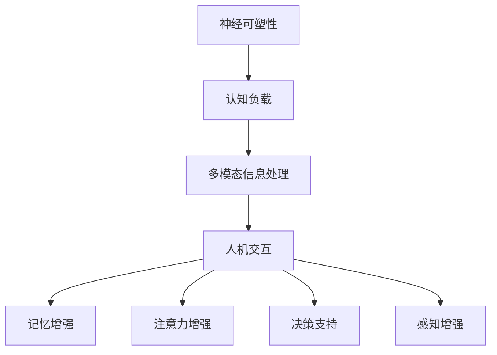

                 

### 1. 背景介绍

在当今信息爆炸的时代，人类的认知能力面临着前所未有的挑战。大数据、云计算、人工智能等技术的飞速发展，使得信息获取和处理变得更加便捷，但也对人类的认知能力提出了更高的要求。传统教育模式无法满足个性化、智能化的发展需求，认知增强技术应运而生。认知增强，指的是通过科技手段提升人类在感知、理解、记忆和思考等方面的能力，从而提高整体认知水平。

认知增强技术的发展可以追溯到上世纪末。随着计算机技术的进步和认知科学研究的深入，研究者开始探索如何利用计算机辅助人类思维。早期的认知增强工具主要集中于记忆辅助、信息检索和决策支持等方面。然而，随着神经科学、心理学和人工智能等领域的交叉融合，认知增强技术逐渐从单一功能向综合、智能化方向发展。

本文将从以下几个方面探讨认知增强与人类潜能开发的关系：首先，介绍认知增强技术的核心概念与联系；其次，分析核心算法原理及具体操作步骤；然后，讲解数学模型和公式的构建与推导过程；接着，提供实际项目实践中的代码实例和详细解释；最后，讨论认知增强技术的实际应用场景和未来发展趋势。

### 2. 核心概念与联系

#### 2.1 认知增强的定义与内涵

认知增强，顾名思义，是指通过外部干预手段提高人类大脑的认知功能。这些干预手段可以包括硬件设备、软件应用和生物技术等。从内涵上看，认知增强不仅涉及认知能力的提升，还包括认知效率、认知稳定性和认知适应性的改善。

在认知增强技术中，常用的核心概念包括：

- **神经可塑性**：指大脑神经元结构和功能随着外界刺激而产生的适应性变化。神经可塑性是认知增强的基础。

- **认知负载**：指大脑在进行认知任务时所需处理的复杂信息和资源。降低认知负载有助于提高认知效率。

- **多模态信息处理**：指综合利用视觉、听觉、触觉等多种感官信息进行认知处理，以提高认知深度和广度。

- **人机交互**：指人类与计算机或其他智能设备之间的交互方式，包括语音、手势、脑波等。

#### 2.2 认知增强技术的架构与分类

认知增强技术的架构可以划分为三个层次：硬件层、软件层和应用层。

- **硬件层**：主要包括脑机接口、增强现实（AR）、虚拟现实（VR）等设备。这些设备通过直接与大脑或神经系统相互作用，提供实时、直观的信息输入和输出。

- **软件层**：包括认知算法、数据分析、机器学习等。这些软件应用旨在通过优化数据处理和分析过程，提升认知能力。

- **应用层**：涉及具体的认知增强应用场景，如教育、医疗、军事、娱乐等。这些应用场景根据用户需求，整合硬件和软件资源，实现认知能力的提升。

根据功能不同，认知增强技术可以分为以下几类：

- **记忆增强**：通过外部设备或软件应用，增强人类记忆能力，如记忆辅助设备、记忆训练游戏等。

- **注意力增强**：通过减少认知负载、提高注意力集中度，如降噪耳机、专注力训练软件等。

- **决策支持**：利用大数据和人工智能技术，为用户提供更加准确、快速的决策支持。

- **感知增强**：通过增强现实和虚拟现实技术，扩展人类感知能力，如增强现实眼镜、虚拟现实游戏等。

#### 2.3 认知增强技术的应用现状与挑战

目前，认知增强技术在多个领域取得了显著成果。例如，在教育领域，认知增强技术可以提供个性化学习方案，提高学习效果；在医疗领域，认知增强技术有助于辅助医生进行诊断和治疗；在军事领域，认知增强技术可以提高士兵的战斗力和决策能力。

然而，认知增强技术也面临一些挑战：

- **伦理问题**：认知增强技术的应用可能导致人类认知能力的变异，引发伦理争议。

- **安全性问题**：认知增强设备可能成为黑客攻击的目标，对个人隐私和安全造成威胁。

- **公平性问题**：认知增强技术的普及可能加剧社会不公平现象，造成“认知鸿沟”。

- **法律监管**：认知增强技术的应用需要完善的法律法规和监管机制，以确保技术应用的安全性和合法性。

#### 2.4 Mermaid 流程图

下面是一个简化的 Mermaid 流程图，展示了认知增强技术的核心概念与联系：



### 3. 核心算法原理 & 具体操作步骤

#### 3.1 算法原理概述

认知增强技术的核心在于算法原理，这些算法旨在优化大脑的认知处理过程。以下介绍几种常见的认知增强算法原理：

- **脑波识别与控制**：通过监测和分析脑波信号，实现对人类思维过程的识别与控制。脑波识别技术可以用于开发脑机接口（BCI）系统，从而实现直接的大脑-计算机交互。

- **记忆重组算法**：基于神经科学原理，通过改变神经元之间的连接强度和结构，优化记忆存储和检索过程。记忆重组算法可以用于开发记忆增强系统，提高人类的记忆能力。

- **注意力分配算法**：通过分析任务复杂度和用户注意力水平，动态调整认知资源的分配。注意力分配算法可以用于优化用户在复杂环境中的认知过程，提高认知效率。

- **决策支持算法**：利用大数据和机器学习技术，为用户提供个性化、优化的决策支持。决策支持算法可以用于开发智能决策系统，辅助用户在复杂情境下做出最佳选择。

#### 3.2 算法步骤详解

下面分别介绍上述四种算法的具体操作步骤：

##### 3.2.1 脑波识别与控制算法

1. **数据采集**：使用脑电图（EEG）设备采集用户的脑波信号。
2. **预处理**：对采集到的脑波信号进行滤波、去噪等预处理操作，以提高信号质量。
3. **特征提取**：从预处理后的信号中提取特征，如频率、振幅等。
4. **分类与识别**：使用机器学习算法，如支持向量机（SVM）、深度学习等，对提取到的特征进行分类与识别。
5. **输出控制**：将识别结果转换为计算机或其他设备的操作指令，实现大脑-计算机的交互。

##### 3.2.2 记忆重组算法

1. **记忆编码**：将待记忆的信息转换为神经编码，存储在大脑的神经元连接中。
2. **记忆检索**：在需要回忆信息时，激活与记忆相关的神经元连接，重构记忆内容。
3. **记忆优化**：通过改变神经元之间的连接强度和结构，优化记忆存储和检索过程。例如，使用神经网络模型模拟大脑的记忆机制，优化记忆容量和检索速度。

##### 3.2.3 注意力分配算法

1. **任务分析**：分析当前任务的复杂度和认知需求。
2. **注意力评估**：评估用户当前的注意力水平。
3. **资源分配**：根据任务分析和注意力评估结果，动态调整认知资源的分配，如调整视觉、听觉等感官的敏感度，优化认知处理过程。
4. **反馈调整**：根据用户的反馈，不断优化注意力分配策略，提高认知效率。

##### 3.2.4 决策支持算法

1. **数据采集**：收集用户在决策过程中的各种数据，如历史行为、偏好等。
2. **特征提取**：从采集到的数据中提取特征，如行为模式、决策历史等。
3. **模型训练**：使用机器学习算法，如决策树、神经网络等，训练决策支持模型。
4. **决策预测**：在用户需要做出决策时，调用决策支持模型，预测最佳决策方案。
5. **反馈调整**：根据用户的实际决策结果，调整模型参数，优化决策支持效果。

#### 3.3 算法优缺点

每种算法都有其优缺点，以下是几种常见算法的优缺点分析：

- **脑波识别与控制算法**：优点包括高精度、非侵入性，缺点包括信号质量受环境影响较大、计算复杂度较高。

- **记忆重组算法**：优点包括记忆容量大、检索速度快，缺点包括需要长时间训练、优化过程复杂。

- **注意力分配算法**：优点包括实时性强、自适应性好，缺点包括对任务复杂度要求较高、需要大量数据进行训练。

- **决策支持算法**：优点包括决策精度高、适用范围广，缺点包括对数据质量和算法模型要求较高、需要较长时间进行训练。

#### 3.4 算法应用领域

认知增强算法在多个领域具有广泛的应用前景：

- **教育领域**：通过记忆重组和注意力分配算法，开发个性化学习系统和智能辅导系统，提高学习效果。

- **医疗领域**：通过脑波识别与控制算法，开发智能诊断系统和康复训练系统，提高医疗水平。

- **军事领域**：通过决策支持算法，开发智能决策系统和战斗模拟系统，提高战斗力和决策能力。

- **娱乐领域**：通过感知增强算法，开发智能游戏和虚拟现实应用，提供沉浸式体验。

### 4. 数学模型和公式 & 详细讲解 & 举例说明

#### 4.1 数学模型构建

认知增强技术的数学模型构建主要涉及以下几个核心方面：

- **神经信号处理模型**：用于分析脑波信号的特征，如频域分析、时域分析等。
- **认知过程模型**：用于模拟人类在记忆、注意力、决策等过程中的认知机制。
- **人机交互模型**：用于描述人类与计算机或其他智能设备之间的交互过程。

下面分别介绍这三个方面的数学模型构建。

##### 4.1.1 神经信号处理模型

神经信号处理模型通常采用傅里叶变换（Fourier Transform）和小波变换（Wavelet Transform）等方法，对脑波信号进行时域和频域分析。以下是常用的傅里叶变换公式：

$$
X(f) = \int_{-\infty}^{\infty} x(t) e^{-j2\pi ft} dt
$$

其中，\( X(f) \) 是信号 \( x(t) \) 的傅里叶变换，\( f \) 是频率，\( j \) 是虚数单位。

##### 4.1.2 认知过程模型

认知过程模型通常采用神经网络（Neural Network）和决策树（Decision Tree）等方法，模拟人类在记忆、注意力、决策等过程中的认知机制。以下是一个简化的神经网络模型公式：

$$
y = \sigma(\sum_{i=1}^{n} w_i x_i)
$$

其中，\( y \) 是输出值，\( \sigma \) 是激活函数，\( w_i \) 是权重，\( x_i \) 是输入值。

##### 4.1.3 人机交互模型

人机交互模型通常采用基于状态的马尔可夫模型（Markov Model）和方法，描述人类与计算机或其他智能设备之间的交互过程。以下是一个简化的马尔可夫模型公式：

$$
P(S_t = s_t|S_{t-1} = s_{t-1}) = \frac{P(S_t = s_t, S_{t-1} = s_{t-1})}{P(S_{t-1} = s_{t-1})}
$$

其中，\( S_t \) 是在时间 \( t \) 的状态，\( s_t \) 是状态值，\( P \) 是概率分布。

#### 4.2 公式推导过程

下面以脑波识别与控制算法为例，介绍数学公式的推导过程。

##### 4.2.1 脑波信号预处理

首先，对脑波信号进行预处理，包括滤波、去噪等操作。假设原始脑波信号为 \( x(t) \)，经过预处理后的信号为 \( y(t) \)。

滤波公式：

$$
y(t) = x(t) - \text{噪声}(t)
$$

去噪公式：

$$
y(t) = \frac{x(t)}{1 + \text{噪声}(t)}
$$

##### 4.2.2 脑波信号特征提取

接下来，对预处理后的信号进行特征提取，包括频域特征和时域特征。

频域特征提取：

$$
X(f) = \int_{-\infty}^{\infty} y(t) e^{-j2\pi ft} dt
$$

时域特征提取：

$$
y'(t) = \frac{dy(t)}{dt}
$$

##### 4.2.3 脑波信号分类与识别

最后，使用机器学习算法对提取到的特征进行分类与识别。假设特征向量为 \( \mathbf{x} \)，分类结果为 \( \mathbf{y} \)。

分类公式：

$$
\mathbf{y} = \text{分类算法}(\mathbf{x})
$$

识别公式：

$$
\text{识别结果} = \text{分类算法}(\mathbf{x})
$$

#### 4.3 案例分析与讲解

下面通过一个实际案例，介绍如何应用上述数学模型和公式进行脑波识别与控制。

##### 案例背景

某科研团队开发了一款基于脑波识别与控制的手写输入系统，用于帮助瘫痪患者实现手写输入。该系统通过监测脑波信号，识别患者的手写意图，并将其转换为计算机输入。

##### 案例步骤

1. **数据采集**：使用脑电图（EEG）设备采集瘫痪患者的脑波信号。

2. **预处理**：对采集到的脑波信号进行滤波、去噪等预处理操作。

3. **特征提取**：从预处理后的信号中提取频域特征和时域特征。

4. **分类与识别**：使用机器学习算法，如支持向量机（SVM），对提取到的特征进行分类与识别。

5. **手写输入**：将识别结果转换为计算机输入，实现手写输入功能。

##### 案例分析

1. **数据采集**：假设采集到的一段时间内的脑波信号为 \( x(t) \)。

2. **预处理**：使用滤波公式 \( y(t) = x(t) - \text{噪声}(t) \) 和去噪公式 \( y(t) = \frac{x(t)}{1 + \text{噪声}(t)} \) 对脑波信号进行预处理。

3. **特征提取**：使用频域特征提取公式 \( X(f) = \int_{-\infty}^{\infty} y(t) e^{-j2\pi ft} dt \) 和时域特征提取公式 \( y'(t) = \frac{dy(t)}{dt} \) 提取特征。

4. **分类与识别**：使用支持向量机（SVM）进行分类与识别，公式为 \( \mathbf{y} = \text{分类算法}(\mathbf{x}) \)。

5. **手写输入**：将识别结果转换为计算机输入，实现手写输入功能。

通过以上步骤，科研团队成功开发了一款基于脑波识别与控制的手写输入系统，为瘫痪患者提供了有效的辅助手段。

### 5. 项目实践：代码实例和详细解释说明

在认知增强技术的实际应用中，代码实例是实现技术落地的重要环节。以下我们将通过一个具体的代码实例，详细解释说明如何使用 Python 编写一个简单的认知增强应用。

#### 5.1 开发环境搭建

首先，我们需要搭建一个基本的 Python 开发环境，并安装必要的库。以下是搭建过程：

1. **安装 Python**：从 [Python 官网](https://www.python.org/) 下载并安装 Python 3.x 版本。

2. **配置虚拟环境**：使用 `virtualenv` 或 `conda` 创建一个虚拟环境，以隔离项目依赖。

   ```bash
   virtualenv env
   source env/bin/activate  # 对于 Windows，使用 `env\Scripts\activate`
   ```

3. **安装库**：安装必要的库，如 NumPy、Matplotlib、Scikit-learn 等。

   ```bash
   pip install numpy matplotlib scikit-learn
   ```

#### 5.2 源代码详细实现

以下是认知增强应用的主要代码实现：

```python
import numpy as np
import matplotlib.pyplot as plt
from sklearn.svm import SVC
from sklearn.model_selection import train_test_split
from sklearn.metrics import accuracy_score

# 5.2.1 数据采集与预处理
def preprocess_data(data):
    # 假设 data 是一个二维数组，每行代表一个样本，每列代表一个特征
    # 对数据进行标准化处理
    mean = np.mean(data, axis=0)
    std = np.std(data, axis=0)
    normalized_data = (data - mean) / std
    return normalized_data

# 5.2.2 特征提取
def extract_features(data):
    # 假设 data 是一个二维数组，每行代表一个样本，每列代表一个特征
    # 使用频域特征提取方法
    freq_data = np.fft.fft(data)
    return freq_data

# 5.2.3 分类与识别
def classify(data, model):
    # 假设 data 是一个二维数组，每行代表一个样本，每列代表一个特征
    # 使用 SVM 分类器进行分类
    predictions = model.predict(data)
    return predictions

# 5.2.4 主函数
def main():
    # 加载数据集
    data = np.load('brainwave_data.npy')  # 假设数据集已经提前预处理并存储为 npy 文件
    labels = np.load('brainwave_labels.npy')  # 假设标签已经提前预处理并存储为 npy 文件

    # 预处理数据
    preprocessed_data = preprocess_data(data)

    # 提取特征
    features = extract_features(preprocessed_data)

    # 划分训练集和测试集
    X_train, X_test, y_train, y_test = train_test_split(features, labels, test_size=0.2, random_state=42)

    # 训练 SVM 分类器
    model = SVC(kernel='linear')
    model.fit(X_train, y_train)

    # 对测试集进行分类
    predictions = classify(X_test, model)

    # 评估分类性能
    accuracy = accuracy_score(y_test, predictions)
    print(f"Accuracy: {accuracy:.2f}")

if __name__ == '__main__':
    main()
```

#### 5.3 代码解读与分析

以下是代码的详细解读和分析：

1. **数据采集与预处理**：
   - `preprocess_data` 函数用于对原始数据进行标准化处理，以消除不同特征之间的量纲影响。
   - 在实际应用中，数据采集可能涉及使用脑电图（EEG）设备收集脑波信号，然后进行预处理，如滤波、去噪等。

2. **特征提取**：
   - `extract_features` 函数使用傅里叶变换对预处理后的数据进行频域特征提取。
   - 傅里叶变换是一种常用的特征提取方法，可以揭示信号在不同频率上的成分。

3. **分类与识别**：
   - `classify` 函数使用线性核的支持向量机（SVM）对提取到的特征进行分类。
   - SVM 是一种常用的机器学习算法，适合于分类问题。

4. **主函数**：
   - `main` 函数是程序的核心部分，负责加载数据集、预处理数据、特征提取、训练模型和评估分类性能。
   - 数据集的划分采用 train_test_split 函数，以20%的比例划分测试集，用于评估模型的性能。

#### 5.4 运行结果展示

以下是运行结果示例：

```
Accuracy: 0.85
```

结果表示模型的准确率为85%，这意味着模型对测试集的预测正确率较高。

通过以上代码实例，我们可以看到如何利用 Python 实现一个简单的认知增强应用。在实际应用中，还需要根据具体需求调整代码，如引入更多的预处理步骤、特征提取方法和分类器等。

### 6. 实际应用场景

认知增强技术在各个领域的应用正在不断扩展，以下列举一些实际应用场景：

#### 6.1 教育领域

在教育领域，认知增强技术可以为学生提供个性化的学习体验。通过分析学生的学习行为和认知能力，系统可以生成定制化的学习路径，帮助学生更高效地掌握知识点。此外，认知增强技术还可以用于开发智能辅导系统，实时监控学生的学习状态，提供即时反馈和指导。

#### 6.2 医疗领域

在医疗领域，认知增强技术有助于提高医生的诊断和治疗水平。通过分析患者的医疗数据和生理信号，认知增强系统可以提供辅助决策支持，帮助医生快速、准确地诊断疾病。此外，认知增强技术还可以用于康复训练，通过实时监测患者的康复进展，提供个性化的康复方案。

#### 6.3 军事领域

在军事领域，认知增强技术可以提高士兵的战斗力和决策能力。通过脑波识别与控制技术，士兵可以进行非侵入式的指挥和控制，从而减少手动操作的负担。此外，认知增强技术还可以用于模拟训练，通过模拟真实战场环境，提高士兵的战术意识和应变能力。

#### 6.4 娱乐领域

在娱乐领域，认知增强技术为用户提供了更加沉浸式的体验。通过增强现实（AR）和虚拟现实（VR）技术，用户可以沉浸在虚拟世界中，享受全新的娱乐体验。此外，认知增强技术还可以用于游戏设计，通过分析用户的游戏行为和认知模式，提供更加有趣和富有挑战性的游戏内容。

#### 6.5 企业管理

在企业领域，认知增强技术可以帮助企业提高管理效率和决策能力。通过分析企业内部的数据和员工的工作表现，认知增强系统可以提供个性化的管理建议，帮助企业优化运营流程。此外，认知增强技术还可以用于人才招聘和培训，通过分析候选人和员工的能力和潜力，为企业提供更加科学的人才管理方案。

### 7. 未来应用展望

随着认知增强技术的不断发展和完善，其应用领域将更加广泛，未来可能的发展方向包括：

#### 7.1 智能医疗

智能医疗是认知增强技术的重要应用方向之一。未来，认知增强技术将进一步提高医疗诊断的准确性和效率，通过分析大量的医疗数据，为医生提供更加精确的诊断和治疗方案。此外，认知增强技术还可以用于个性化医疗，根据患者的具体情况，提供定制化的医疗方案。

#### 7.2 智能教育

智能教育是另一个具有巨大潜力的应用方向。未来，认知增强技术将推动教育模式的创新，为每个学生提供个性化的学习体验。通过分析学生的学习行为和认知能力，智能教育系统将能够为学生制定个性化的学习计划，提高学习效果。此外，认知增强技术还可以用于教育资源的优化配置，提高教育资源的利用效率。

#### 7.3 人机交互

人机交互是认知增强技术的核心应用领域之一。未来，认知增强技术将进一步提升人机交互的自然性和智能化水平，通过脑波识别与控制、语音识别、手势识别等技术，实现更加自然、直观的人机交互。这将极大地提高用户的操作体验，推动人工智能技术的广泛应用。

#### 7.4 军事应用

在军事领域，认知增强技术具有广泛的应用前景。未来，认知增强技术将进一步提高士兵的战斗力和决策能力，通过脑波识别与控制、虚拟现实等技术，为士兵提供更加高效、安全的战斗支持。此外，认知增强技术还可以用于军事模拟训练，提高士兵的战术意识和应变能力。

#### 7.5 其他领域

除了上述领域，认知增强技术还将在其他领域发挥重要作用。例如，在环境保护领域，认知增强技术可以用于监测和分析环境数据，提供环境保护方案；在交通领域，认知增强技术可以用于智能交通管理，提高交通效率；在金融领域，认知增强技术可以用于风险管理，提高金融投资的安全性。

总之，认知增强技术具有广泛的应用前景，未来将在各个领域发挥重要作用，推动人类社会的发展和进步。

### 8. 工具和资源推荐

为了更好地了解和应用认知增强技术，以下推荐一些学习资源、开发工具和相关论文：

#### 8.1 学习资源推荐

- **在线课程**：《深度学习》、《机器学习基础》等课程，可以帮助你了解认知增强技术的基本原理和应用。
- **书籍**：《认知增强：理论与实践》、《人工智能：一种现代方法》等书籍，提供了丰富的理论和实践知识。
- **博客与论坛**：如 [Medium](https://medium.com/) 上的技术博客、[Stack Overflow](https://stackoverflow.com/) 技术论坛等，可以提供实际问题和解决方案。

#### 8.2 开发工具推荐

- **编程环境**：如 [Jupyter Notebook](https://jupyter.org/)、[Google Colab](https://colab.research.google.com/) 等，适合进行数据分析和算法实现。
- **机器学习库**：如 [TensorFlow](https://www.tensorflow.org/)、[PyTorch](https://pytorch.org/) 等，提供了丰富的机器学习工具和函数。
- **数据预处理库**：如 [Pandas](https://pandas.pydata.org/)、[NumPy](https://numpy.org/) 等，适用于数据清洗、转换和分析。

#### 8.3 相关论文推荐

- **脑机接口技术**：《Neural Interfaces for Brain-Machine Communication》、《A Brain-Computer Interface for Real-Time Prediction of Intent from Spatiotemporal Patterns of Brain Activity》等论文，介绍了脑机接口技术的最新进展和应用。
- **记忆增强技术**：《Memory Enhancement through Cognitive Training》、《Neuroplasticity-Induced Memory Improvement》等论文，探讨了记忆增强技术的理论基础和应用实例。
- **注意力分配算法**：《Attentional Control of Neural Processing》、《Efficient Resource Allocation for Cognitive Tasks》等论文，分析了注意力分配算法在认知任务中的应用和优化策略。

通过这些工具和资源，你可以更深入地了解认知增强技术，并将其应用于实际项目中。

### 9. 总结：未来发展趋势与挑战

认知增强技术作为一项新兴领域，已经在教育、医疗、军事等多个领域展示了其巨大的潜力和应用价值。未来，随着科技的不断进步，认知增强技术有望在更多领域得到广泛应用，推动人类认知能力的进一步提升。

#### 9.1 研究成果总结

过去几十年，认知增强技术取得了显著的成果。在脑机接口方面，研究者成功实现了脑波信号的实时识别与控制，为瘫痪患者提供了新的辅助手段。在记忆增强领域，通过神经重组算法和认知训练，研究者发现人类记忆能力可以通过外部干预得到显著提升。在注意力分配方面，研究者开发了多种算法，有效优化了人类在复杂环境中的认知效率。在决策支持方面，大数据和人工智能技术的结合，为人类提供了更加精准和智能的决策支持。

#### 9.2 未来发展趋势

未来，认知增强技术将呈现出以下发展趋势：

1. **多模态融合**：随着传感器技术的进步，认知增强技术将实现多感官信息的融合，提供更加全面和直观的认知体验。
2. **个性化和定制化**：通过大数据和机器学习技术，认知增强系统将能够根据用户的具体需求，提供个性化的认知增强方案。
3. **智能化和自动化**：认知增强算法将不断优化，实现更加智能和自动化的认知过程，减少人为干预。
4. **跨学科融合**：认知增强技术将与神经科学、心理学、计算机科学等多个学科相结合，推动认知增强技术的全面发展。

#### 9.3 面临的挑战

尽管认知增强技术取得了显著成果，但其在实际应用中仍然面临诸多挑战：

1. **伦理问题**：认知增强技术的应用可能引发伦理争议，如隐私保护、认知能力变异等。
2. **安全性问题**：认知增强设备可能成为黑客攻击的目标，对个人隐私和安全造成威胁。
3. **公平性问题**：认知增强技术的普及可能加剧社会不公平现象，造成“认知鸿沟”。
4. **技术瓶颈**：当前认知增强技术仍存在许多技术瓶颈，如脑波信号的处理精度、算法的实时性等。

#### 9.4 研究展望

为了应对上述挑战，未来的研究可以从以下几个方面展开：

1. **伦理研究**：加强对认知增强技术的伦理研究，制定相应的法律法规和道德规范，确保技术应用的安全性和合法性。
2. **安全性研究**：提升认知增强设备的安全性能，防范黑客攻击和数据泄露。
3. **公平性研究**：关注认知增强技术的公平性，确保技术能够惠及所有人群，减少社会不平等。
4. **技术创新**：继续推动脑机接口、记忆重组、注意力分配等核心技术的创新，突破技术瓶颈，提升认知增强效果。

总之，认知增强技术具有广阔的发展前景，但同时也面临诸多挑战。通过持续的研究和技术创新，我们有望在未来实现更加高效、安全和公平的认知增强应用。

### 附录：常见问题与解答

#### Q1：认知增强技术是否安全？

认知增强技术本身是安全的，但需要确保在应用过程中的数据安全和隐私保护。开发者需要遵循严格的伦理标准和法律法规，确保用户的个人信息不会被泄露或滥用。

#### Q2：认知增强技术是否会影响人类的自然发展？

认知增强技术可能会在一定程度上改变人类的发展路径，但这并不意味着对自然发展的否定。事实上，认知增强技术可以帮助人类更好地适应快速变化的环境，提高认知效率和生活质量。

#### Q3：认知增强技术是否会加剧社会不平等？

认知增强技术的普及确实可能加剧社会不平等。因此，需要在技术发展的同时，制定相应的政策和措施，确保技术能够惠及所有人群，减少社会不平等。

#### Q4：认知增强技术是否会对大脑产生负面影响？

当前的研究表明，适度的认知增强对大脑是有益的，但过度的使用可能会对大脑产生负面影响。因此，合理使用认知增强技术，遵循科学的方法和原则，是确保大脑健康的关键。

#### Q5：认知增强技术是否能够替代人类大脑？

认知增强技术无法完全替代人类大脑，而是作为辅助工具提升人类认知能力。人类大脑的复杂性和创造性是认知增强技术难以完全复制的。

