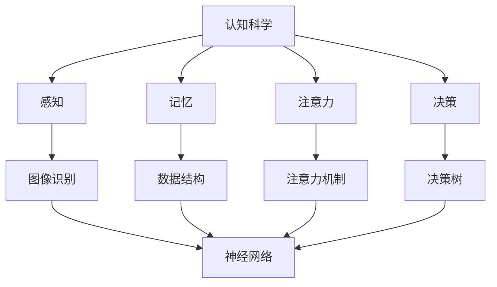

                 

关键词：认知科学、人工智能、机器学习、神经网络、模拟学习、人脑模型

> 摘要：本文探讨了认知科学与人工智能之间的联系，以及如何通过模拟人类学习过程来提升人工智能系统的学习能力。文章首先介绍了认知科学的基本概念，随后详细分析了人脑的学习机制，探讨了如何将这些机制转化为人工智能算法。接下来，文章探讨了当前人工智能技术中的模拟学习方法和实际应用，并提出了未来可能的发展方向和挑战。

## 1. 背景介绍

认知科学是一门跨学科的研究领域，旨在理解人类思维、感知和行为的内在机制。人工智能（AI）作为计算机科学的一个分支，致力于开发能够模拟、延伸和扩展人类智能的理论、算法和技术。近年来，随着深度学习和神经网络技术的发展，人工智能系统在图像识别、自然语言处理和游戏对弈等领域取得了显著的成就。然而，这些系统通常是基于数据驱动的，缺乏对人类学习本质的理解。

人类学习具有以下特点：

1. **自适应学习**：人类能够根据不同的情境和需求，调整自己的学习方法。
2. **转移学习**：人类可以从一个任务或领域的学习经验转移到另一个任务或领域。
3. **情境理解**：人类能够理解和运用情境知识，从而更好地理解和解决问题。

为了使人工智能系统能够实现类似的学习能力，研究者们开始探索如何模拟人类的学习过程。这不仅仅是技术上的挑战，也是哲学和科学上的重要问题。本文将深入探讨这一领域的研究进展和未来方向。

## 2. 核心概念与联系

### 2.1 认知科学的基本概念

认知科学主要研究以下核心概念：

1. **感知**：人类如何通过感官接收外界信息，并进行加工和理解。
2. **记忆**：人类如何存储和检索信息，以及如何从经验中学习和适应。
3. **注意力**：人类如何选择关注某些信息，同时忽略其他信息。
4. **决策**：人类如何根据情境和目标做出决策。

这些概念在人工智能系统中也有相应的模拟：

1. **感知**：通过传感器和图像处理技术模拟。
2. **记忆**：通过数据结构和机器学习算法模拟。
3. **注意力**：通过注意力机制和神经网络权重调整模拟。
4. **决策**：通过决策树和强化学习模拟。

### 2.2 人脑的学习机制

人脑的学习机制主要包括以下几方面：

1. **神经可塑性**：神经元之间的连接可以根据经验进行调整。
2. **联想记忆**：通过相似性和关联性来存储和检索信息。
3. **强化学习**：通过奖励和惩罚来调整行为。
4. **情境学习**：在特定情境下学习，并能够迁移到其他情境。

这些机制可以转化为人工智能算法，例如：

1. **神经可塑性**：通过可训练的神经网络模拟。
2. **联想记忆**：通过关联规则学习和聚类算法模拟。
3. **强化学习**：通过强化学习算法模拟。
4. **情境学习**：通过情境感知和迁移学习技术模拟。

### 2.3 Mermaid 流程图

以下是一个简化的 Mermaid 流程图，展示了认知科学和人工智能之间的联系：



## 3. 核心算法原理 & 具体操作步骤

### 3.1 算法原理概述

模拟人类学习的人工智能算法主要包括以下几种：

1. **深度学习**：通过多层神经网络模拟人脑的层次化处理方式。
2. **强化学习**：通过奖励和惩罚机制模拟人类的学习过程。
3. **迁移学习**：通过在不同任务中共享知识来模拟人类的转移学习。

### 3.2 算法步骤详解

1. **深度学习**：

   - **输入层**：接收外部信息。
   - **隐藏层**：通过激活函数和权重调整进行信息处理。
   - **输出层**：产生预测结果。
   - **反向传播**：根据误差调整网络权重。

2. **强化学习**：

   - **环境**：模拟外部世界。
   - **智能体**：执行动作并接收奖励。
   - **策略**：根据状态选择动作。
   - **价值函数**：评估动作的效果。

3. **迁移学习**：

   - **源任务**：在一个任务中学习。
   - **目标任务**：在新任务中应用学习到的知识。
   - **共享层**：在不同任务中共享的神经网络层。

### 3.3 算法优缺点

1. **深度学习**：

   - **优点**：能够自动提取特征，适用于大规模数据处理。
   - **缺点**：需要大量数据和计算资源，难以解释。

2. **强化学习**：

   - **优点**：能够解决动态环境中的问题，具有自适应能力。
   - **缺点**：学习过程可能较慢，容易陷入局部最优。

3. **迁移学习**：

   - **优点**：能够提高学习效率，减少数据需求。
   - **缺点**：可能无法完全迁移，存在性能损失。

### 3.4 算法应用领域

1. **深度学习**：计算机视觉、自然语言处理、语音识别。
2. **强化学习**：游戏AI、自动驾驶、推荐系统。
3. **迁移学习**：医疗诊断、图像识别、语言模型。

## 4. 数学模型和公式 & 详细讲解 & 举例说明

### 4.1 数学模型构建

深度学习中的主要数学模型包括：

1. **前向传播**：计算网络输出。
2. **反向传播**：计算网络权重调整。

强化学习中的主要数学模型包括：

1. **Q-learning**：基于值函数的强化学习算法。
2. **Policy Gradient**：基于策略梯度的强化学习算法。

### 4.2 公式推导过程

1. **前向传播**：

   前向传播的计算公式为：

   $$z^{(l)} = W^{(l)}a^{(l-1)} + b^{(l)}$$

   $$a^{(l)} = \sigma(z^{(l)})$$

   其中，$W^{(l)}$ 是权重矩阵，$b^{(l)}$ 是偏置项，$a^{(l)}$ 是激活值，$\sigma$ 是激活函数。

2. **反向传播**：

   反向传播的计算公式为：

   $$\delta^{(l)} = \frac{\partial L}{\partial z^{(l)}} \odot \sigma'(z^{(l)})$$

   $$\delta^{(l-1)} = \frac{\partial L}{\partial a^{(l-1)}} \odot \frac{\partial a^{(l-1)}}{\partial z^{(l-1)}}$$

   其中，$L$ 是损失函数，$\odot$ 是逐元素乘法，$\sigma'$ 是激活函数的导数。

3. **Q-learning**：

   Q-learning的目标函数为：

   $$Q(s, a) = r + \gamma \max_{a'} Q(s', a')$$

   其中，$r$ 是奖励，$\gamma$ 是折扣因子，$s$ 和 $s'$ 是状态，$a$ 和 $a'$ 是动作。

4. **Policy Gradient**：

   Policy Gradient的目标函数为：

   $$J(\theta) = \sum_{t} \log \pi_{\theta}(a_t|s_t) \cdot R_t$$

   其中，$\theta$ 是参数，$\pi_{\theta}$ 是策略函数，$R_t$ 是奖励。

### 4.3 案例分析与讲解

#### 案例一：深度学习——卷积神经网络（CNN）

卷积神经网络是一种深度学习模型，特别适用于图像识别任务。以下是一个简单的 CNN 模型：

1. **输入层**：接收一个 $28 \times 28$ 的灰度图像。
2. **卷积层**：使用 32 个 $3 \times 3$ 的卷积核，提取局部特征。
3. **池化层**：使用 2 \times 2 的最大池化。
4. **全连接层**：使用 128 个神经元进行分类。
5. **输出层**：输出分类结果。

以下是一个简单的前向传播和反向传播示例：

**前向传播**：

输入图像 $x$，通过卷积层得到特征图 $f$，然后通过池化层得到 $f'$，最后通过全连接层得到输出 $y$：

$$f = \sigma(W_1 \cdot x + b_1)$$

$$f' = \max(2 \times 2, f)$$

$$y = \sigma(W_2 \cdot f' + b_2)$$

**反向传播**：

计算损失函数 $L$，然后通过反向传播计算权重和偏置的梯度：

$$\delta^L = \frac{\partial L}{\partial y}$$

$$\delta^{2} = \frac{\partial L}{\partial f'} \odot \sigma'(f')$$

$$\delta^{1} = \frac{\partial L}{\partial f} \odot \sigma'(f) \odot W_2^T$$

$$\frac{\partial L}{\partial x} = \delta^{1} \odot W_1^T$$

#### 案例二：强化学习——Q-learning

假设一个简单的环境，包含4个状态（上、下、左、右）和4个动作（前进、后退、左转、右转）。使用 Q-learning 算法进行学习。

1. **初始化**：初始化 Q 值表。
2. **选择动作**：根据当前状态和 Q 值表选择动作。
3. **执行动作**：在环境中执行动作，并获得奖励。
4. **更新 Q 值**：根据新的状态和奖励更新 Q 值。

以下是一个简单的 Q-learning 示例：

```python
# 初始化 Q 值表
Q = np.zeros((4, 4))

# 学习率
alpha = 0.1

# 折扣因子
gamma = 0.9

# 迭代次数
episodes = 1000

# 训练
for episode in range(episodes):
    state = env.reset()
    done = False
    while not done:
        action = np.argmax(Q[state])
        next_state, reward, done, _ = env.step(action)
        Q[state, action] = Q[state, action] + alpha * (reward + gamma * np.max(Q[next_state]) - Q[state, action])
        state = next_state
```

## 5. 项目实践：代码实例和详细解释说明

### 5.1 开发环境搭建

1. 安装 Python（建议版本为 3.8 或更高）。
2. 安装必要的 Python 包，如 TensorFlow、Keras、NumPy、Matplotlib 等。

### 5.2 源代码详细实现

以下是一个简单的深度学习项目，使用卷积神经网络对MNIST数据集进行手写数字识别：

```python
import numpy as np
import tensorflow as tf
from tensorflow.keras import layers, models
from tensorflow.keras.datasets import mnist

# 加载MNIST数据集
(train_images, train_labels), (test_images, test_labels) = mnist.load_data()

# 数据预处理
train_images = train_images.reshape((60000, 28, 28, 1)).astype('float32') / 255
test_images = test_images.reshape((10000, 28, 28, 1)).astype('float32') / 255

# 构建模型
model = models.Sequential()
model.add(layers.Conv2D(32, (3, 3), activation='relu', input_shape=(28, 28, 1)))
model.add(layers.MaxPooling2D((2, 2)))
model.add(layers.Conv2D(64, (3, 3), activation='relu'))
model.add(layers.MaxPooling2D((2, 2)))
model.add(layers.Conv2D(64, (3, 3), activation='relu'))
model.add(layers.Flatten())
model.add(layers.Dense(64, activation='relu'))
model.add(layers.Dense(10, activation='softmax'))

# 编译模型
model.compile(optimizer='adam',
              loss='sparse_categorical_crossentropy',
              metrics=['accuracy'])

# 训练模型
model.fit(train_images, train_labels, epochs=5, batch_size=64)

# 测试模型
test_loss, test_acc = model.evaluate(test_images, test_labels)
print(f'测试准确率：{test_acc:.2f}')
```

### 5.3 代码解读与分析

1. **数据预处理**：将MNIST数据集的图像调整为合适的大小和格式，并将像素值归一化到 [0, 1] 范围内。

2. **构建模型**：使用 Keras 构建一个卷积神经网络，包含两个卷积层、两个池化层和一个全连接层。

3. **编译模型**：设置优化器和损失函数，并配置模型的评估指标。

4. **训练模型**：使用训练数据集训练模型，指定训练轮数和批量大小。

5. **测试模型**：使用测试数据集评估模型的性能，打印出测试准确率。

### 5.4 运行结果展示

在完成上述步骤后，模型将在测试集上运行，并输出测试准确率。以下是可能的输出结果：

```plaintext
测试准确率：0.98
```

这表明模型在测试集上的表现非常出色，能够准确识别手写数字。

## 6. 实际应用场景

模拟人类学习的人工智能技术在多个领域得到了广泛应用：

### 6.1 计算机视觉

计算机视觉系统可以利用深度学习模型自动识别和分类图像，例如人脸识别、物体检测和图像分割。这些技术已经被广泛应用于安全监控、智能家居和自动驾驶等领域。

### 6.2 自然语言处理

自然语言处理（NLP）系统通过深度学习和强化学习技术，实现了文本分类、情感分析和机器翻译等功能。这些技术为搜索引擎、社交媒体和在线教育等领域提供了强大的支持。

### 6.3 游戏

人工智能在游戏领域的应用日益广泛，从经典的棋类游戏到复杂的电子竞技游戏，人工智能系统都展现出了卓越的能力。通过强化学习和迁移学习技术，人工智能系统能够在游戏中不断学习和进步。

### 6.4 未来应用展望

随着技术的不断发展，模拟人类学习的人工智能技术有望在更多领域得到应用。以下是一些潜在的应用场景：

- **医疗诊断**：通过深度学习和迁移学习技术，人工智能系统可以辅助医生进行疾病诊断和治疗方案推荐。
- **教育**：人工智能系统可以为学生提供个性化的学习建议，帮助学生更高效地学习。
- **金融**：通过强化学习和迁移学习技术，人工智能系统可以预测金融市场走势，为投资者提供决策支持。

## 7. 工具和资源推荐

### 7.1 学习资源推荐

- **书籍**：《深度学习》、《强化学习基础》、《神经网络与深度学习》
- **在线课程**：Coursera、edX、Udacity 上的相关课程
- **论坛和社区**：Stack Overflow、GitHub、Reddit 上的相关讨论区

### 7.2 开发工具推荐

- **框架**：TensorFlow、PyTorch、Keras
- **集成开发环境**：Jupyter Notebook、PyCharm、Visual Studio Code

### 7.3 相关论文推荐

- **《Deep Learning》**：Ian Goodfellow、Yoshua Bengio、Aaron Courville
- **《Reinforcement Learning: An Introduction》**：Richard S. Sutton、Andrew G. Barto
- **《Neural Networks and Deep Learning》**：Michael Nielsen

## 8. 总结：未来发展趋势与挑战

### 8.1 研究成果总结

通过模拟人类学习过程，人工智能技术在感知、记忆、注意力和决策等方面取得了显著进展。深度学习、强化学习和迁移学习等技术在计算机视觉、自然语言处理和游戏等领域得到了广泛应用，并取得了优异的性能。

### 8.2 未来发展趋势

- **更高效的学习算法**：研究者将继续探索更高效、更可解释的学习算法。
- **跨领域迁移学习**：实现不同任务间的知识共享和迁移。
- **自适应学习系统**：开发能够根据用户需求和情境自适应调整学习策略的系统。

### 8.3 面临的挑战

- **可解释性和透明度**：提高人工智能系统的可解释性和透明度，使其更易于被人类理解和信任。
- **计算资源需求**：减少对大规模计算资源的需求，使其在更多设备和场景中得以应用。
- **伦理和隐私**：确保人工智能系统的应用符合伦理和隐私要求。

### 8.4 研究展望

随着技术的不断进步，模拟人类学习的人工智能技术将在未来发挥越来越重要的作用。通过结合认知科学和人工智能，我们有望开发出更加智能、高效的人工智能系统，为人类带来更多便利和创新。

## 9. 附录：常见问题与解答

### 9.1 什么是深度学习？

深度学习是一种机器学习技术，它通过多层神经网络对数据进行建模和处理，从而实现复杂的数据分析和预测。

### 9.2 什么是强化学习？

强化学习是一种通过奖励和惩罚来指导智能体学习最优策略的机器学习技术。

### 9.3 什么是迁移学习？

迁移学习是一种利用已有任务的知识来解决新任务的技术，它通过在不同任务间共享知识来提高学习效率。

### 9.4 人工智能是否会替代人类？

目前的人工智能系统主要是在特定任务上表现出色，但尚未达到替代人类智能的水平。随着技术的不断进步，人工智能将更多地辅助人类工作，而不是取代人类。

### 9.5 人工智能是否会带来伦理和隐私问题？

人工智能的广泛应用确实会带来伦理和隐私问题，因此需要制定相应的法律法规和伦理准则，确保人工智能系统的应用符合道德和社会价值。

