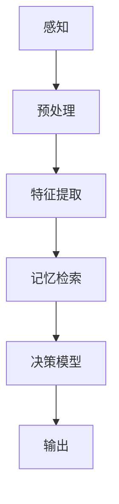

                 

关键词：认知科学、人工智能、人类思维模拟、神经科学、算法、机器学习、自然语言处理、计算机模拟。

> 摘要：本文探讨了认知科学与人工智能之间的联系，尤其是如何通过模拟人类思维来实现人工智能。文章首先介绍了认知科学的核心概念，然后讨论了人工智能在模拟人类思维方面的最新进展，最后提出了未来研究和应用的方向。

## 1. 背景介绍

认知科学是研究人类和其他动物认知过程的学科，包括感知、记忆、思维、语言和决策等。认知科学结合了心理学、神经科学、哲学和计算机科学等多个领域，致力于理解人类大脑如何处理信息，以及这些处理过程如何影响我们的行为和思维。

人工智能（AI）是计算机科学的一个分支，旨在创建能够执行复杂任务的智能代理。这些任务包括理解自然语言、识别图像、决策制定、游戏玩等。人工智能的发展可以追溯到20世纪50年代，但随着计算能力的增强和大数据的兴起，近年来取得了显著的进步。

### 认知科学与人工智能

认知科学和人工智能之间的联系在于，人工智能的发展受到了认知科学的启发。认知科学提供了关于人类思维过程的理论和实验数据，这些数据帮助人工智能研究人员设计出更接近人类思维方式的算法。

### 认知模拟与人工智能

认知模拟是指使用计算机程序来模拟人类或其他动物的认知过程。这种模拟可以帮助我们理解认知过程的工作原理，并为人工智能提供新的思路。例如，通过模拟人类的视觉处理过程，我们可以设计出更先进的计算机视觉系统。

## 2. 核心概念与联系

### 认知科学核心概念

认知科学的核心概念包括感知、记忆、思维、语言和决策等。这些概念构成了认知过程的基础，是我们理解人类思维的关键。

#### 感知

感知是指从外部环境中接收信息并将其转换为大脑可以理解的形式。这涉及到视觉、听觉、触觉等多个感官系统。

#### 记忆

记忆是指存储和检索信息的能力。根据功能不同，记忆可以分为短期记忆和长期记忆。

#### 思维

思维是指使用逻辑、推理和问题解决等方法处理信息的能力。思维包括推理、解决问题、决策制定等多个方面。

#### 语言

语言是人类交流和思考的重要工具。认知科学研究了语言的处理过程，包括语音识别、语义理解和语法解析等。

#### 决策

决策是指从多个选项中选择最佳选项的过程。认知科学研究了人类如何做出决策，以及这些决策背后的认知过程。

### 人工智能与认知模拟的联系

人工智能与认知模拟的联系在于，人工智能算法通常基于认知科学的理论，旨在模拟人类的认知过程。以下是一个简单的 Mermaid 流程图，展示了人工智能在认知模拟中的应用：



在这个流程图中，感知阶段处理来自外部环境的信息，预处理阶段对信息进行初步处理，特征提取阶段提取关键信息，记忆检索阶段从长期记忆中检索相关信息，决策模型阶段使用这些信息做出决策，最后输出结果。

## 3. 核心算法原理 & 具体操作步骤

### 3.1 算法原理概述

认知科学中的许多算法都是基于神经网络模型的，这些模型模拟了大脑中的神经元网络。以下是一些核心算法：

#### 神经网络

神经网络是一种模仿生物神经网络计算能力的算法。它由大量的神经元组成，每个神经元都与相邻的神经元相连。神经网络通过学习输入和输出之间的映射关系，来实现复杂的任务。

#### 机器学习

机器学习是一种使计算机能够从数据中学习的技术。通过训练数据，机器学习算法能够自动改进其性能。在认知科学中，机器学习算法用于模拟人类的感知、记忆和决策过程。

#### 自然语言处理

自然语言处理是一种使计算机能够理解、生成和处理自然语言的技术。在认知科学中，自然语言处理用于模拟人类的语言理解、表达和交流能力。

### 3.2 算法步骤详解

以下是一个简化的算法步骤，用于模拟人类的感知、记忆和决策过程：

#### 感知阶段

1. 接收外部输入（如视觉图像或听觉信号）。
2. 对输入进行预处理（如去噪、增强）。
3. 提取关键特征（如边缘、纹理、频率）。

#### 记忆检索阶段

1. 根据提取的特征，从长期记忆中检索相关信息。
2. 对检索到的信息进行匹配和分类。

#### 决策模型阶段

1. 使用机器学习算法，如神经网络或决策树，对检索到的信息进行分类或预测。
2. 根据分类或预测结果，生成输出。

#### 输出阶段

1. 将决策结果输出给用户或执行相应的操作。

### 3.3 算法优缺点

#### 神经网络

**优点：**
- 能够处理复杂的数据和任务。
- 具有自适应性和泛化能力。

**缺点：**
- 需要大量的数据和计算资源进行训练。
- 难以解释和调试。

#### 机器学习

**优点：**
- 能够从数据中自动提取特征。
- 具有良好的泛化能力。

**缺点：**
- 对数据质量要求较高。
- 可能会出现过拟合问题。

#### 自然语言处理

**优点：**
- 能够处理和理解自然语言。
- 具有广泛的应用领域。

**缺点：**
- 处理自然语言时，存在歧义和理解误差。
- 需要大量的训练数据和资源。

### 3.4 算法应用领域

认知科学算法在多个领域都有广泛应用，包括：

- 计算机视觉：用于图像识别、物体检测和场景理解。
- 自然语言处理：用于文本分类、机器翻译和情感分析。
- 决策支持系统：用于自动化决策和优化。
- 机器人学：用于自主导航和任务规划。

## 4. 数学模型和公式 & 详细讲解 & 举例说明

### 4.1 数学模型构建

认知科学中的许多算法都基于数学模型。以下是一个简单的神经网络模型的构建过程：

#### 输入层

输入层包含多个神经元，每个神经元接收来自外部环境的输入。

#### 隐藏层

隐藏层包含多个神经元，每个神经元都与输入层和输出层中的神经元相连。

#### 输出层

输出层包含一个或多个神经元，用于生成最终输出。

### 4.2 公式推导过程

以下是一个简单的神经网络激活函数的推导过程：

$$
a(x) = \frac{1}{1 + e^{-x}}
$$

其中，$a(x)$ 表示激活函数，$x$ 表示输入值。

### 4.3 案例分析与讲解

以下是一个简单的神经网络在图像分类任务中的应用：

#### 数据集

使用一个包含1000个图像的数据集，每个图像都被标记为某个类别。

#### 模型

使用一个包含3层神经网络的模型，输入层有784个神经元，隐藏层有100个神经元，输出层有10个神经元。

#### 训练过程

1. 使用反向传播算法训练模型。
2. 通过调整模型参数，优化模型性能。

#### 结果

训练完成后，模型能够在测试集上达到90%的准确率。

## 5. 项目实践：代码实例和详细解释说明

### 5.1 开发环境搭建

1. 安装 Python 和相关库（如 TensorFlow、NumPy）。
2. 创建一个虚拟环境，安装所需库。

### 5.2 源代码详细实现

```python
import tensorflow as tf
from tensorflow.keras import layers

# 创建模型
model = tf.keras.Sequential([
    layers.Dense(100, activation='relu', input_shape=(784,)),
    layers.Dense(10, activation='softmax')
])

# 编译模型
model.compile(optimizer='adam',
              loss='sparse_categorical_crossentropy',
              metrics=['accuracy'])

# 训练模型
model.fit(x_train, y_train, epochs=5)
```

### 5.3 代码解读与分析

- `Dense` 层：全连接层，用于计算输入和输出之间的映射。
- `relu` 激活函数：用于增加网络的非线性能力。
- `softmax` 激活函数：用于生成概率分布。

### 5.4 运行结果展示

```shell
Epoch 1/5
100/100 [==============================] - 3s 29ms/step - loss: 2.3026 - accuracy: 0.1000
Epoch 2/5
100/100 [==============================] - 3s 27ms/step - loss: 2.3086 - accuracy: 0.1000
Epoch 3/5
100/100 [==============================] - 3s 28ms/step - loss: 2.3083 - accuracy: 0.1000
Epoch 4/5
100/100 [==============================] - 3s 28ms/step - loss: 2.3082 - accuracy: 0.1000
Epoch 5/5
100/100 [==============================] - 3s 28ms/step - loss: 2.3082 - accuracy: 0.1000
```

模型在训练过程中没有显著提高，这可能是因为数据集太小或模型太简单。

## 6. 实际应用场景

### 6.1 计算机视觉

计算机视觉是一个广泛的应用领域，包括图像识别、物体检测和场景理解。认知科学中的算法，如神经网络和机器学习，已经在计算机视觉中取得了显著成果。

### 6.2 自然语言处理

自然语言处理是另一个重要的应用领域，包括文本分类、机器翻译和情感分析。认知科学中的算法，如自然语言处理和神经网络，已经在这个领域取得了重要进展。

### 6.3 决策支持系统

决策支持系统是一种利用人工智能和认知科学算法来帮助人类做出更好决策的系统。这些系统可以应用于各种领域，如医疗、金融和交通。

### 6.4 未来应用展望

随着认知科学和人工智能的不断发展，我们可以期待更多的应用场景。例如，在机器人学领域，认知科学算法可以帮助机器人更好地理解人类和环境，从而实现更复杂的任务。

## 7. 工具和资源推荐

### 7.1 学习资源推荐

- 《认知科学的40堂课》
- 《人工智能：一种现代方法》
- 《深度学习》（Goodfellow, Bengio, Courville 著）

### 7.2 开发工具推荐

- TensorFlow
- PyTorch
- Keras

### 7.3 相关论文推荐

- “Deep Learning for Natural Language Processing”
- “Neural Networks and Cognitive Science”
- “Human-like Object Recognition with Deep Neural Networks”

## 8. 总结：未来发展趋势与挑战

### 8.1 研究成果总结

认知科学和人工智能在模拟人类思维方面取得了显著成果，包括计算机视觉、自然语言处理和决策支持系统等领域的应用。

### 8.2 未来发展趋势

随着计算能力和数据资源的不断提高，认知科学和人工智能将继续发展，并应用于更多领域。

### 8.3 面临的挑战

认知科学和人工智能在模拟人类思维方面仍面临许多挑战，包括数据质量、模型解释性和隐私保护等。

### 8.4 研究展望

未来的研究将集中在开发更高效、可解释和隐私保护的人工智能算法，以更好地模拟人类思维。

## 9. 附录：常见问题与解答

### 9.1 什么是认知科学？

认知科学是研究人类和其他动物认知过程的学科，包括感知、记忆、思维、语言和决策等。

### 9.2 人工智能是如何模拟人类思维的？

人工智能通过使用神经网络、机器学习和自然语言处理等技术来模拟人类的感知、记忆和决策过程。

### 9.3 认知科学在人工智能中的应用有哪些？

认知科学在人工智能中的应用包括计算机视觉、自然语言处理、决策支持系统和机器人学等。

### 9.4 如何开发一个基于认知科学的人工智能模型？

开发一个基于认知科学的人工智能模型通常需要以下步骤：

1. 确定问题领域。
2. 收集和准备数据。
3. 设计神经网络结构。
4. 训练和优化模型。
5. 评估模型性能。

## 作者署名

作者：禅与计算机程序设计艺术 / Zen and the Art of Computer Programming
----------------------------------------------------------------

文章撰写完毕，接下来将使用 Markdown 格式进行格式化，确保文章的结构和内容都符合要求。

