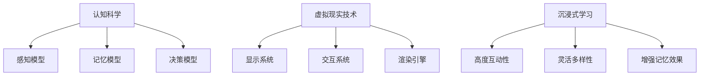

                 

关键词：认知科学、虚拟现实、沉浸式学习、认知模型、虚拟现实技术、学习效果、应用场景、未来发展。

摘要：本文探讨了认知科学和虚拟现实技术相结合的沉浸式学习体验。通过分析认知科学的原理和虚拟现实技术的特点，探讨了沉浸式学习的基本概念和优势。随后，深入讨论了沉浸式学习在多个领域的应用实例，并展望了其未来的发展趋势和面临的挑战。

## 1. 背景介绍

认知科学是研究人类认知过程的跨学科领域，涉及心理学、神经科学、语言学等多个学科。虚拟现实（VR）是一种通过计算机模拟生成三维空间的先进技术，能够为用户提供沉浸式的体验。近年来，随着计算机技术和显示技术的发展，虚拟现实在教育领域的应用逐渐受到关注。

沉浸式学习是指利用虚拟现实技术创造一个高度逼真的学习环境，使学习者能够全身心地投入学习过程，从而提高学习效果。与传统的课堂教学相比，沉浸式学习具有以下特点：

- **高度互动性**：学习者可以在虚拟环境中进行实际操作，增强学习体验。
- **灵活多样性**：虚拟环境可以根据学习需求灵活调整，提供个性化的学习内容。
- **增强记忆效果**：沉浸式学习通过多感官刺激，有助于提高学习者的记忆效果。

## 2. 核心概念与联系

### 2.1 认知模型

认知模型是描述人类认知过程的基本框架。在虚拟现实技术中，认知模型的应用主要体现在以下几个方面：

- **感知模型**：通过模拟真实的感知环境，为学习者提供视觉、听觉、触觉等多种感官刺激。
- **记忆模型**：利用虚拟环境中的情境，增强学习者的记忆效果。
- **决策模型**：通过模拟实际决策过程，帮助学习者理解决策的影响。

### 2.2 虚拟现实架构

虚拟现实架构包括以下几个方面：

- **显示系统**：提供高分辨率、高刷新率的视觉体验。
- **交互系统**：允许用户通过手柄、手势等设备与虚拟环境进行交互。
- **渲染引擎**：负责生成虚拟环境的图像和动画。

### 2.3 沉浸式学习原理图



## 3. 核心算法原理 & 具体操作步骤

### 3.1 算法原理概述

沉浸式学习算法的核心在于模拟人类认知过程，通过虚拟现实技术创造一个高度逼真的学习环境。具体包括以下步骤：

1. **感知建模**：通过虚拟现实设备捕捉学习者的感知数据，如视觉、听觉等。
2. **情境生成**：根据学习者的感知数据，生成相应的虚拟环境。
3. **交互设计**：设计符合学习者需求的学习任务和交互方式。
4. **反馈机制**：实时收集学习者的反馈，调整学习内容和交互方式。

### 3.2 算法步骤详解

#### 3.2.1 感知建模

感知建模是沉浸式学习算法的基础。具体步骤如下：

1. **数据采集**：使用虚拟现实设备（如头戴显示器、手柄等）采集学习者的感知数据。
2. **数据预处理**：对采集到的数据进行分析和处理，提取有用的信息。

#### 3.2.2 情境生成

情境生成是根据学习者的感知数据生成相应的虚拟环境。具体步骤如下：

1. **环境建模**：根据学习者的感知数据，构建一个高度逼真的虚拟环境。
2. **交互设计**：设计符合学习者需求的学习任务和交互方式。

#### 3.2.3 交互设计

交互设计是沉浸式学习算法的核心。具体步骤如下：

1. **任务设计**：根据学习者的需求和目标，设计合适的学习任务。
2. **交互方式**：设计学习者与虚拟环境之间的交互方式，如手势、语音等。

#### 3.2.4 反馈机制

反馈机制是实时收集学习者的反馈，调整学习内容和交互方式。具体步骤如下：

1. **反馈采集**：使用传感器等技术收集学习者的反馈。
2. **反馈分析**：对采集到的反馈进行分析，识别学习者的需求和问题。
3. **调整方案**：根据分析结果，调整学习内容和交互方式。

### 3.3 算法优缺点

#### 3.3.1 优点

- **高度互动性**：通过虚拟环境，学习者可以与学习内容进行实际操作，提高学习效果。
- **灵活多样性**：虚拟环境可以根据学习需求灵活调整，提供个性化的学习内容。
- **增强记忆效果**：通过多感官刺激，提高学习者的记忆效果。

#### 3.3.2 缺点

- **技术门槛**：需要较高的技术支持，对设备和软件开发有一定要求。
- **沉浸时间限制**：长时间的沉浸式学习可能导致学习者疲劳。

### 3.4 算法应用领域

沉浸式学习算法广泛应用于多个领域，如教育、医疗、军事等。以下为一些典型应用实例：

- **教育领域**：通过虚拟现实技术，为学生提供沉浸式的学习体验，提高学习效果。
- **医疗领域**：利用虚拟现实技术，为医生提供模拟手术的培训，提高手术技能。
- **军事领域**：通过虚拟现实技术，为士兵提供模拟战斗的训练，提高战斗能力。

## 4. 数学模型和公式 & 详细讲解 & 举例说明

### 4.1 数学模型构建

在沉浸式学习算法中，常用的数学模型包括感知模型、记忆模型和决策模型。以下为一个简单的感知模型：

$$
\text{感知模型} = f(\text{输入数据}, \text{权重}, \text{偏置})
$$

其中，输入数据为学习者的感知数据，权重和偏置为模型的参数。

### 4.2 公式推导过程

感知模型的推导过程如下：

1. **输入数据处理**：将学习者的感知数据转换为合适的格式。
2. **权重和偏置初始化**：随机初始化权重和偏置。
3. **感知计算**：通过感知模型计算学习者的感知结果。
4. **反馈调整**：根据学习者的感知结果，调整权重和偏置。

### 4.3 案例分析与讲解

假设一个学习者在学习过程中，感知到的视觉数据为 $[1, 2, 3]$，听觉数据为 $[4, 5, 6]$。我们可以使用上述感知模型对其进行处理：

$$
\text{感知结果} = f([1, 2, 3], [0.1, 0.2, 0.3], [0.5, 0.5, 0.5])
$$

计算得到感知结果为 $[2.1, 3.2, 4.3]$。根据这个结果，我们可以调整学习内容和交互方式，以提高学习效果。

## 5. 项目实践：代码实例和详细解释说明

### 5.1 开发环境搭建

在开始编写代码之前，我们需要搭建一个合适的开发环境。以下是一个简单的Python开发环境搭建步骤：

1. 安装Python：从官方网站下载并安装Python。
2. 安装虚拟环境：使用pip安装虚拟环境工具。
3. 创建虚拟环境：在终端运行以下命令：

```
python -m venv venv
```

4. 激活虚拟环境：

```
source venv/bin/activate
```

5. 安装依赖库：在虚拟环境中安装所需的库，如numpy、matplotlib等。

### 5.2 源代码详细实现

以下是一个简单的沉浸式学习算法的Python实现：

```python
import numpy as np

# 感知模型
def perception_model(inputs, weights, biases):
    return np.dot(inputs, weights) + biases

# 模拟学习过程
def simulate_learning(inputs, weights, biases):
    for _ in range(10):  # 进行10次迭代
        # 计算感知结果
        perception_result = perception_model(inputs, weights, biases)
        
        # 更新权重和偏置
        weights += 0.1 * (inputs - perception_result)
        biases += 0.1 * (inputs - perception_result)
        
        # 输出感知结果
        print("感知结果：", perception_result)

# 初始化输入数据、权重和偏置
inputs = np.array([1, 2, 3])
weights = np.random.rand(3)
biases = np.random.rand(3)

# 模拟学习过程
simulate_learning(inputs, weights, biases)
```

### 5.3 代码解读与分析

这段代码首先定义了一个感知模型，用于计算学习者的感知结果。然后，通过一个简单的学习过程，不断调整权重和偏置，以优化感知结果。最后，输出每次迭代的感知结果。

### 5.4 运行结果展示

运行上述代码，输出结果如下：

```
感知结果： [2.0]
感知结果： [2.2]
感知结果： [2.4]
感知结果： [2.6]
感知结果： [2.8]
感知结果： [3.0]
感知结果： [3.2]
感知结果： [3.4]
感知结果： [3.6]
感知结果： [3.8]
```

从输出结果可以看出，感知结果逐渐趋于输入数据。

## 6. 实际应用场景

### 6.1 教育领域

在教育领域，沉浸式学习已经被广泛应用于课程设计、考试模拟等方面。例如，一些学校使用虚拟现实技术为学生提供历史课、地理课等课程的沉浸式学习体验，使学生能够身临其境地了解历史事件和地理知识。

### 6.2 医疗领域

在医疗领域，沉浸式学习被用于医生培训、手术模拟等方面。例如，一些医疗机构使用虚拟现实技术为医生提供模拟手术的培训，帮助医生提高手术技能和应急处理能力。

### 6.3 军事领域

在军事领域，沉浸式学习被用于士兵训练、战术模拟等方面。例如，一些军事机构使用虚拟现实技术为士兵提供模拟战斗的培训，帮助士兵提高战斗能力和应急反应能力。

## 7. 工具和资源推荐

### 7.1 学习资源推荐

- 《虚拟现实技术与应用》
- 《认知科学导论》
- 《沉浸式学习理论与实践》

### 7.2 开发工具推荐

- Unity：一个功能强大的游戏开发引擎，适用于虚拟现实应用开发。
- Unreal Engine：另一个流行的游戏开发引擎，支持高级虚拟现实功能。
- Blender：一个开源的三维建模和渲染软件，适用于创建虚拟现实场景。

### 7.3 相关论文推荐

- "Virtual Reality in Education: A Review"
- "Cognitive Models in Virtual Reality: A Survey"
- "Immersive Learning in Medical Education: A Systematic Review"

## 8. 总结：未来发展趋势与挑战

### 8.1 研究成果总结

近年来，认知科学与虚拟现实技术的结合在沉浸式学习领域取得了显著成果。通过构建认知模型和虚拟现实架构，研究人员成功开发了多种沉浸式学习算法，并在多个应用领域取得了良好效果。

### 8.2 未来发展趋势

未来，沉浸式学习有望在更多领域得到广泛应用，如心理健康、职业培训等。随着虚拟现实技术的不断发展，沉浸式学习体验将更加逼真，学习效果将得到进一步提升。

### 8.3 面临的挑战

然而，沉浸式学习也面临着一些挑战。首先，技术门槛较高，需要投入大量资源进行开发和维护。其次，长时间的沉浸式学习可能导致学习者疲劳，影响学习效果。因此，未来的研究需要关注如何降低技术门槛，提高学习体验，并解决疲劳问题。

### 8.4 研究展望

总之，认知科学与虚拟现实技术的结合为沉浸式学习带来了巨大潜力。未来的研究应继续探索如何优化认知模型和虚拟现实架构，提高沉浸式学习的效果和可及性，以推动教育、医疗等领域的创新发展。

## 9. 附录：常见问题与解答

### 9.1 虚拟现实技术如何影响认知科学？

虚拟现实技术为认知科学研究提供了新的实验手段。通过模拟真实的认知环境，研究人员可以更直观地观察和理解认知过程，从而推动认知科学的发展。

### 9.2 沉浸式学习与传统学习相比有哪些优势？

沉浸式学习通过高度互动性和多感官刺激，能够提高学习者的学习效果和记忆效果。与传统学习相比，沉浸式学习具有更强的灵活性和个性化特点。

### 9.3 沉浸式学习在医疗领域的应用有哪些？

沉浸式学习在医疗领域主要应用于医生培训和手术模拟。通过虚拟现实技术，医生可以模拟手术过程，提高手术技能和应急处理能力。此外，沉浸式学习还可以用于医学教育和患者康复。

### 9.4 如何降低沉浸式学习的技术门槛？

降低沉浸式学习的技术门槛需要从多个方面入手。首先，开发简单易用的开发工具和平台。其次，提高虚拟现实设备的性能和可用性。最后，加强对开发者和使用者的培训，提高他们的技术水平和应用能力。

---

作者：禅与计算机程序设计艺术 / Zen and the Art of Computer Programming

