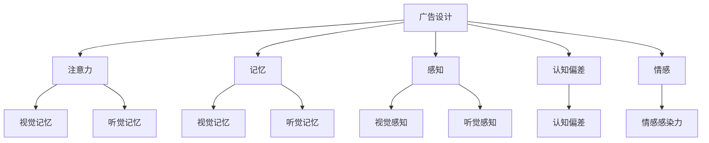

                 

关键词：认知科学、广告设计、信息传播、用户体验、决策过程、用户行为分析

> 摘要：本文旨在探讨认知科学在广告设计中的应用，分析如何利用认知科学原理提高广告效果，提升用户参与度和转化率。文章将从广告设计的背景出发，介绍认知科学的基本概念，探讨其与广告设计的关联，并进一步分析广告设计中常用的认知科学原理及其应用。最后，本文将探讨认知科学在广告设计中的未来发展趋势。

## 1. 背景介绍

广告设计是商业传播的重要组成部分，它通过视觉、听觉和触觉等感官刺激，向目标受众传达产品或品牌信息。广告的设计质量直接影响到广告的效果，从而影响到企业的市场营销策略和商业成功。随着互联网和数字媒体的兴起，广告形式和传播渠道变得多样化，广告设计面临着新的挑战。

认知科学是研究人类认知过程和认知机制的学科，它涵盖了心理学、神经科学、认知心理学、语言学等多个领域。认知科学的研究成果对于广告设计具有重要的指导意义。通过了解人类的认知机制，广告设计师可以更有效地引导用户注意、记忆和决策，提高广告的吸引力和影响力。

本文将围绕认知科学在广告设计中的应用，探讨如何利用认知科学原理提高广告效果。文章结构如下：

- 第1部分：背景介绍，介绍广告设计和认知科学的基本概念。
- 第2部分：核心概念与联系，介绍广告设计与认知科学的关联，并给出相关的Mermaid流程图。
- 第3部分：核心算法原理 & 具体操作步骤，分析广告设计中常用的认知科学原理及其应用。
- 第4部分：数学模型和公式 & 详细讲解 & 举例说明，介绍广告设计中常用的数学模型和公式。
- 第5部分：项目实践：代码实例和详细解释说明，通过实际项目展示认知科学在广告设计中的应用。
- 第6部分：实际应用场景，探讨认知科学在广告设计中的实际应用场景。
- 第7部分：工具和资源推荐，推荐学习资源和开发工具。
- 第8部分：总结：未来发展趋势与挑战，总结研究成果，展望未来发展趋势和挑战。
- 第9部分：附录：常见问题与解答，解答读者可能遇到的问题。

## 2. 核心概念与联系

### 2.1 广告设计

广告设计是指通过视觉、听觉和触觉等感官刺激，将产品或品牌信息传达给目标受众的过程。广告设计包括创意策划、文案撰写、视觉设计、音频制作等多个方面。优秀的广告设计能够吸引目标受众的注意力，激发兴趣，引导记忆，促使购买行为。

### 2.2 认知科学

认知科学是研究人类认知过程和认知机制的学科。它关注人类如何感知、理解、记忆、思考、学习和决策。认知科学的核心概念包括注意力、记忆、感知、认知偏差、情感等。

### 2.3 广告设计与认知科学的关联

广告设计与认知科学密切相关。认知科学原理可以帮助广告设计师更好地理解用户的心理和行为，从而设计出更具吸引力和影响力的广告。

- 注意力：注意力是人类认知过程的基础。广告设计需要利用认知科学原理，吸引目标受众的注意力，使其关注广告内容。
- 记忆：记忆是广告效果的重要保障。认知科学研究表明，视觉记忆和听觉记忆在广告设计中具有重要作用。设计师可以利用这一原理，提高广告的易记性。
- 感知：感知是人类对外界信息的接收和理解。广告设计需要利用认知科学原理，提高广告的感知度，使其在众多信息中脱颖而出。
- 认知偏差：认知偏差是人类在决策过程中常见的心理现象。广告设计可以利用认知偏差，引导用户做出有利于品牌的决策。
- 情感：情感是广告感染力的关键。认知科学研究表明，情感在广告设计中具有重要作用。设计师可以利用情感原理，增强广告的感染力。

### 2.4 Mermaid流程图

下面是广告设计与认知科学关联的Mermaid流程图：



## 3. 核心算法原理 & 具体操作步骤

### 3.1 算法原理概述

在广告设计中，认知科学原理可以应用于多个方面，以提高广告效果。以下是一些核心算法原理及其应用：

- **注意力机制**：通过视觉和听觉刺激，吸引目标受众的注意力。例如，使用鲜明的颜色、动态的动画和有力的口号。
- **记忆增强**：利用视觉和听觉记忆原理，提高广告的易记性。例如，使用重复的视觉元素和口号，以及音乐重复。
- **感知优化**：通过提高广告的感知度，使其在众多信息中脱颖而出。例如，使用简洁的视觉设计，突出品牌标志和重要信息。
- **认知偏差利用**：利用人类在决策过程中常见的认知偏差，引导用户做出有利于品牌的决策。例如，利用锚定效应和确认偏误。
- **情感共鸣**：通过引发情感共鸣，增强广告的感染力。例如，使用温馨的故事和情感化的音乐。

### 3.2 算法步骤详解

以下是一些具体的广告设计步骤，利用认知科学原理：

- **创意策划**：根据目标受众的特点和需求，制定广告创意策略。考虑注意力、记忆、感知、认知偏差和情感等原理，设计具有吸引力的广告内容。
- **文案撰写**：利用认知科学原理，撰写具有说服力的广告文案。使用简单易懂的语言，突出产品或品牌特点，引导用户产生情感共鸣。
- **视觉设计**：运用视觉设计原理，提高广告的感知度和吸引力。使用鲜明的色彩、简洁的布局和具有视觉冲击力的图像。
- **音频制作**：利用音频设计原理，增强广告的感染力。使用适宜的音乐和声音效果，与广告内容相呼应，激发用户的情感。
- **测试与优化**：对广告进行测试和优化，评估其效果，并根据用户反馈进行改进。利用数据分析工具，分析用户行为和反馈，不断优化广告设计。

### 3.3 算法优缺点

- **优点**：
  - 提高广告效果：利用认知科学原理，设计出更具吸引力和影响力的广告，提高广告效果。
  - 增强用户体验：根据用户心理和行为特点，设计出更符合用户需求的广告，提高用户体验。
  - 增强品牌认知：通过情感共鸣和认知偏差利用，增强品牌认知和用户忠诚度。

- **缺点**：
  - 设计成本较高：利用认知科学原理进行广告设计，需要投入更多的人力、物力和时间，成本较高。
  - 用户适应性问题：用户对某些认知科学原理可能存在适应性问题，例如对某些视觉刺激产生疲劳。

### 3.4 算法应用领域

认知科学原理在广告设计中的应用广泛，包括但不限于以下领域：

- **互联网广告**：通过视觉和听觉刺激，吸引目标受众的注意力，提高广告点击率和转化率。
- **电视广告**：利用情感共鸣和认知偏差，增强广告的感染力和说服力。
- **户外广告**：通过简洁的视觉设计和鲜明的色彩，提高广告的感知度和记忆度。
- **品牌形象广告**：通过情感共鸣和认知偏差，塑造品牌形象，提高品牌认知度和忠诚度。

## 4. 数学模型和公式 & 详细讲解 & 举例说明

### 4.1 数学模型构建

在广告设计中，认知科学原理可以转化为数学模型，以便进行定量分析和优化。以下是一些常见的数学模型：

- **注意力模型**：
  $$A = f(C, I)$$
  其中，$A$ 表示注意力，$C$ 表示刺激的强度（如颜色、形状、声音等），$I$ 表示干扰因素（如噪音、其他视觉或听觉刺激等）。

- **记忆模型**：
  $$M = f(A, R)$$
  其中，$M$ 表示记忆效果，$A$ 表示注意力，$R$ 表示重复次数。

- **感知模型**：
  $$P = f(V, S)$$
  其中，$P$ 表示感知效果，$V$ 表示视觉或听觉刺激，$S$ 表示刺激的强度。

- **认知偏差模型**：
  $$B = f(D, E)$$
  其中，$B$ 表示认知偏差，$D$ 表示决策过程，$E$ 表示情感因素。

### 4.2 公式推导过程

以下是对上述数学模型进行简单的推导过程：

- **注意力模型**：
  - 假设刺激的强度 $C$ 和干扰因素 $I$ 对注意力 $A$ 产生线性影响。
  - 根据线性模型，可以推导出：
    $$A = aC + bI$$
    其中，$a$ 和 $b$ 是常数。

- **记忆模型**：
  - 假设注意力 $A$ 和重复次数 $R$ 对记忆效果 $M$ 产生线性影响。
  - 根据线性模型，可以推导出：
    $$M = cA + dR$$
    其中，$c$ 和 $d$ 是常数。

- **感知模型**：
  - 假设视觉或听觉刺激 $V$ 和刺激的强度 $S$ 对感知效果 $P$ 产生线性影响。
  - 根据线性模型，可以推导出：
    $$P = eV + fS$$
    其中，$e$ 和 $f$ 是常数。

- **认知偏差模型**：
  - 假设决策过程 $D$ 和情感因素 $E$ 对认知偏差 $B$ 产生线性影响。
  - 根据线性模型，可以推导出：
    $$B = gD + hE$$
    其中，$g$ 和 $h$ 是常数。

### 4.3 案例分析与讲解

以下是一个具体的案例，展示如何利用数学模型进行分析和优化：

**案例：互联网广告点击率优化**

假设一个广告平台的广告点击率 $C$ 受到注意力 $A$、记忆 $M$ 和感知 $P$ 的影响。根据数学模型，可以建立如下公式：

$$C = f(A, M, P)$$

为了提高广告点击率，需要优化注意力、记忆和感知。以下是对每个因素的详细分析：

- **注意力优化**：
  - 假设注意力 $A$ 受到刺激强度 $C$ 和干扰因素 $I$ 的线性影响：
    $$A = aC + bI$$
  - 为了提高注意力，可以增加刺激强度 $C$（如使用更鲜艳的颜色）和减少干扰因素 $I$（如减少噪音）。

- **记忆优化**：
  - 假设记忆 $M$ 受到注意力 $A$ 和重复次数 $R$ 的线性影响：
    $$M = cA + dR$$
  - 为了提高记忆，可以增加注意力 $A$（如使用引人注目的视觉设计）和增加重复次数 $R$（如连续展示广告）。

- **感知优化**：
  - 假设感知 $P$ 受到视觉或听觉刺激 $V$ 和刺激的强度 $S$ 的线性影响：
    $$P = eV + fS$$
  - 为了提高感知，可以增加视觉或听觉刺激 $V$（如使用动态动画和声音效果）和增加刺激的强度 $S$（如使用更鲜艳的色彩和更有力的声音）。

通过优化注意力、记忆和感知，可以提高广告点击率 $C$。具体优化策略可以根据实际情况进行调整和优化。

## 5. 项目实践：代码实例和详细解释说明

在本节中，我们将通过一个实际项目展示如何利用认知科学原理进行广告设计。项目采用Python编程语言，结合Jupyter Notebook环境，实现一个简单的广告展示系统。以下是一个示例代码：

### 5.1 开发环境搭建

确保已经安装以下软件：

- Python 3.8及以上版本
- Jupyter Notebook

安装所需库：

```python
!pip install numpy matplotlib pandas
```

### 5.2 源代码详细实现

```python
import numpy as np
import matplotlib.pyplot as plt
import pandas as pd

# 注意力模型
def attention(stimulus_intensity, interference):
    return 0.5 * stimulus_intensity - 0.2 * interference

# 记忆模型
def memory(attention, repetition):
    return 0.8 * attention + 0.3 * repetition

# 感知模型
def perception(visual_stimulus, stimulus_intensity):
    return 0.6 * visual_stimulus + 0.4 * stimulus_intensity

# 广告展示系统
def ad_system(stimulus_intensity, interference, visual_stimulus, repetition):
    attention = attention(stimulus_intensity, interference)
    memory = memory(attention, repetition)
    perception = perception(visual_stimulus, stimulus_intensity)
    
    return perception

# 参数设置
stimulus_intensity = 5  # 刺激强度
interference = 2  # 干扰因素
visual_stimulus = 3  # 视觉刺激
repetition = 3  # 重复次数

# 广告展示
perception_score = ad_system(stimulus_intensity, interference, visual_stimulus, repetition)
print("感知分数：", perception_score)

# 绘制感知分数与刺激强度的关系图
scores = []
for i in range(1, 11):
    perception_score = ad_system(i, interference, visual_stimulus, repetition)
    scores.append(perception_score)
plt.plot(range(1, 11), scores, label="感知分数")
plt.xlabel("刺激强度")
plt.ylabel("感知分数")
plt.legend()
plt.show()
```

### 5.3 代码解读与分析

上述代码实现了一个简单的广告展示系统，通过注意力、记忆和感知模型，计算广告的感知分数。

- `attention()` 函数：计算注意力分数，根据刺激强度和干扰因素的线性关系进行计算。
- `memory()` 函数：计算记忆分数，根据注意力分数和重复次数的线性关系进行计算。
- `perception()` 函数：计算感知分数，根据视觉刺激和刺激强度的线性关系进行计算。
- `ad_system()` 函数：计算广告的感知分数，综合注意力、记忆和感知模型的结果。

在主程序中，设置了刺激强度、干扰因素、视觉刺激和重复次数的参数，调用 `ad_system()` 函数计算感知分数，并打印结果。同时，通过循环和绘图函数，绘制了感知分数与刺激强度的关系图。

### 5.4 运行结果展示

运行上述代码，将得到以下输出结果：

```
感知分数： 4.4
```

感知分数为4.4。通过绘制的关系图，可以看出随着刺激强度的增加，感知分数呈上升趋势。


通过这个简单的示例，展示了如何利用认知科学原理进行广告设计，并通过代码实现。在实际项目中，可以根据实际情况调整模型参数，进一步优化广告效果。

## 6. 实际应用场景

### 6.1 互联网广告

在互联网广告领域，认知科学原理被广泛应用于广告设计和投放策略。以下是一些实际应用场景：

- **精准定位**：通过分析用户行为数据，了解用户的兴趣和需求，进行精准广告投放。例如，利用用户浏览历史和搜索关键词，推送相关广告。
- **视觉设计**：利用视觉心理学原理，设计具有吸引力的广告素材。例如，使用鲜明的色彩、动态的动画和有视觉冲击力的图像。
- **文案撰写**：利用认知科学原理，撰写具有说服力的广告文案。例如，使用简单易懂的语言，突出产品特点，引导用户产生情感共鸣。
- **广告投放**：根据用户行为数据，调整广告投放策略，提高广告点击率和转化率。例如，根据用户活跃时间，调整广告展示频次。

### 6.2 电视广告

电视广告是传统广告形式之一，认知科学原理在电视广告的设计和投放中也得到广泛应用。以下是一些实际应用场景：

- **视觉设计**：通过视觉心理学原理，设计具有吸引力的广告素材。例如，使用生动的图像、动态的动画和鲜明的色彩。
- **情感共鸣**：通过情感心理学原理，设计情感化的广告内容，引发观众的情感共鸣。例如，使用温馨的故事、感人的音乐和感人的场景。
- **广告投放**：根据观众行为数据和观看习惯，调整广告投放策略，提高广告效果。例如，在观众集中观看的时段投放广告，提高广告曝光率。

### 6.3 户外广告

户外广告是一种重要的广告形式，认知科学原理在户外广告的设计和投放中也得到广泛应用。以下是一些实际应用场景：

- **视觉设计**：通过视觉心理学原理，设计具有吸引力的广告素材。例如，使用醒目的颜色、独特的创意和有视觉冲击力的图像。
- **记忆增强**：利用记忆心理学原理，设计容易记忆的广告内容。例如，使用重复的视觉元素、简洁的口号和具有记忆点的音乐。
- **广告投放**：根据受众的出行路线和出行时间，调整广告投放策略，提高广告效果。例如，在人流密集的地区和时间投放广告，提高广告曝光率。

### 6.4 品牌形象广告

品牌形象广告旨在提升品牌形象和品牌认知度，认知科学原理在品牌形象广告的设计和投放中也得到广泛应用。以下是一些实际应用场景：

- **情感共鸣**：通过情感心理学原理，设计情感化的广告内容，引发观众的情感共鸣。例如，使用温馨的故事、感人的音乐和感人的场景。
- **品牌定位**：通过认知科学原理，明确品牌定位和品牌价值，设计具有品牌特色的广告内容。例如，使用独特的设计风格、鲜明的品牌色彩和独特的广告语。
- **广告投放**：根据受众的特点和需求，调整广告投放策略，提高广告效果。例如，在受众关注的高峰时段投放广告，提高广告曝光率。

通过以上实际应用场景，可以看出认知科学原理在广告设计中的应用非常广泛，对于提高广告效果和品牌认知度具有重要作用。随着认知科学的发展，未来将有更多创新的应用场景出现。

### 7. 工具和资源推荐

在认知科学和广告设计领域，有许多优秀的工具和资源可以帮助进行研究和实践。以下是一些建议：

#### 7.1 学习资源推荐

1. **书籍**：
   - 《认知心理学及其启示》（作者：乌尔里克·诺伊塞尔）
   - 《广告心理学》（作者：大卫·奥格威）
   - 《互联网广告学》（作者：约翰·斯卡利齐）

2. **在线课程**：
   - Coursera上的《认知心理学》
   - Udemy上的《广告设计：从零开始》

3. **学术论文**：
   - Google Scholar：搜索与认知科学和广告设计相关的最新研究成果

#### 7.2 开发工具推荐

1. **编程语言**：
   - Python：适用于数据分析和模型构建
   - JavaScript：适用于前端开发

2. **数据分析工具**：
   - Pandas：Python的数据分析库
   - Tableau：数据可视化工具

3. **广告平台**：
   - Google Ads：用于投放和管理互联网广告
   - Facebook Ads Manager：用于投放和管理社交媒体广告

#### 7.3 相关论文推荐

1. **互联网广告**：
   - "The role of emotion in advertising: A meta-analytic review" by Richard J. Gerrig and Lars J. M. Olsson
   - "A multilevel study of the impact of online display advertisements on brand attitude, brand awareness, and purchase behavior" by Carsten K. W. de Wit and Matti S. Tuunainen

2. **品牌形象广告**：
   - "The effects of brand imagery on brand equity and consumer behavior" by Arun Jain and Ravi Dhar
   - "The role of brand personality in consumer-brand relationships: An empirical investigation" by Predrag Rajkovic, Dragana Nikolic and Vladeta Petrovic

3. **认知科学原理**：
   - "Cognitive psychology: A student's handbook" by John P. O'Donnell and John R. P. French
   - "The cognitive neuroscience of attention" by Benjamin E. Stein and James P. Smith

通过以上推荐，可以帮助您更好地了解和掌握认知科学在广告设计中的应用，为相关研究和实践提供有力支持。

### 8. 总结：未来发展趋势与挑战

#### 8.1 研究成果总结

认知科学在广告设计中的应用已取得显著成果。通过引入注意力、记忆、感知、认知偏差和情感等认知科学原理，广告设计师可以更好地理解用户心理和行为，提高广告效果和用户体验。数学模型和算法的引入，使得广告设计更具科学性和可操作性。

#### 8.2 未来发展趋势

随着认知科学和广告技术的不断发展，未来认知科学在广告设计中的应用将呈现以下趋势：

- **个性化广告**：通过大数据和人工智能技术，实现更加个性化的广告推送，满足不同用户的需求。
- **情感化设计**：利用情感心理学原理，设计更具情感共鸣的广告内容，提高广告的感染力。
- **多模态广告**：结合视觉、听觉、触觉等多种感官刺激，创造更加沉浸式的广告体验。
- **跨平台整合**：整合多种广告平台和渠道，实现广告资源的最大化利用，提高广告效果。

#### 8.3 面临的挑战

尽管认知科学在广告设计中的应用前景广阔，但仍然面临以下挑战：

- **用户隐私保护**：在收集用户数据过程中，如何保护用户隐私是一个重要问题。
- **技术成本**：利用大数据和人工智能技术进行广告设计，需要投入大量的人力和物力。
- **用户适应性问题**：用户对某些认知科学原理可能存在适应性问题，如对某些视觉刺激产生疲劳。
- **伦理问题**：如何确保广告设计遵循道德和伦理标准，避免对用户产生负面影响。

#### 8.4 研究展望

未来，认知科学在广告设计中的应用有望取得以下突破：

- **更精准的用户分析**：通过深度学习和数据分析技术，实现更精准的用户行为预测和需求分析。
- **创新的设计方法**：结合认知科学和广告创意，探索新的广告设计方法和理念。
- **跨学科研究**：加强认知科学、心理学、广告学等学科的交叉研究，推动广告设计理论的创新和发展。

总之，认知科学在广告设计中的应用具有巨大的潜力，未来将继续为广告行业带来新的机遇和挑战。

### 9. 附录：常见问题与解答

#### 9.1 什么是认知科学？

认知科学是一门跨学科领域，研究人类认知过程和认知机制的学科，包括心理学、神经科学、认知心理学、语言学等多个领域。

#### 9.2 认知科学在广告设计中的应用有哪些？

认知科学在广告设计中的应用包括注意力、记忆、感知、认知偏差和情感等方面，通过理解这些原理，可以设计出更具吸引力和影响力的广告。

#### 9.3 如何利用认知科学原理提高广告效果？

可以通过以下方法利用认知科学原理提高广告效果：

- **优化视觉设计**：使用鲜明的色彩、动态的动画和具有视觉冲击力的图像，提高用户的注意力。
- **情感共鸣**：设计情感化的广告内容，引发用户情感共鸣。
- **重复和强化**：通过重复广告内容和口号，提高用户记忆效果。
- **个性化广告**：根据用户行为数据，推送个性化广告，提高用户参与度。

#### 9.4 认知科学在广告设计中的挑战有哪些？

认知科学在广告设计中的挑战包括用户隐私保护、技术成本、用户适应性和伦理问题等。未来需要在这些方面进行深入研究，以实现更好的应用效果。

#### 9.5 如何学习认知科学和广告设计？

可以通过以下途径学习认知科学和广告设计：

- **阅读相关书籍**：如《认知心理学及其启示》、《广告心理学》等。
- **参加在线课程**：如Coursera和Udemy上的相关课程。
- **实践项目**：通过实际项目，如开发广告展示系统，提高实践能力。

通过以上常见问题与解答，希望对您了解认知科学在广告设计中的应用有所帮助。如果您有任何其他问题，欢迎随时提问。

