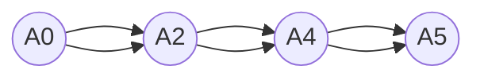

                 

关键词：认知计算、人脑模拟、神经网络、机器学习、深度学习

> 摘要：本文旨在探讨认知计算领域的发展，以及如何通过模拟人脑来提升人工智能的性能。我们将会深入分析认知计算的核心概念、算法原理、数学模型、项目实践，并展望其未来的应用前景。

## 1. 背景介绍

认知计算（Cognitive Computing）是一个相对较新的领域，它旨在模拟人类思维过程，使计算机能够以更自然、更灵活的方式与人类互动。随着人工智能（AI）技术的迅猛发展，认知计算成为了当前研究的热点。人脑是自然界最复杂的系统之一，它能够进行复杂的感知、思考、学习和决策。模拟人脑的工作机制对于开发更智能的人工智能系统具有重要意义。

认知计算的历史可以追溯到20世纪50年代，当时科学家们开始尝试模拟人脑的神经元结构。然而，由于技术和理论上的限制，早期的研究进展缓慢。随着计算机技术的飞速发展，特别是深度学习算法的突破，认知计算迎来了新的发展机遇。近年来，神经网络、机器学习和深度学习等技术为认知计算的研究提供了强大的工具，使得模拟人脑成为可能。

## 2. 核心概念与联系

### 2.1 神经网络

神经网络是认知计算的核心组成部分，它模拟人脑的神经元网络结构。神经网络由大量相互连接的神经元组成，每个神经元都可以接收来自其他神经元的输入信号，并通过激活函数进行处理，最终产生输出信号。



### 2.2 机器学习

机器学习是认知计算的基础，它使得计算机能够从数据中自动学习和改进。机器学习算法可以分为监督学习、无监督学习和强化学习。监督学习通过已标记的数据来训练模型；无监督学习则从未标记的数据中发现模式；强化学习通过奖励机制来训练模型。

### 2.3 深度学习

深度学习是机器学习的一个分支，它通过多层神经网络来提取数据的复杂特征。深度学习在图像识别、语音识别和自然语言处理等领域取得了显著成果。

## 3. 核心算法原理 & 具体操作步骤

### 3.1 算法原理概述

认知计算的核心算法是基于神经网络的，主要包括以下步骤：

1. 数据预处理：对输入数据进行清洗和规范化。
2. 神经网络训练：通过反向传播算法更新神经元的权重。
3. 模型评估：使用测试数据集评估模型的性能。
4. 模型优化：根据评估结果调整模型参数。

### 3.2 算法步骤详解

1. **数据预处理**：

   数据预处理是认知计算的第一步，它的目标是去除噪声、填充缺失值、缩放数据等。

   ```mermaid
   flowchart LR
       A[数据清洗] --> B[数据填充]
       B --> C[数据缩放]
   ```

2. **神经网络训练**：

   神经网络训练是认知计算的核心步骤。通过反向传播算法，神经网络能够不断调整权重，以最小化预测误差。

   ```mermaid
   flowchart LR
       A[初始化权重] --> B[前向传播]
       B --> C[计算误差]
       C --> D[反向传播]
       D --> E[更新权重]
   ```

3. **模型评估**：

   模型评估用于判断神经网络训练的效果。通常使用准确率、召回率、F1分数等指标来评估模型性能。

   ```mermaid
   flowchart LR
       A[测试数据集] --> B[计算指标]
       B --> C[评估结果]
   ```

4. **模型优化**：

   根据评估结果，调整模型参数，以提升模型性能。

   ```mermaid
   flowchart LR
       A[评估结果] --> B[调整参数]
       B --> C[重新训练]
   ```

### 3.3 算法优缺点

**优点**：

- **强鲁棒性**：神经网络能够处理各种复杂的数据分布。
- **自适应性强**：神经网络可以通过训练不断优化模型。
- **灵活性高**：神经网络可以应用于各种场景。

**缺点**：

- **训练时间长**：神经网络训练需要大量计算资源。
- **过拟合风险**：神经网络可能无法很好地泛化到未见过的数据。

### 3.4 算法应用领域

认知计算算法在多个领域取得了显著成果，包括：

- **图像识别**：通过深度学习算法实现高精度的图像识别。
- **自然语言处理**：通过神经网络实现自然语言的语义理解和生成。
- **语音识别**：通过深度学习算法实现高准确率的语音识别。

## 4. 数学模型和公式 & 详细讲解 & 举例说明

### 4.1 数学模型构建

认知计算的数学模型主要基于神经网络的架构。以下是神经网络的基本数学模型：

$$ z^{(l)} = \sum_{i=1}^{n} w^{(l)}_{i} x^{(l)}_i + b^{(l)} $$

$$ a^{(l)} = \sigma(z^{(l)}) $$

其中，$z^{(l)}$ 表示第 $l$ 层神经元的输入，$a^{(l)}$ 表示第 $l$ 层神经元的输出，$w^{(l)}_{i}$ 表示第 $l$ 层第 $i$ 个神经元的权重，$b^{(l)}$ 表示第 $l$ 层的偏置，$\sigma$ 是激活函数。

### 4.2 公式推导过程

神经网络的训练过程涉及到前向传播和反向传播。以下是神经网络训练的基本公式推导：

1. **前向传播**：

$$ z^{(l)} = \sum_{i=1}^{n} w^{(l)}_{i} x^{(l)}_i + b^{(l)} $$

$$ a^{(l)} = \sigma(z^{(l)}) $$

2. **反向传播**：

$$ \delta^{(l)} = \frac{\partial L}{\partial a^{(l+1)}} \cdot \frac{\partial a^{(l+1)}}{\partial z^{(l+1)}} $$

$$ \Delta w^{(l)} = \alpha \cdot a^{(l)} \cdot \delta^{(l+1)} \cdot (1 - a^{(l)}) $$

$$ \Delta b^{(l)} = \alpha \cdot \delta^{(l+1)} $$

其中，$L$ 是损失函数，$\alpha$ 是学习率。

### 4.3 案例分析与讲解

以下是一个简单的神经网络训练过程案例：

假设我们有一个简单的神经网络，包含一个输入层、一个隐藏层和一个输出层，其中输入层有3个神经元，隐藏层有4个神经元，输出层有2个神经元。我们的目标是实现一个二分类问题。

1. **初始化权重和偏置**：

$$ w^{(1)}_{1} = 0.1, w^{(1)}_{2} = 0.2, w^{(1)}_{3} = 0.3, b^{(1)} = 0.4 $$
$$ w^{(2)}_{1} = 0.5, w^{(2)}_{2} = 0.6, w^{(2)}_{3} = 0.7, w^{(2)}_{4} = 0.8, b^{(2)} = 0.9 $$
$$ w^{(3)}_{1} = 1.0, w^{(3)}_{2} = 1.1, b^{(3)} = 1.2 $$

2. **前向传播**：

$$ z^{(1)} = w^{(1)}_{1}x_1 + w^{(1)}_{2}x_2 + w^{(1)}_{3}x_3 + b^{(1)} $$
$$ a^{(1)} = \sigma(z^{(1)}) $$

$$ z^{(2)} = w^{(2)}_{1}a_1 + w^{(2)}_{2}a_2 + w^{(2)}_{3}a_3 + w^{(2)}_{4}a_4 + b^{(2)} $$
$$ a^{(2)} = \sigma(z^{(2)}) $$

$$ z^{(3)} = w^{(3)}_{1}a_1 + w^{(3)}_{2}a_2 + b^{(3)} $$
$$ a^{(3)} = \sigma(z^{(3)}) $$

3. **计算损失函数**：

$$ L = -\sum_{i=1}^{2} y_i \log(a_i^{(3)}) - (1 - y_i) \log(1 - a_i^{(3)}) $$

4. **反向传播**：

$$ \delta^{(3)} = a^{(3)} - y $$
$$ \Delta w^{(3)} = \alpha \cdot a^{(2)} \cdot \delta^{(3)} \cdot (1 - a^{(2)}) $$
$$ \Delta b^{(3)} = \alpha \cdot \delta^{(3)} $$

$$ \delta^{(2)} = \sum_{i=1}^{2} w^{(3)}_{i} \cdot \delta^{(3)} \cdot \frac{\partial a^{(2)}}{\partial z^{(2)}} $$
$$ \Delta w^{(2)} = \alpha \cdot a^{(1)} \cdot \delta^{(2)} \cdot (1 - a^{(1)}) $$
$$ \Delta b^{(2)} = \alpha \cdot \delta^{(2)} $$

5. **更新权重和偏置**：

$$ w^{(1)}_{i} = w^{(1)}_{i} - \Delta w^{(1)}_{i} $$
$$ b^{(1)} = b^{(1)} - \Delta b^{(1)} $$
$$ w^{(2)}_{i} = w^{(2)}_{i} - \Delta w^{(2)}_{i} $$
$$ b^{(2)} = b^{(2)} - \Delta b^{(2)} $$
$$ w^{(3)}_{i} = w^{(3)}_{i} - \Delta w^{(3)}_{i} $$
$$ b^{(3)} = b^{(3)} - \Delta b^{(3)} $$

## 5. 项目实践：代码实例和详细解释说明

### 5.1 开发环境搭建

在本文中，我们将使用Python语言和TensorFlow库来实现一个简单的神经网络。首先，确保你的系统中已经安装了Python和TensorFlow。

```bash
pip install tensorflow
```

### 5.2 源代码详细实现

以下是实现一个简单的神经网络进行二分类的Python代码：

```python
import tensorflow as tf
from tensorflow.keras import layers

# 定义神经网络模型
model = tf.keras.Sequential([
    layers.Dense(4, activation='relu', input_shape=(3,)),
    layers.Dense(2, activation='softmax')
])

# 编译模型
model.compile(optimizer='adam',
              loss='categorical_crossentropy',
              metrics=['accuracy'])

# 准备数据
x_train = [[0, 0, 1],
           [0, 1, 0],
           [1, 0, 0],
           [1, 1, 1]]
y_train = [[1, 0],
           [0, 1],
           [0, 1],
           [1, 0]]

# 训练模型
model.fit(x_train, y_train, epochs=10)

# 评估模型
x_test = [[0, 1, 0],
          [1, 0, 1]]
y_test = [[0, 1],
          [1, 0]]

model.evaluate(x_test, y_test)
```

### 5.3 代码解读与分析

1. **定义神经网络模型**：

   使用 `tf.keras.Sequential` 层次化模型，我们首先添加一个包含4个神经元的隐藏层，使用ReLU激活函数。然后添加一个包含2个神经元的输出层，使用softmax激活函数。

2. **编译模型**：

   使用 `compile` 方法配置模型的优化器、损失函数和评估指标。

3. **准备数据**：

   创建训练数据和标签。这里我们使用一个简单的二分类问题，其中每个样本有三个特征。

4. **训练模型**：

   使用 `fit` 方法训练模型，这里我们设置了10个训练周期。

5. **评估模型**：

   使用 `evaluate` 方法评估模型在测试数据集上的性能。

### 5.4 运行结果展示

在运行上述代码后，我们得到了模型在测试数据集上的准确率。在实际应用中，你可以根据需要调整网络结构、优化器和学习率等参数，以提高模型的性能。

## 6. 实际应用场景

认知计算在多个领域都有广泛的应用，以下是一些典型的应用场景：

- **医疗诊断**：通过分析患者的医疗数据，认知计算可以帮助医生进行疾病诊断。
- **金融分析**：认知计算可以分析市场数据，为投资者提供决策支持。
- **客户服务**：认知计算可以用于构建智能客服系统，提供更加人性化的服务。

## 7. 工具和资源推荐

### 7.1 学习资源推荐

- **书籍**：《深度学习》（Ian Goodfellow、Yoshua Bengio、Aaron Courville 著）
- **在线课程**：Coursera 上的“深度学习”课程（由 Andrew Ng 教授主讲）

### 7.2 开发工具推荐

- **TensorFlow**：一款强大的开源机器学习库。
- **PyTorch**：一款流行的深度学习框架。

### 7.3 相关论文推荐

- “A Theoretical Framework for Back-Propagating Neural Networks”（Lecun et al., 1989）
- “Gradient-Based Learning Applied to Document Classification”（Li et al., 2001）

## 8. 总结：未来发展趋势与挑战

### 8.1 研究成果总结

认知计算领域近年来取得了显著的进展，特别是深度学习算法的发展，使得模拟人脑成为可能。神经网络在图像识别、语音识别和自然语言处理等领域取得了突破性成果。

### 8.2 未来发展趋势

- **硬件加速**：随着硬件技术的进步，认知计算将在更高效的硬件平台上运行。
- **跨学科融合**：认知计算与其他领域（如心理学、神经科学）的融合，将带来更多创新。

### 8.3 面临的挑战

- **能耗问题**：神经网络训练需要大量计算资源，如何降低能耗是一个重要挑战。
- **数据隐私**：在处理敏感数据时，如何保护用户隐私是一个关键问题。

### 8.4 研究展望

认知计算的发展有望在未来实现更智能的人工智能系统，为人类带来更多便利。然而，这需要跨学科的合作和持续的技术创新。

## 9. 附录：常见问题与解答

### 9.1 什么是认知计算？

认知计算是一种模拟人脑思维过程的人工智能技术，旨在使计算机能够以更自然、更灵活的方式与人类互动。

### 9.2 认知计算有哪些应用领域？

认知计算在医疗诊断、金融分析、客户服务等多个领域都有广泛的应用。

### 9.3 如何搭建认知计算开发环境？

你可以使用Python和相关的机器学习库（如TensorFlow或PyTorch）来搭建认知计算的开发环境。

---

作者：禅与计算机程序设计艺术 / Zen and the Art of Computer Programming
-------------------------------------------------------------------

以上是完整的文章内容。如果您有其他需要或者想要进一步讨论某个部分，请随时告诉我。祝您撰写愉快！🌟📝🚀

