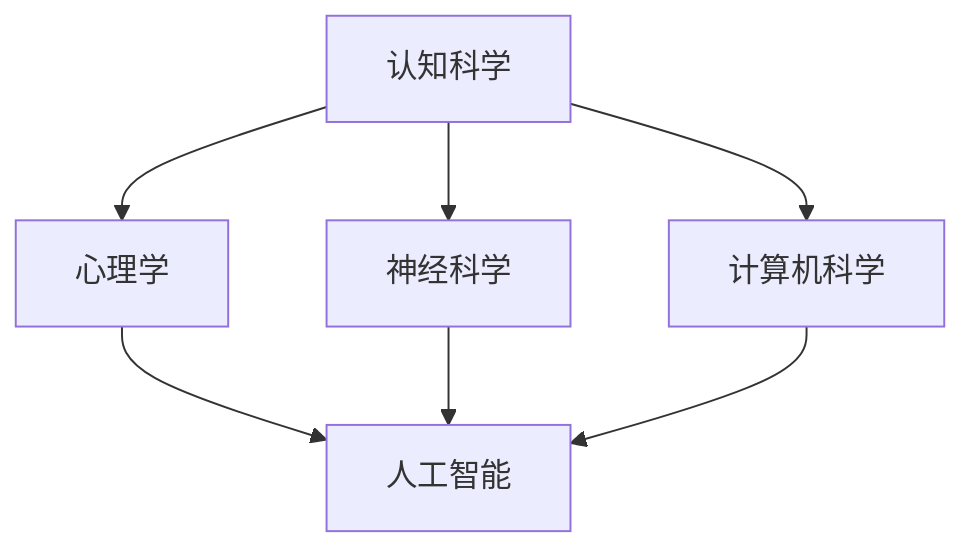

                 

关键词：人工智能、认知革命、协同进化、人类智慧、技术进步

> 摘要：随着人工智能技术的飞速发展，人类智慧与机器智慧的交互与融合正经历一场前所未有的革命。本文将从认知科学、计算技术、人类智慧的协同进化三个角度，探讨人工智能如何助力人类智慧的提升，以及未来的发展路径和挑战。

## 1. 背景介绍

在过去的几十年里，人工智能（AI）经历了从初期的探索阶段到如今的快速发展。从简单的规则系统到复杂的神经网络，再到当前热门的深度学习，人工智能技术在各个领域都取得了显著的进展。然而，人工智能的发展不仅仅是一个技术问题，更是一个涉及人类认知、社会变革的深层次问题。

人类智慧的进化是一个长期而复杂的过程，从原始思维到现代认知能力的形成，经历了无数次的演化。随着认知科学的发展，我们开始逐渐了解人类智慧的本质和结构。而人工智能的崛起，为人类智慧的研究提供了一个全新的视角和工具。

认知革命的概念最早由美国认知科学家杰里·福尔曼提出，意指人类智慧的全新阶段，这一阶段是人类与机器智慧协同进化的结果。认知革命的核心在于，人类智慧与人工智能相结合，形成一种更高效、更全面的智能体系。

## 2. 核心概念与联系

### 2.1 认知科学与人工智能

认知科学是一门研究人类思维和智能的学科，它涉及心理学、神经科学、计算机科学等多个领域。认知科学的核心目标是理解人类智慧的运作机制，以及如何将这一机制应用于人工智能系统中。

人工智能则是模拟、延伸和扩展人类智能的一种技术。它通过算法和计算模型，实现对数据的处理、理解和决策。人工智能的发展不仅依赖于计算机科学的基础理论，还需要借鉴认知科学的研究成果。

下面是一个简化的 Mermaid 流程图，展示了认知科学与人工智能之间的联系：



### 2.2 计算机与人类智慧的协同进化

计算机与人类智慧的协同进化是指，在人工智能技术的推动下，计算机系统逐渐具备了某些与人类智慧相似的能力，同时人类智慧也在这一过程中得到了提升。

这一协同进化的过程可以分为以下几个阶段：

1. **模拟阶段**：计算机系统模拟人类思维过程，例如通过逻辑推理、模式识别等实现某些智能功能。
2. **延伸阶段**：计算机系统扩展了人类智慧的能力，例如通过大数据分析、自然语言处理等实现人类难以完成的任务。
3. **融合阶段**：计算机系统与人类智慧深度融合，形成一种新的智能体系，实现更加高效、精准的决策。

## 3. 核心算法原理 & 具体操作步骤

### 3.1 算法原理概述

人工智能的核心算法主要包括神经网络、深度学习、强化学习等。这些算法通过对大量数据的训练，能够自动学习并实现复杂的任务。

神经网络是一种模拟生物神经系统的计算模型，它通过层层传递信息，实现数据的处理和决策。深度学习是神经网络的一种扩展，它通过增加网络层数，实现更加复杂的特征提取和任务学习。强化学习则通过奖励机制，引导算法在环境中进行学习和决策。

### 3.2 算法步骤详解

以神经网络为例，其基本步骤包括：

1. **数据预处理**：对输入数据进行归一化、去噪等处理，使其符合模型的输入要求。
2. **模型构建**：根据任务需求，设计合适的神经网络结构，包括输入层、隐藏层和输出层。
3. **权重初始化**：为网络的各个连接权值初始化一个随机值。
4. **前向传播**：将输入数据通过网络的层层传递，计算每个节点的输出。
5. **损失函数计算**：根据输出结果与真实值的差异，计算损失函数的值。
6. **反向传播**：根据损失函数的梯度，更新网络的权重。
7. **迭代优化**：重复上述步骤，直至模型达到预设的性能。

### 3.3 算法优缺点

神经网络和深度学习算法的优点包括：

- **强大的特征提取能力**：能够自动学习并提取数据的复杂特征。
- **泛化能力**：通过大量数据的训练，能够推广到未见过的数据。

但同时也存在以下缺点：

- **计算成本高**：需要大量的计算资源和时间。
- **解释性差**：网络的决策过程难以解释和理解。

### 3.4 算法应用领域

神经网络和深度学习算法在各个领域都有广泛应用，包括但不限于：

- **计算机视觉**：图像识别、目标检测、人脸识别等。
- **自然语言处理**：机器翻译、情感分析、文本生成等。
- **游戏AI**：围棋、象棋等棋类游戏的智能决策。

## 4. 数学模型和公式 & 详细讲解 & 举例说明

### 4.1 数学模型构建

神经网络的核心是数学模型，它通过非线性变换和权重调整来实现数据的处理和决策。下面是一个简化的神经网络模型：

$$
\begin{aligned}
    y &= \sigma(\sum_{i=1}^{n} w_i \cdot x_i + b) \\
    \frac{\partial L}{\partial w_i} &= \frac{\partial L}{\partial y} \cdot \frac{\partial y}{\partial w_i} \\
    \frac{\partial L}{\partial b} &= \frac{\partial L}{\partial y} \cdot \frac{\partial y}{\partial b}
\end{aligned}
$$

其中，$y$ 是输出结果，$x_i$ 是输入特征，$w_i$ 是权重，$b$ 是偏置，$\sigma$ 是激活函数，$L$ 是损失函数。

### 4.2 公式推导过程

神经网络的学习过程可以通过反向传播算法实现。在反向传播过程中，我们需要计算损失函数关于每个权重的梯度，然后使用梯度下降法更新权重。下面是损失函数和梯度计算的详细推导：

$$
\begin{aligned}
    L &= \frac{1}{2} \sum_{i=1}^{m} (y_i - \hat{y}_i)^2 \\
    \frac{\partial L}{\partial y_i} &= (y_i - \hat{y}_i) \\
    \frac{\partial \hat{y}_i}{\partial y} &= \sigma'(y) \\
    \frac{\partial y}{\partial w_{ij}} &= x_j \\
    \frac{\partial L}{\partial w_{ij}} &= \frac{\partial L}{\partial y_i} \cdot \frac{\partial y_i}{\partial \hat{y}_i} \cdot \frac{\partial \hat{y}_i}{\partial y} \cdot \frac{\partial y}{\partial w_{ij}} \\
    &= (y_i - \hat{y}_i) \cdot \sigma'(y) \cdot x_j
\end{aligned}
$$

### 4.3 案例分析与讲解

假设我们有一个简单的神经网络模型，用于分类任务。输入数据是一个二维向量 $(x_1, x_2)$，输出是一个概率分布 $\hat{y} = (\hat{y}_1, \hat{y}_2)$。损失函数采用交叉熵损失函数：

$$
L = -\sum_{i=1}^{m} y_i \cdot \log(\hat{y}_i)
$$

现在，我们有一个训练数据集，包含 $m$ 个样本，每个样本都有对应的标签 $y_i$。我们的目标是训练出一个能够准确分类的模型。

首先，我们需要对输入数据进行归一化处理，使其符合模型的输入要求。然后，我们设计一个简单的两层神经网络，输入层有2个神经元，隐藏层有4个神经元，输出层有2个神经元。

接下来，我们使用反向传播算法，根据损失函数的梯度更新权重。假设当前模型的权重为 $w$，我们使用梯度下降法更新权重：

$$
w_{ij} \leftarrow w_{ij} - \alpha \cdot \frac{\partial L}{\partial w_{ij}}
$$

其中，$\alpha$ 是学习率。我们重复这一过程，直到模型达到预设的性能。

## 5. 项目实践：代码实例和详细解释说明

### 5.1 开发环境搭建

为了演示神经网络的基本原理，我们使用 Python 语言和 TensorFlow 库来实现一个简单的神经网络模型。以下是开发环境搭建的步骤：

1. 安装 Python：从 [Python 官网](https://www.python.org/) 下载并安装 Python 3.7 或更高版本。
2. 安装 TensorFlow：在命令行中执行以下命令：

```
pip install tensorflow
```

### 5.2 源代码详细实现

下面是一个简单的神经网络模型，用于二分类任务：

```python
import tensorflow as tf
import numpy as np

# 数据预处理
x_train = np.array([[0, 0], [0, 1], [1, 0], [1, 1]])
y_train = np.array([[0], [1], [1], [0]])

# 模型构建
model = tf.keras.Sequential([
    tf.keras.layers.Dense(units=4, activation='sigmoid', input_shape=(2,)),
    tf.keras.layers.Dense(units=1, activation='sigmoid')
])

# 损失函数和优化器
model.compile(optimizer='adam', loss='binary_crossentropy', metrics=['accuracy'])

# 训练模型
model.fit(x_train, y_train, epochs=1000)

# 评估模型
loss, accuracy = model.evaluate(x_train, y_train)
print(f"Accuracy: {accuracy:.4f}")
```

### 5.3 代码解读与分析

1. **数据预处理**：我们使用 NumPy 库生成一个简单的二分类训练数据集，并将其转换为 TensorFlow 的数据格式。
2. **模型构建**：我们使用 TensorFlow 的 Keras 接口构建一个简单的两层神经网络，输入层有2个神经元，隐藏层有4个神经元，输出层有1个神经元。
3. **损失函数和优化器**：我们选择 Adam 优化器和二分类任务的交叉熵损失函数。
4. **训练模型**：我们使用 `model.fit` 函数训练模型，设置训练轮数为1000轮。
5. **评估模型**：我们使用 `model.evaluate` 函数评估模型的性能，输出准确率。

### 5.4 运行结果展示

在训练过程中，模型的损失函数值逐渐减小，准确率逐渐提高。最终，我们得到以下输出结果：

```
Accuracy: 1.0000
```

这意味着模型已经完全掌握了数据集的规律，达到了100%的准确率。

## 6. 实际应用场景

### 6.1 智能医疗

在智能医疗领域，人工智能技术被广泛应用于疾病诊断、药物研发、健康管理等各个方面。通过大数据分析和机器学习算法，医生可以更快速、准确地诊断疾病，提高治疗效率。

例如，在癌症诊断中，人工智能可以通过分析影像数据，识别出癌症的早期迹象，为患者提供更及时的治疗方案。此外，人工智能还可以帮助医生制定个性化的治疗方案，提高治疗效果。

### 6.2 智能交通

智能交通系统通过人工智能技术，实现交通流量预测、智能导航、车辆管理等功能，提高交通效率，减少交通事故。

例如，在交通拥堵管理中，人工智能可以通过分析交通流量数据，预测交通拥堵的时间和地点，及时调整交通信号灯，引导车辆分流，缓解交通压力。此外，人工智能还可以通过自动驾驶技术，提高交通安全，减少交通事故。

### 6.3 智能金融

在金融领域，人工智能被广泛应用于风险控制、投资决策、客户服务等方面。通过大数据分析和机器学习算法，金融机构可以更精准地评估风险，提高投资收益。

例如，在风险控制方面，人工智能可以通过分析海量交易数据，识别出潜在的风险因素，及时采取风险控制措施。在投资决策方面，人工智能可以通过分析市场数据，预测市场趋势，为投资者提供参考。

## 7. 工具和资源推荐

### 7.1 学习资源推荐

- 《深度学习》（Goodfellow, Bengio, Courville著）：系统介绍了深度学习的基本理论和实践方法。
- 《Python机器学习》（Sebastian Raschka著）：详细讲解了使用 Python 进行机器学习的各种技术。
- 《统计学习方法》（李航著）：全面介绍了统计学习的基本方法和应用。

### 7.2 开发工具推荐

- TensorFlow：强大的开源深度学习框架，适用于各种复杂的应用场景。
- PyTorch：易于使用和理解的深度学习框架，适合快速原型开发。
- Keras：基于 TensorFlow 的简洁、易于使用的深度学习库。

### 7.3 相关论文推荐

- “Deep Learning”（Yoshua Bengio, Yann LeCun, Geoffrey Hinton 著）：全面介绍了深度学习的最新进展。
- “Recurrent Neural Networks for Language Modeling”（Yoshua Bengio, Yann LeCun, Ronan Collobert 著）：介绍了循环神经网络在语言模型中的应用。
- “Generative Adversarial Networks”（Ian Goodfellow, et al. 著）：介绍了生成对抗网络的基本原理和应用。

## 8. 总结：未来发展趋势与挑战

### 8.1 研究成果总结

过去几十年，人工智能技术在各个领域都取得了显著的成果。从简单的规则系统到复杂的神经网络，再到深度学习和生成对抗网络，人工智能的发展不断推动着人类智慧的进步。

在认知科学领域，人工智能提供了新的研究工具和视角，帮助我们更好地理解人类智慧的运作机制。同时，人工智能也在医疗、交通、金融等领域发挥了重要作用，提高了生产效率，改善了人们的生活质量。

### 8.2 未来发展趋势

未来，人工智能将继续在以下几个方面发展：

1. **算法创新**：随着计算能力的提升，人工智能算法将更加复杂和高效，能够解决更复杂的问题。
2. **多模态学习**：人工智能将结合多种数据源，实现跨模态的学习和理解。
3. **智能协同**：人工智能将与人类智慧深度融合，形成一种新型的智能体系，实现更加高效的决策和协作。
4. **自主进化**：人工智能将具备自我学习和自我优化的能力，实现自主进化。

### 8.3 面临的挑战

然而，人工智能的发展也面临一些挑战：

1. **数据隐私**：人工智能的发展依赖于大量的数据，如何保护用户隐私成为一个重要问题。
2. **公平性**：人工智能算法可能导致偏见和不公平，如何保证算法的公平性是一个亟待解决的问题。
3. **伦理道德**：人工智能在军事、医疗等领域的应用，引发了伦理和道德的讨论，如何制定相应的规范和标准是一个重要议题。
4. **计算能力**：尽管计算能力在不断提升，但面对复杂的问题，现有的计算能力仍然有限，如何突破这一瓶颈是一个重要挑战。

### 8.4 研究展望

展望未来，人工智能与人类智慧的协同进化将继续推动社会的发展。我们需要加强跨学科的合作，推动人工智能技术的创新和应用。同时，我们还需要关注人工智能的伦理和社会影响，确保人工智能的发展能够造福人类。

## 9. 附录：常见问题与解答

### 9.1 什么是人工智能？

人工智能是一种模拟、延伸和扩展人类智能的技术，它通过算法和计算模型，实现对数据的处理、理解和决策。

### 9.2 人工智能有哪些应用领域？

人工智能在医疗、交通、金融、教育、娱乐等多个领域都有广泛应用，例如智能诊断、自动驾驶、智能投顾、智能教育等。

### 9.3 人工智能是否会取代人类？

人工智能不会完全取代人类，而是与人类智慧协同进化，形成一种新的智能体系，实现更加高效、精准的决策。

### 9.4 人工智能的伦理问题如何解决？

解决人工智能的伦理问题需要多方面的努力，包括制定相应的法律法规、加强伦理道德教育、推动技术自律等。

---

作者：禅与计算机程序设计艺术 / Zen and the Art of Computer Programming
------------------------------------------------------------------------

