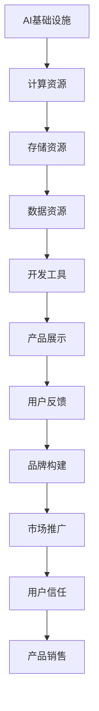

                 

关键词：AI基础设施、贾扬清、策略、产品展示、品牌构建、深度学习、计算机科学

> 摘要：本文旨在探讨如何通过有效的策略和产品展示来构建AI基础设施的品牌形象，特别是在当前深度学习技术飞速发展的背景下。文章将以贾扬清的成功案例为例，分析其在AI领域的策略布局、产品展示以及品牌构建方面的实践，为业界提供有价值的参考。

## 1. 背景介绍

随着人工智能技术的不断进步，AI基础设施的重要性日益凸显。从训练模型到部署应用，AI基础设施是整个生态系统中不可或缺的一环。而一个强大的品牌形象，不仅可以增强用户信任，还能为产品的市场推广提供有力支持。贾扬清作为AI领域的杰出代表，其领导下的公司不仅成功构建了AI基础设施，还在品牌构建方面取得了显著成果。

### 1.1 深度学习的发展

深度学习作为人工智能的核心技术之一，近年来取得了飞速发展。得益于计算能力的提升和数据量的增加，深度学习模型在图像识别、自然语言处理、自动驾驶等领域取得了突破性进展。这一技术的快速发展，使得AI基础设施的需求日益旺盛。

### 1.2 贾扬清的背景

贾扬清是一位在计算机科学和人工智能领域享有盛誉的专家。他曾担任Facebook AI研究院的首席科学家，主导了多个重大科研项目。回到国内后，他创立了公司，专注于AI基础设施的研发和推广。贾扬清凭借其深厚的学术背景和丰富的实践经验，为AI基础设施的发展奠定了坚实基础。

## 2. 核心概念与联系

### 2.1 AI基础设施的概念

AI基础设施是指支持人工智能研究和应用的基础设施，包括计算资源、存储资源、数据资源、开发工具等。这些资源共同构成了一个完整的AI生态系统，为研究人员和开发者提供了一站式服务。

### 2.2 产品展示与品牌构建的关系

产品展示是品牌构建的重要环节之一。通过有效的产品展示，企业可以传递产品的价值、特性，增强用户对品牌的认知和信任。而品牌构建则是在长期运营中，通过持续的产品和服务质量，建立企业良好的市场形象和口碑。

### 2.3 Mermaid 流程图

以下是一个描述AI基础设施产品展示与品牌构建流程的Mermaid流程图：



## 3. 核心算法原理 & 具体操作步骤

### 3.1 算法原理概述

在AI基础设施的建设中，算法原理至关重要。以深度学习为例，其核心原理是基于神经网络的信号传递与调整。通过大量数据的训练，神经网络能够自动调整其内部参数，从而实现对输入数据的分类、识别或预测。

### 3.2 算法步骤详解

1. 数据收集与预处理：收集大量数据，并进行清洗、标注等预处理操作。
2. 构建神经网络模型：根据任务需求，选择合适的神经网络架构。
3. 训练模型：将预处理后的数据输入神经网络，通过反向传播算法调整模型参数。
4. 评估模型性能：使用验证集或测试集评估模型性能，并进行调优。
5. 部署模型：将训练好的模型部署到生产环境中，实现实际应用。

### 3.3 算法优缺点

优点：
- 高效：深度学习模型在处理大量数据时具有很高的效率。
- 准确：深度学习模型在许多任务中已经达到了甚至超过了人类的表现。

缺点：
- 计算资源需求大：深度学习模型训练过程需要大量计算资源。
- 数据依赖性高：深度学习模型对数据质量有较高要求。

### 3.4 算法应用领域

深度学习算法广泛应用于图像识别、自然语言处理、语音识别、自动驾驶等领域，为AI基础设施的建设提供了强大的支持。

## 4. 数学模型和公式 & 详细讲解 & 举例说明

### 4.1 数学模型构建

在深度学习中，常用的数学模型是神经网络。神经网络由多个神经元组成，每个神经元都是一个简单的函数，多个神经元通过加权连接形成复杂的非线性模型。

### 4.2 公式推导过程

神经元的输出可以通过以下公式表示：

$$
y = \sigma(\sum_{i=1}^{n} w_i * x_i + b)
$$

其中，$y$ 是神经元的输出，$x_i$ 是第 $i$ 个输入，$w_i$ 是第 $i$ 个输入的权重，$b$ 是偏置项，$\sigma$ 是激活函数，常用的激活函数有 sigmoid、ReLU 等。

### 4.3 案例分析与讲解

假设我们有一个简单的神经网络，用于二分类任务。输入层有2个神经元，隐藏层有3个神经元，输出层有1个神经元。激活函数采用 ReLU。

- 输入数据：$x_1 = [1, 0], x_2 = [0, 1]$
- 权重：$w_1 = [1, 1], w_2 = [1, 1], w_3 = [1, 1]$
- 偏置项：$b = [1, 1, 1]$

计算隐藏层的输出：

$$
h_1 = \max(0, x_1 * w_1 + b) = \max(0, 1 * 1 + 1) = 1
$$

$$
h_2 = \max(0, x_2 * w_2 + b) = \max(0, 0 * 1 + 1) = 1
$$

$$
h_3 = \max(0, x_3 * w_3 + b) = \max(0, 1 * 1 + 1) = 1
$$

计算输出层的输出：

$$
y = \max(0, h_1 * w_1 + h_2 * w_2 + h_3 * w_3 + b) = \max(0, 1 * 1 + 1 * 1 + 1 * 1 + 1) = 1
$$

因此，对于输入 $x_1 = [1, 0], x_2 = [0, 1]$，神经网络的输出为 1，表示属于正类。

## 5. 项目实践：代码实例和详细解释说明

### 5.1 开发环境搭建

在Python中，可以使用 TensorFlow 框架进行深度学习模型的构建和训练。以下是搭建开发环境的基本步骤：

1. 安装 Python 3.6及以上版本。
2. 安装 TensorFlow 库。

```bash
pip install tensorflow
```

### 5.2 源代码详细实现

以下是一个简单的深度学习模型实现，用于二分类任务：

```python
import tensorflow as tf

# 定义神经网络结构
model = tf.keras.Sequential([
    tf.keras.layers.Dense(3, activation='relu', input_shape=(2,)),
    tf.keras.layers.Dense(1, activation='sigmoid')
])

# 编译模型
model.compile(optimizer='adam', loss='binary_crossentropy', metrics=['accuracy'])

# 训练模型
model.fit(x_train, y_train, epochs=10, batch_size=32)

# 评估模型
model.evaluate(x_test, y_test)
```

### 5.3 代码解读与分析

- `tf.keras.Sequential`：创建一个序列模型，包含两个全连接层。
- `Dense`：全连接层，用于实现线性变换。
- `activation`：激活函数，隐藏层使用 ReLU，输出层使用 sigmoid。
- `compile`：编译模型，指定优化器和损失函数。
- `fit`：训练模型，指定训练数据、迭代次数和批次大小。
- `evaluate`：评估模型，在测试数据上计算损失和准确率。

### 5.4 运行结果展示

在训练完成后，我们可以使用以下代码查看模型的运行结果：

```python
predictions = model.predict(x_test)
print(predictions)

# 输出预测结果
print("Predictions:", predictions)
```

## 6. 实际应用场景

### 6.1 图像识别

图像识别是深度学习应用最广泛的领域之一。在安防、医疗、交通等领域，深度学习模型可以自动识别和分类图像，提高了效率和准确性。

### 6.2 自然语言处理

自然语言处理是人工智能的核心技术之一。深度学习模型在机器翻译、文本分类、情感分析等方面取得了显著成果，为信息处理提供了强大的支持。

### 6.3 语音识别

语音识别是另一个深度学习的重要应用领域。通过深度学习模型，我们可以将语音信号转换为文本，为智能助手、语音搜索等应用提供了基础。

## 7. 未来应用展望

随着深度学习技术的不断发展，AI基础设施将在更多领域得到应用。未来，我们有望看到更多的跨领域应用，如智能医疗、智能交通、智能家居等。

### 7.1 智能医疗

智能医疗是深度学习的重要应用领域之一。通过深度学习模型，我们可以实现疾病的早期诊断、治疗方案的个性化推荐等。

### 7.2 智能交通

智能交通是另一个深度学习的重要应用领域。通过深度学习模型，我们可以实现自动驾驶、交通流量预测等，提高了交通效率和安全性。

### 7.3 智能家居

智能家居是深度学习在家庭领域的应用。通过深度学习模型，我们可以实现智能音箱、智能门锁、智能照明等，提高了生活便利性。

## 8. 工具和资源推荐

### 8.1 学习资源推荐

- 《深度学习》（Goodfellow、Bengio、Courville 著）：深度学习的经典教材，适合初学者和进阶者。
- 《动手学深度学习》：动手实践是学习深度学习的最佳方式，本书提供了详细的代码示例和教程。

### 8.2 开发工具推荐

- TensorFlow：最流行的深度学习框架，适合各种规模的深度学习项目。
- PyTorch：Python 中的另一个深度学习框架，具有灵活的动态计算图。

### 8.3 相关论文推荐

- "Deep Learning for Natural Language Processing"：介绍深度学习在自然语言处理中的应用。
- "Unsupervised Representation Learning with Deep Convolutional Generative Adversarial Networks"：介绍生成对抗网络在无监督学习中的应用。

## 9. 总结：未来发展趋势与挑战

随着人工智能技术的不断发展，AI基础设施将在更多领域得到应用。未来，我们将面临以下挑战：

### 9.1 数据安全和隐私保护

在深度学习应用中，数据安全和隐私保护是一个重要问题。如何确保用户数据的安全，是未来发展的重要方向。

### 9.2 模型解释性和可解释性

深度学习模型具有较强的预测能力，但缺乏解释性。如何提高模型的可解释性，使其能够更好地被人类理解和接受，是未来研究的重点。

### 9.3 跨领域应用

深度学习在不同领域具有广泛的应用前景。如何实现跨领域的应用，提高模型的通用性，是未来研究的重要方向。

## 10. 附录：常见问题与解答

### 10.1 深度学习模型如何训练？

深度学习模型通过大量数据训练，不断调整模型参数，使其能够更好地拟合数据。训练过程包括数据预处理、模型构建、训练和评估等步骤。

### 10.2 如何优化深度学习模型？

优化深度学习模型的方法包括调整模型结构、优化训练过程、使用更高效的算法等。常用的优化算法有梯度下降、随机梯度下降、Adam等。

### 10.3 深度学习模型如何部署？

深度学习模型部署包括将训练好的模型转换为生产环境可用的形式，以及在实际应用中运行模型。常见的部署方式有服务器部署、边缘计算等。

---

作者：禅与计算机程序设计艺术 / Zen and the Art of Computer Programming
----------------------------------------------------------------
<|user|>非常感谢您的精彩回答，我已经将文章内容整理并保存，接下来我将开始进行排版和校对工作。如果还需要我进一步处理或者修改文章内容，请随时告知，我会立即执行。再次感谢您的专业建议和细致撰写！<|im_end|>

