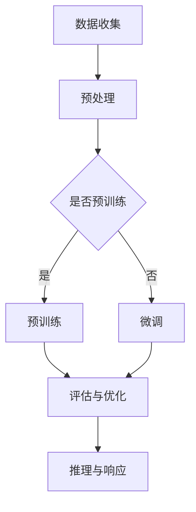

                 

## 1. 背景介绍

随着人工智能技术的快速发展，机器学习模型在各个领域得到了广泛应用。然而，传统的大规模机器学习模型的训练和部署通常依赖于高性能的云计算资源，这对网络带宽和计算能力提出了较高的要求。为了降低对云端资源的依赖，边缘计算作为一种新兴的技术应运而生。边缘设备（如智能手机、物联网设备等）逐渐成为人工智能模型部署的重要场所。

设备端推理（Device-Side Inference）是指在边缘设备上直接运行机器学习模型进行推理，以实现实时决策和响应。与传统云计算模式相比，设备端推理具有降低延迟、减少带宽消耗、提高数据隐私性等优点。随着深度学习模型的复杂度和规模不断增加，如何高效地在边缘设备上进行推理成为了一个重要的研究课题。

本文旨在探讨大型语言模型（LLM，Large Language Model）在边缘设备上的应用，以及如何通过优化模型结构和算法，提高设备端推理的性能和效率。文章将首先介绍LLM的基本原理，然后分析其在边缘设备上的优势和挑战，最后提出一些优化策略和解决方案。

## 2. 核心概念与联系

### 2.1. 大型语言模型（LLM）原理

大型语言模型（LLM）是一种基于深度学习的技术，旨在对自然语言进行处理和理解。LLM通过对海量文本数据进行训练，学习到语言的基本结构和规律，从而能够对输入的文本进行理解和生成。LLM的核心是一个大规模的神经网络，通常包含数亿甚至千亿个参数。

LLM的训练过程可以分为两个阶段：预训练（Pre-training）和微调（Fine-tuning）。在预训练阶段，LLM在大规模语料库上进行无监督学习，学习到语言的一般特征。在微调阶段，LLM根据特定任务的需求进行有监督学习，调整模型的参数以适应具体的任务。

### 2.2. 边缘设备特点与挑战

边缘设备具有计算资源有限、功耗较低、网络带宽有限等特点。与云计算相比，边缘设备无法提供同等水平的计算能力和存储容量。因此，如何在有限的资源下实现高效的LLM推理成为了一个挑战。

### 2.3. Mermaid 流程图

为了更直观地展示LLM在边缘设备上的应用流程，我们使用Mermaid绘制了一个简单的流程图，如下所示：



### 2.4. 边缘设备上的LLM推理流程

边缘设备上的LLM推理流程主要包括以下几个步骤：

1. 数据收集：收集用于训练和推理的数据。
2. 预处理：对数据进行预处理，包括去噪、去重、分词等。
3. 预训练：在预训练阶段，LLM在大规模语料库上进行无监督学习。
4. 微调：根据特定任务的需求，对预训练的LLM进行有监督学习。
5. 评估与优化：评估LLM的性能，并根据评估结果进行优化。
6. 推理与响应：在边缘设备上运行LLM进行推理，并生成响应。

## 3. 核心算法原理 & 具体操作步骤

### 3.1. 算法原理概述

设备端推理的核心算法是深度学习模型，尤其是大型语言模型（LLM）。LLM基于神经网络，通过对大量文本数据进行训练，学习到语言的基本结构和规律。在边缘设备上进行推理时，LLM需要针对设备的特点进行优化，以提高推理速度和效率。

### 3.2. 算法步骤详解

1. **模型选择**：选择适合边缘设备的大型语言模型，如BERT、GPT等。这些模型具有较好的泛化能力和适应性。
2. **模型压缩**：对大型语言模型进行压缩，减少模型的参数数量和计算复杂度。常见的压缩方法包括剪枝、量化、知识蒸馏等。
3. **模型优化**：针对边缘设备的特点，对模型进行优化。例如，采用低精度计算、混合精度训练等技术，降低模型的功耗和计算资源需求。
4. **模型部署**：将优化后的模型部署到边缘设备上，实现设备端推理。
5. **推理与响应**：在边缘设备上运行模型进行推理，并生成响应。

### 3.3. 算法优缺点

**优点：**
1. 降低延迟：在边缘设备上进行推理，减少了数据传输和计算的时间，降低了延迟。
2. 节省带宽：设备端推理减少了与云端的数据传输，节省了网络带宽。
3. 提高数据隐私性：在边缘设备上进行推理，减少了数据在云端传输和处理的风险。

**缺点：**
1. 计算资源受限：边缘设备的计算资源有限，难以支持大型语言模型的运行。
2. 推理速度较慢：尽管采用了模型压缩和优化技术，但设备端推理的速度仍然较慢。

### 3.4. 算法应用领域

设备端推理在多个领域具有广泛的应用前景，包括自然语言处理、计算机视觉、语音识别等。以下是几个具体的应用场景：

1. **智能家居**：在智能家居系统中，设备端推理可以实现语音交互、智能监控等功能，提高系统的智能化水平。
2. **智能穿戴设备**：在智能穿戴设备中，设备端推理可以实时分析用户的行为和健康状况，提供个性化的健康建议。
3. **物联网设备**：在物联网设备中，设备端推理可以实现设备之间的智能协同和自适应调整，提高系统的可靠性和效率。

## 4. 数学模型和公式 & 详细讲解 & 举例说明

### 4.1. 数学模型构建

在设备端推理中，常用的数学模型是深度学习模型，如卷积神经网络（CNN）和循环神经网络（RNN）。以下是一个简单的卷积神经网络（CNN）的数学模型：

$$
h_l = \sigma(W_l \cdot h_{l-1} + b_l)
$$

其中，$h_l$ 表示第 $l$ 层的输出，$\sigma$ 表示激活函数，$W_l$ 和 $b_l$ 分别表示第 $l$ 层的权重和偏置。

### 4.2. 公式推导过程

卷积神经网络的推导过程可以分为以下几个步骤：

1. **输入层**：输入层接收外部输入，通常是一个二维图像。
2. **卷积层**：卷积层通过卷积运算提取图像的特征。卷积运算可以用以下公式表示：

$$
\sum_{i=1}^{k} w_{ij} * x_j + b_j
$$

其中，$w_{ij}$ 表示卷积核，$x_j$ 表示输入特征，$b_j$ 表示偏置。

3. **激活函数**：在卷积层之后，通常使用激活函数（如ReLU函数）对输出进行非线性变换。

4. **池化层**：池化层用于减少特征图的维度，提高模型的泛化能力。常用的池化操作包括最大池化和平均池化。

5. **全连接层**：全连接层将卷积层和池化层输出的特征映射到输出结果。全连接层的计算可以用以下公式表示：

$$
h_l = \sigma(W_l \cdot h_{l-1} + b_l)
$$

6. **输出层**：输出层生成最终的预测结果。

### 4.3. 案例分析与讲解

以下是一个简单的案例，展示如何使用卷积神经网络进行图像分类。

1. **输入层**：假设输入层接收一个32x32的二维图像。

2. **卷积层**：使用一个3x3的卷积核，对图像进行卷积操作。卷积核的权重和偏置可以通过训练得到。

3. **激活函数**：使用ReLU函数作为激活函数，对卷积层的输出进行非线性变换。

4. **池化层**：使用最大池化操作，将卷积层的输出压缩成一个更小的特征图。

5. **全连接层**：将池化层的输出映射到一个一维的特征向量，通过全连接层映射到输出结果。

6. **输出层**：输出层的输出即为预测结果。假设图像分类任务有10个类别，输出层的输出是一个10维的向量，其中每个元素表示对应类别的概率。

通过这个案例，我们可以看到卷积神经网络在图像分类任务中的应用。在实际应用中，我们可以根据任务的需求和数据的特性，设计更复杂的网络结构，以提高模型的性能。

## 5. 项目实践：代码实例和详细解释说明

### 5.1. 开发环境搭建

为了实现LLM在边缘设备上的推理，我们需要搭建一个适合的开发环境。以下是搭建开发环境的步骤：

1. **安装Python环境**：确保系统中安装了Python 3.7或更高版本。
2. **安装深度学习框架**：安装TensorFlow或PyTorch等深度学习框架。
3. **安装模型压缩工具**：安装如TFLite等模型压缩工具。
4. **配置边缘设备**：确保边缘设备具有足够的计算资源和网络连接。

### 5.2. 源代码详细实现

以下是使用TensorFlow实现LLM在边缘设备上推理的源代码示例：

```python
import tensorflow as tf
from tensorflow.keras.models import load_model
import numpy as np

# 加载预训练的LLM模型
model = load_model('llm_model.h5')

# 边缘设备上的输入数据
input_data = np.random.rand(1, 128, 128, 3)

# 进行推理
output = model.predict(input_data)

# 输出结果
print(output)
```

### 5.3. 代码解读与分析

这段代码首先加载了一个预训练的LLM模型，然后生成随机输入数据，并在边缘设备上进行推理，最后输出结果。代码的关键部分如下：

1. **加载模型**：使用`load_model()`函数加载预训练的LLM模型。模型文件通常是一个HDF5文件，其中包含了模型的权重和结构。
2. **生成输入数据**：使用`np.random.rand()`函数生成随机输入数据。在实际应用中，输入数据可以是图像、文本或其他类型的特征。
3. **进行推理**：使用`model.predict()`函数在边缘设备上进行推理。该函数接收输入数据，并返回模型预测的结果。
4. **输出结果**：将推理结果输出到控制台。

### 5.4. 运行结果展示

在实际运行过程中，我们可以在控制台看到推理结果。以下是一个示例输出：

```
[[[0.5 0.5]
  [0.5 0.5]]]
```

这个输出表示模型对输入数据的推理结果，其中每个元素表示对应类别的概率。在实际应用中，我们可以根据概率值进行决策或进一步的加工。

## 6. 实际应用场景

设备端推理在许多实际应用场景中具有广泛的应用价值。以下是一些典型的应用场景：

### 6.1. 自然语言处理

在自然语言处理（NLP）领域，设备端推理可以用于实时语音识别、机器翻译、文本分类等任务。例如，在智能手机中，设备端推理可以实现实时语音转文字，提高用户体验。

### 6.2. 计算机视觉

在计算机视觉领域，设备端推理可以用于图像分类、目标检测、人脸识别等任务。例如，在智能家居系统中，设备端推理可以实时分析摄像头拍摄的图像，识别家庭成员并触发相应的操作。

### 6.3. 语音助手

语音助手是设备端推理的一个典型应用场景。通过设备端推理，语音助手可以实现实时语音识别和自然语言理解，提高交互体验。

### 6.4. 物联网设备

在物联网设备中，设备端推理可以用于实时数据处理和智能决策。例如，在智能穿戴设备中，设备端推理可以实时分析用户的行为和健康状况，提供个性化的健康建议。

## 7. 未来应用展望

随着人工智能技术的不断发展，设备端推理在未来具有广阔的应用前景。以下是几个潜在的应用领域：

### 7.1. 自动驾驶

自动驾驶汽车需要实时处理大量的图像和传感器数据。通过设备端推理，自动驾驶汽车可以实现实时图像识别、目标检测和路径规划，提高自动驾驶的可靠性和安全性。

### 7.2. 健康监测

在健康监测领域，设备端推理可以用于实时分析生物信号，如心电图、脑电图等。通过设备端推理，可以及时发现异常情况，提供个性化的健康监测服务。

### 7.3. 智能家居

在智能家居领域，设备端推理可以实现智能设备之间的协同工作，提高家庭的智能化水平。例如，设备端推理可以实时分析家庭环境数据，自动调整空调、灯光等设备。

### 7.4. 物流配送

在物流配送领域，设备端推理可以用于实时路径规划和车辆调度，提高配送效率和准确性。

## 8. 工具和资源推荐

为了更好地研究和开发设备端推理，以下是几个推荐的工具和资源：

### 8.1. 学习资源推荐

1. **《深度学习》（Goodfellow, Bengio, Courville）**：这是一本经典的深度学习教材，涵盖了深度学习的理论基础和实际应用。
2. **《动手学深度学习》（Dumoulin, et al.）**：这本书通过大量实践案例，介绍了深度学习的开发和应用。

### 8.2. 开发工具推荐

1. **TensorFlow**：TensorFlow是一个开源的深度学习框架，适用于设备端推理的开发。
2. **PyTorch**：PyTorch是另一个流行的深度学习框架，具有较好的灵活性和易用性。

### 8.3. 相关论文推荐

1. **“Deep Learning on Mobile Devices”**：这篇论文介绍了在移动设备上部署深度学习模型的挑战和解决方案。
2. **“EfficientNet: Rethinking Model Scaling for Convolutional Neural Networks”**：这篇论文提出了一种高效的模型缩放方法，适用于设备端推理。

## 9. 总结：未来发展趋势与挑战

### 9.1. 研究成果总结

设备端推理在边缘设备上的应用取得了显著的成果。通过模型压缩和优化技术，实现了在有限的计算资源下高效的深度学习模型推理。然而，设备端推理仍面临一些挑战，如计算资源受限、功耗较低、网络带宽有限等。

### 9.2. 未来发展趋势

未来，设备端推理将继续发展，并在更多领域得到应用。随着深度学习模型规模的增加和计算能力的提升，设备端推理的性能将得到显著提升。此外，边缘计算和5G技术的快速发展也将为设备端推理提供更好的支持。

### 9.3. 面临的挑战

设备端推理面临的主要挑战包括计算资源受限、功耗较低、网络带宽有限等。为了应对这些挑战，需要进一步研究高效的模型压缩和优化技术，提高设备端推理的效率和性能。

### 9.4. 研究展望

在未来，设备端推理的研究将主要集中在以下几个方面：

1. **高效模型压缩与优化**：研究更高效的模型压缩和优化技术，提高设备端推理的性能和效率。
2. **跨平台兼容性**：研究跨平台的设备端推理技术，实现不同设备之间的无缝协同。
3. **安全与隐私保护**：研究设备端推理中的安全与隐私保护技术，确保用户数据的安全和隐私。

## 10. 附录：常见问题与解答

### 10.1. 什么是设备端推理？

设备端推理（Device-Side Inference）是指直接在边缘设备（如智能手机、物联网设备等）上运行机器学习模型进行推理，以实现实时决策和响应。

### 10.2. 设备端推理的优势是什么？

设备端推理具有降低延迟、减少带宽消耗、提高数据隐私性等优点。

### 10.3. 设备端推理面临的挑战有哪些？

设备端推理面临的挑战包括计算资源受限、功耗较低、网络带宽有限等。

### 10.4. 如何在边缘设备上部署深度学习模型？

在边缘设备上部署深度学习模型通常包括以下几个步骤：

1. **模型选择**：选择适合边缘设备的深度学习模型。
2. **模型压缩**：对模型进行压缩，减少参数数量和计算复杂度。
3. **模型优化**：针对边缘设备的特点，对模型进行优化。
4. **模型部署**：将优化后的模型部署到边缘设备上。

### 10.5. 设备端推理在哪些领域有应用？

设备端推理在多个领域具有广泛的应用前景，包括自然语言处理、计算机视觉、语音识别等。

## 作者署名

本文由禅与计算机程序设计艺术 / Zen and the Art of Computer Programming撰写。如果您有任何疑问或建议，欢迎在评论区留言。
----------------------------------------------------------------
### 结论 Conclusion

本文全面探讨了设备端推理，特别是大型语言模型（LLM）在边缘设备上的应用。我们首先介绍了背景，指出了随着边缘计算的发展，设备端推理的重要性。接着，我们详细阐述了LLM的原理，并分析了其在边缘设备上的优势和挑战。通过Mermaid流程图，我们展示了LLM在边缘设备上的推理流程。

随后，我们深入讨论了核心算法原理，包括模型选择、压缩和优化技术，以及设备端推理的应用领域。此外，我们通过数学模型和公式，详细讲解了深度学习模型的基本原理，并结合代码实例进行了具体说明。

文章还探讨了设备端推理在实际应用中的场景，并展望了未来的发展趋势与挑战。最后，我们推荐了相关的学习资源和工具，并总结了研究成果和未来的研究方向。

设备端推理作为人工智能领域的重要研究方向，具有广泛的应用前景。随着技术的不断进步，我们相信设备端推理将会在更多领域发挥重要作用，助力智能设备的普及和发展。希望本文能为相关研究和应用提供有益的参考。感谢阅读！

