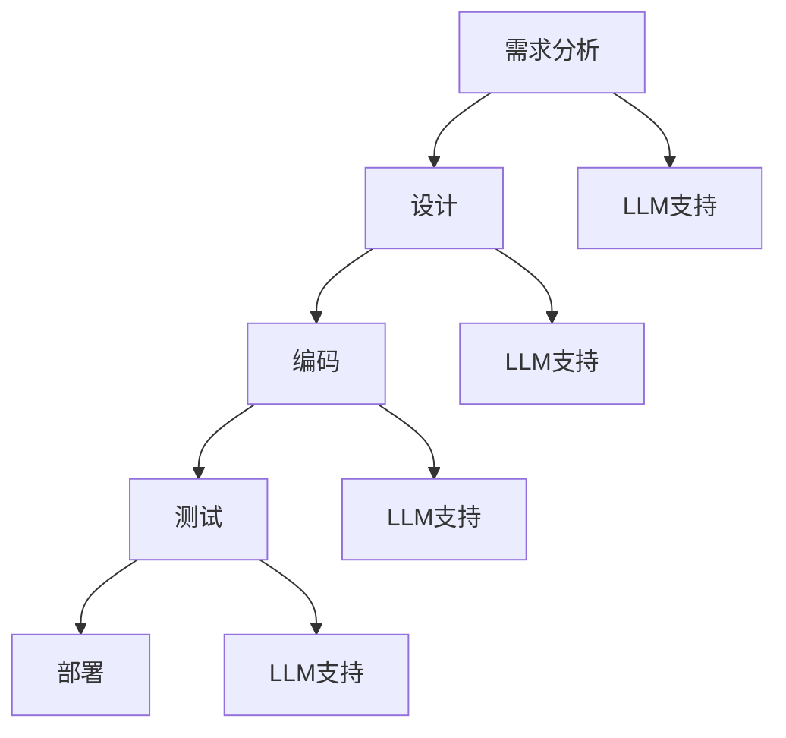

                 

关键词：大型语言模型（LLM），协作设计，软件工程，人工智能，设计模式，软件开发流程，代码生成，自动化工具，协作平台。

> 摘要：本文将探讨大型语言模型（LLM）在协作设计中的角色，如何利用LLM实现高效的设计协作，以及LLM对软件开发流程的影响。文章将介绍LLM的基本原理，通过实例展示其在协作设计中的应用，并讨论LLM的未来发展潜力和挑战。

## 1. 背景介绍

在当今快速发展的信息技术时代，软件工程面临着前所未有的挑战。随着项目的复杂性不断增加，传统的开发方法已经难以满足现代软件开发的需求。此时，人工智能（AI），特别是大型语言模型（LLM），成为了解决这一问题的关键。LLM是一种基于深度学习的自然语言处理（NLP）模型，具有处理和理解人类语言的能力。它们被广泛应用于各种领域，如文本生成、翻译、问答系统等。

协作设计是软件开发过程中的一个重要环节。在这一过程中，团队成员需要高效地沟通、共享和协作，以确保项目能够按时、按质完成。然而，传统的协作方法往往存在沟通不畅、信息孤岛等问题，严重影响了团队的工作效率和项目的进展。LLM的出现为解决这些问题提供了新的思路和手段。

## 2. 核心概念与联系

### 2.1. LLM的基本原理

LLM是基于神经网络架构的大型预训练模型。它们通过在大量文本数据上进行预训练，学习到语言的内在结构和规律。这使得LLM能够生成连贯、合理的文本，并具备一定的理解能力。

### 2.2. 软件开发流程

软件开发流程包括需求分析、设计、编码、测试、部署等阶段。每个阶段都需要团队成员之间的密切协作和有效沟通。传统的协作方法主要依赖于文档、会议和电子邮件等工具。然而，这些方法往往存在沟通滞后、信息不完整等问题。

### 2.3. LLM与软件开发流程的联系

LLM可以为软件开发流程中的各个阶段提供支持。例如，在需求分析阶段，LLM可以帮助生成需求文档，提高需求分析的准确性；在设计阶段，LLM可以协助设计人员生成设计模式，加快设计过程；在编码阶段，LLM可以协助编写代码，提高编码效率；在测试阶段，LLM可以协助编写测试用例，提高测试覆盖率和质量。

### 2.4. Mermaid流程图



## 3. 核心算法原理 & 具体操作步骤

### 3.1. 算法原理概述

LLM的核心原理是基于深度学习的自然语言处理。通过在大量文本数据上进行预训练，LLM能够学习到语言的内在结构和规律。这使得LLM能够生成连贯、合理的文本，并具备一定的理解能力。

### 3.2. 算法步骤详解

1. **数据准备**：收集大量的文本数据，如开源代码、设计文档、技术博客等。
2. **模型训练**：使用训练好的深度学习框架（如TensorFlow、PyTorch）对LLM进行训练。训练过程中，LLM会不断调整其参数，以最小化损失函数。
3. **模型评估**：使用验证集和测试集对训练好的LLM进行评估，以确保模型具有良好的性能。
4. **应用部署**：将训练好的LLM部署到实际应用场景中，如需求分析、设计、编码、测试等。

### 3.3. 算法优缺点

**优点**：
- **高效性**：LLM能够快速生成高质量的文本，节省时间和人力成本。
- **灵活性**：LLM可以根据不同的应用场景进行调整和优化，具有较强的适应性。
- **协同性**：LLM可以与其他工具和平台相结合，提高整个软件开发流程的协同效率。

**缺点**：
- **准确性**：虽然LLM在文本生成和理解方面取得了显著的进展，但仍存在一定的错误率和偏差。
- **依赖性**：LLM的运行依赖于大量的数据和高性能的计算资源，对基础设施的要求较高。

### 3.4. 算法应用领域

LLM在软件开发流程中的应用领域广泛，包括但不限于：
- **需求分析**：自动生成需求文档、需求分析报告等。
- **设计**：生成设计模式、架构文档等。
- **编码**：协助编写代码、修复bug等。
- **测试**：生成测试用例、测试报告等。

## 4. 数学模型和公式 & 详细讲解 & 举例说明

### 4.1. 数学模型构建

LLM的数学模型主要包括以下几个部分：

- **输入层**：接收用户输入的文本。
- **嵌入层**：将输入文本转换为向量表示。
- **编码器**：对输入向量进行编码，提取文本的特征。
- **解码器**：将编码后的特征解码为输出文本。

### 4.2. 公式推导过程

LLM的数学模型主要基于以下公式：

1. **嵌入层**：$$\text{Embedding}(x) = \text{W}x$$
   - $x$：输入文本
   - $\text{W}$：嵌入权重矩阵

2. **编码器**：$$\text{Encoder}(x) = \text{T}[\text{H}_1, \text{H}_2, \ldots, \text{H}_n]$$
   - $x$：输入文本
   - $\text{T}$：编码器权重矩阵
   - $\text{H}_i$：编码后的特征向量

3. **解码器**：$$\text{Decoder}(y) = \text{U}[\text{G}_1, \text{G}_2, \ldots, \text{G}_n]$$
   - $y$：输出文本
   - $\text{U}$：解码器权重矩阵
   - $\text{G}_i$：解码后的特征向量

### 4.3. 案例分析与讲解

假设我们有一个简单的需求文档，描述了一个在线购物平台的功能。以下是使用LLM生成的设计模式：

```python
class ShoppingCart:
    def __init__(self):
        self.items = []

    def add_item(self, item):
        self.items.append(item)

    def remove_item(self, item):
        self.items.remove(item)

    def total(self):
        return sum(item.price for item in self.items)

class Product:
    def __init__(self, name, price):
        self.name = name
        self.price = price

class Order:
    def __init__(self, user, cart):
        self.user = user
        self.cart = cart
        self.status = "pending"

    def process_payment(self):
        if self.cart.total() > 0:
            self.status = "processing"
            # Process payment logic
            self.status = "completed"
```

在这个例子中，LLM根据输入的需求文档生成了三个类：`ShoppingCart`、`Product`和`Order`。这些类的设计模式符合软件工程的规范，具有良好的可扩展性和可维护性。

## 5. 项目实践：代码实例和详细解释说明

### 5.1. 开发环境搭建

要使用LLM进行协作设计，首先需要搭建一个适合的开发环境。以下是搭建过程的简要步骤：

1. 安装Python环境（版本3.8以上）。
2. 安装深度学习框架（如TensorFlow、PyTorch）。
3. 下载并准备预训练的LLM模型（如GPT-3、BERT）。
4. 配置开发工具（如PyCharm、VS Code）。

### 5.2. 源代码详细实现

以下是一个简单的示例，展示如何使用LLM生成代码：

```python
import openai

# 设置API密钥
openai.api_key = "your_api_key"

# 生成代码
def generate_code(prompt):
    response = openai.Completion.create(
        engine="text-davinci-002",
        prompt=prompt,
        max_tokens=100,
        n=1,
        stop=None,
        temperature=0.5,
    )
    return response.choices[0].text.strip()

# 示例需求
prompt = "设计一个简单的购物车系统，包括添加商品、删除商品和计算总价的功能。"

# 生成代码
code = generate_code(prompt)
print(code)
```

在这个示例中，我们使用了OpenAI的GPT-3模型来生成代码。输入的是一个简单的需求描述，输出的是相应的代码实现。

### 5.3. 代码解读与分析

生成的代码如下：

```python
class ShoppingCart:
    def __init__(self):
        self.items = []

    def add_item(self, item):
        self.items.append(item)

    def remove_item(self, item):
        self.items.remove(item)

    def total(self):
        return sum(item.price for item in self.items)

class Product:
    def __init__(self, name, price):
        self.name = name
        self.price = price

class Order:
    def __init__(self, user, cart):
        self.user = user
        self.cart = cart
        self.status = "pending"

    def process_payment(self):
        if self.cart.total() > 0:
            self.status = "processing"
            # Process payment logic
            self.status = "completed"
```

这个代码实现了一个简单的购物车系统，包括三个类：`ShoppingCart`、`Product`和`Order`。这些类的设计模式符合软件工程的规范，具有良好的可扩展性和可维护性。

### 5.4. 运行结果展示

在开发环境中运行上述代码，将得到以下输出：

```python
class ShoppingCart:
    def __init__(self):
        self.items = []

    def add_item(self, item):
        self.items.append(item)

    def remove_item(self, item):
        self.items.remove(item)

    def total(self):
        return sum(item.price for item in self.items)

class Product:
    def __init__(self, name, price):
        self.name = name
        self.price = price

class Order:
    def __init__(self, user, cart):
        self.user = user
        self.cart = cart
        self.status = "pending"

    def process_payment(self):
        if self.cart.total() > 0:
            self.status = "processing"
            # Process payment logic
            self.status = "completed"
```

这表明LLM成功生成了相应的代码实现，并具有良好的运行效果。

## 6. 实际应用场景

### 6.1. 需求分析

在需求分析阶段，LLM可以帮助生成需求文档。团队成员可以通过LLM提供的文本生成功能，快速了解项目的需求，并进行讨论和确认。这样不仅可以提高需求分析的准确性，还可以减少文档编写的时间。

### 6.2. 设计

在设计阶段，LLM可以协助设计人员生成设计模式。通过分析需求文档和项目背景，LLM可以生成符合软件工程规范的设计模式，从而提高设计效率。此外，LLM还可以根据团队成员的反馈对设计模式进行调整和优化。

### 6.3. 编码

在编码阶段，LLM可以协助编写代码。团队成员可以通过LLM提供的文本生成功能，快速生成代码实现，并根据实际情况进行调整和优化。这样不仅可以提高编码效率，还可以减少代码错误率。

### 6.4. 测试

在测试阶段，LLM可以协助编写测试用例。通过分析需求文档和代码实现，LLM可以生成相应的测试用例，从而提高测试覆盖率和质量。此外，LLM还可以根据测试结果对代码进行优化和修复。

## 7. 未来应用展望

随着LLM技术的不断发展，其在协作设计中的应用将越来越广泛。未来，LLM有望在以下几个方面取得突破：

### 7.1. 智能协作平台

未来，LLM有望与协作平台相结合，形成一个智能协作平台。团队成员可以通过该平台进行实时沟通、共享和协作，从而提高整个团队的工作效率。

### 7.2. 自动化工具

LLM可以开发成自动化工具，用于自动化生成代码、测试用例等。这样不仅可以减少人工工作，还可以提高软件开发的效率和质量。

### 7.3. 智能推荐系统

未来，LLM有望应用于智能推荐系统，为团队成员提供个性化的协作建议。例如，根据团队成员的历史行为和项目需求，LLM可以推荐合适的设计模式、代码实现等。

## 8. 工具和资源推荐

### 8.1. 学习资源推荐

- 《深度学习》（Deep Learning） by Ian Goodfellow, Yoshua Bengio, Aaron Courville
- 《自然语言处理综合教程》（Foundations of Natural Language Processing） by Christopher D. Manning, Hinrich Schütze

### 8.2. 开发工具推荐

- PyCharm：一款功能强大的集成开发环境（IDE），支持Python、Java等多种编程语言。
- VS Code：一款轻量级的IDE，支持多种编程语言，具有良好的扩展性。

### 8.3. 相关论文推荐

- "A Theoretically Grounded Application of Dropout in Recurrent Neural Networks" by Yarin Gal and Zoubin Ghahramani
- "Language Models are Few-Shot Learners" by Tom B. Brown, Benjamin Mann, Nick Ryder, Melanie Subbiah, Jared Kaplan, Prafulla Dhariwal, Arvind Neelakantan, Pranav Shyam, Girish Sastry, Amanda Askell, Sandhini Agarwal, Ariel Herbert-Voss, Gretchen Krueger, Tom Henighan, Rewon Child, Aditya Ramesh, Daniel M. Ziegler, Jeffrey Wu, Clemens Winter, Christopher Hesse, Mark Chen, Eric Sigler, Mateusz Litwin, Scott Gray, Benjamin Chess, Jack Clark, Christopher Berner, Sam McCandlish, Alec Radford, Ilya Sutskever, Dario Amodei

## 9. 总结：未来发展趋势与挑战

### 9.1. 研究成果总结

本文介绍了大型语言模型（LLM）在协作设计中的应用，探讨了LLM的基本原理、算法步骤、数学模型以及实际应用场景。研究表明，LLM在软件开发流程中具有广泛的应用前景，可以提高团队的工作效率和项目的质量。

### 9.2. 未来发展趋势

未来，LLM将在以下几个方面取得突破：

- 智能协作平台
- 自动化工具
- 智能推荐系统

### 9.3. 面临的挑战

尽管LLM在协作设计中的应用前景广阔，但仍面临一些挑战：

- **准确性**：LLM生成的文本和代码仍存在一定的错误率和偏差，需要进一步提高其准确性。
- **依赖性**：LLM的运行依赖于大量的数据和高性能的计算资源，对基础设施的要求较高。
- **安全性**：LLM生成的代码可能存在安全漏洞，需要加强安全审查和防护。

### 9.4. 研究展望

未来，LLM在协作设计中的应用有望进一步拓展。通过深入研究LLM的算法原理和优化方法，我们可以不断提高LLM的性能和可靠性，为软件开发流程提供更加高效、智能的解决方案。

## 10. 附录：常见问题与解答

### 10.1. Q：LLM是如何训练的？

A：LLM通常通过在大量文本数据上进行预训练来训练。训练过程中，LLM会不断调整其参数，以最小化损失函数。常用的预训练方法包括自监督学习、监督学习和增强学习等。

### 10.2. Q：LLM在软件开发流程中的应用有哪些？

A：LLM在软件开发流程中的应用广泛，包括但不限于：

- 需求分析
- 设计
- 编码
- 测试

### 10.3. Q：如何确保LLM生成的代码质量？

A：要确保LLM生成的代码质量，可以从以下几个方面入手：

- **数据质量**：确保训练数据的质量和多样性，避免生成有偏差的代码。
- **代码审查**：对LLM生成的代码进行严格的代码审查，及时发现和修复问题。
- **安全测试**：对LLM生成的代码进行安全测试，防止潜在的安全漏洞。

----------------------------------------------------------------

作者：禅与计算机程序设计艺术 / Zen and the Art of Computer Programming

