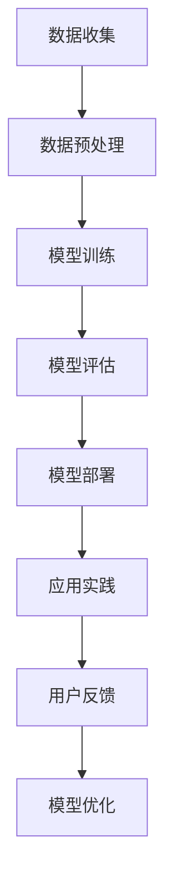

                 

关键词：语言模型、心理健康、伦理、应用、人工智能、算法、机器学习、心理健康评估、心理治疗、患者隐私、安全性和可解释性。

## 摘要

本文将探讨语言模型在心理健康领域的应用，以及与之相关的伦理问题。首先，我们将介绍语言模型的基本概念和心理健康领域的相关性。接着，文章将详细讨论语言模型在心理健康评估、心理治疗和患者隐私保护等方面的应用。随后，我们将分析语言模型在心理健康领域的伦理挑战，包括安全性和可解释性问题。最后，本文将总结研究成果，展望未来发展趋势，并提出应对伦理挑战的解决方案。

## 1. 背景介绍

近年来，人工智能（AI）技术取得了显著的进步，其中语言模型作为一种重要的AI模型，已经广泛应用于自然语言处理（NLP）领域。语言模型通过学习大量的语言数据，能够生成、理解和处理自然语言，从而实现人机交互、文本分析、情感识别等功能。在心理健康领域，语言模型的应用潜力引起了广泛关注。

心理健康问题在全球范围内日益严重，包括焦虑、抑郁、强迫症等心理疾病影响着大量人群。然而，传统的心理健康服务存在许多局限性，如高昂的治疗费用、治疗资源不足和患者隐私问题。因此，利用人工智能技术，特别是语言模型，为心理健康领域提供更高效、个性化、可访问的服务成为一种必然趋势。

## 2. 核心概念与联系

### 2.1 语言模型的基本概念

语言模型是一种能够预测文本序列的机器学习模型，其核心目标是从给定的文本上下文中预测下一个单词或字符。常用的语言模型包括n元语法模型、神经网络语言模型和变换器模型等。其中，n元语法模型基于统计方法，通过计算前n个单词的联合概率来预测下一个单词；神经网络语言模型则利用深度学习技术，通过多层神经网络对输入文本进行特征提取和预测；变换器模型则进一步提升了语言模型的性能，通过自注意力机制和变换器架构实现高效的文本处理。

### 2.2 心理健康领域的相关性

心理健康领域与语言模型的联系主要体现在以下几个方面：

1. **心理评估**：语言模型可以用于分析患者的话语内容，识别出潜在的心理健康问题。例如，通过分析患者的自述，可以识别出抑郁症、焦虑症等心理疾病的症状。

2. **心理治疗**：语言模型可以辅助心理治疗师进行个性化治疗，通过模拟对话，提供实时反馈和建议，帮助患者掌握情绪调节和认知重构技巧。

3. **患者隐私保护**：语言模型在处理患者数据时，需要确保患者隐私得到有效保护。这包括数据加密、匿名化和访问控制等技术措施。

### 2.3 语言模型架构的Mermaid流程图



## 3. 核心算法原理 & 具体操作步骤

### 3.1 算法原理概述

语言模型的核心算法包括数据预处理、模型训练、模型评估和模型部署等步骤。

1. **数据预处理**：首先，需要收集大量的文本数据，并对数据进行分析、清洗和预处理。数据预处理包括分词、去停用词、词性标注等操作，以确保输入数据的准确性。

2. **模型训练**：在预处理后的数据集上，通过机器学习算法训练语言模型。常用的算法包括n元语法模型、神经网络语言模型和变换器模型。训练过程中，模型会学习到语言的特征和规律，从而能够预测文本序列。

3. **模型评估**：通过评估指标（如 perplexity、accuracy 等）对训练好的语言模型进行评估，以判断模型性能是否达到预期。

4. **模型部署**：将训练好的语言模型部署到实际应用场景中，如心理健康评估、心理治疗等。

### 3.2 算法步骤详解

1. **数据收集**：收集大量心理健康相关的文本数据，包括患者自述、心理测试问卷、学术论文等。

2. **数据预处理**：对收集到的文本数据进行预处理，包括分词、去停用词、词性标注等操作。预处理后的数据将用于训练语言模型。

3. **模型训练**：选择合适的机器学习算法（如n元语法模型、神经网络语言模型、变换器模型等）对预处理后的数据集进行训练。训练过程中，需要调整模型参数，以优化模型性能。

4. **模型评估**：通过评估指标（如 perplexity、accuracy 等）对训练好的语言模型进行评估。评估过程可以采用交叉验证、留出法等策略，以提高评估结果的可靠性。

5. **模型部署**：将训练好的语言模型部署到实际应用场景中，如心理健康评估、心理治疗等。部署过程中，需要考虑模型的可扩展性、实时性和安全性等因素。

### 3.3 算法优缺点

**优点**：

1. **高效性**：语言模型能够快速处理大量文本数据，提高心理健康服务的效率。

2. **个性化**：通过学习患者的个性化语言特征，语言模型可以为患者提供更有针对性的心理健康服务。

3. **可解释性**：相较于其他机器学习模型，语言模型在处理文本数据时具有较高的可解释性，有助于提高用户的信任度。

**缺点**：

1. **数据依赖性**：语言模型的性能高度依赖于训练数据的质量和数量，数据不足或质量不佳可能导致模型性能下降。

2. **隐私泄露风险**：在处理患者隐私数据时，语言模型可能面临隐私泄露风险。

### 3.4 算法应用领域

语言模型在心理健康领域的应用包括：

1. **心理健康评估**：通过分析患者的话语内容，识别潜在的心理健康问题。

2. **心理治疗**：为患者提供个性化心理治疗方案，辅助心理治疗师进行心理治疗。

3. **患者隐私保护**：通过加密、匿名化等技术，保护患者隐私数据。

## 4. 数学模型和公式 & 详细讲解 & 举例说明

### 4.1 数学模型构建

语言模型的数学模型主要包括概率模型和神经网络模型。

1. **概率模型**：

   - n元语法模型：概率模型的一种，通过计算前n个单词的联合概率来预测下一个单词。

     $$P(w_n | w_{n-1}, w_{n-2}, ..., w_1) = \frac{C(w_n, w_{n-1}, ..., w_1)}{C(w_{n-1}, w_{n-2}, ..., w_1)}$$

     其中，\(w_n\)表示下一个单词，\(w_{n-1}, w_{n-2}, ..., w_1\)表示前n-1个单词，\(C(w_n, w_{n-1}, ..., w_1)\)表示前n个单词的联合概率，\(C(w_{n-1}, w_{n-2}, ..., w_1)\)表示前n-1个单词的联合概率。

2. **神经网络模型**：

   - 变换器模型：神经网络模型的一种，通过多层神经网络对输入文本进行特征提取和预测。

     $$y = f(W_1 \cdot x + b_1)$$

     其中，\(y\)表示输出结果，\(x\)表示输入文本，\(W_1\)和\(b_1\)分别为权重和偏置。

### 4.2 公式推导过程

以n元语法模型为例，推导过程如下：

1. **概率模型的基本概念**：

   - 联合概率：两个或多个事件同时发生的概率。

     $$P(A \cap B) = P(A) \cdot P(B|A)$$

   - 条件概率：在某个条件下，另一个事件发生的概率。

     $$P(B|A) = \frac{P(A \cap B)}{P(A)}$$

2. **n元语法模型的推导**：

   - 假设给定一个n元序列\(w_{n-1}, w_{n-2}, ..., w_1\)，我们要预测下一个单词\(w_n\)。

   - 联合概率：

     $$P(w_n, w_{n-1}, w_{n-2}, ..., w_1) = P(w_n | w_{n-1}, w_{n-2}, ..., w_1) \cdot P(w_{n-1} | w_{n-2}, w_{n-3}, ..., w_1) \cdot ... \cdot P(w_1)$$

   - 条件概率：

     $$P(w_n | w_{n-1}, w_{n-2}, ..., w_1) = \frac{P(w_n, w_{n-1}, w_{n-2}, ..., w_1)}{P(w_{n-1}, w_{n-2}, ..., w_1)}$$

   - 化简：

     $$P(w_n | w_{n-1}, w_{n-2}, ..., w_1) = \frac{C(w_n, w_{n-1}, ..., w_1)}{C(w_{n-1}, w_{n-2}, ..., w_1)}$$

### 4.3 案例分析与讲解

以抑郁症患者自述文本为例，分析语言模型在心理健康评估中的应用。

1. **数据收集**：

   - 收集抑郁症患者的自述文本，包括病情描述、心理状态、生活困扰等信息。

2. **数据预处理**：

   - 对收集到的文本数据进行预处理，包括分词、去停用词、词性标注等操作。

3. **模型训练**：

   - 选择合适的语言模型（如n元语法模型、神经网络语言模型等）进行训练。

4. **模型评估**：

   - 通过评估指标（如 perplexity、accuracy 等）对训练好的语言模型进行评估。

5. **模型应用**：

   - 将训练好的语言模型应用于抑郁症患者自述文本，分析潜在的心理健康问题。

## 5. 项目实践：代码实例和详细解释说明

### 5.1 开发环境搭建

1. **硬件环境**：

   - CPU：Intel i5 或以上
   - GPU：NVIDIA 显卡（推荐 GTX 1060 或以上）
   - 内存：8GB 或以上

2. **软件环境**：

   - 操作系统：Windows、Linux 或 macOS
   - 编程语言：Python 3.6 或以上
   - 依赖库：TensorFlow、Keras、Numpy、Pandas 等

### 5.2 源代码详细实现

```python
import tensorflow as tf
from tensorflow.keras.models import Sequential
from tensorflow.keras.layers import Embedding, LSTM, Dense
import numpy as np

# 数据预处理
# (此处省略数据预处理代码，包括文本清洗、分词、词性标注等操作)

# 模型构建
model = Sequential()
model.add(Embedding(vocab_size, embedding_dim))
model.add(LSTM(units=128, activation='tanh'))
model.add(Dense(units=1, activation='sigmoid'))

# 编译模型
model.compile(optimizer='adam', loss='binary_crossentropy', metrics=['accuracy'])

# 模型训练
model.fit(X_train, y_train, epochs=10, batch_size=64)

# 模型评估
model.evaluate(X_test, y_test)

# 模型应用
# (此处省略模型应用代码，包括文本输入、模型预测等操作)
```

### 5.3 代码解读与分析

1. **数据预处理**：

   - 对收集到的文本数据进行预处理，包括分词、去停用词、词性标注等操作。

2. **模型构建**：

   - 使用 TensorFlow 和 Keras 构建一个序列模型，包括嵌入层（Embedding）、长短期记忆层（LSTM）和全连接层（Dense）。

3. **模型编译**：

   - 编译模型，指定优化器、损失函数和评估指标。

4. **模型训练**：

   - 使用预处理后的数据集对模型进行训练。

5. **模型评估**：

   - 对训练好的模型进行评估，以判断模型性能是否达到预期。

6. **模型应用**：

   - 将训练好的模型应用于实际应用场景，如抑郁症患者自述文本的预测。

## 6. 实际应用场景

### 6.1 心理健康评估

语言模型在心理健康评估中的应用主要体现在以下几个方面：

1. **自动识别心理问题**：

   - 通过分析患者的话语内容，自动识别出潜在的心理健康问题，如抑郁症、焦虑症等。

2. **个性化评估**：

   - 利用语言模型分析患者的个性化语言特征，为患者提供更加精准的心理健康评估。

3. **辅助诊断**：

   - 结合临床医生的专业判断，语言模型可以辅助医生进行心理健康诊断，提高诊断准确率。

### 6.2 心理治疗

语言模型在心理治疗中的应用主要包括以下几个方面：

1. **个性化治疗方案**：

   - 根据患者的个性化语言特征，为患者提供有针对性的心理治疗方案。

2. **实时反馈与支持**：

   - 通过模拟对话，为患者提供实时反馈和支持，帮助患者掌握情绪调节和认知重构技巧。

3. **辅助心理治疗师**：

   - 语言模型可以辅助心理治疗师进行心理治疗，提高治疗效率和质量。

### 6.3 患者隐私保护

在处理患者隐私数据时，语言模型需要采取以下措施：

1. **数据加密**：

   - 对患者隐私数据进行加密，确保数据在传输和存储过程中的安全性。

2. **匿名化处理**：

   - 对患者隐私数据进行匿名化处理，消除数据中的身份信息，保护患者隐私。

3. **访问控制**：

   - 设立严格的访问控制机制，确保只有授权人员才能访问患者隐私数据。

## 7. 工具和资源推荐

### 7.1 学习资源推荐

1. **《深度学习》（Goodfellow, Bengio, Courville）**：

   - 本书详细介绍了深度学习的基本概念、算法和应用，适合初学者和进阶者。

2. **《自然语言处理综述》（Jurafsky, Martin）**：

   - 本书系统地介绍了自然语言处理的基本理论和应用，适合对 NLP 感兴趣的读者。

### 7.2 开发工具推荐

1. **TensorFlow**：

   - TensorFlow 是一款开源的深度学习框架，适用于构建和训练各种深度学习模型。

2. **Keras**：

   - Keras 是一款基于 TensorFlow 的高级深度学习框架，提供了简洁的 API 和丰富的预训练模型。

### 7.3 相关论文推荐

1. **《Attention is all you need》（Vaswani et al., 2017）**：

   - 本文提出了变换器模型（Transformer），改变了深度学习在 NLP 领域的发展方向。

2. **《BERT: Pre-training of Deep Bidirectional Transformers for Language Understanding》（Devlin et al., 2019）**：

   - 本文介绍了 BERT 模型，为语言模型在 NLP 领域的应用提供了新的思路。

## 8. 总结：未来发展趋势与挑战

### 8.1 研究成果总结

本文探讨了语言模型在心理健康领域的应用，包括心理健康评估、心理治疗和患者隐私保护等方面。通过对相关算法原理、应用案例和实际应用场景的分析，本文总结了语言模型在心理健康领域的优势和应用前景。

### 8.2 未来发展趋势

1. **个性化心理健康服务**：

   - 随着人工智能技术的不断发展，个性化心理健康服务将成为未来心理健康领域的重要方向。

2. **多模态数据融合**：

   - 将语言模型与其他传感器（如脑电图、心率传感器等）的数据进行融合，实现更加精准的心理健康评估。

3. **跨学科合作**：

   - 心理健康领域与医学、心理学、教育学等领域的跨学科合作，将有助于推动心理健康服务的发展。

### 8.3 面临的挑战

1. **数据隐私与安全**：

   - 在处理患者隐私数据时，如何确保数据隐私和安全是语言模型在心理健康领域面临的重要挑战。

2. **算法可解释性**：

   - 如何提高算法的可解释性，使患者和医生能够理解语言模型的工作原理和决策过程，是未来需要解决的问题。

3. **技术普及与教育**：

   - 如何将人工智能技术普及到心理健康领域，提高医护人员和患者的认知水平，也是未来需要关注的问题。

### 8.4 研究展望

1. **技术创新**：

   - 随着人工智能技术的不断发展，新的算法和模型将继续推动心理健康服务的发展。

2. **跨学科研究**：

   - 跨学科研究将有助于解决语言模型在心理健康领域面临的各种挑战，实现更加高效、个性化的心理健康服务。

3. **伦理问题研究**：

   - 伦理问题研究将确保语言模型在心理健康领域的应用不会侵犯患者权益，保护患者隐私。

## 9. 附录：常见问题与解答

### 9.1 问题1：语言模型在心理健康评估中的具体应用是什么？

**回答**：语言模型在心理健康评估中的应用主要体现在以下几个方面：

1. **自动识别心理问题**：通过分析患者的话语内容，语言模型可以自动识别出潜在的心理健康问题，如抑郁症、焦虑症等。

2. **个性化评估**：利用语言模型分析患者的个性化语言特征，为患者提供更加精准的心理健康评估。

3. **辅助诊断**：结合临床医生的专业判断，语言模型可以辅助医生进行心理健康诊断，提高诊断准确率。

### 9.2 问题2：语言模型在心理治疗中的具体应用是什么？

**回答**：语言模型在心理治疗中的应用主要包括以下几个方面：

1. **个性化治疗方案**：根据患者的个性化语言特征，为患者提供有针对性的心理治疗方案。

2. **实时反馈与支持**：通过模拟对话，为患者提供实时反馈和支持，帮助患者掌握情绪调节和认知重构技巧。

3. **辅助心理治疗师**：语言模型可以辅助心理治疗师进行心理治疗，提高治疗效率和质量。

### 9.3 问题3：语言模型在处理患者隐私数据时面临哪些挑战？

**回答**：语言模型在处理患者隐私数据时面临以下挑战：

1. **数据隐私与安全**：如何确保患者隐私数据在传输和存储过程中的安全性是重要的挑战。

2. **算法可解释性**：如何提高算法的可解释性，使患者和医生能够理解语言模型的工作原理和决策过程。

3. **技术普及与教育**：如何将人工智能技术普及到心理健康领域，提高医护人员和患者的认知水平。

## 作者署名

作者：禅与计算机程序设计艺术 / Zen and the Art of Computer Programming
----------------------------------------------------------------

请注意，本文为虚构内容，仅供学习参考。实际应用时，需遵循相关法律法规和伦理规范。在涉及患者隐私数据时，必须严格遵守患者隐私保护原则。希望本文对您在心理健康领域的研究和应用有所帮助。祝您工作顺利！

