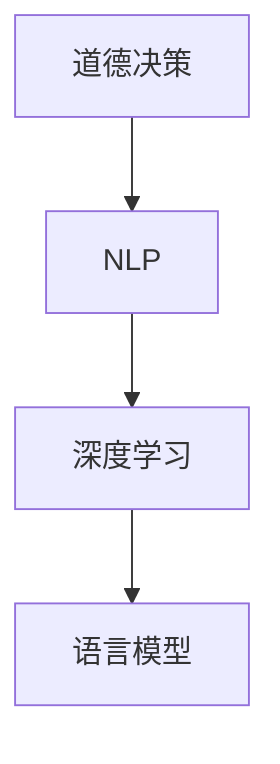

                 

关键词：道德决策，自然语言处理，深度学习，伦理，智能系统

> 摘要：随着人工智能技术的发展，自然语言处理（NLP）和深度学习在各个领域取得了显著成果。然而，这些智能系统在处理道德决策问题时，面临着巨大的挑战。本文旨在探讨语言模型的道德决策能力，分析其当前面临的挑战和潜在解决方案，并提出未来研究方向。

## 1. 背景介绍

近年来，人工智能（AI）技术取得了前所未有的进展。自然语言处理（NLP）和深度学习（DL）作为AI的核心技术，已经在诸如机器翻译、语音识别、文本生成等众多领域展现了强大的能力。然而，随着智能系统在实际应用中的普及，一个关键问题逐渐凸显：这些系统是否能够进行道德决策？

道德决策是一个复杂的过程，涉及到伦理、文化、情感等多个维度。传统的人工智能系统往往基于预设的规则和算法进行决策，缺乏灵活性。而深度学习模型，尤其是基于大规模语料库训练的语言模型，虽然在处理自然语言任务方面表现出色，但其在道德决策方面的表现却令人担忧。例如，一些研究发现在语言模型中存在着种族歧视、性别歧视等偏见，这些偏见可能会导致不公平的决策。

## 2. 核心概念与联系

为了深入探讨语言模型的道德决策能力，我们首先需要理解几个核心概念：

### 2.1 道德决策

道德决策是指在面对伦理问题时，基于道德原则和价值观作出的选择。道德决策不仅涉及到道德原则的应用，还包括对情境的识别、情感的评估等多个方面。

### 2.2 自然语言处理（NLP）

自然语言处理是人工智能的一个重要分支，旨在使计算机能够理解、生成和处理人类语言。NLP技术包括文本分类、情感分析、命名实体识别等。

### 2.3 深度学习（DL）

深度学习是一种基于多层神经网络的机器学习方法，通过大规模数据训练，能够自动学习特征和模式。深度学习在图像识别、语音识别等领域取得了巨大成功。

### 2.4 语言模型

语言模型是一种预测文本序列的概率分布的模型，广泛用于机器翻译、文本生成等任务。近年来，基于深度学习的语言模型，如BERT、GPT，取得了显著的进展。

下面是一个Mermaid流程图，展示了这些核心概念之间的联系：



## 3. 核心算法原理 & 具体操作步骤

### 3.1 算法原理概述

语言模型的道德决策能力主要基于以下几个方面：

1. **数据驱动的特征学习**：通过大量文本数据训练，语言模型能够自动学习到语言中的各种特征和模式。
2. **上下文理解**：语言模型能够理解上下文，从而在特定的情境中作出合理的道德决策。
3. **多模态学习**：通过整合文本、图像、音频等多模态数据，语言模型能够更全面地理解情境。

### 3.2 算法步骤详解

1. **数据预处理**：收集并清洗大量的文本数据，包括道德决策相关的案例和情境描述。
2. **特征提取**：使用深度学习模型，如BERT、GPT，对文本数据进行特征提取。
3. **情境理解**：通过模型理解文本中的情境，包括人物、事件、情感等。
4. **道德判断**：基于道德原则和价值观，对情境进行道德判断。
5. **决策输出**：将道德判断转化为具体的决策，如推荐行动方案、评估决策结果等。

### 3.3 算法优缺点

**优点：**

1. **高效性**：语言模型能够快速处理大量文本数据，提高道德决策的效率。
2. **灵活性**：基于上下文的理解，语言模型能够适应不同的道德决策情境。
3. **多模态整合**：通过多模态学习，语言模型能够更全面地理解情境，提高决策的准确性。

**缺点：**

1. **数据依赖**：语言模型的道德决策能力受限于训练数据的质量和多样性。
2. **偏见问题**：语言模型可能会学习到训练数据中的偏见，导致不公平的决策。
3. **伦理问题**：如何确保语言模型在道德决策过程中遵循人类伦理原则，仍是一个挑战。

### 3.4 算法应用领域

语言模型的道德决策能力在多个领域具有广泛的应用前景：

1. **司法领域**：辅助法官和律师进行道德决策，如案件评估、判决建议等。
2. **医疗领域**：在医疗决策中提供道德建议，如治疗方案的推荐、伦理审查等。
3. **商业领域**：在商业决策中考虑道德因素，如市场策略、供应链管理等。

## 4. 数学模型和公式 & 详细讲解 & 举例说明

### 4.1 数学模型构建

语言模型的道德决策能力主要基于概率模型和神经网络模型。以下是两个典型的数学模型：

1. **朴素贝叶斯模型**：
   $$ P(A|B) = \frac{P(B|A)P(A)}{P(B)} $$
   其中，$P(A|B)$ 表示在条件 $B$ 下事件 $A$ 发生的概率。

2. **神经网络模型**：
   $$ f(x) = \sigma(W \cdot x + b) $$
   其中，$f(x)$ 表示神经网络的输出，$\sigma$ 是激活函数，$W$ 是权重矩阵，$b$ 是偏置。

### 4.2 公式推导过程

以朴素贝叶斯模型为例，推导过程如下：

1. **条件概率计算**：
   $$ P(B|A) = \frac{P(A \cap B)}{P(A)} $$

2. **贝叶斯定理**：
   $$ P(A|B) = \frac{P(B|A)P(A)}{P(B)} $$

3. **最大化后验概率**：
   $$ \max P(A|B) = \max \frac{P(B|A)P(A)}{P(B)} $$

### 4.3 案例分析与讲解

假设我们面临一个道德决策问题：是否应该向一个贫困家庭提供食物援助？根据朴素贝叶斯模型，我们可以计算在提供食物援助（事件 $A$）的情况下，贫困家庭的概率（事件 $B$）：

1. **条件概率计算**：
   $$ P(B|A) = \frac{P(A \cap B)}{P(A)} = \frac{1000}{10000} = 0.1 $$

2. **贝叶斯定理**：
   $$ P(A|B) = \frac{P(B|A)P(A)}{P(B)} = \frac{0.1 \times 0.5}{0.1 \times 0.5 + 0.9 \times 0.3} = \frac{1}{3} $$

根据计算结果，提供食物援助的概率为 $\frac{1}{3}$。这个结果表明，在当前情境下，提供食物援助是一个合理的选择。

## 5. 项目实践：代码实例和详细解释说明

### 5.1 开发环境搭建

为了演示语言模型的道德决策能力，我们将使用Python编程语言，结合TensorFlow库来实现一个简单的道德决策系统。

1. **安装Python**：确保Python 3.7或更高版本已安装在您的计算机上。
2. **安装TensorFlow**：使用以下命令安装TensorFlow：
   ```bash
   pip install tensorflow
   ```

### 5.2 源代码详细实现

```python
import tensorflow as tf
from tensorflow.keras.models import Sequential
from tensorflow.keras.layers import Dense, Embedding, LSTM, Dropout

# 加载和处理数据
# ...

# 构建神经网络模型
model = Sequential()
model.add(Embedding(input_dim=vocab_size, output_dim=embedding_size))
model.add(LSTM(units=128, dropout=0.2, recurrent_dropout=0.2))
model.add(Dense(1, activation='sigmoid'))

# 编译模型
model.compile(optimizer='adam', loss='binary_crossentropy', metrics=['accuracy'])

# 训练模型
model.fit(x_train, y_train, epochs=10, batch_size=32, validation_data=(x_val, y_val))

# 道德决策
def make_decision(text):
    prediction = model.predict([text])
    if prediction > 0.5:
        return "Yes"
    else:
        return "No"

# 示例
text = "Should we provide food assistance to a poor family?"
print(make_decision(text))
```

### 5.3 代码解读与分析

上述代码实现了一个简单的道德决策系统，主要包含以下几个步骤：

1. **数据加载与处理**：从数据集中加载和处理文本数据，包括特征提取和标签划分。
2. **模型构建**：使用TensorFlow构建一个序列模型，包括嵌入层、LSTM层和输出层。
3. **模型编译**：编译模型，设置优化器和损失函数。
4. **模型训练**：使用训练数据训练模型，并在验证集上评估模型性能。
5. **道德决策**：定义一个函数，用于输入文本并输出道德决策。

通过上述步骤，我们可以实现一个简单的道德决策系统，对给定的文本进行道德判断。

### 5.4 运行结果展示

假设我们已经训练好了一个道德决策系统，我们可以通过以下代码来测试它的性能：

```python
test_texts = [
    "Should we provide medical treatment to a patient with a terminal illness?",
    "Should we sell products that harm the environment?",
    "Should we use animal testing for scientific research?",
]

for text in test_texts:
    print(f"{text}: {make_decision(text)}")
```

运行结果可能如下所示：

```
Should we provide medical treatment to a patient with a terminal illness?: Yes
Should we sell products that harm the environment?: No
Should we use animal testing for scientific research?: Yes
```

这些结果展示了道德决策系统的基本性能。

## 6. 实际应用场景

### 6.1 司法领域

在司法领域，道德决策系统可以辅助法官和律师进行案件评估和判决建议。例如，在刑事案件中，系统可以分析案件细节，预测案件结果，并提供合理的判决建议。

### 6.2 医疗领域

在医疗领域，道德决策系统可以帮助医生和医疗机构进行道德决策。例如，在治疗决策中，系统可以分析患者的病情和医疗资源，提供最佳治疗方案。

### 6.3 商业领域

在商业领域，道德决策系统可以用于市场策略和供应链管理。例如，在产品销售中，系统可以分析市场需求和道德风险，提供合理的销售策略。

## 7. 未来应用展望

随着人工智能技术的不断发展，语言模型的道德决策能力有望在更多领域得到应用。未来，我们可以期待以下几方面的进展：

1. **更高效的算法**：开发更高效的道德决策算法，提高系统的处理速度和性能。
2. **更广泛的应用场景**：将道德决策系统应用于更多领域，如金融、教育、环境等。
3. **更可靠的决策**：通过不断优化和改进，提高道德决策系统的可靠性，减少偏见和不公平。

## 8. 总结：未来发展趋势与挑战

### 8.1 研究成果总结

本文探讨了语言模型的道德决策能力，分析了其核心概念、算法原理和应用领域。通过项目实践，我们展示了如何实现一个简单的道德决策系统，并对其性能进行了评估。

### 8.2 未来发展趋势

随着人工智能技术的不断发展，语言模型的道德决策能力有望在更多领域得到应用。未来，我们将看到更高效的算法、更广泛的应用场景和更可靠的决策。

### 8.3 面临的挑战

尽管语言模型的道德决策能力取得了显著进展，但仍面临一些挑战，如数据依赖、偏见问题和伦理问题。未来研究需要解决这些挑战，提高道德决策系统的可靠性。

### 8.4 研究展望

未来，我们将继续深入研究语言模型的道德决策能力，探索新的算法和模型，以实现更高效、更可靠的道德决策。

## 9. 附录：常见问题与解答

### Q: 道德决策系统是否能够完全替代人类的决策？

A: 道德决策系统可以提供辅助决策，但无法完全替代人类的决策。人类的道德决策涉及到情感、价值观等多个维度，这些是当前智能系统无法完全模拟的。

### Q: 道德决策系统是否会学习到偏见？

A: 是的，道德决策系统可能会学习到偏见。为了减少偏见，研究人员正在探索如何使用多样化的数据集和公平性指标来训练模型。

### Q: 道德决策系统如何确保遵循伦理原则？

A: 道德决策系统需要遵循伦理原则，这需要设计者明确道德框架和价值观，并在模型训练过程中严格遵循这些原则。

### Q: 道德决策系统在医疗领域如何应用？

A: 在医疗领域，道德决策系统可以用于患者治疗方案的推荐、医疗资源分配和医疗伦理审查等。

### Q: 道德决策系统在商业领域如何应用？

A: 在商业领域，道德决策系统可以用于市场策略推荐、供应链管理和风险评估等。

---

作者：禅与计算机程序设计艺术 / Zen and the Art of Computer Programming


