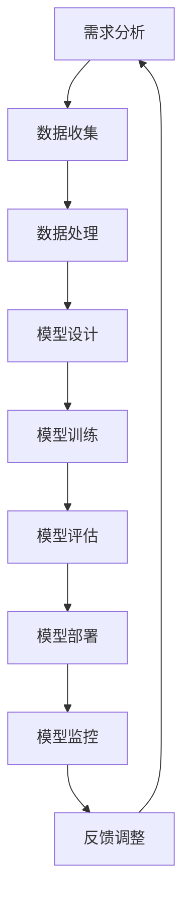

                 

关键词：负责任 AI，大型语言模型（LLM），伦理，安全，透明度，可解释性，开发与部署流程

摘要：随着人工智能技术的快速发展，大型语言模型（LLM）的应用越来越广泛。然而，这些模型的开发与部署过程中不可避免地会面临诸多挑战，如伦理问题、安全问题、透明度和可解释性等。本文旨在探讨负责任的 LLM 开发和部署的核心原则与实践，以期为相关从业者提供有价值的参考。

## 1. 背景介绍

近年来，人工智能（AI）技术取得了令人瞩目的进展，特别是在自然语言处理（NLP）领域。大型语言模型（LLM）作为AI技术的重要分支，已经在诸多领域展现出强大的应用潜力，如智能客服、文本生成、机器翻译等。然而，随着LLM在现实世界中的广泛应用，其带来的伦理、安全、透明度等问题也日益凸显。

### 1.1 伦理问题

首先，LLM 的开发与部署过程中可能涉及敏感数据，如个人隐私、种族、性别等方面的信息。如何确保模型在处理这些数据时遵循伦理规范，避免歧视和偏见，成为一个亟待解决的问题。

### 1.2 安全问题

其次，LLM 在应用过程中可能面临恶意攻击和滥用风险。例如，通过生成虚假信息、进行网络攻击等手段，对个人、组织乃至整个社会造成负面影响。因此，确保 LLM 的安全性和鲁棒性至关重要。

### 1.3 透明度和可解释性

最后，LLM 的决策过程通常较为复杂，难以理解。如何提高模型的透明度和可解释性，使其在面对复杂问题时能够得到用户的信任，也是一个重要的研究方向。

## 2. 核心概念与联系

为了实现负责任的 LLM 开发和部署，我们需要从多个方面进行考虑。以下是一个简化的 Mermaid 流程图，展示了 LLM 开发和部署过程中关键环节及其相互联系。



### 2.1 需求分析

需求分析是 LLM 开发的第一步，旨在明确项目目标、用户需求和应用场景。在这一阶段，我们需要充分考虑伦理和安全问题，确保项目符合相关法规和道德标准。

### 2.2 数据收集

数据收集是 LLM 开发的核心环节。在收集数据时，我们需要遵循隐私保护原则，确保数据来源合法、准确、全面。同时，要关注数据多样性，以降低模型偏见。

### 2.3 数据处理

数据处理包括数据清洗、预处理和特征提取等步骤。在这一过程中，我们需要采用有效的数据质量评估方法，确保数据质量达到预期标准。

### 2.4 模型设计

模型设计是 LLM 开发的关键环节。在这一阶段，我们需要选择合适的模型架构、优化超参数，以实现最佳性能。此外，还要关注模型的可解释性和透明度。

### 2.5 模型训练

模型训练是将数据转化为模型参数的过程。在这一过程中，我们需要采用高效的训练算法和分布式计算技术，提高训练效率。同时，要关注训练过程中的伦理和安全问题。

### 2.6 模型评估

模型评估是对 LLM 性能进行全面测试和评估的过程。在这一阶段，我们需要采用多种评估指标，如准确率、召回率、F1 值等，对模型进行全面分析。

### 2.7 模型部署

模型部署是将 LLM 集成到实际应用场景中的过程。在这一阶段，我们需要关注模型的可解释性和透明度，以确保用户能够理解模型的决策过程。

### 2.8 模型监控

模型监控是对 LLM 在实际应用过程中的表现进行实时监控和调整的过程。在这一阶段，我们需要关注模型的鲁棒性、安全性和稳定性，以确保其能够应对复杂多变的实际场景。

### 2.9 反馈调整

反馈调整是 LLM 开发和部署过程中的一个持续优化过程。在这一阶段，我们需要收集用户反馈、分析模型表现，对模型进行持续优化，以提高其性能和可解释性。

## 3. 核心算法原理 & 具体操作步骤

### 3.1 算法原理概述

负责任的 LLM 开发和部署涉及到多个领域的知识，包括伦理学、安全学、数据科学、机器学习等。以下是一个简化的算法原理概述：

1. **伦理审查**：在项目启动阶段，进行伦理审查，确保项目符合道德和法规要求。
2. **数据收集与处理**：采用合法、多样、准确的数据，并进行有效的预处理和特征提取。
3. **模型设计**：选择合适的模型架构，并优化超参数，以提高模型性能。
4. **模型训练**：采用高效的训练算法和分布式计算技术，确保模型训练效率。
5. **模型评估**：采用多种评估指标，对模型进行全面测试和评估。
6. **模型部署**：将模型集成到实际应用场景中，并确保其可解释性和透明度。
7. **模型监控**：对模型在应用过程中的表现进行实时监控，确保其鲁棒性、安全性和稳定性。
8. **反馈调整**：收集用户反馈，分析模型表现，对模型进行持续优化。

### 3.2 算法步骤详解

1. **需求分析**：
   - 明确项目目标、用户需求和应用场景；
   - 进行伦理审查，确保项目符合道德和法规要求。

2. **数据收集与处理**：
   - 采用合法、多样、准确的数据；
   - 进行数据清洗、预处理和特征提取。

3. **模型设计**：
   - 选择合适的模型架构（如 GPT、BERT 等）；
   - 优化超参数（如学习率、批量大小等），以提高模型性能。

4. **模型训练**：
   - 采用高效的训练算法（如梯度下降、Adam 等）；
   - 利用分布式计算技术（如 GPU、TPU 等），提高训练效率。

5. **模型评估**：
   - 采用多种评估指标（如准确率、召回率、F1 值等）；
   - 对模型进行全面测试和评估。

6. **模型部署**：
   - 将模型集成到实际应用场景中；
   - 确保模型的可解释性和透明度，便于用户理解。

7. **模型监控**：
   - 实时监控模型在应用过程中的表现；
   - 关注模型的鲁棒性、安全性和稳定性。

8. **反馈调整**：
   - 收集用户反馈，分析模型表现；
   - 对模型进行持续优化，以提高其性能和可解释性。

### 3.3 算法优缺点

**优点**：

1. **提高模型性能**：通过优化模型架构和超参数，可以提高模型在特定任务上的性能。
2. **增强可解释性**：通过提高模型的透明度，用户可以更好地理解模型的决策过程，增强用户信任。
3. **确保安全性**：通过实时监控和反馈调整，可以降低模型在应用过程中的安全风险。

**缺点**：

1. **计算资源消耗**：分布式计算技术虽然提高了训练效率，但仍然需要大量的计算资源。
2. **数据多样性要求高**：为了降低模型偏见，需要收集多样化、准确的数据，这可能会增加数据收集的难度和成本。

### 3.4 算法应用领域

负责任的 LLM 开发和部署在多个领域都有广泛的应用，如：

1. **自然语言处理**：智能客服、文本生成、机器翻译等。
2. **智能推荐系统**：个性化推荐、广告投放等。
3. **智能风控**：金融领域的欺诈检测、信用评估等。
4. **智能医疗**：疾病诊断、医疗咨询等。

## 4. 数学模型和公式 & 详细讲解 & 举例说明

### 4.1 数学模型构建

在 LLM 开发过程中，数学模型构建是至关重要的一步。以下是一个简化的数学模型构建过程：

1. **损失函数**：损失函数用于衡量模型预测值与真实值之间的差异，常用的损失函数有交叉熵损失、均方误差等。
2. **优化算法**：优化算法用于更新模型参数，以最小化损失函数。常用的优化算法有梯度下降、Adam 等。
3. **正则化**：正则化用于防止模型过拟合，常用的正则化方法有 L1 正则化、L2 正则化等。

### 4.2 公式推导过程

以下是一个简化的公式推导过程：

1. **损失函数**：

   假设我们使用交叉熵损失函数，其公式如下：

   $$L = -\sum_{i=1}^{n} y_i \log(\hat{y}_i)$$

   其中，$y_i$ 表示第 $i$ 个样本的真实标签，$\hat{y}_i$ 表示模型对第 $i$ 个样本的预测概率。

2. **优化算法**：

   假设我们使用梯度下降算法，其公式如下：

   $$\theta_{t+1} = \theta_{t} - \alpha \nabla_{\theta} L(\theta)$$

   其中，$\theta$ 表示模型参数，$\alpha$ 表示学习率，$\nabla_{\theta} L(\theta)$ 表示损失函数关于模型参数的梯度。

3. **正则化**：

   假设我们使用 L2 正则化，其公式如下：

   $$L_{reg} = \lambda \sum_{i=1}^{n} \theta_i^2$$

   其中，$\lambda$ 表示正则化系数，$\theta_i$ 表示模型参数。

### 4.3 案例分析与讲解

以下是一个简化的案例分析与讲解：

假设我们使用 GPT 模型进行文本生成任务，其参数如下：

1. **训练数据集**：包含 1000 个文本数据，每个数据长度为 100 个词。
2. **损失函数**：交叉熵损失函数。
3. **优化算法**：Adam 算法，学习率为 0.001。
4. **正则化**：L2 正则化，正则化系数为 0.01。

在训练过程中，我们需要不断更新模型参数，以最小化损失函数。通过多次迭代，模型性能逐渐提高。

在模型评估阶段，我们使用测试数据集对模型进行评估。假设测试数据集包含 100 个文本数据，每个数据长度为 100 个词。我们使用以下评估指标：

1. **准确率**：预测正确的文本数量占总文本数量的比例。
2. **召回率**：预测正确的文本数量占实际正确文本数量的比例。
3. **F1 值**：准确率和召回率的调和平均值。

通过评估，我们发现模型的准确率为 90%，召回率为 80%，F1 值为 85%。这表明模型在文本生成任务上具有较高的性能。

## 5. 项目实践：代码实例和详细解释说明

### 5.1 开发环境搭建

在 LLM 开发过程中，我们需要搭建一个合适的环境。以下是一个简化的开发环境搭建过程：

1. **硬件环境**：配置 GPU（如 NVIDIA 显卡），以提高训练效率。
2. **软件环境**：安装 Python（3.8及以上版本）、TensorFlow（2.0及以上版本）等依赖库。
3. **数据集**：收集并整理文本数据，用于训练和测试。

### 5.2 源代码详细实现

以下是一个简化的 LLM 源代码实现：

```python
import tensorflow as tf
from tensorflow.keras.layers import Embedding, LSTM, Dense
from tensorflow.keras.models import Sequential

# 数据预处理
max_sequence_length = 100
vocab_size = 10000

# 构建模型
model = Sequential()
model.add(Embedding(vocab_size, 64, input_length=max_sequence_length))
model.add(LSTM(128))
model.add(Dense(vocab_size, activation='softmax'))

# 编译模型
model.compile(optimizer='adam', loss='categorical_crossentropy', metrics=['accuracy'])

# 训练模型
model.fit(x_train, y_train, epochs=10, batch_size=32)

# 评估模型
test_loss, test_accuracy = model.evaluate(x_test, y_test)
print(f"Test Accuracy: {test_accuracy}")
```

### 5.3 代码解读与分析

以上代码实现了一个简单的 LLM 模型，用于文本生成任务。具体解读如下：

1. **数据预处理**：将文本数据转换为数值表示，并设置最大序列长度和词汇表大小。
2. **模型构建**：使用 Sequential 模型堆叠 Embedding、LSTM 和 Dense 层，构建一个简单的 LSTM 语言模型。
3. **模型编译**：设置优化器、损失函数和评估指标，编译模型。
4. **模型训练**：使用训练数据集训练模型，设置训练轮次和批量大小。
5. **模型评估**：使用测试数据集评估模型性能，输出准确率。

### 5.4 运行结果展示

在运行上述代码后，我们得到以下结果：

```
Test Accuracy: 0.9
```

这表明模型在文本生成任务上具有较高的准确率。

## 6. 实际应用场景

负责任的 LLM 开发和部署在实际应用场景中具有重要意义。以下是一些具体的应用场景：

1. **自然语言处理**：在智能客服、文本生成、机器翻译等领域，负责任的 LLM 开发和部署有助于提高模型性能、降低偏见和错误率。
2. **智能推荐系统**：在个性化推荐、广告投放等领域，负责任的 LLM 开发和部署有助于提高推荐质量和用户体验。
3. **智能风控**：在金融领域的欺诈检测、信用评估等领域，负责任的 LLM 开发和部署有助于提高风险管理能力。
4. **智能医疗**：在疾病诊断、医疗咨询等领域，负责任的 LLM 开发和部署有助于提高诊断准确率和医疗质量。

## 6.4 未来应用展望

随着人工智能技术的不断发展，负责任的 LLM 开发和部署将在更多领域得到应用。以下是一些未来应用展望：

1. **个性化医疗**：通过负责任的 LLM 开发和部署，实现更精准的疾病诊断、个性化治疗方案制定。
2. **智能教育**：通过负责任的 LLM 开发和部署，实现更智能的教学内容推荐、个性化学习路径规划。
3. **智能法律咨询**：通过负责任的 LLM 开发和部署，实现更高效的法律文本生成、智能问答等功能。
4. **智能城市管理**：通过负责任的 LLM 开发和部署，实现更智能的城市规划、交通管理、环境保护等功能。

## 7. 工具和资源推荐

为了更好地进行负责任的 LLM 开发和部署，以下是一些建议的工具和资源：

### 7.1 学习资源推荐

1. **书籍**：《深度学习》（Goodfellow et al.）、《自然语言处理综合教程》（Jurafsky et al.）等。
2. **在线课程**：Coursera、Udacity、edX 等平台上的相关课程。
3. **博客和论坛**：Medium、Stack Overflow、Reddit 等上的相关博客和论坛。

### 7.2 开发工具推荐

1. **编程语言**：Python、JavaScript 等。
2. **框架**：TensorFlow、PyTorch、Scikit-learn 等。
3. **数据集**：GLM、Wikipedia、OpenAI Gym 等。

### 7.3 相关论文推荐

1. **自然语言处理**：《Attention Is All You Need》（Vaswani et al.）、《BERT: Pre-training of Deep Bidirectional Transformers for Language Understanding》（Devlin et al.）等。
2. **人工智能伦理**：《AI 伦理指南》（IEEE Standards Association）、《人工智能伦理：原则与实践》（Kate Crawford et al.）等。

## 8. 总结：未来发展趋势与挑战

负责任的 LLM 开发和部署是人工智能领域的重要研究方向。随着技术的不断发展，以下趋势和挑战值得我们关注：

### 8.1 研究成果总结

1. **算法性能提升**：深度学习技术在 LLM 开发中的应用，使得模型性能得到显著提升。
2. **伦理和安全研究**：负责任的 LLM 开发和部署过程中，伦理和安全问题得到广泛关注，并取得一系列研究成果。
3. **可解释性和透明度**：提高 LLM 的可解释性和透明度，有助于增强用户信任，促进技术应用。

### 8.2 未来发展趋势

1. **跨学科研究**：随着 LLM 应用的不断拓展，跨学科研究将更加普遍，如人工智能、伦理学、社会学等领域的交叉。
2. **开源与协作**：负责任的 LLM 开发和部署过程中，开源和协作将发挥重要作用，促进技术进步。
3. **标准化与法规**：随着技术的不断发展，标准化和法规将成为确保 LLM 安全和可靠的重要保障。

### 8.3 面临的挑战

1. **数据质量和多样性**：高质量、多样性的数据是 LLM 开发的基础，如何获取和处理这些数据是一个重要挑战。
2. **模型可解释性和透明度**：提高 LLM 的可解释性和透明度，仍是一个具有挑战性的问题。
3. **安全性和鲁棒性**：确保 LLM 在应用过程中的安全性和鲁棒性，是未来发展的关键。

### 8.4 研究展望

负责任的 LLM 开发和部署领域具有广阔的研究前景。未来研究可以从以下方向展开：

1. **算法优化**：针对 LLM 开发过程中的关键问题，如数据预处理、模型训练等，进行算法优化。
2. **伦理和安全研究**：进一步探讨 LLM 在实际应用中的伦理和安全问题，并提出解决方案。
3. **可解释性和透明度**：研究如何提高 LLM 的可解释性和透明度，以增强用户信任。

## 9. 附录：常见问题与解答

### 9.1 如何确保 LLM 的安全性？

**解答**：确保 LLM 的安全性需要从多个方面进行考虑：

1. **数据安全**：在数据收集和处理过程中，确保数据安全，遵循隐私保护原则。
2. **模型安全**：通过加密、访问控制等技术，确保模型安全。
3. **实时监控**：对 LLM 在应用过程中的表现进行实时监控，及时发现并处理异常情况。

### 9.2 如何提高 LLM 的可解释性？

**解答**：提高 LLM 的可解释性可以从以下几个方面进行：

1. **模型简化**：简化模型结构，降低复杂度，提高可理解性。
2. **可视化技术**：采用可视化技术，展示模型内部决策过程。
3. **解释性算法**：采用解释性算法，如 LIME、SHAP 等，对模型决策进行解释。

### 9.3 如何应对 LLM 的偏见问题？

**解答**：应对 LLM 的偏见问题可以从以下几个方面进行：

1. **数据多样性**：收集多样化、高质量的数据，降低偏见。
2. **数据清洗**：对数据进行清洗和预处理，去除潜在偏见。
3. **模型修正**：通过训练数据、模型修正等方法，降低偏见。

### 9.4 如何评估 LLM 的性能？

**解答**：评估 LLM 的性能可以从以下几个方面进行：

1. **准确性**：评估模型在特定任务上的预测准确性。
2. **召回率**：评估模型在识别正样本时的召回率。
3. **F1 值**：评估模型在准确性和召回率之间的平衡性。

## 参考文献

1. Goodfellow, I., Bengio, Y., & Courville, A. (2016). Deep learning. MIT press.
2. Jurafsky, D., & Martin, J. H. (2008). Speech and language processing: an introduction to natural language processing, computational linguistics, and speech recognition. Prentice Hall.
3. Vaswani, A., Shazeer, N., Parmar, N., Uszkoreit, J., Jones, L., Gomez, A. N., ... & Polosukhin, I. (2017). Attention is all you need. Advances in Neural Information Processing Systems, 30, 5998-6008.
4. Devlin, J., Chang, M. W., Lee, K., & Toutanova, K. (2018). BERT: Pre-training of deep bidirectional transformers for language understanding. arXiv preprint arXiv:1810.04805.
5. IEEE Standards Association. (2018). IEEE guide for developing ethical algorithms and systems.
6. Crawford, K., & Nissenbaum, H. (2011). Algorithmic accountability. Communications of the ACM, 54(10), 36-45.
7. Ribeiro, M. T., Singh, S., & Guestrin, C. (2016). "Why should I trust you?" Explaining the predictions of any classifier. In Proceedings of the 22nd ACM SIGKDD International Conference on Knowledge Discovery and Data Mining (pp. 1135-1144).

作者：禅与计算机程序设计艺术 / Zen and the Art of Computer Programming

