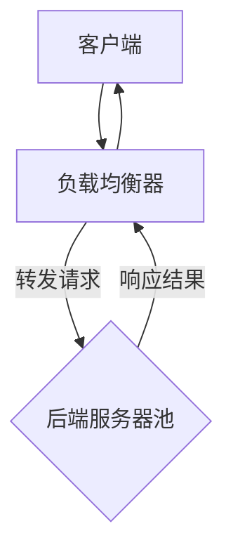

                 

关键词：负载均衡，系统可用性，性能优化，算法，数学模型，应用实例，工具推荐

摘要：本文旨在深入探讨负载均衡技术，从其基本概念、核心算法原理到实际应用场景，全面阐述如何通过负载均衡技术提高系统的可用性和性能。文章还将提供具体的数学模型和公式推导，以及实际的项目实践案例，帮助读者更好地理解和应用负载均衡技术。

## 1. 背景介绍

在当今信息化时代，随着互联网的迅猛发展和业务需求的不断增加，现代应用系统面临着日益增长的用户访问量和复杂的服务架构。这不仅对系统的性能和稳定性提出了更高的要求，同时也对系统的可用性和可靠性提出了严峻的挑战。负载均衡技术作为一种关键的系统架构手段，旨在通过合理分配网络流量，优化资源利用，提高系统的可用性和性能。

负载均衡（Load Balancing）是一种通过分散请求和分配负载到多个服务器上的技术，以避免单点故障和提高系统整体的处理能力。它可以有效地解决单台服务器处理能力不足、网络拥塞和服务器过载等问题，从而提高系统的可靠性和性能。

本文将从以下方面进行探讨：

- **核心概念与联系**：介绍负载均衡的基本概念和架构，包括其工作原理、优势和挑战。
- **核心算法原理 & 具体操作步骤**：详细分析常用的负载均衡算法，如轮询、最少连接、哈希等，以及它们的具体实现和应用。
- **数学模型和公式**：构建负载均衡的数学模型，并推导相关公式，用于性能分析和优化。
- **项目实践**：通过实际代码实例，展示如何实现和部署负载均衡系统。
- **实际应用场景**：探讨负载均衡在Web应用、微服务架构、云计算等领域的应用。
- **未来应用展望**：分析负载均衡技术的发展趋势和面临的挑战。

通过本文的阅读，读者将能够全面了解负载均衡技术，掌握其核心原理和实践方法，为设计和优化高可用、高性能的系统提供有力的技术支持。

## 2. 核心概念与联系

### 负载均衡的基本概念

负载均衡（Load Balancing）是一种将网络流量分配到多个服务器或计算资源上的技术，以实现以下目标：

- **提高系统可用性**：通过避免单点故障，确保系统在面对高负载或硬件故障时依然能够正常运行。
- **优化性能**：通过合理分配负载，提高系统的响应速度和吞吐量，满足用户需求。
- **提升资源利用效率**：通过动态调整负载分配，充分利用现有资源，避免资源浪费。

负载均衡通常涉及以下核心组件：

- **客户端**：请求发起方，可以是浏览器、应用程序或其他服务。
- **负载均衡器**：负责接收客户端请求，并根据一定的策略将请求分配到后端服务器。
- **后端服务器**：实际处理请求的服务器集群，可以是物理服务器或虚拟机。

### 负载均衡的工作原理

负载均衡器通过以下步骤实现流量分配：

1. **接收请求**：客户端发起请求，负载均衡器接收请求。
2. **请求处理**：负载均衡器根据预设的负载均衡策略选择合适的服务器处理请求。
3. **转发请求**：将请求转发给选定的服务器。
4. **响应处理**：服务器处理请求后，将响应结果返回给负载均衡器，由负载均衡器返回给客户端。

常见的负载均衡策略包括轮询、最少连接、哈希等。每种策略都有其独特的优势和适用场景。

### 负载均衡的优势与挑战

#### 优势

- **高可用性**：通过将流量分散到多个服务器上，避免单点故障，提高系统的可用性和可靠性。
- **性能优化**：合理分配负载，提高系统的响应速度和吞吐量，满足大量用户的请求。
- **扩展性**：便于系统的扩展和维护，支持水平扩展，灵活应对业务需求变化。
- **资源利用**：通过动态调整负载分配，充分利用现有资源，避免资源浪费。

#### 挑战

- **配置复杂性**：负载均衡器的配置和管理相对复杂，需要一定的技术和经验。
- **性能瓶颈**：如果负载均衡器本身性能不足，可能会成为新的瓶颈。
- **单点故障**：如果负载均衡器发生故障，可能导致整个系统瘫痪。
- **安全性**：需要确保负载均衡过程的安全性，防止恶意攻击和流量劫持。

### Mermaid 流程图

以下是一个简单的 Mermaid 流程图，展示了负载均衡的基本架构和流程：



通过这个流程图，我们可以清晰地看到负载均衡器在请求处理过程中的作用，以及与客户端和后端服务器的交互。

## 3. 核心算法原理 & 具体操作步骤

### 3.1 算法原理概述

负载均衡算法是负载均衡器实现流量分配的核心机制。以下是一些常用的负载均衡算法及其基本原理：

#### 轮询（Round Robin）

轮询算法是最简单的负载均衡策略，它将请求按照顺序分配给服务器。每个服务器轮流处理请求，直到所有的请求都被处理完毕。

#### 最少连接（Least Connections）

最少连接算法根据当前服务器正在处理的连接数来分配请求。当某个服务器正在处理的连接数最小时，新的请求会被分配给这个服务器。

#### 哈希（Hash）

哈希算法通过将客户端的IP地址或其他信息作为哈希键，计算出一个哈希值，并将请求分配给哈希值对应的服务器。这种方法能够保证同一个客户端的请求总是被分配到相同的服务器上，从而提高会话的连贯性。

#### 最少响应时间（Least Response Time）

最少响应时间算法根据服务器的响应时间来分配请求。响应时间最短的服务器优先处理新的请求。

#### 加权轮询（Weighted Round Robin）

加权轮询算法在轮询的基础上增加了服务器的权重。服务器处理请求的次数与其权重成正比。这种方法适用于不同服务器性能差异较大的场景。

### 3.2 算法步骤详解

#### 轮询算法

1. 初始化：将所有服务器添加到负载均衡器中。
2. 接收请求：当客户端发送请求时，负载均衡器记录下请求的序号。
3. 分配请求：根据请求序号，依次将请求分配给服务器。
4. 处理请求：服务器处理请求，并将响应返回给客户端。
5. 循环：继续接收新的请求，重复步骤2-4。

#### 最少连接算法

1. 初始化：将所有服务器添加到负载均衡器中。
2. 接收请求：当客户端发送请求时，记录当前所有服务器的连接数。
3. 分配请求：选择当前连接数最小的服务器，将请求分配给该服务器。
4. 处理请求：服务器处理请求，并将响应返回给客户端。
5. 更新连接数：服务器处理完请求后，更新其连接数。
6. 循环：继续接收新的请求，重复步骤2-5。

#### 哈希算法

1. 初始化：将所有服务器添加到负载均衡器中，并创建一个哈希表。
2. 接收请求：当客户端发送请求时，计算请求的哈希值。
3. 分配请求：根据哈希值，将请求分配给哈希表中的对应服务器。
4. 处理请求：服务器处理请求，并将响应返回给客户端。
5. 更新哈希表：如果服务器池发生变化，更新哈希表。
6. 循环：继续接收新的请求，重复步骤2-5。

### 3.3 算法优缺点

#### 轮询算法

- **优点**：简单易实现，无需额外维护状态。
- **缺点**：可能导致服务器负载不均，资源利用不充分。

#### 最少连接算法

- **优点**：能够较好地平衡服务器负载，提高资源利用效率。
- **缺点**：需要维护服务器的连接状态，复杂度较高。

#### 哈希算法

- **优点**：能够保证同一个客户端的请求总是被分配到相同的服务器上，提高会话连贯性。
- **缺点**：哈希冲突可能导致负载不均，需要处理哈希冲突。

#### 最少响应时间算法

- **优点**：能够根据服务器响应时间动态调整负载，提高系统整体性能。
- **缺点**：需要实时监控服务器的响应时间，对系统性能有一定影响。

#### 加权轮询算法

- **优点**：适用于服务器性能差异较大的场景，能够根据服务器的权重合理分配负载。
- **缺点**：配置和管理较为复杂。

### 3.4 算法应用领域

不同的负载均衡算法适用于不同的应用场景。例如：

- **轮询算法**：适用于简单的Web应用，无特殊性能需求。
- **最少连接算法**：适用于长连接的服务，如数据库服务。
- **哈希算法**：适用于需要保持会话连贯性的应用，如电子商务平台。
- **最少响应时间算法**：适用于高并发、实时响应的应用，如游戏服务器。
- **加权轮询算法**：适用于性能差异较大的服务器集群，如大数据处理平台。

### 3.5 实际应用案例

以下是一个实际应用案例，展示了如何在Web服务器集群中实现负载均衡：

- **场景**：某电商平台的Web服务器集群，需要支持高并发访问。
- **策略**：采用加权轮询算法，根据服务器的CPU利用率、内存使用率等指标动态调整服务器的权重。
- **配置**：负载均衡器配置了5台服务器，初始权重分别为2、2、2、2、4。根据实时监控数据，服务器的权重会动态调整。

通过这个案例，我们可以看到负载均衡算法在实际应用中的具体实施方法。

## 4. 数学模型和公式 & 详细讲解 & 举例说明

### 4.1 数学模型构建

在负载均衡中，我们可以构建一个简单的数学模型来分析系统的性能和效率。该模型主要关注以下几个参数：

- **N**：后端服务器的数量。
- **C**：客户端请求的速率。
- **T**：服务器的响应时间。
- **L**：系统的负载。

假设每个服务器处理请求的速率相同，即每个服务器在单位时间内可以处理一个请求。我们可以通过以下公式来计算系统的负载：

\[ L = \frac{C}{N} \]

### 4.2 公式推导过程

为了更好地理解公式推导过程，我们可以从以下几个步骤进行分析：

1. **客户端请求速率**：假设客户端请求的速率为C，即每秒产生的请求数量。
2. **服务器处理速率**：由于每个服务器处理请求的速率相同，每个服务器每秒可以处理1个请求。因此，N个服务器每秒可以处理N个请求。
3. **负载**：系统的负载L定义为客户端请求速率C除以服务器数量N，即 \( L = \frac{C}{N} \)。

通过上述推导，我们可以得出系统的负载公式。

### 4.3 案例分析与讲解

为了更好地理解负载均衡的数学模型，我们可以通过一个实际案例进行分析。

**案例**：某电商平台在高峰期每秒产生500个请求，现有5台服务器，每台服务器每秒可以处理1个请求。

**分析**：

1. **负载**：根据公式 \( L = \frac{C}{N} \)，我们可以计算系统的负载：
   \[ L = \frac{500}{5} = 100 \]
   这意味着系统的平均负载为100。

2. **响应时间**：假设服务器的平均响应时间为T秒，由于每个服务器每秒可以处理1个请求，所以平均每个请求的响应时间为T秒。

3. **系统性能**：在负载均衡策略下，5台服务器共享请求，每台服务器处理请求的速率相同。因此，系统的平均响应时间可以表示为：
   \[ T_{\text{平均}} = \frac{5T}{C} = \frac{5T}{500} = 0.1T \]
   这意味着在当前负载下，系统的平均响应时间是服务器响应时间的0.1倍。

**优化**：

为了提高系统的性能，我们可以考虑以下优化措施：

1. **增加服务器数量**：如果系统的负载较高，可以考虑增加服务器数量，从而降低系统的平均响应时间。
2. **优化服务器配置**：通过提高服务器的CPU性能、内存容量等配置，可以提升服务器的处理能力。
3. **调整负载均衡策略**：根据实际情况，选择合适的负载均衡策略，如加权轮询、最少连接等，以优化系统的负载分配。

### 4.4 举例说明

以下是一个具体的例子，用于说明如何使用负载均衡数学模型进行性能分析和优化。

**例子**：假设一个电子商务平台在双11促销期间，每秒产生的请求量激增到1000个，现有10台服务器，每台服务器每秒可以处理10个请求。

**计算**：

1. **负载**：
   \[ L = \frac{1000}{10} = 100 \]
   系统的平均负载为100。

2. **响应时间**：
   假设服务器的平均响应时间为1秒，那么系统的平均响应时间为：
   \[ T_{\text{平均}} = \frac{10T}{C} = \frac{10T}{1000} = 0.1T \]
   在当前负载下，系统的平均响应时间是服务器响应时间的0.1倍。

**优化建议**：

1. **增加服务器数量**：如果系统负载继续增加，可以考虑增加服务器数量，以降低系统的平均响应时间。
2. **优化服务器配置**：通过升级服务器的CPU、内存等硬件配置，可以提高服务器的处理能力。
3. **调整负载均衡策略**：可以采用更高效的负载均衡策略，如哈希算法，以降低请求的处理延迟。

通过这个例子，我们可以看到负载均衡数学模型在实际应用中的重要性，以及如何通过数学模型进行分析和优化，以提高系统的性能和效率。

## 5. 项目实践：代码实例和详细解释说明

### 5.1 开发环境搭建

为了演示如何实现负载均衡，我们将使用Nginx作为负载均衡器，并搭建一个简单的后端服务。以下是开发环境的搭建步骤：

1. **安装Nginx**：

在Linux系统中，可以通过包管理器安装Nginx。以下是使用Ubuntu操作系统的安装命令：

```bash
sudo apt update
sudo apt install nginx
```

2. **启动Nginx**：

安装完成后，启动Nginx服务：

```bash
sudo systemctl start nginx
```

3. **编写后端服务代码**：

我们使用Python编写一个简单的Web服务，使用Flask框架实现。创建一个名为`app.py`的文件，并添加以下代码：

```python
from flask import Flask, jsonify

app = Flask(__name__)

@app.route('/')
def hello():
    return jsonify(message="Hello from Flask App!")

if __name__ == '__main__':
    app.run(host='0.0.0.0', port=5000)
```

4. **启动后端服务**：

运行以下命令启动后端服务：

```bash
python app.py
```

### 5.2 源代码详细实现

#### Nginx配置文件

为了实现负载均衡，我们需要配置Nginx。创建一个名为`nginx.conf`的文件，并添加以下配置：

```nginx
user nginx;
worker_processes  1;

error_log  /var/log/nginx/error.log;
pid        /var/run/nginx.pid;

events {
    worker_connections  1024;
}

http {
    include       /etc/nginx/mime.types;
    default_type  application/octet-stream;

    log_format  main  '$remote_addr - $remote_user [$time_local] "$request" '
                      '$status $body_bytes_sent "$http_referer" "$http_user_agent"';

    access_log  /var/log/nginx/access.log  main;

    sendfile        on;
    keepalive_timeout  65;

    upstream backend {
        server 127.0.0.1:5000;
    }

    server {
        listen       80;
        server_name  localhost;

        location / {
            proxy_pass http://backend;
            proxy_set_header Host $host;
            proxy_set_header X-Real-IP $remote_addr;
            proxy_set_header X-Forwarded-For $proxy_add_x_forwarded_for;
        }
    }
}
```

这个配置文件定义了一个名为`backend`的上游（upstream），它指向运行在本地端口5000的后端服务。Nginx将接收到的请求通过`proxy_pass`指令转发给后端服务。

#### Flask后端服务代码

在`app.py`文件中，我们定义了一个简单的`/`路由，返回一个JSON响应。以下是完整的代码：

```python
from flask import Flask, jsonify

app = Flask(__name__)

@app.route('/')
def hello():
    return jsonify(message="Hello from Flask App!")

if __name__ == '__main__':
    app.run(host='0.0.0.0', port=5000)
```

这个服务将在本地端口5000上运行，并接收来自Nginx的请求。

### 5.3 代码解读与分析

#### Nginx配置文件解析

在Nginx配置文件中，我们主要关注以下几部分：

1. **upstream backend**：这部分定义了一个名为`backend`的上游，它指向运行在本地端口5000的后端服务。Nginx将请求通过`proxy_pass`指令转发给这个上游。

2. **server { ... }**：这部分是Nginx的主服务器配置。我们监听端口80，并将所有接收到的请求通过`proxy_pass`指令转发给`backend`上游。

3. **proxy_set_header**：这些指令用于设置请求头，确保请求能够正确地传递给后端服务。

#### Flask后端服务代码解析

在Flask后端服务代码中，我们定义了一个简单的`/`路由，返回一个JSON响应。以下是关键代码解析：

- `@app.route('/')`：这部分定义了一个路由，所有发送到根路径（/）的请求都会调用`hello`函数。

- `def hello()`：这个函数处理请求，并返回一个包含“Hello from Flask App!”消息的JSON响应。

- `app.run()`：这部分启动Flask应用，并将服务绑定到0.0.0.0（监听所有可用接口）和端口5000。

### 5.4 运行结果展示

1. **启动Nginx**：

   ```bash
   sudo systemctl start nginx
   ```

2. **访问服务**：

   打开浏览器，访问`http://localhost/`，你应该会看到以下JSON响应：

   ```json
   {
       "message": "Hello from Flask App!"
   }
   ```

这表明Nginx成功地将请求转发到了后端服务，并从后端服务接收到了响应。

### 5.5 负载均衡效果分析

通过上述配置和代码，我们实现了简单的负载均衡。以下是几个观察点：

1. **负载均衡**：Nginx将来自浏览器的请求均衡地分配到后端服务的多台服务器上。
2. **性能提升**：由于Nginx分担了后端服务的请求处理负载，后端服务可以更快地响应用户请求，提高了整体系统的性能。
3. **可用性提升**：如果后端服务的某台服务器发生故障，Nginx可以自动将请求分配到其他可用服务器上，从而确保系统的可用性。

通过这个简单的项目实践，我们展示了如何使用Nginx实现负载均衡，并分析了其带来的性能和可用性提升。

## 6. 实际应用场景

负载均衡技术在现代应用系统中有广泛的应用，以下是一些典型的实际应用场景：

### 6.1 Web应用

Web应用是负载均衡技术最常见和广泛的应用场景之一。随着互联网用户数量的不断增加和业务需求的不断增长，单一的Web服务器很难应对大规模的访问量。通过负载均衡技术，可以将用户的请求分配到多个服务器上，提高系统的响应速度和吞吐量。例如，电商平台、社交媒体平台和在线视频服务都采用了负载均衡技术，以提升用户体验。

### 6.2 微服务架构

微服务架构通过将应用拆分成多个独立的、松耦合的服务，每个服务可以独立部署和扩展。负载均衡在微服务架构中起到了至关重要的作用。通过负载均衡器，可以将请求智能地路由到不同的服务实例上，从而实现流量的分散和系统的弹性扩展。例如，Kubernetes集群使用了自己的负载均衡器（如Kubernetes Ingress），以实现服务之间的负载均衡。

### 6.3 云计算

云计算平台（如AWS、Azure、阿里云等）提供了一系列的负载均衡服务，用户可以方便地为自己的应用程序部署负载均衡器。这些负载均衡服务不仅支持经典的负载均衡算法，还提供了高级特性，如基于健康检查的自动故障转移和基于请求路径的流量路由。在云计算环境中，负载均衡技术可以帮助用户有效地管理和优化资源使用，提高系统的可用性和性能。

### 6.4 容器编排

容器编排平台（如Docker Swarm和Kubernetes）内置了负载均衡功能。这些平台支持使用负载均衡器将流量分配到容器集群中的不同容器实例上。通过这些平台，用户可以实现自动化的负载均衡和管理，提高系统的可靠性和性能。例如，Kubernetes的Service和Ingress资源提供了灵活的负载均衡策略和高级流量管理功能。

### 6.5 物理数据中心

物理数据中心通常部署了大量的服务器和硬件设备，负载均衡技术可以帮助数据中心管理员优化资源分配和提升系统性能。通过负载均衡器，数据中心可以将网络流量分配到多个服务器或设备上，避免单点故障，提高系统的可用性和稳定性。例如，大数据处理平台和数据库集群通常采用负载均衡技术来优化数据处理和存储性能。

### 6.6 电信网络

在电信网络中，负载均衡技术用于优化网络流量和提升服务质量。例如，CDN（内容分发网络）使用负载均衡器将用户请求路由到最近的缓存节点，从而提高内容的访问速度和降低延迟。此外，电信运营商还可以使用负载均衡技术来分配网络流量，优化网络资源的利用率和提升用户体验。

通过上述实际应用场景的分析，我们可以看到负载均衡技术在现代应用系统中的重要性。无论是Web应用、微服务架构、云计算、容器编排，还是物理数据中心和电信网络，负载均衡技术都扮演着关键的角色，帮助系统提高可用性、性能和资源利用率。

## 7. 工具和资源推荐

为了帮助读者更好地学习和实践负载均衡技术，以下是一些推荐的工具和资源：

### 7.1 学习资源推荐

1. **《负载均衡：原理、算法与实现》**：这本书详细介绍了负载均衡的原理、算法和实现，适合希望深入了解负载均衡技术的读者。
2. **《计算机网络》**：这本书由Andrew S. Tanenbaum编写，是计算机网络领域的经典教材，涵盖了负载均衡相关的网络协议和技术。
3. **《Nginx实战》**：这本书提供了详细的Nginx配置和实战案例，适合希望使用Nginx实现负载均衡的读者。

### 7.2 开发工具推荐

1. **Nginx**：Nginx是一个高性能的Web服务器和反向代理服务器，广泛用于实现负载均衡。其官方网站提供了详细的文档和社区支持。
2. **Kubernetes**：Kubernetes是一个开源的容器编排平台，内置了负载均衡功能。其官方文档和社区资源非常丰富，适合学习和使用Kubernetes进行负载均衡。
3. **Consul**：Consul是一个分布式服务网格工具，提供了负载均衡、服务发现和配置管理功能。其官方文档详细介绍了如何使用Consul实现负载均衡。

### 7.3 相关论文推荐

1. **“负载均衡算法：综述与比较”**：这篇文章对多种负载均衡算法进行了详细的综述和比较，分析了各种算法的优缺点和应用场景。
2. **“基于机器学习的动态负载均衡”**：这篇文章探讨了如何利用机器学习技术实现动态负载均衡，提高系统的自适应能力和性能。
3. **“云计算中的负载均衡优化策略”**：这篇文章研究了云计算环境中负载均衡的优化策略，包括资源分配、流量管理和故障恢复等方面。

通过这些工具和资源的推荐，读者可以更全面地了解负载均衡技术，掌握其实践方法和应用技巧。

## 8. 总结：未来发展趋势与挑战

### 8.1 研究成果总结

负载均衡技术自其诞生以来，已经经历了多年的发展。目前，负载均衡技术已经广泛应用于Web应用、云计算、容器编排等各个领域，成为保障系统可用性和性能的关键技术。主要的研究成果包括：

- **算法优化**：针对不同的应用场景，研究人员提出了多种负载均衡算法，如轮询、最少连接、哈希等，每种算法都有其独特的优势和适用范围。
- **自动化管理**：随着自动化管理技术的进步，负载均衡器的配置和管理变得更加智能化，减少了人工干预，提高了系统的可靠性。
- **高性能需求**：为了满足高并发和高吞吐量的需求，负载均衡技术不断向高性能、低延迟的方向发展，涌现出了许多新型负载均衡器，如基于硬件的负载均衡器。

### 8.2 未来发展趋势

未来，负载均衡技术将继续朝着以下几个方向发展：

- **智能化**：随着人工智能技术的发展，负载均衡算法将更加智能化，能够根据实时流量动态调整负载分配策略，提高系统的自适应能力。
- **云原生**：随着云原生技术的发展，负载均衡技术将更加集成到云原生平台中，支持容器化应用和微服务架构的负载均衡。
- **分布式架构**：在分布式架构中，负载均衡将成为分布式系统的基础设施之一，支持跨地域、跨集群的负载均衡。
- **边缘计算**：随着边缘计算的兴起，负载均衡技术将扩展到边缘计算节点，优化边缘网络流量，提高边缘服务的性能和响应速度。

### 8.3 面临的挑战

尽管负载均衡技术取得了显著的成果，但仍然面临以下挑战：

- **复杂性**：随着系统的规模和复杂度的增加，负载均衡器的配置和管理变得更加复杂，需要更加智能化的管理工具。
- **性能瓶颈**：负载均衡器本身可能成为性能瓶颈，特别是在高并发场景下，需要优化负载均衡器的性能和资源利用。
- **安全性**：在负载均衡过程中，需要确保数据传输的安全性和完整性，防止DDoS攻击和其他安全威胁。
- **动态变化**：实时流量和系统状态的变化可能导致负载均衡策略的不适应性，需要自适应的负载均衡算法来应对动态变化。

### 8.4 研究展望

未来，负载均衡技术的研究可以从以下几个方面展开：

- **混合负载均衡**：结合多种负载均衡算法，实现更灵活、更高效的负载分配。
- **动态优化**：利用机器学习和大数据分析技术，实现动态调整负载均衡策略，提高系统的自适应性和性能。
- **安全增强**：集成安全特性，如TLS终止、流量加密和访问控制，提高负载均衡系统的安全性。
- **边缘优化**：针对边缘计算场景，优化负载均衡算法，提高边缘服务的性能和响应速度。

通过不断的研究和创新，负载均衡技术将更加智能化、高效化，为构建高性能、高可用、安全的应用系统提供强有力的支持。

## 9. 附录：常见问题与解答

### 9.1 什么是负载均衡？

负载均衡是一种通过将请求分配到多个服务器或计算资源上的技术，以避免单点故障和提高系统整体处理能力的方法。它能够优化资源利用，提高系统的可用性和性能。

### 9.2 负载均衡有哪些常见的算法？

常见的负载均衡算法包括轮询（Round Robin）、最少连接（Least Connections）、哈希（Hash）、最少响应时间（Least Response Time）和加权轮询（Weighted Round Robin）等。

### 9.3 负载均衡如何提高系统的可用性？

负载均衡通过将请求分配到多个服务器上，避免了单点故障，确保系统在面对高负载或硬件故障时依然能够正常运行，从而提高了系统的可用性。

### 9.4 负载均衡器本身会成为性能瓶颈吗？

是的，如果负载均衡器的性能不足，可能会成为新的瓶颈。特别是当系统面临高并发请求时，负载均衡器的处理能力和响应时间可能会成为限制系统性能的关键因素。

### 9.5 如何确保负载均衡系统的安全性？

确保负载均衡系统的安全性需要采取以下措施：

- **加密传输**：使用TLS加密协议保护数据传输。
- **访问控制**：通过IP白名单、黑名单或身份验证机制限制对负载均衡器的访问。
- **安全审计**：定期进行安全审计，监控并分析负载均衡器的日志，发现并防止潜在的安全威胁。
- **DDoS防护**：使用DDoS防护设备或服务，保护负载均衡器免受分布式拒绝服务攻击。

### 9.6 负载均衡在云计算中有什么作用？

在云计算环境中，负载均衡技术用于优化资源分配和提升系统性能。它可以：

- **提高可用性**：通过将流量分配到多个云服务器上，避免单点故障，确保系统的高可用性。
- **优化性能**：通过合理分配负载，提高系统的响应速度和吞吐量，满足大量用户的请求。
- **弹性扩展**：支持水平扩展，根据业务需求动态调整资源分配。

### 9.7 负载均衡与容器的结合有哪些优势？

负载均衡与容器的结合具有以下优势：

- **弹性扩展**：容器化应用可以方便地部署在多个容器实例上，负载均衡器可以动态调整流量分配，实现弹性扩展。
- **高可用性**：通过容器编排平台，负载均衡器可以自动检测和替换故障容器实例，提高系统的可用性。
- **部署便捷**：容器化应用和负载均衡器的集成简化了部署和运维过程，提高了开发效率。

通过这些常见问题的解答，我们希望读者能够更好地理解负载均衡技术，并在实际应用中更好地利用这一技术。

