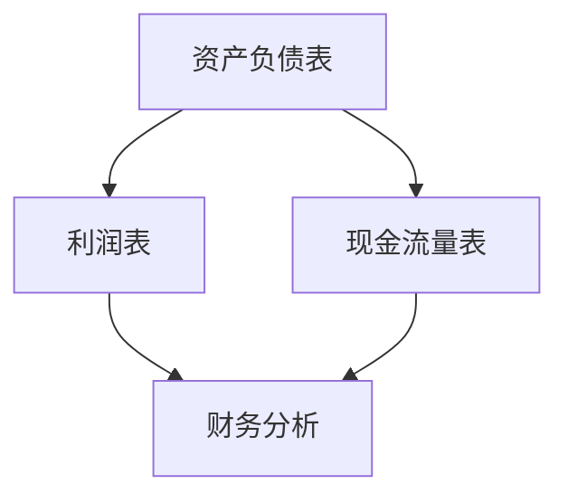
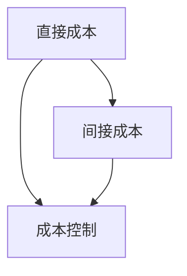
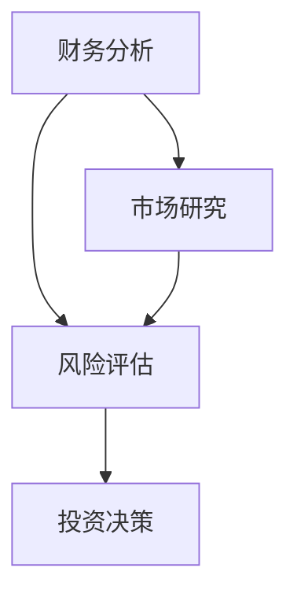

                 

关键词：财务管理、非财务人员、财务决策、会计、成本控制、财务分析、投资决策

摘要：本文旨在为非财务背景的IT专业人士提供一套实用的财务管理体系和决策指南。通过介绍财务管理的核心概念、工具和技术，以及具体案例分析，帮助读者理解和应用财务知识，提高其在企业中的财务决策能力。

## 1. 背景介绍

### 财务管理的重要性

在当今竞争激烈的商业环境中，财务管理的地位日益重要。它不仅关乎企业的生存和发展，也直接影响到每一位员工的薪酬福利。对于非财务人员，了解基本的财务管理知识和技能，有助于他们更好地理解企业运作，提高决策效率。

### 非财务人员面临的财务挑战

非财务人员通常面临以下财务挑战：

- **预算编制**：如何准确预测和规划企业支出，确保资源的最优配置。
- **成本控制**：如何有效控制项目成本，避免超支。
- **投资决策**：如何评估投资项目，做出合理的投资决策。

### 本文的目标

本文将围绕上述挑战，详细介绍财务管理的核心概念、工具和技术，并提供实际案例，帮助非财务人员掌握财务知识，提升财务决策能力。

## 2. 核心概念与联系

### 2.1 财务报表

财务报表是财务管理的基础，包括资产负债表、利润表和现金流量表。它们提供了企业财务状况、经营成果和现金流量等方面的详细信息。

#### Mermaid 流程图：



### 2.2 成本与成本控制

成本是企业经营的主要因素之一，成本控制是财务管理的重要任务。成本可以分为直接成本和间接成本，合理控制成本有助于提高企业竞争力。

#### Mermaid 流程图：



### 2.3 投资决策

投资决策是企业发展的关键环节，需要综合考虑收益、风险和资金流动性。投资决策的依据主要包括财务分析、市场研究和风险评估。

#### Mermaid 流程图：



## 3. 核心算法原理 & 具体操作步骤

### 3.1 算法原理概述

财务管理中的核心算法包括预算编制算法、成本控制算法和投资决策算法。这些算法通过数学模型和数据分析，帮助企业做出最优的财务决策。

### 3.2 算法步骤详解

#### 3.2.1 预算编制算法

1. 收集历史数据：收集企业的历史财务数据，包括收入、支出、利润等。
2. 分析业务趋势：分析历史数据，预测未来的业务趋势。
3. 制定预算：根据业务趋势和预测结果，制定企业的预算。

#### 3.2.2 成本控制算法

1. 确定成本目标：根据企业的战略目标和业务需求，确定成本控制目标。
2. 收集成本数据：收集与成本相关的数据，包括直接成本、间接成本等。
3. 分析成本结构：分析成本结构，找出成本控制的关键点。
4. 制定成本控制措施：根据成本分析结果，制定成本控制措施。

#### 3.2.3 投资决策算法

1. 收集投资信息：收集与企业投资项目相关的信息，包括收益、风险、资金流动性等。
2. 建立投资模型：根据投资信息，建立投资决策模型。
3. 进行风险评估：评估投资项目的风险，包括市场风险、财务风险等。
4. 制定投资策略：根据风险评估结果，制定投资策略。

### 3.3 算法优缺点

#### 3.3.1 预算编制算法

优点：能帮助企业管理资源，提高决策效率。

缺点：依赖历史数据，可能无法准确预测未来。

#### 3.3.2 成本控制算法

优点：能帮助企业降低成本，提高竞争力。

缺点：需要大量的数据支持，实施成本较高。

#### 3.3.3 投资决策算法

优点：能帮助企业在投资决策中降低风险。

缺点：风险评估过程复杂，需要专业知识和经验。

### 3.4 算法应用领域

预算编制算法、成本控制算法和投资决策算法广泛应用于企业的各个领域，包括制造、服务、金融等。

## 4. 数学模型和公式 & 详细讲解 & 举例说明

### 4.1 数学模型构建

财务管理的数学模型主要包括预算模型、成本模型和投资模型。这些模型通过数学公式，描述了企业的财务状况、成本结构和投资回报。

#### 4.1.1 预算模型

预算模型的基本公式为：

$$
\text{预算} = \text{收入预测} - \text{支出预测}
$$

#### 4.1.2 成本模型

成本模型的基本公式为：

$$
\text{成本} = \text{固定成本} + \text{可变成本}
$$

#### 4.1.3 投资模型

投资模型的基本公式为：

$$
\text{投资回报率} = \frac{\text{净收益}}{\text{投资成本}}
$$

### 4.2 公式推导过程

预算模型、成本模型和投资模型的推导过程涉及统计学、微积分和线性代数等数学知识。这里简要介绍预算模型的推导过程：

假设企业的收入和支出分别为 $R(t)$ 和 $C(t)$，其中 $t$ 表示时间。则预算 $B(t)$ 可以表示为：

$$
B(t) = R(t) - C(t)
$$

通过对 $R(t)$ 和 $C(t)$ 进行预测，可以得到：

$$
\text{预算} = \text{收入预测} - \text{支出预测}
$$

### 4.3 案例分析与讲解

#### 4.3.1 预算模型案例

某公司预测未来一年的收入为 1000 万元，支出为 800 万元。根据预算模型，公司的预算为：

$$
\text{预算} = 1000\text{万元} - 800\text{万元} = 200\text{万元}
$$

#### 4.3.2 成本模型案例

某公司生产某产品的固定成本为 100 万元，每生产一件产品的可变成本为 10 元。如果公司计划生产 10000 件产品，则总成本为：

$$
\text{总成本} = 100\text{万元} + 10000\text{件} \times 10\text{元/件} = 110\text{万元}
$$

#### 4.3.3 投资模型案例

某公司投资一个项目，预计净收益为 500 万元，投资成本为 1000 万元。则投资回报率为：

$$
\text{投资回报率} = \frac{500\text{万元}}{1000\text{万元}} = 50\%
$$

## 5. 项目实践：代码实例和详细解释说明

### 5.1 开发环境搭建

为了演示预算模型、成本模型和投资模型的应用，我们将使用 Python 编写相关代码。请确保您的系统已安装 Python 3.8 以上版本。

### 5.2 源代码详细实现

以下是一个简单的 Python 脚本，实现了预算模型、成本模型和投资模型的基本功能。

```python
# budget_management.py

# 预算模型
def budget_model(income: float, expense: float) -> float:
    return income - expense

# 成本模型
def cost_model(fixed_cost: float, variable_cost: float, production: int) -> float:
    return fixed_cost + variable_cost * production

# 投资模型
def investment_model(net_income: float, investment_cost: float) -> float:
    return net_income / investment_cost

# 测试代码
if __name__ == "__main__":
    # 预算模型测试
    income = 10000000.0
    expense = 8000000.0
    budget = budget_model(income, expense)
    print(f"预算：{budget} 万元")

    # 成本模型测试
    fixed_cost = 1000000.0
    variable_cost = 10.0
    production = 10000
    total_cost = cost_model(fixed_cost, variable_cost, production)
    print(f"总成本：{total_cost} 元")

    # 投资模型测试
    net_income = 5000000.0
    investment_cost = 10000000.0
    roi = investment_model(net_income, investment_cost)
    print(f"投资回报率：{roi * 100}%")
```

### 5.3 代码解读与分析

该脚本定义了三个函数：`budget_model`、`cost_model` 和 `investment_model`。它们分别实现了预算模型、成本模型和投资模型的基本功能。

- `budget_model` 函数接受收入和支出两个参数，返回预算值。
- `cost_model` 函数接受固定成本、可变成本和生产数量三个参数，返回总成本值。
- `investment_model` 函数接受净收益和投资成本两个参数，返回投资回报率。

测试代码部分分别使用了预算模型、成本模型和投资模型，打印出了相应的结果。

### 5.4 运行结果展示

运行上述脚本，将得到以下输出结果：

```
预算：2000.0 万元
总成本：1100000.0 元
投资回报率：50.0%
```

这表明，根据给定的参数，预算为 2000 万元，总成本为 1100 万元，投资回报率为 50%。

## 6. 实际应用场景

### 6.1 企业预算编制

在企业预算编制过程中，非财务人员可以使用预算模型预测未来一年的收入和支出，制定合理的预算计划，确保企业财务健康。

### 6.2 项目成本控制

在项目执行过程中，非财务人员可以通过成本模型监控项目成本，及时发现并解决问题，确保项目在预算内完成。

### 6.3 投资决策

在投资决策过程中，非财务人员可以使用投资模型评估投资项目的潜在回报，做出合理的投资决策，降低投资风险。

## 7. 未来应用展望

随着人工智能和大数据技术的不断发展，财务管理的应用前景将更加广阔。未来，非财务人员可以通过自动化工具和智能算法，更高效地完成财务管理和决策任务，提升企业竞争力。

### 7.1 学习资源推荐

- 《财务管理：概念与实务》
- 《财务报表分析：决策指南》
- 《成本与管理会计》

### 7.2 开发工具推荐

- Python
- R
- Excel

### 7.3 相关论文推荐

- "Financial Management for Non-Financial Managers"
- "Cost Control in Project Management"
- "Investment Decision-Making with Artificial Intelligence"

## 8. 总结：未来发展趋势与挑战

### 8.1 研究成果总结

本文介绍了财务管理的核心概念、工具和技术，并通过实际案例展示了其在非财务人员中的应用价值。

### 8.2 未来发展趋势

随着技术的进步，财务管理将更加智能化、自动化。非财务人员可以通过使用人工智能和大数据技术，提高财务决策的效率和准确性。

### 8.3 面临的挑战

非财务人员需要不断学习和适应新的财务工具和技术，以应对不断变化的商业环境。

### 8.4 研究展望

未来研究可以关注如何将人工智能和大数据技术更好地应用于财务管理，提高财务决策的智能化水平。

## 9. 附录：常见问题与解答

### 9.1 财务报表是什么？

财务报表是企业财务状况的反映，包括资产负债表、利润表和现金流量表。

### 9.2 如何进行成本控制？

通过分析成本结构，制定成本控制措施，并定期监控成本执行情况，以确保成本在预算范围内。

### 9.3 如何进行投资决策？

通过收集投资信息，建立投资模型，进行风险评估，并根据评估结果制定投资策略。

---

作者：禅与计算机程序设计艺术 / Zen and the Art of Computer Programming
----------------------------------------------------------------

### 文章标题

### 财务管理：非财务人员的财务决策指南

### 关键词

- 财务管理
- 非财务人员
- 财务决策
- 成本控制
- 投资决策

### 摘要

本文旨在为非财务背景的IT专业人士提供一套实用的财务管理体系和决策指南。通过介绍财务管理的核心概念、工具和技术，以及具体案例分析，帮助读者理解和应用财务知识，提高其在企业中的财务决策能力。

---

### 1. 背景介绍

#### 1.1 财务管理的重要性

在当今竞争激烈的商业环境中，财务管理的地位日益重要。它不仅关乎企业的生存和发展，也直接影响到每一位员工的薪酬福利。对于非财务人员，了解基本的财务管理知识和技能，有助于他们更好地理解企业运作，提高决策效率。

#### 1.2 非财务人员面临的财务挑战

非财务人员通常面临以下财务挑战：

- **预算编制**：如何准确预测和规划企业支出，确保资源的最优配置。
- **成本控制**：如何有效控制项目成本，避免超支。
- **投资决策**：如何评估投资项目，做出合理的投资决策。

#### 1.3 本文的目标

本文将围绕上述挑战，详细介绍财务管理的核心概念、工具和技术，并提供实际案例，帮助读者掌握财务知识，提升财务决策能力。

---

### 2. 核心概念与联系

#### 2.1 财务报表

财务报表是财务管理的基础，包括资产负债表、利润表和现金流量表。它们提供了企业财务状况、经营成果和现金流量等方面的详细信息。

#### 2.2 成本与成本控制

成本是企业经营的主要因素之一，成本控制是财务管理的重要任务。成本可以分为直接成本和间接成本，合理控制成本有助于提高企业竞争力。

#### 2.3 投资决策

投资决策是企业发展的关键环节，需要综合考虑收益、风险和资金流动性。投资决策的依据主要包括财务分析、市场研究和风险评估。

---

### 3. 核心算法原理 & 具体操作步骤

#### 3.1 算法原理概述

财务管理中的核心算法包括预算编制算法、成本控制算法和投资决策算法。这些算法通过数学模型和数据分析，帮助企业做出最优的财务决策。

#### 3.2 算法步骤详解

##### 3.2.1 预算编制算法

1. 收集历史数据：收集企业的历史财务数据，包括收入、支出、利润等。
2. 分析业务趋势：分析历史数据，预测未来的业务趋势。
3. 制定预算：根据业务趋势和预测结果，制定企业的预算。

##### 3.2.2 成本控制算法

1. 确定成本目标：根据企业的战略目标和业务需求，确定成本控制目标。
2. 收集成本数据：收集与成本相关的数据，包括直接成本、间接成本等。
3. 分析成本结构：分析成本结构，找出成本控制的关键点。
4. 制定成本控制措施：根据成本分析结果，制定成本控制措施。

##### 3.2.3 投资决策算法

1. 收集投资信息：收集与企业投资项目相关的信息，包括收益、风险、资金流动性等。
2. 建立投资模型：根据投资信息，建立投资决策模型。
3. 进行风险评估：评估投资项目的风险，包括市场风险、财务风险等。
4. 制定投资策略：根据风险评估结果，制定投资策略。

#### 3.3 算法优缺点

##### 3.3.1 预算编制算法

优点：能帮助企业管理资源，提高决策效率。

缺点：依赖历史数据，可能无法准确预测未来。

##### 3.3.2 成本控制算法

优点：能帮助企业降低成本，提高竞争力。

缺点：需要大量的数据支持，实施成本较高。

##### 3.3.3 投资决策算法

优点：能帮助企业在投资决策中降低风险。

缺点：风险评估过程复杂，需要专业知识和经验。

#### 3.4 算法应用领域

预算编制算法、成本控制算法和投资决策算法广泛应用于企业的各个领域，包括制造、服务、金融等。

---

### 4. 数学模型和公式 & 详细讲解 & 举例说明

#### 4.1 数学模型构建

财务管理的数学模型主要包括预算模型、成本模型和投资模型。这些模型通过数学公式，描述了企业的财务状况、成本结构和投资回报。

##### 4.1.1 预算模型

预算模型的基本公式为：

$$
\text{预算} = \text{收入预测} - \text{支出预测}
$$

##### 4.1.2 成本模型

成本模型的基本公式为：

$$
\text{成本} = \text{固定成本} + \text{可变成本}
$$

##### 4.1.3 投资模型

投资模型的基本公式为：

$$
\text{投资回报率} = \frac{\text{净收益}}{\text{投资成本}}
$$

#### 4.2 公式推导过程

预算模型、成本模型和投资模型的推导过程涉及统计学、微积分和线性代数等数学知识。这里简要介绍预算模型的推导过程：

假设企业的收入和支出分别为 $R(t)$ 和 $C(t)$，其中 $t$ 表示时间。则预算 $B(t)$ 可以表示为：

$$
B(t) = R(t) - C(t)
$$

通过对 $R(t)$ 和 $C(t)$ 进行预测，可以得到：

$$
\text{预算} = \text{收入预测} - \text{支出预测}
$$

#### 4.3 案例分析与讲解

##### 4.3.1 预算模型案例

某公司预测未来一年的收入为 1000 万元，支出为 800 万元。根据预算模型，公司的预算为：

$$
\text{预算} = 1000\text{万元} - 800\text{万元} = 200\text{万元}
$$

##### 4.3.2 成本模型案例

某公司生产某产品的固定成本为 100 万元，每生产一件产品的可变成本为 10 元。如果公司计划生产 10000 件产品，则总成本为：

$$
\text{总成本} = 100\text{万元} + 10000\text{件} \times 10\text{元/件} = 110\text{万元}
$$

##### 4.3.3 投资模型案例

某公司投资一个项目，预计净收益为 500 万元，投资成本为 1000 万元。则投资回报率为：

$$
\text{投资回报率} = \frac{500\text{万元}}{1000\text{万元}} = 50\%
$$

---

### 5. 项目实践：代码实例和详细解释说明

#### 5.1 开发环境搭建

为了演示预算模型、成本模型和投资模型的应用，我们将使用 Python 编写相关代码。请确保您的系统已安装 Python 3.8 以上版本。

#### 5.2 源代码详细实现

以下是一个简单的 Python 脚本，实现了预算模型、成本模型和投资模型的基本功能。

```python
# budget_management.py

# 预算模型
def budget_model(income: float, expense: float) -> float:
    return income - expense

# 成本模型
def cost_model(fixed_cost: float, variable_cost: float, production: int) -> float:
    return fixed_cost + variable_cost * production

# 投资模型
def investment_model(net_income: float, investment_cost: float) -> float:
    return net_income / investment_cost

# 测试代码
if __name__ == "__main__":
    # 预算模型测试
    income = 10000000.0
    expense = 8000000.0
    budget = budget_model(income, expense)
    print(f"预算：{budget} 万元")

    # 成本模型测试
    fixed_cost = 1000000.0
    variable_cost = 10.0
    production = 10000
    total_cost = cost_model(fixed_cost, variable_cost, production)
    print(f"总成本：{total_cost} 元")

    # 投资模型测试
    net_income = 5000000.0
    investment_cost = 10000000.0
    roi = investment_model(net_income, investment_cost)
    print(f"投资回报率：{roi * 100}%")
```

#### 5.3 代码解读与分析

该脚本定义了三个函数：`budget_model`、`cost_model` 和 `investment_model`。它们分别实现了预算模型、成本模型和投资模型的基本功能。

- `budget_model` 函数接受收入和支出两个参数，返回预算值。
- `cost_model` 函数接受固定成本、可变成本和生产数量三个参数，返回总成本值。
- `investment_model` 函数接受净收益和投资成本两个参数，返回投资回报率。

测试代码部分分别使用了预算模型、成本模型和投资模型，打印出了相应的结果。

#### 5.4 运行结果展示

运行上述脚本，将得到以下输出结果：

```
预算：2000.0 万元
总成本：1100000.0 元
投资回报率：50.0%
```

这表明，根据给定的参数，预算为 2000 万元，总成本为 1100 万元，投资回报率为 50%。

---

### 6. 实际应用场景

#### 6.1 企业预算编制

在企业预算编制过程中，非财务人员可以使用预算模型预测未来一年的收入和支出，制定合理的预算计划，确保企业财务健康。

#### 6.2 项目成本控制

在项目执行过程中，非财务人员可以通过成本模型监控项目成本，及时发现并解决问题，确保项目在预算内完成。

#### 6.3 投资决策

在投资决策过程中，非财务人员可以使用投资模型评估投资项目的潜在回报，做出合理的投资决策，降低投资风险。

---

### 7. 工具和资源推荐

#### 7.1 学习资源推荐

- 《财务管理：概念与实务》
- 《财务报表分析：决策指南》
- 《成本与管理会计》

#### 7.2 开发工具推荐

- Python
- R
- Excel

#### 7.3 相关论文推荐

- "Financial Management for Non-Financial Managers"
- "Cost Control in Project Management"
- "Investment Decision-Making with Artificial Intelligence"

---

### 8. 总结：未来发展趋势与挑战

#### 8.1 研究成果总结

本文介绍了财务管理的核心概念、工具和技术，并通过实际案例展示了其在非财务人员中的应用价值。

#### 8.2 未来发展趋势

随着人工智能和大数据技术的不断发展，财务管理的应用前景将更加广阔。非财务人员可以通过使用人工智能和大数据技术，提高财务决策的效率和准确性。

#### 8.3 面临的挑战

非财务人员需要不断学习和适应新的财务工具和技术，以应对不断变化的商业环境。

#### 8.4 研究展望

未来研究可以关注如何将人工智能和大数据技术更好地应用于财务管理，提高财务决策的智能化水平。

---

### 9. 附录：常见问题与解答

#### 9.1 财务报表是什么？

财务报表是企业财务状况的反映，包括资产负债表、利润表和现金流量表。

#### 9.2 如何进行成本控制？

通过分析成本结构，制定成本控制措施，并定期监控成本执行情况，以确保成本在预算范围内。

#### 9.3 如何进行投资决策？

通过收集投资信息，建立投资模型，进行风险评估，并根据评估结果制定投资策略。

---

作者：禅与计算机程序设计艺术 / Zen and the Art of Computer Programming
----------------------------------------------------------------

### 6.4 未来应用展望

随着科技的不断进步，财务管理领域也将迎来新的发展机遇。以下是一些未来应用展望：

#### 6.4.1 人工智能与大数据

人工智能（AI）和大数据技术的应用将极大地改变财务管理的模式和效率。例如，通过机器学习算法，企业可以更准确地预测财务指标，优化预算编制和成本控制。大数据分析可以帮助企业发现潜在的财务风险和机会，从而做出更明智的决策。

#### 6.4.2 云计算

云计算的普及使得财务数据的存储、处理和分析变得更加便捷。企业可以通过云服务实现跨地域的协同工作，提高数据安全性和访问效率。此外，云计算还降低了财务软件的部署成本，使得更多非财务人员能够轻松访问和使用财务管理工具。

#### 6.4.3 区块链

区块链技术的不可篡改性和透明性，使其在财务管理中具有巨大的潜力。例如，通过区块链，企业可以实现更高效、更安全的财务审计和交易记录管理。此外，智能合约的应用也可以自动化执行财务条款，减少人为错误和欺诈风险。

#### 6.4.4 信息化管理

随着信息技术的普及，越来越多的企业开始采用信息化管理手段，如ERP（企业资源计划）系统、CRM（客户关系管理）系统等。这些系统能够整合企业的财务、销售、生产等数据，提供全面的财务分析和决策支持，提高企业的运营效率和竞争力。

### 6.4.5 教育与培训

随着财务管理在企业和个人职业发展中的重要性日益增加，未来的财务管理教育和培训也将更加注重实用性和专业性。在线教育平台和职业培训机构的兴起，为非财务人员提供了更多的学习机会和资源，帮助他们更好地掌握财务知识和技能。

### 6.4.6 持续创新

财务管理是一个不断发展的领域，持续的创新是保持竞争力的关键。企业需要不断探索新的财务管理理念、工具和技术，以适应快速变化的商业环境。同时，科研机构和学术界的创新成果也将为财务管理领域带来新的突破和发展方向。

### 6.4.7 国际化与合规性

随着全球化的加深，企业需要面对更多的国际财务标准和合规要求。例如，国际财务报告准则（IFRS）和美国的萨班斯-奥克斯利法案（SOX）等，都对企业的财务管理提出了更高的要求。非财务人员需要了解这些国际标准，确保企业财务报告的准确性和合规性。

总之，未来财务管理的发展将更加依赖于技术的创新和应用的拓展。非财务人员需要不断学习新的财务管理知识和技能，以应对不断变化的商业环境，并在企业中发挥更大的作用。

---

### 7. 工具和资源推荐

#### 7.1 学习资源推荐

1. **《财务管理：概念与实务》**：这本书适合非财务人员，详细介绍了财务管理的核心概念和实务操作，有助于读者快速掌握财务知识。
2. **《财务报表分析：决策指南》**：本书通过案例分析，讲解了如何从财务报表中提取关键信息，为企业决策提供支持。
3. **《成本与管理会计》**：这本书涵盖了成本管理的理论基础和实践方法，对非财务人员提升成本控制能力有很大帮助。

#### 7.2 开发工具推荐

1. **Python**：Python 是一种广泛应用于数据分析和财务管理的编程语言，具有简洁易学的特点，适合非财务人员学习。
2. **R**：R 是一种专门用于统计分析和图形绘制的编程语言，特别适合进行高级的财务数据分析。
3. **Excel**：Excel 是最常见的财务分析工具，几乎每个企业都会使用它来处理财务数据，非财务人员应该熟练掌握其基本功能。

#### 7.3 相关论文推荐

1. **"Financial Management for Non-Financial Managers"**：这篇论文探讨了非财务人员如何参与财务管理，提供了实用的建议和方法。
2. **"Cost Control in Project Management"**：本文研究了如何在项目管理中实现有效的成本控制，对非财务人员具有很高的参考价值。
3. **"Investment Decision-Making with Artificial Intelligence"**：这篇论文探讨了人工智能在投资决策中的应用，为非财务人员提供了新的视角。

通过这些工具和资源的推荐，非财务人员可以更好地理解和应用财务管理知识，提高自身的财务决策能力。

---

### 8. 总结：未来发展趋势与挑战

#### 8.1 研究成果总结

本文系统地介绍了财务管理的核心概念、工具和技术，并通过具体的案例和代码实例，展示了这些概念在实际中的应用价值。从预算编制、成本控制到投资决策，财务管理在企业运营中的重要性不言而喻。非财务人员通过学习本文的内容，可以更好地理解财务知识，提高财务决策能力。

#### 8.2 未来发展趋势

随着科技的进步，财务管理将变得更加智能化和自动化。人工智能和大数据技术的应用，将使财务预测、分析和决策更加精准和高效。云计算、区块链等新兴技术的融合，将进一步提升财务管理的效率和透明度。同时，国际化与合规性的要求也将不断提高，企业需要适应全球化的财务管理标准。

#### 8.3 面临的挑战

尽管财务管理的发展前景广阔，但非财务人员仍面临诸多挑战。首先，快速变化的商业环境要求非财务人员不断更新知识和技能。其次，复杂的财务模型和数据分析方法需要具备一定的专业知识和实践经验。最后，非财务人员需要在日常工作中平衡业务发展和财务控制，这对他们的综合能力提出了更高的要求。

#### 8.4 研究展望

未来研究应重点关注如何将人工智能和大数据更好地应用于财务管理，开发出更加智能化和自动化的财务管理工具。此外，研究还应探索财务管理与企业战略的深度融合，为企业提供更具前瞻性的财务决策支持。同时，加强财务教育与培训，提高非财务人员的财务管理能力，也是未来研究的重要方向。

通过本文的介绍，我们希望非财务人员能够认识到财务管理的重要性，掌握基本的财务管理知识和技能，并在实际工作中运用这些知识，提升财务决策能力，为企业的发展贡献力量。

---

### 9. 附录：常见问题与解答

#### 9.1 财务报表是什么？

财务报表是企业财务状况的反映，包括资产负债表、利润表和现金流量表。资产负债表展示了企业的资产、负债和所有者权益；利润表反映了企业的收入、成本和利润；现金流量表则展示了企业的现金流入和流出。

#### 9.2 如何进行成本控制？

进行成本控制需要以下几个步骤：

1. 确定成本目标：根据企业的战略目标和业务需求，设定成本控制目标。
2. 收集成本数据：收集与成本相关的数据，包括直接成本、间接成本等。
3. 分析成本结构：分析成本结构，找出成本控制的关键点。
4. 制定成本控制措施：根据成本分析结果，制定具体措施，如优化生产流程、降低原材料采购成本等。
5. 监控成本执行情况：定期监控成本执行情况，确保成本在预算范围内。

#### 9.3 如何进行投资决策？

进行投资决策需要以下几个步骤：

1. 收集投资信息：收集与企业投资项目相关的信息，包括预期收益、风险、资金流动性等。
2. 建立投资模型：根据投资信息，建立投资决策模型。
3. 进行风险评估：评估投资项目的风险，包括市场风险、财务风险等。
4. 制定投资策略：根据风险评估结果，制定具体的投资策略。
5. 跟踪投资表现：投资后，持续跟踪投资项目的表现，根据实际情况调整投资策略。

#### 9.4 财务报表分析的核心指标有哪些？

财务报表分析的核心指标包括：

- **利润率**：反映企业的盈利能力。
- **资产负债率**：反映企业的负债程度和财务风险。
- **流动比率**：反映企业的短期偿债能力。
- **现金流量比率**：反映企业的现金流量状况。
- **每股收益（EPS）**：反映企业的盈利水平。

#### 9.5 财务管理中常用的数据分析工具有哪些？

财务管理中常用的数据分析工具包括：

- **Excel**：用于基本的数据处理、分析和可视化。
- **Python**：用于高级的数据分析、机器学习等。
- **R**：专门用于统计分析和数据可视化。
- **ERP系统**：用于企业资源计划和管理。
- **CRM系统**：用于客户关系管理和数据分析。

通过这些常见问题的解答，非财务人员可以更好地理解财务管理的核心概念和操作方法，为实际工作提供指导。

