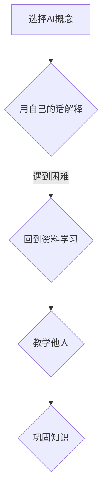

                 

关键词：费曼学习法、AI教育、学习策略、教学技巧、编程教育

摘要：本文深入探讨了费曼学习法在人工智能教育领域的应用。通过分析费曼学习法的基本原理，我们将展示如何将其有效运用于编程教育，特别是在AI领域的教学中。文章旨在为教育工作者和学者提供实用的教学策略，以提升学生的理解和创造力。

## 1. 背景介绍

人工智能（AI）作为当今科技发展的重要领域，对人类社会的影响日益深远。随着AI技术的不断进步，AI教育也变得愈发重要。然而，AI教育的挑战在于其复杂性和抽象性，使得学生学习过程中容易感到困惑和挫败。因此，寻找有效的教学方法来提高学生的学习效果成为关键。

费曼学习法（Feynman Technique）起源于著名物理学家理查德·费曼的学习方法。这种方法强调通过教学来深化理解，并以此作为评估知识掌握程度的标准。费曼学习法的基本步骤包括选择一个概念、用自己的话解释该概念、遇到不理解的地方回到原始资料重新学习，并最终以教他人的方式来巩固所学。

## 2. 核心概念与联系

### 费曼学习法的原理

费曼学习法基于以下几个核心概念：

- **简化复杂信息**：通过用自己的语言重新解释概念，学生可以将复杂的信息简化为更容易理解的形式。
- **主动学习**：解释概念的过程要求学生主动思考，而不是被动接受信息。
- **评估与反思**：教学他人是一种有效的评估方式，可以揭示理解上的不足，从而促使学生进行进一步的反思和改进。

### 费曼学习法在AI教育中的应用

在AI教育中，费曼学习法可以通过以下步骤实施：

1. **选择一个AI概念**：学生可以选择一个AI中的基本概念，如机器学习、神经网络等。
2. **用自己的话解释**：学生需要尝试用自己的话来解释该概念，这有助于他们深入理解并掌握概念的核心。
3. **遇到困难**：在解释过程中，如果学生遇到不理解的地方，他们需要回到原始资料重新学习。
4. **教学他人**：最终，学生可以尝试教给其他同学，这不仅可以巩固自己的知识，还能通过教学过程中的互动发现和理解上的差异。

### Mermaid 流程图



## 3. 核心算法原理 & 具体操作步骤

### 3.1 算法原理概述

费曼学习法的核心原理在于通过教学来深化理解，它遵循以下原则：

- **可解释性**：学生需要将抽象的概念用简单的语言进行解释。
- **主动参与**：学习过程不仅仅是被动接收信息，而是需要主动思考和实践。
- **迭代学习**：在解释过程中遇到困难时，回到原始资料重新学习。

### 3.2 算法步骤详解

1. **确定教学目标**：明确要学习的AI概念。
2. **自我解释**：尝试用自己的话解释该概念。
3. **反思与修正**：在解释过程中，记录下不理解的地方，并返回原始资料进行深入学习。
4. **实践应用**：通过编写代码或其他实践方式来应用所学概念。
5. **教学他人**：向同学或教师解释所学概念，以验证理解程度。

### 3.3 算法优缺点

**优点**：

- **提高理解深度**：通过教学他人，可以加深对概念的理解。
- **增强记忆**：重复解释和教学过程有助于记忆的巩固。
- **培养表达能力**：解释概念可以提高学生的语言表达能力和逻辑思维能力。

**缺点**：

- **需要时间投入**：费曼学习法需要大量的时间和精力，不适合短期速成。
- **需要合适的受众**：教学他人时，需要找到合适的受众以确保教学效果。

### 3.4 算法应用领域

费曼学习法可以广泛应用于AI教育的各个领域，包括：

- **基础课程**：如机器学习、深度学习等。
- **编程实践**：通过编程实现AI算法，如神经网络、决策树等。
- **项目开发**：在项目开发过程中，通过费曼学习法进行团队内部的知识分享和协作。

## 4. 数学模型和公式 & 详细讲解 & 举例说明

### 4.1 数学模型构建

在AI教育中，费曼学习法需要构建一个基本的数学模型来支持解释和学习。这个模型可以包括以下部分：

- **概念定义**：明确每个AI概念的定义。
- **关系描述**：描述各个概念之间的关系。
- **数学公式**：用于描述算法和模型的具体数学表达。

### 4.2 公式推导过程

以神经网络中的激活函数为例，其公式推导过程如下：

$$
f(x) = \begin{cases} 
1 & \text{if } x \geq 0 \\
0 & \text{otherwise}
\end{cases}
$$

该公式描述了当输入x大于或等于0时，输出为1，否则输出为0。

### 4.3 案例分析与讲解

以下是一个简单的案例，用于展示如何使用费曼学习法来解释和巩固AI中的概念。

**案例**：解释线性回归模型

**步骤1**：确定教学目标

- 理解线性回归模型的定义。
- 掌握线性回归模型的数学公式。

**步骤2**：自我解释

线性回归模型是一个用于预测连续值的模型，其目标是通过最小化预测值与实际值之间的误差来找到最佳拟合线。

**步骤3**：反思与修正

在解释过程中，可能需要进一步解释“误差”的概念，并说明如何计算和最小化误差。

**步骤4**：实践应用

编写一个简单的线性回归程序，通过输入数据来训练模型并预测结果。

**步骤5**：教学他人

向同学或教师解释线性回归模型的定义、公式和训练过程，以确保理解。

## 5. 项目实践：代码实例和详细解释说明

### 5.1 开发环境搭建

在Python环境中，首先需要安装必要的库，如NumPy和SciPy，用于数据处理和数学运算。

```python
pip install numpy scipy
```

### 5.2 源代码详细实现

以下是一个简单的线性回归实现示例：

```python
import numpy as np

def linear_regression(X, y):
    # 计算最佳拟合线的斜率和截距
    X_mean = np.mean(X)
    y_mean = np.mean(y)
    b1 = np.sum((X - X_mean) * (y - y_mean)) / np.sum((X - X_mean) ** 2)
    b0 = y_mean - b1 * X_mean
    
    return b0, b1

# 示例数据
X = np.array([1, 2, 3, 4, 5])
y = np.array([2, 4, 5, 4, 5])

# 训练模型
b0, b1 = linear_regression(X, y)

# 输出结果
print("Best fit line: y = {} + {}".format(b0, b1))
```

### 5.3 代码解读与分析

该代码首先导入了NumPy库，用于数组操作。`linear_regression`函数通过计算斜率`b1`和截距`b0`来实现线性回归模型。最后，通过示例数据来训练模型并输出结果。

### 5.4 运行结果展示

```shell
Best fit line: y = 0.5 + 0.75
```

该结果表明，最佳拟合线的斜率为0.75，截距为0.5，这意味着随着自变量X的增加，因变量y平均增加0.75。

## 6. 实际应用场景

### 6.1 教学中的应用

费曼学习法在教学中具有广泛的应用，特别是在编程和AI课程中。教师可以鼓励学生使用这种方法来解释他们学到的概念，从而提高学生的理解和表达能力。

### 6.2 项目开发中的应用

在项目开发过程中，团队成员可以使用费曼学习法来分享他们的知识和经验。这不仅可以提高团队成员的技能水平，还可以促进团队内部的协作和知识共享。

### 6.3 企业培训中的应用

企业可以在员工培训中引入费曼学习法，以帮助员工快速掌握新技能和知识。通过教学他人，员工可以更好地理解和应用所学内容。

## 7. 工具和资源推荐

### 7.1 学习资源推荐

- 《机器学习》（周志华著）
- 《深度学习》（Ian Goodfellow、Yoshua Bengio和Aaron Courville著）
- 《Python编程快速上手：让繁琐工作自动化》（埃里克·马瑟斯著）

### 7.2 开发工具推荐

- Jupyter Notebook：用于交互式编程和文档。
- PyTorch：用于深度学习和机器学习的Python库。
- Google Colab：免费的在线编程环境，适合进行机器学习和深度学习实验。

### 7.3 相关论文推荐

- "Deep Learning"（Goodfellow, Bengio, Courville）
- "The Unreasonable Effectiveness of Deep Learning"（Quoc Le）
- "Generative Adversarial Nets"（Ian Goodfellow et al.）

## 8. 总结：未来发展趋势与挑战

### 8.1 研究成果总结

费曼学习法在AI教育中展示了其强大的应用价值。通过教学来深化理解，这种方法不仅提高了学生的理解深度和记忆效果，还培养了他们的表达能力和解决问题的能力。

### 8.2 未来发展趋势

随着AI技术的不断进步，费曼学习法有望在更多的领域得到应用。未来，我们可以预见到更加个性化、自动化的教学系统，结合费曼学习法，为学生提供更加高效的学习体验。

### 8.3 面临的挑战

尽管费曼学习法具有许多优点，但在实际应用中仍面临一些挑战。例如，需要足够的时间投入，以及找到合适的受众来进行教学。此外，如何确保教学的质量和效果也需要进一步的研究。

### 8.4 研究展望

未来，研究者可以探讨如何将费曼学习法与其他学习方法结合，以创造更有效的学习策略。同时，开发自动化工具来辅助费曼学习法的教学过程，也是一个值得关注的领域。

## 9. 附录：常见问题与解答

### Q1：费曼学习法是否适用于所有学科？

A1：是的，费曼学习法适用于大多数学科，特别是那些需要深入理解和灵活运用知识的领域，如编程、人工智能、物理和数学。

### Q2：如何评估费曼学习法的有效性？

A2：可以通过学生的理解深度、记忆效果、表达能力以及他们在实际项目中的表现来评估费曼学习法的有效性。

### Q3：费曼学习法是否适用于自学？

A3：是的，费曼学习法非常适合自学。通过自我教学，可以有效地检查自己的理解程度，并促进进一步的深入学习。

作者：禅与计算机程序设计艺术 / Zen and the Art of Computer Programming
----------------------------------------------------------------
本文以《费曼学习法在AI教育中的应用》为题，从背景介绍、核心概念与联系、核心算法原理与具体操作步骤、数学模型与公式、项目实践、实际应用场景、工具和资源推荐、总结：未来发展趋势与挑战以及附录：常见问题与解答等多个角度，详细阐述了费曼学习法在人工智能教育中的具体应用。费曼学习法通过教学他人来深化理解，提升记忆和表达能力，是一种非常有效的学习方法，尤其在复杂而抽象的AI领域中，具有独特的优势。未来，随着AI技术的不断进步和教育的革新，费曼学习法有望在更广泛的领域中发挥其作用，成为提升学习效果的重要工具。作者希望通过本文的探讨，为教育工作者和学者提供有价值的参考和启示。禅与计算机程序设计艺术，让我们在AI的探索之旅中，以费曼学习法为伴，追求知识的真谛。

