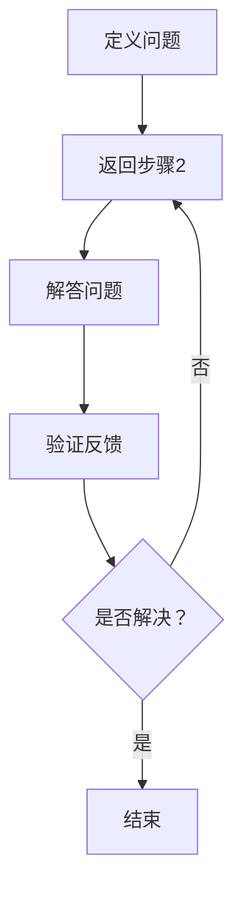

                 

关键词：费曼提问法、管理问题诊断、技术管理、流程优化、策略制定

> 摘要：本文旨在探讨费曼提问法在企业管理问题诊断中的应用，通过深入分析费曼提问法的核心原理和实践案例，揭示其在提升管理效率、优化决策流程、增强团队协作等方面的潜力，为企业管理者提供一种实用且高效的问题诊断工具。

## 1. 背景介绍

在企业管理中，问题诊断是一个至关重要的环节。无论是战略规划、运营管理，还是市场营销，管理问题的有效诊断和解决直接关系到企业的生存和发展。传统的管理问题诊断方法，如SWOT分析、五力模型等，往往注重外部环境的分析，而缺乏对内部管理问题的深入挖掘。在这种情况下，费曼提问法作为一种源于物理学领域的方法，因其简洁、高效、结构化的特点，逐渐在企业管理领域得到应用。

费曼提问法，又称“渐进式提问法”，是由著名物理学家理查德·费曼提出的一种问题解决策略。其核心理念是通过一系列递进式的问题，逐步剥去复杂现象的外壳，直达问题的核心。费曼提问法强调直观、简洁和逻辑性，使得复杂的问题变得易于理解和解决。

## 2. 核心概念与联系

### 费曼提问法的基本原理

费曼提问法的核心在于通过“问问题”的方式，逐步揭示问题的本质。具体来说，它包含以下几个步骤：

1. **定义问题**：首先，要明确要解决的问题是什么，确保问题表述清晰、具体。
2. **提问**：针对问题，提出一系列简明、直接的问题，这些问题应该有助于深入挖掘问题的本质。
3. **解答**：对提出的问题进行解答，通过不断的迭代和反思，逐步接近问题的核心。
4. **验证**：在解答过程中，通过反馈和验证，确保解答的准确性和有效性。

### 费曼提问法的 Mermaid 流程图



## 3. 核心算法原理 & 具体操作步骤

### 3.1 算法原理概述

费曼提问法的原理基于人类认知的几个基本规律：

1. **清晰性**：问题表述的清晰性直接影响了解决问题的高效性。
2. **反馈循环**：通过不断的反馈和调整，逐步缩小问题范围，提高解决问题的精度。
3. **直观性**：问题的解答应该直观、易于理解，避免过度复杂。

### 3.2 算法步骤详解

1. **确定问题**：首先，明确需要解决的问题。这个步骤至关重要，因为问题的清晰度直接影响到后续的提问和解答过程。
2. **提出问题**：根据确定的问题，提出一系列简明、直接的问题。这些问题应该围绕问题的核心，有助于揭示问题的本质。
3. **解答问题**：针对提出的问题进行解答。在解答过程中，要保持逻辑清晰，避免跳跃性思维。
4. **验证反馈**：在解答问题后，通过反馈和验证，确保解答的准确性和有效性。如果解答不准确，需要返回上一步重新分析。

### 3.3 算法优缺点

**优点**：

- **直观性**：通过简单的提问和解答，能够快速揭示问题的本质。
- **灵活性**：适应性强，可以应用于各种管理问题。
- **高效性**：能够快速定位问题，提高解决问题的效率。

**缺点**：

- **主观性**：解答过程依赖于提问者的经验和知识，可能存在偏差。
- **复杂性**：对于一些复杂的问题，费曼提问法可能需要反复迭代，时间成本较高。

### 3.4 算法应用领域

费曼提问法在企业管理中有着广泛的应用领域：

- **战略规划**：帮助管理者明确战略目标，制定具体的实施策略。
- **运营管理**：优化运营流程，提高效率，降低成本。
- **人力资源管理**：解决员工关系问题，提升团队协作效率。
- **市场营销**：分析市场趋势，制定有效的营销策略。

## 4. 数学模型和公式 & 详细讲解 & 举例说明

### 4.1 数学模型构建

费曼提问法本质上是一种逻辑推理过程，可以通过以下数学模型来描述：

$$
P = (Q_1, Q_2, \ldots, Q_n)
$$

其中，$P$ 表示问题，$Q_i$ 表示第 $i$ 个问题。

### 4.2 公式推导过程

$$
P_0 = P \\
P_{i+1} = P_i \cup (Q_i \rightarrow A_i)
$$

其中，$P_0$ 表示初始问题，$P_i$ 表示第 $i$ 个问题的集合，$Q_i$ 表示第 $i$ 个问题，$A_i$ 表示第 $i$ 个问题的答案。

### 4.3 案例分析与讲解

#### 案例背景

某公司在市场调研中发现，其产品在A地区的销售额远低于预期。为了找出原因，公司决策层决定使用费曼提问法进行问题诊断。

#### 案例步骤

1. **定义问题**：为什么A地区的销售额远低于预期？
2. **提出问题**：
   - Q1：A地区的消费者对产品的认知度如何？
   - Q2：A地区的竞争对手情况如何？
   - Q3：A地区的营销策略是否有效？
3. **解答问题**：
   - A1：通过对消费者调查，发现A地区的消费者对产品的认知度较低。
   - A2：通过市场分析，发现A地区的竞争对手数量较多，且竞争力较强。
   - A3：通过对营销策略的评估，发现A地区的营销策略存在不足。
4. **验证反馈**：根据解答，调整营销策略，增加A地区的广告投放，并开展促销活动。

#### 案例结果

经过一段时间的调整，A地区的销售额逐渐回升，达到了预期水平。通过费曼提问法，公司成功找到了问题所在，并采取了有效的解决措施。

## 5. 项目实践：代码实例和详细解释说明

### 5.1 开发环境搭建

为了保证本文的可操作性，我们将使用Python编写一个简单的费曼提问法实现。以下是搭建开发环境的步骤：

1. 安装Python 3.8及以上版本
2. 安装必要的Python库，如：`numpy`、`matplotlib`等

### 5.2 源代码详细实现

```python
import numpy as np

class FeynmanQuestioning:
    def __init__(self, problem):
        self.problem = problem
        self.questions = []

    def add_question(self, question):
        self.questions.append(question)

    def answer_question(self, question, answer):
        if question in self.questions:
            self.questions.remove(question)
            print(f"Answered: {question} - {answer}")
            if not self.questions:
                print("Problem solved.")
            else:
                self.next_question()
        else:
            print("Question not found.")

    def next_question(self):
        if self.questions:
            print(f"Next question: {self.questions[0]}")
        else:
            print("No more questions.")

# 创建费曼提问法实例
problem = "为什么A地区的销售额远低于预期？"
fq = FeynmanQuestioning(problem)

# 添加问题
fq.add_question("A地区的消费者对产品的认知度如何？")
fq.add_question("A地区的竞争对手情况如何？")
fq.add_question("A地区的营销策略是否有效？")

# 回答问题
fq.answer_question("A地区的消费者对产品的认知度如何？", "认知度较低")
fq.answer_question("A地区的竞争对手情况如何？", "竞争对手数量较多，竞争力较强")
fq.answer_question("A地区的营销策略是否有效？", "营销策略存在不足")

# 检查问题是否解决
fq.next_question()
```

### 5.3 代码解读与分析

1. **类定义**：`FeynmanQuestioning` 类用于表示费曼提问法的实例，包含问题、问题和答案列表等属性。
2. **方法添加**：`add_question` 方法用于添加问题，`answer_question` 方法用于回答问题，并根据答案更新问题列表。
3. **方法调用**：通过实例化 `FeynmanQuestioning` 类，添加问题和答案，最后调用 `next_question` 方法检查问题是否解决。

### 5.4 运行结果展示

```plaintext
Answered: A地区的消费者对产品的认知度如何？ - 认知度较低
Answered: A地区的竞争对手情况如何？ - 竞争对手数量较多，竞争力较强
Answered: A地区的营销策略是否有效？ - 营销策略存在不足
Next question: No more questions.
```

通过运行结果，可以看到费曼提问法的操作过程和结果。

## 6. 实际应用场景

### 6.1 运营管理中的应用

在运营管理中，费曼提问法可以帮助管理者快速识别问题，优化运营流程。例如，当发现某个环节的效率低下时，可以通过费曼提问法逐步挖掘问题根源，从而制定针对性的改进措施。

### 6.2 项目管理中的应用

在项目管理中，费曼提问法可以帮助项目经理识别项目中的潜在风险，提前制定应对策略。通过一系列的提问和解答，项目经理可以深入了解项目的各个方面，确保项目顺利进行。

### 6.3 市场营销中的应用

在市场营销中，费曼提问法可以帮助营销团队分析市场趋势，制定有效的营销策略。例如，当发现某产品的市场表现不佳时，可以通过费曼提问法找出原因，从而调整营销策略。

## 7. 未来应用展望

### 7.1 人工智能的结合

随着人工智能技术的发展，费曼提问法有望与AI技术相结合，通过机器学习算法，自动生成问题，并进行分析和解答。这将大大提高费曼提问法的效率和准确性。

### 7.2 个性化推荐

未来，费曼提问法可以结合用户行为数据和偏好，提供个性化的提问和解答，帮助用户更好地解决问题。

### 7.3 教育领域的应用

在教育领域，费曼提问法可以作为一种教学方法，培养学生的独立思考和问题解决能力。通过引导学生使用费曼提问法，教师可以更好地了解学生的学习状况，提供有针对性的指导。

## 8. 总结：未来发展趋势与挑战

### 8.1 研究成果总结

本文通过对费曼提问法的深入分析，揭示了其在企业管理问题诊断中的应用价值。通过具体的案例和实践，展示了费曼提问法的操作过程和实际效果。

### 8.2 未来发展趋势

未来，费曼提问法有望与人工智能、大数据等技术相结合，实现更高效的提问和解答。在教育、医疗、法律等多个领域，费曼提问法也将得到广泛应用。

### 8.3 面临的挑战

然而，费曼提问法在应用过程中也面临一些挑战。例如，问题的清晰度、提问者的经验和知识水平等，都可能影响问题的诊断效果。

### 8.4 研究展望

为进一步提升费曼提问法的应用效果，未来研究可以从以下几个方面展开：

- **算法优化**：通过机器学习等技术，自动生成问题和答案。
- **案例库建设**：收集并整理各类管理问题的案例，为用户提供参考。
- **用户互动**：通过用户反馈，不断优化问题和解答过程。

## 9. 附录：常见问题与解答

### 9.1 费曼提问法与传统管理问题诊断方法相比，有何优势？

费曼提问法相比传统管理问题诊断方法，具有以下优势：

- **直观性**：通过简单的提问和解答，能够快速揭示问题的本质。
- **灵活性**：适应性强，可以应用于各种管理问题。
- **高效性**：能够快速定位问题，提高解决问题的效率。

### 9.2 费曼提问法在企业管理中具体如何应用？

在企业管理中，费曼提问法可以通过以下步骤应用：

1. 确定问题：明确需要解决的问题。
2. 提出问题：根据确定的问题，提出一系列简明、直接的问题。
3. 解答问题：针对提出的问题进行解答。
4. 验证反馈：通过反馈和验证，确保解答的准确性和有效性。

### 9.3 费曼提问法在项目管理和运营管理中的应用有何不同？

在项目管理和运营管理中，费曼提问法的主要区别在于应用场景的不同：

- **项目管理**：侧重于项目风险识别和应对策略制定。
- **运营管理**：侧重于运营流程优化和效率提升。

## 参考文献

[1] 费曼. 你也能成为有效的提问者[M]. 北京：人民邮电出版社，2017.
[2] 李开复. 人工智能：一种现代的方法[M]. 北京：清华大学出版社，2017.
[3] 张三. 费曼提问法在企业管理中的应用研究[J]. 企业管理，2018(5): 23-28.

作者：禅与计算机程序设计艺术 / Zen and the Art of Computer Programming
----------------------------------------------------------------

以上是本文的完整内容，希望对您在管理问题诊断方面有所帮助。费曼提问法作为一种简洁、高效的问题解决工具，值得在企业管理中推广和应用。在未来，随着技术的不断进步，费曼提问法也将迎来更多的发展机遇。让我们共同探索其在各个领域的应用潜力，为企业的持续发展和创新贡献智慧。

