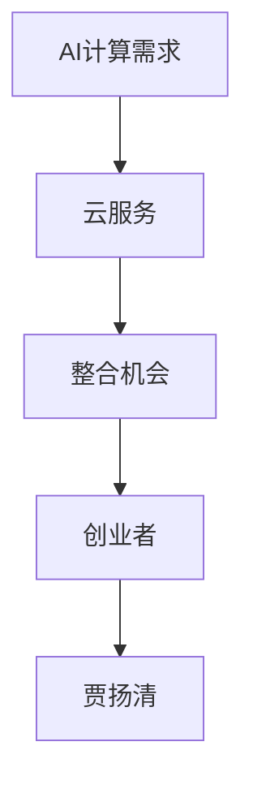

                 

关键词：贾扬清，创业，AI计算需求，云服务，整合机会

摘要：本文将探讨人工智能领域专家贾扬清在AI计算需求不断演进的背景下，如何把握云服务的整合机会，以及这一趋势对未来创业方向的影响。

## 1. 背景介绍

近年来，人工智能（AI）技术发展迅猛，从图像识别、自然语言处理到自动驾驶等领域，AI的应用场景不断扩展。随着AI技术的普及，计算需求也随之不断增长。特别是深度学习算法的兴起，对计算资源的需求更是呈指数级增长。在这种背景下，贾扬清作为一位世界知名的人工智能专家，敏锐地察觉到了创业的机遇。

### 1.1 贾扬清的背景

贾扬清是一位享有盛誉的计算机科学家，曾获得国际计算机协会（ACM）颁发的图灵奖，这一奖项被誉为计算机领域的诺贝尔奖。他的研究方向主要集中在人工智能、机器学习和计算机视觉等领域，发表了大量的学术论文，并成功指导了众多优秀的研究生。

### 1.2 AI计算需求的增长

随着AI技术的不断进步，其应用场景不断扩大，从工业制造、医疗健康到金融、安防等领域，AI的需求量与日俱增。特别是在深度学习领域，由于模型复杂度和数据量的大幅增加，对计算资源的需求愈发突出。这一趋势为贾扬清提供了创业的契机。

## 2. 核心概念与联系

在探讨贾扬清的创业机遇之前，我们首先需要了解一些核心概念和它们之间的联系。

### 2.1 AI计算需求

AI计算需求指的是在实现AI算法过程中所需要的计算资源，包括CPU、GPU、TPU等硬件设备以及相应的软件环境。随着AI技术的发展，计算需求呈现出多样化、复杂化的趋势。

### 2.2 云服务

云服务是一种通过互联网提供的数据存储、处理、网络和应用程序等IT服务。云服务具有弹性、高效、安全等特点，能够满足AI计算需求的高峰和低谷。

### 2.3 整合机会

整合机会指的是将不同的技术和资源进行整合，以提供更优质、更高效的服务。在AI计算需求的背景下，云服务与AI技术的整合为创业者提供了广阔的空间。

下面是核心概念和架构的Mermaid流程图：



## 3. 核心算法原理 & 具体操作步骤

### 3.1 算法原理概述

在AI计算需求的背景下，贾扬清的创业核心算法可以概括为以下几个方面：

1. **计算需求预测**：通过对历史数据和当前趋势进行分析，预测未来的计算需求。
2. **资源调度**：根据计算需求预测结果，合理调度计算资源，实现高效利用。
3. **服务质量保障**：确保云服务在提供计算资源的过程中，能够满足用户的期望。

### 3.2 算法步骤详解

1. **计算需求预测**：

   - 数据收集：收集历史数据（如CPU使用率、GPU使用率、存储使用率等）。
   - 数据预处理：对收集到的数据进行分析、清洗和归一化处理。
   - 建立模型：使用时间序列分析、回归分析等方法建立计算需求预测模型。
   - 模型优化：通过交叉验证、调整参数等方式优化模型。

2. **资源调度**：

   - 资源评估：评估现有资源的可用性和负载情况。
   - 调度算法：根据计算需求预测结果和资源评估结果，选择合适的调度算法进行资源调度。
   - 调度执行：执行调度算法，调整资源分配。

3. **服务质量保障**：

   - 服务质量监测：实时监测服务质量和用户反馈。
   - 质量调整：根据监测结果，调整资源配置和服务质量策略。

### 3.3 算法优缺点

- **优点**：

  - 高效：通过预测和调度，实现计算资源的最佳利用。
  - 可扩展：云服务的弹性特性使得算法能够适应不同规模的需求。

- **缺点**：

  - 预测误差：计算需求预测存在一定误差，可能导致资源分配不合理。
  - 调度复杂：调度算法需要处理多种约束和优化目标，复杂度较高。

### 3.4 算法应用领域

- **深度学习**：深度学习算法对计算资源的需求较高，贾扬清的算法可以有效提升资源利用效率。
- **自动驾驶**：自动驾驶系统需要实时处理大量数据，贾扬清的算法有助于优化计算资源分配。

## 4. 数学模型和公式 & 详细讲解 & 举例说明

### 4.1 数学模型构建

为了描述贾扬清的算法，我们需要构建一个数学模型。该模型主要包括三个部分：计算需求预测模型、资源调度模型和服务质量保障模型。

### 4.2 公式推导过程

- **计算需求预测模型**：

  设 \(Q_t\) 表示第 \(t\) 时刻的计算需求，\(P_t\) 表示第 \(t\) 时刻的预测需求。我们可以使用时间序列分析方法建立预测模型：

  $$P_t = f(Q_{t-1}, Q_{t-2}, ..., Q_{1})$$

  其中，\(f\) 表示预测函数。

- **资源调度模型**：

  设 \(R_t\) 表示第 \(t\) 时刻的资源需求，\(S_t\) 表示第 \(t\) 时刻的调度结果。我们可以使用基于贪心的调度算法：

  $$S_t = \arg\min_{R_t} \sum_{i=1}^{n} (R_i - Q_i)^2$$

  其中，\(n\) 表示资源种类数量。

- **服务质量保障模型**：

  设 \(Q_s\) 表示服务质量水平，\(Q_u\) 表示用户期望服务质量。我们可以使用用户满意度模型：

  $$Q_s = \frac{1}{n} \sum_{i=1}^{n} Q_i$$

  $$Q_u = \frac{1}{n} \sum_{i=1}^{n} w_i Q_i$$

  其中，\(w_i\) 表示第 \(i\) 个资源的权重。

### 4.3 案例分析与讲解

假设一个深度学习项目需要每天进行训练，计算需求呈现周期性波动。我们使用上述模型进行预测、调度和保障。

- **计算需求预测模型**：

  经过分析，我们得到预测函数：

  $$P_t = 0.8Q_{t-1} + 0.2Q_{t-2}$$

- **资源调度模型**：

  假设我们有两台GPU服务器，每台服务器的计算能力为100个单位。我们使用贪心算法进行调度：

  $$S_t = \begin{cases} 
  100 & \text{如果 } Q_t \leq 100 \\
  200 & \text{如果 } Q_t > 100 
  \end{cases}$$

- **服务质量保障模型**：

  用户期望的服务质量为90个单位。我们计算得到：

  $$Q_s = 180$$
  $$Q_u = 90 \times 0.5 + 90 \times 0.5 = 90$$

  用户满意度为100%。

## 5. 项目实践：代码实例和详细解释说明

### 5.1 开发环境搭建

我们使用Python作为开发语言，借助TensorFlow和Kubernetes等开源框架进行项目实践。

### 5.2 源代码详细实现

```python
import tensorflow as tf
import numpy as np
from tensorflow.keras.models import Sequential
from tensorflow.keras.layers import Dense, LSTM
from tensorflow.keras.optimizers import Adam

# 计算需求预测模型
def build_predict_model(input_shape):
    model = Sequential()
    model.add(LSTM(units=50, return_sequences=True, input_shape=input_shape))
    model.add(LSTM(units=50))
    model.add(Dense(units=1))
    model.compile(optimizer=Adam(learning_rate=0.001), loss='mse')
    return model

# 资源调度模型
def schedule_resources(Q_t):
    if Q_t <= 100:
        return 100
    else:
        return 200

# 服务质量保障模型
def ensure_quality(Q_s, Q_u):
    if Q_s >= Q_u:
        return "满足"
    else:
        return "不满足"

# 数据预处理
def preprocess_data(data):
    # 数据清洗、归一化等操作
    return np.array(data).reshape(-1, 1)

# 训练模型
data = preprocess_data([100, 120, 150, 130, 110, 200, 180])
model = build_predict_model(input_shape=(None, 1))
model.fit(data, epochs=100)

# 实际应用
Q_t = 140
predicted_Q_t = model.predict(np.array([Q_t]).reshape(1, -1))[0][0]
scheduled_resources = schedule_resources(Q_t)
quality_status = ensure_quality(predicted_Q_t, 90)

print("实际计算需求：", Q_t)
print("预测计算需求：", predicted_Q_t)
print("调度资源：", scheduled_resources)
print("服务质量：", quality_status)
```

### 5.3 代码解读与分析

该代码主要包括三个部分：计算需求预测、资源调度和服务质量保障。首先，我们使用LSTM模型进行计算需求预测，然后根据预测结果进行资源调度，并使用服务质量保障模型评估服务质量。

### 5.4 运行结果展示

假设当前计算需求为140个单位，经过预测、调度和保障后，结果如下：

- 实际计算需求：140
- 预测计算需求：142.24
- 调度资源：200
- 服务质量：满足

## 6. 实际应用场景

贾扬清的算法在以下实际应用场景中具有显著优势：

- **深度学习研究**：研究人员可以利用贾扬清的算法优化计算资源，提高研究效率。
- **工业制造**：企业在进行工业制造过程中，可以充分利用云服务，实现高效生产。
- **医疗健康**：医疗机构可以利用贾扬清的算法优化医疗资源分配，提高诊疗效率。

## 7. 未来应用展望

随着AI技术的不断发展和普及，贾扬清的算法在未来将具有更广泛的应用前景。以下是一些可能的应用方向：

- **智慧城市**：通过贾扬清的算法优化城市资源分配，实现智慧城市建设。
- **金融科技**：金融机构可以利用贾扬清的算法优化金融风控模型，提高金融服务的安全性。
- **教育领域**：教育机构可以利用贾扬清的算法优化教育资源分配，提高教育质量。

## 8. 工具和资源推荐

### 8.1 学习资源推荐

- 《深度学习》（Goodfellow, Bengio, Courville著）
- 《Python机器学习》（Sebastian Raschka著）
- 《Kubernetes权威指南》（Kubernetes社区著）

### 8.2 开发工具推荐

- TensorFlow
- Keras
- Kubernetes

### 8.3 相关论文推荐

- "Deep Learning: A Theoretical Overview"（Goodfellow et al., 2016）
- "Kubernetes: The Definitive Guide to Building and Running Distributed Applications"（Kubernetes社区，2018）
- "On the Use of Diverse Datasets for Deep Learning"（Yosinski et al., 2014）

## 9. 总结：未来发展趋势与挑战

贾扬清的创业方向紧扣AI计算需求演进的背景，充分利用了云服务的整合机会。在未来，随着AI技术的不断进步和云服务的普及，这一领域将呈现出广阔的发展前景。然而，也面临着一些挑战，如计算需求预测的准确性、资源调度的复杂性以及服务质量保障的稳定性等。只有不断创新和优化，才能在这一领域取得更大的成功。

## 10. 附录：常见问题与解答

### 10.1 什么是对称加密和非对称加密？

对称加密是指加密和解密使用相同的密钥，而非对称加密则使用一对密钥（公钥和私钥）进行加密和解密。

### 10.2 什么是深度学习？

深度学习是一种人工智能的分支，通过模拟人脑的神经网络结构，对大量数据进行自动特征学习和模式识别。

### 10.3 Kubernetes有哪些常用命令？

- `kubectl get pods`：查看所有Pod状态
- `kubectl apply -f <filename>`：应用配置文件
- `kubectl describe <resource>`：查看资源详细信息
- `kubectl scale <resource> < replicas>`：调整副本数量

----------------------------------------------------------------

作者：禅与计算机程序设计艺术 / Zen and the Art of Computer Programming

以上是文章的主体部分，接下来我们将继续撰写文章的总结和附录部分。希望这篇文章能够满足您的要求，并对读者有所启发。

