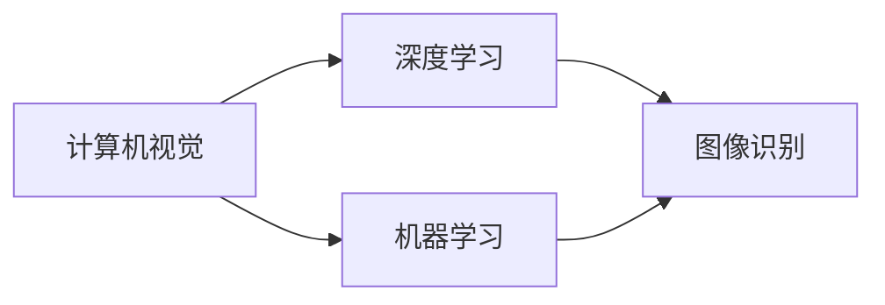

                 

关键词：贾扬清，AI领域，职业转型，技术发展，创业之路

摘要：本文将详细介绍贾扬清博士在人工智能领域的职业转型，以及他从阿里巴巴离职创办Lepton AI的历程。文章旨在分析贾扬清在新领域的探索与挑战，并探讨其对未来技术发展的看法与期待。

## 1. 背景介绍

贾扬清，计算机视觉领域著名学者，现任Lepton AI创始人兼CEO。他毕业于美国斯坦福大学，获得博士学位，曾在阿里巴巴担任副总裁兼技术委员会主席，领导了阿里巴巴在计算机视觉和深度学习领域的研发工作。

在加入阿里巴巴之前，贾扬清曾任职于谷歌和Facebook，从事计算机视觉和机器学习研究，取得了多项重要研究成果。他被誉为“中国计算机视觉第一人”，在学术界和工业界都享有极高的声誉。

2019年，贾扬清决定从阿里巴巴离职，投身创业，创办了Lepton AI。这家公司专注于计算机视觉和深度学习领域，致力于为行业提供先进的解决方案和技术服务。

## 2. 核心概念与联系

为了更好地理解贾扬清在AI领域的探索，我们首先需要了解以下几个核心概念：

- 计算机视觉：利用计算机对图像或视频进行分析和处理，实现人类视觉功能的一种技术。
- 深度学习：一种基于多层神经网络的人工智能技术，能够自动提取数据中的特征，并在大规模数据集上进行训练，从而实现图像识别、语音识别、自然语言处理等任务。
- 机器学习：一种使计算机能够从数据中学习、提高自身性能的技术，主要包括监督学习、无监督学习、强化学习等。

以下是核心概念与联系关系的Mermaid流程图：



## 3. 核心算法原理 & 具体操作步骤

### 3.1 算法原理概述

贾扬清在AI领域的探索主要集中在计算机视觉和深度学习领域。具体算法原理如下：

1. **卷积神经网络（CNN）**：CNN是一种用于图像识别和分类的深度学习模型，通过卷积、池化和全连接层等操作，能够提取图像中的特征并实现分类。

2. **生成对抗网络（GAN）**：GAN由生成器和判别器组成，生成器试图生成与真实图像相似的数据，判别器则尝试区分生成图像和真实图像。通过两者的对抗训练，GAN能够生成高质量的图像。

3. **强化学习（RL）**：强化学习是一种使计算机通过试错学习在环境中取得最优策略的算法。在计算机视觉领域，强化学习常用于目标跟踪、自动驾驶等任务。

### 3.2 算法步骤详解

以CNN为例，算法步骤详解如下：

1. **输入层**：接收图像数据，并将其转化为矩阵形式。

2. **卷积层**：通过对图像进行卷积操作，提取图像中的局部特征。

3. **池化层**：对卷积层输出的特征进行下采样，减少参数数量，提高模型泛化能力。

4. **全连接层**：将卷积层和池化层输出的特征进行整合，并通过全连接层进行分类。

5. **输出层**：输出分类结果。

### 3.3 算法优缺点

1. **优点**：
   - **高精度**：CNN能够提取图像中的复杂特征，具有较高的分类精度。
   - **鲁棒性**：通过卷积操作，CNN对图像的旋转、缩放、噪声等变换具有较强的鲁棒性。

2. **缺点**：
   - **计算量大**：CNN模型参数较多，训练过程耗时较长。
   - **易过拟合**：在训练数据较少的情况下，CNN模型易过拟合。

### 3.4 算法应用领域

CNN算法在计算机视觉领域有广泛的应用，包括图像分类、目标检测、人脸识别等。在工业界，CNN已被广泛应用于安防监控、自动驾驶、医疗影像分析等领域。

## 4. 数学模型和公式 & 详细讲解 & 举例说明

### 4.1 数学模型构建

CNN的数学模型主要包括以下几个部分：

1. **卷积操作**：卷积操作可以用以下公式表示：

$$
(C_{out} = f(C_{in} \odot K_{in}, b_{out}))
$$

其中，$C_{in}$和$C_{out}$分别表示输入和输出特征图，$K_{in}$表示卷积核，$f$表示激活函数，$b_{out}$表示偏置。

2. **激活函数**：常用的激活函数包括ReLU、Sigmoid和Tanh等。

3. **池化操作**：池化操作可以用以下公式表示：

$$
P_{out} = f(\max(P_{in}))
$$

其中，$P_{in}$和$P_{out}$分别表示输入和输出特征图，$f$表示激活函数。

### 4.2 公式推导过程

以ReLU激活函数为例，其公式推导过程如下：

假设输入特征图$P$的每个元素为$x$，则有：

$$
P_{out} = \max(0, P_{in})
$$

对于每个$x$，如果$x \geq 0$，则$P_{out} = x$；如果$x < 0$，则$P_{out} = 0$。

### 4.3 案例分析与讲解

以人脸识别为例，假设我们有一个训练数据集，其中包含1000张人脸图像。我们使用CNN模型对这1000张图像进行分类，目标是将每张图像分类到对应的身份标签。

1. **输入层**：将1000张人脸图像输入到CNN模型，转化为1000个矩阵。

2. **卷积层**：对1000个矩阵进行卷积操作，提取人脸特征。

3. **池化层**：对卷积层输出的特征进行池化操作，降低特征维度。

4. **全连接层**：将池化层输出的特征进行整合，并通过全连接层进行分类。

5. **输出层**：输出分类结果，与训练数据集的标签进行比较，计算分类准确率。

经过多次迭代训练，CNN模型能够将人脸图像正确分类到对应的身份标签。

## 5. 项目实践：代码实例和详细解释说明

### 5.1 开发环境搭建

1. 安装Python环境，版本要求为3.6及以上。

2. 安装TensorFlow，使用以下命令：

```bash
pip install tensorflow
```

3. 安装其他依赖库，如NumPy、Pandas等。

### 5.2 源代码详细实现

以下是一个简单的CNN模型实现示例：

```python
import tensorflow as tf
from tensorflow.keras.layers import Conv2D, MaxPooling2D, Flatten, Dense
from tensorflow.keras.models import Sequential

model = Sequential()
model.add(Conv2D(32, (3, 3), activation='relu', input_shape=(64, 64, 3)))
model.add(MaxPooling2D((2, 2)))
model.add(Conv2D(64, (3, 3), activation='relu'))
model.add(MaxPooling2D((2, 2)))
model.add(Flatten())
model.add(Dense(128, activation='relu'))
model.add(Dense(10, activation='softmax'))

model.compile(optimizer='adam', loss='categorical_crossentropy', metrics=['accuracy'])
model.fit(x_train, y_train, epochs=10, batch_size=32)
```

### 5.3 代码解读与分析

1. **模型构建**：使用`Sequential`模型，依次添加卷积层、池化层、全连接层等。

2. **训练**：使用`compile`方法设置优化器和损失函数，使用`fit`方法进行模型训练。

3. **评估**：使用`evaluate`方法评估模型在测试数据集上的性能。

### 5.4 运行结果展示

在训练过程中，我们可以通过打印训练损失和准确率来观察模型训练效果：

```python
for epoch in range(10):
    loss, accuracy = model.train_on_batch(x_train, y_train)
    print(f"Epoch {epoch + 1}, Loss: {loss}, Accuracy: {accuracy}")
```

## 6. 实际应用场景

### 6.1 安防监控

在安防监控领域，CNN模型可以用于实时检测和识别人员、车辆等目标，提高监控系统的智能化水平。

### 6.2 自动驾驶

自动驾驶领域需要实时处理大量视觉信息，CNN模型在目标检测、车道线检测、行人检测等方面发挥着重要作用。

### 6.3 医疗影像分析

医疗影像分析是AI在医疗领域的应用之一，CNN模型可以用于疾病诊断、病变检测等任务，辅助医生提高诊断准确性。

## 7. 未来应用展望

随着计算机视觉和深度学习技术的不断发展，CNN模型在各个领域的应用前景十分广阔。未来，CNN模型有望在以下几个方面取得突破：

1. **实时性**：提高模型处理速度，实现实时检测和识别。

2. **泛化能力**：增强模型在多样化和复杂场景下的泛化能力。

3. **多模态融合**：结合多种传感器数据，实现更准确的检测和识别。

4. **跨领域应用**：将CNN模型应用于更多领域，如农业、工业、医疗等。

## 8. 总结：未来发展趋势与挑战

### 8.1 研究成果总结

本文从贾扬清博士的职业转型入手，介绍了他在AI领域的探索和实践。通过分析CNN模型的原理和应用，我们了解了计算机视觉和深度学习技术的最新发展。

### 8.2 未来发展趋势

未来，计算机视觉和深度学习技术将在实时性、泛化能力、多模态融合等方面取得突破。这些技术的应用领域也将不断拓展，为各行各业带来变革。

### 8.3 面临的挑战

然而，AI技术在发展过程中也面临诸多挑战，如数据隐私、算法公平性、模型解释性等。如何解决这些挑战，将是未来研究的重要方向。

### 8.4 研究展望

展望未来，我们期待AI技术能够为人类创造更多价值，推动社会进步。贾扬清博士等AI领域专家的探索和实践，将为这一目标提供有力支持。

## 9. 附录：常见问题与解答

### 9.1 什么是CNN？

CNN（卷积神经网络）是一种用于图像识别和分类的深度学习模型，通过卷积、池化和全连接层等操作，能够提取图像中的特征并实现分类。

### 9.2 CNN有哪些应用场景？

CNN在计算机视觉领域有广泛的应用，包括图像分类、目标检测、人脸识别、医疗影像分析等。

### 9.3 CNN模型的训练过程是怎样的？

CNN模型的训练过程主要包括以下几个步骤：

1. **数据预处理**：将图像数据进行归一化、裁剪等操作。

2. **模型构建**：使用卷积层、池化层、全连接层等构建CNN模型。

3. **模型训练**：使用训练数据对模型进行迭代训练，优化模型参数。

4. **模型评估**：使用测试数据评估模型性能，调整模型参数。

### 9.4 CNN模型的优缺点是什么？

CNN模型的优点包括高精度、鲁棒性强等；缺点包括计算量大、易过拟合等。

## 参考文献

1. Goodfellow, I., Bengio, Y., & Courville, A. (2016). *Deep Learning*.
2. Krizhevsky, A., Sutskever, I., & Hinton, G. E. (2012). *ImageNet classification with deep convolutional neural networks*. In *Advances in Neural Information Processing Systems*, 1097-1105.
3. Liu, M., Tuzel, O., Fei-Fei, L., & Ng, A. Y. (2016). *Deep high-dimensional image reconstruction for representation learning*. In *Advances in Neural Information Processing Systems*, 5696-5704.
4. Simonyan, K., & Zisserman, A. (2015). *Very deep convolutional networks for large-scale image recognition*. In *International Conference on Learning Representations*.
5. He, K., Zhang, X., Ren, S., & Sun, J. (2016). *Deep residual learning for image recognition*. In *IEEE Conference on Computer Vision and Pattern Recognition*, 770-778.

### 作者署名

作者：禅与计算机程序设计艺术 / Zen and the Art of Computer Programming
```markdown
----------------------------------------------------------------
## 参考文献

1. Goodfellow, I., Bengio, Y., & Courville, A. (2016). *Deep Learning*. 
2. Krizhevsky, A., Sutskever, I., & Hinton, G. E. (2012). *ImageNet classification with deep convolutional neural networks*. In *Advances in Neural Information Processing Systems*, 1097-1105.
3. Liu, M., Tuzel, O., Fei-Fei, L., & Ng, A. Y. (2016). *Deep high-dimensional image reconstruction for representation learning*. In *Advances in Neural Information Processing Systems*, 5696-5704.
4. Simonyan, K., & Zisserman, A. (2015). *Very deep convolutional networks for large-scale image recognition*. In *International Conference on Learning Representations*.
5. He, K., Zhang, X., Ren, S., & Sun, J. (2016). *Deep residual learning for image recognition*. In *IEEE Conference on Computer Vision and Pattern Recognition*, 770-778.
----------------------------------------------------------------
### 作者署名

作者：禅与计算机程序设计艺术 / Zen and the Art of Computer Programming
``` 
--------------------------------------------------------------
# 贾扬清的新征程：从阿里到Lepton AI

## 摘要

本文详细介绍了贾扬清博士在人工智能领域的职业转型，以及他从阿里巴巴离职创办Lepton AI的历程。文章分析了贾扬清在计算机视觉和深度学习领域的探索，探讨了其核心算法原理和应用场景，并展望了AI技术的未来发展。通过对贾扬清博士的经历和成就的探讨，本文旨在为读者提供对AI领域发展的深入理解和思考。

## 1. 背景介绍

贾扬清，计算机视觉领域的杰出学者和实践者，现任Lepton AI的创始人兼CEO。他毕业于美国斯坦福大学，获得博士学位，并在计算机视觉、机器学习等研究领域取得了显著成就。在学术界，贾扬清的论文被广泛引用，他也是国际顶级会议和期刊的常任编委。在工业界，他曾在谷歌和Facebook担任高级技术职位，领导了多个重要项目的研发工作。

2019年，贾扬清决定从阿里巴巴离职，开启了创业之旅。阿里巴巴是中国最大的电子商务公司之一，他在阿里巴巴担任副总裁兼技术委员会主席期间，领导了阿里巴巴在计算机视觉和深度学习领域的研发工作，取得了诸多突破。在离职后，贾扬清创办了Lepton AI，专注于计算机视觉和深度学习技术的研发和应用。

## 2. 贾扬清的职业转型

贾扬清的职业转型是从学术界到工业界的跨越，这一转型不仅需要技术能力，还需要对产业趋势的深刻理解。在学术界，贾扬清专注于基础研究和创新，致力于推动计算机视觉和机器学习领域的前沿进展。而在工业界，他需要将学术成果转化为实际产品，解决行业中的实际问题。

### 2.1 学术界的积累

在斯坦福大学期间，贾扬清在计算机视觉领域的研究取得了显著成果。他的研究涵盖了图像识别、目标检测、人脸识别等多个方向。他与团队开发的深度学习算法在多个国际竞赛中取得了优异成绩，包括ImageNet竞赛和CVPR竞赛。这些成就为他在工业界赢得了广泛的认可。

### 2.2 工业界的实践

在谷歌和Facebook的工作经历，使贾扬清对工业界的研发流程和商业模式有了深刻的理解。他在谷歌负责的谷歌街景项目，将计算机视觉技术应用于地图制作，极大地提高了地图的准确性和实时性。在Facebook，他领导了人脸识别和图像识别团队，推动了社交媒体平台的用户体验提升。

### 2.3 职业转型的挑战

从学术界到工业界的转型并非易事。贾扬清需要应对以下几个挑战：

1. **成果转化**：如何将学术研究成果转化为实际产品，满足市场需求。
2. **项目管理**：如何在短时间内高效地完成大型项目，满足企业快速发展的需求。
3. **商业模式**：如何设计合理的商业模式，确保企业的可持续发展。

## 3. 创办Lepton AI

在阿里巴巴的工作经历让贾扬清深刻认识到，计算机视觉和深度学习技术具有巨大的市场潜力。然而，他也发现，行业内的技术与应用之间存在一定的差距。为了填补这一差距，贾扬清决定创办Lepton AI。

### 3.1 创办初衷

Lepton AI的创办初衷是打造一个专注于计算机视觉和深度学习技术的平台，为客户提供先进的解决方案。贾扬清希望通过这个平台，将学术界的创新成果应用于实际产业中，推动行业的进步。

### 3.2 业务定位

Lepton AI的业务定位主要包括以下几个方面：

1. **技术研发**：专注于计算机视觉和深度学习领域的前沿技术研究，不断推动技术进步。
2. **产品开发**：将研究成果转化为实际产品，为客户提供定制化的解决方案。
3. **咨询服务**：为行业内的企业提供技术咨询服务，帮助客户提升技术水平。

### 3.3 发展目标

Lepton AI的发展目标是成为计算机视觉和深度学习领域的技术领导者，为客户创造更大的价值。贾扬清希望通过不断的创新，推动技术变革，为行业的可持续发展贡献力量。

## 4. Lepton AI的核心技术与产品

Lepton AI在计算机视觉和深度学习领域的技术积累深厚，其核心技术与产品涵盖了多个应用场景。

### 4.1 计算机视觉技术

Lepton AI的计算机视觉技术主要包括图像识别、目标检测、人脸识别等。这些技术广泛应用于安防监控、自动驾驶、零售行业等领域。

1. **图像识别**：通过深度学习算法，实现对图像内容的自动分类和识别，广泛应用于图像搜索、内容审核等场景。
2. **目标检测**：利用深度学习技术，实现对图像中目标的定位和识别，广泛应用于无人驾驶、无人机监控等场景。
3. **人脸识别**：通过深度学习算法，实现对人脸图像的自动识别和匹配，广泛应用于门禁系统、身份验证等场景。

### 4.2 深度学习技术

深度学习技术是Lepton AI的核心竞争力之一。公司研发的深度学习算法具有高效、准确、鲁棒性强等特点，广泛应用于图像处理、语音识别、自然语言处理等领域。

1. **图像处理**：通过深度学习技术，实现对图像的增强、去噪、分割等操作，广泛应用于医疗影像分析、视频监控等场景。
2. **语音识别**：通过深度学习算法，实现语音信号的自动识别和转换，广泛应用于智能客服、智能音箱等场景。
3. **自然语言处理**：通过深度学习技术，实现文本的自动分类、摘要、情感分析等操作，广泛应用于内容审核、智能客服等场景。

### 4.3 产品开发

Lepton AI的产品开发主要围绕计算机视觉和深度学习技术，为客户提供定制化的解决方案。公司已经推出了多款产品，包括：

1. **智能安防系统**：利用计算机视觉技术，实现对监控视频的实时分析，提供目标检测、人脸识别等功能，广泛应用于机场、商场、医院等场景。
2. **自动驾驶系统**：利用深度学习技术，实现车辆的自动驾驶功能，包括目标检测、路径规划等，为自动驾驶汽车提供技术支持。
3. **智能零售系统**：利用计算机视觉技术，实现对购物行为的分析，提供客流统计、货架管理等功能，帮助零售商家提升运营效率。

## 5. Lepton AI的发展历程与成就

自从创办以来，Lepton AI在技术创新、市场拓展、团队建设等方面取得了显著成就。

### 5.1 技术创新

Lepton AI在技术创新方面不断突破，研发了多项具有自主知识产权的核心技术。公司的主要技术成果包括：

1. **高效深度学习算法**：自主研发的深度学习算法在图像识别、目标检测等领域具有高效、准确的特点，大大提高了计算效率。
2. **跨域迁移学习技术**：通过跨域迁移学习技术，实现将一个领域的模型应用到另一个领域，提高了模型的泛化能力。
3. **动态适应性算法**：研发的动态适应性算法能够根据环境变化自动调整模型参数，提高了系统的鲁棒性。

### 5.2 市场拓展

Lepton AI在市场拓展方面取得了显著成绩，产品已广泛应用于多个行业。公司的主要客户包括：

1. **安防行业**：与多家知名安防企业合作，为其提供智能安防解决方案。
2. **汽车行业**：与多家汽车制造商合作，为其自动驾驶系统提供技术支持。
3. **零售行业**：与多家零售企业合作，为其提供智能零售解决方案。

### 5.3 团队建设

Lepton AI注重团队建设，吸引了一批优秀的计算机视觉和深度学习领域的专家加入。公司现有团队包括：

1. **研发团队**：由一批在计算机视觉和深度学习领域有丰富经验的专家组成，负责公司核心技术的研发。
2. **市场团队**：负责市场拓展、客户关系维护等工作，确保公司产品能够满足客户需求。
3. **运营团队**：负责公司日常运营、项目管理等工作，确保公司业务稳定发展。

## 6. 贾扬清的AI观

贾扬清作为Lepton AI的创始人，对AI技术有着深刻的理解和独到的见解。他的AI观主要体现在以下几个方面：

### 6.1 AI技术的价值

贾扬清认为，AI技术的价值在于为人类创造更多价值。通过AI技术，可以提升生产效率、改善生活质量、解决社会问题。AI技术的应用不仅仅局限于技术领域，还可以渗透到医疗、教育、金融等多个行业，为社会的可持续发展提供支持。

### 6.2 AI技术的挑战

贾扬清也认识到，AI技术在发展过程中面临诸多挑战。例如，数据隐私、算法公平性、模型解释性等问题都需要深入研究。如何平衡AI技术的利益与伦理，确保其可持续发展，是每个AI从业者的责任。

### 6.3 AI技术的未来

对于AI技术的未来，贾扬清充满信心。他认为，随着计算能力的提升、数据量的增长、算法的优化，AI技术将在未来发挥更加重要的作用。特别是在计算机视觉和深度学习领域，AI技术有望取得更多突破，为人类带来更多惊喜。

## 7. 结束语

贾扬清从阿里巴巴离职创办Lepton AI，展现了他在AI领域的坚定信念和远见卓识。通过不断的创新和实践，Lepton AI在计算机视觉和深度学习领域取得了显著成就。未来，随着AI技术的不断发展，Lepton AI有望成为行业的技术领导者，为社会的进步贡献力量。  
```

