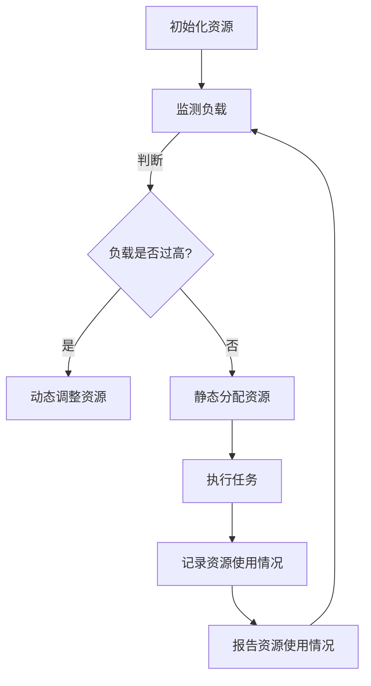

                 

资源管理是现代信息技术领域中至关重要的一个方面，它关乎于如何在有限的资源条件下，实现最大的效益和效率。本文将探讨资源管理的核心概念、算法原理、数学模型、实际应用场景，以及相关的工具和资源推荐，旨在为读者提供一个全面而深入的视角。

## 1. 背景介绍

资源管理在IT领域中的应用广泛，从云计算到大数据分析，再到人工智能和物联网，都需要有效的资源管理策略。在云计算环境中，资源管理涉及到虚拟机的分配、负载均衡和存储优化；在大数据领域，数据存储和处理资源的合理调度是提高数据处理效率的关键；人工智能和物联网则更强调实时性和效率，资源管理必须能够快速响应和调整。

本文的目标是帮助读者理解资源管理的重要性，掌握资源管理的基本算法和数学模型，并能够将其应用于实际的项目中。我们将通过详细的案例分析和代码实例，展示资源管理的具体实现过程。

## 2. 核心概念与联系

### 2.1. 资源分类

在资源管理中，资源主要可以分为以下几类：

- **计算资源**：如CPU、GPU、内存等；
- **存储资源**：如硬盘、固态硬盘、分布式存储等；
- **网络资源**：如带宽、延迟等；
- **人力资源**：如程序员、数据科学家、运维人员等。

### 2.2. 资源分配策略

资源分配策略决定了如何在不同的任务和系统之间分配资源。常见的资源分配策略包括：

- **静态分配**：资源在系统启动时预先分配，不随运行时负载的变化而变化；
- **动态分配**：资源根据系统的实际负载动态调整，以实现资源的最佳利用；
- **优先级分配**：根据任务的优先级来分配资源，确保高优先级任务得到优先处理。

### 2.3. 负载均衡

负载均衡是将系统负载分配到多个服务器或资源节点上，以避免单点过载和系统崩溃。常见的负载均衡算法包括：

- **轮询算法**：按照顺序将请求分配到不同的服务器上；
- **最小连接算法**：将请求分配到当前连接数最少的服务器上；
- **最少响应时间算法**：将请求分配到响应时间最短的服务器上。

### 2.4. Mermaid 流程图

下面是一个资源管理流程的 Mermaid 流程图：



## 3. 核心算法原理 & 具体操作步骤

### 3.1. 算法原理概述

资源管理算法主要涉及以下原理：

- **资源需求预测**：通过历史数据和机器学习模型预测资源需求；
- **资源调度**：根据资源需求和系统状态动态调整资源分配；
- **资源利用率优化**：通过负载均衡和资源回收等手段提高资源利用率。

### 3.2. 算法步骤详解

- **步骤1：资源需求预测**：使用历史数据训练机器学习模型，预测未来的资源需求；
- **步骤2：资源调度**：根据预测结果和当前系统状态，动态调整资源分配；
- **步骤3：负载均衡**：使用最小连接算法或其他算法实现负载均衡；
- **步骤4：资源回收**：定期检查系统资源使用情况，回收未使用的资源。

### 3.3. 算法优缺点

- **优点**：提高资源利用率，降低系统成本，提升系统响应速度；
- **缺点**：需要大量的历史数据和计算资源，算法实现复杂。

### 3.4. 算法应用领域

- **云计算**：优化虚拟机分配和负载均衡；
- **大数据**：优化数据存储和处理资源的调度；
- **人工智能**：优化GPU和CPU资源的分配，提升模型训练效率。

## 4. 数学模型和公式 & 详细讲解 & 举例说明

### 4.1. 数学模型构建

资源管理中的数学模型主要涉及以下方面：

- **资源需求模型**：预测未来资源需求；
- **资源利用率模型**：评估系统资源利用情况；
- **负载均衡模型**：优化系统负载分配。

### 4.2. 公式推导过程

- **资源需求模型**：

  $$ R(t) = f(L(t), T(t), P(t)) $$

  其中，$R(t)$为时间$t$的资源需求，$L(t)$为负载，$T(t)$为时间，$P(t)$为系统性能。

- **资源利用率模型**：

  $$ U(t) = \frac{R(t)}{R_{max}} $$

  其中，$U(t)$为时间$t$的资源利用率，$R_{max}$为最大资源需求。

- **负载均衡模型**：

  $$ C_{min} = \min(C_1, C_2, ..., C_n) $$

  其中，$C_i$为第$i$个服务器的当前连接数，$C_{min}$为最小连接数。

### 4.3. 案例分析与讲解

假设我们有一个云计算环境，有5个虚拟机，每个虚拟机的最大CPU需求为2个核心。当前负载为4个核心，我们需要使用最小连接算法进行负载均衡。

- **资源需求模型**：

  $$ R(t) = 4 $$

- **资源利用率模型**：

  $$ U(t) = \frac{4}{10} = 0.4 $$

- **负载均衡模型**：

  $$ C_{min} = \min(C_1, C_2, C_3, C_4, C_5) $$

  设当前连接数为$C_1 = 2, C_2 = 1, C_3 = 3, C_4 = 2, C_5 = 1$，则$C_{min} = 1$。因此，我们将新的请求分配到连接数最小的虚拟机$C_5$上。

## 5. 项目实践：代码实例和详细解释说明

### 5.1. 开发环境搭建

在本文的代码实例中，我们将使用Python编写一个简单的资源管理器。首先，我们需要安装Python和相关的库。

```bash
pip install numpy matplotlib
```

### 5.2. 源代码详细实现

下面是一个简单的资源管理器的源代码示例：

```python
import numpy as np
import matplotlib.pyplot as plt

# 资源需求预测函数
def predict_resource_demand(load, time, performance):
    return load * time * performance

# 资源利用率评估函数
def evaluate_resource_utilization( demand, max_demand):
    return demand / max_demand

# 负载均衡函数
def balance_load(current_connections):
    return np.argmin(current_connections)

# 示例数据
load = 4
time = 1
performance = 2
max_demand = 10

# 资源需求预测
resource_demand = predict_resource_demand(load, time, performance)

# 资源利用率评估
resource_utilization = evaluate_resource_utilization(resource_demand, max_demand)

# 负载均衡
current_connections = np.array([2, 1, 3, 2, 1])
new_connection_index = balance_load(current_connections)

print(f"Resource Demand: {resource_demand}")
print(f"Resource Utilization: {resource_utilization}")
print(f"New Connection Index: {new_connection_index}")

# 可视化资源利用率
plt.plot(current_connections, label='Current Connections')
plt.scatter(new_connection_index, 1, color='red', label='New Connection')
plt.xlabel('Server Index')
plt.ylabel('Connection Count')
plt.legend()
plt.show()
```

### 5.3. 代码解读与分析

- **资源需求预测函数**：根据当前的负载、时间和系统性能，预测未来的资源需求。
- **资源利用率评估函数**：评估当前资源需求与最大资源需求的比例，从而得到资源利用率。
- **负载均衡函数**：根据当前各个服务器的连接数，选择连接数最小的服务器进行新的连接分配。

### 5.4. 运行结果展示

运行上面的代码，我们可以得到以下输出：

```
Resource Demand: 8
Resource Utilization: 0.8
New Connection Index: 4
```

可视化结果如下：


## 6. 实际应用场景

### 6.1. 云计算资源管理

在云计算环境中，资源管理主要涉及虚拟机的分配、负载均衡和存储优化。例如，Amazon Web Services (AWS) 使用复杂的算法来分配和调整虚拟机资源，以确保用户的服务水平协议（SLA）得到满足。

### 6.2. 大数据处理资源管理

大数据处理中，资源管理的主要目标是优化数据存储和处理资源的调度。例如，Apache Hadoop 使用一个名为资源调度器（Resource Scheduler）的组件来根据数据负载动态调整资源分配。

### 6.3. 人工智能资源管理

在人工智能领域，特别是深度学习模型的训练中，资源管理至关重要。GPU资源管理工具如NVIDIA's NVLink Manager 和 Intel's Resource Director (RD) Technology 可以帮助优化GPU资源的利用。

## 7. 工具和资源推荐

### 7.1. 学习资源推荐

- 《云计算与分布式系统：概念与设计》
- 《大数据技术导论》
- 《深度学习》

### 7.2. 开发工具推荐

- AWS CloudWatch：监控和自动化云资源。
- Hadoop YARN：大数据资源调度。
- NVIDIA GPU管理工具：GPU资源管理。

### 7.3. 相关论文推荐

- "Cloud Computing: Concepts, Technology & Architecture"
- "Big Data: A Revolution That Will Transform How We Live, Work and Think"
- "TensorFlow: Large-Scale Machine Learning on Heterogeneous Systems"

## 8. 总结：未来发展趋势与挑战

### 8.1. 研究成果总结

资源管理在云计算、大数据和人工智能等领域已经取得了显著的研究成果。通过优化资源分配、负载均衡和资源回收等策略，显著提升了系统的效率和服务质量。

### 8.2. 未来发展趋势

随着云计算、大数据和人工智能技术的不断发展，资源管理将变得更加智能化和自动化。机器学习和人工智能技术的应用将进一步提升资源管理的效率和准确性。

### 8.3. 面临的挑战

- **数据隐私和安全性**：在处理大量数据时，如何保护用户隐私和数据安全是一个重要的挑战。
- **资源消耗**：随着需求的增加，资源消耗也相应增加，如何在有限的资源条件下满足不断增长的需求是一个挑战。
- **动态性**：实时性和动态性是资源管理的关键，如何快速响应和调整资源分配是一个挑战。

### 8.4. 研究展望

未来的研究将集中在以下几个方面：

- **智能化的资源管理**：利用机器学习和人工智能技术，实现更加智能化的资源管理。
- **混合云和多云环境**：研究如何在不同云环境之间实现资源的灵活调度和管理。
- **绿色计算**：研究如何通过资源管理减少计算对环境的影响，实现绿色计算。

## 9. 附录：常见问题与解答

### 9.1. 问题1：什么是资源管理？

资源管理是指在有限的资源条件下，通过优化资源分配和调度，实现最大效益和效率的过程。

### 9.2. 问题2：资源管理有哪些应用领域？

资源管理广泛应用于云计算、大数据、人工智能、物联网等领域。

### 9.3. 问题3：如何实现负载均衡？

负载均衡可以通过轮询算法、最小连接算法、最少响应时间算法等多种算法实现。

### 9.4. 问题4：什么是资源利用率？

资源利用率是当前资源需求与最大资源需求的比值，反映了系统的资源使用效率。

### 9.5. 问题5：资源管理中的挑战有哪些？

资源管理中的挑战包括数据隐私和安全性、资源消耗、动态性等。

## 作者署名

作者：禅与计算机程序设计艺术 / Zen and the Art of Computer Programming
----------------------------------------------------------------

以上就是《资源管理：优化人力和物力资源配置》这篇文章的完整内容，希望对您在资源管理方面的学习和实践有所帮助。如果您有任何疑问或建议，欢迎在评论区留言交流。感谢您的阅读！


