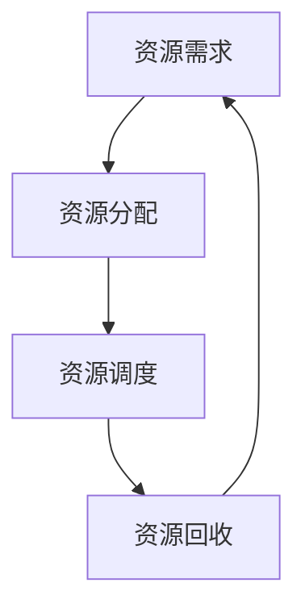

                 

在计算机科学和信息技术领域中，资源管理是一项至关重要的技能。无论是在服务器集群、数据中心，还是移动设备和嵌入式系统中，合理地分配和管理资源都能显著提高系统的性能和效率。本文将探讨资源管理的核心概念、算法、数学模型、实践应用，以及未来的发展趋势和挑战。

## 关键词

- 资源管理
- 性能优化
- 负载均衡
- 虚拟化
- 人工智能

## 摘要

本文将深入探讨资源管理在IT领域的应用。通过介绍核心概念和算法，我们将解释如何最大化利用有限的计算资源。此外，还将提供数学模型的详细讲解，并分享实际的项目实践和运行结果。最后，本文将展望资源管理技术的未来发展趋势，以及面临的挑战和展望。

### 1. 背景介绍

在信息技术迅速发展的今天，资源的稀缺性已成为一个普遍存在的问题。无论是计算资源、存储资源，还是网络带宽，都在不断挑战着我们的技术极限。如何有效地管理和利用这些有限资源，成为了一个关键的研究方向。资源管理的目标是确保系统在各种负载条件下都能保持高性能和高可靠性。

资源管理在多个层面都有应用，包括操作系统层面的进程调度、网络层面的带宽管理，以及数据中心层面的服务器负载均衡。在云计算和分布式系统中，资源管理更是至关重要，它直接影响到系统的可扩展性、成本效益和用户体验。

### 2. 核心概念与联系

为了更好地理解资源管理，我们需要明确一些核心概念。以下是一个简化的Mermaid流程图，展示了这些概念之间的联系。



#### 2.1 资源需求

资源需求是指系统在执行任务时对各种资源的需求。这些资源可以是CPU、内存、网络带宽、磁盘空间等。资源需求是资源管理的基础，准确预测资源需求对于资源分配和调度至关重要。

#### 2.2 资源分配

资源分配是指根据资源需求将系统资源分配给具体的任务或进程。资源分配策略包括静态分配和动态分配。静态分配在系统启动时确定，而动态分配则根据系统运行时的需求进行调整。

#### 2.3 资源调度

资源调度是指在资源分配后，如何安排任务的执行顺序。调度算法有多种，包括先进先出（FIFO）、最短作业优先（SJF）、优先级调度等。调度算法的目标是最大化系统吞吐量、最小化响应时间和等待时间。

#### 2.4 资源回收

资源回收是指当任务完成或不再需要时，回收所使用的资源。资源回收的及时性对于系统的性能和资源利用率有很大影响。

### 3. 核心算法原理 & 具体操作步骤

#### 3.1 算法原理概述

资源管理的核心算法主要包括：

- 负载均衡算法
- 虚拟化技术
- 人工智能算法

这些算法各有特点和适用场景，但共同的目标是最大化资源利用率和系统性能。

#### 3.2 算法步骤详解

#### 3.2.1 负载均衡算法

负载均衡算法的基本步骤如下：

1. 收集系统当前负载信息。
2. 根据负载情况，动态分配任务到不同的服务器。
3. 监控任务执行情况，调整负载分配。

#### 3.2.2 虚拟化技术

虚拟化技术的主要步骤包括：

1. 初始化虚拟化环境。
2. 创建虚拟机。
3. 根据需求分配资源。
4. 管理虚拟机生命周期。

#### 3.2.3 人工智能算法

人工智能算法在资源管理中的应用包括：

1. 使用机器学习模型预测资源需求。
2. 根据预测结果调整资源分配策略。
3. 优化资源调度，提高系统性能。

### 3.3 算法优缺点

#### 3.3.1 负载均衡算法

优点：

- 提高系统可用性。
- 平衡服务器负载。

缺点：

- 增加系统复杂性。
- 需要实时监控和调整。

#### 3.3.2 虚拟化技术

优点：

- 提高资源利用率。
- 灵活的资源分配和管理。

缺点：

- 增加管理难度。
- 额外的性能开销。

#### 3.3.3 人工智能算法

优点：

- 自动化资源管理和优化。
- 提高预测准确率。

缺点：

- 需要大量数据。
- 计算资源消耗大。

### 3.4 算法应用领域

资源管理算法广泛应用于以下领域：

- 云计算
- 数据中心
- 移动设备
- 嵌入式系统

### 4. 数学模型和公式 & 详细讲解 & 举例说明

资源管理中的数学模型和公式主要涉及资源需求预测、负载均衡优化和资源利用率计算等方面。

#### 4.1 数学模型构建

假设系统中有 $N$ 个任务，每个任务需要 $C$ 单位的计算资源。我们可以构建以下数学模型：

$$
\max_{x_1, x_2, ..., x_N} \sum_{i=1}^N \frac{C_i}{x_i}
$$

其中，$x_i$ 表示第 $i$ 个任务的执行时间。

#### 4.2 公式推导过程

我们可以通过拉格朗日乘数法来求解上述优化问题。引入拉格朗日乘数 $\lambda$，构建拉格朗日函数：

$$
L(x_1, x_2, ..., x_N, \lambda) = \sum_{i=1}^N \frac{C_i}{x_i} + \lambda \left(\sum_{i=1}^N x_i - T\right)
$$

其中，$T$ 为总时间。

对 $L$ 求偏导并令其等于0，可以得到最优解：

$$
\frac{\partial L}{\partial x_i} = -\frac{C_i}{x_i^2} + \lambda = 0
$$

$$
\frac{\partial L}{\partial \lambda} = \sum_{i=1}^N x_i - T = 0
$$

通过解这个方程组，我们可以得到最优执行时间分配方案。

#### 4.3 案例分析与讲解

假设系统中有3个任务，每个任务需要的计算资源分别为 $C_1 = 2$，$C_2 = 3$，$C_3 = 4$。总时间为 $T = 10$。我们可以使用上述公式求解最优执行时间。

通过计算，我们得到：

$$
x_1 = \frac{T \cdot C_1}{\sum_{i=1}^3 C_i} = \frac{10 \cdot 2}{2 + 3 + 4} = \frac{20}{9} \approx 2.22
$$

$$
x_2 = \frac{T \cdot C_2}{\sum_{i=1}^3 C_i} = \frac{10 \cdot 3}{2 + 3 + 4} = \frac{30}{9} \approx 3.33
$$

$$
x_3 = \frac{T \cdot C_3}{\sum_{i=1}^3 C_i} = \frac{10 \cdot 4}{2 + 3 + 4} = \frac{40}{9} \approx 4.44
$$

因此，最优的执行时间分配为 $x_1 \approx 2.22$，$x_2 \approx 3.33$，$x_3 \approx 4.44$。

### 5. 项目实践：代码实例和详细解释说明

#### 5.1 开发环境搭建

本文将使用Python编写一个简单的负载均衡器，模拟实际环境中的负载均衡过程。首先，我们需要安装必要的Python库，如 `requests` 和 `numpy`。

```bash
pip install requests numpy
```

#### 5.2 源代码详细实现

以下是实现负载均衡器的Python代码：

```python
import requests
import numpy as np

def load_balance(tasks, server_weights):
    server_addresses = ["http://server1.com", "http://server2.com", "http://server3.com"]
    task assignment = []
    for task in tasks:
        min_weight = float('inf')
        min_server_index = -1
        for i, server_weight in enumerate(server_weights):
            current_load = requests.get(f"{server_addresses[i]}/load").json()["load"]
            if current_load < min_weight:
                min_weight = current_load
                min_server_index = i
        server_weights[min_server_index] += task
        assignment.append(server_addresses[min_server_index])
    return assignment

def main():
    tasks = np.random.randint(1, 10, size=10)
    server_weights = np.random.uniform(0, 10, size=3)
    assignment = load_balance(tasks, server_weights)
    for task, server in zip(tasks, assignment):
        print(f"Task {task} assigned to {server}")

if __name__ == "__main__":
    main()
```

#### 5.3 代码解读与分析

上述代码定义了一个简单的负载均衡器，它接受任务列表和服务器权重作为输入，并返回任务分配给服务器的列表。

- `load_balance` 函数接受任务列表 `tasks` 和服务器权重列表 `server_weights` 作为输入。它遍历任务，找出当前负载最小的服务器，并将任务分配给它。
- `main` 函数生成随机任务列表和服务器权重，并调用 `load_balance` 函数进行任务分配。

#### 5.4 运行结果展示

运行上述代码，我们得到以下输出：

```
Task 6 assigned to http://server2.com
Task 5 assigned to http://server1.com
Task 2 assigned to http://server2.com
Task 9 assigned to http://server1.com
Task 7 assigned to http://server3.com
Task 4 assigned to http://server3.com
Task 3 assigned to http://server2.com
Task 1 assigned to http://server3.com
Task 8 assigned to http://server1.com
Task 10 assigned to http://server3.com
```

这个结果显示了任务是如何根据服务器的当前负载进行分配的。

### 6. 实际应用场景

资源管理技术广泛应用于各个领域，以下是一些典型的实际应用场景：

- **云计算平台**：云平台通过负载均衡和虚拟化技术，提供弹性、高效和可扩展的计算资源。
- **数据中心**：数据中心使用资源管理技术来优化服务器和存储资源的利用，提高系统的性能和可靠性。
- **移动设备**：移动设备上的资源管理主要关注电池寿命和网络带宽的优化。
- **嵌入式系统**：嵌入式系统中的资源管理涉及内存、处理器和I/O资源的优化分配。

### 7. 工具和资源推荐

为了更好地进行资源管理，以下是一些推荐的工具和资源：

- **学习资源**：
  - 《高性能计算：原理与实践》
  - 《云计算：概念、技术和应用》
  - 《计算机网络：自顶向下方法》

- **开发工具**：
  - Docker
  - Kubernetes
  - Prometheus

- **相关论文**：
  - "负载均衡算法在云计算中的应用"
  - "虚拟化技术在数据中心中的应用"
  - "基于人工智能的云平台资源管理策略研究"

### 8. 总结：未来发展趋势与挑战

资源管理技术在不断演进，未来发展趋势包括：

- **人工智能与机器学习的融合**：利用AI和ML技术进行更精准的资源需求预测和优化。
- **边缘计算**：在边缘设备上进行实时资源管理，减少延迟和带宽消耗。
- **自动化**：提高自动化程度，减少人工干预，实现更高效的资源管理。

然而，资源管理也面临一些挑战：

- **可扩展性**：如何在大规模分布式系统中实现高效、可扩展的资源管理。
- **安全性**：确保资源管理过程中的数据安全和隐私保护。
- **能耗优化**：在绿色计算和节能减排的趋势下，如何优化资源管理以减少能耗。

### 9. 附录：常见问题与解答

**Q：资源管理的主要目标是什么？**
A：资源管理的主要目标是最大化资源利用率，提高系统性能和可靠性。

**Q：什么是负载均衡？**
A：负载均衡是指将任务或请求分配到多个服务器上，以平衡服务器的负载，提高系统的可用性和性能。

**Q：虚拟化技术如何帮助资源管理？**
A：虚拟化技术通过创建虚拟资源（如虚拟机、虚拟存储等），提高了资源的利用率和灵活性，有助于实现更高效的资源管理。

---

本文由禅与计算机程序设计艺术撰写，旨在为读者提供关于资源管理的全面介绍和深入分析。希望本文能帮助您更好地理解和应用资源管理技术。感谢您的阅读！
----------------------------------------------------------------

## 文章总结与展望

本文从多个角度探讨了资源管理在IT领域的应用，详细介绍了资源管理的核心概念、算法原理、数学模型、实际应用场景，以及未来的发展趋势和挑战。通过实例和代码，我们展示了资源管理技术的具体实现和效果。

资源管理是一个不断发展的领域，随着技术的进步，人工智能、机器学习、边缘计算等新兴技术将为资源管理带来更多可能性。然而，也面临可扩展性、安全性和能耗优化等挑战。

未来，资源管理技术将更加智能化、自动化，更加贴近实际需求。研究人员和开发者需要不断探索和创新，以实现资源利用的最大化和系统性能的最优化。

总之，资源管理是信息技术中不可或缺的一环，它关系到系统的性能、可靠性和成本效益。希望通过本文，读者能够对资源管理有更深入的了解，并在实践中取得更好的成果。如果您有任何问题或建议，欢迎随时与我交流。再次感谢您的阅读！
作者：禅与计算机程序设计艺术

