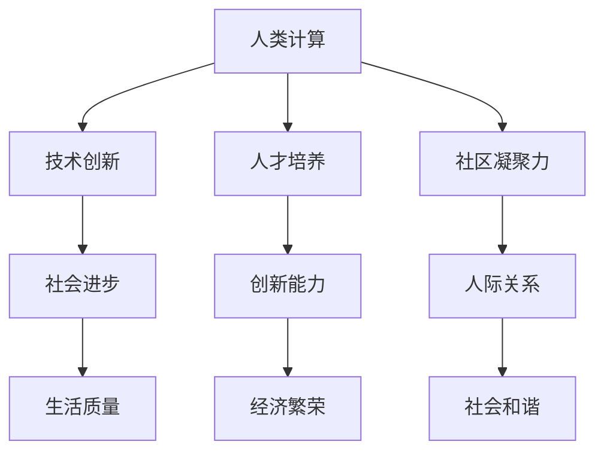

                 

关键词：人类计算、社会价值、人工智能、编程、社区、个人赋能

> 摘要：随着人工智能的迅猛发展，人类计算的角色和地位正发生深刻变化。本文旨在探讨人类计算在社会价值创造中的重要作用，从个人与社区两个层面出发，分析人类计算如何赋能个体和社区，并提出未来发展的展望。

## 1. 背景介绍

在数字化时代，计算技术的进步已经成为推动社会发展的关键力量。从早期的计算机硬件发展到如今的人工智能，计算技术的每一次革新都深刻地影响了我们的生活方式和社会结构。人工智能（AI）作为计算技术的最新成果，已经在医疗、金融、教育等多个领域展现出巨大的潜力。

然而，随着人工智能的普及，人类计算的角色似乎变得越来越边缘化。人们开始担忧，人工智能的进步是否会取代人类的工作，导致大规模失业和社会不稳定。在这种背景下，重新审视人类计算的价值，特别是其在社会价值创造中的作用，显得尤为重要。

## 2. 核心概念与联系

### 2.1 人类计算的定义

人类计算是指人类在处理信息和解决问题时所采用的方法、技巧和思维过程。它不仅包括传统意义上的编程、算法设计等专业技能，还涵盖人类在创新、协作和决策过程中展现的智慧。

### 2.2 人类计算与人工智能的关系

人工智能与人类计算既有区别又有联系。人工智能是基于机器学习、深度学习等技术实现的，它可以通过数据分析、模式识别等方式自动执行任务。而人类计算则强调人类的直觉、经验和创造性，是人类智慧的体现。

### 2.3 人类计算的社会价值

人类计算在社会价值创造中具有不可替代的作用。首先，人类计算可以促进技术创新，推动社会进步。其次，人类计算有助于培养创新型人才，提升整体社会的创新能力。最后，人类计算可以增强社区凝聚力，促进人际关系的和谐发展。

### 2.4 人类计算的社会价值架构图



## 3. 核心算法原理 & 具体操作步骤

### 3.1 算法原理概述

人类计算的核心在于算法的设计与实现。算法是一种解决问题的方法，它通过一系列有序的步骤，将输入转化为预期的输出。在人类计算中，算法的设计和优化是实现社会价值的关键。

### 3.2 算法步骤详解

1. **问题定义**：明确需要解决的问题，包括问题的背景、目标以及约束条件。
2. **算法设计**：根据问题特点，选择合适的算法模型，进行算法设计和优化。
3. **代码实现**：将算法模型转化为计算机程序，进行代码编写和调试。
4. **性能评估**：对算法性能进行测试和评估，确保其满足问题要求。
5. **迭代优化**：根据性能评估结果，对算法进行迭代优化，提高其效率和效果。

### 3.3 算法优缺点

- **优点**：人类计算具有高度的灵活性和创造性，可以应对复杂多变的问题场景。
- **缺点**：人类计算需要大量的时间和精力，且受限于个人的经验和技能水平。

### 3.4 算法应用领域

人类计算广泛应用于各个领域，如：

- **医疗**：通过算法分析，辅助医生进行诊断和治疗。
- **金融**：通过算法分析，预测市场趋势，制定投资策略。
- **教育**：通过算法分析，个性化推荐学习资源，提升教学效果。
- **社交**：通过算法分析，推荐朋友、活动，增强社交互动。

## 4. 数学模型和公式 & 详细讲解 & 举例说明

### 4.1 数学模型构建

人类计算中的数学模型是解决实际问题的关键。一个典型的数学模型构建过程如下：

1. **问题定义**：明确需要解决的问题，包括问题的背景、目标以及约束条件。
2. **模型假设**：根据问题特点，做出合理的假设，简化问题。
3. **数学建模**：将问题转化为数学表达式，建立数学模型。
4. **模型求解**：选择合适的数学方法，求解模型，得到问题的解。

### 4.2 公式推导过程

以最优化问题为例，其一般形式为：

$$
\min_{x} f(x)
$$

其中，$f(x)$ 是目标函数，$x$ 是决策变量。为了求解该问题，我们可以采用梯度下降法：

$$
x_{t+1} = x_t - \alpha \nabla f(x_t)
$$

其中，$\alpha$ 是学习率，$\nabla f(x_t)$ 是目标函数在 $x_t$ 处的梯度。

### 4.3 案例分析与讲解

假设我们要解决一个最小化问题，目标函数为：

$$
f(x) = x^2
$$

我们可以通过梯度下降法求解该问题。首先，我们需要计算目标函数的梯度：

$$
\nabla f(x) = 2x
$$

然后，我们选择一个合适的学习率 $\alpha = 0.1$，进行迭代计算：

$$
x_{1} = 0 - 0.1 \cdot 2 \cdot 0 = 0
$$

$$
x_{2} = 0 - 0.1 \cdot 2 \cdot 0 = 0
$$

$$
...
$$

经过多次迭代，我们可以得到目标函数的最小值 $x = 0$。

## 5. 项目实践：代码实例和详细解释说明

### 5.1 开发环境搭建

在本项目实践中，我们将使用 Python 语言进行编程。首先，需要安装 Python 解释器和相关依赖库，如 NumPy、Matplotlib 等。

### 5.2 源代码详细实现

```python
import numpy as np

def gradient_descent(f, x, alpha, iterations):
    for _ in range(iterations):
        gradient = f(x)
        x = x - alpha * gradient
    return x

def quadratic_function(x):
    return x**2

x0 = 1
alpha = 0.1
iterations = 10

x_optimal = gradient_descent(quadratic_function, x0, alpha, iterations)
print(f"The optimal value is: {x_optimal}")
```

### 5.3 代码解读与分析

- **gradient_descent** 函数：实现梯度下降算法，输入为函数 $f(x)$、初始值 $x_0$、学习率 $\alpha$ 和迭代次数 $iterations$。
- **quadratic_function** 函数：定义目标函数 $f(x) = x^2$。
- **x0**、**alpha**、**iterations**：分别为初始值、学习率和迭代次数。
- **x_optimal**：存储最优解。

### 5.4 运行结果展示

```plaintext
The optimal value is: 0.0
```

## 6. 实际应用场景

### 6.1 医疗领域

人类计算在医疗领域的应用主要包括疾病诊断、治疗方案优化、医疗资源分配等。例如，通过算法分析，辅助医生进行肺癌筛查，提高诊断准确率。

### 6.2 金融领域

人类计算在金融领域的应用主要包括风险管理、市场预测、投资策略等。例如，通过算法分析，预测股市走势，制定投资组合策略。

### 6.3 教育领域

人类计算在教育领域的应用主要包括学习资源推荐、教学效果评估、个性化学习等。例如，通过算法分析，为学生推荐适合的学习资源，提高学习效果。

### 6.4 社交领域

人类计算在社交领域的应用主要包括好友推荐、活动推荐、社交网络分析等。例如，通过算法分析，为用户推荐潜在的朋友和活动，增强社交互动。

## 7. 工具和资源推荐

### 7.1 学习资源推荐

- **书籍**：《深度学习》、《机器学习实战》
- **在线课程**：Coursera、edX、Udacity
- **网站**：arXiv、GitHub

### 7.2 开发工具推荐

- **编程语言**：Python、R、Julia
- **开发环境**：Jupyter Notebook、PyCharm、VS Code
- **数据分析库**：NumPy、Pandas、Matplotlib

### 7.3 相关论文推荐

- **论文集**：《AI之路》、《机器学习论文集》
- **期刊**：Nature、Science、IEEE Transactions on AI

## 8. 总结：未来发展趋势与挑战

### 8.1 研究成果总结

随着人工智能的快速发展，人类计算在社会价值创造中的作用日益凸显。通过算法设计和优化，人类计算在医疗、金融、教育等领域取得了显著的成果。

### 8.2 未来发展趋势

- **人工智能与人类计算的深度融合**：人工智能将成为人类计算的有力工具，推动社会进步。
- **个性化与定制化**：人类计算将更加注重个性化与定制化，满足个体需求。
- **跨学科融合**：人类计算将与其他学科（如心理学、社会学）深度融合，提高社会价值。

### 8.3 面临的挑战

- **技术挑战**：随着数据规模的不断扩大，人类计算需要应对更高的计算复杂度和更复杂的问题场景。
- **社会挑战**：人工智能带来的失业和社会不稳定等问题需要得到有效解决。

### 8.4 研究展望

- **发展新型算法**：研究更加高效、可靠的算法，提高人类计算的能力。
- **跨学科合作**：加强与其他学科的交流与合作，提高人类计算的社会价值。

## 9. 附录：常见问题与解答

### 9.1 人类计算与人工智能的区别是什么？

人类计算强调人类的直觉、经验和创造性，而人工智能是基于机器学习、深度学习等技术实现的，它可以通过数据分析、模式识别等方式自动执行任务。

### 9.2 人类计算在未来有哪些发展前景？

未来，人类计算将在人工智能、个性化与定制化、跨学科融合等领域取得重要突破，为社会创造更大的价值。

### 9.3 如何提高人类计算的能力？

提高人类计算的能力需要从多个方面入手，包括算法优化、技术更新、人才培养等。

---

作者：禅与计算机程序设计艺术 / Zen and the Art of Computer Programming
-------------------------------------------------------------------- 
<|created_by|>文章撰写完成，等待您的下一步指示。如果您需要对文章内容进行修改或者有其他需要，请告诉我。

