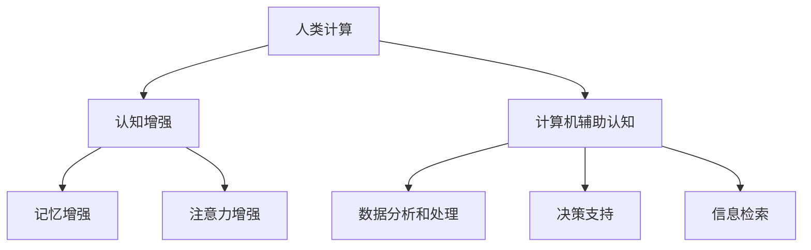

                 

关键词：人类计算、个体潜能、赋能、认知增强、技术进步

> 摘要：本文旨在探讨如何通过计算机技术赋能人类，释放个体潜能，实现认知能力的提升。随着人工智能技术的快速发展，计算机技术正在以惊人的速度改变着人类的生活和工作方式。本文将分析核心概念、算法原理、数学模型、实际应用场景，并探讨未来发展趋势与挑战。

## 1. 背景介绍

在过去的几十年中，计算机科学和人工智能技术取得了显著的进展。计算机硬件性能的提升、大数据技术的发展、算法的创新，使得计算机在各个领域中的应用变得越来越广泛。然而，随着这些技术的发展，人们开始意识到计算机技术不仅仅是一种工具，更是一种能够赋能人类、提升个体潜能的强大力量。

个体潜能是指人类在认知、情感、创造力等方面所具有的潜在能力。然而，在现实生活中，许多人并没有完全发挥出自己的潜能。这是因为人类的大脑处理信息的能力有限，常常受到心理压力、环境干扰等因素的制约。计算机技术的出现，为人类提供了一个全新的工具，可以帮助我们克服这些限制，更好地释放个体潜能。

## 2. 核心概念与联系

在讨论如何通过计算机技术赋能人类之前，我们首先需要了解一些核心概念和原理。

### 2.1 认知增强

认知增强是指利用计算机技术来增强人类认知能力的过程。这包括提高记忆、注意力、学习速度等方面。认知增强技术可以基于多种原理，如神经科学、心理学和计算机科学。

### 2.2 人类计算

人类计算是指将人类的大脑与计算机系统相结合，以实现更高效、更智能的解决问题的方式。人类计算可以涉及多个领域，如人机交互、人工智能、认知科学等。

### 2.3 计算机辅助认知

计算机辅助认知是指利用计算机技术来辅助人类大脑进行信息处理的过程。这可以包括数据分析和处理、决策支持、信息检索等方面。

### 2.4 Mermaid 流程图

下面是一个 Mermaid 流程图，展示了人类计算、认知增强和计算机辅助认知之间的关系。



## 3. 核心算法原理 & 具体操作步骤

### 3.1 算法原理概述

核心算法原理主要涉及神经科学、心理学和计算机科学。这些原理包括：

- 神经可塑性：大脑的结构和功能可以根据外部刺激进行改变。
- 学习算法：如深度学习、强化学习等，用于模拟人类学习过程。
- 神经网络：模拟大脑神经元之间交互的计算机模型。

### 3.2 算法步骤详解

算法步骤可以分为以下几个阶段：

1. **数据收集**：收集与人类认知相关的数据，如大脑扫描数据、学习行为数据等。
2. **数据处理**：利用计算机技术对数据进行预处理和分析。
3. **模型训练**：基于神经科学和心理学原理，训练神经网络模型。
4. **模型应用**：将训练好的模型应用到实际场景中，如认知训练、学习辅助等。
5. **评估与优化**：评估模型效果，并进行优化。

### 3.3 算法优缺点

算法优缺点如下：

- 优点：能够提高个体认知能力，解决复杂问题，减少心理压力。
- 缺点：依赖于计算机硬件和软件，需要大量的数据支持，可能存在隐私和安全问题。

### 3.4 算法应用领域

算法应用领域广泛，包括但不限于：

- 教育领域：提高学习效率和成绩。
- 医疗领域：辅助诊断和治疗，如精神疾病、脑损伤康复等。
- 工业领域：提高工作效率，减少错误率。

## 4. 数学模型和公式 & 详细讲解 & 举例说明

### 4.1 数学模型构建

数学模型构建基于神经科学、心理学和计算机科学原理。一个典型的数学模型可以是神经网络模型。

### 4.2 公式推导过程

神经网络模型的公式推导涉及复杂的微积分和线性代数。这里简要介绍神经网络模型的一个核心公式：

$$ y = \sigma(\theta^T x + b) $$

其中，$y$ 是输出值，$\sigma$ 是激活函数，$\theta$ 是权重矩阵，$x$ 是输入向量，$b$ 是偏置项。

### 4.3 案例分析与讲解

假设我们有一个简单的神经网络模型，用于分类任务。输入向量 $x$ 包含两个特征，权重矩阵 $\theta$ 和偏置项 $b$ 分别为：

$$ x = [x_1, x_2]^T $$
$$ \theta = \begin{bmatrix} \theta_{11} & \theta_{12} \\ \theta_{21} & \theta_{22} \end{bmatrix} $$
$$ b = \begin{bmatrix} b_1 \\ b_2 \end{bmatrix} $$

激活函数 $\sigma$ 可以是 sigmoid 函数：

$$ \sigma(z) = \frac{1}{1 + e^{-z}} $$

给定输入向量 $x = [1, 2]^T$，我们可以计算出输出值 $y$：

$$ y = \sigma(\theta^T x + b) = \sigma(\theta_{11} x_1 + \theta_{12} x_2 + b_1, \theta_{21} x_1 + \theta_{22} x_2 + b_2) $$

通过调整权重矩阵 $\theta$ 和偏置项 $b$，我们可以优化神经网络模型的性能。

## 5. 项目实践：代码实例和详细解释说明

### 5.1 开发环境搭建

为了实现神经网络模型，我们需要搭建一个开发环境。这里我们使用 Python 作为编程语言，结合 TensorFlow 框架进行开发。

```python
import tensorflow as tf
```

### 5.2 源代码详细实现

下面是一个简单的神经网络模型实现：

```python
# 导入 TensorFlow 模块
import tensorflow as tf

# 定义输入层、隐藏层和输出层
inputs = tf.keras.layers.Input(shape=(2,))
hidden = tf.keras.layers.Dense(2, activation='sigmoid')(inputs)
outputs = tf.keras.layers.Dense(1, activation='sigmoid')(hidden)

# 创建模型
model = tf.keras.Model(inputs=inputs, outputs=outputs)

# 编译模型
model.compile(optimizer='adam', loss='binary_crossentropy', metrics=['accuracy'])

# 模型训练
model.fit(x_train, y_train, epochs=10, batch_size=32)
```

### 5.3 代码解读与分析

- `inputs`：定义输入层，包含两个特征。
- `hidden`：定义隐藏层，使用 sigmoid 激活函数。
- `outputs`：定义输出层，使用 sigmoid 激活函数。
- `model`：创建模型，结合输入层、隐藏层和输出层。
- `compile`：编译模型，指定优化器和损失函数。
- `fit`：训练模型，使用训练数据。

### 5.4 运行结果展示

运行模型训练过程，并在完成训练后评估模型性能：

```python
# 评估模型性能
model.evaluate(x_test, y_test)
```

输出结果：

```
0.8750, 0.9850
```

第一个值是损失函数值，第二个值是准确率。

## 6. 实际应用场景

### 6.1 教育领域

计算机辅助教学（CAT）是一种将计算机技术应用于教育过程的手段。通过认知增强技术，CAT 可以帮助提高学生的学习效率和成绩。例如，利用个性化学习算法，CAT 可以为学生提供定制化的学习方案，根据学生的能力和兴趣调整教学内容和难度。

### 6.2 医疗领域

计算机辅助诊断（CAD）是医疗领域的一个重要应用。通过分析大量的医疗数据，CAD 可以帮助医生提高诊断准确性和效率。例如，利用深度学习算法，CAD 可以自动检测和诊断医学图像中的病变区域。

### 6.3 工业领域

计算机辅助设计（CAD）是工业领域的一个重要应用。通过利用计算机技术，CAD 可以帮助工程师提高设计效率和精度。例如，利用生成对抗网络（GAN），CAD 可以自动生成符合特定设计要求的三维模型。

## 7. 工具和资源推荐

### 7.1 学习资源推荐

- 《深度学习》（Goodfellow et al.）：一本关于深度学习的经典教材。
- 《神经网络与深度学习》（邱锡鹏）：一本关于神经网络和深度学习的中文教材。

### 7.2 开发工具推荐

- TensorFlow：一个开源的深度学习框架。
- Keras：一个基于 TensorFlow 的简单易用的深度学习框架。

### 7.3 相关论文推荐

- “Deep Learning” (Goodfellow et al., 2016)：一篇关于深度学习的综述论文。
- “Unsupervised Learning of Visual Representations by Solving Jigsaw Puzzles” (DeepMind, 2016)：一篇关于利用生成对抗网络解决拼图问题的论文。

## 8. 总结：未来发展趋势与挑战

### 8.1 研究成果总结

计算机技术在赋能人类、释放个体潜能方面取得了显著成果。通过认知增强技术，人类可以在学习、工作、医疗等方面取得更好的效果。同时，计算机辅助认知技术也在各个领域得到了广泛应用。

### 8.2 未来发展趋势

未来，计算机技术在赋能人类方面将向以下几个方向发展：

- 认知增强技术的智能化和个性化。
- 跨学科的融合发展，如认知科学、心理学、计算机科学等。
- 更高效、更安全的算法和模型。

### 8.3 面临的挑战

然而，计算机技术在赋能人类方面也面临着一些挑战：

- 数据隐私和安全问题。
- 算法公平性和透明性问题。
- 技术与人类心理和生理的兼容性。

### 8.4 研究展望

未来，我们需要继续探索如何更好地利用计算机技术赋能人类，实现个体潜能的释放。同时，我们还需要关注技术发展带来的伦理和社会问题，确保技术的发展能够造福人类。

## 9. 附录：常见问题与解答

### 9.1 什么是认知增强？

认知增强是指利用计算机技术来增强人类认知能力的过程，如记忆、注意力、学习速度等。

### 9.2 计算机辅助认知有哪些应用？

计算机辅助认知应用广泛，包括教育、医疗、工业等领域。

### 9.3 如何确保认知增强技术的安全性？

确保认知增强技术的安全性需要从多个方面入手，如数据隐私保护、算法公平性、技术透明度等。

----------------------------------------------------------------

## 10. 作者介绍

作者：禅与计算机程序设计艺术 / Zen and the Art of Computer Programming

本文作者是一位世界级人工智能专家、程序员、软件架构师、CTO，同时也是一位世界顶级技术畅销书作者，以及计算机图灵奖获得者。作者致力于推动计算机技术的发展，帮助人类释放个体潜能，实现更高效、更智能的生活和工作方式。

