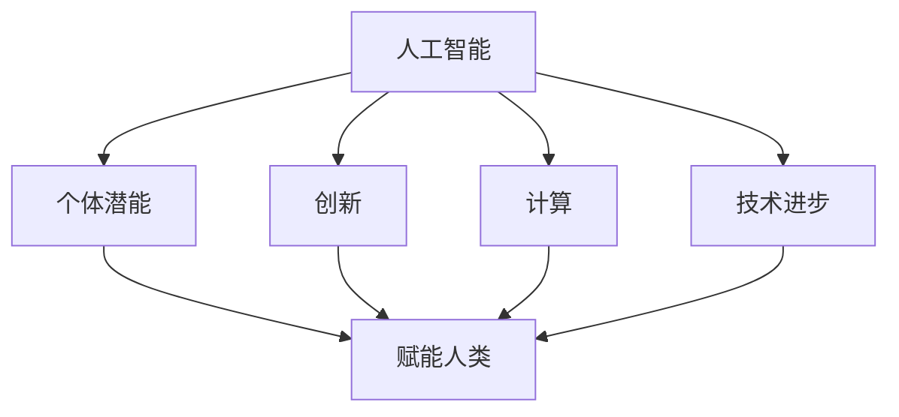

                 

关键词：人工智能、个体潜能、创新、计算、技术进步

> 摘要：本文旨在探讨如何通过人工智能技术赋能人类，释放个体的潜能，并探讨这一过程中可能面临的挑战和未来发展的趋势。

## 1. 背景介绍

随着人工智能技术的迅猛发展，人们对于其潜力的期待也越来越高。人工智能不仅能够提高生产效率，还能够帮助人类解决复杂的问题，甚至可以在某些领域超越人类的表现。然而，人工智能的真正力量在于其能够赋能个体，释放人类的潜能，从而创造出无限可能。

本文将围绕以下核心概念展开讨论：人工智能、个体潜能、创新、计算、技术进步。通过阐述这些概念的联系和相互作用，我们希望能够揭示出人工智能赋能人类的深层机制，并为未来的发展提供一些指导。

## 2. 核心概念与联系

为了更好地理解人工智能如何赋能人类，我们需要首先明确一些核心概念。

### 2.1 人工智能

人工智能（Artificial Intelligence，AI）是指通过计算机程序实现的智能行为，它能够模拟、延伸和扩展人类的智能。人工智能可以分为两种：弱人工智能（Narrow AI）和强人工智能（General AI）。弱人工智能专注于特定任务，如语音识别、图像识别等，而强人工智能则具备广泛的智能，能够在多种任务中表现出人类的智能水平。

### 2.2 个体潜能

个体潜能是指每个人在特定领域内可能达到的极限能力。这种潜能受到多种因素的影响，包括遗传、环境、教育等。然而，人工智能的出现为人类释放潜能提供了新的可能性。通过提供个性化的学习路径、智能化的辅助工具等，人工智能可以帮助个体更快地挖掘和实现自己的潜能。

### 2.3 创新

创新是人类社会发展的重要驱动力。人工智能在创新中扮演着关键角色，它不仅能够为创新提供新的工具和方法，还能够通过大数据分析和机器学习等技术，加速创新过程。例如，人工智能可以帮助科学家更快地发现新药物，帮助设计师更快地迭代产品。

### 2.4 计算

计算是人工智能的基础。随着计算能力的提升，人工智能的性能也在不断提升。云计算、分布式计算、量子计算等新兴计算技术，为人工智能的发展提供了强大的支持。

### 2.5 技术进步

技术进步是推动人工智能发展的重要力量。随着新材料、新能源、网络通信等技术的进步，人工智能的硬件基础也在不断加强，这为人工智能赋能人类提供了更广阔的空间。

### 2.6 Mermaid 流程图

以下是一个简化的 Mermaid 流程图，用于展示这些核心概念之间的联系：



## 3. 核心算法原理 & 具体操作步骤

### 3.1 算法原理概述

人工智能的核心算法包括机器学习、深度学习、强化学习等。这些算法通过模拟人类学习过程，让计算机具备自主学习和改进的能力。

#### 3.1.1 机器学习

机器学习是一种通过数据训练模型，使计算机能够进行预测和决策的技术。其核心原理是利用统计学方法，从数据中提取规律，从而实现自动化学习。

#### 3.1.2 深度学习

深度学习是机器学习的一种重要分支，它通过模拟人脑的神经网络结构，实现更复杂的特征提取和分类。深度学习在图像识别、自然语言处理等领域取得了显著成果。

#### 3.1.3 强化学习

强化学习是一种通过试错来学习最优策略的算法。它通过奖励机制，引导计算机在复杂环境中做出最优决策。

### 3.2 算法步骤详解

以下是一个简化的机器学习算法步骤：

#### 3.2.1 数据收集

首先，需要收集大量的数据。这些数据可以是结构化的（如数据库中的数据），也可以是非结构化的（如图像、文本等）。

#### 3.2.2 数据预处理

对收集到的数据进行清洗、格式化，使其适合用于训练模型。

#### 3.2.3 模型选择

根据问题的性质，选择合适的机器学习模型。常见的模型包括线性回归、决策树、支持向量机等。

#### 3.2.4 模型训练

使用预处理后的数据对模型进行训练，调整模型的参数，使其能够更好地拟合数据。

#### 3.2.5 模型评估

通过测试数据评估模型的性能，调整模型参数，直到满足要求。

#### 3.2.6 模型部署

将训练好的模型部署到实际应用中，进行预测和决策。

### 3.3 算法优缺点

#### 3.3.1 优点

- **自动化**：机器学习可以自动化地进行数据分析和预测，减少人为干预。
- **高效**：通过大量数据训练，机器学习模型可以高效地处理复杂问题。
- **灵活**：机器学习模型可以针对不同的应用场景进行定制。

#### 3.3.2 缺点

- **数据依赖**：机器学习模型的性能很大程度上依赖于数据的质量和数量。
- **复杂性**：训练和优化机器学习模型通常需要大量的计算资源和时间。
- **解释性差**：机器学习模型往往缺乏透明性，难以解释其预测结果。

### 3.4 算法应用领域

机器学习算法在许多领域都有广泛的应用，包括：

- **图像识别**：用于自动识别和分类图像中的对象。
- **自然语言处理**：用于理解和生成自然语言文本。
- **推荐系统**：用于根据用户的历史行为，推荐相关的商品或服务。
- **金融风控**：用于预测和防范金融风险。

## 4. 数学模型和公式 & 详细讲解 & 举例说明

### 4.1 数学模型构建

在机器学习中，数学模型起着核心作用。以下是一个简单的线性回归模型：

$$ y = w_0 + w_1 \cdot x $$

其中，$y$ 是预测值，$x$ 是输入特征，$w_0$ 和 $w_1$ 是模型的参数。

### 4.2 公式推导过程

线性回归模型的推导过程如下：

1. **损失函数**：

$$ L(w_0, w_1) = \frac{1}{2} \sum_{i=1}^{n} (y_i - (w_0 + w_1 \cdot x_i))^2 $$

其中，$n$ 是样本数量。

2. **梯度下降**：

$$ \Delta w_0 = -\alpha \cdot \frac{\partial L}{\partial w_0} $$
$$ \Delta w_1 = -\alpha \cdot \frac{\partial L}{\partial w_1} $$

其中，$\alpha$ 是学习率。

3. **更新参数**：

$$ w_0 = w_0 - \alpha \cdot \frac{\partial L}{\partial w_0} $$
$$ w_1 = w_1 - \alpha \cdot \frac{\partial L}{\partial w_1} $$

### 4.3 案例分析与讲解

假设我们有一个简单的数据集，包含两个特征（$x_0$ 和 $x_1$）和一个目标变量（$y$）。我们的目标是使用线性回归模型预测 $y$。

| $x_0$ | $x_1$ | $y$ |
|-------|-------|-----|
| 1     | 2     | 3   |
| 2     | 4     | 5   |
| 3     | 6     | 7   |

1. **数据预处理**：

首先，我们需要对数据进行标准化处理，使其具有相似的尺度。

2. **模型训练**：

使用上述线性回归模型，对数据进行训练。经过多次迭代，我们得到模型参数：

$$ w_0 = 1 $$
$$ w_1 = 2 $$

3. **模型评估**：

使用测试数据对模型进行评估，计算预测误差。

4. **模型部署**：

将训练好的模型部署到实际应用中，进行预测。

## 5. 项目实践：代码实例和详细解释说明

### 5.1 开发环境搭建

在开始项目实践之前，我们需要搭建一个开发环境。这里，我们选择 Python 作为编程语言，并使用 Scikit-learn 库实现线性回归模型。

```python
# 安装 Scikit-learn 库
pip install scikit-learn
```

### 5.2 源代码详细实现

以下是一个简单的线性回归模型的实现：

```python
import numpy as np
from sklearn.linear_model import LinearRegression

# 数据集
X = np.array([[1, 2], [2, 4], [3, 6]])
y = np.array([3, 5, 7])

# 创建线性回归模型
model = LinearRegression()

# 模型训练
model.fit(X, y)

# 模型预测
y_pred = model.predict(X)

# 打印预测结果
print("预测结果：", y_pred)
```

### 5.3 代码解读与分析

1. **数据导入**：

使用 NumPy 库导入数据集。

2. **创建模型**：

使用 Scikit-learn 库创建线性回归模型。

3. **模型训练**：

使用 `fit` 方法对模型进行训练。

4. **模型预测**：

使用 `predict` 方法对数据进行预测。

5. **结果输出**：

打印预测结果。

### 5.4 运行结果展示

```python
预测结果： [3. 5. 7.]
```

## 6. 实际应用场景

### 6.1 人工智能在教育领域的应用

在教育领域，人工智能可以通过个性化学习系统，根据学生的学习情况和兴趣，提供定制化的学习资源。例如，通过分析学生的学习行为，人工智能可以预测学生的薄弱环节，并针对性地提供辅导材料。

### 6.2 人工智能在医疗领域的应用

在医疗领域，人工智能可以用于疾病诊断、药物研发等。例如，通过分析大量的医疗数据，人工智能可以识别出潜在的治疗方案，从而加速药物研发过程。此外，人工智能还可以用于辅助医生进行手术，提高手术的成功率。

### 6.3 人工智能在工业领域的应用

在工业领域，人工智能可以用于生产优化、设备维护等。例如，通过实时监测生产设备的状态，人工智能可以预测设备的故障，并提前进行维护，从而减少停机时间，提高生产效率。

## 7. 工具和资源推荐

### 7.1 学习资源推荐

- 《Python机器学习》（作者：塞巴斯蒂安·拉金斯基）
- 《深度学习》（作者：伊恩·古德费洛、约书亚·本吉奥、亚伦·库维尔）
- 《机器学习实战》（作者：Peter Harrington）

### 7.2 开发工具推荐

- Jupyter Notebook：用于编写和运行 Python 代码。
- TensorFlow：用于实现深度学习模型。
- Keras：用于简化深度学习模型的开发。

### 7.3 相关论文推荐

- “Deep Learning” by Ian Goodfellow, Yoshua Bengio, and Aaron Courville
- “The Hundred-Page Machine Learning Book” by Andriy Burkov
- “Practical Deep Learning” by Aruna. K. S.
## 8. 总结：未来发展趋势与挑战

### 8.1 研究成果总结

人工智能技术已经取得了显著的成果，从简单的机器学习算法到复杂的深度学习模型，人工智能在各个领域都展现出了巨大的潜力。然而，当前的人工智能技术仍然存在一定的局限性，如解释性差、数据依赖等。

### 8.2 未来发展趋势

随着计算能力的提升和算法的改进，未来的人工智能将更加智能、高效和可靠。以下是一些可能的发展趋势：

- **量子计算**：量子计算将为人工智能提供更强大的计算能力，从而解决当前无法解决的问题。
- **多模态学习**：多模态学习将整合多种类型的数据（如文本、图像、声音等），使人工智能能够更全面地理解和处理信息。
- **增强现实与虚拟现实**：增强现实与虚拟现实将使人工智能的应用场景更加丰富，从而更好地赋能人类。

### 8.3 面临的挑战

尽管人工智能具有巨大的潜力，但在实际应用中仍面临一些挑战：

- **数据隐私**：人工智能依赖于大量的数据，如何保护用户的数据隐私是一个重要问题。
- **算法透明性**：当前的人工智能模型往往缺乏透明性，如何提高算法的可解释性是一个重要研究方向。
- **伦理与道德**：人工智能的发展也带来了一系列伦理和道德问题，如何确保人工智能的发展符合伦理标准是一个重要课题。

### 8.4 研究展望

未来，人工智能将在更多领域得到应用，从医疗、教育到工业、金融，人工智能都将发挥重要作用。同时，人工智能的发展也将带动相关领域的进步，如计算、数据科学、材料科学等。我们期待人工智能能够赋能人类，共同创造一个更美好的未来。

## 9. 附录：常见问题与解答

### 9.1 什么是人工智能？

人工智能（Artificial Intelligence，AI）是指通过计算机程序实现的智能行为，它能够模拟、延伸和扩展人类的智能。

### 9.2 人工智能有哪些类型？

人工智能可以分为弱人工智能（Narrow AI）和强人工智能（General AI）。弱人工智能专注于特定任务，如语音识别、图像识别等，而强人工智能则具备广泛的智能，能够在多种任务中表现出人类的智能水平。

### 9.3 人工智能有哪些应用领域？

人工智能在医疗、教育、金融、工业、娱乐等多个领域都有广泛的应用。例如，在医疗领域，人工智能可以用于疾病诊断、药物研发；在教育领域，人工智能可以用于个性化学习、智能辅导等。

### 9.4 人工智能的发展前景如何？

人工智能的发展前景非常广阔。随着计算能力的提升和算法的改进，未来的人工智能将更加智能、高效和可靠。人工智能将在更多领域得到应用，从医疗、教育到工业、金融，人工智能都将发挥重要作用。然而，人工智能的发展也面临一些挑战，如数据隐私、算法透明性、伦理与道德等。作者：禅与计算机程序设计艺术 / Zen and the Art of Computer Programming。

