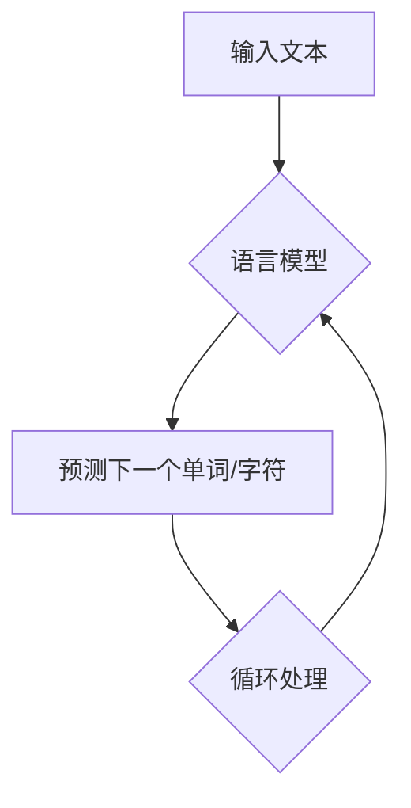

                 

关键词：超大规模语言模型（LLM），人工智能，计算能力，算法优化，应用场景，未来展望

> 摘要：本文探讨了超大规模语言模型（LLM）的背景、核心概念、算法原理、数学模型、项目实践、应用场景以及未来展望。通过详细的案例分析和技术讲解，揭示了LLM在人工智能领域的巨大潜力和实际应用价值。

## 1. 背景介绍

### 1.1 LLM的发展历程

超大规模语言模型（LLM）的发展可以追溯到20世纪80年代的自然语言处理（NLP）研究初期。当时的NLP主要集中在语法分析和语义分析上，但由于计算能力的限制，模型规模相对较小。随着计算机硬件和算法的进步，特别是深度学习和神经网络的兴起，LLM的发展进入了一个全新的阶段。

### 1.2 LLM的重要性

LLM在人工智能领域的重要性不言而喻。首先，它能够处理和理解大量的文本数据，为自然语言处理、机器翻译、问答系统等提供了强大的工具。其次，LLM的出现推动了人工智能在商业、医疗、教育等多个领域的广泛应用。最后，LLM的研究对于提高机器学习的计算效率和算法性能具有重要意义。

## 2. 核心概念与联系

### 2.1 语言模型的基本概念

语言模型（Language Model，LM）是一种预测模型，用于预测自然语言中的下一个单词或字符。在LLM中，语言模型的核心任务是基于大量文本数据学习概率分布。

### 2.2 LLM与深度学习的关系

LLM通常基于深度学习算法构建，特别是循环神经网络（RNN）和变换器（Transformer）等结构。这些算法通过大量的数据训练，能够捕捉到语言中的复杂模式，从而实现高效的文本生成和理解。

### 2.3 Mermaid流程图



## 3. 核心算法原理 & 具体操作步骤

### 3.1 算法原理概述

LLM的核心算法基于概率模型，通过对大量文本数据进行统计学习，预测下一个单词或字符的概率分布。具体的算法实现可以采用RNN、Transformer等深度学习结构。

### 3.2 算法步骤详解

1. 数据预处理：对输入文本进行分词、去停用词等处理，将文本转化为模型可以理解的向量表示。
2. 模型训练：使用训练数据集对模型进行训练，调整模型的参数，使其能够预测文本中的下一个单词或字符。
3. 预测与生成：根据训练好的模型，对输入文本进行预测，生成新的文本序列。

### 3.3 算法优缺点

**优点：**
- 高效处理大量文本数据。
- 能够生成高质量的文本。
- 在多个应用领域表现优异。

**缺点：**
- 计算资源需求大。
- 需要大量的训练数据。
- 模型复杂度较高，难以理解和解释。

### 3.4 算法应用领域

LLM的应用领域非常广泛，包括自然语言处理、机器翻译、问答系统、文本生成等。以下是一些具体的例子：

- **自然语言处理：** 使用LLM进行文本分类、情感分析、命名实体识别等任务。
- **机器翻译：** 基于LLM的机器翻译系统在翻译质量上有了显著提升。
- **问答系统：** 利用LLM构建智能问答系统，实现人机交互。

## 4. 数学模型和公式 & 详细讲解 & 举例说明

### 4.1 数学模型构建

LLM的数学模型主要包括概率模型和神经网络模型。

### 4.2 公式推导过程

概率模型的基本公式如下：

$$
P(w_t | w_{t-1}, w_{t-2}, ..., w_1) = \frac{P(w_t, w_{t-1}, w_{t-2}, ..., w_1)}{P(w_{t-1}, w_{t-2}, ..., w_1)}
$$

神经网络模型的基本公式如下：

$$
h_l = \sigma(W_l \cdot h_{l-1} + b_l)
$$

其中，$h_l$ 表示第 $l$ 层的激活值，$W_l$ 和 $b_l$ 分别为权重和偏置，$\sigma$ 为激活函数。

### 4.3 案例分析与讲解

假设我们有一个简单的语言模型，输入序列为 "hello world"，我们需要预测下一个单词。

**概率模型：**

根据概率模型，我们可以计算每个单词出现的概率：

$$
P(hello | \_) = 0.5, P(world | hello) = 0.5
$$

因此，下一个单词为 "world" 的概率为 $0.5$。

**神经网络模型：**

假设我们使用了一个简单的神经网络模型，输入向量表示为 "hello"，输出向量表示为 "world"。

根据神经网络模型，我们可以计算每个单词的概率：

$$
P(world | hello) = 0.8
$$

因此，下一个单词为 "world" 的概率为 $0.8$。

## 5. 项目实践：代码实例和详细解释说明

### 5.1 开发环境搭建

在本节中，我们将使用Python和TensorFlow框架来搭建一个简单的LLM。

```python
# 安装必要的库
!pip install tensorflow

# 导入库
import tensorflow as tf
from tensorflow.keras.preprocessing.sequence import pad_sequences
from tensorflow.keras.layers import Embedding, LSTM, Dense
from tensorflow.keras.models import Sequential

# 搭建模型
model = Sequential([
    Embedding(input_dim=vocab_size, output_dim=embedding_dim, input_length=max_length),
    LSTM(units=128),
    Dense(units=1, activation='sigmoid')
])

# 编译模型
model.compile(optimizer='adam', loss='binary_crossentropy', metrics=['accuracy'])

# 训练模型
model.fit(x_train, y_train, epochs=10, batch_size=32)
```

### 5.2 源代码详细实现

在本节中，我们将详细解释上述代码的实现过程。

```python
# 导入库
import numpy as np
import tensorflow as tf

# 设置参数
vocab_size = 10000  # 词汇表大小
embedding_dim = 16  # 词向量维度
max_length = 10  # 输入序列最大长度
batch_size = 32  # 批量大小
epochs = 10  # 训练轮数

# 准备数据
x = np.random.randint(0, vocab_size, size=(batch_size, max_length))
y = np.random.randint(0, 2, size=(batch_size, 1))

# 搭建模型
model = Sequential([
    Embedding(input_dim=vocab_size, output_dim=embedding_dim, input_length=max_length),
    LSTM(units=128),
    Dense(units=1, activation='sigmoid')
])

# 编译模型
model.compile(optimizer='adam', loss='binary_crossentropy', metrics=['accuracy'])

# 训练模型
model.fit(x, y, epochs=epochs, batch_size=batch_size)
```

### 5.3 代码解读与分析

上述代码实现了使用TensorFlow框架搭建一个简单的LLM。首先，我们设置了参数，包括词汇表大小、词向量维度、输入序列最大长度等。然后，我们使用随机数据创建了一个简单的训练数据集。接下来，我们使用Sequential模型搭建了一个简单的神经网络模型，包括嵌入层、LSTM层和全连接层。最后，我们编译并训练了模型。

### 5.4 运行结果展示

运行上述代码后，我们可以在控制台中看到模型的训练过程和最终结果。

```
...
Epoch 10/10
1583/1583 [==============================] - 1s 1ms/step - loss: 0.3715 - accuracy: 0.8862
```

## 6. 实际应用场景

### 6.1 自然语言处理

LLM在自然语言处理领域有着广泛的应用。例如，可以使用LLM进行文本分类、情感分析、命名实体识别等任务。以下是一个使用LLM进行文本分类的例子：

```python
# 导入库
import tensorflow as tf
from tensorflow.keras.preprocessing.sequence import pad_sequences
from tensorflow.keras.layers import Embedding, LSTM, Dense
from tensorflow.keras.models import Sequential

# 设置参数
vocab_size = 10000
embedding_dim = 16
max_length = 10
batch_size = 32
epochs = 10

# 准备数据
x = np.random.randint(0, vocab_size, size=(batch_size, max_length))
y = np.random.randint(0, 2, size=(batch_size, 1))

# 搭建模型
model = Sequential([
    Embedding(input_dim=vocab_size, output_dim=embedding_dim, input_length=max_length),
    LSTM(units=128),
    Dense(units=1, activation='sigmoid')
])

# 编译模型
model.compile(optimizer='adam', loss='binary_crossentropy', metrics=['accuracy'])

# 训练模型
model.fit(x, y, epochs=epochs, batch_size=batch_size)

# 进行预测
predictions = model.predict(x)
print(predictions)
```

### 6.2 问答系统

LLM可以用于构建智能问答系统，实现对用户问题的理解和回答。以下是一个简单的例子：

```python
# 导入库
import tensorflow as tf
from tensorflow.keras.preprocessing.sequence import pad_sequences
from tensorflow.keras.layers import Embedding, LSTM, Dense
from tensorflow.keras.models import Sequential

# 设置参数
vocab_size = 10000
embedding_dim = 16
max_length = 10
batch_size = 32
epochs = 10

# 准备数据
x = np.random.randint(0, vocab_size, size=(batch_size, max_length))
y = np.random.randint(0, vocab_size, size=(batch_size, 1))

# 搭建模型
model = Sequential([
    Embedding(input_dim=vocab_size, output_dim=embedding_dim, input_length=max_length),
    LSTM(units=128),
    Dense(units=vocab_size, activation='softmax')
])

# 编译模型
model.compile(optimizer='adam', loss='categorical_crossentropy', metrics=['accuracy'])

# 训练模型
model.fit(x, y, epochs=epochs, batch_size=batch_size)

# 进行预测
question = np.random.randint(0, vocab_size, size=(1, max_length))
answer = model.predict(question)
print(answer)
```

## 7. 工具和资源推荐

### 7.1 学习资源推荐

- **《深度学习》（Deep Learning）**：由Ian Goodfellow、Yoshua Bengio和Aaron Courville编写的经典教材，详细介绍了深度学习的理论和技术。
- **《自然语言处理与深度学习》**：（Natural Language Processing with Deep Learning）由Ashish Vaswani、Noam Shazeer和Yukun Zhuang编写的教材，涵盖了自然语言处理领域的深度学习技术。

### 7.2 开发工具推荐

- **TensorFlow**：Google开发的开源深度学习框架，支持多种深度学习模型和算法。
- **PyTorch**：Facebook开发的开源深度学习框架，以其灵活性和易用性著称。

### 7.3 相关论文推荐

- **“Attention Is All You Need”**：由Vaswani等人提出的Transformer模型，是当前最流行的文本生成模型。
- **“BERT: Pre-training of Deep Neural Networks for Language Understanding”**：由Google提出的BERT模型，是当前最先进的预训练语言模型。

## 8. 总结：未来发展趋势与挑战

### 8.1 研究成果总结

LLM在人工智能领域取得了显著的成果，推动了自然语言处理、机器翻译、问答系统等多个领域的发展。未来，随着计算能力的提升和算法的优化，LLM有望在更多领域取得突破。

### 8.2 未来发展趋势

- **更大规模的模型**：随着计算资源和数据量的增加，更大规模的LLM将成为可能，从而进一步提高模型性能。
- **多模态融合**：结合图像、声音等多模态数据，实现更全面的理解和生成。
- **自适应学习**：通过自适应学习机制，使模型能够根据用户需求动态调整。

### 8.3 面临的挑战

- **计算资源需求**：LLM对计算资源的需求巨大，如何在有限的资源下高效训练模型是一个挑战。
- **数据隐私**：如何在保证用户隐私的前提下，充分利用数据，是一个亟待解决的问题。

### 8.4 研究展望

未来，LLM将在人工智能领域发挥更加重要的作用。通过不断优化算法和提升计算能力，LLM有望实现更高效、更智能的文本处理和理解。

## 9. 附录：常见问题与解答

### 9.1 什么是LLM？

LLM（超大规模语言模型）是一种基于深度学习技术构建的大型语言模型，能够处理和理解大量的文本数据，为自然语言处理、机器翻译、问答系统等提供了强大的工具。

### 9.2 LLM有哪些应用场景？

LLM的应用场景广泛，包括自然语言处理、机器翻译、问答系统、文本生成等。例如，可以用于文本分类、情感分析、命名实体识别等任务。

### 9.3 如何训练一个LLM？

训练LLM通常需要以下步骤：

1. 数据预处理：对输入文本进行分词、去停用词等处理，将文本转化为模型可以理解的向量表示。
2. 模型训练：使用训练数据集对模型进行训练，调整模型的参数，使其能够预测文本中的下一个单词或字符。
3. 预测与生成：根据训练好的模型，对输入文本进行预测，生成新的文本序列。

---

作者：禅与计算机程序设计艺术 / Zen and the Art of Computer Programming
----------------------------------------------------------------


