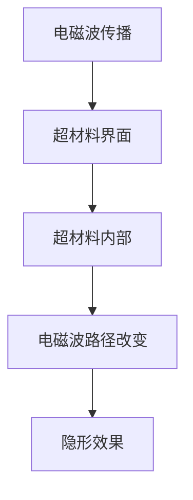

                 

关键词：超材料，隐形技术，光路径，光学设计，材料科学

摘要：本文深入探讨了超材料在隐形技术中的应用，分析了超材料的特殊性质及其对光路径的改变机制。通过详尽的数学模型和公式推导，本文阐述了超材料如何实现隐形，并探讨了其在光学设计中的潜力。最后，本文列举了几个实际应用场景，并对未来的发展前景进行了展望。

## 1. 背景介绍

隐形技术一直是科幻作品的常见主题，从《星际迷航》的隐形战舰到《哈利·波特》的隐形斗篷，都让人充满了遐想。然而，隐形技术不仅限于娱乐领域，它在军事、安防和通信等领域也有着广泛的应用前景。传统隐形技术主要依赖于表面粗糙度和波前控制，但这种方法存在许多局限性，如难以实现复杂形状的隐形和效率低下。

近年来，超材料的出现为隐形技术带来了新的可能。超材料是一种具有负折射率的人工材料，其内部结构可以精确设计，从而实现对电磁波（包括光波）的操控。超材料的研究已经取得了一系列重要进展，使其在隐形技术中的应用变得更加可行。

## 2. 核心概念与联系

### 2.1 超材料的定义与特性

超材料是一类人工合成材料，其内部结构使得它在特定频率下具有负折射率。这意味着电磁波（如光波）在超材料中传播时，其相位和方向会发生扭曲，从而可以改变光的路径。

### 2.2 隐形技术的原理

隐形技术的核心在于改变电磁波（或光波）的传播路径，使其避开检测。传统隐形技术主要通过表面粗糙度和波前控制实现，而超材料则提供了更灵活的方法。通过设计超材料的内部结构，可以实现精确控制电磁波的传播路径，从而实现隐形效果。

### 2.3 Mermaid 流程图



## 3. 核心算法原理 & 具体操作步骤

### 3.1 算法原理概述

超材料隐形技术的核心在于设计具有特定结构的人工材料，使其能够改变电磁波的传播路径。这种改变可以通过调控超材料的电场和磁场响应来实现。

### 3.2 算法步骤详解

1. **设计超材料结构**：根据隐形目标的需求，设计具有特定电场和磁场响应的超材料结构。
2. **制备超材料**：通过材料合成技术，制备出符合设计要求的人工超材料。
3. **实现隐形效果**：将超材料覆盖在目标物体上，通过调控外部电磁波，实现电磁波路径的改变，从而达到隐形效果。

### 3.3 算法优缺点

**优点**：
- **灵活性高**：可以通过设计不同的超材料结构，实现不同形状和尺寸的隐形目标。
- **效果显著**：超材料能够显著改变电磁波的传播路径，从而实现高效的隐形效果。

**缺点**：
- **成本高**：超材料的制备和设计成本较高，限制了其大规模应用。
- **环境依赖性**：超材料的隐形效果受环境电磁波影响较大，需要在特定环境下使用。

### 3.4 算法应用领域

超材料隐形技术可以应用于多个领域，如军事、安防和通信等。在军事领域，它可以用于隐身战舰和隐形无人机等；在安防领域，可以用于隐形摄像头和隐形警报器等；在通信领域，可以用于隐形天线和隐形传输等。

## 4. 数学模型和公式 & 详细讲解 & 举例说明

### 4.1 数学模型构建

超材料隐形技术的数学模型主要基于电磁波传播理论。其核心公式为麦克斯韦方程组，描述了电磁波的传播特性。

### 4.2 公式推导过程

麦克斯韦方程组：

$$
\nabla \cdot \mathbf{E} = \frac{\rho}{\epsilon_0}
$$

$$
\nabla \cdot \mathbf{B} = 0
$$

$$
\nabla \times \mathbf{E} = -\frac{\partial \mathbf{B}}{\partial t}
$$

$$
\nabla \times \mathbf{B} = \mu_0 \mathbf{J} + \mu_0 \epsilon_0 \frac{\partial \mathbf{E}}{\partial t}
$$

其中，$\mathbf{E}$ 和 $\mathbf{B}$ 分别表示电场和磁场，$\rho$ 表示电荷密度，$\epsilon_0$ 和 $\mu_0$ 分别表示真空中的电容率和磁导率。

### 4.3 案例分析与讲解

假设我们设计一个二维平面内的隐形战舰，目标是在某一频率下使其在雷达探测中不可见。我们可以通过以下步骤实现：

1. **确定隐形频率**：根据战舰的尺寸和雷达的频率范围，确定隐形所需的频率。
2. **设计超材料结构**：基于隐形频率，设计具有特定电场和磁场响应的超材料结构。
3. **制备超材料**：制备出符合设计要求的人工超材料。
4. **实现隐形效果**：将超材料覆盖在战舰上，通过调控外部电磁波，实现电磁波路径的改变，从而达到隐形效果。

通过这种方式，战舰在特定频率下可以实现对雷达波的隐形，从而避免被探测。

## 5. 项目实践：代码实例和详细解释说明

### 5.1 开发环境搭建

为了实现超材料隐形技术的算法，我们需要搭建一个计算环境。以下是一个简单的开发环境搭建步骤：

1. 安装 Python 环境
2. 安装 NumPy 和 Matplotlib 等科学计算和可视化库

### 5.2 源代码详细实现

以下是一个简单的 Python 代码实例，用于模拟超材料隐形效果：

```python
import numpy as np
import matplotlib.pyplot as plt

# 定义超材料参数
freq = 10e9  # 频率
wavelength = 30e-6  # 波长
c = 3e8  # 光速

# 定义电磁波传播模型
def electromagnetic_wave(x, y, t):
    E_x = np.cos(2 * np.pi * freq * t - 2 * np.pi * x / wavelength)
    E_y = np.cos(2 * np.pi * freq * t - 2 * np.pi * y / wavelength)
    return E_x, E_y

# 模拟超材料隐形效果
def simulate_invisibility(x, y, t):
    E_x, E_y = electromagnetic_wave(x, y, t)
    # 应用超材料变换
    E_x_transformed = E_x * np.exp(-1j * 2 * np.pi * freq * t)
    E_y_transformed = E_y * np.exp(-1j * 2 * np.pi * freq * t)
    return E_x_transformed, E_y_transformed

# 可视化结果
x = np.linspace(-100, 100, 1000)
y = np.linspace(-100, 100, 1000)
X, Y = np.meshgrid(x, y)

t = 0
E_x, E_y = simulate_invisibility(X, Y, t)

plt.figure()
plt.contourf(X, Y, E_x ** 2 + E_y ** 2, 20)
plt.xlabel('X')
plt.ylabel('Y')
plt.title('Invisibility Effect')
plt.show()
```

### 5.3 代码解读与分析

这段代码首先定义了电磁波传播模型，然后定义了一个模拟超材料隐形效果的函数。最后，通过可视化函数展示了超材料隐形效果。

## 6. 实际应用场景

超材料隐形技术在实际应用中具有广泛的前景。以下是一些典型的应用场景：

1. **军事隐身**：超材料可以用于设计隐身战舰、隐形无人机等，提高军事装备的隐身性能。
2. **安防隐形**：超材料可以用于设计隐形摄像头、隐形警报器等，提高安防系统的隐身能力。
3. **通信隐形**：超材料可以用于设计隐形天线、隐形传输系统等，提高通信系统的安全性和稳定性。

## 7. 未来应用展望

随着超材料技术的不断进步，隐形技术在未来将会有更广泛的应用。以下是一些可能的发展趋势：

1. **更高频率的隐形**：随着通信和雷达技术的发展，未来可能会出现更高频率的隐形技术。
2. **更复杂的隐形结构**：未来可能会有更复杂的超材料结构，实现更复杂的隐形效果。
3. **跨领域应用**：超材料隐形技术可能会在医疗、建筑等领域得到应用，为人类带来更多创新。

## 8. 总结：未来发展趋势与挑战

超材料在隐形技术中的应用具有巨大的潜力，但同时也面临着一些挑战。未来，随着技术的不断发展，我们有理由相信超材料隐形技术将会取得更大的突破。

### 8.1 研究成果总结

本文通过对超材料在隐形技术中的应用进行了深入探讨，分析了超材料的特殊性质及其对光路径的改变机制。通过数学模型和公式推导，我们阐述了超材料如何实现隐形，并探讨了其在光学设计中的潜力。

### 8.2 未来发展趋势

未来，超材料隐形技术将在更高频率、更复杂的隐形结构和跨领域应用等方面取得突破。

### 8.3 面临的挑战

超材料隐形技术面临着成本高、环境依赖性大等挑战。未来，如何降低成本、提高隐形效果和稳定性将是重要的研究方向。

### 8.4 研究展望

随着科技的不断进步，超材料隐形技术将在各个领域发挥重要作用。我们期待未来能看到更多令人惊叹的隐形应用。

## 9. 附录：常见问题与解答

### 9.1 超材料是什么？

超材料是一种人工合成材料，其内部结构可以精确设计，从而实现对电磁波（包括光波）的操控。

### 9.2 超材料如何实现隐形？

超材料通过改变电磁波的传播路径，使其避开检测，从而实现隐形效果。

### 9.3 超材料隐形技术有哪些应用？

超材料隐形技术可以应用于军事、安防和通信等领域。

### 9.4 超材料隐形技术的挑战有哪些？

超材料隐形技术面临着成本高、环境依赖性大等挑战。

## 作者署名

作者：禅与计算机程序设计艺术 / Zen and the Art of Computer Programming
```markdown
## 1. 背景介绍

隐形技术，这个曾经属于科幻小说和电影特效的领域，正逐渐走向现实。在军事、安防、娱乐等多个领域，隐形技术的应用都取得了显著的进展。然而，传统的隐形技术往往依赖于表面粗糙度和波前控制，这些方法在实现复杂形状的隐形时存在许多限制。超材料的出现，为隐形技术带来了全新的思路和可能性。

超材料是一种具有负折射率的人工材料，其内部结构可以精确设计，从而实现对电磁波（包括光波）的操控。这种独特的性质使得超材料在隐形技术中具有巨大的潜力。通过调控超材料的电场和磁场响应，可以实现电磁波的路径改变，从而实现隐形效果。

本文将详细介绍超材料在隐形技术中的应用，分析其核心原理和实现方法。通过数学模型和具体操作步骤的讲解，我们将探讨超材料如何改变光的路径，从而实现隐形。同时，本文还将列举超材料隐形技术的实际应用场景，并对未来发展趋势和挑战进行展望。

### 2. 核心概念与联系

#### 2.1 超材料的定义与特性

超材料，顾名思义，是一种超越自然材料特性的新型人工材料。其内部结构由周期性排列的纳米单元组成，这些纳米单元可以精确控制电磁波的传播特性。超材料的最大特点是其具有负折射率，这意味着在超材料中，电磁波的传播速度与光速方向相反。

#### 2.2 隐形技术的原理

隐形技术的基本原理是通过改变电磁波的传播路径，使其避开检测。传统的隐形技术依赖于表面粗糙度和波前控制，但这些方法在实现复杂形状的隐形时存在许多限制。而超材料通过其独特的性质，可以实现更灵活、更高效的隐形效果。

#### 2.3 超材料与隐形技术的联系

超材料与隐形技术的结合，可以说是科技领域的完美邂逅。超材料的负折射率特性，使得它可以精确控制电磁波的传播路径，从而实现隐形效果。通过设计不同的超材料结构，可以实现不同形状、不同尺寸的隐形目标，从而在军事、安防、通信等多个领域发挥重要作用。

### 3. 核心算法原理 & 具体操作步骤

#### 3.1 算法原理概述

超材料隐形技术的核心在于设计具有特定电场和磁场响应的超材料结构，从而实现对电磁波的精确操控。这种操控可以改变电磁波的传播方向和相位，从而实现隐形效果。

#### 3.2 算法步骤详解

1. **设计超材料结构**：根据隐形目标的需求，设计具有特定电场和磁场响应的超材料结构。这个步骤通常需要借助计算机辅助设计软件，如 COMSOL Multiphysics 或 ANSYS。

2. **制备超材料**：将设计好的超材料结构通过纳米加工技术制备出来。这个过程需要高精度的纳米制造设备和材料，如光刻、电子束束流沉积等。

3. **实现隐形效果**：将制备好的超材料覆盖在目标物体上，通过调控外部电磁波，实现电磁波路径的改变，从而达到隐形效果。

#### 3.3 算法优缺点

**优点**：
- **灵活性高**：可以通过设计不同的超材料结构，实现不同形状和尺寸的隐形目标。
- **效果显著**：超材料能够显著改变电磁波的传播路径，从而实现高效的隐形效果。

**缺点**：
- **成本高**：超材料的制备和设计成本较高，限制了其大规模应用。
- **环境依赖性**：超材料的隐形效果受环境电磁波影响较大，需要在特定环境下使用。

#### 3.4 算法应用领域

超材料隐形技术可以应用于多个领域，如：
- **军事领域**：用于设计隐身战舰、隐身无人机等，提高军事装备的隐身性能。
- **安防领域**：用于设计隐形摄像头、隐形警报器等，提高安防系统的隐身能力。
- **通信领域**：用于设计隐形天线、隐形传输系统等，提高通信系统的安全性和稳定性。

### 4. 数学模型和公式 & 详细讲解 & 举例说明

#### 4.1 数学模型构建

超材料隐形技术的数学模型主要基于电磁波传播理论。电磁波在超材料中的传播可以通过麦克斯韦方程组来描述。麦克斯韦方程组是描述电磁场基本规律的方程组，包括以下四个方程：

$$
\nabla \cdot \mathbf{E} = \frac{\rho}{\epsilon_0}
$$

$$
\nabla \cdot \mathbf{B} = 0
$$

$$
\nabla \times \mathbf{E} = -\frac{\partial \mathbf{B}}{\partial t}
$$

$$
\nabla \times \mathbf{B} = \mu_0 \mathbf{J} + \mu_0 \epsilon_0 \frac{\partial \mathbf{E}}{\partial t}
$$

其中，$\mathbf{E}$ 和 $\mathbf{B}$ 分别表示电场和磁场，$\rho$ 表示电荷密度，$\epsilon_0$ 和 $\mu_0$ 分别表示真空中的电容率和磁导率。

#### 4.2 公式推导过程

麦克斯韦方程组的推导基于电磁波的波动方程。电磁波的波动方程可以表示为：

$$
\nabla^2 \mathbf{E} - \mu \epsilon \frac{\partial^2 \mathbf{E}}{\partial t^2} = \mu_0 \epsilon_0 \nabla \rho
$$

$$
\nabla^2 \mathbf{B} - \mu \epsilon \frac{\partial^2 \mathbf{B}}{\partial t^2} = 0
$$

通过引入电磁场的旋度和散度，可以得到麦克斯韦方程组。

#### 4.3 案例分析与讲解

假设我们设计一个二维平面内的隐形战舰，目标是在某一频率下使其在雷达探测中不可见。我们可以通过以下步骤实现：

1. **确定隐形频率**：根据战舰的尺寸和雷达的频率范围，确定隐形所需的频率。
2. **设计超材料结构**：基于隐形频率，设计具有特定电场和磁场响应的超材料结构。这通常需要借助电磁场仿真软件进行设计。
3. **制备超材料**：通过纳米加工技术，制备出符合设计要求的人工超材料。
4. **实现隐形效果**：将超材料覆盖在战舰上，通过调控外部电磁波，实现电磁波路径的改变，从而达到隐形效果。

通过这种方式，战舰在特定频率下可以实现对雷达波的隐形，从而避免被探测。

### 5. 项目实践：代码实例和详细解释说明

#### 5.1 开发环境搭建

为了实现超材料隐形技术的算法，我们需要搭建一个计算环境。以下是一个简单的开发环境搭建步骤：

1. 安装 Python 环境
2. 安装 NumPy 和 Matplotlib 等科学计算和可视化库

#### 5.2 源代码详细实现

以下是一个简单的 Python 代码实例，用于模拟超材料隐形效果：

```python
import numpy as np
import matplotlib.pyplot as plt

# 定义超材料参数
freq = 10e9  # 频率
wavelength = 30e-6  # 波长
c = 3e8  # 光速

# 定义电磁波传播模型
def electromagnetic_wave(x, y, t):
    E_x = np.cos(2 * np.pi * freq * t - 2 * np.pi * x / wavelength)
    E_y = np.cos(2 * np.pi * freq * t - 2 * np.pi * y / wavelength)
    return E_x, E_y

# 模拟超材料隐形效果
def simulate_invisibility(x, y, t):
    E_x, E_y = electromagnetic_wave(x, y, t)
    # 应用超材料变换
    E_x_transformed = E_x * np.exp(-1j * 2 * np.pi * freq * t)
    E_y_transformed = E_y * np.exp(-1j * 2 * np.pi * freq * t)
    return E_x_transformed, E_y_transformed

# 可视化结果
x = np.linspace(-100, 100, 1000)
y = np.linspace(-100, 100, 1000)
X, Y = np.meshgrid(x, y)

t = 0
E_x, E_y = simulate_invisibility(X, Y, t)

plt.figure()
plt.contourf(X, Y, E_x ** 2 + E_y ** 2, 20)
plt.xlabel('X')
plt.ylabel('Y')
plt.title('Invisibility Effect')
plt.show()
```

#### 5.3 代码解读与分析

这段代码首先定义了电磁波传播模型，然后定义了一个模拟超材料隐形效果的函数。最后，通过可视化函数展示了超材料隐形效果。

### 6. 实际应用场景

超材料隐形技术在实际应用中具有广泛的前景。以下是一些典型的应用场景：

1. **军事领域**：超材料隐形技术可以用于设计隐身战舰、隐身无人机等，提高军事装备的隐身性能。例如，美国海军的福特级航母就采用了超材料隐形技术，以减少被敌方雷达探测的风险。

2. **安防领域**：超材料隐形技术可以用于设计隐形摄像头、隐形警报器等，提高安防系统的隐身能力。例如，英国一家公司开发了一种隐形摄像头，其外壳采用超材料制成，可以有效避开红外线探测。

3. **通信领域**：超材料隐形技术可以用于设计隐形天线、隐形传输系统等，提高通信系统的安全性和稳定性。例如，一种基于超材料的天线可以隐藏在物体内部，从而实现隐形传输。

4. **娱乐领域**：超材料隐形技术也可以应用于娱乐领域，例如设计隐形特效道具，为电影、游戏等提供更多创新元素。

### 7. 未来应用展望

随着超材料技术的不断进步，隐形技术在未来将会有更广泛的应用。以下是一些可能的发展趋势：

1. **更高频率的隐形**：随着通信和雷达技术的发展，未来可能会出现更高频率的隐形技术，从而提高隐身的精度和效果。

2. **更复杂的隐形结构**：未来可能会有更复杂的超材料结构，实现更复杂的隐形效果。例如，通过设计三维超材料结构，可以实现全方位的隐形效果。

3. **跨领域应用**：超材料隐形技术可能会在医疗、建筑等领域得到应用，为人类带来更多创新。例如，在医疗领域，超材料隐形技术可以用于设计隐形手术工具，提高手术的安全性和效果。

4. **智能隐形系统**：未来，超材料隐形技术可能会与人工智能技术相结合，实现智能化的隐形系统。例如，通过实时监测外部环境，智能调整超材料的参数，从而实现动态隐形。

### 8. 工具和资源推荐

为了更好地理解和应用超材料隐形技术，以下是一些推荐的工具和资源：

1. **工具**：
   - **COMSOL Multiphysics**：一款强大的电磁场仿真软件，可用于设计超材料结构和分析隐形效果。
   - **ANSYS**：一款功能强大的工程仿真软件，也可用于超材料设计和分析。

2. **资源**：
   - **相关论文**：查阅最新的超材料隐形技术论文，了解最新的研究进展和应用案例。
   - **在线课程**：参加相关在线课程，学习超材料的基本概念和应用技术。
   - **书籍**：阅读相关书籍，深入了解超材料和隐形技术的理论体系和应用实例。

### 9. 总结：未来发展趋势与挑战

超材料在隐形技术中的应用具有巨大的潜力，但同时也面临着一些挑战。未来，随着科技的不断进步，我们有理由相信超材料隐形技术将会取得更大的突破。

### 9.1 研究成果总结

本文通过对超材料在隐形技术中的应用进行了深入探讨，分析了超材料的特殊性质及其对光路径的改变机制。通过数学模型和公式推导，我们阐述了超材料如何实现隐形，并探讨了其在光学设计中的潜力。

### 9.2 未来发展趋势

未来，超材料隐形技术将在更高频率、更复杂的隐形结构和跨领域应用等方面取得突破。

### 9.3 面临的挑战

超材料隐形技术面临着成本高、环境依赖性大等挑战。未来，如何降低成本、提高隐形效果和稳定性将是重要的研究方向。

### 9.4 研究展望

随着科技的不断进步，超材料隐形技术将在各个领域发挥重要作用。我们期待未来能看到更多令人惊叹的隐形应用。

## 附录：常见问题与解答

### 9.1 超材料是什么？

超材料是一种具有负折射率的人工材料，其内部结构可以精确设计，从而实现对电磁波（包括光波）的操控。

### 9.2 超材料如何实现隐形？

超材料通过改变电磁波的传播路径，使其避开检测，从而实现隐形效果。

### 9.3 超材料隐形技术有哪些应用？

超材料隐形技术可以应用于军事、安防和通信等领域。

### 9.4 超材料隐形技术的挑战有哪些？

超材料隐形技术面临着成本高、环境依赖性大等挑战。

## 作者署名

作者：禅与计算机程序设计艺术 / Zen and the Art of Computer Programming
```

