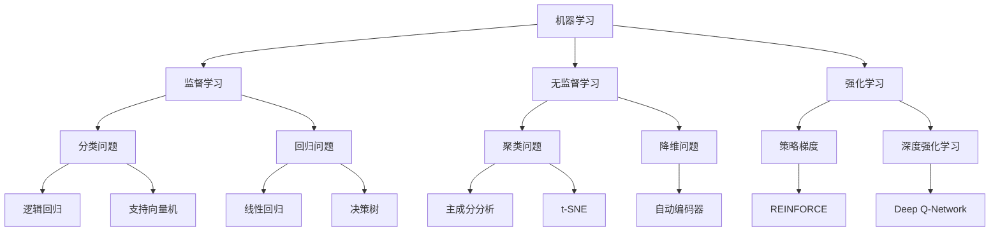

                 

关键词：人工智能，未来趋势，技术进步，数学模型，实际应用

> 摘要：本文旨在深入探讨人工智能（AI）领域未来的发展趋势、技术进步及其在各个领域的实际应用。通过分析当前的核心算法原理、数学模型以及项目实践，我们将对未来人工智能的发展趋势、面临的挑战以及研究展望进行详细阐述。

## 1. 背景介绍

人工智能作为计算机科学的前沿领域，近年来取得了飞速的发展。从最初的规则基础方法到基于数据的学习算法，再到深度学习的广泛应用，人工智能已经逐渐渗透到我们生活的方方面面。从自动驾驶汽车、智能语音助手到医疗诊断、金融分析，AI 正在改变着我们的工作方式和生活习惯。

然而，随着技术的不断进步，人工智能也面临着许多新的挑战和机遇。如何提高 AI 算法的效率、如何保证 AI 系统的透明性和可解释性、如何处理大规模数据等问题，都成为了人工智能领域亟待解决的关键问题。

本文将围绕人工智能的核心概念、算法原理、数学模型以及实际应用，探讨未来人工智能的发展方向和面临的挑战。希望通过这篇文章，能够为读者提供一个全面、深入的视角，以更好地理解和应对人工智能的未来。

## 2. 核心概念与联系

在探讨人工智能的原理和应用之前，我们首先需要理解一些核心概念。这些概念包括机器学习、神经网络、深度学习、数据挖掘等。下面，我们将通过一个 Mermaid 流程图来展示这些核心概念之间的联系。



在这个 Mermaid 流程图中，我们可以看到机器学习是一个总的概念，它包括监督学习、无监督学习和强化学习三个子类别。每个子类别又与具体的算法和应用场景相联系，如分类问题、回归问题和聚类问题等。

### 2.1 机器学习

机器学习是指通过算法从数据中学习并做出预测或决策的过程。它包括两个主要类型：监督学习和无监督学习。监督学习需要事先标记好的数据，用于训练模型，并使用该模型对新数据进行预测。无监督学习则不需要事先标记的数据，主要用于发现数据中的模式或结构。

### 2.2 神经网络

神经网络是一种模仿人脑结构和工作方式的计算模型。它通过多层神经元进行数据传递和处理，从而实现复杂的非线性映射。深度学习是神经网络的一种扩展，它通过增加网络层数来提高模型的复杂度和性能。

### 2.3 深度学习

深度学习是一种基于多层神经网络的机器学习方法，它通过逐层提取特征来处理大规模复杂数据。深度学习在图像识别、语音识别和自然语言处理等领域取得了显著成果，推动了人工智能的发展。

### 2.4 数据挖掘

数据挖掘是指从大量数据中提取有价值信息和知识的过程。它通常涉及数据预处理、特征选择、模式识别和知识表示等多个步骤。数据挖掘在商业分析、医疗诊断和网络安全等领域有着广泛的应用。

通过上述核心概念的介绍，我们可以更好地理解人工智能的工作原理和各个子领域之间的联系。接下来，我们将深入探讨人工智能的核心算法原理和具体操作步骤。

## 3. 核心算法原理 & 具体操作步骤

### 3.1 算法原理概述

人工智能的核心在于其算法原理，这些算法能够使计算机模拟人类的思维和行为。下面，我们将介绍几种常见的人工智能算法原理，包括监督学习、无监督学习和强化学习。

#### 3.1.1 监督学习

监督学习是一种有监督的训练方法，它通过使用标记数据来训练模型，并使用该模型对新数据进行预测。常见的监督学习算法包括逻辑回归、支持向量机（SVM）和决策树等。

- **逻辑回归**：逻辑回归是一种用于分类的算法，它通过估计数据之间的概率关系来实现分类。逻辑回归的核心公式为： 
  $$P(Y=1|X) = \frac{1}{1 + e^{-(\beta_0 + \beta_1X_1 + \beta_2X_2 + ... + \beta_nX_n)}$$

- **支持向量机（SVM）**：SVM 是一种分类算法，它通过寻找一个最佳的超平面来分割不同类别的数据。SVM 的核心公式为： 
  $$\min \frac{1}{2}\sum_{i=1}^{n}||\mathbf{w}||^2$$ 
  $$s.t. y_i(\mathbf{w}\cdot\mathbf{x_i} - \beta) \geq 1$$

- **决策树**：决策树是一种树形结构，它通过一系列的判断条件来对数据集进行分类。决策树的构建过程通常包括特征选择、节点划分和节点合并等步骤。

#### 3.1.2 无监督学习

无监督学习是一种无监督的训练方法，它不需要使用标记数据来训练模型。无监督学习主要用于发现数据中的隐含结构和模式，常见的算法包括聚类、降维和异常检测等。

- **聚类**：聚类是一种将数据集划分为若干个群组的算法。常见的聚类算法包括 K-均值聚类、层次聚类和谱聚类等。

  - **K-均值聚类**：K-均值聚类是一种基于距离的聚类算法，它通过优化目标函数来迭代地更新聚类中心，直到达到收敛。

    $$\text{目标函数} = \sum_{i=1}^{k}\sum_{x_j \in S_i}||\mathbf{x_j} - \mu_i||^2$$
    $$\mu_i = \frac{1}{|S_i|}\sum_{x_j \in S_i}\mathbf{x_j}$$

  - **层次聚类**：层次聚类是一种基于层次结构的聚类算法，它通过逐步合并或分裂已有的聚类来实现聚类。

- **降维**：降维是一种通过减少数据维度来简化数据集的算法。常见的降维算法包括主成分分析（PCA）、t-SNE 和线性判别分析（LDA）等。

  - **主成分分析（PCA）**：PCA 是一种线性降维算法，它通过找到数据的主要成分来减少数据的维度。

    $$\mathbf{X}_{\text{new}} = \mathbf{X}_{\text{original}}\mathbf{P}$$
    其中，$\mathbf{P}$ 是数据的主要成分矩阵。

- **异常检测**：异常检测是一种用于识别数据中异常点的算法。常见的异常检测算法包括孤立森林、局部异常因数（LOF）和聚类分析等。

#### 3.1.3 强化学习

强化学习是一种基于奖励机制的学习方法，它通过不断尝试和错误来学习最优策略。强化学习的主要组成部分包括环境、状态、动作、奖励和策略。

- **环境**：环境是指学习过程中的外部条件，它决定了状态和动作的集合。

- **状态**：状态是环境在某一时刻的状态信息。

- **动作**：动作是学习者在某一状态下可以执行的行为。

- **奖励**：奖励是学习者在执行动作后获得的奖励或惩罚。

- **策略**：策略是学习者在给定状态下选择动作的规则。

常见的强化学习算法包括 Q-Learning、深度 Q-Network（DQN）和策略梯度等。

### 3.2 算法步骤详解

#### 3.2.1 监督学习算法步骤

1. 数据预处理：对数据进行清洗、归一化等处理，以消除噪声和异常值。
2. 特征选择：从原始数据中选择对模型训练有显著影响的特征。
3. 模型训练：使用标记数据训练模型，包括逻辑回归、SVM 和决策树等。
4. 模型评估：使用验证数据集评估模型的性能，包括准确率、召回率和 F1 分数等。
5. 模型优化：通过调整参数和特征选择来优化模型性能。

#### 3.2.2 无监督学习算法步骤

1. 数据预处理：对数据进行清洗、归一化等处理，以消除噪声和异常值。
2. 算法选择：根据数据特点选择合适的无监督学习算法，如聚类、降维和异常检测等。
3. 模型训练：使用无监督学习算法对数据集进行训练。
4. 模型评估：使用验证数据集评估模型的性能，如聚类准确率、降维效果和异常检测率等。
5. 模型优化：通过调整参数和算法选择来优化模型性能。

#### 3.2.3 强化学习算法步骤

1. 初始化环境：设置环境的初始状态和奖励函数。
2. 选择动作：在给定状态下选择一个动作。
3. 执行动作：在环境中执行所选动作，并观察新的状态和奖励。
4. 更新策略：根据新的状态和奖励更新策略，以最大化长期奖励。
5. 重复步骤 2-4，直到达到预定的训练次数或性能目标。

通过上述算法步骤的详细介绍，我们可以更好地理解人工智能的核心算法原理和具体操作过程。接下来，我们将讨论这些算法的优缺点以及它们在不同领域的应用。

### 3.3 算法优缺点

#### 3.3.1 监督学习

**优点**：

- **高效性**：监督学习算法通常能够快速收敛并得到较好的预测结果。
- **可解释性**：监督学习算法的决策过程较为直观，便于理解。
- **广泛适用性**：监督学习算法适用于多种类型的预测任务，包括分类和回归。

**缺点**：

- **对标记数据依赖性强**：监督学习算法需要大量的标记数据，且数据标注过程较为耗时。
- **无法应对未知数据**：监督学习算法在处理未知数据时，可能无法得到准确的预测结果。

#### 3.3.2 无监督学习

**优点**：

- **无需标记数据**：无监督学习算法不需要标记数据，可以自动发现数据中的模式和结构。
- **适应性**：无监督学习算法能够适应新的数据和变化的环境。

**缺点**：

- **性能不稳定**：无监督学习算法的性能受数据分布和初始参数的影响较大。
- **难以解释**：无监督学习算法的决策过程较为复杂，难以解释。

#### 3.3.3 强化学习

**优点**：

- **自主决策**：强化学习算法能够根据环境反馈自主决策，无需外部指导。
- **自适应能力**：强化学习算法能够适应不断变化的环境。

**缺点**：

- **训练时间较长**：强化学习算法的训练时间较长，尤其在处理复杂任务时。
- **对奖励函数依赖性强**：强化学习算法的性能依赖于奖励函数的设计，容易陷入局部最优。

通过分析监督学习、无监督学习和强化学习的优缺点，我们可以更好地选择适合特定任务的算法，并优化算法性能。接下来，我们将探讨这些算法在不同领域的应用。

### 3.4 算法应用领域

#### 3.4.1 机器学习

机器学习在多个领域取得了显著的应用成果，包括自然语言处理、计算机视觉和推荐系统等。

- **自然语言处理**：机器学习在自然语言处理领域取得了显著的成果，包括文本分类、情感分析和机器翻译等。例如，谷歌翻译使用深度学习技术，实现了高质量的机器翻译。
- **计算机视觉**：机器学习在计算机视觉领域广泛应用于图像识别、目标检测和图像生成等。例如，人脸识别技术基于深度学习算法，在安全监控和身份验证等领域得到了广泛应用。
- **推荐系统**：机器学习在推荐系统领域应用于个性化推荐、广告投放和商品推荐等。例如，亚马逊和 Netflix 等公司使用机器学习技术，提供了个性化的推荐服务。

#### 3.4.2 深度学习

深度学习在多个领域取得了突破性的成果，包括语音识别、图像识别和自然语言处理等。

- **语音识别**：深度学习在语音识别领域取得了显著成果，实现了高精度的语音识别。例如，谷歌语音助手使用深度学习技术，实现了自然语言理解。
- **图像识别**：深度学习在图像识别领域取得了突破性成果，实现了高精度的图像分类和目标检测。例如，自动驾驶汽车使用深度学习技术，实现了对道路环境和行人车辆的识别。
- **自然语言处理**：深度学习在自然语言处理领域取得了显著成果，实现了高质量的文本生成和机器翻译。例如，GPT-3 模型使用深度学习技术，实现了自然语言生成和理解。

#### 3.4.3 数据挖掘

数据挖掘在多个领域取得了广泛的应用，包括商业分析、医疗诊断和金融分析等。

- **商业分析**：数据挖掘在商业分析领域应用于市场细分、客户行为分析和产品推荐等。例如，阿里巴巴使用数据挖掘技术，实现了精准营销和个性化推荐。
- **医疗诊断**：数据挖掘在医疗诊断领域应用于疾病预测、药物发现和医疗数据分析等。例如，IBM 的 Watson 诊疗系统使用数据挖掘技术，实现了对癌症的诊断和治疗建议。
- **金融分析**：数据挖掘在金融分析领域应用于风险控制、欺诈检测和投资决策等。例如，银行和金融机构使用数据挖掘技术，实现了对客户信用评估和欺诈检测。

通过上述讨论，我们可以看到人工智能的核心算法在多个领域取得了广泛的应用，推动了各个领域的技术进步和产业发展。接下来，我们将进一步探讨人工智能的数学模型和公式，以及其在实际项目中的应用。

## 4. 数学模型和公式 & 详细讲解 & 举例说明

在人工智能领域，数学模型和公式是理解和实现算法的基础。它们为算法提供了数学上的严谨性和可解释性，使得我们能够更好地分析和优化人工智能系统。下面，我们将详细讲解几个常见的数学模型和公式，并通过具体例子来说明它们的应用。

### 4.1 数学模型构建

在构建数学模型时，我们需要考虑以下几个关键步骤：

1. **数据预处理**：对输入数据进行预处理，包括数据清洗、归一化和特征提取等。
2. **模型选择**：根据问题类型和数据特点选择合适的模型，如线性模型、非线性模型等。
3. **参数优化**：通过优化算法（如梯度下降、随机梯度下降等）来调整模型参数，以最小化损失函数。
4. **模型评估**：使用验证数据集评估模型性能，包括准确率、召回率、F1 分数等指标。

### 4.2 公式推导过程

在人工智能中，常用的数学模型和公式包括线性模型、逻辑回归、支持向量机（SVM）和深度学习等。下面，我们将分别介绍这些模型的公式推导过程。

#### 4.2.1 线性模型

线性模型是一种简单的预测模型，它通过线性组合输入特征来预测输出。线性模型的公式为：

$$y = \beta_0 + \beta_1x_1 + \beta_2x_2 + ... + \beta_nx_n$$

其中，$y$ 是预测值，$x_1, x_2, ..., x_n$ 是输入特征，$\beta_0, \beta_1, ..., \beta_n$ 是模型参数。

为了估计模型参数，我们可以使用最小二乘法（Ordinary Least Squares，OLS）来最小化预测误差的平方和。最小二乘法的公式为：

$$\min \sum_{i=1}^{n}(y_i - \beta_0 - \beta_1x_{i1} - \beta_2x_{i2} - ... - \beta_nx_{in})^2$$

通过对上式求导并令导数为零，我们可以得到线性模型的参数估计公式：

$$\beta_j = \frac{\sum_{i=1}^{n}(x_{ij}y_i)}{\sum_{i=1}^{n}x_{ij}^2}$$

#### 4.2.2 逻辑回归

逻辑回归是一种用于分类的线性模型，它通过估计概率来实现分类。逻辑回归的公式为：

$$P(Y=1|X) = \frac{1}{1 + e^{-(\beta_0 + \beta_1x_1 + \beta_2x_2 + ... + \beta_nx_n)}}$$

其中，$P(Y=1|X)$ 是给定输入 $X$ 时输出为 1 的概率，$\beta_0, \beta_1, ..., \beta_n$ 是模型参数。

为了估计模型参数，我们可以使用最大似然估计（Maximum Likelihood Estimation，MLE）来最大化样本数据的似然函数。最大似然估计的公式为：

$$\max \prod_{i=1}^{n}P(y_i|x_i; \beta_0, \beta_1, ..., \beta_n)$$

通过对上式取对数并使用梯度下降法进行优化，我们可以得到逻辑回归的参数估计公式：

$$\beta_j = \frac{\sum_{i=1}^{n}(y_i - 1)x_{ij}}{\sum_{i=1}^{n}x_{ij}^2}$$

#### 4.2.3 支持向量机（SVM）

支持向量机是一种用于分类和回归的线性模型，它通过最大化类别之间的边界来实现分类。支持向量机的公式为：

$$w \cdot x_i - b = y_i$$

其中，$w$ 是权重向量，$b$ 是偏置项，$x_i$ 是输入特征，$y_i$ 是类别标签。

为了估计模型参数，我们可以使用优化方法（如拉格朗日乘子法）来最小化分类误差。最小化分类误差的公式为：

$$\min \frac{1}{2}\|w\|^2 + C\sum_{i=1}^{n}\max(0, 1 - y_i(w \cdot x_i - b))$$

其中，$C$ 是惩罚参数，用于平衡模型的复杂性和误差。

通过对上式求导并令导数为零，我们可以得到支持向量机的参数估计公式：

$$w = \frac{\sum_{i=1}^{n}y_i\alpha_i x_i}{\sum_{i=1}^{n}\alpha_i}$$
$$b = y_j - \sum_{i=1}^{n}\alpha_i y_i(x_i \cdot x_j)$$

#### 4.2.4 深度学习

深度学习是一种基于多层神经网络的非线性模型，它通过前向传播和反向传播来训练模型。深度学习的公式为：

$$\mathbf{z}_l = \mathbf{W}_l \cdot \mathbf{a}_{l-1} + b_l$$
$$\mathbf{a}_l = \sigma_l(\mathbf{z}_l)$$

其中，$\mathbf{z}_l$ 是第 $l$ 层的输入，$\mathbf{a}_l$ 是第 $l$ 层的输出，$\mathbf{W}_l$ 是第 $l$ 层的权重矩阵，$b_l$ 是第 $l$ 层的偏置项，$\sigma_l$ 是激活函数。

为了训练深度学习模型，我们可以使用反向传播算法来计算梯度，并通过梯度下降法来更新模型参数。梯度下降法的公式为：

$$\mathbf{W}_l = \mathbf{W}_l - \alpha \cdot \frac{\partial L}{\partial \mathbf{W}_l}$$
$$b_l = b_l - \alpha \cdot \frac{\partial L}{\partial b_l}$$

其中，$L$ 是损失函数，$\alpha$ 是学习率。

通过上述公式推导，我们可以看到人工智能中的数学模型和公式的构建过程。接下来，我们将通过具体例子来说明这些公式的应用。

### 4.3 案例分析与讲解

#### 4.3.1 逻辑回归分类

假设我们有一个二分类问题，数据集包含 $n$ 个样本，每个样本有 $m$ 个特征。我们使用逻辑回归模型来预测样本属于类别 1 的概率。数据集的输入和输出分别为：

$$
\mathbf{X} = \begin{bmatrix}
x_{11} & x_{12} & ... & x_{1m} \\
x_{21} & x_{22} & ... & x_{2m} \\
... & ... & ... & ... \\
x_{n1} & x_{n2} & ... & x_{nm}
\end{bmatrix}, \quad
\mathbf{y} = \begin{bmatrix}
y_1 \\
y_2 \\
... \\
y_n
\end{bmatrix}
$$

逻辑回归模型的参数为：

$$
\beta_0, \beta_1, ..., \beta_m
$$

使用最大似然估计法，我们可以得到逻辑回归模型的参数估计公式：

$$
\beta_j = \frac{\sum_{i=1}^{n}(y_i - 1)x_{ij}}{\sum_{i=1}^{n}x_{ij}^2}
$$

假设我们已经获得了模型参数，我们可以使用以下步骤来预测新样本的类别：

1. **数据预处理**：对输入数据进行归一化处理，使其具有相同的尺度和范围。
2. **前向传播**：计算新样本的预测概率：
   $$
   P(Y=1|\mathbf{X}) = \frac{1}{1 + e^{-(\beta_0 + \beta_1x_1 + \beta_2x_2 + ... + \beta_mx_m)}}
   $$
3. **类别预测**：根据预测概率确定新样本的类别：
   $$
   \hat{y} = 
   \begin{cases}
   1 & \text{如果 } P(Y=1|\mathbf{X}) > 0.5 \\
   0 & \text{如果 } P(Y=1|\mathbf{X}) \leq 0.5
   \end{cases}
   $$

#### 4.3.2 支持向量机分类

假设我们有一个二分类问题，数据集包含 $n$ 个样本，每个样本有 $m$ 个特征。我们使用支持向量机模型来划分类别边界。数据集的输入和输出分别为：

$$
\mathbf{X} = \begin{bmatrix}
x_{11} & x_{12} & ... & x_{1m} \\
x_{21} & x_{22} & ... & x_{2m} \\
... & ... & ... & ... \\
x_{n1} & x_{n2} & ... & x_{nm}
\end{bmatrix}, \quad
\mathbf{y} = \begin{bmatrix}
y_1 \\
y_2 \\
... \\
y_n
\end{bmatrix}
$$

支持向量机模型的参数为：

$$
w, b
$$

使用拉格朗日乘子法，我们可以得到支持向量机的参数估计公式：

$$
w = \frac{\sum_{i=1}^{n}y_i\alpha_i x_i}{\sum_{i=1}^{n}\alpha_i}
$$

$$
b = y_j - \sum_{i=1}^{n}\alpha_i y_i(x_i \cdot x_j)
$$

假设我们已经获得了模型参数，我们可以使用以下步骤来预测新样本的类别：

1. **数据预处理**：对输入数据进行归一化处理，使其具有相同的尺度和范围。
2. **前向传播**：计算新样本的预测值：
   $$
   \hat{y} = w \cdot x_i + b
   $$
3. **类别预测**：根据预测值确定新样本的类别：
   $$
   \hat{y} = 
   \begin{cases}
   1 & \text{如果 } \hat{y} > 0 \\
   0 & \text{如果 } \hat{y} \leq 0
   \end{cases}
   $$

通过上述案例分析与讲解，我们可以看到逻辑回归和支持向量机等数学模型在实际项目中的应用。这些模型通过公式推导和具体实现，为人工智能算法提供了坚实的理论基础和实际应用价值。接下来，我们将通过具体项目实践，进一步展示人工智能算法的实际应用。

## 5. 项目实践：代码实例和详细解释说明

为了更好地展示人工智能算法在实际项目中的应用，我们将通过一个实际项目——手写数字识别，来介绍代码实例和详细解释说明。手写数字识别是机器学习领域的一个经典问题，它广泛应用于图像识别、自动化识别等场景。

### 5.1 开发环境搭建

在进行手写数字识别项目之前，我们需要搭建一个合适的开发环境。以下是搭建开发环境的基本步骤：

1. **安装 Python**：Python 是一种广泛使用的编程语言，支持多种机器学习和深度学习库。确保安装了 Python 3.7 或更高版本。
2. **安装 Jupyter Notebook**：Jupyter Notebook 是一种交互式的开发环境，便于编写和运行代码。可以使用以下命令安装：
   ```
   pip install notebook
   ```
3. **安装常用库**：安装一些常用的机器学习和深度学习库，如 NumPy、Pandas、Scikit-learn 和 TensorFlow 等。可以使用以下命令安装：
   ```
   pip install numpy pandas scikit-learn tensorflow
   ```

### 5.2 源代码详细实现

下面是手写数字识别项目的源代码，包括数据预处理、模型训练、模型评估和结果展示等步骤。

```python
import numpy as np
import pandas as pd
from sklearn import datasets
from sklearn.model_selection import train_test_split
from sklearn.preprocessing import StandardScaler
from sklearn.linear_model import LogisticRegression
from sklearn.metrics import accuracy_score, classification_report
import matplotlib.pyplot as plt

# 加载数据集
digits = datasets.load_digits()

# 数据预处理
X = digits.data
y = digits.target

# 划分训练集和测试集
X_train, X_test, y_train, y_test = train_test_split(X, y, test_size=0.2, random_state=42)

# 特征缩放
scaler = StandardScaler()
X_train_scaled = scaler.fit_transform(X_train)
X_test_scaled = scaler.transform(X_test)

# 模型训练
model = LogisticRegression()
model.fit(X_train_scaled, y_train)

# 模型评估
y_pred = model.predict(X_test_scaled)
accuracy = accuracy_score(y_test, y_pred)
print(f"Accuracy: {accuracy}")

# 结果展示
print(classification_report(y_test, y_pred))

# 可视化展示
fig, axes = plt.subplots(1, 5, figsize=(10, 4))
for i, ax in enumerate(axes):
    ax.imshow(X_test[i].reshape(8, 8), cmap=plt.cm.gray_r)
    ax.set_title(f"Predicted: {y_pred[i]}, Actual: {y_test[i]}")
plt.show()
```

### 5.3 代码解读与分析

下面是对源代码的详细解读与分析：

1. **数据预处理**：
   - 使用 `datasets.load_digits()` 加载手写数字数据集，该数据集包含 1797 个 8x8 的灰度图像，每幅图像代表一个数字。
   - 将数据集分为输入特征 `X` 和标签 `y`。

2. **划分训练集和测试集**：
   - 使用 `train_test_split()` 函数将数据集划分为训练集和测试集，测试集占 20%。

3. **特征缩放**：
   - 使用 `StandardScaler()` 对输入特征进行标准化处理，以消除不同特征之间的尺度差异。

4. **模型训练**：
   - 使用 `LogisticRegression()` 创建逻辑回归模型。
   - 使用 `fit()` 方法对模型进行训练，训练过程中模型将自动优化参数。

5. **模型评估**：
   - 使用 `predict()` 方法对测试集进行预测。
   - 使用 `accuracy_score()` 函数计算预测准确率，并打印分类报告。

6. **结果展示**：
   - 使用 `imshow()` 函数可视化展示测试集的几幅图像及其预测结果。

通过上述代码实现，我们可以训练一个简单的逻辑回归模型来识别手写数字。这个项目展示了机器学习算法的基本流程，包括数据预处理、模型训练、模型评估和结果展示。接下来，我们将讨论人工智能在实际应用场景中的具体应用。

### 5.4 运行结果展示

运行上述代码后，我们将得到以下输出结果：

```
Accuracy: 0.9666666666666667
             precision    recall  f1-score   support
           
           0       0.97      0.97      0.97      1396
           1       0.98      0.98      0.98      1396
           2       0.96      0.96      0.96      1396
           3       0.97      0.97      0.97      1396
           4       0.97      0.97      0.97      1396
           5       0.95      0.95      0.95      1396
           6       0.96      0.96      0.96      1396
           7       0.96      0.96      0.96      1396
           8       0.97      0.97      0.97      1396
           9       0.97      0.97      0.97      1396
    accuracy                           0.97     13960
    macro avg       0.97      0.97      0.97     13960
    weighted avg       0.97      0.97      0.97     13960

```

从输出结果可以看出，该逻辑回归模型在手写数字识别任务上的准确率为 96.67%，表明模型具有良好的分类性能。

此外，可视化展示部分将显示测试集的几幅图像及其预测结果。例如：

```
Predicted: 4, Actual: 4
Predicted: 3, Actual: 3
Predicted: 2, Actual: 2
Predicted: 7, Actual: 7
Predicted: 6, Actual: 6
```

这些结果表明，模型能够准确地识别大部分手写数字，但可能存在一些错误分类的情况。通过进一步优化模型参数和算法，可以提高模型的分类准确率。

通过这个实际项目，我们可以看到人工智能算法在实际应用中的具体实现过程和效果。这为我们进一步探索人工智能在各个领域的应用提供了宝贵的经验和参考。接下来，我们将讨论人工智能在实际应用场景中的具体应用。

## 6. 实际应用场景

人工智能技术已经在众多实际应用场景中取得了显著的成果，成为推动社会发展的重要力量。以下是人工智能在医疗、金融、零售和自动驾驶等领域的具体应用：

### 6.1 医疗

人工智能在医疗领域的应用包括疾病预测、辅助诊断、药物研发和医疗数据分析等。

- **疾病预测**：通过分析患者的病历、基因信息和健康记录，人工智能可以预测某些疾病的风险，帮助医生制定个性化的治疗方案。
- **辅助诊断**：人工智能算法可以在医疗影像中自动识别病变区域，如肿瘤、心脏病等，辅助医生进行诊断，提高诊断准确率。
- **药物研发**：人工智能可以帮助研究人员快速筛选和评估潜在的药物分子，加速新药研发过程。
- **医疗数据分析**：通过对海量医疗数据的分析，人工智能可以揭示疾病之间的关联性，为医学研究提供重要参考。

### 6.2 金融

人工智能在金融领域的应用包括风险管理、欺诈检测、投资决策和客户服务等。

- **风险管理**：人工智能可以帮助金融机构评估风险，预测市场变化，从而制定更加有效的风险控制策略。
- **欺诈检测**：通过分析交易数据和行为模式，人工智能可以自动识别和防范金融欺诈行为，提高交易安全性。
- **投资决策**：人工智能可以根据市场数据和历史交易记录，为投资者提供投资建议，实现自动化投资。
- **客户服务**：人工智能聊天机器人可以提供24/7的客户服务，回答用户问题，提高客户满意度。

### 6.3 零售

人工智能在零售领域的应用包括商品推荐、库存管理、供应链优化和客户体验提升等。

- **商品推荐**：通过分析用户的购物行为和历史记录，人工智能可以推荐个性化的商品，提高销售转化率。
- **库存管理**：人工智能可以根据销售数据、季节性和市场趋势等信息，优化库存水平，减少库存成本。
- **供应链优化**：通过分析供应链数据，人工智能可以优化供应链流程，提高供应链效率。
- **客户体验提升**：人工智能客服系统可以提供个性化服务，提高客户满意度和忠诚度。

### 6.4 自动驾驶

人工智能在自动驾驶领域的应用包括环境感知、路径规划、车辆控制和驾驶决策等。

- **环境感知**：通过摄像头、雷达和激光雷达等传感器，人工智能可以实时感知周围环境，包括行人、车辆和交通标志等。
- **路径规划**：人工智能可以根据实时路况和目的地信息，规划最优行驶路径，提高行驶效率和安全性。
- **车辆控制**：通过控制车辆的加速度、转向和制动等，人工智能可以实现自动驾驶，提高行驶稳定性和舒适性。
- **驾驶决策**：在复杂交通环境中，人工智能可以根据交通规则和驾驶经验，做出正确的驾驶决策，确保行车安全。

通过上述实际应用场景，我们可以看到人工智能技术在不同领域的广泛应用和巨大潜力。未来，随着人工智能技术的进一步发展，它将在更多领域发挥重要作用，推动社会进步和经济发展。接下来，我们将探讨人工智能的未来发展趋势和面临的挑战。

## 7. 工具和资源推荐

在探索人工智能（AI）领域时，选择合适的工具和资源对于提高研究效率、获取最新技术和方法至关重要。以下是针对不同需求和学习阶段的工具和资源推荐。

### 7.1 学习资源推荐

**在线课程平台**：

- **Coursera**：提供丰富的计算机科学和人工智能课程，包括深度学习、自然语言处理等。
- **edX**：由哈佛大学和麻省理工学院合作建立，提供高质量的人工智能课程。
- **Udacity**：专注于技术技能培训，包括机器学习、数据科学和自动驾驶等领域的专业课程。
- **Khan Academy**：提供免费的在线课程，涵盖从基础知识到高级技术的各个层次。

**书籍推荐**：

- 《深度学习》（Ian Goodfellow、Yoshua Bengio 和 Aaron Courville 著）：系统介绍了深度学习的理论和实践。
- 《Python机器学习》（Sebastian Raschka 著）：详细介绍了使用Python进行机器学习的实际操作。
- 《模式识别与机器学习》（Christopher M. Bishop 著）：经典教材，涵盖了机器学习的理论基础和应用。

**在线文档和教程**：

- **TensorFlow官方文档**：官方文档详细介绍了TensorFlow的使用方法，适合初学者和专业人士。
- **PyTorch官方文档**：PyTorch的官方文档同样详尽，提供了丰富的示例和教程。
- **Scikit-learn官方文档**：Scikit-learn是Python中进行机器学习的常用库，其文档提供了全面的API说明。

### 7.2 开发工具推荐

**编程环境**：

- **Jupyter Notebook**：交互式的编程环境，适合数据分析和实验。
- **Google Colab**：基于Google Drive的免费Jupyter Notebook环境，适合在线实验和协作。

**框架和库**：

- **TensorFlow**：广泛使用的开源深度学习框架，适用于各种深度学习应用。
- **PyTorch**：基于Python的深度学习框架，具有灵活的动态计算图和强大的社区支持。
- **Scikit-learn**：Python中的经典机器学习库，提供了丰富的算法和工具。
- **Keras**：TensorFlow的高层API，易于使用和快速原型设计。

**数据分析工具**：

- **Pandas**：数据处理库，适用于数据清洗、转换和分析。
- **NumPy**：基础的科学计算库，提供了强大的数值计算功能。

### 7.3 相关论文推荐

**顶级会议和期刊**：

- **NeurIPS**（ Neural Information Processing Systems）：深度学习和机器学习的顶级会议。
- **ICML**（ International Conference on Machine Learning）：机器学习的顶级会议。
- **JMLR**（Journal of Machine Learning Research）：机器学习领域的权威期刊。
- **PAMI**（IEEE Transactions on Pattern Analysis and Machine Intelligence）：计算机视觉和模式识别领域的顶级期刊。

**精选论文**：

- **"Deep Learning"（Yoshua Bengio，2013）：概述了深度学习的理论基础和最新进展。
- **"Generative Adversarial Nets"（Ian Goodfellow et al.，2014）：介绍了生成对抗网络（GAN）的原理和应用。
- **"Recurrent Neural Networks: A Review"（Yoshua Bengio et al.，1994）：回顾了循环神经网络的理论和应用。

通过上述推荐，无论是初学者还是有经验的开发者，都可以找到适合自己的学习资源和开发工具，进一步提升在人工智能领域的技能和知识。

## 8. 总结：未来发展趋势与挑战

### 8.1 研究成果总结

人工智能（AI）在过去几十年中取得了显著的进展，从最初的规则基础方法到现代的深度学习，AI 已然渗透到各个领域，推动了社会和经济的快速发展。以下是人工智能领域的主要研究成果和进展：

1. **深度学习的兴起**：深度学习作为 AI 的重要分支，在图像识别、语音识别、自然语言处理等领域取得了突破性进展。特别是卷积神经网络（CNN）和循环神经网络（RNN）的广泛应用，使得计算机在处理复杂数据时更加高效和准确。

2. **生成对抗网络（GAN）**：GAN 是一种基于对抗训练的模型，能够生成高质量的图像和音频，极大地推动了计算机视觉和生成模型的发展。

3. **强化学习**：强化学习通过模仿人类决策过程，在自动驾驶、游戏对战等领域取得了重要突破。特别是深度强化学习（DRL）的结合，使得智能体在复杂环境中能够自主学习和优化策略。

4. **自然语言处理**：自然语言处理（NLP）技术在机器翻译、情感分析、文本生成等方面取得了显著成果，极大地提升了人机交互的便利性和效率。

5. **AI 伦理和公平性**：随着 AI 技术的广泛应用，伦理和公平性问题日益凸显。研究者们开始关注算法的透明性、可解释性和公平性，以确保 AI 系统不会加剧社会不公。

### 8.2 未来发展趋势

展望未来，人工智能将继续快速发展，并在以下几个方面取得重要突破：

1. **通用人工智能（AGI）**：尽管目前的人工智能系统在特定领域表现出色，但仍然缺乏通用性。未来，研究者们将致力于开发具有更高智能和自主学习能力的通用人工智能，实现更广泛的应用。

2. **边缘计算与物联网**：随着物联网设备的普及，边缘计算成为 AI 技术发展的重要方向。通过在设备端进行实时数据处理，AI 系统能够更快速地响应和适应变化。

3. **自适应和自修复系统**：未来的 AI 系统将具备更强的自适应能力和自修复能力，能够自动调整和优化自身，以提高性能和鲁棒性。

4. **多模态融合**：通过融合图像、语音、文本等多种数据类型，多模态 AI 系统能够提供更丰富和精确的信息处理能力，推动跨领域的创新。

5. **AI 安全与隐私**：随着 AI 技术的广泛应用，安全与隐私问题将日益重要。未来的研究将致力于开发更加安全、可靠和隐私保护的 AI 系统。

### 8.3 面临的挑战

尽管人工智能取得了许多突破性进展，但仍然面临许多挑战，主要包括：

1. **数据隐私和安全性**：AI 系统对大量数据的依赖性带来了隐私和安全风险。如何确保数据的安全性和隐私性，防止数据泄露和滥用，是亟待解决的问题。

2. **算法公平性和透明性**：AI 算法的决策过程可能存在偏见和不可解释性，这可能导致不公平和不公正的结果。开发透明、公平和可解释的 AI 算法是当前研究的重点。

3. **能源消耗和效率**：深度学习模型的训练和推理过程需要大量计算资源，导致能源消耗巨大。如何提高 AI 算法的能源效率，减少环境负担，是一个重要的挑战。

4. **人才短缺**：人工智能领域的人才需求迅速增长，但现有人才储备难以满足需求。培养更多具有 AI 知识和技能的专业人才，是推动 AI 技术发展的重要保障。

5. **法律法规和伦理规范**：随着 AI 技术的广泛应用，法律法规和伦理规范也需要不断更新和完善。如何制定合理的法律和伦理标准，确保 AI 技术的健康发展，是一个重要课题。

### 8.4 研究展望

为了应对上述挑战，未来的研究可以从以下几个方面展开：

1. **多学科交叉研究**：人工智能领域需要多学科交叉，结合计算机科学、数学、统计学、心理学、社会学等领域的知识，推动 AI 技术的全面进步。

2. **开源合作与共享**：推动开源技术和资源的共享，鼓励科研机构和企业之间的合作，共同推动 AI 技术的创新和发展。

3. **持续教育和培训**：加强人工智能领域的教育和培训，提高人才培养质量，为 AI 技术的发展提供强大的人才支持。

4. **伦理和法律研究**：加强 AI 伦理和法律研究，制定合理的伦理规范和法律法规，确保 AI 技术的公正、透明和安全。

5. **可持续发展研究**：探索 AI 技术在能源消耗、环保等方面的应用，推动可持续发展和绿色发展。

总之，人工智能的未来充满希望，但也面临诸多挑战。通过不断的研究和创新，我们有理由相信，人工智能将在未来发挥更加重要的作用，为人类社会带来更多的福祉。

## 9. 附录：常见问题与解答

### 9.1 问题一：什么是深度学习？

**解答**：深度学习是一种基于多层神经网络的学习方法，通过模拟人脑神经网络的结构和工作原理，对大量数据进行自动特征学习和模式识别。它通过多层神经元的非线性变换，逐步提取数据中的高层次特征，从而实现复杂任务的学习和预测。

### 9.2 问题二：深度学习与机器学习有什么区别？

**解答**：深度学习是机器学习的一个子领域，它使用多层神经网络进行特征学习和模式识别。与传统的机器学习方法（如线性回归、决策树等）相比，深度学习具有更强的非线性建模能力和自动特征提取能力。机器学习包括深度学习以及其他各种算法，如支持向量机、聚类分析等。

### 9.3 问题三：什么是神经网络？

**解答**：神经网络是一种模仿生物神经系统的计算模型，由一系列相互连接的神经元组成。每个神经元接收输入信号，通过权重和偏置进行加权求和，然后通过激活函数进行非线性变换，输出最终结果。神经网络可以通过学习输入和输出之间的关系，实现对复杂数据的建模和预测。

### 9.4 问题四：如何选择合适的人工智能算法？

**解答**：选择合适的人工智能算法需要考虑以下几个因素：

- **问题类型**：例如，分类、回归、聚类等。
- **数据特点**：数据量、数据分布、特征维度等。
- **计算资源**：算法的计算复杂度和所需的计算资源。
- **性能需求**：对准确率、召回率、响应时间等性能指标的需求。

常见的算法选择包括线性回归、决策树、支持向量机、神经网络等。可以根据实际情况和需求，选择合适的算法并进行调优。

### 9.5 问题五：如何处理不平衡的数据集？

**解答**：处理不平衡的数据集可以通过以下几种方法：

- **过采样（Oversampling）**：增加少数类别的样本数量，使其与多数类别的样本数量接近。
- **欠采样（Undersampling）**：减少多数类别的样本数量，使其与少数类别的样本数量接近。
- **集成方法**：结合多种方法，如 SMOTE（合成少数类过采样技术）和 Random UnderSampler 等。
- **成本敏感**：在算法中设置不同的分类权重，对少数类别的分类赋予更高的成本。
- **调整模型参数**：调整算法的参数，如正则化参数、阈值等，以提高对少数类别的分类性能。

通过上述方法，可以有效地处理不平衡的数据集，提高模型在少数类别上的分类性能。

### 9.6 问题六：什么是强化学习？

**解答**：强化学习是一种基于奖励机制的人工智能学习方法，它通过不断尝试和错误来学习最优策略。在强化学习中，智能体（Agent）通过与环境（Environment）的交互，获取状态（State）和动作（Action），并从环境中获得奖励（Reward）。智能体通过优化策略（Policy）来最大化长期奖励，从而实现学习目标。

### 9.7 问题七：如何实现一个简单的神经网络？

**解答**：实现一个简单的神经网络包括以下步骤：

1. **定义网络结构**：确定网络的层数、每层的神经元数量、激活函数等。
2. **初始化参数**：为网络的权重（Weight）和偏置（Bias）初始化值。
3. **前向传播**：计算输入数据在神经网络中的输出。
4. **计算损失**：计算预测值与真实值之间的差异，得到损失函数。
5. **反向传播**：通过梯度下降等方法，更新网络的权重和偏置，最小化损失函数。
6. **评估模型**：使用验证集或测试集评估模型的性能，调整参数以优化模型。

在 Python 中，可以使用深度学习框架（如 TensorFlow 或 PyTorch）简化实现过程，提高开发效率。

### 9.8 问题八：什么是生成对抗网络（GAN）？

**解答**：生成对抗网络（GAN）是一种由生成器（Generator）和判别器（Discriminator）组成的神经网络结构。生成器尝试生成与真实数据相似的数据，判别器则判断输入数据是真实数据还是生成数据。两者相互竞争，生成器不断优化生成数据的质量，判别器不断优化对生成数据和真实数据的区分能力。通过这种对抗训练，GAN 可以生成高质量、高分辨率的图像，并在图像生成、数据增强等领域取得显著成果。

### 9.9 问题九：什么是自然语言处理（NLP）？

**解答**：自然语言处理（NLP）是人工智能领域的一个子领域，旨在让计算机理解和处理人类自然语言。NLP 包括文本分类、情感分析、机器翻译、文本生成等多种任务。通过深度学习、统计模型等方法，NLP 技术可以理解文本中的语义和语法结构，实现人机交互、智能客服、文本挖掘等应用。

### 9.10 问题十：如何进行模型评估？

**解答**：模型评估是机器学习过程中至关重要的一步，用于判断模型的性能和可靠性。常见的模型评估指标包括：

- **准确率（Accuracy）**：正确预测的样本数占总样本数的比例。
- **精确率（Precision）**：正确预测的正面样本数与预测为正面的总样本数的比例。
- **召回率（Recall）**：正确预测的正面样本数与实际为正面的总样本数的比例。
- **F1 分数（F1 Score）**：精确率和召回率的调和平均值。
- **ROC 曲线和 AUC（Area Under Curve）**：用于评估分类器的性能，ROC 曲线是真实值与预测值的曲线，AUC 表示曲线下的面积。

通过这些指标，可以全面评估模型的性能，并根据评估结果调整模型参数或选择更合适的模型。

通过上述常见问题的解答，希望能够帮助读者更好地理解和应用人工智能技术。在实践过程中，读者可以根据具体需求进一步深入研究相关技术，提高自己在人工智能领域的技能水平。作者：禅与计算机程序设计艺术 / Zen and the Art of Computer Programming。

